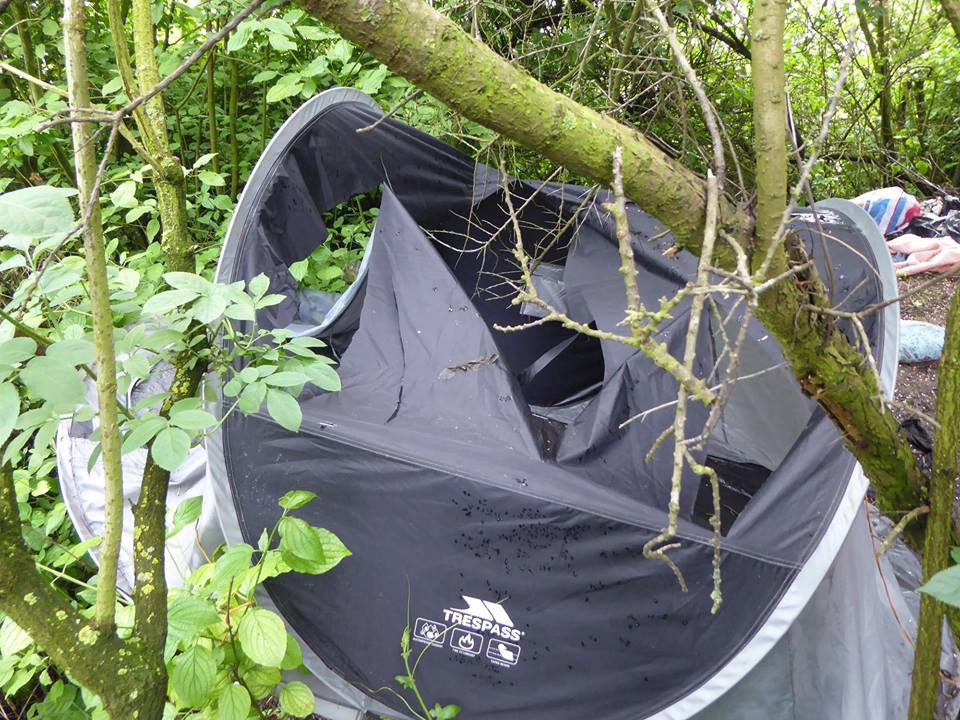
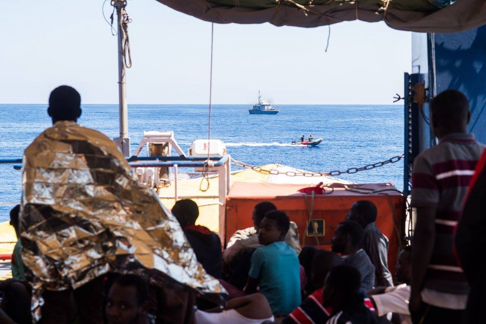
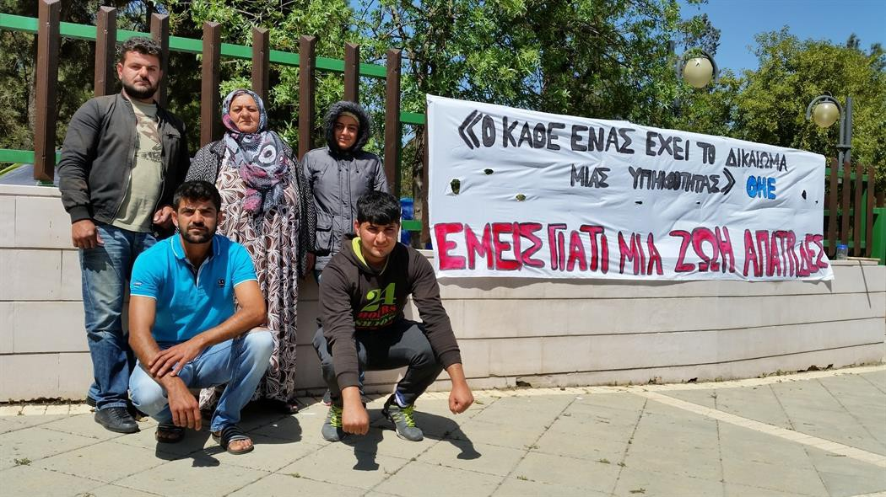
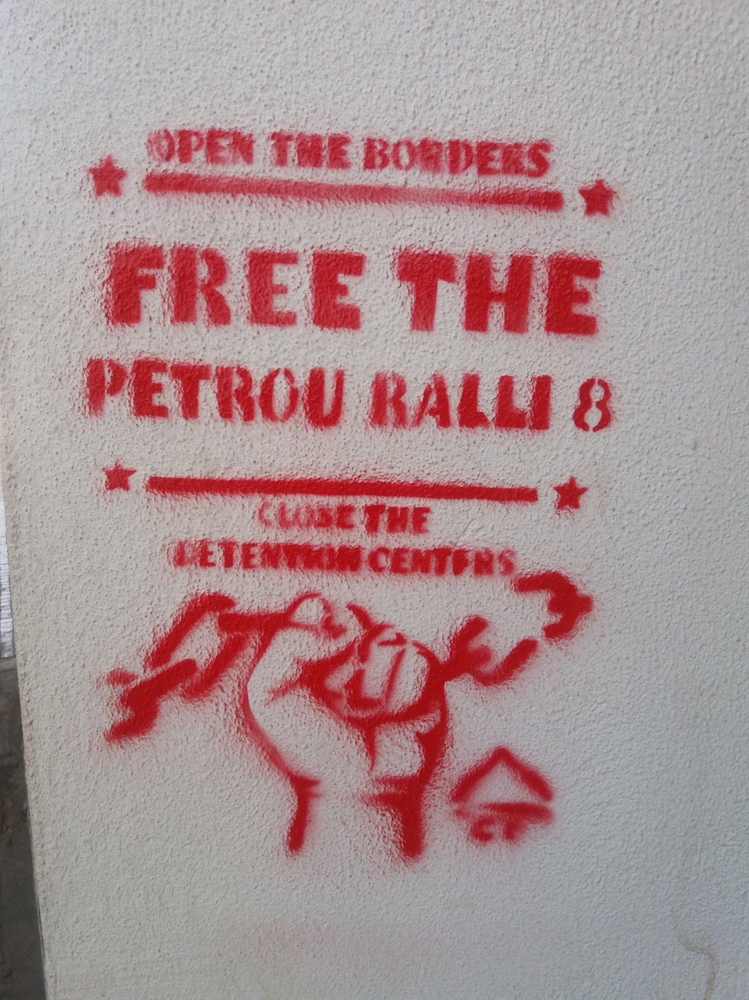

### AYS Daily Digest 24/05/2018: Evacuation in Grande\-Synthe

_Tents destroyed in Grande\-Synthe and Calais / Protests continue in Diavata / 157 people rescued by Sea\-Watch / Stateless Kurdish refugee protest in Cyprus / And more news…_

Photo by Médecins du monde
### FEATURE: Evacuation in Grande\-Synthe

[Mobile Refugee Support](https://www.facebook.com/MobileRefugeeSupport/) says police evacuated a gym in Grande\-Synthe with around 400 people \(300 inside and 100 outside\) on Thursday morning and brought them to shelters\.

The [Dunkirk Refugee Women’s Centre](https://www.facebook.com/refugeewomenscentre/) criticized the lack of information surrounding the eviction, as at the last moment it was announced families would have to leave as well\.

[Office français de l’immigration et intégration](https://twitter.com/OFII_France) \(OFII\) puts the total number of people evacuated at 406, including 170 single adults and 236 people part of a family\. The prefecture said the 50 people living in nearby woods would also be offered shelter\.

[Médecins du monde](https://www.facebook.com/fr.mdm/) , however, notes that between 50 and 80 people still live there, without access to water and decent living conditions\. What was introduced by the prefecture as a protection measure, in reality ended with the destruction of shelters and tents as well as arrests\.

Mobile Refugee Info says that most people had already departed the previous day thanks to warnings by volunteers\. Grande\-Synthe mayor Damien Carême has meanwhile called on Médecins du monde to stop providing assistance to refugees in the area\.

Evictions also continue in Calais\. [Refugee Info Bus](https://www.facebook.com/RefugeeInfoBus/) says these evictions take place three to five times a week and often end with the destruction of tents and personal belongings\.

Refugee families and organizations are organizing a [protest this Saturday](https://www.facebook.com/events/180158452645680/) in Dunkirk over the death of two\-year old Mawda\.
### SEA
#### 157 people rescued by Sea\-Watch and Sea\-Eye

Photo by Sea\-Watch

157 people have been rescued by [Sea\-Watch](https://www.facebook.com/seawatchprojekt/) and [Sea\-Eye](https://www.facebook.com/seaeyeorg/) on Thursday morning after receiving an emergency call from the MRCC in Rome, who also informed the Libyan Coast Guard\.

Sea\-Watch says of the recent operation, “Within 20 minutes our crew had launched the speedboats and shortly afterwards reached the rubber boat\.”

It adds:

> Only hours after the emergency call did the “Libyan coast guard” reach the scene, circled the situation without comment and then disappeared again on the horizon 

Sea\-Watch’s Moonbird aircraft also found a rubber boat and reported its position:

> Moments later, Moonbird spotted a military vessel of EUNAVFOR Med\. Instead of heading for the boat in distress and rescuing it’s passengers, the ship headed north\. Only after considerable pressure by the Moonbird crew, the speedboats of the military ship drove to the boat in distress 

[SOS Méditerranée](https://www.facebook.com/SOSMEDITERRANEE/) adds that 69 people, including 18 women, were then transferred from the Italian navy to the _Aquarius_ \. The rescued include four pregnant women\. MSF says they were told by many of the refugees that they were trapped inside Libya for long periods of time, with some having attempted the dangerous crossing before, only to be intercepted and forcibly returned to Libya\.
### CYPRUS
#### Solidarity event in support of stateless Kurdish hunger strikers

[The Cyprus Refugee Council](https://www.facebook.com/cyrefugeecouncil/) says a solidarity event took place outside the Ministry of Interior in support of stateless Kurdish hunger strikers\.

The hunger strike has been going on for ten days\. They call on the Ministry of Interior to examine their application for citizenship\. The protest had started in 2015, after the rejection of their asylum application by authorities\. In response to their demands, the former Minister of Interior, Mr\. Socratis Hasikos, committed to naturalize them instead of granting them refugee status\. However, their applications for citizenship got collectively rejected — all without an individual justification\.
### GREECE
#### 17 people rescued off the coast of Alexandroupolis

[Ekathimerini](http://www.ekathimerini.com/229000/article/ekathimerini/news/fishermen-rescue-17-migrants-off-alexandroupolis) reports fishermen have rescued 17 people off the coast of Alexandroupolis\.
#### Protests in Diavata

Ekathimerini and ANMA report more than 200 asylum seekers temporarily blocked a highway near the Diavata camp, demanding better living conditions\. The NGO Antigone bemoaned “the lack of central planning and coordination\.” The total number of refugees in Diavata currently exceeds 1,800, despite place for only 800 people\. The majority of refugees live in tents or in an empty building — in totally inappropriate hygiene and safety conditions\.

Doctors of the World is ending its operations on mainland refugee camps, according to [Helpis](http://www.helpis.gr/) , but will continue operating in urban areas\.
#### Event on Lesvos

The Mosaik Support Centre on Lesvos is hosting a meeting and discussion from 4:00pm as part of The Route of Solidarity project, which brings together activists from Spain, Croatia, Italy and Greece\. The discussion will focus on EU border policies, activism on Lesvos and “integration” in everyday life\.
#### Petrou Ralli 8

Photo by AYS

The Athens Fourth Criminal Court has condemned the eight Algerian immigrants of Petrou Rallis for resisting and personal injury towards two police officers\. Seven of them were condemned to a suspended sentence of three years and one\-month and one was condemned to a suspended sentence of three years and two months, as he was supposedly in possession of a weapon\. This person was also the most heavily injured during the protests\.

The eight will appeal the decision\.
#### Information for people in detention

[Refugee Info Bus](https://www.facebook.com/RefugeeInfoBus/) and [Koosh](https://www.facebook.com/Kooshradio/) have produced a new film providing information for people in detention\. The video is in Farsi/Dari\. It includes testimonies of refugees regarding living conditions in detention centres, including the lack of care for sick detainees, bad treatment by police, and cramped cells\.

### BOSNIA & HERZEGOVINA
#### Numbers growing in Velika Kladuša

The [No Name Kitchen](https://www.facebook.com/NoNameKitchenBelgrade/) team, now present in Bosnia in addition to Italy and Serbia, says the number of people is growing in Velika Kladuša\.

The city is close to the Croatian border and only 70 kilometres from the farther Slovenian border\.

NNK started a permanent shower system where around 35 people are living and is providing warm showers for four hours a day for the people living around the city\.

Photo by No Name Kitchen in Velika Kladusa, Bosnia & Herzegovina

Meanwhile, the [Borderfree Association](https://www.facebook.com/borderfreeassociation/) is looking to help people who are in the Salakovac camp, near Mostar\. The camp was recently opened, but without a clear plan from the government or any of the international organizations involved in day to day operations — the IOM, UNHCR, and Red Cross\. They waited until the day after people moved in to call for donations and food\. The local population is bringing help, but it cannot last for a very long\.

Big organizations are complaining that they do not have money to support people on the move in Bosnia\. The same is happening in Sarajevo where over 200 people living in accommodation paid for by IOM and UNCHR get only one meal a day, expecting that the rest will be taken care of by somebody else\. This is the same old story\.
### GERMANY
#### Information on family reunion

A new [booklet in English on family reunion under the Dublin Regulation III](https://www.diakonie.de/fileadmin/user_upload/Diakonie/PDFs/Diakonie-Texte_PDF/Family_Reunion_Dublin_III_advisory_guide_2018.pdf) is available, provided by Refugee Law Clinics Abroad\. The organization says it is supposed to serve as a guideline for advisory services, but also addresses more specific questions and thus should be useful for all people working on the topic\.
### HUNGARY
#### Funds needed for Ahmed H\.

The Free the Röszke 11 Solidarity Network needs some additional help to finance the lawyer of Ahmed H\. You can donate by transferring funds directly to this bank account\. More information on why these funds are needed can be found [here](https://www.facebook.com/11personfreedom/photos/a.1570767169888631.1073741828.1570739649891383/1870734969891848/?type=3) \.

Account holder: Rote Hilfe e\.V\. Ortsgruppe Frankfurt
Catchword: Röszke 11
IBAN: DE24 4306 0967 4007 2383 90
BIC: GENODEM1GLS

**We strive to echo correct news from the ground through collaboration and fairness\.**

**Every effort has been made to credit organizations and individuals with regard to the supply of information, video, and photo material \(in cases where the source wanted to be accredited\) \. Please notify us regarding corrections\.**

**If there’s anything you want to share or comment, contact us through Facebook or write to: areyousyrious@gmail\.com**

_Converted [Medium Post](https://medium.com/are-you-syrious/ays-daily-digest-24-05-2018-evacuation-in-grande-synthe-5fa33a4eafdc) by [ZMediumToMarkdown](https://github.com/ZhgChgLi/ZMediumToMarkdown)._
