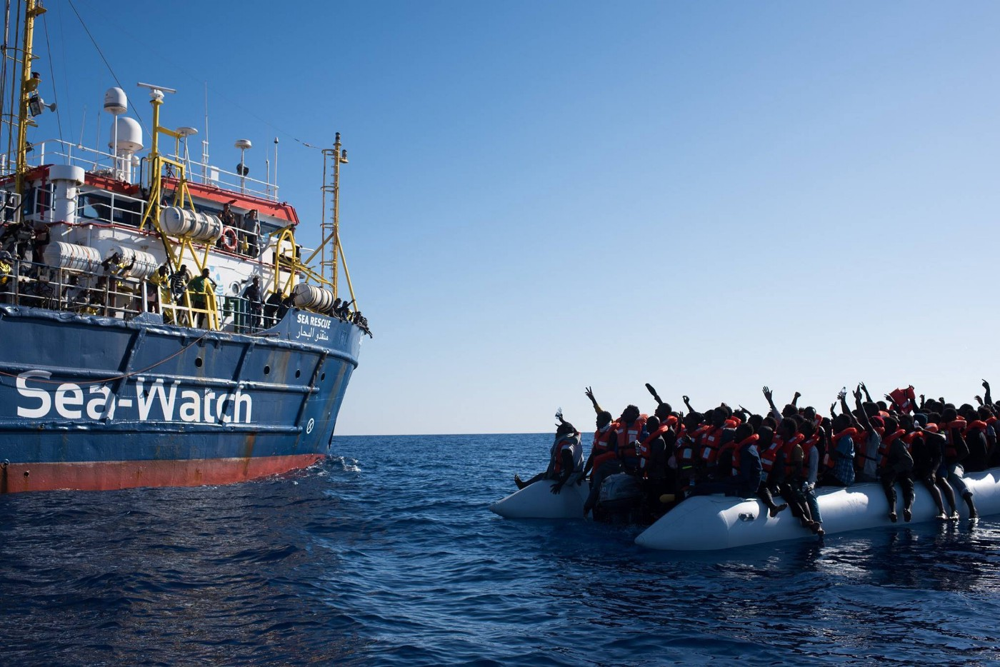
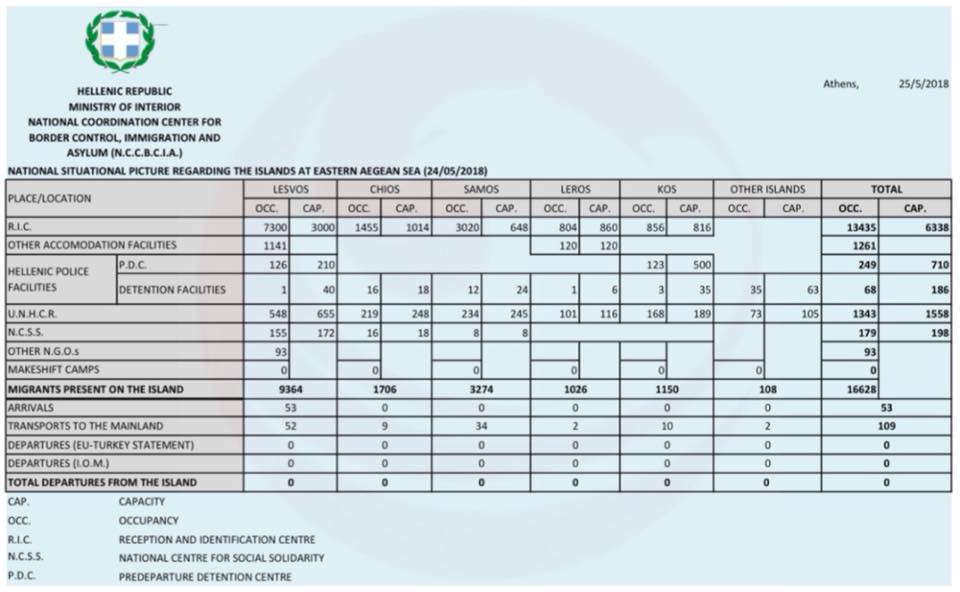
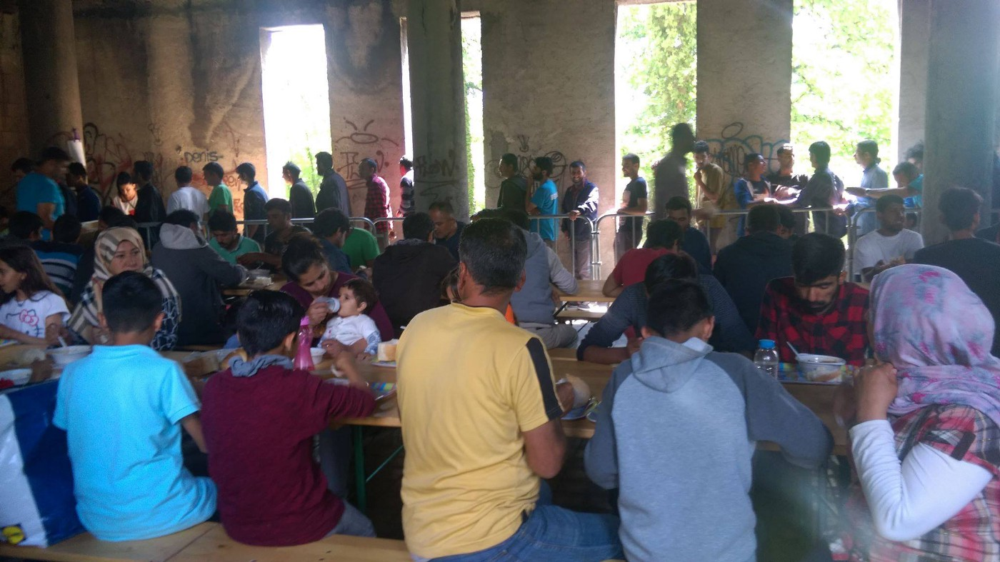
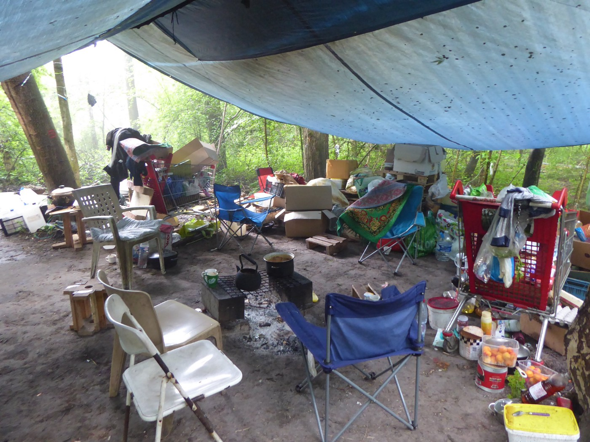
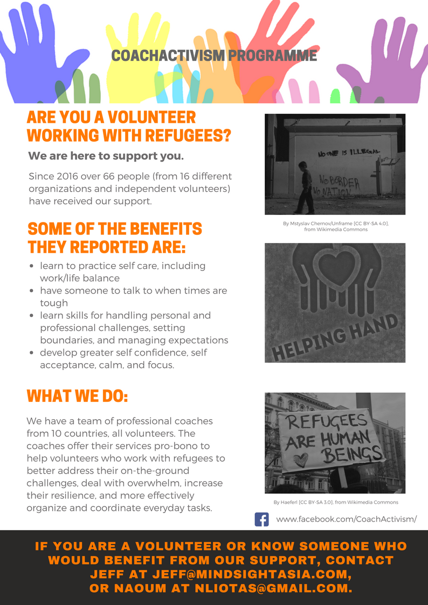

### AYS DAILY DIGEST 25/05/2018: Another absurd deal to stop people from coming to the EU

_EU and Algeria deal connects fight against illigal migration and prevention of Islamist terrorism // EU deal with Libya contributed to the increase in trafficking hubs // More than 400 people saved in 11 hours long rescue operations // Riots in Moria // Balkan countries to strengthen borders_

](assets/1038f888da52/1*6VAT5TTBca4oFRVSmU4ngg.jpeg)

On a rainy day in Ritsona refugee camp, some of the youngest residents decided to go exploring\! Photo [I AM YOU](https://www.facebook.com/iamyourescue/photos/a.1012648618776866.1073741828.1011437275564667/2038734062834978/?type=3&theater&ifg=1)
### Feature

Spain and Algeria signed an agreement aimed and “fighting illigal migration” and “preventin Islamist terrorism”\. In accordance with the new deal, a unit will be form to “investigate human trafficking networks and train police officers to prevent Algerian migrants making their way to Spain”\.

Already this year, with different measures Algerian government reduced the number of people who crossed to Spain for 20 percent\.

The agreement came after the Algeria was criticized for the collective expulsions of undocumented migrants originating from sub\-Saharan countries, including Cameroon, Mali and Nigeria\. The UN High Commissioner for Human Rights [condemned](https://ecre.us1.list-manage.com/track/click?u=8e3ebd297b1510becc6d6d690&id=1f8c90feea&e=c131869ccd) Algeria’s collective expulsion as “deeply alarming and not in line with Algeria’s obligations under international human rights law”, and urged the Algerian government to cease the practice\.

The IOM, who are providing shelter for around 3,500 migrants in Niger, [say](https://ecre.us1.list-manage.com/track/click?u=8e3ebd297b1510becc6d6d690&id=1f1bb9f4de&e=c131869ccd) that dozens of migrants have died in the searing heat while making the crossing from Algeria\.

This deal comes almost at the same time with the research by the REACH initiative, showing that the EU measures implemented in Libya since the beginning of last year contributed to the increase in trafficking hubs on the eastern coast\. As the result of these measures, rising number of people go through Algeria and Chad\.

Even more, following these new measures, people that want to transit through Italy stay for longer periods in warehouses and hidden lodgings along the coast of Lybia, with extremely limited movement\. While waiting to be taken to the coast to leave towards a European country, the migrants are living in poverty, without steady employment, relations with the community and shelter in which they can protect themselves\.
### Afghanistan

While some EU countries cotinue with deportation of people to Afghanistan, [warring news](https://www.humanitarianresponse.info/en/operations/afghanistan/document/ocha-humanitarian-bulletin-afghanistan-issue-75-1-–-30-april-2018) are coming from this country\. Due to drought many people in Afghanistan were forced to leave their homes\. A drought is affecting two out of three provinces with more than two million people expected to become severely food insecure and in need of humanitarian assistance for survival\.

The drought compromised the wheat planting season, too\. By mid\-May, more than 21,000 people had been assessed by humanitarian partners and verified as having migrated due to the drought\.
### Sea

Yesterday, four people from Morocco drowned off the coast of Kenitra, Morocco\. Now 221 lives have been lost in the Western [Mediterranean](https://twitter.com/hashtag/Mediterranean?src=hash) since the beginning of 2018

With the help of Sea\-Eye’s Seefuchs and our Moonbird crew, [Sea\-Watch](https://www.facebook.com/seawatchprojekt/posts/2028438230707581) was able to save more than 400 people from distress, in 11 hours of rescue operations\.

Photo Sea Watch

While volunteers were saving lives, navy ships from the EU avoid to give them support\. [This endangers the lives](https://www.facebook.com/seawatchprojekt/posts/2028303817387689) of 120 people on that boat\.
### Spain

This weekend, more than twenty migrant and anti\-racist groups will [protest](http://www.publico.es/sociedad/colectivos-migrantes-madrid-no-descartan-seguir-pasos-encierro-barcelona-dura-mas-mes.html) against institutional racism and the aliens act, and in support of the migrants in Catalonia and Zaragoza\.
### Italy

A [dead body of a migrant was found](http://www.notav.info/senza-categoria/terzo-migrante-morto-ritrovato-in-montagna-iniziativa-a-claviere-domenica-27-05/) by a hiker by the Frejus creek, next to Bardonecchia, in the Italian side of the French\-Italian border\. This is the third death body founded in just few days alongside the above border, but it’s the first one founded in the Italian site\.

Police authorities have been called on the site, but they haven’t been able to identify the body because the person \(who seems to be a male due to the gender use in the article\) doesn’t own identity documents\.

Most likely, he was lost and given the impossibility of passing through the railway tunnel, which is from long time guarded by military control, he had tried to reach the Stretta valley and the pass of the Scala, but he took a wrong way through a difficult pass\.

In recent [days the bodies](http://torino.repubblica.it/cronaca/2018/05/19/news/_e_blessing_la_giovane_donna_ritrovata_nella_durance_ora_lo_conferma_anche_la_gendarmerie-196802790/) of two other migrants, who had died trying to cross the Italian\-French border, had been recovered on the French side of the Alps: the Nigerian Blessing Matthew had been rescued in Durance where she had drowned trying to escape from the Gendarmerie \(French border police\), while the Senegalese Mamadou [had been found](http://(http://torino.repubblica.it/cronaca/2018/05/23/news/monginevro_identificato_il_secondo_migrante_morto_in_montagna-197191270/) on the path that descends from Monginevro to Briançon, where he was lost dying of exhaustion\.

On May, 14th by [Chez Jesus](https://www.facebook.com/Chez-Jesus-Rifugio-Autogestito-362786637540072/) \(self\-managed mountain shelter\) issued an [statement](http://parolesulconfine.com/la-frontiera-uccide-la-militarizzazione-e-la-sua-arma/) after the body of Blessing Matthew was found under the title “The border kills and the militarisation is its weapon\. Chronicle of an announced death”\.
### Greece

[Aegean Boat Report](https://www.facebook.com/AegeanBoatReport/?hc_ref=ARTLroEkH_CF7E_d9J_WfiBNOYjQ1J6HAyWH4GjgwF1SCrp8UbuuhR8CayJUsjMPywU&fref=nf&hc_location=group) reports about one boath with 58 people that landed in Kampos, Samos north, on Friday morning\.

Latest official updated from Greek government Island situation

As of the end of April, over 9\.000 persons had arrived on the islands and 5\.500 through the Evros land border\. At the end of March, there were 51,000 people on the move registered in Greece\. At the moment, all existing camps and accommodation are overcrowded\. Especially high number of people are in Thessaloniki and Athens where people are, one and again, sleeping in the streets\.

The camps, again, do not provide enough of non\-food items, food, and water sanitation and hygiene\. In addition to that, access to asylum services is also problematic\.

Additionally, many people require medical and psychosocial support\.

In these conditions, life for people on the move but also locals is becoming more dificult\. In camps, it is often reflected in violence among thos who are forced to live in inhuman conditions, like Moria\. According to the reports from Lesvos, last night a group of Iraq’s, Syrians and Afghanistan attacked group of Syrian Kurdish refugee’s in the camp\. Apparently, as a consequence four people are dead and six wounded\. We do not have confirmation about deaths, yet\.

Becasue of the fight, many families left the camp and run away to the city center\.

[Pikpa](https://www.facebook.com/pikpalesvos/posts/2089032121372208) team issued an urgent call for support\. After the fight, they needed to host around 120 people during the night\. Among them many families with children who were terrified after what they went through and some injured people\.

Around 100 people are outside Moria and do not want to go back as they do not feel safe\.

> “We are in emergency and urgently need help\. Please contact us on \+30 6932231607 if you can help with any food and non\-food items\. The list of needs is changing all the time, so please contact us first\. We are also purchasing things we urgently need\. You can make financial donations [here](https://bit.ly/2I6s3t4) \.” 

MSF is covering medicine, towels and toothpaste\. No Borders Kitchen is covering lunch and dinner for Satruday\. Attika Human Support is helping with bottled water for today\. More groups, like Starfish Foundation — Help for refugees on Lesvos, Sea of Solidarity and Help Refugees are supporting with transport, food, bottled water and more\.

[The Unmentionables](https://www.facebook.com/theunmentionablesorg/?hc_ref=ARSeKcZZdZ1Cw2IjpDAlfQgPNfJtGNqv92A5WbAVK80ebkojdAy5mXQa4MEO8aCDQ9E&fref=nf) is looking for a Resource Center Manager based in Athens\. Learn more about the [position](https://theunmentionablesglobal.org/resource-center-manager) \.
### Bosnia

Number of people in the border area between Bosnia and Croatia, cities of Bihać and Velika Kladuša, increses daily\. On Friday, about 400 people came for the mean to Red Cross shelter\. By the end of the day, 60 new people arrived\.

Bihać\. Photo by Red Cross Bihać\.

While people on the move are arriving to Bosnia, countries in the region agreed to strengthen border controls\. The agreement was reached between Bosnia, Montenegro, Croatia and Slovenia\. In Montenegro, Vojislav Dragović, Head of the Border Department, [said](https://ecre.us1.list-manage.com/track/click?u=8e3ebd297b1510becc6d6d690&id=6586a52ab2&e=c131869ccd) erecting a barbed wire fence along its border with Albania is a possibility if an influx of refugees continues\.

Last week the Bosnian Prime Minister Denis Zvizdić [announced](https://ecre.us1.list-manage.com/track/click?u=8e3ebd297b1510becc6d6d690&id=7442b1a5c4&e=c131869ccd) several emergency measures to stem migration, particularly strengthening border patrols\. The “Action Group for the Fight Against Illegal Migration and the Trafficking of Persons,” established three priorities for police forces: protection of the borders, improving legislation, and regulations on readmissions with neighbouring countries\.

At the same time, the government and UN agencies in the region are calling for assistance from EU and other Balkan states\.
### Slovenia

Slovenian police issued a statement saying that number of people who are arriving to this country incresed this year\. According to the official data, until the end of April this year, Slovenian Police [apprehended](https://www.policija.si/images/stories/Statistika/MejnaProblematika/IlegalneMigracije/2018/Januar-april_2018.pdf) 1,226 persons for irregular border\-crossing\. It signifies increase of 280 percent in comaprison to the same period last year\.

Slovenian authorities said they stopped 82 people entering the country last week, with one person drowning in the Kupa River along the border with Croatia\.

A rise in asylum applications has also been reported, with 798 [registered](http://www.mnz.gov.si/si/mnz_za_vas/tujci_v_sloveniji/statistika/) in the four months of 2018, compared to 1,476 in the entire year 2017\.

As reported, the Government Office for the Support and Integration of Migrants, is working on a new contingency plan for responding to the higher number of arrivals, while the Migration Office is in the process of enlisting more staff for the purpose of processing applications\.
### France

During the eviction in Grande\-Synthe, Northern France, 437 people were taken from a gym near Dunkirk and taken on buses to accommodation centres across France\. Among them were many minors\. Many are taken into official child protection structures, but several remain unaccounted for\.

Day after was the first time in weeks that no families have been sleeping outside in Grande\-Synthe\.

[Help Refugee](https://www.facebook.com/HelpRefugeesUK/posts/614517908908886) came with an statement expressing their concerned and disappointed “by the lack of transparency in the entire operation”\.

“Associations were told late the day before, and it was up to volunteers to dessimate this information\. Gymnasium residents were not told the destination of their buses\. This was both frightening and intentionally disempowering for all those involved\.

Refugees sleeping in nearby woods at Puythouck appeared to be arbitrarily arrested, despite claims only smugglers were detained\. Roughly 18 have been arrested, but we don’t yet know the exact figure\.

Whilst we believe getting people off the streets and into better accommodation is a good thing, evictions like this need to be carried out with much more transparency, where authorities work to uphold the dignity of all those involved\.”

After the eviction\. Photo by Help Refugees\.

[Dunkirk / Dunkerque Refugee Women’s Centre](https://www.facebook.com/refugeewomenscentre/?hc_ref=ARSrjyjjXGvUY6Hau-05AxpSm1yZ489Wnkv4f1DEhYcxM6IMsME1s-1odrQO6lfKpg4&fref=nf) , day after the eviction, noticed that among the 120 men and minors already returned to woods around Grande Synthe\. They also report that at least 60 people who had got on a bus after told it was going to an accommodation centre, ralised they will be taken to the detention centre in Calais, and they were detained for several hours\.
### Belgium

The funeral of Mawda, a Kurdish girl of 2 years shot dead following a chase between a pickup truck and the police, should take place later in the week next to Evere\.

A white procession is being [organized for citizens](https://www.rtbf.be/info/societe/detail_deces-de-mawda-les-avocats-de-la-famille-invitent-a-lui-rendre-hommage-mercredi-a-evere?id=9927866&utm_source=rtbfinfo&utm_campaign=social_share&utm_medium=fb_share) wishing to pay tribute to Mawda\.

Meanwhile, Belgian Prime Minister Charles Michel promised a full investigation\. According to the autopsy the [cause of death](https://ecre.us1.list-manage.com/track/click?u=8e3ebd297b1510becc6d6d690&id=43f56155b5&e=c131869ccd) was a bullet entering through the cheek\. The bullet was fired during the police chase of a van carrying 30 people\. This was reportedly followed by a 45 minute stand\-off with police surrounding the vehicle\.

Zakia Khattabi, representing the opposition in Belgium, saw it as a result of repressive migration policies\. “After emotion comes anger\. We demand that the spotlight is put on this case and that political responsibilities are taken\.”
### Scotland

On Friday, the [Scottish Government confirmed](https://www.scotsman.com/news/politics/refugees-in-scotland-to-be-given-right-to-vote-1-4744219) proposals to extend the voting franchise to all resident EU and non\-EU adults, and said this would include those seeking asylum\.
### General

[CoachActivism](https://www.facebook.com/CoachActivism/?hc_ref=ARTirVnvd_hUfNJEKBfCq60GZGUdH6I1lQtsRIyADMk8H9QDsHmijnYx6BM1hgPuI-s&fref=nf)

If you are you working with refugees and need support, get in touch with Coach Activism group\.

Who can use their support:

\- Independent volunteers

\- Organisations \(NGOs, communities, solidarity groups, etc\)

\- Refugees working with refugees

Location: anywhere in the world\.

Contact [Naoum Liotas](https://www.facebook.com/naoumliotas?fref=mentions) for more information, or email: [jeff@mindsightasia\.com](mailto:jeff@mindsightasia.com)

**We strive to echo correct news from the ground through collaboration and fairness\.**

**Every effort has been made to credit organizations and individuals with regard to the supply of information, video, and photo material \(in cases where the source wanted to be accredited\) \. Please notify us regarding corrections\.**

**If there’s anything you want to share or comment, contact us through Facebook or write to: areyousyrious@gmail\.com**

_Converted [Medium Post](https://medium.com/are-you-syrious/ays-daily-digest-25-05-2018-another-absurd-deal-to-stop-people-from-coming-to-the-eu-1038f888da52) by [ZMediumToMarkdown](https://github.com/ZhgChgLi/ZMediumToMarkdown)._
