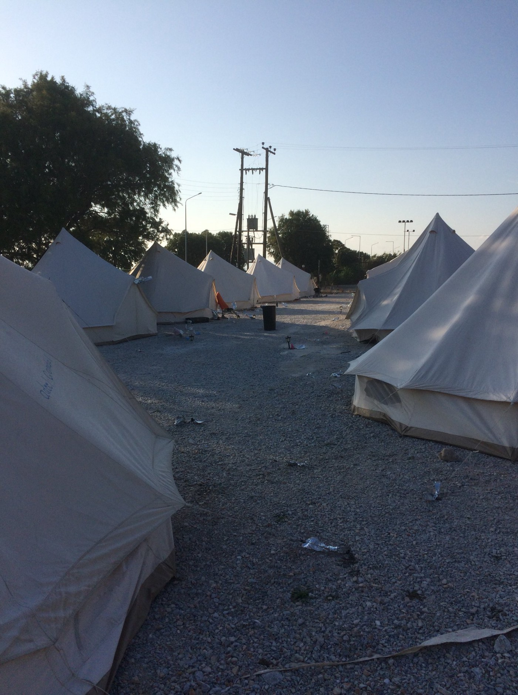
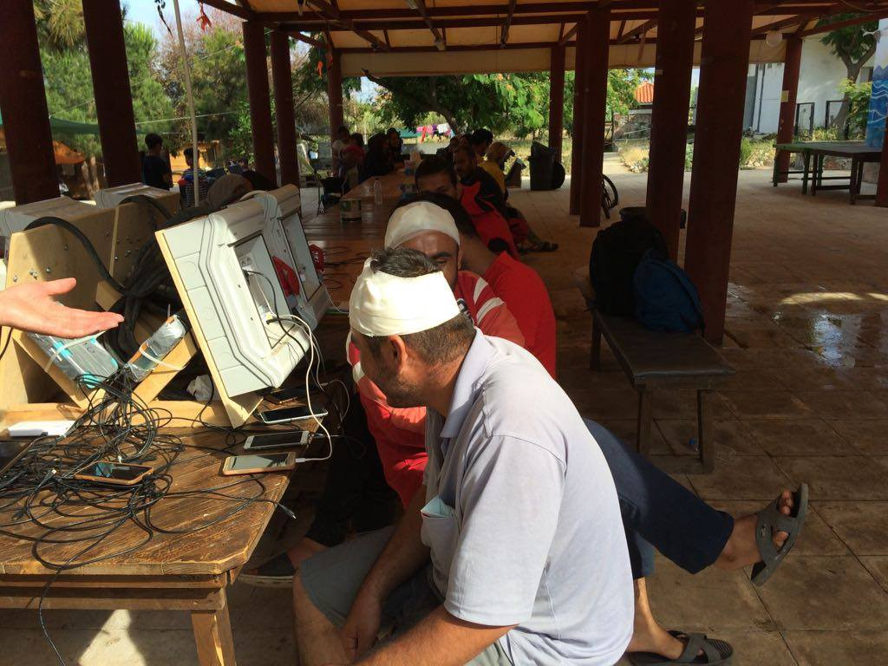
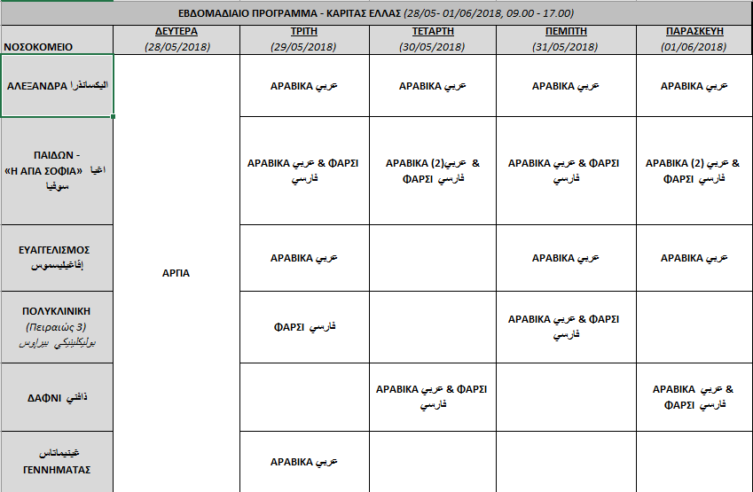
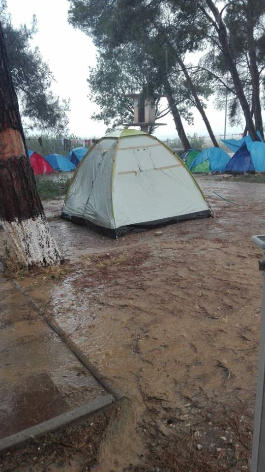
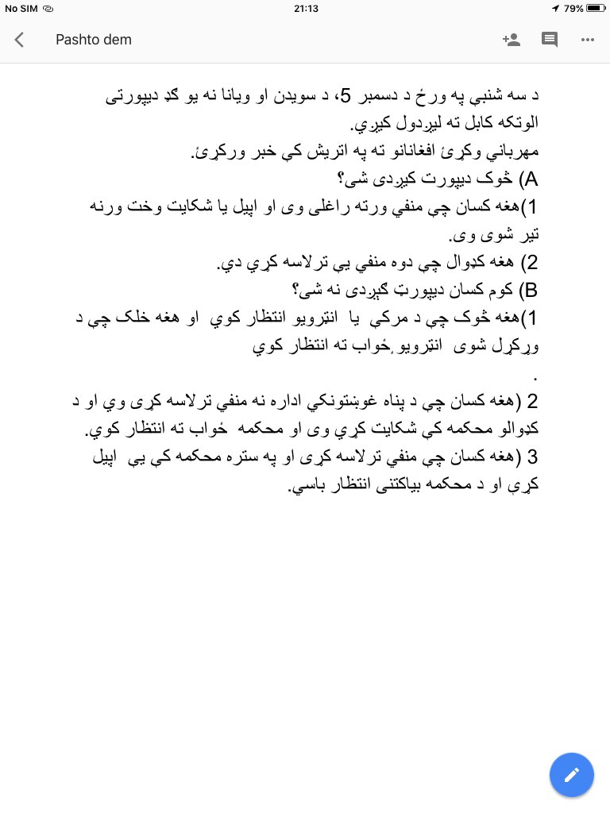
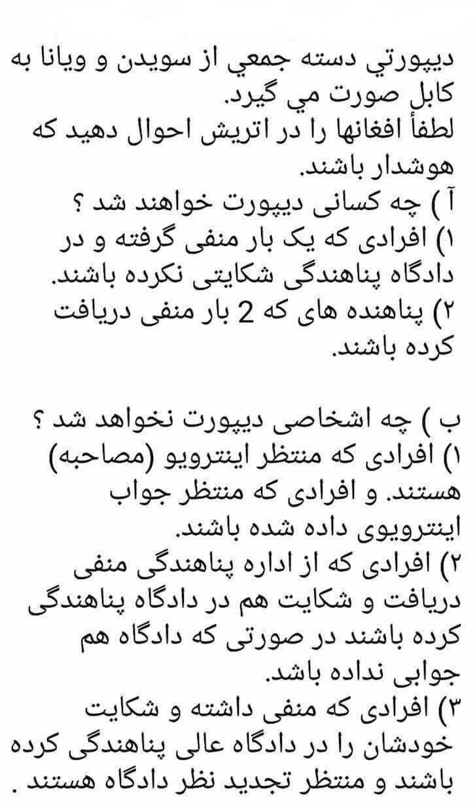
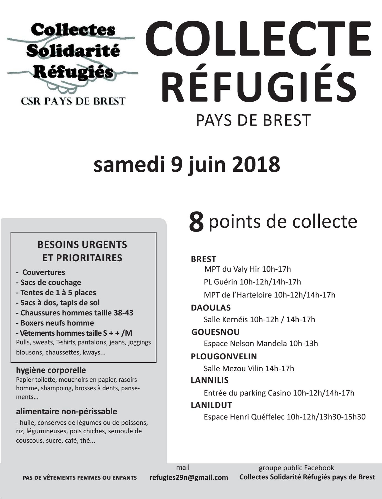
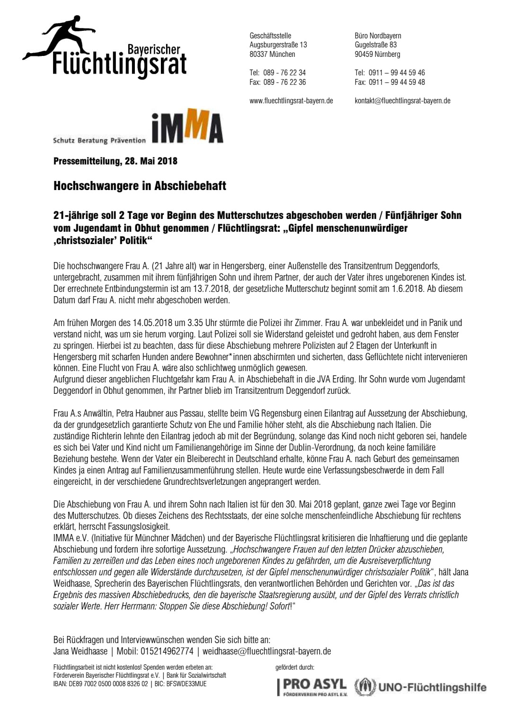

### AYS Daily Digest 28/5/18: A surge of arrivals opens new\-old questions
#### People are being sent back without the chance to lodge claims for international protection in France, Croatia, Spain, Hungary, Poland and Greece, the EU agency says /Italy — Newly arrived people put into hot spot facilities previously proven inadequate for a reception centre / Aid needed for welcoming the Kurdish people from Moria; Many newly arrived people in the north of Greece / Volunteer needs, calls for help and action across Europe and more news

](assets/a258790fb44c/1*j2Y7JPU999ilPp9GFESReA.jpeg)

Photo: [Forum Lampedusa Solidale](https://www.facebook.com/ForumLampedusaSolidale/)

24 people of sub\-Saharan Origin, among them many women of which two were pregnant and two children, arrived around 1pm on the pier of Lampedusa on Monday 28\. 
People who arrived from Libya came to Lampedusa accompanied by the coast guard after being rescued at sea by the Sea Eye team, which is travelling to Sicily with other migrants on board\.
After their arrival they were accompanied inside the hotspot\. 
The centre is still open even though ASGI and others are pushing for its formal closure [on the accounts of violating the human rights](https://thebottomup.it/2018/05/07/chiusura-hotspot-lampedusa/) \. After having extensively written, collected evidence and communicated the unimaginably dire situation the people are in at the hotspot, it seems to be not only available for new arrivals, but it’s obviously overcrowded as well\.

The team that completed the SAR mission rescued 138 people\. Upon the action, the Italian Coast Guard took these 24 mainly vulnerable people from them but not all, even families were separated, it is r [eported](https://sea-eye.org/deutsches-ngo-schiff-mit-ueber-100-menschen-an-bord-nach-seenotrettung-in-gefahr/) \.

■■■■■■■■■■■■■■ 
> **[angela caponnetto](https://twitter.com/AngiKappa) @ Twitter Says:** 

> > EMERGENZA MEDITERRANEO - la piccola nave Ong @[seaeyeorg](https://twitter.com/seaeyeorg) carica di povere anime costretta a sbarcare a Pozzallo perché non ci sono altre navi per trasbordo. Così ha deciso MRCC Roma che ha spostato solo donne, bambini e feriti su motovedetta della GC. 

> **Tweeted at [2018-05-28 15:20:57](https://twitter.com/angikappa/status/1001121154676023298).** 

■■■■■■■■■■■■■■ 

They also reportedly gave them inadequate amount of supplies \(food, water\) \. MRCC ordered the ship to disembark the people, even though it is not safe for so many people to be transferred and they don’t have the supplies to feed the people\. But MRCC refuses them to hand the people over to a bigger ship\.

■■■■■■■■■■■■■■ 
> **[Sea-Watch](https://twitter.com/seawatchcrew) @ Twitter Says:** 

> > After 17 days at sea and 5 rescue missions, #SeaWatch3 is currently approaching #Messina harbour, with 461 pax on board. Among our guests: 103 unaccompanied minors, 14 children and one baby. 

#right2rescue #SafePassage https://t.co/IC77Pkl3Ya 

> **Tweeted at [2018-05-28 05:37:53](https://twitter.com/seawatchcrew/status/1000974418934468608).** 

■■■■■■■■■■■■■■ 

#### GREECE
### Lesvos

■■■■■■■■■■■■■■ 
> **[MSF Sea](https://twitter.com/MSF_Sea) @ Twitter Says:** 

> > Since Saturday, ~900 people, mainly families with young children, have fled #Moria, due to violent clashes in the camp. Capacity is at max. We must find a dignified solution for people fleeing  violence and war. End the containment policy. #opentheislands #Lesvos #EU #migration https://t.co/wpcnOeSkVJ 

> **Tweeted at [2018-05-28 09:22:32](https://twitter.com/msf_sea/status/1001030954104840192).** 

■■■■■■■■■■■■■■ 

All the people who fled the camp are still at the temporary locations\. [Refugee 4 Refugees](https://www.facebook.com/Refugee4Refugees/?hc_ref=ARTJHdS7C7tIKkKssXWXMPOrpS65Oa21LoJSpM-pK026UKY7P7yxUB9JU8WUvFYpVrg&fref=nf) team reports they keep supporting Humans 4 Humanity with the distribution of breakfast, lunch and dinner and we help them with the night shifts\.
[Lesvos Solidarity — Pikpa](https://www.facebook.com/pikpalesvos/?hc_location=group_dialog) team writes: “We have now registered around 350 new people since Friday\. We are working day and night with volunteers, residents and our new guests to coordinate, construct, clean and distribute — and with all the different groups who are supporting us\.” Contact them if you want to donate in the light of recent events in Moria that we previously [reported](ays-daily-digest-26-05-2018-updates-on-the-situation-of-the-syrian-kurds-who-left-moria-272aafe46299) about\.
[Because We Carry](https://www.facebook.com/Becausewecarry/?hc_ref=ARRWEAg2pAq3bGT8j2nQoHvLpwa9C-pLy2GjPlFlSpzOq1n3A37d6i8KC9H08h8jV_g&fref=nf) team is helping by providing pasteries and bananas, you can contact and support their efforts\.

Photos: Pikpa

■■■■■■■■■■■■■■ 
> **[Lesvos Solidarity](https://twitter.com/Lesvosolidarity) @ Twitter Says:** 

> > Our #Pikpa community keeps on expanding. We all work hard to make our new temporary residents to feel safe.
#refugeesgr #moria #lesvos #emergencyPikpa https://t.co/aR2DEuXBi3 

> **Tweeted at [2018-05-28 16:44:38](https://twitter.com/lesvosolidarity/status/1001142212955115520).** 

■■■■■■■■■■■■■■ 

### Athens

[Greek Forum of Refugees](https://www.facebook.com/Greekforumofrefugees/) has published the schedule for CARITAS translation services in Athenian Hospitals in the period: 28\.05–01\.06\.
مترجمين في مستشفيات أثينا 28\.05–01\.06 
پروگرام هفتگی ترجمان ها در شفاخانه های آتن 28\.05–01\.06

](assets/a258790fb44c/1*qsIA9MikY0txPErq7zgeKg.jpeg)

Weekly schedule of the [Victoria Square Project](https://www.facebook.com/VictoriaSquareProject/)
### Northern Greece

> Two years after the Idomeni eviction, Northern Greece is in EMERGENCY MODE again\. Thousands of refugees,lots of kurdish people from the Afrin region in Syria, crossed the land border along the Evros River between Turkey and Greece\.
 

> There are still refugees arriving from the border in Thessaloniki\. The flow is increasing\. Lots of children\. Weather conditions are bad and population in the camps around is growing\. The limit is reached\.
 

> Currently there is one doctor, a nurse and a midwife to see 1300 unregistered people in the Diavata refugee camp and DocMobile sends a team of doctors and nurses during the week to support with medical help\. 
 

> Each day we are seeing 70 patients, and approximately 60% of these are children, many of who have fevers and various infections\. 
 

> Regarding pathologies of adults, it goes from a simple flu or back pain to people with chronic diseases such as heart problems, hypertension, diabetes\.
 

> All these unregistered people, who live in tents or sleep on blankets on the floor of an old school, mostly families, have no access to the Greek health system
 

> They only can go to hospital if there is an emergency\.
 

> Currently there is a big medication shortage and we have completely run out of antibiotics\. We urgently need donations so that we can replenish our medicine stocks\. — [_DocMobile — Medical Help e\.V\._](https://www.facebook.com/docmobile.org/) 

](assets/a258790fb44c/1*w9zhDWlZIac0o8lKoYTQNQ.jpeg)

photos: [DocMobile — Medical Help e\.V\.](https://www.facebook.com/docmobile.org/)

You can help via PayPal at:
[https://paypal\.me/medicalhelp](https://paypal.me/medicalhelp) 
or wire the funds on their bank account:
IBAN: EN82 2585 0110 0230 3744 64
BIC: NOLADE21UEL
### Musicians, come volunteer\!

The music program organized by the group [We Are Here — Community Centre](https://www.facebook.com/WeAreHereCentre/?hc_ref=ARTo_PHHlsXBl_xBBS7TS6KbJffTVQh_M6hNNrZH9IcDED_pMo0t0buaYrn7TuX-B68&fref=nf) in the north of Greece has been growing this year and they need volunteer guitar and piano teachers to keep it running\.

> We organise jam sessions twice a week, plus the students can sign up for individual guitar or keyboard lessons\. They can also rent out instruments to practice in their own time\. 

Find out more about volunteering with We Are Here team and apply to help run music lessons in Nea Kavala this summer at [weareherecentre\.org/apply/](http://weareherecentre.org/apply/)
### Border reception conditions

The Hellenic Council on Refugees has [published](https://www.gcr.gr/index.php/el/news/press-releases-announcements/item/892-nea-ekthesi-tou-esp-gia-tis-synthikes-ypodoxis-sta-synora) a detailed report on the conditions for the reception of asylum seekers at the Greek border\.

> Despite this standardization of practices, however, information provision at the borders still remains highly problematic throughout all process and procedures that asylum seekers undergo for the duration of their RIC based
 

> accommodation\. 

In general, the situation at the EU’s external and internal borders, as officials process migrants entering or passing through the EU, remains tense in some places, finds [the latest report](http://fra.europa.eu/en/news/2018/border-tensions-and-migrant-suffering-continue-feature-member-states) by the European Union Agency for Fundamental Rights on migration\-related fundamental rights issues\. It also highlights some of the hardships many migrants, particularly women and children, continue to experience\.

> Looking at the situation across 14 EU Member States, the report reveals how migrants are being sent back without the chance to lodge claims for international protection in France, Croatia, Spain, Hungary, Poland and Greece\. 

#### HUNGARY

■■■■■■■■■■■■■■ 
> **[HunHelsinkiCommittee](https://twitter.com/hhc_helsinki) @ Twitter Says:** 

> > New #LexNGO2018 text to be published tomorrow, Tuesday 29 May. Sneak peek: it seems that whatever activity would have required the minister's license will now become a criminal act. Our rough translation based on short news reports is in the pic. https://t.co/DNVGsnsKA6 

> **Tweeted at [2018-05-28 14:25:29](https://twitter.com/hhc_helsinki/status/1001107196053159936).** 

■■■■■■■■■■■■■■ 

#### AUSTRIA

[Plattform Refugees Welcome](https://www.facebook.com/plattform.refugees.welcome/?hc_ref=ARSR0d_9_e_eEQOeO-XWEndfykRS6T2XuELNDbQc618YL_V4OW8Cs6PKYvA-1r6tnTA&fref=nf) warns:

Once again, on Tuesday, May 29, more people will be deported to Afghanistan per Charter flight\! Spread the warning call in Farsi and Pashto to all who are potentially concerned:

### Austria doubles down on benefit cuts for foreigners

Following their earlier ruling, the ruling cabinet unveiled its modified plan benefits, which would cap single refugees’ main benefit payment at 563 euros \($656\) a month, rising to the 863 euros available to Austrians if the refugees pass a German test\. Kurz told a news [conference](https://uk.reuters.com/article/uk-austria-politics/austria-doubles-down-on-benefit-cuts-for-foreigners-idUKKCN1IT1BU) \.

> “That means that whoever has insufficient language skills will not be able to claim the full minimum benefit\.” 

Austria’s chancellor has previously [said](http://www.dw.com/en/austrias-sebastian-kurz-wants-to-use-eu-border-guards-in-africa/a-43947006) the EU border patrol guards should be sent to northern Africa\.
#### ITALY
### Humanitarian corridor continues

75 Syrians will arrive to Rome through humanitarian corridors on Tuesday, May 29\. A group comprised mostly of Syrians, will arrive from Lebanon thanks to the humanitarian corridors promoted by the Community of Sant’Egidio, adding to the 1500 people arrived in Italy , France and Belgium , in a legal and safe way, from February 2016\.
### Pressure continues in other places — Ventimmiglia

In the last two weeks, detention and deportation by the law enforcement have been increased, [Progetto20k](https://www.facebook.com/progetto20k/?hc_ref=ARTAdNTdjzlYM4e3ZQHSdvCtcxG3TzZbhSBY7DvCDhQq5hAHYHpnOvMalePc7lWmQ-o&fref=nf) team reports\.

> After the last evacuation of the Roya area, it is almost impossible to sleep outside, because police patrols all key points in the city\. The city now appears more “ empty “ and quietly “ White “, with good peace of tourists and citizens\.
 

> Despite this, people continue to arrive in town and cross the border, largely relying on smugglers: just a few days ago a man was arrested who with a van was carrying 11 boys in exchange for payment of 160 € per head\. As far as areas of origin are concerned, these days we have noticed the increase in Sudanese, Eritreans and general North African migrants\.
 

> The evening distribution of food is made by the French volunteers of the mosque, which the other night guaranteed at least one meal to boys, many of which are fasting for Ramadan month\. 

In these days [Eufemia\-Info&Legal Point](https://www.facebook.com/EufemiaVentimiglia/) continues with mobile and internet services, even if the turnout has slightly dropped\.

![A psychological listening service activated in order to guide the foreign citizen to mental health services on the territory\.
Preventing, recognising and treating adequately mental health problems in migrant subjects is particularly complex because there are linguistic, cultural and pattern differences in search for different aid depending on the population of belonging\. The aim is to provide a reception area aimed at taking into account psychological discomfort and the corresponding critical situations that it refers to, with subsequent sending of the person to the territorial service of competence\.](assets/a258790fb44c/1*QJG197BlUfhc8VaLKAA8kg.jpeg)

A psychological listening service activated in order to guide the foreign citizen to mental health services on the territory\.
Preventing, recognising and treating adequately mental health problems in migrant subjects is particularly complex because there are linguistic, cultural and pattern differences in search for different aid depending on the population of belonging\. The aim is to provide a reception area aimed at taking into account psychological discomfort and the corresponding critical situations that it refers to, with subsequent sending of the person to the territorial service of competence\.
#### FRANCE
### Support the cause

The walk for the welcome of migrants and against the “offence of solidarity” continues, they are [in Burgundy at the moment](https://www.laubergedesmigrants.fr/fr/la-marche-citoyenne/) \. Join them\!

Other events in the support and in solidarity with refugees are taking place:

Britanny prepares aid to support l’Auberge des Migrants:

#### GERMANY
### All the ways Dublin separates people

A pregnant mother and her 5 year old son are being deported back to Italy two days before the maternity protection begins and being separted from the father of the unborn child \(not of the 5 year old\) who will remain in the camp in Germany\. The judge ruled that under Dublin the father is no family relationship between the father and the unborn child\.

The mother is in detention now since 14/5, the deportation to Italy is scheduled for 30/5, the maternity protection by law would begin on 1/6 as the childbirth schedule is on 13/7\. From this day on, it would be forbidden to deport her\.
#### UK

This Tuesday, May 29, at 21\.55h, a 22 year old young women is due to be deported to Uganda, from Heathrow Airport with Qatar Airways\. She is a lesbian and being gay is a criminal offense in Uganda, where there are regular reports of homophobic violence and oppression against the LGBT community and activists\.” There is [a call to tweet Qatar Airlines](https://www.facebook.com/RefugeeInfoBus/posts/2149701391931944) \.

**We strive to echo correct news from the ground through collaboration and fairness\.**

**Every effort has been made to credit organizations and individuals with regard to the supply of information, video, and photo material \(in cases where the source wanted to be accredited\) \. Please notify us regarding corrections\.**

**If there’s anything you want to share or comment, contact us through Facebook or write to: areyousyrious@gmail\.com**

_Converted [Medium Post](https://medium.com/are-you-syrious/ays-daily-digest-28-5-18-a-surge-of-arrivals-opens-new-old-questions-a258790fb44c) by [ZMediumToMarkdown](https://github.com/ZhgChgLi/ZMediumToMarkdown)._
