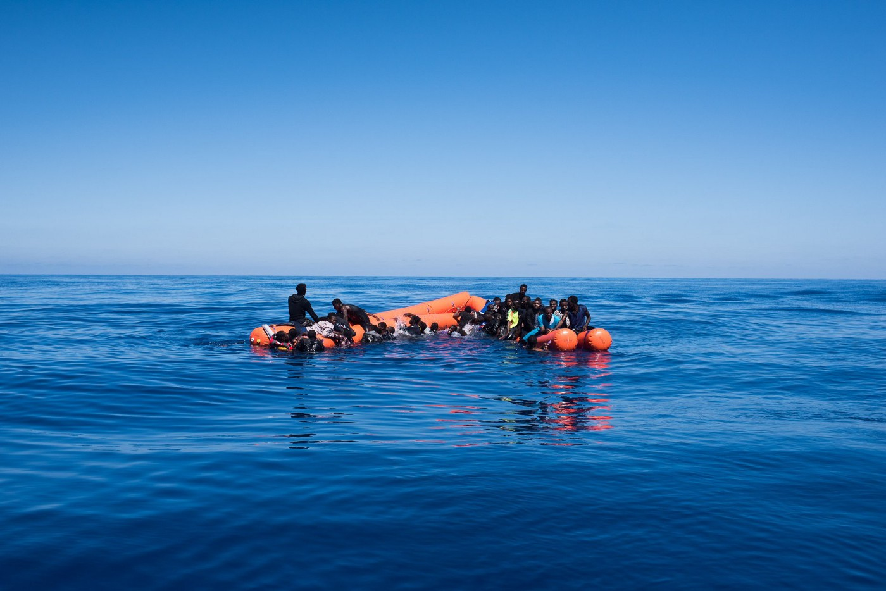
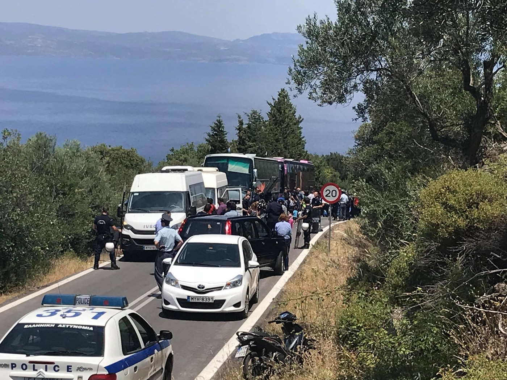
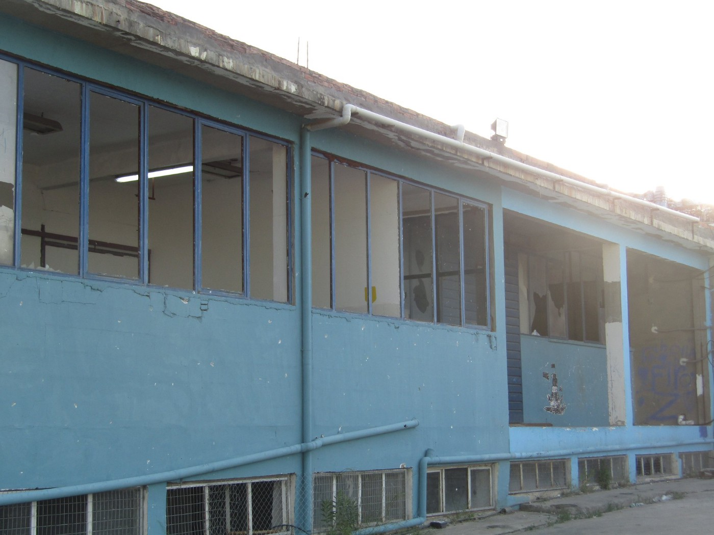

### AYS Daily Digest 29/05/18: Thugs in Uniform — When will the Calais police be held accountable?

_Refugee Poverty In Jordan//Deaths at Sea//Sea Rescues//Camp Raided in Morocco//Update from Lesvos//Protest at Oinofyta camp//Families Abandoned in Elefsina//Update form Ventimiglia//Donation needs IN Dunkirk// And more…_

](assets/c40ca24856c7/1*6P9aNtXqWj2L_gMqRTCKtw.jpeg)

Graphic Credit: [SOS Refugiados](https://www.facebook.com/sosrefugiados/photos/a.991804800860852.1073741828.991768987531100/2016718955036093/?type=3&theater&ifg=1)
### Feature — Police Brutality in Calais

Once again, police officers in Calais are acting like the worst kind of criminals\. While instances of tear gassing and brutality have become so common in the area that they fail to shock any longer, today an especially malicious act was reported\. Just when you think they can go no lower, authorities in Calais find a new moral rock\-bottom\.

A [volunteer group](https://www.facebook.com/RefugeeInfoBus/) working in the area reported that a group of police stole a single shoe each from a group of young refugee men\. “This kind of calculated, extra\-judicial punishment is wholly unacceptable, and we call upon the French state to stamp out these cruel acts of violence and provide refugees with the protection they are legally entitled to\.”

](assets/c40ca24856c7/1*vxYhzakIeRJiVRVhgnI1JQ.jpeg)

Photo Credit: [Refugee Info Bus](https://www.facebook.com/RefugeeInfoBus/)

In yet another instance of pointless brutality, the Calais police slashed refugees tents at the same time as a state\-provided breakfast was being provided on a road a few hundred meters from the encampment\. Why do the forces of “law and order” act so lawlessly way in Calais? How long will they allowed be allowed to abuse refugees with impunity?

](assets/c40ca24856c7/1*UP5N8vCPZ-n1it019jmx5g.jpeg)

Tents slashed by the police in Calais\. Photo Credit: [Refugee Info Bus](https://www.facebook.com/RefugeeInfoBus/)
### Jordan

The UNHCR estimated this week that approximately 85% of Syrian refugee fmailies in Jordan are struggling to survive below the poverty line\. Currently 30,000 refugee families are facing cuts to their already meagre aid packages from the UNHCR\. Based on their own estimates, the UNHCR has only provided for 28% of refugees’ needs in Jordan this year\.
### Morocco

A [Moroccan human rights organization](https://www.facebook.com/AmdhNador/posts/2089152284630369) reported that auxiliary forces attacked a migrant encampment outside of the Spanish enclave of Melilla\. People interviewed after the attack described the authorities beating and hitting men and women alike\.
### Sea\-

Five people have been reported missing today at sea today\. They fell from a dinghy during an EU\-supported pullback attempt by the Libyan Coast Guard this weekend\.

This weekend, a rescue operation by the Sea\-Watch 3 ship was interrupted by the LCG\. While the Sea\-Watch was attempting to rescue over 400 people from three dinghies, the LCG interferred in a typically brutal and reckless way\. The LCG sent a powerboat to the scene, and fearing that they would be taken back to the Libyan detention camps, many people jumped into the water to evade them\.

Eventually the Libyan ship left the scene, and the Sea\-Watch crew asssesed that no one had died in the incident\. After speaking more with the survivors, the Sea\-Watch team realized they were wrong — at least five people went missing in the assault by the LCG\. Given how long ago this took place, it is feared that they have drowned\. The Sea\-Watch team released a statement today on this needless deaths:

> “When we asked one of the witnesses, why he didn’t tell us about his missing friend on his own accord, he answered: “Death was everywhere in Libya, we had our friends being shot in the head right next to us… Losing people is a daily routine for us so we didn’t think this was important\.” 

Photo Credit: Sea\-Watch

It might not be the objective of the so\-called Libyan Coast Guard to cause people’s deaths\. But it is their objective to return them to the country from which they just escaped\. This is what the people on the boats fear most — even more than death at sea, as many told us\. This has repeatedly been the reason for mass panic and loss of life\. And this has to end\. No one should have to die at sea\.”

The deaths reported today are only the latest of many casualties of the LCG\. Yet Italy continues to fund this killer coast guard, ignoring its open attacks on refugees and volunteers ships\. In 2017, Italy and the EU [pledged 258 million euros](https://euobserver.com/migration/140067) to the Libyan Coast Guard\.

The SMH rescue group reported that one of their vessels rescued 10 men from a Dinghy off the coast of Tarifa this morning\. Later in the afternoon it rescued 3 men off a recently wrecked shop\. One man was found dead, and according to the testimony of the survivors, at least one person is still missing\.

Over 600 people have been rescued by SMH in the past three days alone\.

■■■■■■■■■■■■■■ 
> **[IOM - UN Migration 🇺🇳](https://twitter.com/UNmigration) @ Twitter Says:** 

> > 30,300 #migrants &amp; #refugees arrived by sea to Europe in 2018.

655 dead/missing. Learn more ➡️ [missingmigrants.iom.int](http://missingmigrants.iom.int) https://t.co/zfKokSKope 

> **Tweeted at [2018-05-29 09:29:01](https://twitter.com/unmigration/status/1001394974016057344).** 

■■■■■■■■■■■■■■ 

### Greece
#### Islands
#### New Arrivals

One boat was taken to port Samos this morning 08\.00, 34 people\.
No breakdown\.

After wide\-spread fighting within the camp, somewhere between 500 and 1,000 Kurdish refugees walked out of the Moria camp on Lesvos\. Authorities are currently pressuring everyone to return to the overcrowded and unsafe detention center\. Understandably, many have refused\.

The organizations Humans 4 Humanity and Pikpa Solidarity Lesvos are currently supporting those who have left the camp, and working hard to help them with basic accomodation needs and food\.

Pikpa has asked for support during this time— “Our needs list is constantly changing\. You can still reach us on our donation phone to find out more: \+30 6932231607\. Link for financial donations for all of our great supporters abroad: [https://bit\.ly/2I6s3t4](https://l.facebook.com/l.php?u=https%3A%2F%2Fbit.ly%2F2I6s3t4&h=ATOt_rYh5rh3zgye9QKNCbszNNbSjZBylVb8b1XPX0168juvaNZzbQgzOy_4yncGtFDpl7IeE6TwzjEeEggwx6zgEijrUMUpP782Nujcp2PdtJE1E8eNwS5rcRK84qE_qpVFUHDj5Ak75g) \. Thank you all for all your love and support\!”

Humans 4 Humanity provided an update on their efforts as well: “H4H is hosting a large group of the refugees who fled Moria after the fights\. The group that was transferred to Stage 2 in the north, is now transferred to H4H as well\. This means more than 600 stay there now\.

We try to help with everything we can: food, distribution, night shifts, security, transportation, etc\. But we can’t do this without your support\! Please help us helping the people by donating through [https://refugee4refugees\.org/donate/](https://refugee4refugees.org/donate/) ”

People walking to the Humans 4 Humanity encampment from Moria, 29\.05\.18\. Photo Credit: Refugee 4 Refugees
#### Mainland

The outside of Oinofyta camp, 29\.05\.18\. Photo Credit: Lisa Campbell

According to volunteers on the ground, there were protests today outside fo the Oinofyta camp on the mainland\. People from the camp were blocking a road, and demanding to speak to journalists and government representatives, so their voices could be heard\. Their main demand was for the most vulnerable persons to be moved to housing\. While promises have been made along these lines, we have yet to see them be kept\.

](assets/c40ca24856c7/1*ziIuPKxj2d6BWl0jV2eqoQ.jpeg)

Protestors outside the Oinofyta camp, 29\.05\.18\. Photo Credit: [Lisa Campbell](https://www.facebook.com/photo.php?fbid=10216101621350346&set=pcb.10216101625990462&type=3&theater&ifg=1)

Tents are once again, being set up in Malakasa outside of Athens\. How can the UNHCR continue to justify the distribution of tents? The agency repsonsible for the protection of refugees needs to advocate for real accommodation, and real integretation\. We don’t need any more tent cities\.

 believe it as a life\. Preparing hundreds of tent in Malakasa camp and some other camps for the new refugees who will move to Athens from different Islands\. Even if it is like their biggest wish for the refugees to move to Athens, but in reality nothing is going to change for them\. Again tent, again camp and repetition…”](assets/c40ca24856c7/1*PkKpC8u855ZWM-RQtjbDVw.jpeg)

Photo Credit: Arash Hampay\. “Tent to tent, camp to camp, it’s just a repetition that [\#refugees](https://www.facebook.com/hashtag/refugees?source=feed_text) believe it as a life\. Preparing hundreds of tent in Malakasa camp and some other camps for the new refugees who will move to Athens from different Islands\. Even if it is like their biggest wish for the refugees to move to Athens, but in reality nothing is going to change for them\. Again tent, again camp and repetition…”

Volunteers working in the Elefsina camp have published an open letter describing the unaccpetable conditions there, and calling on the UNHCR and Greek authorities to take action\.

There are currently 220 refugees living in the camp, which is located in a building “literally in the middle of nowhere”, according to [the Greek solidarity group](https://www.facebook.com/keerfapage/photos/pcb.2367071619984798/2367069873318306/?type=3&theater) \. The camp is under a highway, near a number of chemical refineries, and far away from any town or village\. Among the people living there are 78 children who have no access to education\. From the volunteers open letter:

](assets/c40ca24856c7/1*s4Jp56vfy6b3A0etCzV2DA.jpeg)

The view inside fo the Elefsina camp\. Photo Credit: [Keerfa](https://www.facebook.com/keerfapage/photos/pcb.2367071619984798/2367069873318306/?type=3&theater)

> The Army is responsible for providing food\. Yet beyond this, there is not any care or provision for people\. We have been in solidarity since the beginning, trying to record needs and help people\. 

> Among those here there are several pregnant women\. It should be emphasised that there have been two miscarriages within four days\. The ambulance in any case takes more than two hours to arrive\. There is a different military doctor every day with a different specialty, there’s no permanent doctor on site\. Almost no one is given the drugs they need\. In fact, there was a doctor who asked patients to call 1535 and make an appointment\. After our intervention, they said the doctor would do it directly\. There is also no OB\-gyn to examine the women\. 

> Among the people here there are many cases of those who have family memebers in other countries and are eligible to join them there\. Every time they see us, they run near us with their cards in hand and ask us when they can start the proceedings\. No authority has yet been found to take over this bureaucratic but so necessary process\. 

Generation 2\.0 is hosting a worshop on your work rights in Greece for refugees\. The event will be in Athens on 30 May, click [here](https://www.facebook.com/events/923855117786577/) for location and more info\.
### Italy

A [solidarity group](https://www.facebook.com/pg/progetto20k/posts/?ref=page_internal) working in the Ventimiglia area has provided a general update on the situation there:

> In the last two weeks, imprisonments and deportations by law enforcement have been increased: last week, three buses left in the same afternoon to Crotone\. After the last evacuation of the river, it is almost impossible to sleep outside, because police patrol all key points in the city… 

> Despite this, people continue to arrive in town and cross the border, largely relying on smugglers: just a few days ago a man was arrested who was carrying 11 boys in a van in exchange for a payment of 160 € per person\. As far as areas of origin are concerned, these days we have noticed the increase in Sudanese, Eritreans and general North African migrants\. 

75 Syrian refugees were transported through a humanitarian flight from Beirut to Italy this week\. They arrived at the Fiumicino airport today\.

Activists are planning two days of demonstrations and marches on the French\-Italian border, from 8 to 10 June\. Click [here](https://www.facebook.com/defendsolidarity/posts/1288917371245554) for more information\.
### Montenegro

The feminist collective [Bona Fide Pljevlja](https://www.facebook.com/bonafide.pljevlja/) continues helping people on the move in Bosnia\. The number of people in need of help increases every day\.

So far, most of the help is coming from the local population\. There has been some minor assistance from the IOM and recently, the Care International NGO has been doing some work in the country\. However, it is not enough and much help is needed\. Donations are useful, but what is most needed is hygiene items, towels, and bed sheets\. [Contact the group](https://www.facebook.com/bonafide.pljevlja/) on facebook if you want to get involved\.
### Bosnia

Th State government in Bosnia had another meeting about the rising number of refugees moving through the country\. According to official data, 4,870 people have been registered in Bosnia since the beginning of the year\. Out of this number, 4,215 expressed the intention to seek asylum and 423 applied for asylum\. Unlike other European authorities, the Bosnian border police do not hesitate to mention they make push backs from the border\. In their regular reports, they have even praised this as a successful strategy\.

In May, hundreds of people were pushed back by the border police\. According to their data, they managed to decrease the number of entries by 50 percent in comparison to the previous month\. Nevertheless, the government has pledged to send even more police officers to the border in coming months\.

At the same time, the government is asking from the Development Bank and Council of Europe for a one million Euro investment\. It is worth mentioning that Bosnian government is by many measures one of the most corrupt in Europe\. In the [most recent global corruption perception index](https://www.transparency.org/news/feature/corruption_perceptions_index_2017) Bosnia ranked lower than all European and Balkan countries that were measured\.

Additionally, a regional meeting has been announced for June 7th when ministers of security and internal affairs will come to talk about further steps\.
### Hungary

The Hungarian government has proposed new legislation that would make it a criminal offense to print leaflets with information for refugees or to give any legal advice to refugees in the country\. The bill even criminalizes offering refugees food\.

These twisted new laws are part of a package of legilsation titled “Stop Soros” by the right\-wing ruling party of Viktor Orban\. These new laws use the billionare philahtropist as a convenient scapegoat for Orban’s extremist agenda\. Howver, the laws clearly target all of civil society in Hungary, as the impose more economic, political, and legal constraints\. In response to the draconian proposals, the Hungarian Helsinki Committee, a civil rights organization in the country that also assists asylum seekers, released a statement:

> 1\. The government is threatening criminal prosecution for those who stand up for human rights\. They are threatening people who support vulnerable people and represent the needy in official procedures\. This goes against everything we call the rule of law or European values\. 

> 2\. Seeking Asylum is a fundamental human right, not a crime\. Whoever is threatened by war, torture, abuse, is entitled to protection under international, European Union and Hungarian law\. If a citizen provides legal assistance or information and is therefore punished, this is also an attack on fair procedure\. 

> 3\. In transit zones, the Hungarian authorities allow access to asylum seekers, following admission to the immigration and asylum office to assess asylum applications\. As long as the asylum procedure is carried out, the seeker is legally residing in the country — based on EU law\. Only the immigration and asylum office can allow foreigners to stay in Hungary, no NGO or private person\. 

> 4\. The Hungarian Helsinki Committee, our colleagues and lawyers provide free legal assistance to those who have already submitted their asylum applications and who have already been admitted to the territory of the country\. Our activities are legal in every way\. 

### France

Volunteers in Paris are organizing weekly photo sessions where people in need of photos for documents can get free service\. The next session will be on 2 June at noon at the Porte de la Villette\. The volunteers are also able to translate information from Arabic, Pashto, Dari, and Tigrinya\. [Click here](https://www.facebook.com/photos4refugees/posts/2160898894142209) for more information\.

Forwarding an appeal from the Dunkirk Refugee Women’s Center:

> With the closure of the gym and NO space in nearby accommodation centres we are increasingly seeing men, women and children being forced to return to the ‘jungle’ \(a woodland area with no shelter\) \. 

> We may be approaching summer, but the temperatures in Northern France are still very cold at night\. Again, we are relying on your amazing support and generosity to ensure we can provide some form of warmth and shelter to our families\. 

> Our stocks are severely depleted, so we are in URGENT need of sleeping bags and 2–4 person tents\. Here are some of the ways in which you can help us provide shelter:
 

> \-Start a collection with your friends, family, colleagues, local community, or with anyone who is willing to help\!
 

> \-Hold a fundraiser on our behalf\.
 

> \-Make a donation via our [Facebook page](https://www.facebook.com/refugeewomenscentre/?hc_ref=ARRS1JZ1UogrdDOyFuEe3zTFj0upHl0cE-TMU9AuJSpMYFnR_ADafWzirkMPiy1D0SQ&fref=nf) or PayPal account\. 

> £10 can provide someone with a sleeping bag\. £25 can buy a good 4 person tent to protect a family from the elements\.Shelter and bedding can make all the difference to ensure someone survives through the night\. If you would like to donate or have any questions drop us a line at supportus@refugeewomenscentre\.com 

On 30 May there will be a solidarity demonstration for undocumented students in the capital, starting at 7pm\. For location and more details, [click here](https://www.facebook.com/events/587834171601618/) \.
### Netherlands

Tomorrow a petition featuring over 65,000 signatures and the endorsement of a dozen human rights organizations will be handed over to the Dutch government\. The signees are demanding that the coutnry stop deporting people back to Afghanistan\. Learn more and sign [here\.](https://actie.degoedezaak.org/petitions/afghanistan-is-onveilig-stuurzenietterug?source=facebook-share-button&time=1527606288)
### Germany

Yesterday, AYS reported on the planned deportation of a pregnant mother and her five year old child from Munich\. If deported, this woman will be seperated from her husband\. Today activists are calling on their supporters to contact Lufthansa to stop the flight, which is scheduled for Wednesday\.

**We strive to echo correct news from the ground through collaboration and fairness\.**

**Every effort has been made to credit organizations and individuals with regard to the supply of information, video, and photo material \(in cases where the source wanted to be accredited\) \. Please notify us regarding corrections\.**

**If there’s anything you want to share or comment, contact us through Facebook or write to: areyousyrious@gmail\.com**

_Converted [Medium Post](https://medium.com/are-you-syrious/ays-daily-digest-29-05-18-thugs-in-uniform-when-will-the-calais-police-be-held-accountable-c40ca24856c7) by [ZMediumToMarkdown](https://github.com/ZhgChgLi/ZMediumToMarkdown)._
