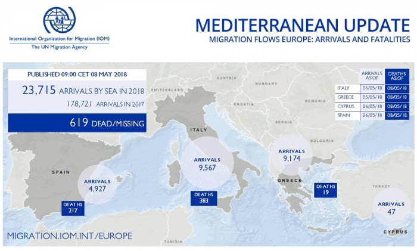
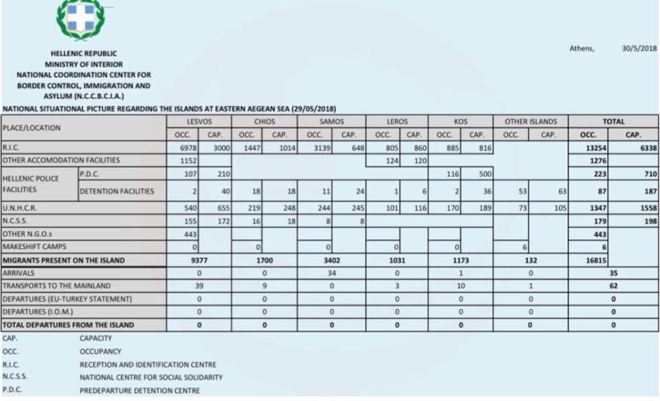
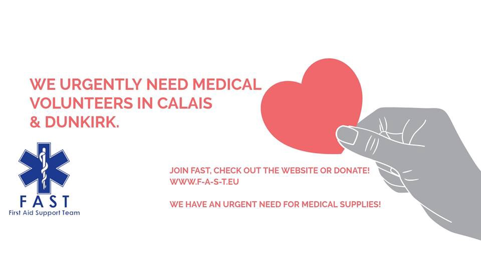
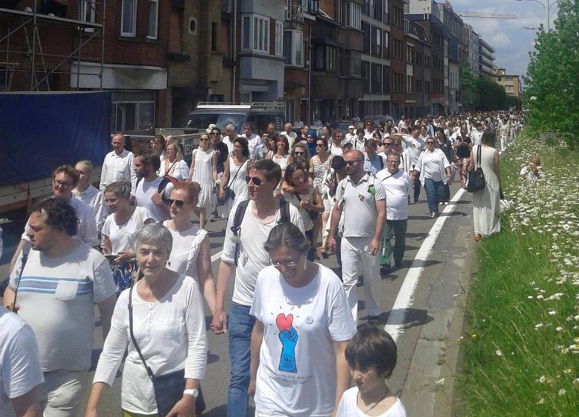
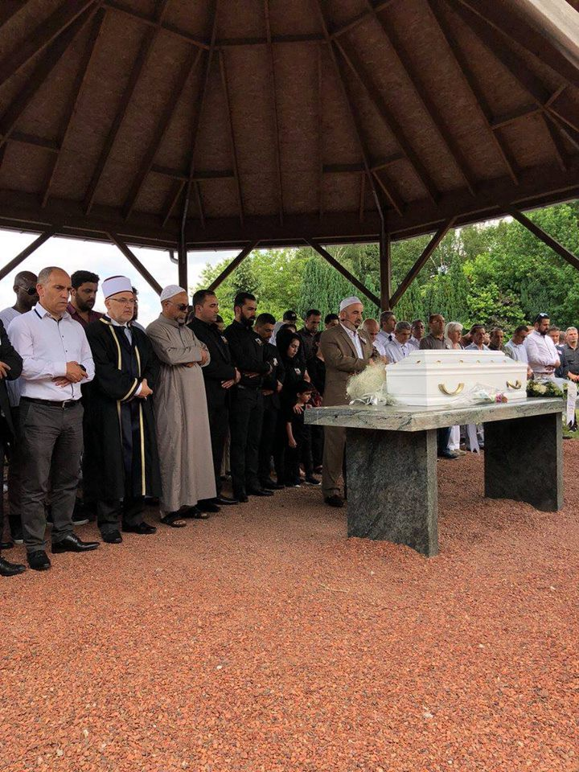

### AYS Daily Digest 30/05/2018–1,016 People Evicted in Paris

Belgium: Thousands of people gather for Mawda’s Funeral /// Greece: Updates from Lesvos /// Greece: Summer School programme in Ritsona Camp /// Italy: eviction halted in Matera province /// Germany: Deportation prevented in Munich /// Sea: new rescues in the Alborean Sea /// more news, info and updates from Afghanistan, Bosnia, Bulgaria, Iceland, Sweden and the UK

 \)](assets/38b1014204ec/1*7cD-XokrQ8z4DGemOAQXpA.jpeg)

Brussels: Thousands of people wearing white at the funeral of Mawda Shawri, 2 years old, shot by a Belgian policeman \(Photos by Michel Henrion — [Help Refugees](https://www.facebook.com/HelpRefugeesUK) \)
#### Feature: 1,016 People Evicted in Paris

The French police, proving that they are indeed slow learners, have once again evicted an unofficial camp in Paris\. This is the 34th eviction of its type within Paris in the last three years, and although the old saying goes, if at first you don’t succeed try, try again, we think may be it’s time for them to experiment with a different tactic\. Maybe instead they could attempt to treat people on the move like human beings who have legal rights\.

The eviction was of the Millenaire camp northeast of Paris\. Of the estimated 1,600 inhabitants 1,016 were relocated to 24 facilities \(mainly gyms\) which have been opened for the purpose of housing people\. Many groups [report](https://www.facebook.com/refucomm/posts/615079342177205?hc_location=ufi) that people will likely return to the urban centre within a short period of time\. This is due to a mix of factors\. The facilities they are taken to are often far away and isolated, making it difficult for them to continue with their lives and access services, and they are not given a choice about where they are taken, which can lead to the breakup of family groups\. As many people who were living at the camp have the legal right to be in France, it also leads to the question of why they are not adequately and independently housed\.

Local activists are furious at this continued police oppression and lack of support for people fleeing war and violence\. State persecution of the vulnerable must stop\.

> _\[The French state\]_ [_let people rot worse than dogs_](https://www.facebook.com/photo.php?fbid=1699750756780791&set=a.105734682849081.12174.100002376500289&type=3&hc_location=ufi) 

The police plan to dismantle a further two camps in Paris ‘as soon as possible\.’
#### People returning to Dunkirk after eviction

[Mobile Refugee Support](https://www.facebook.com/MobileRefugeeSupport/posts/758307091041571?hc_location=ufi) many people are already returning to Dunkirk only one week after the ‘full eviction’\.

> Today has again seen the arrival of new families and groups\. The new “camp” is far from ideal and is situated in a hidden area of woodland behind an industrial plant\. It has however, offered a temporary respite from the daily harassment of the police\. 

More info on how to support them [here](https://www.mobilerefugeesupport.org/) \.

AFGHANISTAN
#### New report on the \(un\)safety of Afghanistan

On the same day when the Interior Ministry in Kabul was [assaulted](https://www.aljazeera.com/news/2018/05/gunfight-explosions-kabul-180530085420063.html) with explosives, the EASO published an update on the security situation in Afghanistan\. This is part of the COI \(Country of Origin Information\) reports, that are supposed to be used as the basis for information to ascertain the safety of repatriations and deportations\.

While spending very few words to describe the general current situation for civilians in the country, the report confirms that the conflict in the country shows few if any sign of decreasing\.

When available, comparison data with 2017 and 2016 show instead an increase in the number of attacks and risk factors\.

Not that European authorities have any interest in reading it\. They continue in their criminal policies of deportation to a country that is safe only in their minds\.

Read the full report [here](https://www.easo.europa.eu/news-events/easo-publishes-country-origin-information-coi-report-security-situation-afghanistan-0) \.

SEA
#### **Arrivals in 2018 reach 30,000 people**

#### **More than 70 people rescued in the Western Mediterranean**

Vessels from Salvamiento Maritimo have rescued 70 people from 6 different dinghies throughout the day\.

■■■■■■■■■■■■■■ 
> **[SALVAMENTO MARÍTIMO](https://twitter.com/salvamentogob) @ Twitter Says:** 

> > Desde las 5.30 horas nuestros medios han estado buscando pateras en El Estrecho. El total de rescatados es de 70 personas de 6 pateras:52 a bordo de la Guardamar Concepción Arenal y 18 a bordo de la S/Arcturus. Ambas embarcaciones se dirigen a Tarifa para proceder al desembarco https://t.co/ol2TKyx2Zf 

> **Tweeted at [2018-05-30 07:37:11](https://twitter.com/salvamentogob/status/1001729217581715456).** 

■■■■■■■■■■■■■■ 

ITALY
#### **Bernalda: Refugees and workers obtain a halt to evictions from squatted buildings**

The [Comitato lavoratori delle Campagne](https://www.facebook.com/comitatolavoratoridellecampagne/) reports that on Wednesday self\-managed migrants and workers of Bernalda, near Matera in the far south, obtained a halt to the evictions planned from the buildings where they are living\.

Hundreds of people occupied the buildings a year ago in May 2017\. Many of them are asylum seekers expelled by reception centres\. On 3 May 2018 the local administration announced the eviction of those squatting in the buildings\. A tug\-of\-war started between the people supporting the squats and the local council\. On Wednesday the eviction was halted indefinitely\.

> It is a small but important victory for the self\-managed workers in the province of Matera who, after weeks of protests, obtained the right to remain in the squatted building indefinitely\. Obviously, their life and work conditions remain precarious and below decent standards and this is thus only the beginning of a struggle to reclaim houses, regular jobs, and documents for all\! 

> We no go go\! Noi non ce ne andiamo\! 

#### **Updates from Ventimiglia**

GREECE
#### Arrivals

One boat [arrived](https://www.facebook.com/AegeanBoatReport/photos/a.285312485325196.1073741828.285298881993223/356285728227871/?type=3&theater) late last night on Kos, carrying 18 people, numbers not confirmed\.

GREEK ISLANDS
#### **Official data on the islands by the Greek Government and UNHCR**

As of 29 May, 16,815 asylum seekers are still on the island\.

Different numbers were published by UNHCR for [Samos](https://www.facebook.com/AegeanBoatReport/photos/a.285312485325196.1073741828.285298881993223/356068194916291/?type=3&theater) and [Lesvos](https://www.facebook.com/AegeanBoatReport/photos/a.285312485325196.1073741828.285298881993223/356169754906135/?type=3&theater) \.
#### **Updates from Lesvos**

The future of the Kurdish people who fled the Moria camp after violent attacks is still uncertain\. What is certain is the unwillingness of local administration and authorities to find a solution\.

As reported by [No Border Kitchen Lesvos](https://www.facebook.com/NBKLesvos/posts/1143359985803789) :

> After heavy fights last Friday in Moria, all the Kurds left Moria, fearing that their safety inside the infamous detention centre was greatly at risk\. Mostly families with children and a small group of single men tried to get to safer locations\. They were held by the Police for several hours in the burning sun\. Then they went into Mytillini to sleep in parks\. A number of volunteers came to their aid, not only to provide for their basic needs, but also the local Antifa came to protect people from potential threats\. 

> _No solution was found for a smaller group to go to Pikpa and a bigger group to go to Karatepe where the Muncipality runs “family camp”\. This was not possible, so they were transferred to Stage 2, a transit centre\. Then yesterday they were removed from the UNCHR run facility and are currently residing at Humans4Humanities, a grass\-roots NGO that is, like Pikpa, over capacity and in no way has the infrastructure to deal with such large numbers of people\. Currently there are still 350 people residing in Pikpa\._ 

> _The authorities of Lesvos have once again shown their incompetence in dealing with life\-threatening situations\. The Kurds, fleeing from war and discrimination, find themselves facing much of the same treatment on this island\. The police and the supposed authorities did nothing to stop the violence in Moria\. Instead of finding a solution themselves they leave all the people with the grass\-roots NGO’s so that they don’t have to worry about the situation\. We cannot trust governmental institutions to safeguard the lives of people for whom they have shown total indifference in past, present and also the future\._ 

> _No Border Kitchen and One Happy Family have been providing food for Pikpa since the onset of the situation, because no one else had the means to do so\. We stand in solidarity with the people of Pikpa, volunteers and migrants who are trying their best to care for the people displaced again in search of safety\._ 

> _For now we wait\. A number of residents of Moria have said the Kurds are no longer welcome, and made a number of very colourful threats for the case when they would come back\. But the current situation is also not sustainable, and the Authorities keep silent\._ 

■■■■■■■■■■■■■■ 
> **[MSF Sea](https://twitter.com/MSF_Sea) @ Twitter Says:** 

> > Those who fled the violence in the overcrowded and inhumane #Moria camp on Saturday are now staying  in volunteer shelters as there is no more space. At one shelter 600 people are sharing 4 toilets with no showers. #Lesvos #Migration #opentheislands #safepassage https://t.co/O4krchaqPI 

> **Tweeted at [2018-05-30 08:24:51](https://twitter.com/msf_sea/status/1001741213068906497).** 

■■■■■■■■■■■■■■ 

Both Pikpa and House of Humanity are completely overwhelmed by the situation and are asking for donations and support:

Also [the Hope project is in need of donations](https://www.facebook.com/HopeProjectKempsons/posts/2076454935968961?hc_location=ufi) : here is their [Amazon Wishlist](https://www.amazon.co.uk/gp/aw/ls/ref=nav_wishlist_lists_1/262-4883455-2134803?ie=UTF8&lid=371VULJZ21AS5&ref_=nav_wishlist_lists_1&ty=wishlist) and their [Crowdfunding](https://mydonate.bt.com/fundraisers/thehopeproject) page\.

According to [local media](http://www.ekathimerini.com/229120/article/ekathimerini/news/plans-for-more-camps-on-lesvos-after-riots) [\(2\)](http://www.keeptalkinggreece.com/2018/05/30/lesvos-make-shift-refugee-camps/) , the emergency situation is creating new tensions between the national government and local authorities over the life and safety of hundreds of people\. Spyros Galinos, the mayor of the island, allegedly declared that he won’t allow this de facto creation of new camps, and is threatening evictions\.

Talks were held on Tuesday between the migration ministry, local authorities and Frontex\. While all parties highlighted the need to reinforce deportations to Turkey, no plan to decongest the islands seems to have been taken\.

MAINLAND GREECE
#### How can I find the asylum office I have to go to?

[Mobile Info Team for Refugees in Greece](https://www.facebook.com/mobileinfoteam/photos/a.1800063030222418.1073741830.1796286800600041/2179405822288135/?type=3&theater) published a guide to Asylum offices in the country:

> There are many occasions in which you have to go to your Regional Asylum Office: For your full registration, your asylum interview, to submit documents or if you simply want to ask about the status of your application\. We have collected addresses and ways to reach the most important Regional Asylum Offices by public transport on our website\. 

You can find it at the following link: [www\.mobileinfoteam\.org/asylum\-offices](http://www.mobileinfoteam.org/asylum-offices) \(also in Arabic and Farsi\.
#### **Summer school programme in Ritsona camp**

Now that the holidays have started, [I Am You](https://www.facebook.com/iamyourescue/photos/a.1012648618776866.1073741828.1011437275564667/2045290895512628/?type=3&theater) will be providing a summer programme for children aged 6–12 in Ritsona\.

> Starting school in a new country, in an unknown language and culture, is hard for anyone\. For the kids at Ritsona, this is combined with the trauma of war and displacement\. Many have missed large chunks of their schooling, so are behind in their education and lack the skills and knowledge for how to behave in class\. 

> With this in mind, extra lessons over the summer are vital in helping the young residents of Ritsona adapt into the new education system and access the hope and support of a classroom environment\. 

> The kids are passionate and eager to learn, and this is where you come in\! 

> Are you living in the Chalkida area and can spare a couple of hours a week to volunteer? If you are a maths, science, or Greek teacher, or have experience teaching art, drama, or dance, we need your help\! 

> \#Education is not a privilege, it is a human right and something ALL children deserve\. 

> Help make this a reality at Ritsona camp\. 

> If you think you can contribute, reach out to us over [Facebook](https://www.facebook.com/iamyourescue/) and we will be sure to get back to you\. “ 

#### **Calls for support and volunteering opportunities**

Volunteers call from Pampiraiki warehouse in Elliniko, Athens:

> Urgent annoucement: 

> On Thursday, 31 May 2018 at 11:00 a\.m\. a container will arrive at our warehouse in Elliniko at the Basketball Stadium\. 

> Please come to help us unload it\. 

Find out more [HERE](https://www.facebook.com/groups/PAMPIRAIKI/?ref=group_header)

Aegean Boat Report needs a graphic designer, interested in making a logo, pro bono\. Read more and contact them [here](https://www.facebook.com/AegeanBoatReport/photos/a.285312485325196.1073741828.285298881993223/356197804903330/?type=3&theater) \.

The [Health Point Foundation Dental/Medical Relief](https://www.facebook.com/healthpointfoundation/photos/a.222810764761510.1073741828.183853795323874/589016008140982/?type=3&theater) is looking for people to join their administration team in Mytilene, Lesvos\. If interested, send them an email: [info@healthpointfoundation\.org](mailto:info@healthpointfoundation.org)

BOSNIA & HERZEGOVINA
#### **Updates and call for donations**

[Cars of hope Wuppertal](https://www.facebook.com/carsofhopewtal/posts/1885050705127162) published an update:

> Not as badly as in \#wuppertal, here too there was violent rain yesterday\. As many refugees have to sleep in the rough we tried to organize tents together with the population and some helpers, and we have now, with some volunteers, set up two old containers\. 

> Today was the first visit, a search for material & tools, and a cost calculation\. 

> Your donations are still urgently needed\. Every euro helps\.
 

>  
 

>  [https://cars\-of\-hope\.org/spenden/](https://cars-of-hope.org/spenden/) 

BULGARIA
#### **29 asylum seekers arrested in Sofia**

Local media [report](https://www.novinite.com/articles/190357/29+illegal+Immigrants+were+Detained+in+the+Filipovtsi+Quarter+of+Sofia%2C) that 29 people were arrested in Sofia’s Filipovtsi district\. It seems they are from Pakistan and Afghanistan, and that children were among them\. The youngest is four years old\. They were found during a routine police operation in the area\.

GERMANY
#### **Deportation halted in Munich**

As reported in the last digest, on Wednesday evening the deportation of Adama K, a highly pregnant woman from Deggendorf was scheduled\.

[Refugee struggle for freedom](https://www.facebook.com/refugeestruggle/posts/830334263824032) states that thanks to her resistance on the plane and the solidarity actions that took place at the airport, the deportation was stopped\. Adama is in the hospital now\.

> Today we have again shown quite clearly that we believe that resistance to deportations is important and legitimate and we can prevent them if we are not intimidated\.
 

>  Solidarity must be practical\.
 

>  Lufthansa, Frontex and Police, stop killing Refugees\! 

FRANCE
#### **FAST \(First Aid Support Team\) needs medical volunteers in Calais and Dunkerque**

BELGIUM
#### **Thousands of people gathered to remember Mawda\.**

 and [Plateforme citoyenne de soutien aux réfugiés Bruxelles](https://www.facebook.com/plateformerefugiesbxl/)](assets/38b1014204ec/1*BnlaCC7Wkyks5vuxbwA6Lg.jpeg)

Photos by Michel Henrion — [Help Refugees](https://www.facebook.com/HelpRefugeesUK) and [Plateforme citoyenne de soutien aux réfugiés Bruxelles](https://www.facebook.com/plateformerefugiesbxl/)

From the [reflections](https://www.dunkirkrefugeewomenscentre.com/single-post/2018/05/30/Voices-13-Mawda) of a long\-term volunteer of the Refugee Women’s centre in Dunkerque:

> \[…\] 

> have you heard how this story ends?
 

> with a police officer’s bullet in a two\-year old’s head
 

> no passport, no rights
 

> her blood stains our hands
 

> her blood stains our society our hearts our land
 

> When the systems that raise us, teach us we are unequal
 

> when the lottery of birth conceives a world inequitable
 

> We face everyday
 

> pulling the hand of justice from a pocket of pain
 

> Using the fire of our anger to melt the frozen glaze
 

> of brutal borders, inhumane policy\.
 

> Negligence\.
 

> Unclaimed responsibility
 

> She was born a refugee, and died a refugee\.
 

> Stolen from her family, her youth, her life trajectory
 

> And with tear\-stained cheeks and weary eyes
 

> We march on
 

> In solidarity and love, we march on\. 

UK
#### Pressure your local MP to speak out about Mawda

The Refugee Women Centre in Dunkerque created a template letter to be sent to local MPs asking them to speak out and raise awareness on the killing of two\-year\-old Mawda Shawri by Belgian police last week\.

The letter reads:

> Although this incident of police violence did not occur on British soil, our government must recognise the increasingly desperate and vulnerable situations people are thrown into by our repressive border policies\. Since the UK has fuelled funds to the French border police, more and more migrants residing along the coastline are forced to take increasingly dangerous measures to cross to the UK\. This has meant increasing numbers heading towards Belgium, renowned amongst migrants for police violence\. Entirely avoidable risks are taken every single day to reach our borders\. 

Download, read and send the full letter [here](https://docs.google.com/document/d/1TQW1U0uSgnjOP1aGH-RSxmYb4taFheKlO4FAlIQBhWY/edit) \.

SWEDEN
#### **New criticism over age exams**

Local media [report](http://www.gp.se/nyheter/efter-kritiken-myndigheter-h%C3%A4nvisar-till-varandra-1.6203001) that both UNICEF and Save the children expressed serious criticism regarding the age exams conducted in the country to establish if refugees are minors or adults\. They call for this practice to be stopped\. Critiques were voiced over the last months by several politicians and researchers\.

Despite this, authorities continue to refer to and blame each other, with no one taking any step towards stopping this practice\.

ICELAND
#### **Deportation to Afghanistan**

No Border Iceland is calling for a boycott action against Iceland Air as they will be forcefully deporting a young Afghan on Thursday morning\.

EU

The European Parliament, in their latest [Legislative Resolution Draft](http://www.europarl.europa.eu/sides/getDoc.do?pubRef=-%2F%2FEP%2F%2FTEXT%2BREPORT%2BA8-2018-0171%2B0%2BDOC%2BXML%2BV0%2F%2FEN&language=EN) has proposed a new regulation relating to Turkey\.

> \(62\) As regards Turkey, the legal basis for protection against persecution and mistreatment is adequately provided by substantive and procedural human rights and anti\-discrimination legislation, including membership of all major international human rights treaties\. In 2014, the European Court of Human Rights found violations in 94 out of 2 899 applications\. **There are no indications of any incidents of expulsion, removal or extradition of own citizens to third countries where, inter alia, there is a serious risk that they would be subjected to the death penalty, torture, persecution or other inhuman or degrading treatment or punishment, or where their lives or freedom would be threatened on account of their race, religion, nationality, sexual orientation, membership of a particular social group or political opinion, or from which there is a serious risk of an expulsion, removal or extradition to another third country** \. In 2014, Member States considered that 23\.1 % \(310\) of asylum applications of citizens of Turkey were well\-founded\. One Member State has designated Turkey as a safe country of origin\. Turkey has been designated as a candidate country by the European Council and negotiations have been opened\. At the time, the assessment was that Turkey sufficiently meets the political criteria established by the Copenhagen European Council of 21–22 June 1993 relating to the stability of institutions guaranteeing democracy, the rule of law, human rights and respect for and protection of minorities, and Turkey will have to continue to fulfil those criteria, if it is to become a member in line with the recommendations provided in the Annual Progress Report\. 

In their discussion of whether Turkey is a safe country, they state that there is no indication that people are being removed to countries were their lives and freedom are at risk; this is because there is no need to remove them from Turkey, their lives and freedom are already at risk\. [EASO](https://www.easo.europa.eu/information-analysis/country-origin-information/country-reports) has not completed a country report on Turkey since 2016 and the European Parliament are working from information from 2014\. During this time period several human rights groups including [HRW](https://www.hrw.org/world-report/2018/country-chapters/turkey) , [Amnesty International](https://www.amnesty.org.uk/turkey-free-idil-eser) and [Freedom from Torture](https://www.freedomfromtorture.org/news-blogs/13_04_2017/torture_in_turkey_past_present_and_future?gclid=CjwKCAjwur7YBRA_EiwASXqIHCwAl1MPzuRHDtjuxBiaE1fuQS7_5kRD5xNOt04_fKpZiUDbV_prVhoCRhMQAvD_BwE) , have all published reports condemning the Turkish Government for multiple human rights abuses\. These have included curtailing media freedoms and imprisoning journalists and activists including Turkey’s Amnesty International Director, Idil Eser\.

In HRWs latest country report, the situation in Turkey seems pretty clear\.

> Hundreds of media outlets, associations, foundations, private hospitals, and educational establishments that the government shut down by decree remained closed in 2017, their assets confiscated without compensation… 

> Turkey is a world leader in jailing journalists and media workers as they face criminal investigations and trials, with around 150 behind bars at time of writing\. Most newspapers and television channels lack independence and promote the government’s political line… 

> Cases of torture and ill\-treatment in police custody were widely reported throughout 2017… There were widespread reports of police beating detainees, subjecting them to prolonged stress positions and threats of rape, threats to lawyers, and interference with medical examinations\. 

> There were credible reports of unidentified perpetrators believed to be state agents abducting men in at least six cases, and holding them in undisclosed places of detention under circumstances that amounted to possible enforced disappearances…\. 

> There remained high rates of child labour and large numbers of child refugees and asylum seekers not attending school, with a particularly precarious situation for non\-Syrians\. 

Maybe it’s time for the European Parliament to update their info\.

**We strive to echo correct news from the ground through collaboration and fairness\.**

**Every effort has been made to credit organizations and individuals with regard to the supply of information, video, and photo material \(in cases where the source wanted to be accredited\) \. Please notify us regarding corrections\.**

**If there’s anything you want to share or comment, contact us through Facebook or write to: areyousyrious@gmail\.com**

_Converted [Medium Post](https://medium.com/are-you-syrious/ays-daily-digest-30-05-2018-1-016-people-evicted-in-paris-38b1014204ec) by [ZMediumToMarkdown](https://github.com/ZhgChgLi/ZMediumToMarkdown)._
