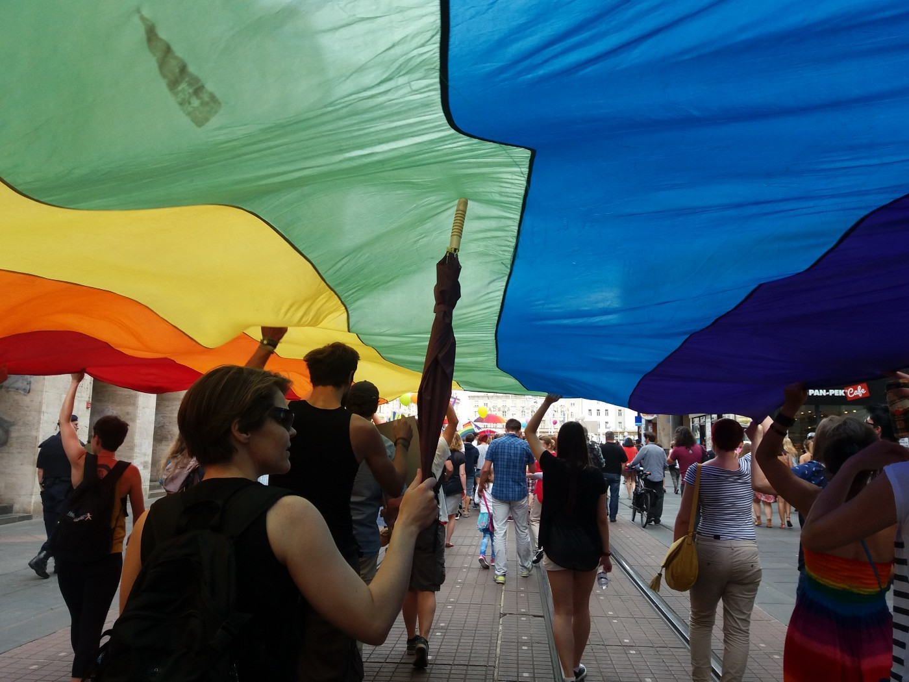

### AYS SPECIAL: Open letter from Turkey

This letter is written to you by the LGBT refugees who have been stranded for years in Turkey without any resettlement option\. We believe you are in a position to shed light on our plight for the concerned authorities in this regard\.

Photo AYS

Seeking asylum is the last solution for the Iranian LGBT individuals who are left with no option but to leave Iran to save their lives\. We have escaped persecution as homosexuality is punishable by death in Iran\.

For the LGBT individuals from Iran, who are mostly deprived of means of seeking asylum by reaching directly to the safe countries, submitting their claims to the UNHCR in Turkey has been the only life\-saving option for years; and since then the UNHCR became familiar with the plight the LGBT individuals in their homeland\.

Over the years, based on this understanding, UNHCR treated them as t **he Vulnerable Group** and privileged them in a faster track in the determination process and referrals to the Canadian Embassy and USA’s International Catholic Migration Commission \(ICMC\), the only main resettlement options available\. In an unprecedented scale due to the Syria crisis, in 2014 & 2015, Turkey was the largest host country, with 2\.5 million refugees\. This has caused long halts on every step and processing time of NON\-Syrian asylum claims handled by UNHCR in Turkey, due to the lack of required experts and personnel\.

Asylum seekers who entered Turkey in 2014 were assigned the very first registration dates with UNHCR after an average of 22 month or much longer, a step which used to be done in 45 days\. Considering that after first registration, the asylum seeker goes through the Determination Interview, Determination Results, Resettlement Interview with the UNHCR, Resettlement Interview with the Embassies, Visa Process, and the period called Exit Ready, the wait time for an LGBT refugee to be resettlement in a safe, third country, jumped from 15 months to 5 years\.

But what was worst was that upon the end of 2015 when Canada pledged to receive 35000 Syrian refugees, the **Canadian Embassy put non\-Syrian resettlement cases to a halt, and advised the UNHCR to stop the referral process** \. This meant no one from the UNHCR, the refugees, and the advocacy organizations were aware or informed that **the vulnerable LGBT refugees confined in the hostile environment of Turkey’s satellite citieswill have to face an unknown amount of pause in their resettlement process\.**

Therefore, due to the abandonment of Iranian LGBT refugees by Canada, the refugees who were referred to Canada for resettlement before, were urged, encouraged, and forced by the UNHCR to switch to U\.S\. for resettlement\. Also other refugees, were referred to U\.S resettlement in the absence of any other resettlement option\.

They were making some progress until U\.S\. President Donald Trump unveiled his travel and refugee ban in January 2017, which brought the country’s refugee program to an indefinite halt\. Since then, the ban has faced numerous court challenges and delays without any progress in the refugee resettlement process, leaving the refugees stranded for the last one and half year since the first refugee ban\. **The vulnerable LGBT refugees who have already undergone long processes with UNHCR and country interviews, are now abandoned in Turkey for 4 or 5 years waiting without any resettlement option\.**

And now we are 100 per cent sure that our resettlement with US is not being processed any further and has no clear future\. And the process if it gains momentum again, is going to take ages due to the discrepancy in new U\.S\. refugee resettlement policies, and their unwillingness to accept any refugees especially Iranians\.
### **_The plight of LGBT refugees in Turkey:_**

**\- _Housing & Jobs_**

Unlike in the European refugee system, refugees in Turkey are expected to pay for their own lodging, and all other expenses during their stay in the transit country\. The LGBTI individuals from Iran are forced to leave their homeland without any family support in an age and condition that does not allow for a saving to cover costs for 3 to 5 or more years before they are received in Canada or the U\.S\. This situation in particular, causes more vulnerability in the case of the LGBTI individuals during their stay, leading to dangerous living arrangements, abuse, and in the case of those who are ill, becomes life threatening\.

Refugees are not allowed to hold jobs unless the employee obtains permits for the individual and pays taxes\. Which means the LGBTI individuals do not benefit from this possibility\. They are forced to get employed in the black\-market, where the LGBTI individuals are subject to abuse, sexual harassment, exploitation, and then, large amounts of fines that they have to pay to the police authorities for working underground\. When found doing that, many have been jailed and some have faced deportation by Turkish immigration and police, which is against the UN convention refugee act\.

Unlike other refugees from Iran and other countries who are welcomed into the satellite cities and its job market, the LGBTI refugees are isolated and are shunned from the job market\. The LGBTI individuals are considered untouchable and dirty for the Muslim community that believe if touched by the LGBT, their money would become Haram \(ill\- gotten\) \.

**_\- Medical_**

Refugees have no proper access to medical insurance in the rural cities they are confined in\. They can only access the government hospitals where they provide the least checkup\. But the cost of the medicine is not covered\. Individual health care professional either refuses to treat LGBT individuals or humiliate and harass them\. Transsexuals are left without the required hormone treatment and other prescribed medication for years\. There are LGBT refugees who are facing illnesses, like advanced diabetes, asthma, chronic liver disorder, heart conditions and some are HIV positive, and other illnesses including severe depression, anxiety and panic attacks\.

**_\- Protection_**

According to Amnesty International, Turkey does not offer a safe haven\. We are very insecure, unsafe and scared here\. Violence, systematic harassment and discrimination against LGBT individuals are well\-documented in Turkey\. Under the Islamic policies of the government of Turkey, the native LGBT community itself is facing discrimination and hatecrimes by extremist Islamic groups who have gained more power after the last year’s failed coup\. This situation is far graver for the LGBT refugees\. Unfortunately we are forced to reside in a religious and homophobic rural town in Turkey and we are not allowed to leave these cities at all, even in emergencies\.

Many have been attacked by locals, threatened, gang raped, kidnapped, blackmailed, robbed, stabbed to death\. The UNHCR doesn’t have the capacity and the mandate to protect each and every individual directly; protection is left to the government and the Turkish Police who is much hostile towards the LGBTI individuals\.

**The LGBTI individuals are often victimised and harmed even by the other non\-LGBT refugees\.** When not in danger of physical injuries, they are in danger of losing their mental stability leading to suicides\. One lesbian mother went back to Iran after a long wait before her first registration; she killed herself in Iran\. A gay refugee committed suicide in Turkey\. Due to the long waits in dangerous living conditions, LGBT individuals suffer from life long PTSD \(Post\-traumatic stress disorder\) \. Few LGBT refugees committed suicide after reaching third country\.

Non\-LGBT refugees are not only are getting help and attention from UNHCR, world media agencies and resettlement countries, but also have better acceptance and opportunities in the asylum countries, whereas the **LGBT refugees face constant Discrimination, Violence, Hate crimes & Social exclusion in homophobic asylum countries like Turkey** \.

Unfortunately UNHCR, the very organisation tasked with protecting the vulnerable LGBT refugees has neglected us and have not been reporting about our situation\. UNHCR is busy campaigning and pushing ONLY for resettlement of Syrians and non\-LGBT refugees and as a result, the resettlement countries are not aware of the actual situation of LGBT refugees and are not inclined to resettle us\. LGBT Refugees have not faced wars and bombs thrown on them, but isn’t the torture and persecution we have faced from our childhood enough to break us? **UNHCR is prioritising other non\-LGBT refuges who are safer in these homophobic countries than us** \. Prioritising other refugees doesn’t have to come at the cost of our lives\.

**_\- Solution_**

With the current situation, vulnerable LGBT refugees have been waiting for more than four to five years to reach safety\. It is unimaginable in our condition to survive that long in this unsafe environment\.

**We are suggesting and requesting immediate launch of a pilot resettlement program by resettlement countries, to urgently start interviewing and processing the abandoned Iranian LGBT refugees in Turkey and bring them to safety as soon as possible** \.

We request the UNHCR, resettlement countries, LGBT organizations, to approach this issue with a different perspective in the new light of the current circumstances the LGBT refugees live in\.

Many of us are educated, skilled and creative men and women, struggling to survive in Turkey, but our lives are being wasted here\. Please give us a chance to live whatever is left of our lives in peace and dignity in a safe environment where waking up every day wouldn’t be a nightmare\. We did not leave our countries to come and live here in these conditions endlessly, nor did we leave in the greed of going to a western country\. We were compelled to do so just because of the persecution we faced in our own country\.

We will be highly grateful to you for providing us any support in saving our lives\.

**LGBT Refugees, in Turkey at present, who initiated and prepared this letter, are available to communicate with authorities via online communications venues\. We say that the above mentioned information is true and the details of it can be provided and verified\.**

\(The letter comes with four pages of signatures by LGBT refugees\)

> **We strive to echo correct news from the ground through collaboration and fairness\.** 

> **Every effort has been made to credit organizations and individuals with regard to the supply of information, video, and photo material \(in cases where the source wanted to be accredited\) \. Please notify us regarding corrections\.** 

> **If there’s anything you want to share or comment, contact us through Facebook or write to: areyousyrious@gmail\.com** 

_Converted [Medium Post](https://medium.com/are-you-syrious/ays-special-open-letter-from-turkey-daaf5e1f7b30) by [ZMediumToMarkdown](https://github.com/ZhgChgLi/ZMediumToMarkdown)._
