### AYS Daily Digest 9/6/18: Dangerous fruits of the \(in\)securitisation
#### Croatia — what is happening with the family whose children were shot by the police in a van / BiH — dire conditions for many, photo story from Bihać / Protest in Bremen, a march in Bruxelles / Volunteer teams in Calais area need help / new sea arrivals and struggles of the SAR teams / more news

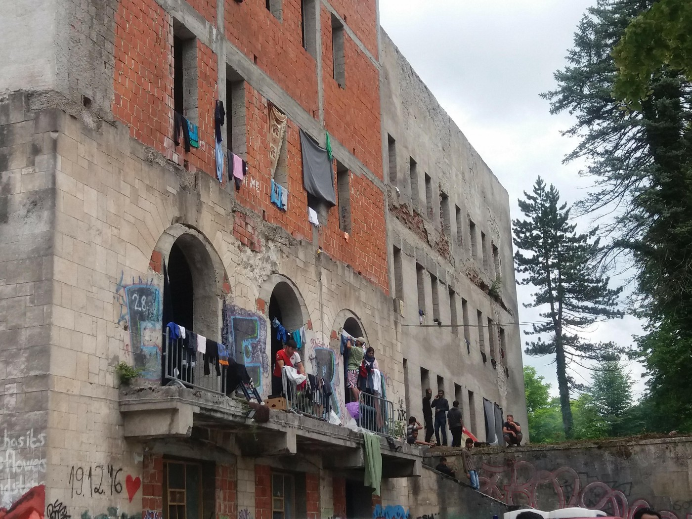

Bihać, Bosnia and Herzegovina —The unsafe building where refugees are staying at the moment \(see more under BiH\) \(Photo: AYS\)
#### FEATURE — Update on the case of children shot by the Croatian police near the Bosnian border

AYS has reported on [the shooting by the Croatian police](ays-daily-digest-31-05-2018-two-refugee-children-shot-by-croatian-police-5c3c811e0f07) that happened in the night of May the 30th around 10 PM near the town Donji Lapac and Plitvice Lakes\. The police opened fire on a van which appeared to be smuggling refugees from Bosnia and Herzegovina\. Two 12 year old children — a boy and a girl from Iraq were severely wounded by the police bullets, as well as the father of one of the children\.

As soon as we could, we took their statements for the investigation and reporting purposes\.

> We must stress that the families are determined in their decision to investigate the shooting\. 

In their statement they told us a couple of worrying facts\. Firstly, they heard a dozen shots\. Secondly, all wounded persons — two children, the boy who was shot in the head and is still in the hospital waiting for the surgery, the girl who was shot in her shoulder and stomach and the father shot in the lower back, were actually standing in the van when the police fired on it\. This might imply that the police were not shooting at the tires of the van, but higher up where there were obviously people\. This will be up to the forensics team to establish\. But let’s just remind ourselves that there were 29 people in the van, including 15 children — the youngest was only 4 years old\.

Thirdly, the families say that when they were going out of the van, the police were beating the men\. When the family members of the wounded children asked for ambulance, they were yelled at by the police — ‘Shut up\! Shut up\! Sit down\!’\. Also, according to the statement by one of the family members, the police officer pointed a gun towards him and told him to sit down\.

Their children were taken without them, in the night, by the ambulance to Zadar hospital\. And the rest of the group, including the families, were taken to prison — detention\. Men and women with children were separated from each other\. They were not given any information\. They did not have a translator\. They say they signed a paper that they don’t know what it was\. The day after part of the group was taken to Zagreb reception center Porin, and one of the persons from the group was kept in the prison for a day for unknown reasons\.

The families of the children were taken to a Zadar hostel, while the wounded children were kept in the hospital\. The only good words they have are for the hostel staff and one female police officer who was the only one who spoke kindly and calmly with them\. When they were transferred to Zagreb after two days, our volunteers provided them with support\. They said at that time that we were the first ones to ask them how they were and how we can help them\. They asked why no government official asked about them and their children\. We have the same question, since we believe that the situation would be different if it was a Croatian child\. ‘We thought we came to the safety — but we felt like we were being haunted by ISIS again\.’, they said through tears\.

The Croatian Prime Minister said in his statement that shooting at children is ‘very bad’, but that Croatia will ‘continue to protect the borders from smugglers’\. Minister of Interior, Davor Božinović, said last Sunday, publicly, that the families might have ‘better chances for getting international protection’, yet he does not want to ‘promise anything’\.

We do not to believe to the politicians’ statement — AYS submitted the report to police internal control, to the Ombudsperson and the Ombudsperson for children\. Also, the President of the Parliamentary Committee for national security and internal affairs has asked for the investigation in this case\.

The boy is still in the hospital, struggling with opening his eyes and drinking water\. We publish this story and the photos with the consent by the families, who want to tell their story\. We hope their voice will be heard\.

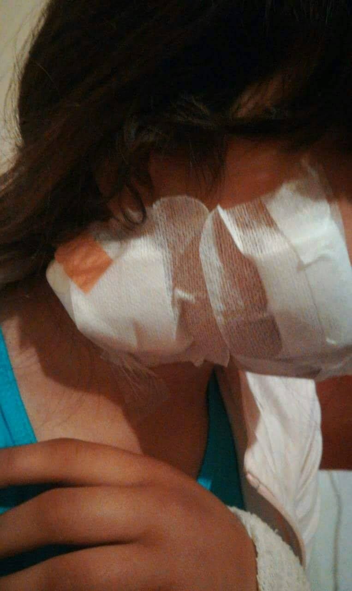

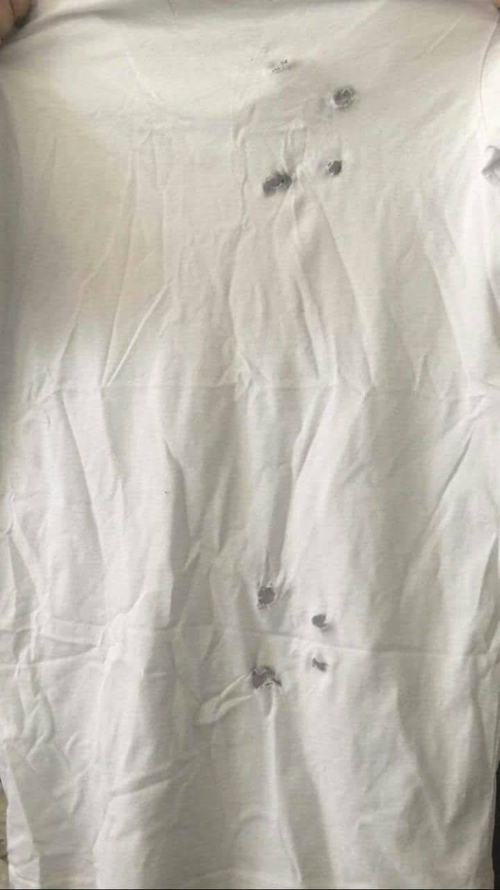

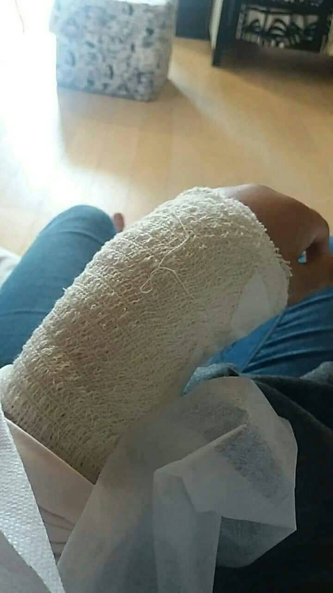

Photos: AYS
#### SEA

■■■■■■■■■■■■■■ 
> **[MSF Sea](https://twitter.com/MSF_Sea) @ Twitter Says:** 

> > UPDATE: Mutliple boats in distress today &amp; no other #NGO's in the search &amp; rescue zone off the coast of #Libya. The #Aquarius is currently running at full speed, heading to the Eastern part of the zone. Photos: Kenny Karpov https://t.co/z4PBMKjh8l 

> **Tweeted at [2018-06-09 13:50:23](https://twitter.com/msf_sea/status/1005447015701139456).** 

■■■■■■■■■■■■■■ 

■■■■■■■■■■■■■■ 
> **[SALVAMENTO MARÍTIMO](https://twitter.com/salvamentogob) @ Twitter Says:** 

> > Tripulación salvamar Spica rescata 51 #personas de la 6ª #patera de hoy. Llega #Almeria 23:00 horas. GRACIAS! tripulación ferry Fortuny por desviarse ruta y escoltar hasta nuestra llegada. Hoy: 231 rescatados de 6 pateras. https://t.co/yFR02tGAFq 

> **Tweeted at [2018-06-09 18:53:29](https://twitter.com/salvamentogob/status/1005523293288398850).** 

■■■■■■■■■■■■■■ 

■■■■■■■■■■■■■■ 
> **[Anelise Borges](https://twitter.com/AnneliseBorges) @ Twitter Says:** 

> > #LIVE from #Aquarius: vessel we were originally supposed to rescue has been intercepted by Libyan Coast Guard. @[MSF_Sea](https://twitter.com/MSF_Sea) @[SOSMedFrance](https://twitter.com/SOSMedFrance) have been asked to assist two other boats instead. There could be 200 people in distress. We are less than 1 hour away. https://t.co/DKTrmja8XI 

> **Tweeted at [2018-06-09 16:45:35](https://twitter.com/anneliseborges/status/1005491104580558849).** 

■■■■■■■■■■■■■■ 

“After 12 hours in port, without understandable justification from the authorities, while there were 6 SAR cases in the Mediterranean, we are finally stung at sea\. Political attacks against us endanger not only us, but also people in distress\.” — [Sea\-Watch](https://www.facebook.com/seawatchprojekt/)

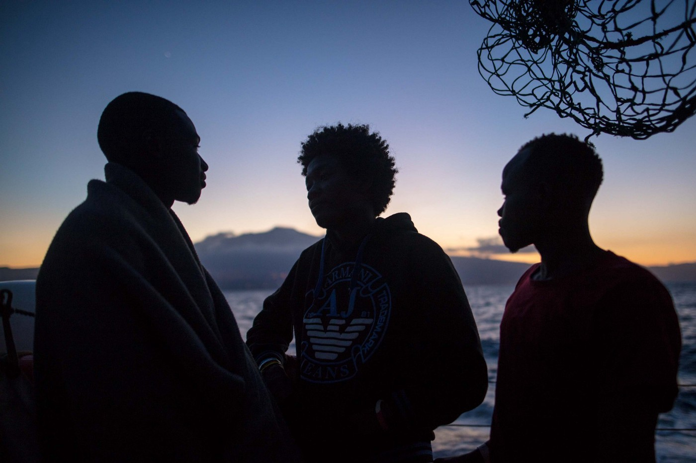

Photo: Erik Marquardt
#### GREECE

Five boats carrying 204 people has arrived to the Greek islands on Saturday\. Four boats arrived on Lesvos, carrying 164 people, one boat to Chios with 40 people on board\. See detailed information on statistical data of the arrivals on [Aegean Boat Report](https://www.facebook.com/AegeanBoatReport/?hc_ref=ARS2yjBIY7zZ31bpTh5xFNw5RkWce2d8oLqgbNuzvFC7nRNIcIg_OA_lZlW3GZercys&fref=nf) page\.

However, different news reached us regarding different aspects of the arrivals and the following treatment of the people upon arrival\.

■■■■■■■■■■■■■■ 
> **[The Hope Project](https://twitter.com/HopeProjectOrg) @ Twitter Says:** 

> > Another boat has just landed near Molyvos the third boat the morning, Philippa and to tourist rushed to help the people, the coast guard told them to go away and refused to let them give water and aid, this is... [facebook.com/10000182230325…](https://www.facebook.com/100001822303256/posts/2111206982283358/) 

> **Tweeted at [2018-06-09 07:10:25](https://twitter.com/erickempson/status/1005346361162784778).** 

■■■■■■■■■■■■■■ 

■■■■■■■■■■■■■■ 
> **[Lighthouse Relief](https://twitter.com/LighthouseRR) @ Twitter Says:** 

> > Since midnight, our Emergency Response team has participated in 3 landings in Northern #Lesvos. We assisted a total of 105 people in Stage 2, our transit facility, and distributed tea, dry clothes and other items. The people arriving were mainly fleeing #Iran and #Afghanistan. 

> **Tweeted at [2018-06-09 11:28:42](https://twitter.com/lighthouserr/status/1005411361847996416).** 

■■■■■■■■■■■■■■ 

#### BOSNIA AND HERZEGOVINA
### Bihać

AYS visited the former student dormitory in Bihać, where around 700 people come for food and some of them are living there, including 13 families with small children\. 
It is estimated that the entire region hosts around 2,500 people and in Bihać, apart from the people in the ex\-student dorm, there is about a hundred people staying at the abandoned retirement house that is now a squat\.

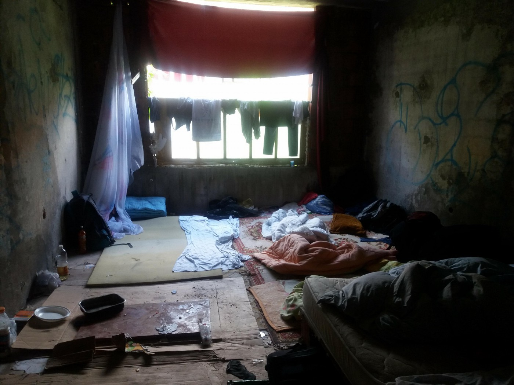

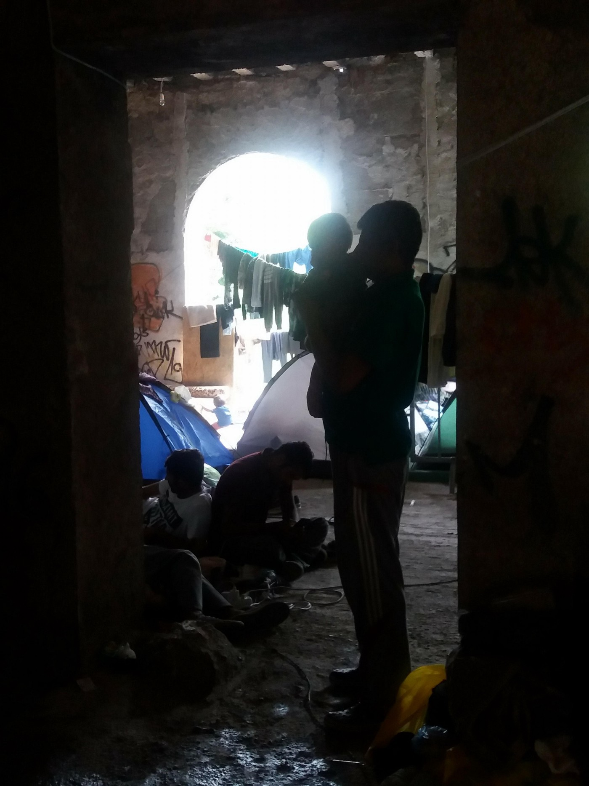

Red Cross supplies one meal a day at the abandoned student dormitory, now the refugee centre that hosts the 700 people, the locals bring more food during the day, but it is not a regularly distributed meal service\.

The situation for those lodged in and around the premises is uncertain, as it is not a safe place to stay, especially for women\. The centre is lacking the most basic amenities\.

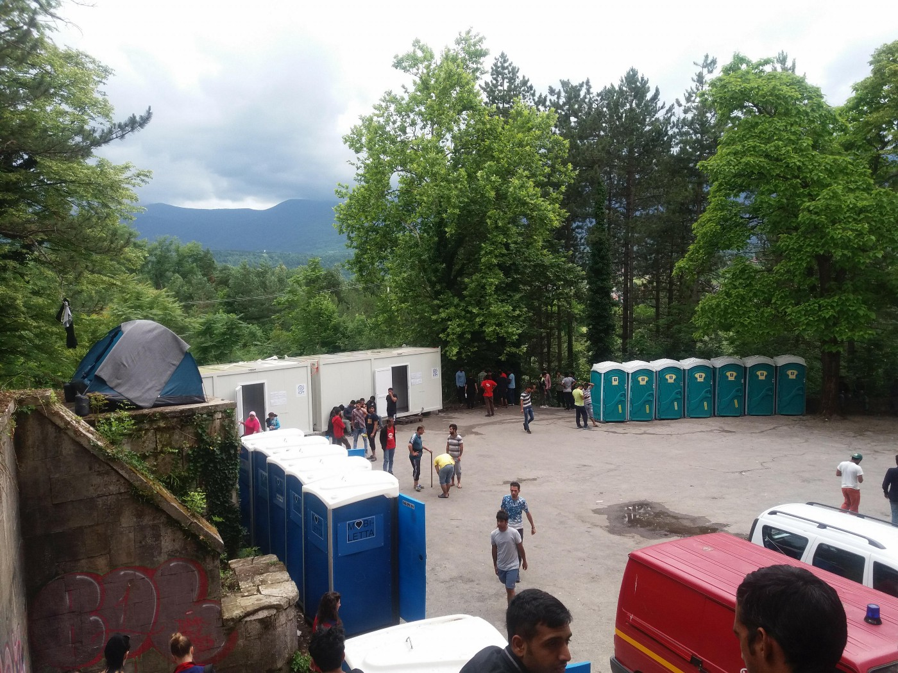

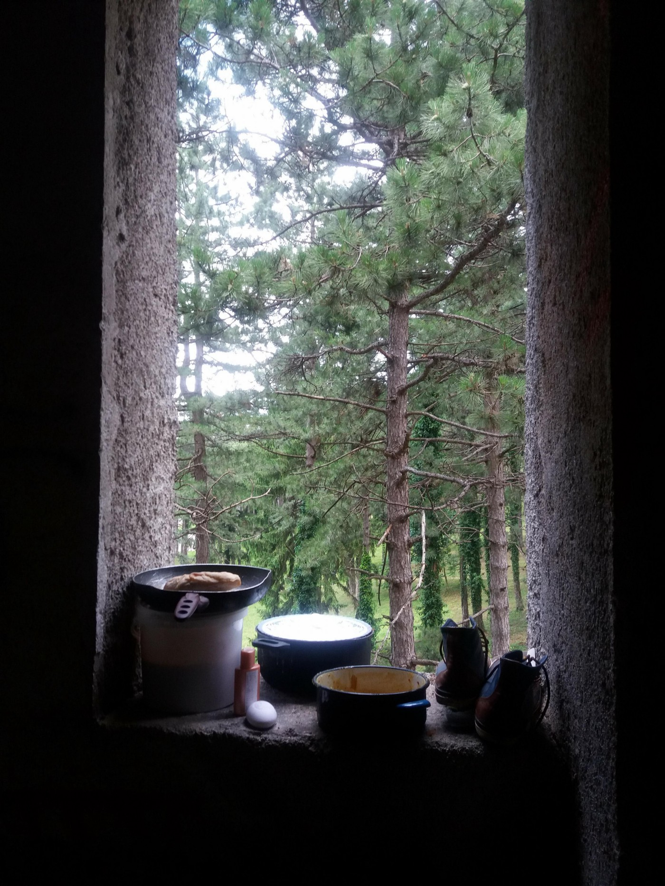

Clashes between people of different nationality occur often, as is only understandable with such awful conditions prevailing\. Those in the camp report that it is common for people to be badly enough injured that they end up being taken to the hospital\.

There is an unofficial police watch in Bihać\. After 10pm, if found on the streets refugees are checked and questioned by the police, we were told\.

According to the information we received, there is a plan to open another more formal accommodation in the border town of Velika Kladuša, we will report more on that soon\.
### Sarajevo

Just as almost every evening, there were new arrivals in Sarajevo at dinner distribution tonight\. Both families from Syria, young men including unaccompanied minors from North Africa as well as Pakistan and Afghanistan are here\.

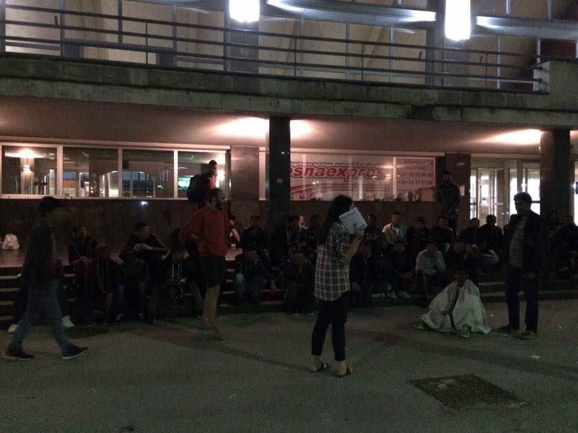

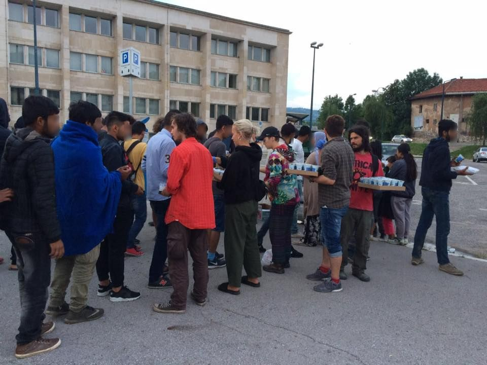

People were queuing for food \(which is provided by a local restaurant throughout Ramadan\) and after that blankets and tents\. The same procedures are repeated the every evening\. Meanwhile, the weather is shifting quickly, from 27 degrees and sunshine during the day, to rain showers and much lower temperatures nighttime\. Not much is new, but the number of arrivals are not decreasing\. Sarajevo is for now mainly a location of transit for most people looking to continue their journey north\.
#### ITALY
### Rome

[No Name Kitchen](https://www.facebook.com/NoNameKitchenBelgrade/) at Baobab:

> A week of changes within the NNK in the Baobab Camp in Rome\. After a few days with very little resources, we are back to normal\. At the moment, we are 5 people on the field, with the usual tasks like delivering water, buying and collecting in the markets, making salads… All with the collaboration of the people who live in the camp\.
 

> Living in the same camp with them, brings us the opportunity of sharing breakfast with those who have less resources\. It started as something very informal but it became a routine and now more than 60 people come to our area to have a coffee or tea and cookies every morning\. 

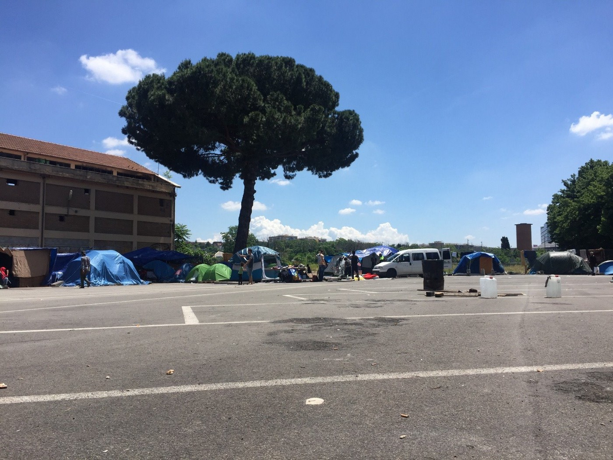

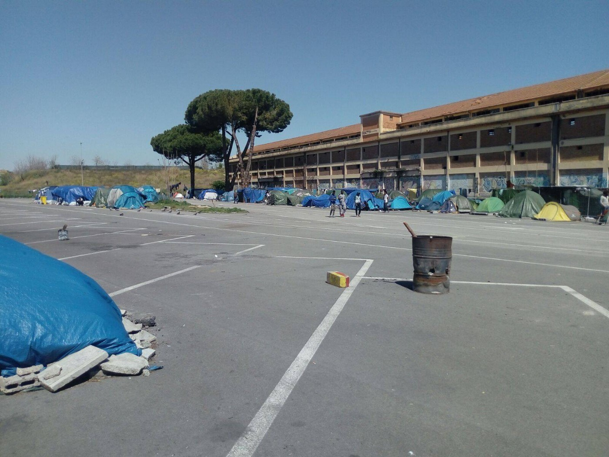

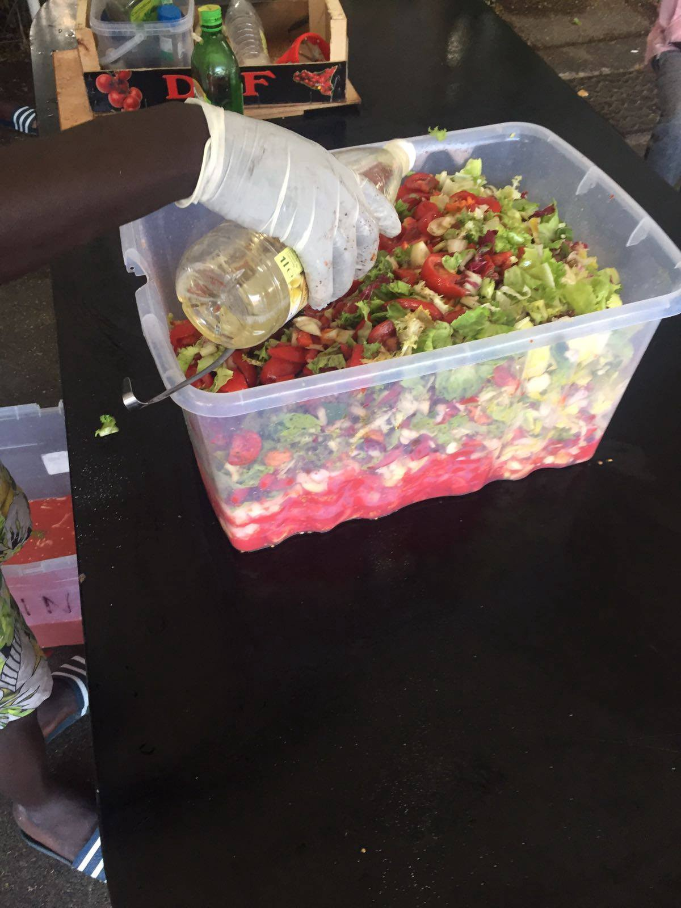

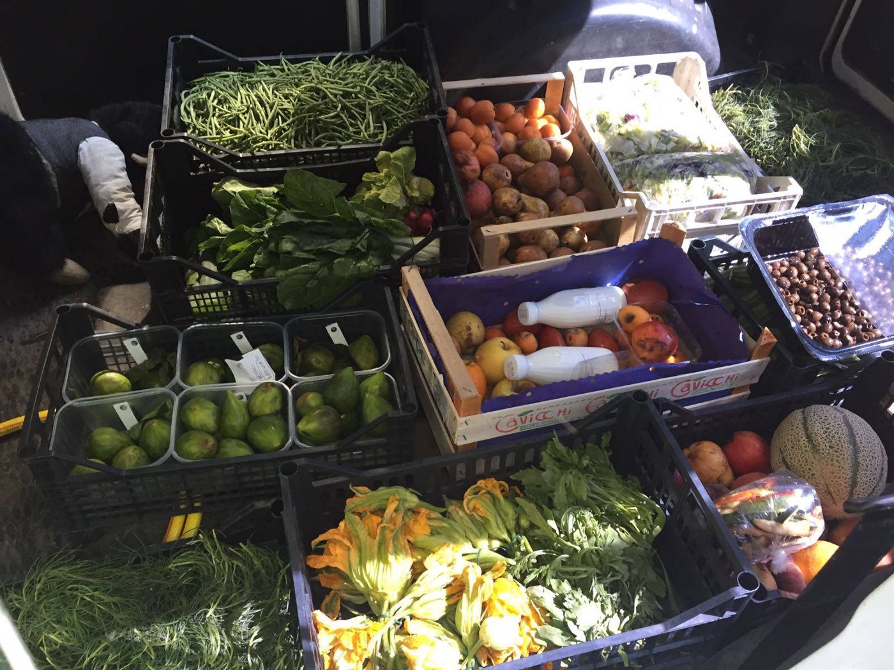

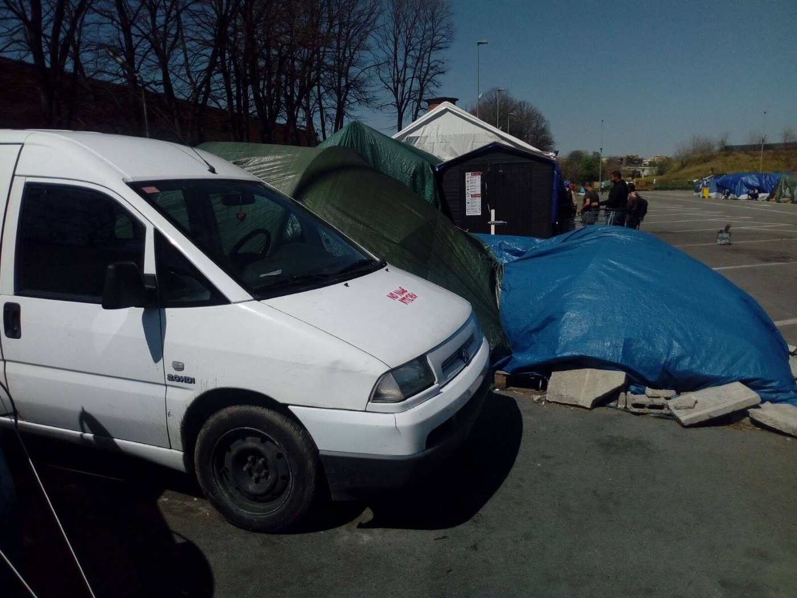

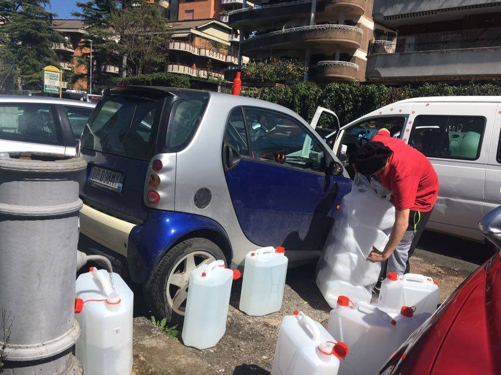

Photos: NNK
#### SPAIN

■■■■■■■■■■■■■■ 
> **[Oscar Camps](https://twitter.com/campsoscar) @ Twitter Says:** 

> > Necesitamos 14 voluntarios o voluntarias con ganas de trabajar para terminar cuanto antes los trabajos de cubierta del #OpenArms en Borriana (Castellón) gastos a cargo @[openarms_fund](https://twitter.com/openarms_fund) De hoy hasta el día 13 o 14, escribir a voluntarios@proactivaopenarms.org https://t.co/yxTHNCHTy7 

> **Tweeted at [2018-06-09 06:12:31](https://twitter.com/campsoscar/status/1005331789202771969).** 

■■■■■■■■■■■■■■ 

[Association Marocaine des Droits Humains — Section Nador](https://www.facebook.com/AmdhNador/?hc_ref=ART2JScdrTraidnVXo4Rgsmqhb_Eug5zKL9Q0hRpYCG4q0e4D__K7KqYPxozoowQ2VU&fref=nf) team reports that the Spanish authorities in Melilla have turned to their “auxiliary forces” to track down unaccompanied minors who are living in difficult conditions in the streets of Melilla\. Their role is reportedly to monitor minors on the street and call the police\.
“The methods are similar to serve the same migration policy of exclusion”, the Morroccan volunteers state\.

](assets/195b81efa3ec/1*bd4Hx1YDypsJXoCADIpZKQ.jpeg)

Photo: [Association Marocaine des Droits Humains — Section Nador](https://www.facebook.com/AmdhNador/?hc_ref=ART2JScdrTraidnVXo4Rgsmqhb_Eug5zKL9Q0hRpYCG4q0e4D__K7KqYPxozoowQ2VU&fref=nf)
#### BELGIUM

[La Voix Des Sans Papiers Bruxelles](https://www.facebook.com/voixsp1/?hc_location=group_dialog) invite to a march that takes place **this Sunday, Juunee 10, from 14h \(2pm\) in Bruxelles at Gare du Nord\.**

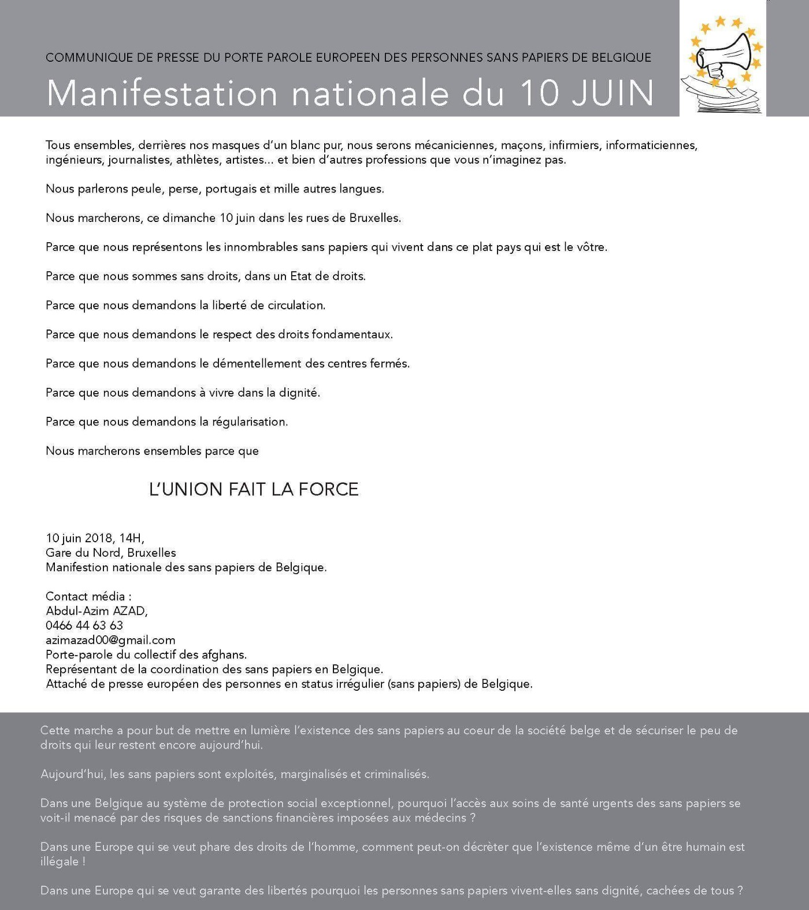

#### GERMANY

Several hundred people joined protests of various organizations in Bremen\. One of them was the alliance against the camp im the Gottlieb Daimler Straße\. The residents as well as locals in solidarity once more demanded to shut down the camp and that the ages of the teenagers are being recognized\.

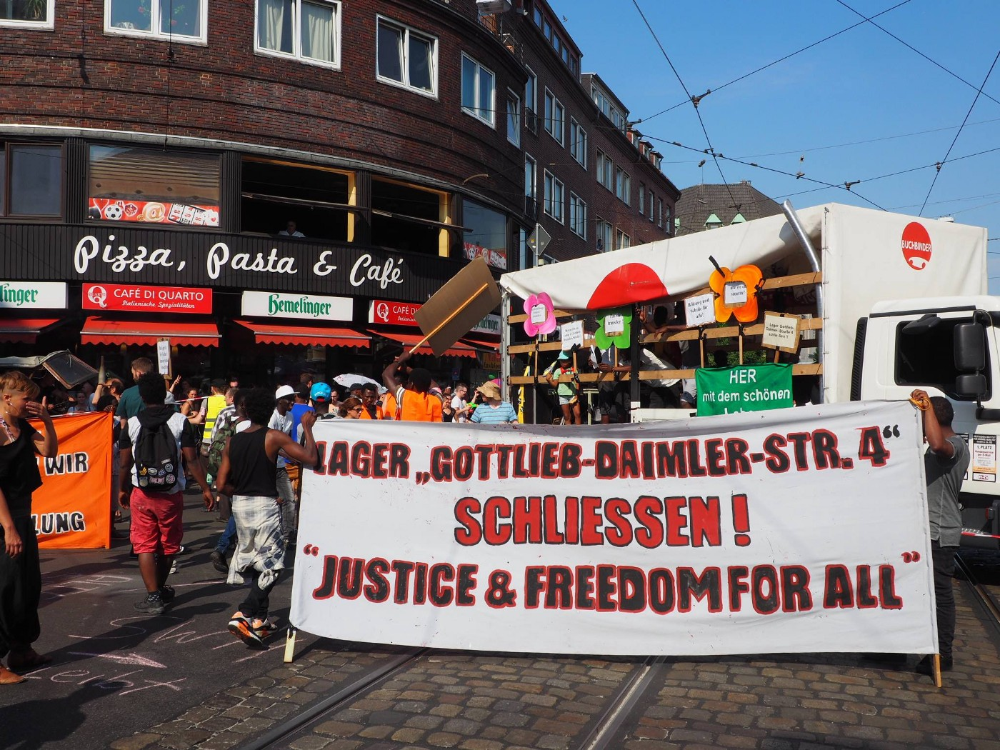

Photos: AYS

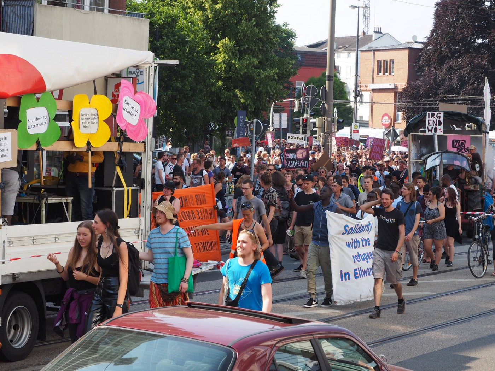

To find out more on the topic, please read our [**AYS Special from Germany: Young people in Bremen pushed out of the system**](https://l.facebook.com/l.php?u=https%3A%2F%2Fmedium.com%2Fare-you-syrious%2Fays-special-from-germany-young-people-in-bremen-pushed-out-of-the-system-87c1fca35dc4&h=ATPmIiWGyTmDrkFUASGJ2wJgaHVvg8maCwrZmLdsTbwZVj4y1l4_Dk7BxN-7Wg70zNPmONCWo7-xGDq0uC9r3LuQMGedNuURMG3JCBMvLrQVACsAyQ) \.
#### FRANCE

The politics of border militarization that has become a big hit with the European governments are leading to sometimes sad and dangerous events, but sometimes it is simply bizarre what the resulting situation can lead to\. One such example is the heavily guarded area, by some more that 20 armed forces at the same time, around [Cedric Herrou](http://Cédric Herrou) ’s property\. 
Also, he invites those who haven’t to sign the petition to the French Minister of Interior, available [here](https://www.change.org/p/dtc-d%C3%A9fends-ta-citoyennet%C3%A9-egalit%C3%A9-fraternit%C3%A9-2) \.

### Dunkirk

[Mobile Refugee Support](https://www.facebook.com/MobileRefugeeSupport/?hc_location=group_dialog) team writes:

> We are currently on\-site at the new camp in Dunkirk\. Today has again seen huge amounts of new arrivals, with numbers now exceeding 350, including over 20 families\. 

> This increase in population means all of our services are being stretched to their limit\. Over 500 devices are being charged at one time by our two generators and our [Roots](https://www.facebook.com/charitableroots/?fref=mentions&hc_location=group) boxes, while hundreds of people are accessing the free [Jāṅgala](https://www.facebook.com/jangalawifi/?fref=mentions&hc_location=group) wifi\.
 

> As always, the incredible [Refugee Community Kitchen](https://www.facebook.com/refugeeCkitchen/?fref=mentions&hc_location=group) are here with us, helping to support this rapidly growing community of displaced people\.
 

> If you would like to help or get involved, please get in contact\. 

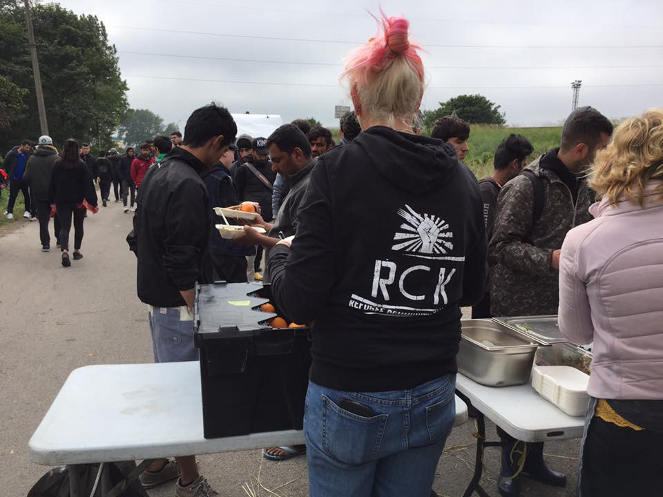

](assets/195b81efa3ec/1*g71ErjmQSv3zQUC7i5_yFQ.jpeg)

Photos: [Mobile Refugee Support](https://www.facebook.com/MobileRefugeeSupport/?hc_location=group_dialog)
#### UK

From Care4Calais team to the lovely people of the UK:

“ This summer weather in the UK is great\. It’s lovely to be able to sit outside\. But in Calais it’s hot, dusty and dirty; when you’ve been living outside for months and can’t wash or change your clothes it’s no fun at all\.

There are over 3,000 refugees scattered across northern France and Belgium\. Sleeping rough they have no access to sanitation or clean clothes\. We distribute jogging bottoms when we can — wearing the same trousers for eight weeks leads to horrible skin infections and worse\. We give out wet wipes, and basics like clean underwear just once a week — how easily do you take clean underwear for granted every day in the UK?

But right now we are struggling\. Calais has been out of the news for too long\. The amazing UK\-wide effort to collect clothes and sleeping bags has slowed right down; we’re barely scraping by\.

It’s never been governments or even big charities that helped the refugees\. It was a true movement of the people; a heartwarming statement of solidarity and a will to change the world from the bottom up, and at the most unlikely moment of Brexit and a politically divided UK\.

So even though everyone has done so much we need to ask you to keep going\. To keep collecting and donating and helping the refugees\. This is a long fight and the suffering goes on\. Our supporters represent the very best of Britain and we need you now as much as ever\.

This is our updated needs list: [https://goo\.gl/jCdVMS](https://l.facebook.com/l.php?u=https%3A%2F%2Fgoo.gl%2FjCdVMS&h=ATNmdA5KoLk0xmAbIjwJmyxkr3B8mJXu4qCiF6qiSmVYEgILIW5oPQP2yzxjbD1BLMz35q27yKkxmkoNqlOLCrLxmkTsXfu7OAngEgmMQ5fl8a2QfE3h00ZB7OmOr5iMZw) 
For drop off points please see here: [https://goo\.gl/ULD9dG](https://l.facebook.com/l.php?u=https%3A%2F%2Fgoo.gl%2FULD9dG&h=ATMh6qrJ1vTP2NmarsYUQYd6aXmKmO4_3VioAIdk5JSXK2Hm8QSono0gJKvbXbNZr5m6Bwpjct2RoCFk8OXBljLY1lIrDMCQjtR3x5F1sA2MWM9LiwHf) 
You can donate funds to help us here: [https://goo\.gl/jmkx7A](https://l.facebook.com/l.php?u=https%3A%2F%2Fgoo.gl%2Fjmkx7A&h=ATNLy5To-CtOCcJ09Tj4Z4MKgNv--D2Pd39WdnLdRDS8T14frrFrrOt0O1qXwr5jRSEXzy_x_MABqgJpis30GrfbjwfFgGfCUpYGkeAv3jrlqa_Dc1wa) 
Please share this post as widely as possible\.”

**We strive to echo correct news from the ground through collaboration and fairness\.**

**Every effort has been made to credit organizations and individuals with regard to the supply of information, video, and photo material \(in cases where the source wanted to be accredited\) \. Please notify us regarding corrections\.**

**If there’s anything you want to share or comment, contact us through Facebook or write to: [areyousyrious@gmail\.com](mailto:areyousyrious@gmail.com)**

_Converted [Medium Post](https://medium.com/are-you-syrious/ays-daily-digest-9-6-18-dangerous-fruits-of-the-in-securitisation-195b81efa3ec) by [ZMediumToMarkdown](https://github.com/ZhgChgLi/ZMediumToMarkdown)._
