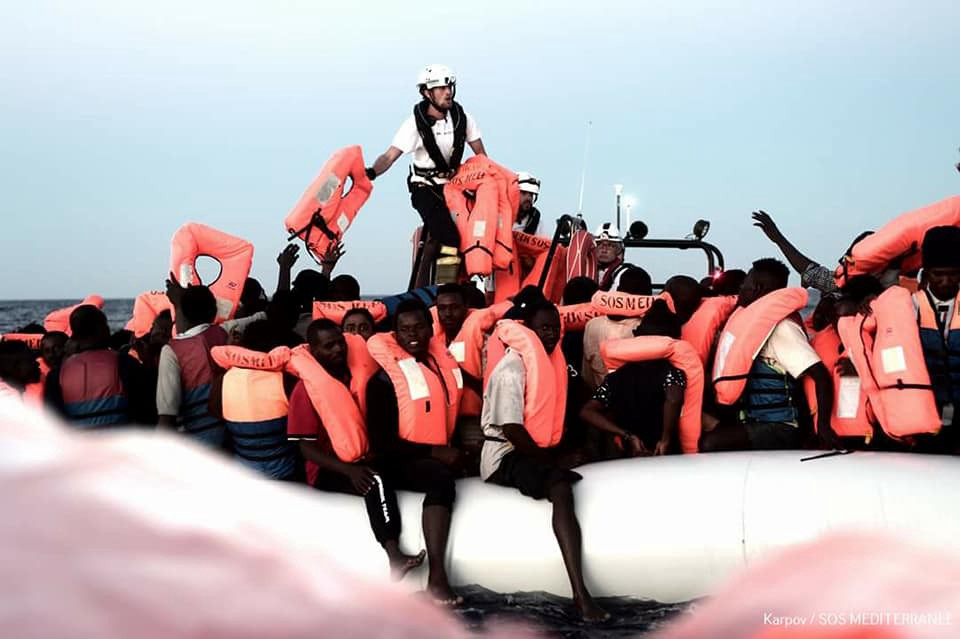
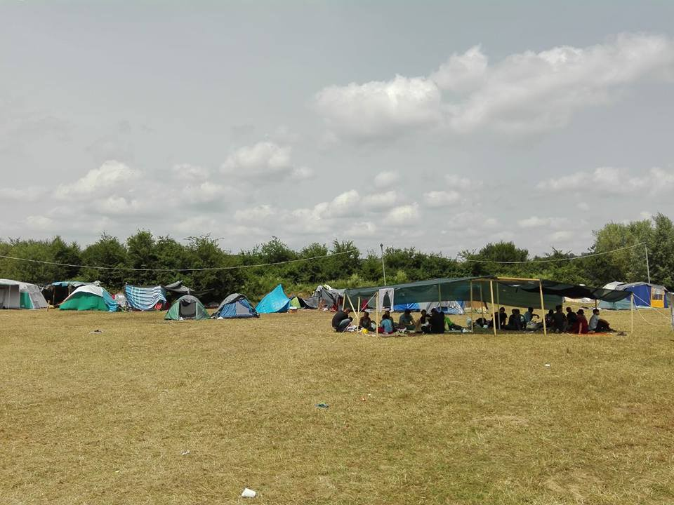
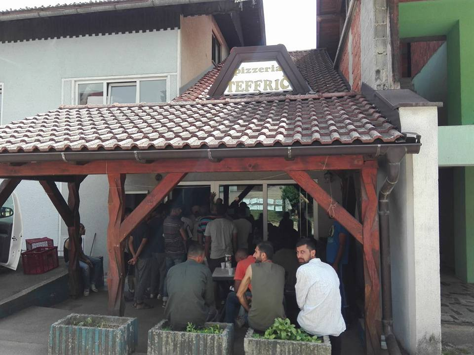
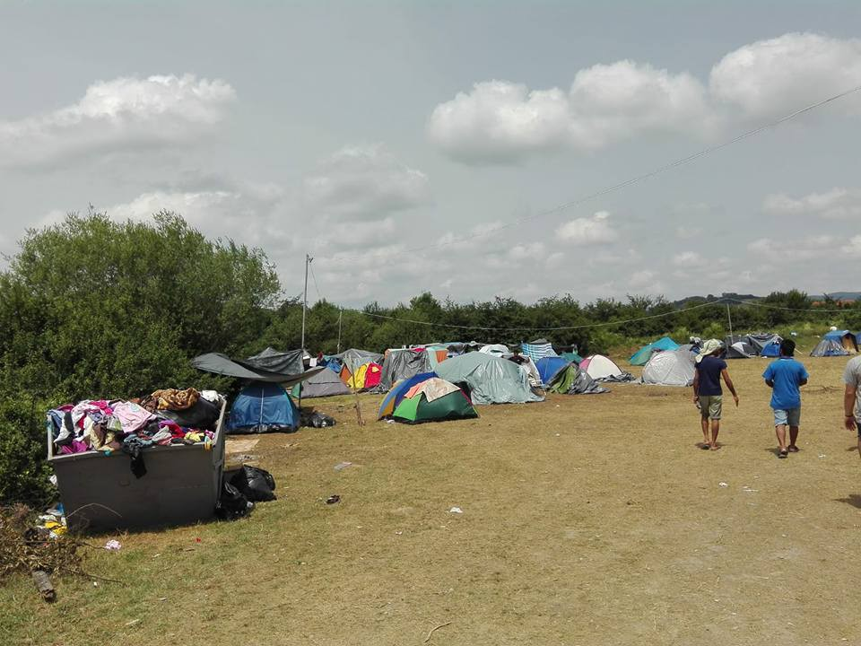
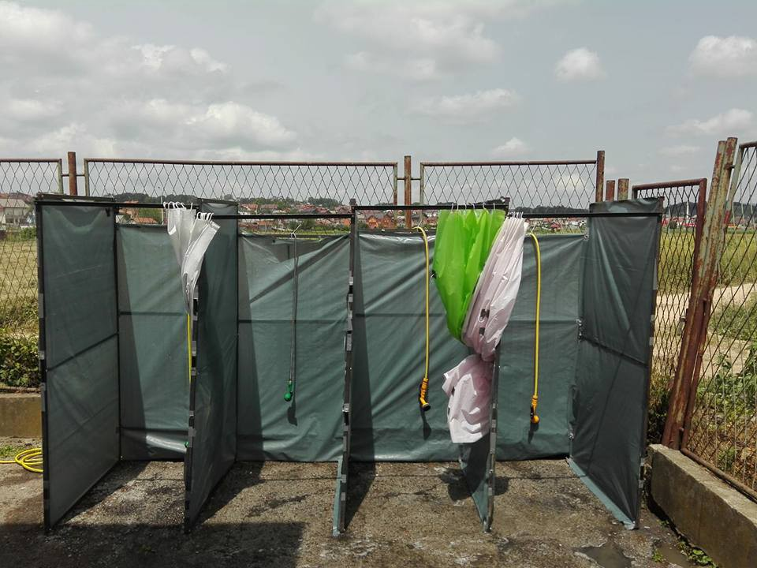
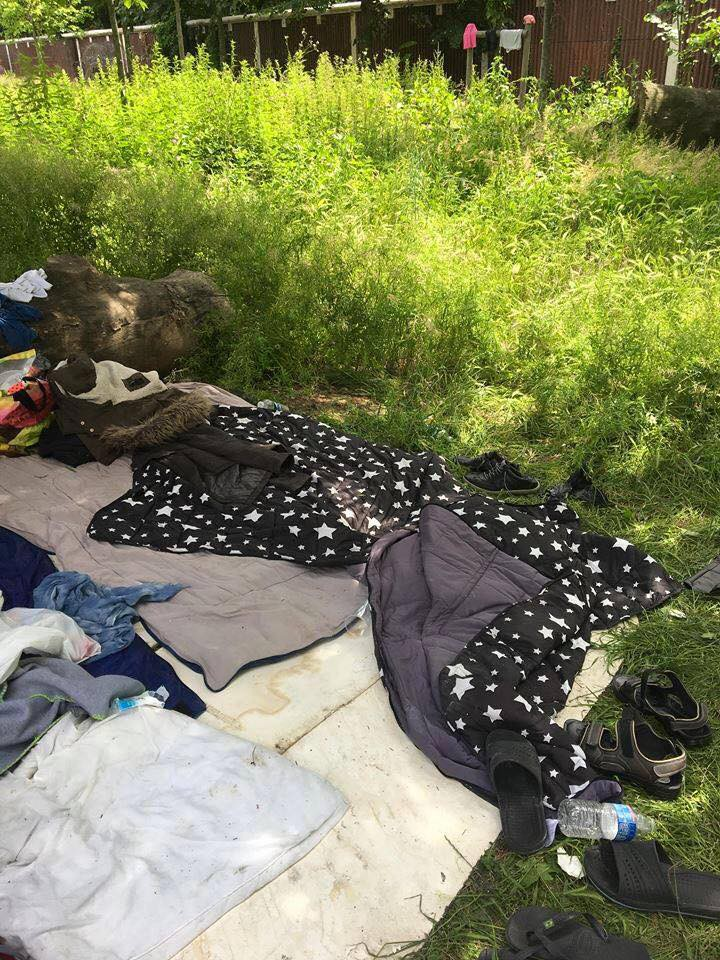
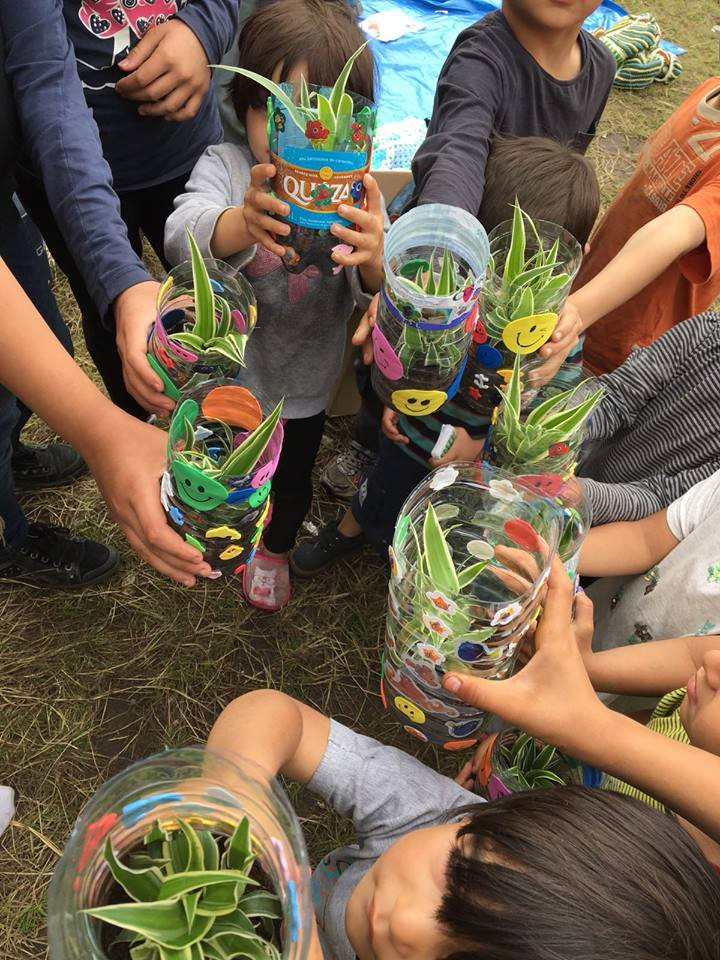

### AYS Daily Digest 10/06/18: Aquarius prohibited from docking in Italy

Ceasefire in Afghanistan during Eid // 334 people rescued by Spanish Maritime Services // Sea\-Watch detained and unable to assist boats in distress //Turkey builds fence along border with Syria // New arrivals in Greece // News from Bosnia // France and more…

Photographs by Kenny Karpov
#### Feature: Italy prohibits Aquarius SAR vessel carrying over 629 people from docking at its ports\. Instead asking Malta to accept the ship and passengers\.

■■■■■■■■■■■■■■ 
> **[The European Post](https://twitter.com/theEUpost) @ Twitter Says:** 

> > Italian Interior Minister Salvini @[matteosalvinimi](https://twitter.com/matteosalvinimi) closes Italian ports for NGO boat #Aquarius with 629 migrants on board. He says boat should dock in Maltese ports instead of in Italian ones. (Corriere della Sera) #migration @[MaltainEU](https://twitter.com/MaltainEU) @[ItalyinEU](https://twitter.com/ItalyinEU) https://t.co/DZwMHutJ0e 

> **Tweeted at [2018-06-10 15:10:33](https://twitter.com/theeupost/status/1005829578496016385).** 

■■■■■■■■■■■■■■ 

[Italy’s new right\-wing Interior Minister Matteo Salvini](https://www.timesofmalta.com/articles/view/20180610/world/malta-italy-in-second-migrants-standoff-in-three-days.681395) effectively closed the ports of Italy to 629 people on board the Aquarius, contesting that Malta should accept the vessel and those on board\. This is the first time the Aquarius has been prevented from reaching Italian harbours\.

On board the vessel are a number of vulnerable cases\. There are 123 unaccompanied minors, 7 pregnant women, and 111 children who left Libya and were rescued in various SAR efforts during the night\.

■■■■■■■■■■■■■■ 
> **[MSF Sea](https://twitter.com/MSF_Sea) @ Twitter Says:** 

> > UPDATE: The #Aquarius is continuing to head North with 629 people who were rescued &amp; transferred on board last night under the coordination of the Italian Maritime Rescue Coordination Centre. The Aquarius is currently still waiting for a port of safety to be assigned. https://t.co/su4BHwwEv7 

> **Tweeted at [2018-06-10 16:56:39](https://twitter.com/msf_sea/status/1005856277636009987).** 

■■■■■■■■■■■■■■ 

Salvini wrote on Facebook:

> “Malta takes in nobody\. France pushes people back at the border, Spain defends its frontier with weapons, from today, Italy will also start to say no to human trafficking, no to the business of illegal immigration\.” 

Malta has refused the request, insisting that under International Law it is not obligated to accept the refugees on board\.

■■■■■■■■■■■■■■ 
> **[Joseph Muscat](https://twitter.com/JosephMuscat_JM) @ Twitter Says:** 

> > I took a call from #Italy PM @[GiuseppeConteIT](https://twitter.com/GiuseppeConteIT) to discuss #Acquarius issue. #Malta is in full conformity with international obligations &amp; will not take the vessel in its ports. We will continue,where possible, carrying out individual&amp;humanitarian emergency medical evacuations -JM 

> **Tweeted at [2018-06-10 21:00:34](https://twitter.com/josephmuscat_jm/status/1005917664546615304).** 

■■■■■■■■■■■■■■ 

However the government has issued a statement saying that in conformity to its policy throughout the last years, Malta is willing to carry out emergency medical evacuations of vulnerable cases requiring urgent medical response\.

**A couple find each other on board the vessel Aquarius:**

■■■■■■■■■■■■■■ 
> **[Anelise Borges](https://twitter.com/AnneliseBorges) @ Twitter Says:** 

> > After over 10 hours of operation, #Aquarius now has over 600 people on board. Among them, the couple pictured below who had no idea whether the other had survived the crossing. https://t.co/3aHfDdMXq0 

> **Tweeted at [2018-06-10 11:06:44](https://twitter.com/anneliseborges/status/1005768221419503616).** 

■■■■■■■■■■■■■■ 

**A number of people and organisations are protesting the decision of the Italian Interior Minister:**

> An unprecedented decision in our country, adopted in agreement by the ministers of the Interior and Infrastructures Danilo Toninelli, which violates the European Convention on Human Rights and offends the sense of humanity that should always guide the representatives of the Institutions\. What we are asking for is a political and human gesture\. We ask the mayors of port cities, which open the ports to humanity in a symbolic way\. We ask the politician, we ask the citizens, do not close to humanity\. — [Baobab Experience](https://www.facebook.com/BaobabExperience/) 

[A campaign/petition](https://www.change.org/p/luigi-de-magistris-napoli-disobbedisca-accogliamo-la-nave-aquarius-respinta-da-salvini) has started asking for the opening of ports in order to allow these people to disembark in any welcoming place\.

> We ask the Mayor of Naples, Luigi de Magistris, to take action to immediately welcome the Aquarius with its 629 desperate\. 

In response to the decision, Italian Mayors of Palermo, Reggio Calabria and Naples are offering to allow the landing of the vessel on their docks according to [_SOS Refugiados_](https://www.facebook.com/sosrefugiados/) \.

[The mayor of Palmero](https://www.theguardian.com/world/2018/jun/10/italy-shuts-ports-to-rescue-boat-with-629-migrants-on-board) has publicly stated that he would allow the Aquarius to dock in the Sicilian capital\.

Currently the Aquarius remains on standby awaiting further instruction of where to dock as the [dispute between Italy and Malta](https://www.tpi.it/2018/06/10/salvini-chiude-porti/) continues about who is responsible to take care of the people on board\.

■■■■■■■■■■■■■■ 
> **[MSF Sea](https://twitter.com/MSF_Sea) @ Twitter Says:** 

> > UPDATE: The #Aquarius has now received instructions from the Italian Maritime Rescue Coordination Centre to standby in our current position which is 35 nautical miles from #Italy and 27 nautical miles from #Malta. 

> **Tweeted at [2018-06-10 20:44:11](https://twitter.com/msf_sea/status/1005913541562519552).** 

■■■■■■■■■■■■■■ 

■■■■■■■■■■■■■■ 
> **[Anelise Borges](https://twitter.com/AnneliseBorges) @ Twitter Says:** 

> > #LIVE from #Aquarius: @[MSF_Sea](https://twitter.com/MSF_Sea) project coordinator Aloys Vimard tells me there’s enough food on board but that he hopes the 629 people rescued can be transferred to a port of safety as soon as possible. https://t.co/QeolNZ18CY 

> **Tweeted at [2018-06-10 20:34:43](https://twitter.com/anneliseborges/status/1005911157738176512).** 

■■■■■■■■■■■■■■ 

Salvini has stated that this summer in Italy will not be one characterised by arrivals\.

■■■■■■■■■■■■■■ 
> **[Joseph Muscat](https://twitter.com/JosephMuscat_JM) @ Twitter Says:** 

> > We are concerned at #Italy authorities’ directions given to #Acquarius on high seas. They manifestly go against international rules, and risk creating a dangerous situation for all those involved -JM 

> **Tweeted at [2018-06-10 21:04:34](https://twitter.com/josephmuscat_jm/status/1005918671297024002).** 

■■■■■■■■■■■■■■ 

A further 152 people who did not make it onto the Aquarius were taken by the Libyan coast guard and returned to detention centres within the country\.

■■■■■■■■■■■■■■ 
> **[MSF Sea](https://twitter.com/MSF_Sea) @ Twitter Says:** 

> > #MSF is concerned that again politics are being placed above people’s lives. The priority must be the importance of the well being &amp; safety of the people on board. https://t.co/lru9SYBcLT 

> **Tweeted at [2018-06-10 16:56:43](https://twitter.com/msf_sea/status/1005856295616999425).** 

■■■■■■■■■■■■■■ 

### Afghanistan
#### The Afghani government and leaders of the Taliban have announced a temporary ceasefire during the forthcoming Eid al Fitr holiday

[The government has announced to halt offensive operations](https://www.crisisgroup.org/asia/south-asia/afghanistan/crisis-group-welcomes-afghanistan-ceasefire) from the 12th of June to the 20th of June\. The Taliban has announced it will do the same between the 15th and the 18th of June\.
### Sea
#### Four people have died while many others were rescued by the Spanish Maritime rescue services

■■■■■■■■■■■■■■ 
> **[SARwatchMED](https://twitter.com/SARwatchMED) @ Twitter Says:** 

> > Via @[AP](https://twitter.com/AP): Spain rescues 334 migrants from Mediterranean, finds 4 dead [apnews.com/119224d391e547…](https://apnews.com/119224d391e547758c1bbc39397cecee) 

> **Tweeted at [2018-06-10 12:12:39](https://twitter.com/sarwatchmed/status/1005784807039791105).** 

■■■■■■■■■■■■■■ 

#### Sea\-Watch [detained and unable to assist](https://www.facebook.com/seawatchprojekt/photos/a.1579563625595046.1073741828.1578640155687393/2035854256632645/?type=3&theater) four boats currently in distress in Central Mediterranean

> Sea Watch: At least four boats with hundreds of people are currently on the central Mediterranean in distress and there is no ngo nearby that can help them\.
 

> We do what we can to achieve them, but since we were detained for 12 hours with pointless interviews in the Italian Port, we are still far away\.
 

> This shows not only that the EU does not have an interest in sufficient human resources, but above all that this behavior increasingly threatens us towards people in distress\.
 

> Where is the EU, where is frontex? Why are there not enough capacities when thousands of people die every year? 

■■■■■■■■■■■■■■ 
> **[Sea-Watch](https://twitter.com/seawatchcrew) @ Twitter Says:** 

> > 4 boats in distress and where are we? Too late, too far away. If we could have disembarked in a closer port and not been held back by pointless investigations for so long, we could save these people now. https://t.co/2a4dFQUq4P 

> **Tweeted at [2018-06-10 08:49:43](https://twitter.com/seawatchcrew/status/1005733738804899840).** 

■■■■■■■■■■■■■■ 

#### Distress call from the Mediterranean:

A distress call was received from a group of women and children stranded on the Spanish island of Chafarina\.

They warn that there have been illegal pushbacks to Morocco from this island in the past\.

> We urge the Spanish authorities to do the right thing and provide this group of women the chance to apply for asylum in Spain\. Bringing this group back to Morocco is a clear violation to their basic human rights\.
 

> We demand immediate attention and urgent effort to rescue the group\.
 

> We wish them the best in these peculiar and difficult times\. 

### Turkey:
#### Turkey has installed a 764 km security wall on the Syrian border

[Construction is complete of a 764 km security concrete wal](https://www.middleeastmonitor.com/20180610-turkey-installs-475-mile-security-wall-on-syria-border/) l across the border with Syria, according to Turkish officials\. It is comprised of physical, electronic and advanced technology layers\.

The project was launched in 2015 in a measure to increase security and combat smuggling/illegal border crossings\. The wall is sealed along the provinces of Sanliurfa, Gaziantep, Kilis, Hatay, Mardin and Sirnak\.
### GREECE:
#### **Arrivals**

Two boats were picked up outside Tsonia, in north east Lesvos this morning, carrying a total of 71 people, transported to Skala Sikamineas\.

> Aegean Boat Report: 

> First boat picked up by HCG outside Tsonia 06\.00
 

> 43 people\.
 

> 8 children 
 

> 12 women 
 

> 23 men 

> Second boat was stopped by MoChara from Refugee Rescue 06\.40 outside Tsonia\. British Frontex Valiant arrived on scene 07\.20\.
 

> 28 people 
 

> 10 children 
 

> 9 women 
 

> 9 men 

#### Light House relief has been busy assisting landings over the weekend

■■■■■■■■■■■■■■ 
> **[Lighthouse Relief](https://twitter.com/LighthouseRR) @ Twitter Says:** 

> > Busy 48 hours! After assisting 3 landings yesterday, two more dinghies arrived to the north of #Lesvos this morning. There were no severe medical cases, although one pregnant woman had to be assisted by ambulance. Our Emergency Response team assisted all 71 people.  #WithRefugees 

> **Tweeted at [2018-06-10 07:54:27](https://twitter.com/lighthouserr/status/1005719830622810112).** 

■■■■■■■■■■■■■■ 

#### Unconfirmed reports of kidnapping in Moria

There have been unconfirmed reports that masked men entered a caravan and kidnapped a girl inside Moria camp on Lesvos\. We will continue to follow this story\.
### Bosnia
#### Update on Velika Kladusa:

In Velika Kladuša, hundreds of refugees are eating in dining rooms in large groups, sharing a table, plates and cutlery\. A group of locals have organised to work together with the owner of the dining space to provide food every day\. Although there remains a lot of work to do, it is inspiring to witness how this Bosnian community has opened up their arms to provide care for refugees\. This is especially important in a time where authorities have banned the supply of food in Sarajevo\.

#### [SOS Team Kladuša](https://www.facebook.com/SOSTeamKladusa/?fref=mentions) are building pavilions to provide shade for refugees

As temperatures have been rising, they have been working on a new project in a camp in the inner city of Velika Kladuša where hundreds of people are living to provide shade from the sun but also as protection from heavy rain\. These projects are supported by [Cars Of Hope Wuppertal](https://www.facebook.com/carsofhopewtal/?fref=mentions) , No Name Kitchen and SOS Team Kladuša\.

### France
#### [Faces Before Numbers](https://www.facebook.com/FacesBeforeNumbers/?hc_ref=ARTnSPYU3WXoMODT4a2WLhDhefPd7IE47CwhVijO1LxZ8UA1_70ruY8_3D6JB-_kLFE&fref=nf) reports on the after effects of the evacuation in Paris

They report that since the evacuation people living in the streets are spread across the North of Paris\.

A group of 7 people are sleeping on the ground along the main road with no tents, a lot of noise and pollution\.

> What we’re seeing now is that a lot of people who took part in the evacuation — mostly under the Dublin procedure — are being put on the streets with no option or solution whatsoever\. 
 

> Those not back in the streets yet are still being transferred from place to place, in often isolated or filthy places, in gymnasiums or huts, with no privacy and very little support 

#### Help Refugees warn of families being forcibly removed from makeshift shelters in Dunkirk

[Help Refugees](https://www.facebook.com/HelpRefugeesUK/?hc_ref=ARQZ43Aba-iMHbWsriuSIUp5gbw8JJXHbKmhvm0MlrtLCEGUat030nK7H4qAQX0ng2E&fref=nf) working in collaboration with [Dunkirk / Dunkerque Refugee Women’s Centre](https://www.facebook.com/refugeewomenscentre/?fref=mentions) to decorate recycled bottles and grow plants with children

> Tomorrow, the French state will once again forcibly remove families from makeshift shelters in Dunkirk\. Whilst we support getting people off the streets, the relief is only short term and we fear the lack of information shared about where families will be taken will cause tensions\. 

> This continual uprooting of those displaced with no long term solution causes immeasurable stress and drains resources\. 

**We strive to echo correct news from the ground through collaboration and fairness\.**

**Every effort has been made to credit organizations and individuals with regard to the supply of information, video, and photo material \(in cases where the source wanted to be accredited\) \. Please notify us regarding corrections\.**

**If there’s anything you want to share or comment, contact us through Facebook or write to: [areyousyrious@gmail\.com](mailto:areyousyrious@gmail.com)**

_Converted [Medium Post](https://medium.com/are-you-syrious/ays-daily-digest-10-06-18-aquarius-prohibited-from-docking-in-italy-d68829054a33) by [ZMediumToMarkdown](https://github.com/ZhgChgLi/ZMediumToMarkdown)._
