### AYS DAILY DIGEST 15/06/2018: Bosnia — the end of the road?

_The unclear situation for asylum seekers in Bosnia leaves many in a dangerous situation // The Aquarius should arrive in Valencia on Sunday morning // Spain plans to give free health care for all undocumented people // The European Union is becoming even more xenophobic and the only way out is solidarity_

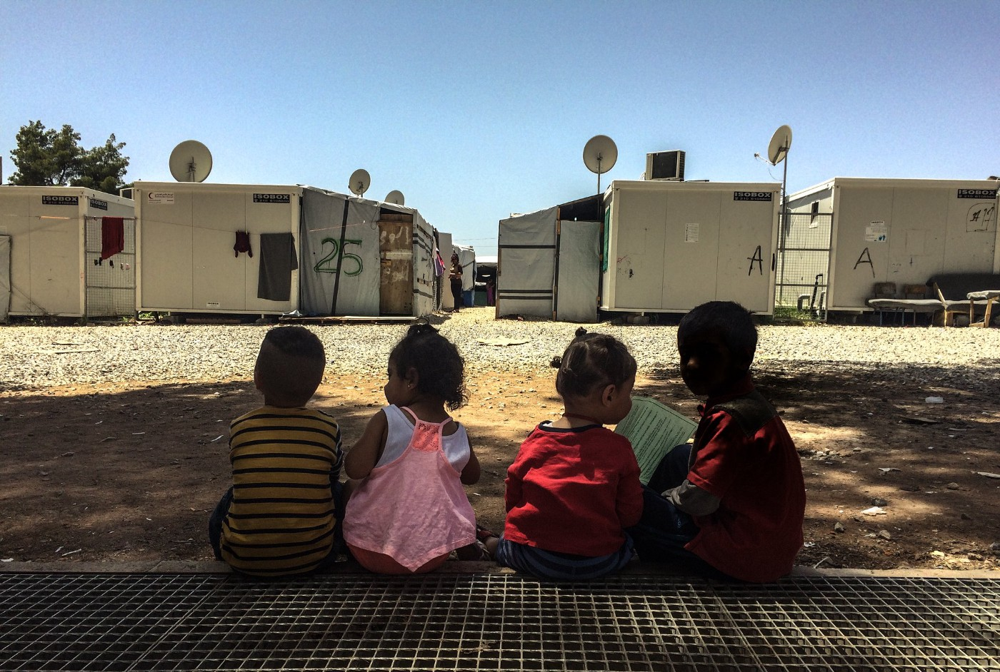

Photo by I Am You, Ritsona camp, Greece\.
### Feature

The number of people arriving and passing through the Balkans is increasing every day\. In Bosnia, the country where most of the people on the move are staying at the moment, according to official sources, between 60 and 100 people are entering daily\. Some are arriving from Serbia, some via Albania and Montenegro from Greece\.

At the same time, the number of people in Serbia and Greece is also increasing\. Official numbers show that the figures of newly arriving asylum\-seekers in Europe in the first five months of 2018 already exceed by far the total numbers for the entire 2017\.

In Bosnia, at the moment there are over 6,200 people, and in Albania over 2,400\. These are only people who have registered their intention to seek asylum in these countries\. The numbers are probably much higher since many people enter, stay and leave countries without being registered\.

While little is known about the situation in Albania, the situation in Bosnia is more visible\.

The people who are arriving stay for some time in Sarajevo waiting for registration, or hoping to get a place in a camp or some type of accommodation\. There is no camp in Sarajevo, but the authorities have announced that the first one could soon be opened near the city, in the area of Hadžići\. When open, and that could be as soon as the end of June, the camp will have a capacity of about 600 people\. Later on, it can be expanded to up to 5,000\.

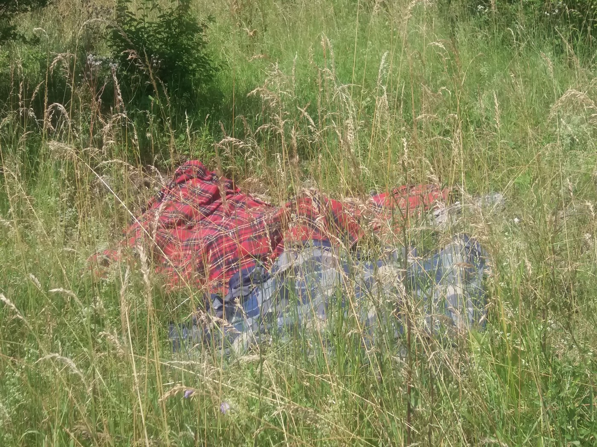

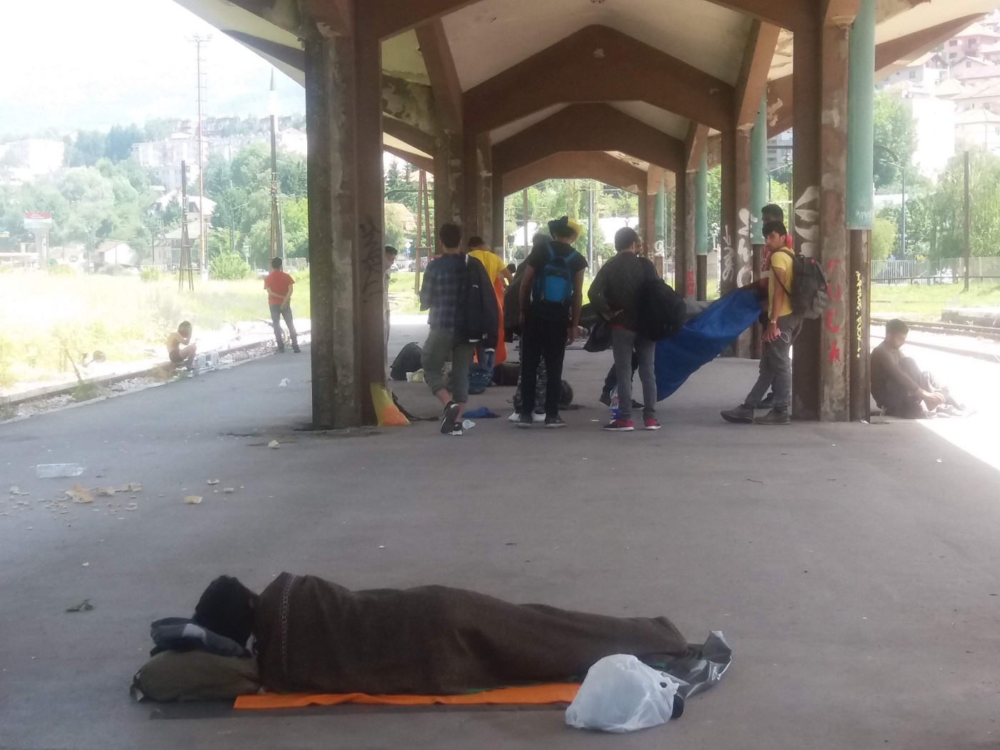

Hundreds of people are sleeping rough in Sarajevo\. The number is hard to establish\. The only help is provided by locals and volunteers\. Photo AYS\.

Another option, but many people are against it, is a small asylum centre in Trnovo, near Sarajevo\. The capacity is about 150 places, but at the moment it is overcrowded with more than 200 people\. The place is far away from any city or town, it is high up in the mountains, and there is no WiFi or phone signal\. Living conditions are not very good, and people refuse to go there\.

The third option near Sarajevo is the closed centre in Lukavica where people are treated as if they were in prison\. Apparently, many minors are inside, too\. People who were held inside for some time are telling stories about mistreatment, lack of food and unprofessional behaviour by the police inside the centre, including corruption and bribery\.

One more option, supported by the IOM, is the centre near the city of Doboj run by the local NGO Emmaus\. This NGO has contracts with the IOM and the government, and they also do food distribution in some areas\. Those who observed them doing food distribution, including AYS volunteers who were present in Sarajevo and Velika Kladuša when Emmaus was there, are saying that the way how they do it is the way it should never be done\. Their careless approach often causes fighting over food between refugees\.

Additionally, the centre in Doboj where some of the refugees have been placed is a closed centre that has not been created for refugees, but for victims of trafficking, former drug addicts and alcoholics, and people with special needs\. Nevertheless, somebody has decided to put refugees inside, also\.

The NGO restricts their freedom of movement and takes their documents\. If they want to leave for good, they can, but the NGO will keep their documents and deliver them to the local authorities\. It is not clear why the NGO has this power\. IOM and UNHCR are aware of this, as well as of the fact that it is not legal, but so far they have not reacted\.

People who are stuck in Sarajevo have two options at present\. The other option is to stay in the city and live in the streets, squats and with locals who accept them in their homes\. Several hundred people are staying like this\. Help is still being provided only by locals and volunteers\.

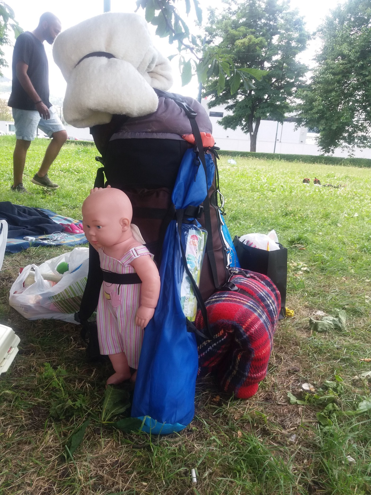

Among people sleeping in the streets in Sarajevo there are many children\. Photo by AYS\.

About 250 people are in Mostar in the Salakovac camp and all of the residents in this camp are saying that the conditions are very good\. It is run by the local Red Cross and under the jurisdiction of the state Ministry for Refugees and Human Rights\. Most families are in this camp, where locals come and share with them what they have\. The camp is open\.

Another area where people are staying is in the north of Bosnia, in the towns of Bihać and Velika Kladuša\. Both towns are near the border and at the moment it is estimated that over 2,500 people are in this area\. In Bihać they are accommodated in the old high school dorm, Đački dom, turned into some kind of centre that is run by the local Red Cross\.

The living conditions are dreadful\. The Red Cross does not permit any other organization or independent volunteers to enter the centre\. Special police are present all the time which makes the situation edgy\. People sleep on the floor in a building that is not safe to be used at all\. Food is provided once a day by the Red Cross\.

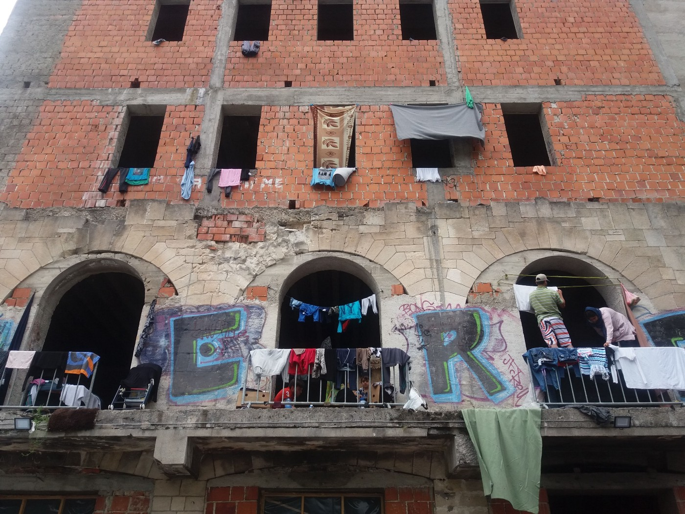

Center in Bihać where over 500 people are sleeping, including at least 15 families\. Photo by AYS\.

In Kladuša many people are accommodated by locals\. Others are squatting or staying in an open field which is becoming a camp\. Food is distributed once a day by Emmaus, and usually there are fights due to lack of food and the wrong method of distribution\. Sometimes, a second meal comes prepared by locals and distributed in a much better way\.

Groups of volunteers are providing all types of help, and residents in this camp are also willing to work together\.

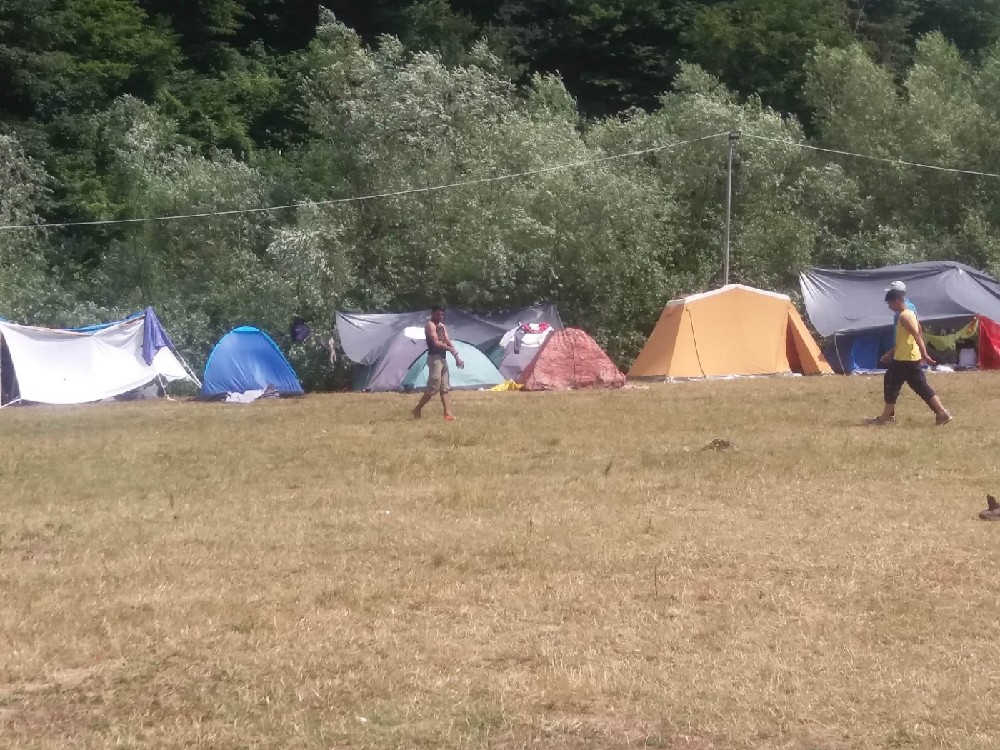

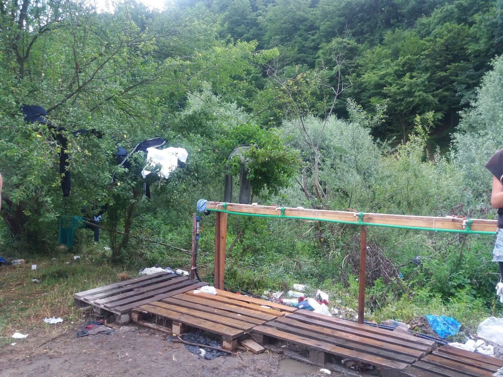

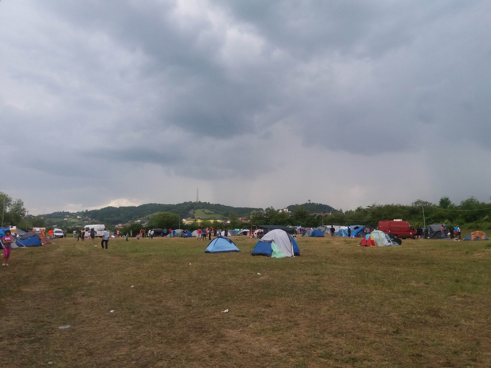

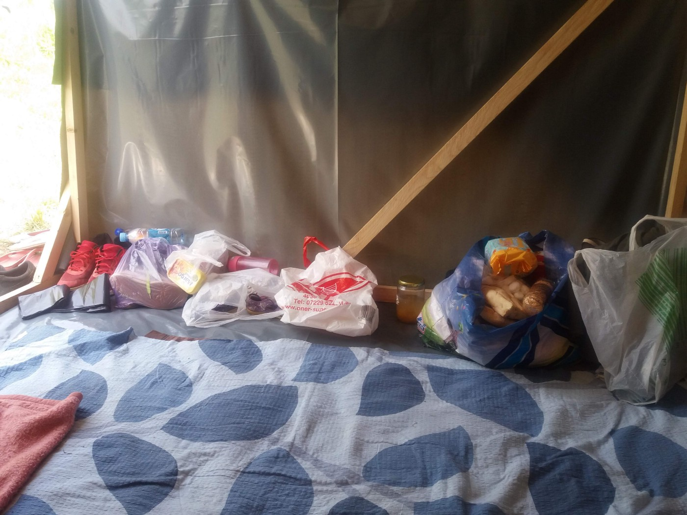

Camp in Velika Kladuša where SOS Team Ljuta Krajina works to help those who are living in the camp\. Photo by AYS\.

The place is not safe at all for women and children, but there is nobody to take care of this\. IOM and UNHCR, as well as other international organizations present in Bosnia, are aware of this but are doing nothing\. Nevertheless, the government is planning to build a big camp near Kladuša, in an industrial area full of asbestos\. The plan is to make a camp that will have space for up to 5,000 people\. It will be supported by the IOM\.

Many people are staying out in the open, sleeping rough and hoping to cross soon to Croatia\. But that is becoming almost impossible due to the closed border, but also violence by the Croatian border police\. People in villages near Kladuša are testifying about many people, including children, being pushed back and violently beaten up\. Croatian police also often enter the territory of Bosnia, villagers are saying, in an attempt to find people who are crossing in this way\.

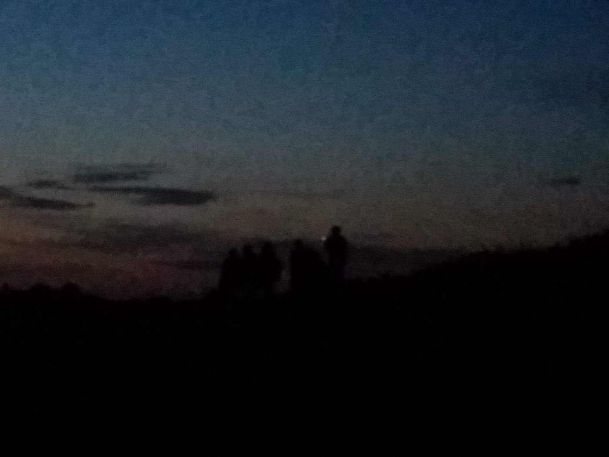

In the night, many people are trying to cross the border and reach the EU\. AYS met this group of 12 boys in the forest near Kladuša\. Photo by AYS\.

Since recently, more people have been coming back from Slovenia after being pushed back\. AYS also got the information that many people are being pushed back from Croatia to Serbia even though they crossed from Bosnia\.

Nevertheless, the entire situation is making people stuck in Bosnia edgy and very vulnerable\. The government is doing close to nothing to help them\. Access to asylum is still limited and the procedures are not clear, as well as access to the health system or any other services provided by the state and guaranteed by law\.

Due to this situation, volunteers in the field are noticing that people are on the edge and easily get into conflict over little things\. The latest information from Velika Kladuša is that last night one young migrant from Morocco was stabbed to death with a knife in the city park by another migrant\.

The UNHCR still does not consider the situation in Bosnia an emergency situation\. Nobody knows what is coming, since there are no plans or any kind of reliable predictions for Bosnia or any other countries in the region at the moment\. What is certain is that the EU plan is to keep people away, while ignoring violations of human rights at its borders and building new walls and fences\.
### Turkey

Turkey continues to prevent people from crossing the sea in an attempt to reach Europe\. According to the Aegean Boat Report, one boat was stopped on Friday morning at 06\.50 by the Turkish Coast Guard\. The boat was going from Ayvacik towards Lesvos\. There were 41 human beings on this boat, all of them dreaming of a better life\.

### Sea

The Aquarius is still on its way to Valencia and they are hoping to reach a safe place by Sunday morning\. The boat is full of children and yesterday they received some toys and a lot of love from the crew and all who are helping\.

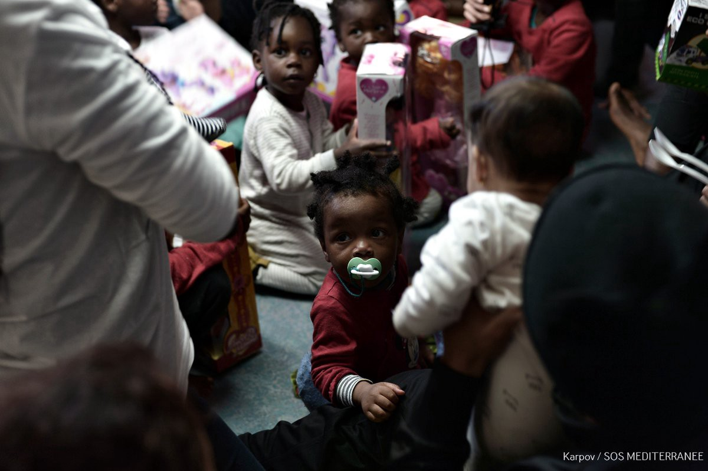

Some 42 people rescued by the Trenton after a shipwreck that killed 12 should land in Italy soon\. They were found and rescued off the Libyan coast\. It will arrive close to the island of Lampedusa on Sunday morning where an Italian coast guard vessel will take over the people, and then take them to an Italian port that has yet to be assigned\.
### Europe

An informal deal has been reached between the European Parliament and the EU ministers\. If ever implemented, this deal will allow faster access to the EU labour market and will strengthen protection for minors\.

“The main aim of the revised Reception Conditions Directive is to ensure equivalent reception standards in all EU countries, with the aim of reducing secondary movements within the EU and, subsequently, guaranteeing a fairer distribution of applicants among countries,” the press statement says\.
 
According to the deal, people who arrived in Europe will be allowed to work starting from six months after the registration of their application, instead of the current nine months\. They should get access to language courses from day one\.
 
Those applying for international protection will also be entitled to primary and secondary health care, including mental as well as sexual and reproductive health care\. In addition, children should enter the school system no later than two months after arrival\.
 
Member states should reach a common position on this key piece of legislation during the EU leaders’ summit on 28–29 June, to allow for negotiations with the Parliament to begin as soon as possible\.
 
For more, see the [press statement](http://www.europarl.europa.eu/news/en/press-room/20180614IPR05803/reception-conditions-for-asylum-seekers-agreed-between-meps-and-council) \.

At the same time, countries are [reaching agreements](https://www.bbc.com/news/world-europe-44494006) that are not at all for the benefit of people on the move\.

Italy and France jointly expressed support for EU “asylum centres” to be set up in countries where many migrants begin their journeys to Europe, including Libya\.

More measures could come after the meeting of EU leaders, many of whom are openly against migration, later this month\. With many right wing and populist governments, it is hard to hope for anything good\. The only hope is that citizens will wake up and react in solidarity\.
### Spain

Nevertheless, there is some good news in Europe\. Spain’s new socialist government promised on Friday it would restore free health care for undocumented migrants\.

The government will draw up a bill with the proposal, it said, which must be approved by parliament\.

The former centre\-right government withdrew the right to general health care for undocumented migrants in 2012 as part of a programme of spending cuts\.

At the moment it is estimated that there are some 800,000 people residing in Spain without papers\.
### Greece

Help is still needed on Lesvos\. Local activists from the House of Humanity are still taking care of over 600 people who fled Moria after another big fight in that overcrowded place\. Over 300 are still in emergency accommodation\.

H4H is solely responsible for the food, water, medical, hygiene, and legal needs of all of them\. Just to illustrate their expenses, they spend 150 euros each time the portable toilets are cleaned… And they are supposed to be cleaned daily\.

> “We spend 85 euros for each trip for a private company to pick up the trash because the municipality refuses to do so… Average 3 trips every other day \(120 euros a day\) 

> We have to purchase a pallet of water every day… 120 Euros\. 

> That’s 390 euros a day and we still haven’t discussed food, gas to transport people, water bill, electric bill, rent…\.” 

In order to continue providing help, [they need your help](https://www.humans4humanity.org/) \. Please, donate if you can\.

Additionally, we have heard rumours that we hope are not true, but we have to share them in order to call for solidarity and help\. Apparently, there might be a demonstration of locals — perhaps with the involvement of the vice mayor — against the House of Humanity in Lesvos\.

In the meantime, more people are arriving on Lesvos and other islands\.

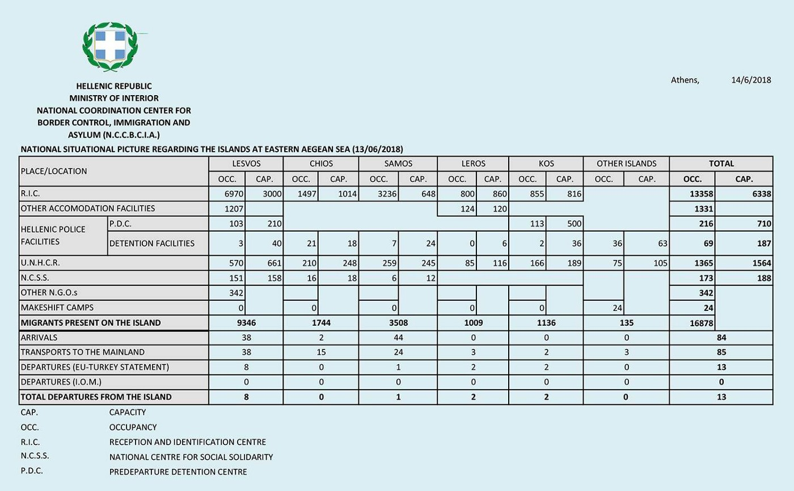

On Friday early this morning, a boat arrived carrying 27 people, mainly from Afghanistan\. The night before, a boat arrived on Lesvos north carrying 43 people, mainly from Iran\.

Khora is moving out of their Asklipiou building, but their Free Shop, a few doors away, will remain open throughout\.

“Another summer has come and Khora’s FreeShop has registered more than 900 families \(more than 2,600 people\) \! \! We are trying to let everyone have the clothes that they need but we are running out of clothes…
So, if you have any items that you do not need, please contact us, they are very valuable for others\! \!

If you want to send donations to the FreeShop, the address is: Asklipiou 113, 114 71, Athens, Greece
### Bosnia

Team SOS Ljuta Krajina needs your help\.

“People here in Velika Kladusa just need one pair of shoes to be able to continue their journey and keep their bodies fit…\.we can get one pair of proper sports shoes for 20 KM \(10 €\) which means a lot for two exhausted legs…\. 
Every single pair of shoes is a huge support and means much more than just covering two feet…

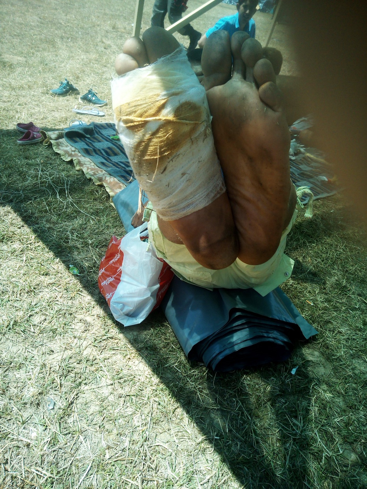

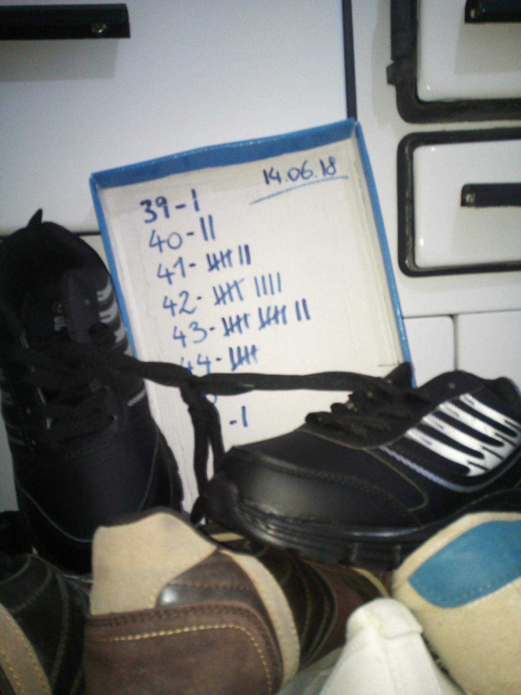

Photo SOS LJuta Krajina Team\.

If you want and can support you can donate to the PayPal account \(with subject happyFeet\): [piksi\.sos@gmail\.com](mailto:piksi.sos@gmail.com)
### France

Faced with threats of expulsion, on Sunday 17 June at 16 pm, there will be a rally of support for exilé\.e\.s before University Paris 8\.

### Germany

Local authorities in Bavaria, Germany, [could start turning](https://euobserver.com/migration/142104) back migrants on Monday \(18 June\) \.

The Bavarian ‘president’, the CSU’s Horst Seehofer, has said he has the authority to do it in his role as German interior minister even without the approval of Chancellor Merkel\.

Merkel urged them to hold off until EU leaders meet in Brussels on 28 June\.

According to the latest poll by TV station ARD, 62 per cent of Germans backed the CSU idea\.

**We strive to echo correct news from the ground through collaboration and fairness\.**

**Every effort has been made to credit organizations and individuals with regard to the supply of information, video, and photo material \(in cases where the source wanted to be accredited\) \. Please notify us regarding corrections\.**

**If there’s anything you want to share or comment, contact us through Facebook or write to: [areyousyrious@gmail\.com](mailto:areyousyrious@gmail.com)**

_Converted [Medium Post](https://medium.com/are-you-syrious/ays-daily-digest-15-06-2018-bosnia-the-end-of-the-road-df98297b4594) by [ZMediumToMarkdown](https://github.com/ZhgChgLi/ZMediumToMarkdown)._
