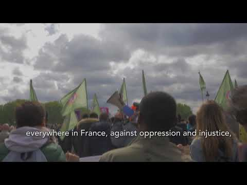
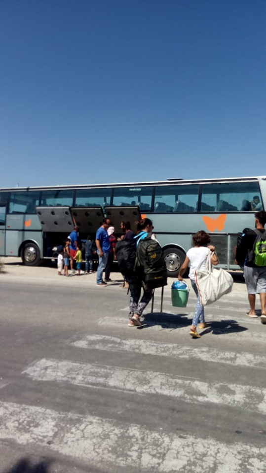
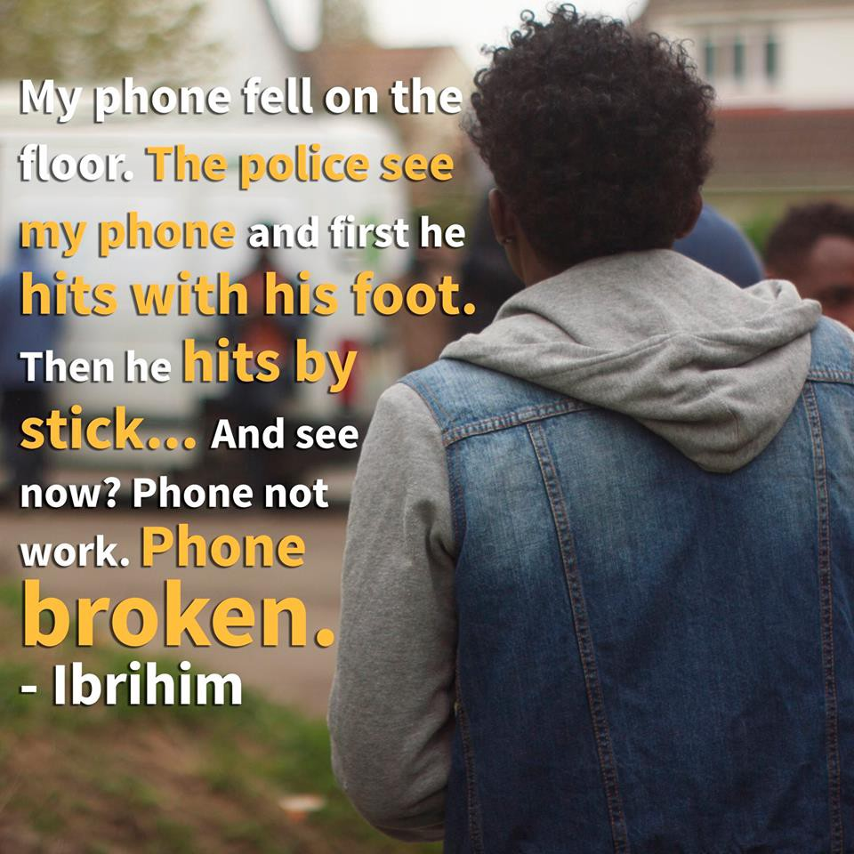

### AYS Daily Digest 19/06/2018: The occupants of Paris\-8 University continue their struggle

Asylum seekers attacked in Italy /// Updates from Diavata Camp in Greece /// Updates from Bosnia /// Two busy days in the Western Med /// Norway and Denmark plan to open “care centres” for minors in Afghanistan /// Rise in family reception in Italy

 \)](assets/2e0adc893869/1*8qPfsHk_KmAVEem2d2psnQ.jpeg)

\(Photo by [Les habitant\.e\.s de P8](https://www.facebook.com/ExileesOccupP8/) \)
#### FEATURE: **Updates from the occupants of Paris\-8 university**

As we reported in the last few days, the occupancy of the building within the University of Paris\-8 campus was threatened with impending eviction, and the occupants with detention and deportation\.

The occupants released a [statement](https://www.versobooks.com/blogs/3887-communique-from-the-occupation-of-paris-8-facing-imminent-eviction) about their five\-month\-long struggle:

> We — refugees, migrants, sans\-papiers, and people in solidarity ­ — have been occupying building A of the University Paris\-8 since Tuesday 30th January 2018\. Our demands have been clear: documents and housing for all\. On Saturday 19th April 2018, in the third month of the mobilisation, the president of the University, Annick Allaigre, announced that, according to the supervising ministries with whom she had begun negotiations, all the occupants would get documents and housing\. One and half months later, the president informed us that the negotiations were a failure and told us to leave the university by Sunday 17th June\. 

> In the circumstances, we denounce the manipulations of the presidency and the supervising ministries\. 

They denounce the criminal Dublin regulations and struggle against the “individualising logics of asylum law,” which divides ‘good refugees’ from ‘bad migrants’ and meets asylum seekers with detainment and deportation\. They have formed a front with several groups and collectives, students, artists, and academics in order to “push the balance of power against the racist institutions of the French state\.”

> Over the course of this occupation, we have practised political and legal self\-defense: we formed groups to accompany those going to meetings at the prefecture in which they were at risk, we politicised questions around health, we demonstrated outside the Mesnil\-Amelot detention centre to free a comrade who had been locked up there for three weeks\. While Annick Allaigre shut her university for four days because of so\-called problems with the central heating and brandished the threat of eviction during the trêve hivernale \[a winter “truce” where no evictions are authorised\], we organised a protest gathering several hundred people which put an end to the possibility of an eviction\. For four and a half months, we maintained a building in which up to 150 people of different nationalities lived\. 

> We were organizing so as to make the regularisation of the migrants of Paris\-8 the concrete example in the struggle against the racist and criminal migration politics of the European Union and France\. 

 \)](assets/2e0adc893869/1*6Z2DJEVJBKncjEgw1dn5Ag.jpeg)

Foreigners\! Don’t leave us alone with the French\! \! \! \(Photo by [Les habitant\.e\.s de P8](https://www.facebook.com/ExileesOccupP8/) \)

During this occupation, the migrants at Paris\-8 have conducted their own political struggle and demanded their rights\. The negotiations and general assemblies were conducted in 5 languages through translations\. In April, the promise of regularisation came along with the creation of negotiating bodies, and the request to **keep the negotiations secret** , as “they needed to avoid creating a precedent which might encourage the dozens of other occupied universities in France to host refugees and demand for papers\.”

> While we acknowledged the initiatives of the presidency, our reaction to this “victory” was clear\-minded\. This was the result of a struggle within the University, and beyond, as it was at the height of the social movement\. It was under no circumstances a gift\. So we were sceptical\. There had been too many intermediaries separating us from the decision\-makers: “the committee of mediation,” the president of the university, the prefect, and finally the ministries\. Each of these mediating bodies prevented clear and direct negotiations in which we could have concentrated all our energy\. Nevertheless, after several general assemblies, we took the collective decsision to give a list of the occupants names to the president, which she would transfer to the ministries, so as to proceed with the regularisations\. This was despite the known risk of all of us being put on file, which had kept us from handing over our confidential list for some months\. 

The failure of the negotiations and the political maneuvering has resulted in the state possessing a list of 146 refugees, migrants, and sans\-papiers who participated for a number of months in an illegal occupation\.

> At this moment, as the racist politics of the French state are radicalising \(the voting in of the recent Asylum and Immigration Law, police evacuations of the remaining Parisien camps in the last few days, and daily raids at Jaurès, la Villette, la Chappelle, etc\), this list puts the migrants of Paris\-8 at great risk\. 

> Every level of the state has collaborated here, from Gérard Collomb and the ministries, to the prefecture and including the manipulation by the administration at the university\. Stretching from the top to the bottom of the state, there has been a single racist spine acting against the migrants of Paris\-8 University\. 

The mobilisation carries on: on Monday night, more than 300 people gathered and spent the night with the occupants, successfully preventing police intervention\.

> There were nearly 300 of us at Paris\-8 tonight to oppose the police\-led expulsion of exilé\.e\.s who are occupying the university\. Our mobilization has paid off; it is because of our determination that the expulsion did not take place last night\. 

Protests were also [held](http://www.lefigaro.fr/flash-actu/2018/06/19/97001-20180619FILWWW00088-images-des-gilets-de-sauvetage-devant-le-senat.php) in front of the Senate during the discussion and the vote of the Immigration bill:

LIBYA

[Local media report](https://www.libyaobserver.ly/news/video-libyan-coast-guard-rescues-115-migrants-mellitah) that on Monday the Libyan Navy picked up 115 migrants and 5 dead bodies from the sea off the western coast of Libya\. Among them were 2 children and 22 women\. According to the media, the dead included 2 women and 3 men\. However, [survivors report](https://twitter.com/SARwatchMED/status/1008822503572213761) that it was actually 3 women and 2 small boys who died, while trying to climb on board the Libyan ship\. All of the migrant were aboard a rubber boat north of Mellitah district, eastern Zuwara in western Libya, which began sinking because of the high waves\.

According to [SAR Watch Med](https://twitter.com/SARwatchMED/status/1008822399054249984) , other survivors reported seeing an Italian vessel that refused to pick them up, forcing them to wait 3 hours for the Libyan Navy\.

TURKEY

On the 18th of June, the [Turkish Coast Guard reported](https://www.facebook.com/cell122/posts/1956596607896084) the arrest of a boat carrying 37 immigrants, which was heading toward one of the Greek Islands\. Those aboard are now being held in Izmir while they wait for a decision\.

Out of Turkey’s displaced Syrian population, which is 3\.5 million strong, 30,000 people who have been granted citizenship will have the opportunity to vote in the [Turkish Election](https://www.middleeastmonitor.com/20180619-turkey-30000-syrians-who-were-granted-citizenship-will-vote/) on the 24th of June — not exactly a representative figure\.

LAST TWO DAYS AT SEA

■■■■■■■■■■■■■■ 
> **[Craig Spencer MD MPH](https://twitter.com/Craig_A_Spencer) @ Twitter Says:** 

> > The Italian Coast Guard released its 2017 search &amp; rescue summary for the Med:

NGOs sighted 41% of all vessels in distress.

NGOs rescued 41% of people in distress.

NGOs play a crucial role. Closing ports to them means more will die at Europe’s doorstep. [guardiacostiera.gov.it/attivita/Docum…](http://www.guardiacostiera.gov.it/attivita/Documents/attivita-sar-immigrazione-2017/Rapporto_annuale_2017_ENG.pdf) 

> **Tweeted at [2018-06-19 12:04:56](https://twitter.com/craig_a_spencer/status/1009044355498283013).** 

■■■■■■■■■■■■■■ 

Xchange have published their new Central Med Survey\. Find a link [here](https://twitter.com/xchange_org/status/1008982784977883136) \.

[Guardamar Polyhymnia](https://twitter.com/salvamentogob/status/1008703363347812352?s=21) has rescued another _patera_ in the sea of Alboran with 34 people aboard, which was located by plane Semar 101\. In total, 73 people were on board 2 different _pateras_ \. The SAR Mamasto is headed to Almería with 79 people from 2 additional _pateras_ \.

[SAR Watch Med report](https://twitter.com/SARwatchMED/status/1008714560889610240) another 152 people rescued from 4 dinghies in the Alboran Sea\.

■■■■■■■■■■■■■■ 
> **[SALVAMENTO MARÍTIMO](https://twitter.com/salvamentogob) @ Twitter Says:** 

> > Imágenes del rescate ayer de un cayuco con 152 personas a 220 millas de  Canarias por la Guardamar Talía localizado por  avión Sasemar 103. Han llegado a #GranCanaria esta mañana https://t.co/b5No5lPFUb 

> **Tweeted at [2018-06-18 13:12:38](https://twitter.com/salvamentogob/status/1008699007458332672).** 

■■■■■■■■■■■■■■ 

 \)](assets/2e0adc893869/1*n2cqqxqyo6f9_Evgx7GIog.jpeg)

\(Photo by [Salvamento Maritimo](https://twitter.com/salvamentogob/status/1008379228193284097) \)
#### Aquarius Update

■■■■■■■■■■■■■■ 
> **[SOS Humanity](https://twitter.com/soshumanity_de) @ Twitter Says:** 

> > UPDATE As the #Aquarius is docked in #Valencia, teams are getting ready to go back as soon as possible to the central #Mediterranean search and rescue zone, to save more lives. Baptiste @[SOSMedFrance](https://twitter.com/SOSMedFrance) rescuer, gives us an update https://t.co/sZK8jjeQM8 

> **Tweeted at [2018-06-18 14:07:50](https://twitter.com/sosmedgermany/status/1008712897114066944).** 

■■■■■■■■■■■■■■ 

#### Dead and Missing update

■■■■■■■■■■■■■■ 
> **[IOM - UN Migration 🇺🇳](https://twitter.com/UNmigration) @ Twitter Says:** 

> > 40,073 #migrants &amp; #refugees arrived by sea to Europe in 2018.

857 dead/missing. Learn more ➡️ [missingmigrants.iom.int](http://missingmigrants.iom.int) https://t.co/7vYqLF6qcK 

> **Tweeted at [2018-06-19 07:42:03](https://twitter.com/unmigration/status/1008978200532279296).** 

■■■■■■■■■■■■■■ 

[Media report](http://www.rainews.it/dl/rainews/articoli/migranti-nave-diciotti-ministero-interno-porto-d194edd3-0db6-4f51-af6b-45b2e25c5a1c.html?wt_mc=2.social.tw.rainews_xxx.&wt&refresh_ce) that the Italian Coast guard has been collecting people from rescue boats to bring them ashore to Italy, which includes the 42 people from the American Naval ship, Trenton\.

GREECE
#### **Greek Islands**

According to [UNHCR data](https://www.facebook.com/AegeanBoatReport/photos/a.285312485325196.1073741828.285298881993223/370679013455209/?type=3&theater) , 522 people arrived on the Aegean islands last week, registering on average 75 arrivals per day\. This is a decrease from both the week before \(662\) and last year \(565\) \. In the same period, 341 asylum seekers were transferred to the mainland\. Over 14,500 people remain trapped on the islands, mainly from Syria \(32%\), Iraq \(25%\) and Afghanistan \(15%\) \.

As usual, official data from the Greek Government [report](https://www.facebook.com/AegeanBoatReport/photos/a.285312485325196.1073741828.285298881993223/370013200188457/?type=3&theater) different numbers, with 17,352 asylum seekers present on the Island on June 17\.
#### **People start returning to Moria camp**

People returning to Moria camp \(photo by Lesvos Solidarity — Pikpa\)

[Lesvos Solidarity — Pikpa](https://www.facebook.com/pikpalesvos/posts/2103880453220708) informed their followers that “after their letter to the authorities and negotiations with Moria camp management, people who were temporarily staying in Pikpa camp after the fights in Moria camp on 25 May have been leaving on several buses last Friday, back to Moria camp\.”

**Updates from Diavata**

On June 18, a video was published showing the conditions of Diavata camp, in the Thessaloniki area:

> The refugee camps in the Greek mainland turned into a similar picture to the refugee camps in the Greek islands\. The tents and the severe suffering and the congestion and the fight between the refugees, rain and storms and sleep in the tents under the rain, mud, heat, mosquitoes and scorpions\. 

#### **41 people found on the motorway outside Thessaloniki**

Local media [report](https://www.amna.gr/macedonia/article/268417/Pano-apo-40-prosfuges-kai-metanastes-fainetai-oti-egkataleifthikan-ston-dromo-apo-diakinites) that 41 people were found by the police walking on the Thessaloniki\-Evzonon motorway\. Most of them are from Iraq and Syria; they were probably abandoned in the region by traffickers\.

The police declared that suspected traffickers are arrested almost daily in Northern Greece\.
#### **Mothers Support Group enhancing campaign**

On June 14, Amurtel started their [summer campaign to enhance our Mothers Support Groups](https://www.facebook.com/AmurtelHellasforRefugeeMothersandBabies/posts/634482506906962?hc_location=ufi) , where pregnant women and refugee mothers with small children can come together to exchange ideas, share experiences, give and receive information, and, at the same time, offer and receive support in breastfeeding, child rearing, and women’s health\.

> These Mothers Support Groups are aimed at 

> • Creating networks of mothers to help alleviate the potentially harmful effects of isolation and alienation 

> • Cultivating inner strength and allowing for a meaningful maternity experience for both mother and baby 

> • Relieving stress and anxiety and strengthening the ability to create balance in family life 

> • Increasing basic knowledge of anatomy, physiology, bonding, and nutrition for infants and mothers\. 

> Greece continues to be one of the main entry points for refugees and migrants into Europe\. The uncontrolled and often unassisted flow of refugees is an enduring reality\. One in five refugee women of childbearing age \(15–45\) is likely to be pregnant\. 

You can support this campaign from Amurtel by donating via their [fundraising page](https://www.totalgiving.co.uk/appeal/greece-amurtel) or through Paypal at [amurtel\.gr\.donations@amurtel\.org](mailto:amurtel.gr.donations@amurtel.org)

ITALY

The Italian government is ruling by promoting the idea of a constant state of emergency, altering the perception of large portions of the population\.

■■■■■■■■■■■■■■ 
> **[Matteo Villa](https://twitter.com/emmevilla) @ Twitter Says:** 

> > #MIGRATION and PERCEPTIONS 🚢📉🤔. 11 months after a sudden and persisting drop in irregular sea arrivals to #Italy, 51% of Italians still believe #migrant sea arrivals are "similar or higher" than before (takeaways from @[IpsosItalia](https://twitter.com/IpsosItalia) survey for @[Corriere](https://twitter.com/Corriere)).👇 https://t.co/Oimvld3Qfc 

> **Tweeted at [2018-06-18 09:03:27](https://twitter.com/emmevilla/status/1008636297563566082).** 

■■■■■■■■■■■■■■ 

#### **Increase in family reception**

Local media [report](https://www.facebook.com/VitaSocialContent/posts/10156323438822357?hc_location=ufi) that while the Italian government is shutting its ports to asylum seekers, more and more families are registering on [Refugees Welcome Italia](https://www.facebook.com/refugeeswelcomeitalia/) to host asylum seekers in their homes\. In the last week, the platform reported an 80% increase in subscription from households and families willing to act as hosts\.
#### **Two Malian men shot in Caserta by people chanting “Salvini, Salvini”**

The social centre Ex\-Canapificio, the Caritas\-Città Viva Committee, and the SPRAR of Caserta released a [joint press statement](https://www.facebook.com/permalink.php?story_fbid=1171722929634520&id=527886284018191) reporting the shooting of two young men from Mali on the night of June 11\.

The two young men, beneficiaries of the Sprar project in Caserta, were victims of an explicitly racist attack\. They were shot with an airgun by three Italian men who shouted “Salvini, Salvini” \(the name of the new right\-wing Interior Minister, who notoriously just refused entry to Aquarius\) \. One shot hit a man named Daby in the chest, causing him to be hospitalized for 2 days\.

This is the latest of many racist attacks, which have exponentially increased in numbers in the last weeks\. The only comment from Minister Salvini was a [dismissal](http://napoli.repubblica.it/cronaca/2018/06/19/news/spari_contro_immigrati_al_grido_salvini_salvini_-199404541/?ref=RHPPLF-BH-I0-C8-P1-S2.4-T1) of the news\.
#### **Ospiti in Arrivo launched two fundraising campaigns**

You can [support](https://www.produzionidalbasso.com/project/playing-for-change-cambiamo-il-mondo-con-lo-sport-2/) them setting up the first Cricket team in Udine or [support](https://www.produzionidalbasso.com/project/viaggio-studio-in-senegal-per-il-sindaco-fontanini/) the Afro Diakhass association, which works with children in Saint Louis, Senegal\.

SPAIN

Local people condemned the Delegation of the Government of Melilla, which has detained more than thirty migrants, whom it intends to return to Morocco\. Many are female survivors of tragedy, including a pregnant woman\. The locals believe that the acceptance of the Aquarius was a distraction tactic to take attention away from larger human rights abuses\.

BALKANS

The number of people entering Europe through Greece and then making their way towards Croatia and Bosnia and Herzegovina is increasing\. More than 5,600 people have reached Bosnia and Herzegovina since the beginning of January, compared with just 754 across the whole of 2017\.

In Montenegro, authorities have reported 557 asylum requests May 2018 — the highest monthly figure in five years\. [The Red Cross](http://media.ifrc.org/ifrc/press-release/red-cross-warns-rising-needs-number-people-migrating-balkans-increases/) of Montenegro has assisted more than 1,000 people with food, clothes and medical supplies at reception centres and border crossings since the beginning of the year\.

BOSNIA

We have also [received reports](https://www.facebook.com/info.baa/photos/a.172924300123802.1073741828.172615020154730/254049582011273/?type=3&theater) that one person was stabbed during a fight at a refugee centre in Salakovac near Mostar and taken to hospital\. Another person was arrested\. Both are from Pakistan\.

With increasing pressure in the area, [an MP from Una Sana Kanton](https://www.facebook.com/158513821471464/videos/195463901109789/) , the area in Bosnia where most of the refugees and migrants are located, has asked the federal and the state government to release emergency funds\. He claims that the situation is becoming a state of emergency\. He also claims that local primary care centres, where asylum seekers are supposed to have health care, cannot cover the costs, and that the local Red Cross needs help to provide food for everybody\.

[The Municipality council of Velika Kladusa](https://www.klix.ba/vijesti/bih/opcinsko-vijece-velike-kladuse-protiv-smjestaja-migranata-na-podrucju-ove-opcine/180619129) voted against the state\-level proposal to build reception centres in their district\. They expressed their concerns, saying that the security in the city is in danger due to the large number of people and concluding that the problem could be dealt with if all the municipalities shared the burden and accepted a certain number of people\. They want the state security ministry, which is in charge of asylum seekers, to explain why Kladusa is the only destination and to issue plans to deal with the current situation\. They concluded that the state has failed to respond to the current crisis\.

SOS Team Kladusa reports from the ground [here](https://www.facebook.com/SOSTeamKladusa/posts/2055294631401207?hc_location=ufi) and asks for support\.

_In the end of course people need much more then fulfilled “basic” needs, but as long as people are kind of forced to be at this place, please support us to make it as much livable as possible\._

AUSTRIA

Demonstration on the 22nd of June against deportations to Morocco, Tunisia and Algeria\.

FRANCE
#### Donation urgently needed in Calais

From [Help Refugees](https://www.facebook.com/HelpRefugeesUK/posts/628684117492265?hc_location=ufi) :

\(Image by Help Refugees\)

> Every day our teams on the ground hear the same story\. The police are not only destroying people’s shelter, but their only connection to friends, family, emergency services, maps, and everything else we take for granted\. 

> Sadly, as long as authorities act like this, it falls on the shoulders of volunteers to provide the most basic of services\. Clothes, bedding, tents, a warm cup of tea\. It’s the simple things that can make all the difference on a cold night\. 

> Right now we are running desperately low on items at our Calais warehouse and need your help to support to people like Ibrahim in Calais\. 

Please donate here: [http://bit\.ly/HelpRefugeesFrance](http://bit.ly/HelpRefugeesFrance)

GERMANY

The EU Observer [reports](https://euobserver.com/tickers/142112) that German chancellor Angela Merkel has been given more time to agree a new EU migration policy by Interior Minister Horst Seehofer\.

> Seehofer wants police stationed at borders — against EU rules — turning back migrants arriving from other EU countries\. 

Last year Germany registered almost twice as many asylum applications as any other EU state, according to EASO\. The report states that some 222,560 applications were lodged in Germany in 2017, followed by Italy at 128,850 and France with just over 100,000\. Read EASO’s full report [here](http://europa.eu/rapid/press-release_MEX-18-4204_en.htm) \.

EU

European Migration Law has [published](http://www.europeanmigrationlaw.eu/en/articles/news/court-of-justice-judgment-directive-2008115-return-gnandi-case-c-18116.html) an update on new EU asylum case law: _Member States are entitled to adopt a return decision as soon as an application for international protection is rejected, provided that the return procedure is suspended pending the outcome of an appeal against that rejection\._

DENMARK AND NORWAY
#### **Care centres to be set up in Afghanistan**

Media sources [reveal](https://politiken.dk/udland/art6593415/Afviste-b%C3%B8rneflygtninge-skal-sendes-til-Kabul) that Denmark and Norway are planning “care centres” in Kabul in order to send rejected unaccompanied minors from the two Scandinavian countries back to Afghanistan\.

The organisation Save the Children and an unnamed diplomat warned the Danish and Norwegian governments that everything could go wrong, and that this plan puts minors in serious danger\.

**We strive to echo correct news from the ground through collaboration and fairness\.**

**Every effort has been made to credit organizations and individuals with regard to the supply of information, video, and photo material \(in cases where the source wanted to be accredited\) \. Please notify us regarding corrections\.**

**If there’s anything you want to share or comment, contact us through Facebook or write to: [areyousyrious@gmail\.com](mailto:areyousyrious@gmail.com)**

_Converted [Medium Post](https://medium.com/are-you-syrious/ays-daily-digest-19-06-2018-the-occupants-of-paris-8-university-continue-their-struggle-2e0adc893869) by [ZMediumToMarkdown](https://github.com/ZhgChgLi/ZMediumToMarkdown)._
