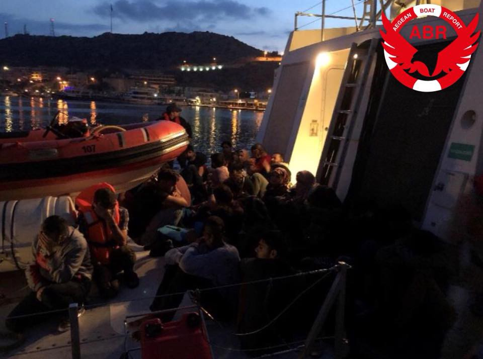
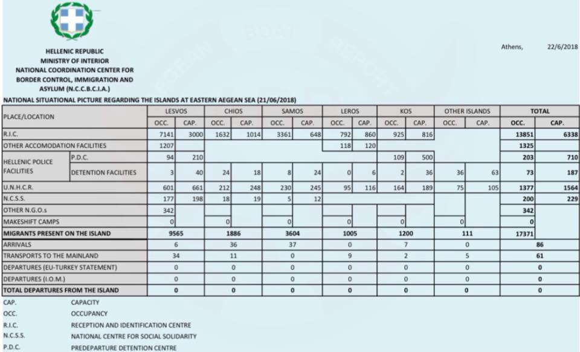
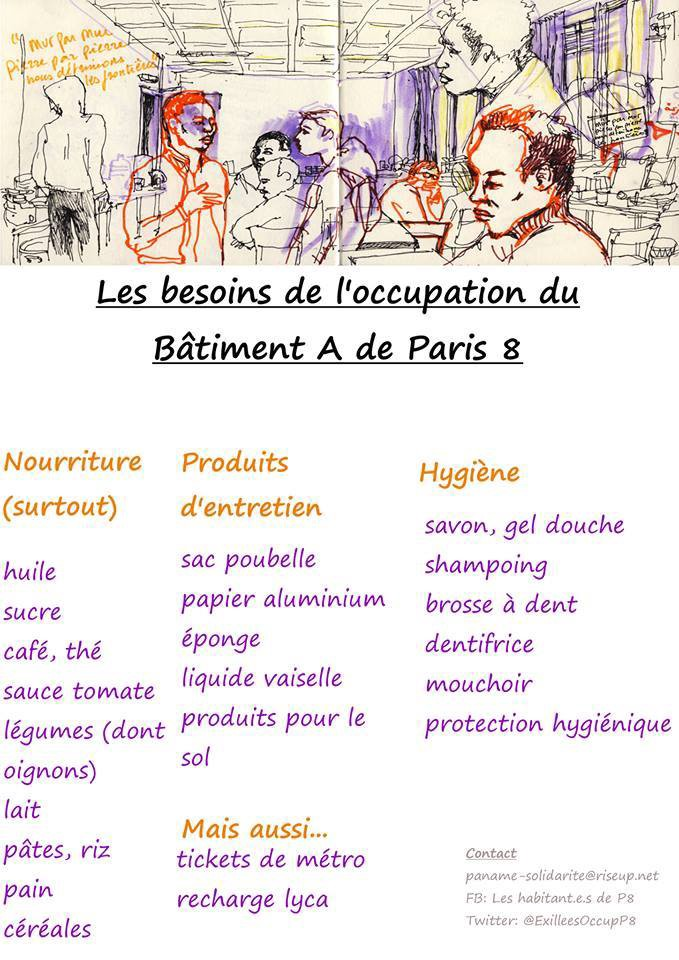

### AYS DAILY DIGEST 22\.06\.2018: Punishing People, Protecting Policy

_Mini migration policy in advance of “real” migration policy holds little hope for people struggling, more support for Borders and “People Holders” than People // Scapegoating in fallout of May Attacks in Moria // Call for volunteers in Greece // Update from Serbia // Protests in Austria // Needs in France // More…_

](assets/bde644d88629/1*0kbTk0ykqV6GYhPASESYWg.jpeg)

Photo Credit: [Refugee Accommodation and Solidarity Space City Plaza](https://www.facebook.com/sol2refugeesen/)
### FEATURE

Ahead of the Migration Mini Summit being held this weekend \(culminating on Sunday\), there has been [vocal calls](http://www.unhcr.org/news/press/2018/6/5b2d16134/statement-un-high-commissioner-refugees-filippo-grandi-europe-asylum.html) \(although some of them ring particularly hollow when considering the complicity with which these entitie frolic along with inhumane policy\) for a renewed effort to provide a [unified and humane refugee and migration policy in Europe](http://www.unhcr.org/news/press/2018/6/5b2d16134/statement-un-high-commissioner-refugees-filippo-grandi-europe-asylum.html) \. However, the track record as well as the rhetoric going into the summit do not provide much hope that anything will be done\. The “Visegrad four” countries have opted out of participating in the mini\-Summit, focusing their efforts on the primary summit to be held next week\. Additionally the prime minister of Bulgaria, Bulgaria holds the seat of the EU presidency currently, called for an immediate closure of the outer borders of Europe\.

There has been a dizzying amount of rumours flying about in recent weeks about new efforts to curb migration to Europe\. With some speculation of [reception centres being established in Albania](http://www.infomigrants.net/en/post/10107/potential-eu-albania-asylum-deal-could-help-keep-germany-s-angela-merkel-in-power) \(Austrian officials state that the deal is progressing while [Albanian officials deny it’s taking place](https://www.b92.net/eng/news/politics.php?yyyy=2018&mm=06&dd=20&nav_id=104437) \), although this has been officially quashed\. Prevailing hunches seem to revolve back around to simply reinforcing the “current solution” more centers and money going to North Africa\.

Although the requisite lip service about the “safety and security” of people on the move is always invoked, the track record of migration summits seems to be one that is always oriented towards “who takes them”; “how do we stop them”; and “how do we get them out\.” The extent to which officials obtusely refuse to learn from the lessons of the past and continue to act as though this crisis is devastating Europe when in reality, the true victims remain hunted by police, oppressed by traffickers, and ignored by politicians is always maddening\.

On the tip of the tongue of any discussion of EU migration policy is the EU\-Turkey deal which strengthened the capacities of Turkey to prevent people from reaching Greece\. Although in the aftermath of the capture of Afrin and the subsequent flight of tends of thousands of people from the area, there has been deteriorating border security of the land border between Greece and Turkey \(with a large influx happening in the Evros region\), the sea patrol remains busy\. Aegean Boat Report reports that in “\[the\] last two days, 8 boats have been stopped by Turkish Coastguard, on their way towards the Greek islands, carrying 308 people\. \(66 children, 101 women, 141 men\)
So far this year 400 boats have been stopped on their way towards the Greek islands, with a total of 16797 people\.” [Source](https://www.facebook.com/AegeanBoatReport/posts/374442966412147?hc_location=ufi) \.

Photo Credit: Aegean Boat Report

A large proportion of refugees remain in Turkey\. In a recent article by Al Jazeera English, this topic is set to become an important one in the upcoming election with refugees being, again, scapegoated for undermining the Turkish economy and the ability of local people to find work\. Read more [here](https://www.aljazeera.com/amp/news/2018/06/turkeys-syrian-refugees-hot-topic-issue-upcoming-election-180620113023920.html) \. Indeed the true reality behind this so\-called hospitality is less gleaming and humanitarian as is often presented, as noted in an [AYS report this spring](ays-special-from-turkey-abandoned-in-the-fields-654d3f925141) \.

Tens of thousands of people have died in their attempt to reach safety and security, yet the primary concern of most governments and countries is a PR\-related one\. When the victims were primarily men, the spun out folk wisdom of “but if they are real refugees, why are they all men??” was trotted out\. Now that increasing cases of women and children suffering and dying are reaching the public consciousness, a new narrative is needed\. “The parents are the real villains here” seems to be the new intellectual explanation\. “Why would you take your child on such a dangerous journey?”

With any close examination, this pathetic excuse and erasure of ineffective and cruel border policy falls apart\. If the parent did not take their child, the parent would be accused of either abandoning their child in an unsafe place or, more likely, this separation would be used to clearly illustrate that the location they were leaving was clearly “not that dangerous\.” As Europe trots ever closer to showing it’s true, unvarnished view of people fleeing war, poverty, and terror, we have an obligation to stay informed of how “common wisdom” is used to shift public opinion\. For it is public opinion that provides a cavernous silence and heavy darkness in which cruelty can be exacted\. Cruelty seems to know no borders\.

Sources: [Reuters](https://www.reuters.com/article/us-europe-migrants-bulgaria/bulgaria-to-propose-immediate-closure-of-eu-borders-to-migrants-idUSKBN1JI1SK) \.
### GREECE

“Greece’s National Meteorological Service EMY issued a weather warning with heavy rainfalls and thunderstorms, locally with hail falls and gale wind” via Keep Talking Greece\.
#### Islands

The most recent figures from the Greek government show that there are over 17,000 people on the islands, well over the capacity of facilities which, all told is around 9,000\. There were only 61 transports to the mainland, and none of these were transports from people residing on the island\. For perspective, the next round of EU panic over the influx of people to Bosnia from Serbia was prompted by approximately 4,000 people\. Serbia’s official numbers had been hovering around 8,000–10,000 for the entire country up until this winter when the new route to Bosnia started decreasing the number of people staying in Serbia\.

credit: aegean boat report
### Lesvos

H4H has been subjected to increased pressure for continuing to house people who had left the reception centres in the aftermath of clashes in Moria\. Although the organizers had initially had the “blessing” of larger organizations and authorities \(who reportedly brought large numbers of people to the centre\), over time and as the organization became more informed and more vocal in critiquing the policies and politics of the camp, H4H received an increase of pressure against them\. Now the remaining 100–200 people in their centre who still do not feel safe about returning to Moria have been subjected to threats of a police raid for them being in an “unauthorized” location and thereby being a risk to the “surrounding” population\. The local media published the order from the local authorities that H4H is endangering the health of refugees and the public\.

For more information, go to Humans 4 Humanity’s [page](https://www.facebook.com/Humans4HumanityOrg/) \. They are calling for people to get involved and support their campaign\.
#### Thessaloniki:

Mobile Info Team is in urgent need of a coordinator with fundraiser experience\!

_URGENT: Coordinator with fundraising experience needed_

[_https://greecevol\.info/task\.list\.php?ID=857_](https://greecevol.info/task.list.php?ID=857)

_The Mobile Info Team in Thessaloniki is looking for a long\-term \(at least 3 months\) volunteer coordinator with experience in coordination and experience/knowledge in fundraising, human resources and administration\. You would assist the founder of the MIT with all the not legal related issues of running the team; legal experience is welcome, but not necessary\._

_What we offer: The coordinator would be provided with housing, food and, if she/he can stay more than 3 months also with a modest stipend with bonuses connected to fundraising results\._

_If you are interested, please send me a PM or send your CV and a short motivation letter to: contact@mobileinfoteam\.org_

_You can find here a video, showing more about the work we do: [https://www\.youtube\.com/watch?v=907caDfm3Qs](https://www.youtube.com/watch?v=907caDfm3Qs)_
#### Athens:

The ECHO refugee library needs your help\! Their van broke down so now many people can’t get access to so many wonderful books\!
“We’re currently providing books and learning resources in 4 camps and 3 city sites — with hopes to increase our reach over summer\. 
 
 Disaster has struck — our poor vans clutch has broken\. We’ve had to pause all our sessions until we fix this — which will cost €500–600\. Our current financial situation doesn’t allow us to cover this cost and keep the library running\.”

If you can help chip in and get them back on the road, and get books back into the hands of people, go to their [page](https://www.facebook.com/refugeelibrary/photos/a.1063538737064452.1073741828.1055088404576152/1768363886581930/?type=3) \!
### SERBIA

According to Praxis, there were at least 859 newly\-arrived people in Serbia that they provided information to during the month of May\. Their report goes on to provide a detailed breakdown: 
_“Praxis continued its field work and provided a total of 859 newly arrived refugees and migrants \(642 adults — 534 men and 118 women, and 207 children — 157 boys and 50 girls, including 103 potential unaccompanied and separated children \(UASC\), 102 boys and 1 girl\) with relevant information\._

_The families and UASC waiting for registration or transport to one of the asylum or reception centres they had been referred to still had the option of spending the night in the aid hub Refugee Aid Miksalište, in the proximity of Belgrade Bus and Train Station\. In this reporting period, SCRM organised, on one occasion, the transportation of the refugees/migrants to the Reception Centre in Bosilegrad\. Info Park continued to provide one meal a day for newly arrived refugees/migrants, and occasionally covered the costs of transport to the reception and asylum centres\. Beside Praxis and Info Park, RAS also occasionally covered the transport costs\. MSF clinic continued to provide medical support\. In this reporting period, there was no organised distribution of clothing and footwear in the field in Belgrade\.”_

Read more [here](http://www.praxis.org.rs/index.php/sr/praxis-in-action/migration/item/1349-praxis-has-published-protection-monitoring-report-on-migration-for-may-2018) \.
### CROATIA

A concert and market will take place at 8PM on June 23rd in Zagreb Croatia\! It is free for entrance and will showcase the stories of people who are walking in the footsteps of others who have left their home countries in search of safety\.

“The Qafila, also called Qafila al Hayat, the so\-called Journey of Life, sends young artists and musicians from seven countries to travel as a caravan in the footsteps of the men and women who fled war and destruction in their home countries in the Middle East along what became known as the Balkan Route\. And while they are experiencing their compatriots journey, these young people are on a mission: to show local audiences the rich culture that is a treasure brought by the people travelling towards a future on this most fateful journey of their lives\.”

Click below for more information

### HUNGARY

Hungary proposing law that would criminalize citizens providing any assistance to migrants, refugees, or asylum seekers\. Human Rights Watch released a report calling out the proposed law, calling on the President to veto the bill\. 
“If signed into law by Hungarian President Janos Ader, starting July 1, human rights workers and community volunteers could be prosecuted and jailed for up to a year for providing services, advice, or support to migrants and asylum seekers\.

Ader should veto the bill and stop Hungary’s flouting of European Union and international refugee law\. Otherwise, a wide range of legitimate activities, including border monitoring as well as producing and disseminating information, could lead to criminal prosecutions\.”

The sick reality was that this law was passed on World Refugee Day\. A telling coincidence\. Read more [here](https://www.hrw.org/news/2018/06/22/hungary-tries-stop-asylum-seekers-new-law) \.
### AUSTRIA

There was a series of protests that took place in front of the embassies of Morocco, Algeria, and Tunisia in Vienna today\. The activists took a bus to each of the embassies with a specific message for each one\. To Morocco, stories were shared of those facing hurdles to escape to Europe\. To Tunisia, a request to support their people abroad\. To Algeria \(which was ended early because of rain\) a call to end collaboration with EU border policies\.

](assets/bde644d88629/1*JfMMWiAqWMQcyNHb4Bcdhg.jpeg)

Photo Credit: [Plattform Refugees Welcome](https://www.facebook.com/plattform.refugees.welcome/?hc_location=group_dialog)
### FRANCE

The P8 occupation needs your help\! There is a great need for food donations to the occupation of exilé\.e\.s of Paris University 8 \(Saint Denis University Metro\) now today\! \! Below is a list \(in French\) of what’s needed and how to help\!

Volunteers in Calais report an uptick in systematic destruction of people’s phones by police\.

> Ibrahim, who lives in Calais, says this: 

> “I see police, I run away, and my phone fell on the floor\. The police see my phone and first he hits with his foot\. Then he hits by stick\. He tells me “degage \[clear off\] \!” And I don’t come back\. But I watch him pick up my phone and throw in the garbage\. I wait 30 minutes and go get my phone\. And see now? Phone not work\. Phone broken\.” 

Refugee Info Bus is collecting their testimonies, providing wifi, as well as trying to fund phone replacements for the cruel and unnecessary theft and abuse of an important lifeline\! Read more of their testimony [here](https://medium.com/thedigitalwarehouse/where-do-we-draw-the-phone-line-3fbb02cc6086) \. And find out how you can [support](https://www.facebook.com/RefugeeInfoBus/posts/2166544186914331?hc_location=ufi) \.

Additionally [L’Auberge des Migrants](https://www.facebook.com/AubergeMigrants/?hc_ref=ARQh3I6ZX9b3niYS1qvo8iK6el5w997yepIMpjKt_cZj7qYqfML3ok-BIwKTQpcF534&fref=nf) posts that there is, as usual, a dire shortage of Shoes in Calais\. Rather than donating used or new shoes, it is more useful to donate money and let volunteers and helpers source the right shoes locally\! Please visit their page and donate, if you can\!

> **We strive to echo correct news from the ground through collaboration and fairness\.** 

> **Every effort has been made to credit organizations and individuals with regard to the supply of information, video, and photo material \(in cases where the source wanted to be accredited\) \. Please notify us regarding corrections\.** 

> **If there’s anything you want to share or comment, contact us through Facebook or write to: areyousyrious@gmail\.com** 

_Converted [Medium Post](https://medium.com/are-you-syrious/ays-daily-digest-22-06-2018-punishing-people-protecting-policy-bde644d88629) by [ZMediumToMarkdown](https://github.com/ZhgChgLi/ZMediumToMarkdown)._
