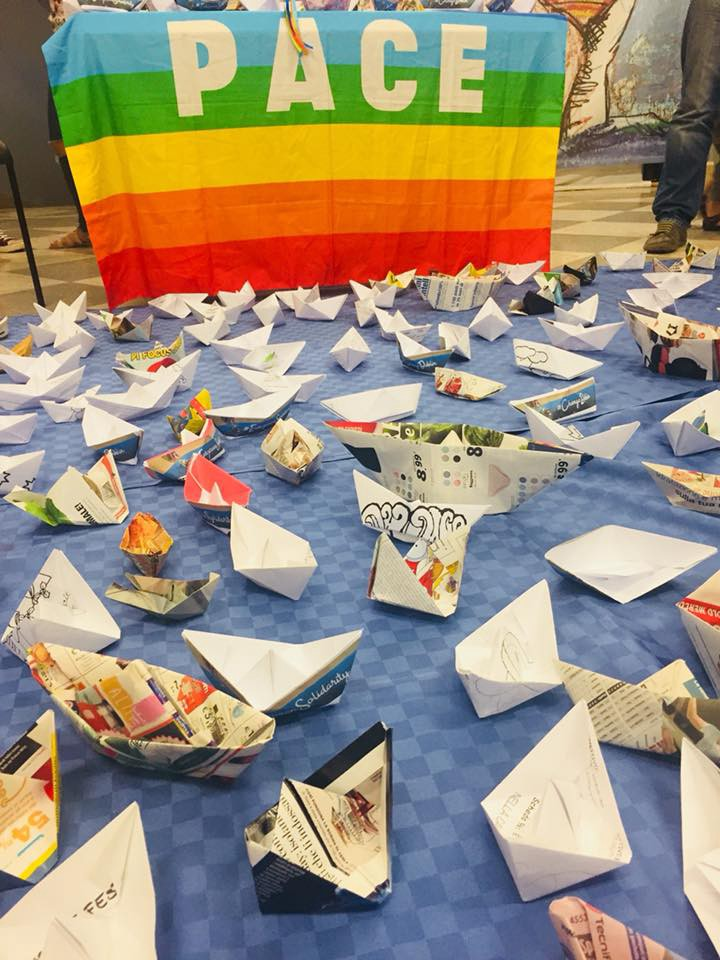

### AYS Daily Digest 27/06/18: Union of Cowards

_Rescues at sea//New Arrivals in Greece//Van crash kills three in Northern Greece//Police intimidation in Bosnia//Dublin removals to Bulgaria challenged in France//Protest in Austria//And more…_

 , 21/06/18\. “These people have a right to flee, a right to life, a right to apply for asylum\! These obligations must be respected by the states of the EU\.”](assets/9e0344bbe715/1*K5Df9YgDgWuv26YlHIBu1w.jpeg)

Photo Credit: [Mission Lifeline](https://www.facebook.com/seenotrettung/photos/a.113123962427485.1073741828.111682292571652/388103434929535/?type=3&theater) , 21/06/18\. “These people have a right to flee, a right to life, a right to apply for asylum\! These obligations must be respected by the states of the EU\.”
### Feature

The Lifeline rescue ship has finally been allowed to disembark in Malta\. The 234 refugees it was carrying are now on land after spending nearly six days stranded at sea\. The people aboard this ship have gone through horrible conditions to reach Libya\. They survived the torture and kidnapping centers in Libya\. They survived the treacherous journey across the Mediterranean, and then had to withstand almost another week at sea\. Their needs were put on hold a final time before disembarking, this time to accommodate tourists:

■■■■■■■■■■■■■■ 
> **[Chris Catrambone](https://twitter.com/cpcatrambone) @ Twitter Says:** 

> > #lifeline now visible from #Malta offshore. Waiting for a cruise ship to leave so she can enter Grand Harbour https://t.co/Tt9NMztzV7 

> **Tweeted at [2018-06-27 16:39:58](https://twitter.com/cpcatrambone/status/1012012672936706048).** 

■■■■■■■■■■■■■■ 

The captain of the ship is being questioned by Maltese authorities for his refusal to hand over the people he rescued from the murderous Libyan Coast Guard\. The German Interior minister Seehofer, who has taken an increasingly hostile stance towards refugees, is demanding that the rescue ship be [confiscated](https://twitter.com/ErikMarquardt/status/1011986282367672320) and the crew investigated as a condition for taking in the ship\.

Maltese authorities seem to be in agreement and are impounding the ship pending a “full investigation”\. The crew of the Lifeline is being investigated for rescuing lives, which is the obligation of all vessels at sea\. And every day their ship is impounded means more needless deaths in the Mediterranean\.

While Malta seems to have finally relented in this case, EU officials need to come up with a long\-term plan for disembarking refugees from rescue ships\. Since Italy started turning ships away earlier this month, far fewer rescue missions have been operating and more people are being stranded at sea\.

 in a safe habour\. The last days have put an extreme burden on those rescued, the crew, and everyone on land\. As answer to German interior minister Seehofer’s call to seize the LIFELINE the crew decided to enter the harbour with a [\#freeIUVENTA](https://www.facebook.com/hashtag/freeiuventa?hc_location=ufi) banner\. Thank you for showing your support\!”](assets/9e0344bbe715/1*SerbiRtCC-GV2mw-5NcT8w.jpeg)

Photo Credit: Jugend Rettet/Selena Efa\. “A huge relief to finally see the [\#LIFELINE](https://www.facebook.com/hashtag/lifeline?hc_location=ufi) in a safe habour\. The last days have put an extreme burden on those rescued, the crew, and everyone on land\. As answer to German interior minister Seehofer’s call to seize the LIFELINE the crew decided to enter the harbour with a [\#freeIUVENTA](https://www.facebook.com/hashtag/freeiuventa?hc_location=ufi) banner\. Thank you for showing your support\!”

Last week the Aquarius was forced to make a 200\+ mile trip to Valencia to drop off the people they had rescued\. The EU cannot allow this to become a policy\. Forcing rescue ships to make trips to distant countries is not only irresponsible, it is lethal\. As the Aquarius was making its trip to Valencia, an estimated 200 people drowned in the Mediterranean because there were not enough ships to complete rescues\.

Emmanuel Macron has been one of the many EU politicians to condemn Italy for its refusal to take in the ships, yet he has still refused to open France’s ports\. Such behavior is an example of the cynical blame\-game the EU is engaged in when so many lives are at stake\. There is a common sense solution here: the EU must negotiate with Malta and Italy to allow the ships to disembark, and then create a plan to relocate the people taken there to other countries\. This seems to be what is happening with the refugees who just disembarked from the Lifeline, but [the negotiations](https://www.gov.mt/en/Government/Press%20Releases/Pages/2018/June/27/PR181466.aspx) are being made on an ad\-hoc basis, not as policy\.

EU officials have published the draft of conclusions reached on the 26 June summit on migration, and it lacks any common\-sense solutions\. The resolutions of this meeting fly in the face of human rights, and they often laud “European Values”\. The agreements make no provision for the protection of refugees, and endorse the EU and Italy’s continued funding of the murderous Libyan Coast Guard\. Furthermore, the extremely vague recommendation to solve the current crisis of rescue ships prevented from disembarking recommends a fast\-track deportation process for people fleeing Libya \(“a rapid processing to distinguish between economic migrants and those in need of international protection”\) \. Amnesty International has published a revised version of the meeting resolution which shows just how far EU leaders have gone in abandoning their international obligations\. You can access it [here](http://www.amnesty.eu/content/assets/Doc2015/June_2018_EUCO_AI_alternate_council_conclusions_FINAL.pdf) \.

We are sick of these resolutions\. We have heard too much of the bloodless language of the EU, of these bureacratic phrases which hide their brutality\. We are tired of this Union of cowards\.
### Sea

Spanish rescue organization [SMH](https://twitter.com/salvamentogob/status/1011881101755809793) rescued a total of 184 people from seven boats today between Morocco and Spain\. The rescues were carried out by the Marina Gadir, Marina Arcturus, Guardamar Concepción Arenal, and the Mar Luz ships\.

Today a rescue phone\-line organization aired their concerns about the high number of people attempting to reach Spain this year\. Over 14,000 have attempted the crossing this year, making it almost on par with the numbers of crossing to Italy\. [This month](https://twitter.com/fladig/status/1011970325683335171) there have been far more crossings to Spain than Italy, which is very unusual\.

Yesterday, the organization supported 11 boats in emergency rescues\. It is still waiting for more information on the fate of two boats carrying 12 people, who have not been heard from since yesterday\.
### Greece

_New Arrivals_

According to [Aegean Boat Report](https://twitter.com/BoatAegean/status/1011828145681584128) , a boat was picked up near Samos by German Frontex carrying 46 people, including six children \(numbers still to be confirmed\) \. Lifehouse relief reported that a new boat arrived at Lesvos with 22 people: five men, five women and 12 children\.

_Islands_

[Mobile Info Team](https://www.facebook.com/mobileinfoteam/photos/a.1800063030222418.1073741830.1796286800600041/2200007463561304/?type=3&theater) wrote today that many people who have been trying to get an appointment through Skype to apply for asylum on the mainland have not been able to get through\. The Greek Asylum Office says there are many technical difficulties with the Skype line\. The Greek Asylum office has reassured that they are working to fix the issue, but the Mobile Info Team cannot give a timeline for when the problem will be fixed\. With this being the main access for people stuck on the islands to apply for asylum, Mobile Info Team will continue to push for a solution\.

In other Government related news:

■■■■■■■■■■■■■■ 
> **[Giorgos Christides](https://twitter.com/g_christides) @ Twitter Says:** 

> > Greece to deploy drones to patrol #refugee crossings from Turkey in the Aegean. Stated goal is to „limit illegal migration“. Procurement notice is for 25 drones and telecom worth close to 1,2 million euros &amp; funded by EU‘s AMIF  [eprocurement.gov.gr/eproc-delibera…](http://www.eprocurement.gov.gr/eproc-deliberation/unprotected/searchDeliberations.htm?execution=e1s2) 

> **Tweeted at [2018-06-27 06:58:36](https://twitter.com/g_christides/status/1011866369896394752).** 

■■■■■■■■■■■■■■ 

Advocates Abroad has issued an Asylum Seeker and Refugee Suicide Attempt Guide for their advocates and any other volunteers working with refugees\. You can find it [here](https://www.facebook.com/advocatesabroad/posts/619070268453378) \.

_Mainland_

A van crashed on the Egnatia Highway in northern Greece today\. Authorities say that the people inside were trying to cross the border and were being transported by a human trafficker\. [Greek outlets](http://www.ekathimerini.com/230104/article/ekathimerini/news/three-killed-seven-injured-in-migrant-smuggling-car-crash) are currently reporting that three people died in the crash and seven were critically injured\.

[Communitism](https://www.facebook.com/communitism/photos/a.856093737873659.1073741828.805461649603535/1363426707140357/?type=3&theater) in Athens is now holding free laundry services every Thursday, you can find them at Kerameikos 28 \(104 36\) \.

No Border School is looking for English teachers to take over classes as soon as possible\. Please get in touch if you are interested: [Facebook](https://www.facebook.com/noborderschool?hc_location=ufi) , [Website](https://noborderschool9.wixsite.com/no-border-school/volunteer) \.

The volunteer organization the Unmentionables that provides sexual and reproductive health services for refugees in Athens is looking for volunteers and translators for their resource center from the middle of August onwards: [Facebook](https://www.facebook.com/groups/204202716585823/permalink/669682593371164/?hc_location=ufi)
### Italy

[An Italian organization](https://www.facebook.com/progetto20k/posts/647492225610695) reports that during the morning of Monday the 25th, police cleared out an informal camp of hundreds of people in Ventimiglia\. Such actions by police have intensified since April and transfers by coach to southern Italy have increased\.

](assets/9e0344bbe715/1*WmXtBRi2gb3zEFUlF_qZbg.jpeg)

Refugees from the Alexander Maersk arrive in Pozzolla\. Photo Credit: [MEDU](https://www.facebook.com/MEDUonlus/photos/a.10151840564844817.1073741837.57296949816/10156436686989817/?type=3&theater)

This weekend the Alexander Maersk cargo ship picked up 113 refugees in the Mediterranean\. They were not allowed to disembark for several days, which was the first time a commercial ship carrying refugees was denied entry to a EU port\. Eventually they were allowed to disembark in the port of Pozzallo in Italy on Tuesday where 50 of the 113 people were transferred to first reception centers\.

[The Medu \(Doctors for Human Rights\) team](https://www.facebook.com/MEDUonlus/photos/a.10151840564844817.1073741837.57296949816/10156436686989817/?type=3&theater) collected several testimonies of violence in Libya\. A young man told his story, confirmed by others, that he was locked without water and just a small portion of food\. Another boy said he had been sold many times as a slave and was forced work in prison\. During their psycho\-educational groups the people expressed a strong concern for the others who are still in Libya, and asked why Europe was not doing anything to save them\.
### Bosnia

A source from Sarajevo tells us that the police in Bosnia continue their practice of racial profiling and pressuring refugees and migrants by enforcing extra\-legal curfews\. Police forbade refugees and migrants to stay in parks, even during the day\. It is not possible for people to sleep around the train station anymore\. Police are pushing people away, even though they have nowhere to go since there aren’t any camps or other shelters\.

Many refugees are sleeping in the streets and parks because the government is not providing accommodation or shelters, while the UNHCR remains only half interested in what is happening\. Children and women are frequently left without care in very dangerous situations\. We reported earlier that the police in the Bihać area imposed a restriction on freedom of movement and no migrants or refugees should be seen on the streets after 10 p\.m\. In this city people are forced to stay in a provisional shelter, a half\-destroyed building with no windows or doors, or outside of the city center\. There are no showers provided, and many people swim and wash their clothes in the river\. Unfortunately, police are trying to prevent them from doing this as well\.

At the same time, the Ministry of Security, in charge of asylum seekers, announced the opening of two camps one near Sarajevo and another one in Kladuša\. He also issued a plan to limit freedom of movement for all people, even though this is against the law in Bosnia\.
### Bulgaria

On Tuesday there was [a complaint](https://www.facebook.com/florence.nielsen.9/posts/1697696680343529) against Bulgaria presented to the European Commission by 14 Afghan Asylum Seekers\. In Bulgaria they “suffered inhumane and degrading treatment, including physical and psychological violence, undignified living conditions and isolation, at the hands of Bulgarian authorities\.” The case has been made so that Dublin transfers back to Bulgaria can be unanimously accepted by other state’s courts\.
### Austria

In the past weeks, the Austrian military has been conducting large scale maneuvers on the Austrian\-Slovenian border\. Today, volunteers from [Border Crossing Spielfield](https://www.facebook.com/RefugeesSpielfeld/photos/a.2057108751216270.1073741831.1631251033802046/2057108761216269/?type=3&theater&ifg=1) criticized this mobilization and the somewhat thoughtless way it has been covered by the Austrian media\. The group accused the media of simply reprinting official’s statements without comment, thus drumming up fear and an acceptance of military force against refugees\. “Anyone who uses heavily armed units and hundreds of special forces personnel to control a group of fearful, over\-tired people, has not grasped what this is about”, stated the volunteers\.

On 28 June there will be a demonstration against deportations at the Österreich, click [here](https://www.facebook.com/events/1002179913286211/) for more information\.
### Germany

![Photo Credit: Alarmphone\. “Yesterday, about 2,000 people came together in Hamburg/Germany to commemorate the thousands of people who have lost their lives in the Mediterranean Sea and to declare solidarity with their relatives and friends\. They denounced the right\-wing tide in Europe that has been producing and increasingly normalising anti\-migrant sentiments and racism which are directly connected to the increasing deaths at Europe’s borders\. They know well that Germany is one of the central architects of the European border regime, responsible for ever\-more outsourced and externalised border enforcement practices that produce suffering far beyond what is usually considered its territory\. Also in the ongoing drama with the Lifeline rescue vessel, Germany has played a cynical role: due to pressure from interior minister Seehofer, the Lifeline has still not been allowed to land in Malta\!” \[Statement from before the ship disembarked\. \]](assets/9e0344bbe715/1*gmaJ5EhRlCiuvdtHH2VUDw.jpeg)

Photo Credit: Alarmphone\. “Yesterday, about 2,000 people came together in Hamburg/Germany to commemorate the thousands of people who have lost their lives in the Mediterranean Sea and to declare solidarity with their relatives and friends\. They denounced the right\-wing tide in Europe that has been producing and increasingly normalising anti\-migrant sentiments and racism which are directly connected to the increasing deaths at Europe’s borders\. They know well that Germany is one of the central architects of the European border regime, responsible for ever\-more outsourced and externalised border enforcement practices that produce suffering far beyond what is usually considered its territory\. Also in the ongoing drama with the Lifeline rescue vessel, Germany has played a cynical role: due to pressure from interior minister Seehofer, the Lifeline has still not been allowed to land in Malta\!” \[Statement from before the ship disembarked\. \]
### Sweden

](assets/9e0344bbe715/1*RPu41Vvvb8w9dQGE9B73dQ.jpeg)

Protestors at the Sturups airport, 26/06/18\. Photo Credit: [ECADA](https://www.facebook.com/ecada2017/?hc_ref=ARQ7V_dW4GcN3c3qd1AXx8_zPbr0eSE_eYa0j4YRKD8Mw91vIMZ2-Y8GXuX5scNMyHs&fref=nf&hc_location=group)

Activist and volunteers protested at Sturups airport from early morning until the evening yesterday, and thanks to their efforts deportations of up to 35 people were stopped \(at least temporarily\) \. Five people were deported despite the efforts\. The protestors were a group of Swedish nationals and young Afghani people, many of whom have been active since organizing a series of sit\-ins against deportation last year\.
### France

In Paris, [Solidarité migrants Wilson](https://www.facebook.com/598228360377940/videos/918481188352654/) reports that they had over 600 guests on Wednesday morning\. The increase is due to the high number of newcomers to the city\. The City Hall of Paris has removed nearby water points\. This is causing a major hygiene problem with only one toilet accessible in an area\.
### EU

The second part of the Brussels summit on migration will take place this week, from 28 to 29 June\. We sincerely hope that they will work towards real solutions for the people stranded at sea and refugees across Europe, although the deliberations of last week give us little optmism\. With the European Commission recently tripling the budget for border policing, EU policy is clearly headed towards a more repressive and militaristic stance toward refugees\.

There are many calls to join several organizations tomorrow for “European Solidarity Day\.” Organizations from Italy and beyond are asking people to bring paper boats with them to symbolize the need for more solidarity to save lives at sea\.

Photo Credit: Mediterranean Hope \#changedublin

**We strive to echo correct news from the ground through collaboration and fairness\.**

**Every effort has been made to credit organizations and individuals with regard to the supply of information, video, and photo material \(in cases where the source wanted to be accredited\) \. Please notify us regarding corrections\.**

**If there’s anything you want to share or comment, contact us through Facebook or write to: areyousyrious@gmail\.com**

_Converted [Medium Post](https://medium.com/are-you-syrious/ays-daily-digest-27-06-18-union-of-cowards-9e0344bbe715) by [ZMediumToMarkdown](https://github.com/ZhgChgLi/ZMediumToMarkdown)._
