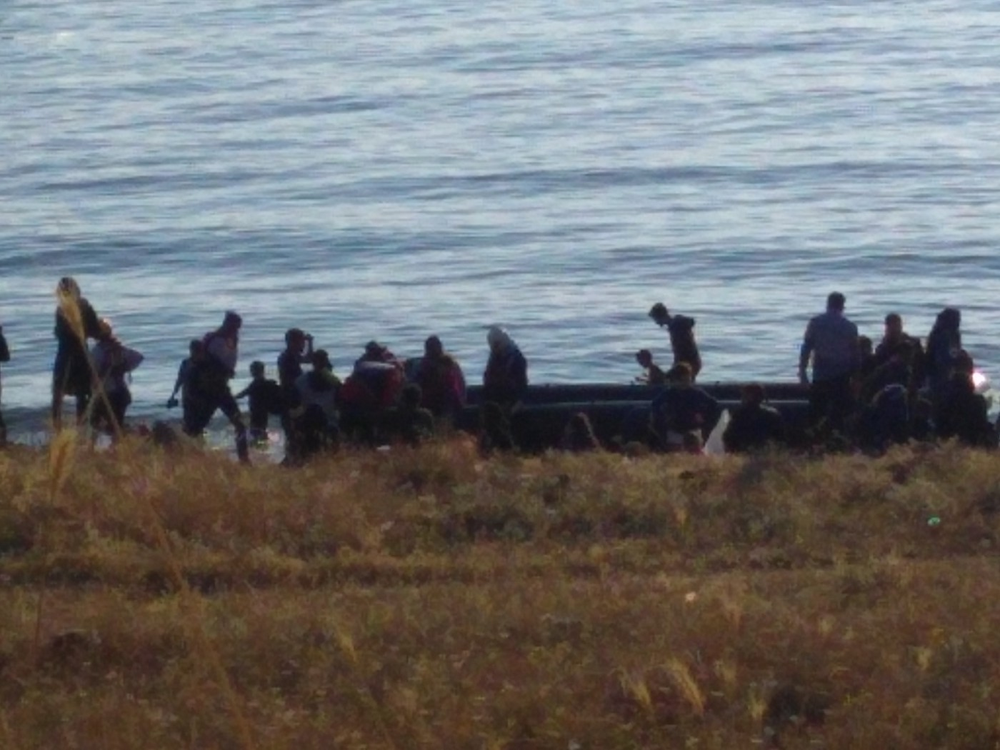
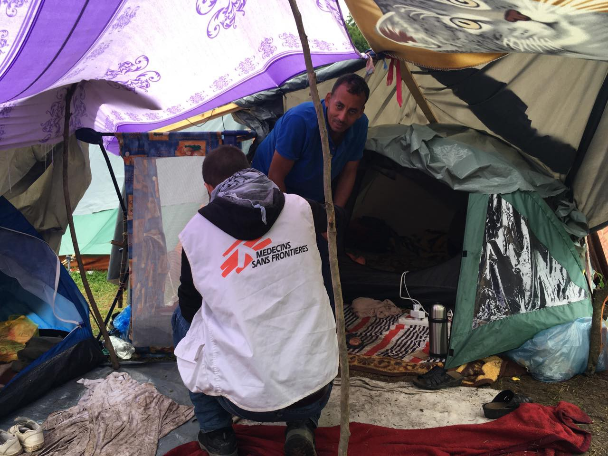
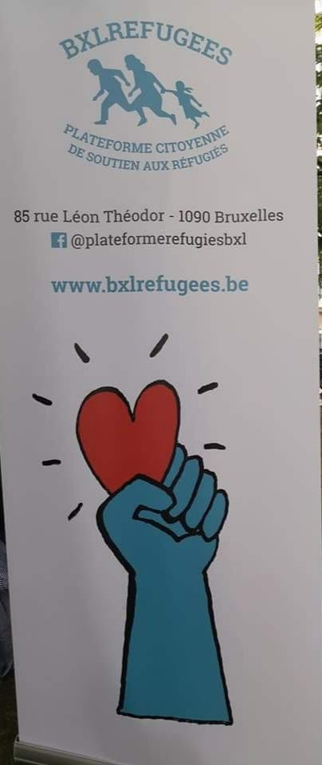

### AYS Daily Digest 30/06/2018: Welcome to Europe\* \(Terms and Conditions May Apply\)

_Arrivals to Greece // Fights in Vial camp // A full discussion on the betrayal of refugees by UNHCR // Anti\-Racist Festival in Athens // 100 dead yesterday: criticism of European neglect of unified policy for SAR operations // Needs and conditions in Bosnia // Anti Discrimination Protest in Italy // Opportunities to help in Belgium // At risk 18\-year olds facing deportation from the Netherlands garners concern_

Photo Credit: Phillippa Kempson
### GREECE

[Aegean Boat Report](https://www.facebook.com/AegeanBoatReport/?hc_ref=ARRsDrOtk3F7t-jwkqbfssoQaaD_idPEXCKMekczCJPUcY2GHWyQCtFyM8CMTt6QAcM) noted around 235 arrivals on the Aegean islands today\. Two boats came to Lesvos, total of 90 people, three to Chios with a total of 98 people; and one was intercepted and brought to Leros with around 45 people\.

No Border Kitchen on Lesvos is in need of donations\. Help keep their life\-saving and humanity affirming work alive\!

Go [here](https://www.facebook.com/689281511211641/posts/1168953836577737/) for more info on how to help\!

The Hope Project published a long video regarding UNHCR and collected testimony from people trapped on the islands and betrayed by most if not all INGOs, but most of all the agency that is supposed to care for them\.

There was a bad fight between some groups in Vial on the 30th, below is an eyewitness report:

> Back to Vial after 2 weeks of absence\. Every time it’s like the first time for me\. Only that people know you more and have much more expectations and you try … you try to respond to the difficult, the impossible…\.
 

>  We arrived watching the police running to deal with the fights that broke out between Afghans and Arabs\. 4–5 people left in an ambulance\. The children gathered around us for a drop of normal life in the dungeon\. 15 people were sitting in the hillside opposite the entrance of Vial\. They were holding a blanket and a sleeping bag and they seemed lost … they have no where to stay in the evening\. A child 2–3 years old came in a warm winter shirt and winter boots\. A mother let her little one cry while she tries to ask for clothes, the little one’s cries does not move her anymore …\. \. A boy wants to stand in the line to make him a painting on the face… he gets angry, he fights, he bursts, he can not stand the lines … 

Another testimony states there were injuries resulting from the fight\. Below is a photo reminder of the conditions in which people are meant to live their lives\.

](assets/de0245008a02/1*V4923hHHcs3kGWss1i22bQ.jpeg)

Photo credit: [خلية الإنقاذ و المتابعة / m\.r\.c](https://www.facebook.com/cell122/?hc_ref=ARTBfbxmena4HKpGdIc269J36bdCdiFlk6zR912CsNg81-X_r8B2tvx18uFsffXtdm8&fref=nf)

Antiracism festival in Athens is being held on July 1st\! Click below for more details\! All are welcome and dismantling racist structures goes hand in hand in welcoming refugees\!

### SEA

In the wake of yesterday’s tragic drowning of 100 people in the mediterranean sea, around 60 people were rescued by Proactiva Open Arms\. Although initially, again Italy refused their docking, they were later assigned to Barcelona\. The Missing Migrants Project estimates that nearly 1000 people have drowned in the Mediterranean sea this year\.

In light of the recent summit on Migration which ended on Thursday, MSF and SOS Mediterranee released a joint statement on the absurdity of current “unified” policy regarding the disembarkation of rescued individuals and the maintenance of rescue ships\. The Aquarius’s recent rotation gave rise to three disturbing observations:

_“During this rotation, the Aquarius witnessed three unacceptable situations: the unabated continuation of departures and daily human tragedies in the Central Mediterranean, the intensifying interceptions by the Libyan Coastguard who return the shipwrecked people to hell, and the instrumentalisation and criminalisation by the European political class of the legal obligation of rescue on the high seas”_ said Nicola Stalla, SOS MEDITERRANEE Search and Rescue Coordinator onboard the Aquarius\.

In the statement, the organizations also call out the willingness of Europe to collaborate with Libyan authorities without providing any useful structure of cohesion or support to SAR operations in the Mediterranean\. Read the full report [here](https://sosmediterranee.com/press/the-european-council-leads-to-contradictions-and-inconsistencies-on-the-framework-of-rescues-at-sea/) \.
### BOSNIA

[Souls of Sarajevo](https://www.facebook.com/soulsofsarajevo/?hc_ref=ARTzwwUA2idfDXQRDJ-UHcFXDOa5112XLy2DEB4nOH9GTva8tWQgcl3wMd71tNN12OQ&fref=nf&hc_location=group) is in urgent need of vehicle to help with distribution\. Contact them at their facebook page for more information\.

An anonymous source sent more photos and video from Velika Kladusa, showing the city tent that is located there\. MSF is on site and working to set up a mobile clinic\.

Source Anonymous\.
### ITALY

There will be a demo in Ventimiglia on 14th and the mayor of the town, among other things, said that it is a demo “against France” \(its policies\), which is incorrect — the real reasons for the demonstration are against racism, closed borders, sexism, homophobia etc\., and the demo has already been approved by the authorities\. For more information, go [here](http://www.meltingpot.org/14-luglio-Ventimiglia-citta-aperta-la-piattaforma-che-ha.html?var_mode=calcul#.WziDkn59iuW) \.
### BELGIUM

> The Maximilian school needs volunteers this summer to provide the on Wednesday and Saturday afternoon from 14 am to 16 pm\. Stop\-Daycare, games, reading of tales, artistic activities, for children who do not have The chance to go on vacation… 

For more information, see below\.

### THE NETHERLANDS

A group of various organizations has spoken out about the planned deportation of Afghan minors who are soon to turn 18\. The article by Vluchtelingenwerk below is translated\. These actions happened months ago, but so far nothing seems to have been done\.

> The coalition of twelve human rights and children’s rights organizations has taken note of the planned deportations in the coming days of at least three Afghan boys who will turn 18 on 1 July\. 
 

>  ‘There has not eve n been a political debate about the recently published official report Afghanistan, but three deportations are planned shortly after one and other\. These boys get a very harsh gift for their 18th birthday: a single ticket to a country at war ‘, says Dorine Manson, director of the Dutch Council for Refugees on behalf of the coalition\. “The organizations strongly urge the government not to deport these boys\. 

> The recently published official report on Afghanistan,where the Ministry of Foreign Affairs describes the security situation, clearly shows that in Afghanistan there is an exceptionally poor security, very poor human rights and very poor humanitarian situation\. 
 

>  …\.
 

>  In the displaced people’s camps, where deported Afghans end up, there is alack of basic necessities such as water, food and health care\. Moreover, because of their age, these boys are extra vulnerable to recruitment by the Taliban\. According to the organizations, the government can only come to one conclusion on the basis of the official message: stop deportations to Afghanistan immediately and protect Afghan refugees\. 

> Earlier this year, the coalition launched an action to call on the Dutch government to stop deportations as long as the country is unsafe\. The coalition consists of: Amnesty International, Cordaid, Defense for Children, Do not send Afghan back, INLIA, PAX, /Kerk in Actie/Church in Action, Oxfam Novib, Save the Children, LOS Foundation, Unicef ​​Netherlands and Dutch Council for Refugees\. 
 

>  On 30 May they handed over 68,000 signatures to Members of Parliament together with rejected Afghan asylum seekers with the the Square being filled with red kites, the national symbol of Afghanistan\. 

The full article is available in Dutch [here](https://www.vluchtelingenwerk.nl/nieuws/verbijstering-over-aankomende-uitzettingen-afghaanse-jongeren) \.

**We strive to echo correct news from the ground through collaboration and fairness\.**

**Every effort has been made to credit organizations and individuals with regard to the supply of information, video, and photo material \(in cases where the source wanted to be accredited\) \. Please notify us regarding corrections\.**

**If there’s anything you want to share or comment, contact us through Facebook or write to: [areyousyrious@gmail\.com](mailto:areyousyrious@gmail.com)**

_Converted [Medium Post](https://medium.com/are-you-syrious/ays-daily-digest-30-06-2018-welcome-to-europe-terms-and-conditions-may-apply-de0245008a02) by [ZMediumToMarkdown](https://github.com/ZhgChgLi/ZMediumToMarkdown)._
