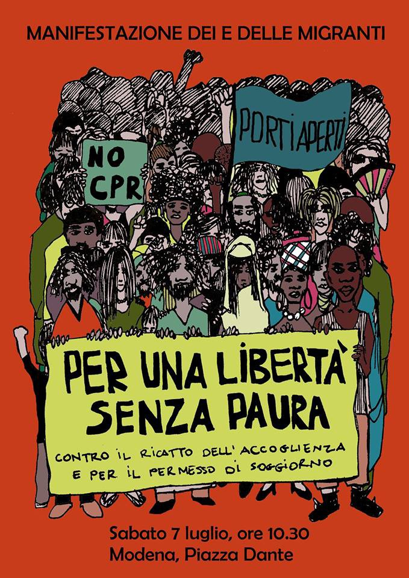
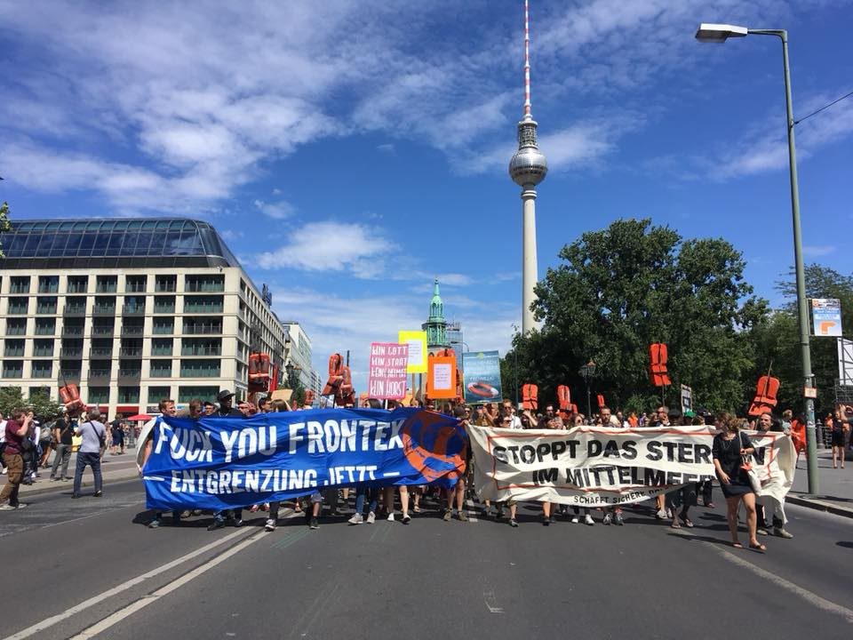
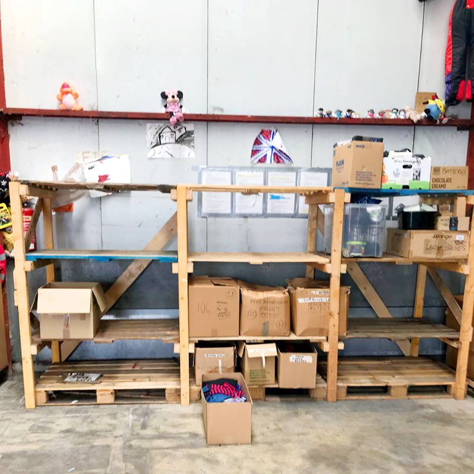

### AYS Daily Digest 07/07/2018 “Human life is inviolable” Art\. 1 of the EU Charter

Demonstrations in Italy and Germany /// Solidarity March Ventimiglia\-London arrived in Calais /// More rescues in the Alboran Sea /// Neo\-fascist anti\-migrant patrols on Italian beaches /// Report from Velika Kladusa

 \)](assets/5654dd033db7/1*fq00WcULzIKdaBYxSzq4jw.jpeg)

Rome, Italy\. After the eviction of via Scorticabove: **Where is our international protection?** \(photo by [Melting Pot Europa](https://www.facebook.com/meltingpoteuropa/) \)
#### Feature — “Human Life is Inviolable” Article 1 of the EU Charter

Numbers of missing and dead people continue to rise in the Mediterranean while EU governments sit back, watch, close their ports and lock their doors\. Since 2015 over 20,600 people have died at sea while attempting to travel from Northern Africa and Southern Europe\. This June, since Salvini became Interior Minister of Italy and other EU states decided to follow his brutal lead, has been the month with the highest death toll since IOM began their records\.

July could well see an even more dire situation arise as [Watch the Med — Alarmphone](https://www.facebook.com/watchthemed.alarmphone/photos/a.1526182797655958.1073741828.1525906057683632/2151100688497496/?type=3&theater) report that two more boats are missing having left the Moroccan coast\.

> A boat carrying 40 people from Asilah/Morocco is lost at sea\. They left already on Thursday at 11pm and the last time a relative of the travellers was in touch with them was at 2am CEST\. Their engine has broken down and they are in great danger\. 

> A second boat carrying 8 people from Achakkar/Morocco is also missing\. Last time we had contact with them was at 10am\. They are also seriously at risk\. 

A [further report](https://twitter.com/HelenaMaleno/status/1015599990570352640) states that another 37 people are also lost at sea, including 7 women, in the Alboran\.

As the Alarmphone call for a larger NGO presence in the Mediterranean, [Lifeline](https://www.facebook.com/seenotrettung/videos/401231083616770/?hc_location=ufi) are asking for support to continue their search and rescue work\. More info on how to help [here](https://civilfleet.org/) \.

](assets/5654dd033db7/1*E6kCJY-56vbTJCDxWJ9XUg.jpeg)

Photo by [Lifeline](https://www.facebook.com/seenotrettung/)

And groups throughout Europe are calling for an end to the decriminalisation of sea rescue\.

■■■■■■■■■■■■■■ 
> **[Lighthouse Relief](https://twitter.com/LighthouseRR) @ Twitter Says:** 

> > Since January, 1,408 women, children and men have died or gone missing while crossing the Mediterranean. We, and other organisations, are uniting today against the criminalization of Search and Rescue activities in the area. Read full statement: [docs.google.com/document/d/16D…](https://docs.google.com/document/d/16DEW_n8uu_Oc6OClASK6FQPm6Td4PRJKVPrwfjeunGU/edit?usp=sharing) https://t.co/pQ3qCOxsNy 

> **Tweeted at [2018-07-07 13:53:08](https://twitter.com/lighthouserr/status/1015594567641550850).** 

■■■■■■■■■■■■■■ 

As with all right\-wing, racist policies there is very little logic behind the actions of those in charge, including the refusal of a safe port to NGO boats\. These people do not require logic, they work on the basis of creating collective fear, just as the fascist regimes did in the first half of the 20th century\. While Salvini stands in front of thousands talking of saving the Italian people and of how dearly he loves Italian children, he forgets that many Italian citizens have African heritage, that it could well be the relative of an Italian citizen, indeed the child of one, who drowns off the Italian coast\. Their lives lost due to racism and the propaganda of fear\. These are crimes against humanity, illegal under the laws of the sea, the 1951 Refugee Convention, the Human Rights Act and of our collective conscience\. When will an EU member state finally stand up and say enough is enough? When will a critical mass of citizens and civil society finally refuse to comply with these policies and through this simple tool end the murderous route that EU leaders are trying to force us down?

SEA
#### Alboran Sea

[Salvamento Maritimo](https://twitter.com/salvamentogob/status/1015608764215513088) report:

[55 people](https://twitter.com/salvamentogob/status/1015536639689592832) rescued by Guardamar Polyhymnia and taken safely to port at Motril by 13\.10\.

56 people rescued by Patrol crew Rio Miño, arriving safely to Malaga at 18\.15\.

[27 people rescued](https://twitter.com/salvamentogob/status/1015344956356091906) by Salvamar Spica and taken to Almería\.

[13 people](https://twitter.com/salvamentogob/status/1015515758443618304) rescued by Salvamar Arcturus and taken to Tarifa\.

24 people rescued by Salvamar Alnitak and taken to Malaga at 11\.45\.

GREECE
#### Arrivals

From [Aegean Boat Report](https://www.facebook.com/AegeanBoatReport/posts/388175138372263?hc_location=ufi) :

On the morning of the 7th two boats arrived to Samos and Chios with 102 people from Syria, Eritrea, Yemen, Iraq, Palestine and Somalia\.

First boat was taken to port in Chios 06\.00 — 41 people: 10 children, 7 women, 24 men\.

Second boat was picked up by HCG outside Samos, taken to port in Samos 06\.30 — 61 people: 32 children, 10 women, 11 men\.

A third boat landed on Agios Dimitris, Lesvos north 10\.04 — 44 people: 17 children, 10 women, 17 men\.
#### Lesvos

 \)](assets/5654dd033db7/1*9db0IW58ueFbKvwkZ8BD5A.jpeg)

\#Savepikpa \(Photo by [SAO Association](https://www.facebook.com/SAOassociation/) \)
#### \#savepikpa

[Arash Hampay reports](https://www.facebook.com/groups/446386565554391/permalink/874660846060292/?hc_location=ufi) that after the trial against Pikpa which took place yesterday further documents have been filed by both sides — Pikpa and the Hotel Association who began the case against them\. After the hearing, the judge and the lawyers went to Pikpa for an inspection\.

At the same time they are appealing against the decision of the Region of North Aegean, which considers Pikpa a danger to public health and the environment\.

> These are crucial days and weeks for Pikpa\. Please keep showing your support\. Spread and post in the SAVE PIKPA Facebook group and help us grow the SAVE PIKPA community, next goal: 10\.000\! All messages will be delivered to the political decision makers: [https://web\.facebook\.com/groups/633160610380429/](https://web.facebook.com/groups/633160610380429/) 

#### Volunteers Needed

As summer continues and arrivals remain steady various groups are asking for more volunteers including [Action for education](https://www.facebook.com/ActionforEdu/posts/688515338161185?hc_location=ufi) for teaching on Chios, [Lifting Hands International](https://www.facebook.com/groups/infopointfornortherngreecevolunteers/permalink/664867907192839/?hc_location=ufi) who are looking for English, dance and yoga teacher in Serres, Northern Greece, and [Open Cultural Centre](https://www.facebook.com/OpenCulturalCenter/photos/a.1306921272669621.1073741829.1302471973114551/2211249082236831/?type=3&theater&notif_t=notify_me_page&notif_id=1530994696941094) for teaching English in Polykastro\.

ITALY
#### **Demonstration against repatriation centre in Modena**

FOR FREEDOM WITHOUT FEAR

A demonstration was held on Saturday in Modena, central Italy\. People from the whole region came to support the local refugees and solidarians in their struggle against the establishment of the first Repatriation Centre \(CPR\) \.

 \)](assets/5654dd033db7/1*S2fa-uVVBaMPibkj8sEMvQ.jpeg)

For freedom without fear \#NOCPR \#PapersNow \(Photo by [Coordinamento Migranti Bologna](https://www.facebook.com/coordinamentomigranti.bologna.7) \)

> After we crossed Libya, the desert and tortures, they close the harbour, they denies protection\. Struggling without fear means we can not allow it\. Struggling without fear means reclaiming our freedom and the freedom of everyone\! 

#### **Far right Anti\-migrant Patrols on Italian beaches**

As [reported](https://enoughisenough14.org/2018/07/07/italian-and-polish-neo-nazis-join-forces-to-patrol-beaches-to-protect-women-from-migrants/) by Enough is Enough, members of Italian neo\-fascist party Forza Nuova \(FN\), in coalition with Polish neo\-nazi group National Radical Camp \(Obóz Narodowo\-Radykalny, ONR\), launched beach patrols in order to “protect women and children from migrants” in the Italian town Rimini\. The first patrol took place yesterday after a joint conference of the two groups\.

**Be careful if you are in the area\.**

Read the full article [here](https://enoughisenough14.org/2018/07/07/italian-and-polish-neo-nazis-join-forces-to-patrol-beaches-to-protect-women-from-migrants/)
#### **Wearing their clothes: \#MaglietteRosse symbolic protest**

■■■■■■■■■■■■■■ 
> **[Xavi Ruiz](https://twitter.com/xruiztru) @ Twitter Says:** 

> > 🇮🇹 There is another Italy wich the Interior minister, Salvini, wouldn’t like you to know about.

Today thousands of Italians are wearing read t-shirts to show their concern for the plight of migrants &amp; refugees. #MagliettaRossa https://t.co/vlLsUFoUnF 

> **Tweeted at [2018-07-07 12:26:31](https://twitter.com/xruiztru/status/1015572769650724865).** 

■■■■■■■■■■■■■■ 

Italian anti\-mafia organisation Libera launched a symbolic campaign in support of humanitarian operations in the Mediterranean and in solidarity with refugees and migrants\. Many other organisations and individuals joined the campaign, wearing red t\-shirts \(magliette rosse\) and posting solidarity pictures on social media, as asylum seekers wear red clothes to be visible in case of distress at sea\.

It is a pity that ministers and MPs of the previous government joined the same protest, while at the same time, many of the them are responsible for initiating this process of the criminalisation of rescue operations\.

Whatever it takes to gain a few more votes\.

BOSNIA
#### _Volunteer’s report from Velika Kladusa\._

From an [independent volunteer](https://www.facebook.com/cestacestero?ref=content_filter) in Velika Kladusa:

 \)](assets/5654dd033db7/1*nDEMdSOQsKwQCcWWKpNdxQ.jpeg)

\(Photo by [Барбарче Бекарес Кастањоска](https://www.facebook.com/cestacestero) \)

> A very nice Bosnian man lent his industrial unit to some refugee friends to take refuge there\. Kids don’t create much garbage\. Those who distribute food at night \(only a few days, not all\) create a lot\. They are from a huge organisation called Emmaus that gives out some pasta with tomato and take thousands of pictures, but then they don’t offer a place to throw away that garbage, that is taken by the wind and dig up by dogs\. Only No Name Kitchen buys garbage bags, every time they appear, and give them to the inhabitants of this space so that they can clean it up\. 

> Today, with my own eyes I saw the Red Cross arrive and distribute a can of tuna, a piece of bread and a few chocolate shakes for children\. Everything in a bag\. In five minutes and without getting off the van\. What they did was taking a lot of pictures\. So many that I went to talk to them about garbage and they couldn’t answer me because they have to show their millions of donors how cool they are\. They came with a representative of IOM, another of the huge global association for migrants\. When they left, they took their garbage and added it to the huge pile surrounding the kids \(many of them are underage\) \. I told them they’d better take their stuff to a dumpster than leave it there, but they went away, showing very stressed by the job\.
 

> 
 

> Since I arrived at Velika Kladuša I’ve been wondering where the huge global organisations for refugees are \(those that show you to dramatic ads such as UNHCR and that are lined with Euros\) \. Those who help here are about 10 volunteers who try to cover a myriad of basic needs of hundreds of refugees and who live with them day by day without taking pictures 

> Volunteers do it with resources coming from relatives, friends and anonymous donors and spending their savings\.
 

> 
 

> _Be c_ areful when you donate\. 

GERMANY
#### \#Seebrueken demonstrations in Germany

 \)](assets/5654dd033db7/1*zX6TQpZ5cJAlZzvlopNnww.jpeg)

\(Photo by [Jugend Rettet e\.V\.](https://www.facebook.com/JugendRettet/) \)

Tens of thousands gather for demonstrations in [Berlin](https://www.rbb24.de/politik/beitrag/2018/07/demonstration-berlin-seenotrettung--fluechtlinge-mittelmeer-seebruecke.html) , Leipzig, Munich, Hanover and Frankfurt am Main and more…

■■■■■■■■■■■■■■ 
> **[Sea-Watch](https://twitter.com/seawatchcrew) @ Twitter Says:** 

> > Berlin sieht orange. Lasst uns sichere Häfen schaffen - Wir alle sind die #Seebruecke! https://t.co/DkS3Ehw33m 

> **Tweeted at [2018-07-07 11:48:56](https://twitter.com/seawatchcrew/status/1015563310807355393).** 

■■■■■■■■■■■■■■ 

■■■■■■■■■■■■■■ 
> **[SOS Humanity](https://twitter.com/soshumanity_de) @ Twitter Says:** 

> > HEUTE in #Berlin : @[SOSMedGermany](https://twitter.com/SOSMedGermany) auf der #sewbruecke Demo. Gemeinsam für sichere Häfen &amp; Menschlichkeit im Mittelmeer. #b0707  #Aquarius https://t.co/FnMv6Vxhto 

> **Tweeted at [2018-07-07 12:11:10](https://twitter.com/sosmedgermany/status/1015568908164784128).** 

■■■■■■■■■■■■■■ 

■■■■■■■■■■■■■■ 
> **[Sea-Watch Italy](https://twitter.com/SeaWatchItaly) @ Twitter Says:** 

> > Berlino oggi è colorata di arancione.

In migliaia stanno chiedendo solidarietà per tutte le persone in fuga, corridoi umanitari legali, difesa del salvataggio in mare e accoglienza concreta verso chi è costretto a lasciare il proprio paese.

#Seebruecke @[_Seebruecke_](https://twitter.com/_Seebruecke_) #seebridge https://t.co/rkaYImtpLB 

> **Tweeted at [2018-07-07 14:07:29](https://twitter.com/seawatchitaly/status/1015598179281235968).** 

■■■■■■■■■■■■■■ 

FRANCE
#### **Solidarity March Ventimiglia\-London arrived in Calais**

On Saturday the march started two months ago in Ventimiglia reached Calais\.

> A band of activists, humanitarian aid workers, musicians and more have been marching for over 1,000 miles, all to protest the inhumane treatment of refugees across France\. 

> Organised by our partners L’Auberge des Migrants, the march is finishing in Hyde Park on Sunday 8th July\. 

> During these last two months, at nearly 60 stopovers in various cities, the March has been warmly welcomed by a very large number of associations, charities and thousands of citizens, clearly showing the existence of a strong network open to welcome refugees\. Come and join us and show your support for the final stage of this protest\! We’re meeting at the Marble Arch at 12pm\. See you there\! 

**Care4Calas urgent donation appeal**

The organisation [Care4Calais](https://www.facebook.com/care4calais/posts/1989043714461909?hc_location=ufi) urgently need donations:

> When the sun is shining it’s normally a good thing, but for refugees these extreme weather conditions can be hard to cope with\. Imagine not being able to wash or change your clothes for weeks on end? It’s no way for any human to live and we want to make sure we can help people live a more dignified life by providing basic necessities\. However, our warehouse is running VERY LOW on supplies and we really need your help so we can continue to help as many people as possible\. 

> URGENT NEED INCLUDE: 

> — Jeans and jogging bottoms 
 

>  — Boxer shorts
 

>  — Sleeping bags 
 

>  — Shoes 
 

>  — Mobile phones \(the police have been smashing\)
 

>  — Backpacks 

> Do you have any of these items you could donate? Please look in your closets and cupboards and see if you can help\. If not, then please donate whatever you can to help us deliver more aid\. 

> DROP\-OFF POINT: [Https://goo\.gl/ULD9dG](https://goo.gl/ULD9dG) 

> FULL NEEDS LIST: [https://bit\.ly/2lXYT5s](https://bit.ly/2lXYT5s) 

> DONATE: [https://goo\.gl/jmkx7A](https://l.facebook.com/l.php?u=https%3A%2F%2Fgoo.gl%2Fjmkx7A&h=AT2NFCu1nk6YtksDhdWd_m96SFR92bkjbHpdIkqEAnmDf21JG2yc873S-1T-MM4hjNRBnM5t92V2cLMDZh18ovSgqW_a7jGI5ZlncYBME3R5mkMDQBEIsYStK2UQFea3Dez7r0T3Arx7w8Y) 

> Thank you\. 

**We strive to echo correct news from the ground through collaboration and fairness\.**

**Every effort has been made to credit organizations and individuals with regard to the supply of information, video, and photo material \(in cases where the source wanted to be accredited\) \. Please notify us regarding corrections\.**

**If there’s anything you want to share or comment, contact us through Facebook or write to: areyousyrious@gmail\.com**

_Converted [Medium Post](https://medium.com/are-you-syrious/ays-daily-digest-07-07-2018-human-life-is-inviolable-art-1-of-the-eu-charter-5654dd033db7) by [ZMediumToMarkdown](https://github.com/ZhgChgLi/ZMediumToMarkdown)._
