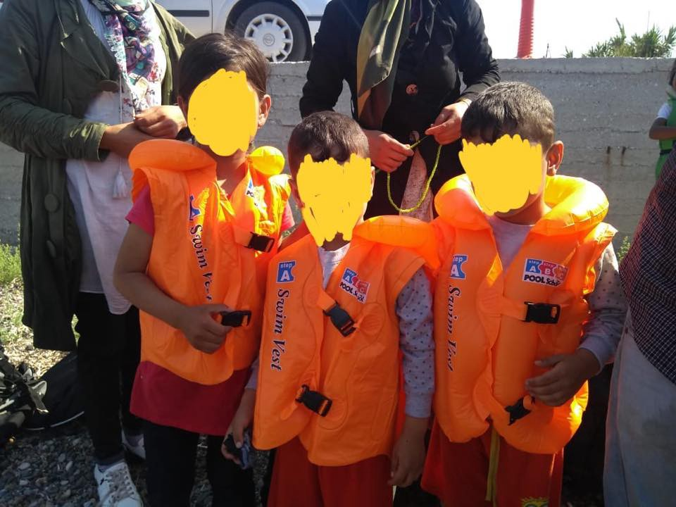
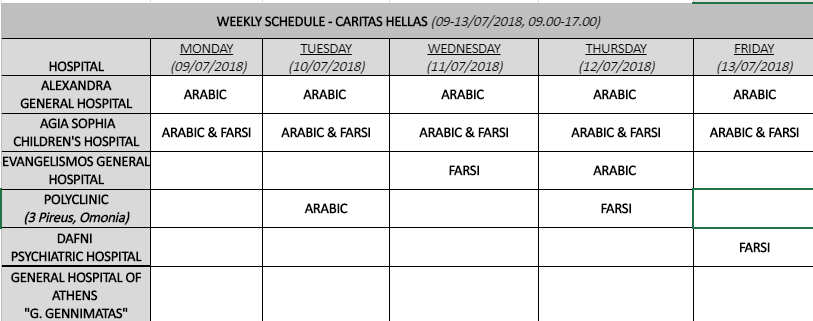
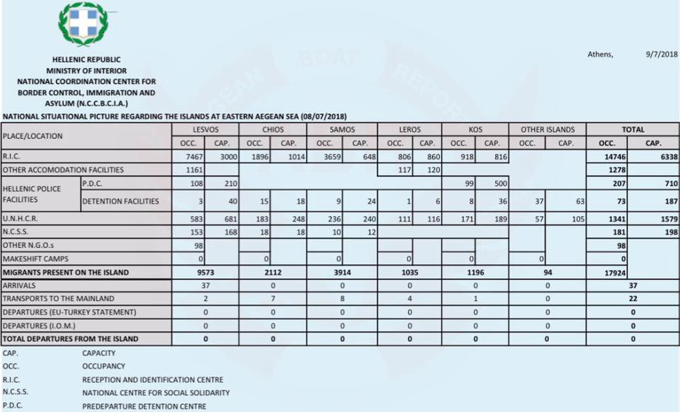

### AYS Daily Digest 09/07/2018: 5 Persons from Committee of the Sans Papiers Paris Arrested in Calais

_80 rescued in Alboran Sea// Negotiations to get the Moonbird SAR plane back to the Mediterranean// 52 persons \(27 children\) arrive on Lesvos// & more news from Greece, Bosnia, Italy, Spain, Malta, Austria, France & The Netherlands\._

](assets/3d9abf3dec32/1*PSFj_fdj1IdHsqnkSeZ9JQ.jpeg)

Source: [L’Auberge des Migrants](https://www.facebook.com/AubergeMigrants/?hc_ref=ARRZqzFiRS_kX_9-ZY1-7KQ6VC-wUmgZXenoYc8u9M9tL3u6_DIrDiL8aZLR57GsgJk&fref=nf)
#### FEATURE:

5 People Arrested in Calais from the Solidarity Group Committee of the Sans Papiers Paris\. They are facing court tomorrow and are under threat of deportation\.

As the 54 walkers of solidarity from the CSP group \(Committee of Sans Papers Paris\) protested against border controls in Calais, 22 people without papers were stopped by the police and detained\. They were taken to the Shells Administrative Detention Centre\. 17 were released but 5 remain arrested and may be deported from France\.

The people are currently being held in three different locations:
- coquelles \(2 persons\)
- lille\-Lesquin \(2 persons\)
- Rouen\-Oissel \(1 person\)

[The Migrants’ Hoste](https://www.facebook.com/AubergeMigrants/?hc_ref=ARTbEMQC41GFZoaxBPen0ZKkvHpAHzDBDbSdkuFBkoLa6kKBJqmin3cK3s_68vMxhPk&fref=nf) l has stated that the 5 arrested will be judged tomorrow morning at 10AM\.

[ZAD Lille Committe](https://www.facebook.com/comitezadlille/?hc_ref=ARTCVOi0sAfLHoNPwuJRNcAbCeFufpYU3vk_Q3-mvNTNBKaNmmqHCmuuKEdmbVngVFA&fref=nf) e has announced that the 5 people will be judged in 3 different locations and therefore 3 seperate mobilisations will be taking place tomorrow morning\.

This is the first time since the creation of the Committee of the Sans Papiers 75, in 2002, that people belonging to it are arrested and then detained during a demonstration\.

**What you can do to help:**

> Ask the immediate release of these 5 people\. Protest, with the 3 000 walkers who participated in the 59 courses between ventimiglia and London, with the other associations and groups that organized the reception in the cities\-courses\. Circulate this statement around you, please 

> Send an email to the prefect of the pas\-de\-Calais 
 

> Fabien\.Sudry@Pas\-De\-Calais\.Gouv\.Fr
 

> Give us your support, organize a protest rally in front of your prefecture, and come back to the craters \(59\) if you are nearby\. 

> Contact: migrant hostel, co\-organizer of the solidarity march\. Laubergedesmigrants@Hotmail\.Fr like 06 78 02 05 32 

### TURKEY

While fighting has ended in South East Turkey, K [urds fear that their culture will be erased](https://www.irinnews.org/feature/2018/07/09/kurds-southeast-turkey-urban-conflict-continues) \.

Many displaced people believe that the Erdogan regime is profiting from the displacement of Kurds and engaging in demographic re\-engineering\. The so called reconstruction in aimed at ‘shaping the society through space, erasing the memory and creating a new memory\.’
### SEA
#### The SAR plane denied the ability to observe the situation on the Mediterranean\.

The private Swiss Plane Moonbird is unable to receive a permit for SAR operations unless this is done on behalf of Malta or on request by a neighbouring country\.

Humanitarian Pilots Initiative has stated that a meeting with UNHCR will take place to negotiate the return of the Moonbird back to the Mediterranean\.

■■■■■■■■■■■■■■ 
> **[Humanitarian Pilots Initiative 🧡](https://twitter.com/HPISwiss) @ Twitter Says:** 

> > Das in der Schweiz eingetragene Privatflugzeug #Moonbird darf in 🇲🇹 @[MaltaGov](https://twitter.com/MaltaGov) nicht mehr starten? Eine Rechtsgrundlage für SAR Flüge gibt es nicht. #freedomofmovement Was unternimmt die Schweiz? @[spschweiz](https://twitter.com/spschweiz) @[jglpCH](https://twitter.com/jglpCH) @[GrueneCH](https://twitter.com/GrueneCH) @[FDP_Liberalen](https://twitter.com/FDP_Liberalen) https://t.co/nF7IAGEVmi 

> **Tweeted at [2018-07-09 16:16:48](https://twitter.com/hpiswiss/status/1016355499556638721).** 

■■■■■■■■■■■■■■ 

#### 80 people Rescued Alboran Sea:

Guardamar Caliope has rescued two boats carrying 80 people from the Alboren Sea\. They have been transported to Mortil\. Salvamar Hamal has rescued a third ship carrying 36 people who are also on route to Mortil\.

■■■■■■■■■■■■■■ 
> **[SALVAMENTO MARÍTIMO](https://twitter.com/salvamentogob) @ Twitter Says:** 

> > El helicóptero Helimer 401 localizó y la embarcación Guardamar Calíope rescató a la 1.40 horas a 29 hombres y 3 mujeres de origen subsahariano de una #patera localizada 4 millas al noroeste de la isla de Alborán. A las 4.40 horas desembarcaron en #Motril https://t.co/PDQeBxprID 

> **Tweeted at [2018-07-09 06:52:38](https://twitter.com/salvamentogob/status/1016213522265640960).** 

■■■■■■■■■■■■■■ 

### GREECE
#### Arrivals
#### A boat carrying 27 Children all wearing fake barely inflated life vests arrived on Lesvos today

A total of 52 person landed on the coast of Eftalou

Source: Aegean Boat Report / Philippa Kempson

■■■■■■■■■■■■■■ 
> **[Lighthouse Relief](https://twitter.com/LighthouseRR) @ Twitter Says:** 

> > At 4pm today, our spotting team alerted that a dinghy was approaching #Lesvos north. The 52 people landed in Eftalou. There were 14 women, 11 men and 27 children from Afghanistan and Iran. We assisted them and distributed dry clothes at Stage 2 - transition camp. #WithRefugees 

> **Tweeted at [2018-07-09 16:59:24](https://twitter.com/lighthouserr/status/1016366220994580480).** 

■■■■■■■■■■■■■■ 

#### Weekly Arrival Report 02–08 July

■■■■■■■■■■■■■■ 
> **[Aegean Boat Report](https://twitter.com/ABoatReport) @ Twitter Says:** 

> > WEEKLY REPORT 02-08 JULY.

A total of 32 boats started the trip towards Greece last week, 1102 people. 16 boats made it, 620 people, 16 boats was stopped by TCG/Police, 482 people.

Lesvos:
7 boats arrived, 279... [facebook.com/28529888199322…](https://www.facebook.com/285298881993223/posts/390730521450058/) 

> **Tweeted at [2018-07-09 22:22:25](https://twitter.com/boataegean/status/1016447508535566337).** 

■■■■■■■■■■■■■■ 

#### Weekly Schedule of [translation services](https://www.facebook.com/Greekforumofrefugees/photos/a.133608436673971.15209.133502636684551/1997700776931385/?type=3&theater) in Hospital in Athens

#### Germany Threatens to Return Migrants to Greece if Bilateral Agreements are Not Achieved

Defence minister Ursula Von Der Leyen has put forward that a [n accord to see the mass return of migrants to Greece](http://www.ekathimerini.com/230468/article/ekathimerini/news/berlin-eyes-deal-for-migrant-returns-with-greece-by-end-july) may be signed as early as the end of July if bilateral agreements are not achieved between Greece and Germany\.

> In comments to Der Spiegel, Seehofer said the absence of bilateral deals was “not a good strategy” and that Germany will start returning migrants reaching its border if that situation is not rectified\. 

It is believed that first entry EU countries may not be willing to cooperate if Germany goes ahead with returns\.
#### Final Leg of Love4lesvos Campaign

We are into the final leg of our [\#LOVE4LESVOS](https://www.facebook.com/hashtag/love4lesvos?source=feed_text) campaign, that is supported by over 30 voluntary groups\.
#### Note on Police from Mobile Info Team

**What to do if police find you without documents**

> If the police find you without a document allowing you to stay in Greece, you will most likely be arrested and put in detention\. If you want to apply for asylum in Greece, you should try to communicate this to the police in case you get arrested\. 
 

> After you are released from detention, the police will issue you a police note or Kharti\. This note from the police can have different meanings and different expiration dates depending on your situation\. During your detention, if you successfully communicated to the police that you want to apply for asylum in Greece, you might be issued a special type of the police note\. This police note allows you to register your asylum claim without calling Skype, by presenting yourself directly to the Regional Asylum Service\. This type of police note can be recognized by a specific number written on the top left part of the document\. This is the “willingness number”, in Greek “Αριθμός Βούλησης Ασύλου“\. You can find instructions on how to recognize this special police note here: [www\.mobileinfoteam\.org/police\-note\-willingness](http://www.mobileinfoteam.org/police-note-willingness) 
 

> If you have a Kharti with a willingness number, go directly to the Regional Asylum Office that is responsible for you and show your police note at the door\. It is still possible that they will not let you in, because they don’t have the capacity to register you on that day\. Please try it again then the next day\. If you have failed repeatedly and you are in the area of Thessaloniki you can contact us on Facebook or on our whatsapp hotline: \+30 695 538 8283\. If you are elsewhere in Greece please contact a legal NGO\. Keep in mind, that a willingness number can last several months longer than the expiration date of the Kharti\. You should not be detained if found with this expired Kharti until the willingness number expires itself \(there is no clearly defined expiration date for it\) and therefore there is no need to renew the Kharti\. For more information please click on the following link: [www\.mobileinfoteam\.org/police\-note](https://l.facebook.com/l.php?u=http%3A%2F%2Fwww.mobileinfoteam.org%2Fpolice-note&h=AT1MePTDH_rfFodoTK1gsjfnyzMXpnbqj8gYD2xKFumLkwXcuLzh-tJbQIf6v1vkNVvtR5AGqZK20pJiioXys-yRF_38NN96zYgCsmPzcqhe1HlyS6Q5KYS-Y8a0JwA1jGO0GuLvVA) 

#### Khora are Looking for Legal Volunteers to join their team:

Khora’s legal team is currently looking for new volunteers to assist in their legal assessments\. No prior legal experience is necessary to volunteer, however Khora advises that the role is better suited to peopel who have experience or knowledge of the Greek Asylum Process\.
#### Refugee Support Europe Launches new program to support refugees start their own businesses

> Today we launch a service offering capital and support to help the people at Katsikas create their own businesses\. 

To find out more please follow [this link](https://www.refugeesupport.eu/launching-business-fund-for-a-more-dignified-life/) \.
#### Latest Statistics on National Situational Picture of Eastern Aegean Islands

#### In the first 6 months of 2018 13,717 refugees arrived to Greece via the sea

■■■■■■■■■■■■■■ 
> **[RSA](https://twitter.com/rspaegean) @ Twitter Says:** 

> > Between January and June this year, 13,717 refugees and migrants arrived to Greece by sea - the majority are Syrians. Over one-third of the arrivals are children #refugeesGr #seaarrivals #EUTurkeydeal
[data2.unhcr.org/en/documents/d…](https://data2.unhcr.org/en/documents/download/64636) 

> **Tweeted at [2018-07-09 11:15:18](https://twitter.com/rspaegean/status/1016279621908787200).** 

■■■■■■■■■■■■■■ 

#### Needs of Notara26 Squat:
- Detergent for washing machine
- Dish washing detergent
- Chlorine
- Baby Wipes

### BOSNIA

MedVint are looking for volunteers to join their team from September onwards\. To find out more and/or register please follow [_this link\._](http://www.medvint.org/volunteering)
### ITALY
#### Refugees are forced to sleep on the street post eviction in Rome

> [This is the humanitarian reception of the City of Rome to those who have the status of refugee\.](https://www.facebook.com/FederazionedelSociale/photos/a.1622500294680746.1073741887.1494670380797072/2047143795549725/?type=3) 

](assets/3d9abf3dec32/1*rdNw7MyuPmBWcHzq3C2J4w.jpeg)

Source: [Federazione del Sociale USB](https://www.facebook.com/FederazionedelSociale/?hc_ref=ARRx5XD05uoLsrNP-tmq_-KELgfKapDOq9j-fbqZm1yweMiBr2OV4ZaPSVywayFtqRk&fref=nf)
#### International Solidarity Day in Ventimiglia

Progetto 20k invites all people, associations, independent unions and groups that are involved with issues regarding migration flow policies to participate in the mobilisation on the 14th of July and help with its organisation\.

The mobilisation will occur on one of the most deadly borders in Europe\. it will dispute the brutality of European Migration policies, lay claim to the need of a European Resident permit and will demand the right to mobility\.

The group insists that Europe must rethink its current system of immigration policies, to fight human trafficking, gender violence, and people exploitation, to defend people’s freedom and the right of self\-determination\.

> Ventimiglia is the symbol of failing migrant policies\.
 

> As in many other territories, many people traveling across Europe sleep on the streets, where nothing is available and hygienic and sanitary conditions are precarious, as the available Italian Red Cross camp is 5km outside town for decorum reasons, constantly garrisoned by police and military forces\. 
 

> As in many other cities, immigration policies are not about welcoming people but about dehumanizing them\. 

### SPAIN
#### Man accused by refugees for sexual assault has been let free

[A former Employee of CETI](https://politica.elpais.com/politica/2018/07/06/actualidad/1530898137_223951.html) \(the Temporary Stay Centre of Immigrants\) who was accused by two inmates of sexual abuse in October 2015 has had his case dismissed\.

In addition to the two immigrants who filed initial case for sexual asault, another 78 people in the centre signed a letter which accused the man of mistreatment and harassment\.

> The two complainants, asylum seekers of Syrian nationality, claimed that when they arrived at the CETI he touched their genitals and promised to accelerate the procedures to leave the center more quickly\. This worker denied the accusations and affirmed that it was “an assembly” to throw him out of his job\. 

Despite being a controversial case, the judicial process was delayed\. The man is now free and once again on the streets of Melilla working with an organisation dedicated to helping street children\.
### MALTA
#### Three fully operational SAR vessels have been Moored in Valletta Port\.

Within this week hundreds of people lost their lives in the Mediterranean Sea\.

### AUSTRIA
#### [In the last week, e](http://www.freirad.at/?p=16372) xcerpts form the United list of refugee deaths as a result of European Border policies were read out on Radio Funcloch\. This was done in order to commemorate the victims\.

The list contains a total of 34,361 names of people who have died due to the inhumane policies of the EU\. It must be noted that the true number of victims is much higher as the identity of many deceased is unknown\.
### FRANCE
#### A picture of a [Breakfast Distribution in Paris](https://www.facebook.com/598228360377940/photos/a.599438026923640.1073741828.598228360377940/929423783925061/?type=3) by [Solidarité migrants Wilson](https://www.facebook.com/Solidarit%C3%A9-migrants-Wilson-598228360377940/)

> We’ve seen between 300 and 350 people today, less than the last few days\. As it was hot, everyone was thirsty\. We have continuously filled our mini\-Fountain of water made by Baia’s husband \(refer to photo\) 

The groups informs that several families with children are coming to the distributions

> A young mother with her 6\-Year\-old son\. He’s cute and we give him a bubble machine that delights him and occupies him\. Mom is less reassured — she says she slept in the resident yesterday but doesn’t know where to sleep tonight\. 

It’s 14, it’s hot, we finish cleaning the local\. One last filling of the water fountain and close the door\. As we are leaving, a young man is approaching: “ I am new here, can you help me please?” He’s 17\. He’s thanking me politely and wondering if I know where he can take a shower because it’s been five days since he couldn’t wash\.
#### Historic day for brotherhood in France\. Solidarity has won a legal, political and humanitarian fight\.

The principal of Brotherhood has been integrated into the constitution by the Constitutional Council\. For the first time in Republican History, the authorities are to respect the freedom of each person to assist, in humanitarian terms, any person in all situations\!

Solidarity is not a crime\! And while this is a significant achievement, the fight must continue to allow open access across borders for all persons\.

**On this topic here is a note by Cédric Herrou, President of [DTC\-Défends ta citoyenneté](https://www.facebook.com/DefendsTaCitoyennete/)**

> I think very strongly that the constitutional council has been just within its limits\. Our fight must not be limited to defending carers but to defend the people directly concerned, migrants themselves\. Why should we have the right, we french, to pass migrant people on the border when they are prevented from doing so alone? We have to fight, not to have the right to cross the border to strangers, but so that foreigners can do it alone, legally\. 

> I recall that border controls have been restored to combat terrorism and not to hinder the free movement of persons\. We must defend free movement in the schengen area and combat the obstruction of asylum demand at the border\. The French state diverts procedures for political\-Demagogic purposes, forcing people to enter underground\. Let’s not deceive ourselves\. 

> However, I will continue to respond to my actions in the face of justice if I must, for humanitarian reasons, pass the border to an irregular person\. The proportionality of crimes must be respected by justice\. No, I won’t let a child sleep on the street without any support because it’s forbidden to cross a border\. The neglect of isolated minors and non\-assistance to person at risk must prevail against the entry into the territory of aliens in an irregular situation\. 

#### Locker room for migrants in Paris will continue to run

The Locker room is for migrants and people in emergency situation\. The primary purpose is to provide clothing\.

> Clothing Distribution Hours: 

> To sort the clothes on Wednesdays from 15:00 to 18:00\.
 

> Saturdays and Sundays from 9 PM, general distribution of clothing for all migrants and homeless \(Women, children, Minors, men\) \. 

To volunteer with Locker Room please SMS 06 03 02 83 72\.

We need volunteers for distribution and to sort\. Note on the list by SMS at 06 03 02 83 72
### THE NETHERLADS
#### [Wij Zijn Hier](https://www.facebook.com/WijZijnHier/?hc_ref=ARRL0-L2Ntz3iv4mfxZmx7NqUYtH29B2AVB504QgDWIhgkA004LeRciF0qYEZBupYEs&fref=nf) have taken over an unoccupied building on Entrada 600 in Amsterdam in order to house people:

The empty and unused office spaces have been used for shelter for people whose asylum claims have been rejected yet are unable to return to their home countries in fear of their safety\.

The group intends to live in the building quietly and build relationships with the neighbourhood and offices around the building\.

> Some background information about [Wij Zijn Hier](https://www.facebook.com/WijZijnHier/?hc_ref=ARRL0-L2Ntz3iv4mfxZmx7NqUYtH29B2AVB504QgDWIhgkA004LeRciF0qYEZBupYEs&fref=nf) 

> In September 2012 we started a tent camp on the notweg, because we did not know where to go\. Although our asylum application has been rejected and therfore we are not allowed to stay in the nederland,we cannot return to our country of origin, or to onather country\. 

> Because for that you also need documents that we do not have,we want pull attention to our situation because the asylum policy in the nederlands is deeply flawed and makes us desperate\.we have literally no place to go\.many of us are working hard on a renewed asylum application\. 

**We strive to echo correct news from the ground through collaboration and fairness\.**

**Every effort has been made to credit organizations and individuals with regard to the supply of information, video, and photo material \(in cases where the source wanted to be accredited\) \. Please notify us regarding corrections\.**

**If there’s anything you want to share or comment, contact us through Facebook or write to: areyousyrious@gmail\.com**

_Converted [Medium Post](https://medium.com/are-you-syrious/ays-daily-digest-09-07-2018-5-persons-from-committee-of-the-sans-papiers-paris-arrested-in-calais-3d9abf3dec32) by [ZMediumToMarkdown](https://github.com/ZhgChgLi/ZMediumToMarkdown)._
