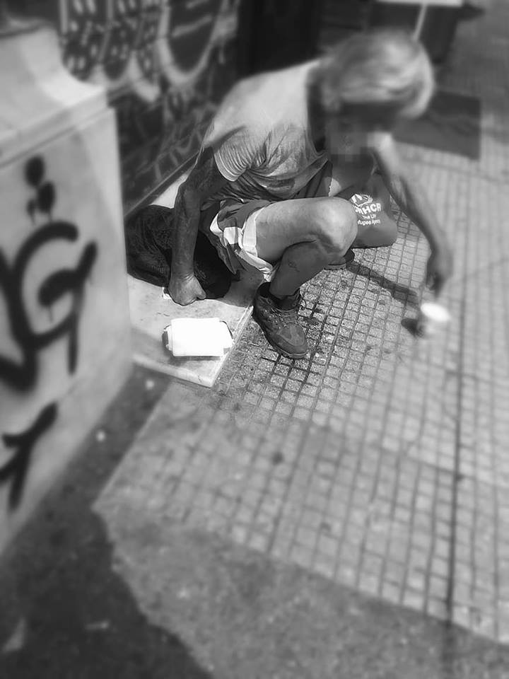
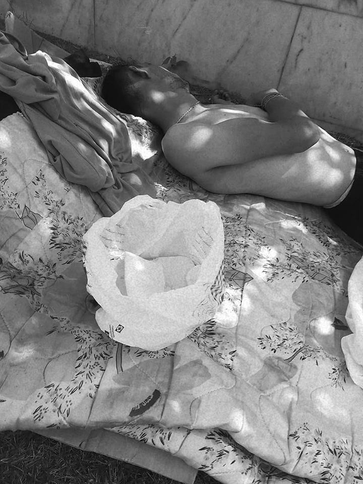

### AYS Daily Digest 15/07/2018 Not Gay Enough

Updates from Western Mediterranean /// 450 people allowed to disembark in Sicily /// Warning for mass deportations from Austria to Nigeria /// Threats to refugees’ health in Skaramangas Camp, Greece

 \)](assets/8c6b2a4ab971/1*CJ3Gx8fKERLKsJ9GPMOLTQ.jpeg)

The only moment immigration doesn’t upset anyone \(Photo by [Solidaritè Migrants Wilson](https://www.facebook.com/Solidarit%C3%A9-migrants-Wilson-598228360377940/) \)
#### FEATURE — Not Gay Enough

A man fleeing anti\-gay violence has been denied asylum seeker status in the Netherlands based on an assessment by the IND \(The Immigration and Naturalisation Department\) which found him to be “not gay enough”\.

28\-year\-old gay man Sercan fled from Turkey two years ago because his family threatened to kill him after he refused to be married off to a Kurdish girl and told his family that he was gay\.

Local media reports state that after two interviews — the first lasting one hour, the second eight hours— Sercan was unable to convince the IND official of his sexual orientation\. As Lennart Wegewijs, spokesperon for the Minsistry of Justice and Security, explains “The IND official determines whether the asylum application is justified based on the account given in these assessment interviews\.” The flaws of this process are quite clear\.

The State Secretary of Justice and Security Mark Habers, in a letter to the Netherlands House of Representatives acknowledged that the way in which the IND determines whether an asylum seeker is truly homosexual and fleeing anti\-gay violence is inadequate\. “The IND says never to ask for details about the sex life of an asylum seeker, nor to carry out a psychological investigation\. ‘Proving’ homosexuality by means of video footage is also forbidden — even if the asylum seekers offer the material themselves\. The accounts given during interview are central \[to the application outcome\] \.” Habers says that changes need to be made\.

Lotte Kammelar, a team member of the Villa Voorstad community centre only has good things to say about Sercan\. “He does volunteer work, goes for walks with older people and works around the Villa”\.

However, even though Sarcan has appealed the decision, he is not allowed to wait for the appeal in the Netherlands, he must do so outside of the country\. The community centre in Deventer has started a petition to prevent him from being deported\.

The case is not a one off\. According to a report published as far back as 2011 by the Vrije Universiteit \(VU University Amsterdam\) and LBGT advocacy group COC Netherlands it was said that around 200 people every year apply for asylum based on fear of persecution for sexual orientation or gender identity\.

According to Sarah French Brennan, Doctoral Researcher at Teachers College, Columbia University, “It is generally understood that a Dutch person’s sexual identity may be fluid\. Yet LGBT asylum applicants must often conform to strict stereotypes\.”

Sources \(in Dutch\): [1](https://www.tweedekamer.nl/kamerstukken/brieven_regering/detail?id=2018Z13376&did=2018D38183) , [2](https://www.rtvoost.nl/nieuws/295488/sercan-zegt-vermoord-te-worden-in-zijn-geboorteland-ind-zegt-van-niet-hoe-bepaalt-de-dienst-dit) , [3](https://theconversation.com/so-much-for-dutch-tolerance-life-as-an-lgbt-asylum-seeker-in-the-netherlands-80332) , [4](http://www.refworld.org/docid/4ebba7852.html)

LIBYA

[Care4Calais](https://www.facebook.com/care4calais/?ref=br_rs) shared the story of a young woman who has faced torture, rape and slavery in Libya\. She is still trapped in Libya having been sold to a household for the equivalent of £330\.

The modern slave trade continues even though the mainstream media ignore it and the politicians deny it\.

They call on the UK government to –

> 1\.Stop preventable deaths in the Mediterranean Sea\. Demand from your Italian and Maltese counterparts that the NGO’s boats and planes are immediately released and allowed to rescue people again without fear of measures that effectively criminalise them\. 

> 2\.Immediately withdraw all funding and support for the deal between Italy and the Libyan coastguard\. Do not use our tax money to fund the Libyan detention system that violates human rights law and all moral principles, or to facilitate ‘pull backs’ of those that try to escape this horrific regime\. 

> 3\.Instead use this funding, which is in fact part of the UK’s foreign aid budget, to support to the reputable NGOs who are operating search and rescue missions in the Mediterranean Sea\. 

To read more and to sign the petition asking the UK government to end its support of the Libya\-Italy deal look [here](https://www.facebook.com/care4calais/photos/a.1046164975416459.1073741829.1046117708754519/2000941879938759/?type=3&theater) \.

SEA
#### **Updates from the Western Mediterranean**

Updating numbers reported yesterday, Caminando Fronteras report a total of 352 people rescued on Saturday between the the strait of Gibraltar and the Alboran Sea\.

■■■■■■■■■■■■■■ 
> **[Caminando Fronteras](https://twitter.com/walkingborders) @ Twitter Says:** 

> > Ayer un total de 282 personas fueron rescatadas en el #Estrecho mientras que 70 cruzaron por #Alborán. https://t.co/mYrLTE2rHr 

> **Tweeted at [2018-07-15 09:00:00](https://twitter.com/walkingborders/status/1018419901852028928).** 

■■■■■■■■■■■■■■ 

On Sunday Salavamento Maritimo rescued 190 people from 7 boats\.

■■■■■■■■■■■■■■ 
> **[SALVAMENTO MARÍTIMO](https://twitter.com/salvamentogob) @ Twitter Says:** 

> > Guardamar Polimnia rescata 41 #personas de #patera en #Alboran tras intensa búsqueda con aviones Sasemar 101/Jason @[Frontex](https://twitter.com/Frontex) y helimer 204. Llega #Motril 02;00 horas. Hoy domingo: 190 vidas salvadas de 7 pateras. https://t.co/3mS2JmRKxA 

> **Tweeted at [2018-07-15 21:30:17](https://twitter.com/salvamentogob/status/1018608718441779200).** 

■■■■■■■■■■■■■■ 

#### **2 NGO vessels back in the Central Mediterranean**

After two weeks without NGO vessels in the Central Mediterranean, Open Arms and Astrals reached the SAR area on Sunday\.

■■■■■■■■■■■■■■ 
> **[annalisa camilli](https://twitter.com/annalisacamilli) @ Twitter Says:** 

> > Open Arms e Astral sono entrate nel Canale di Sicilia e fanno rotta verso la zona Sar. #backopenarms #migrants #refugees https://t.co/HSFTSyf2NW 

> **Tweeted at [2018-07-15 18:14:43](https://twitter.com/annalisacamilli/status/1018559501518057472).** 

■■■■■■■■■■■■■■ 

GREECE
#### Arrivals

Aegean Boat Report state that one boat landed in Panagiouda, Lesvos south east at 04\.50 with 57 people\. No further breakdown\.

[Lighthouse Relief report](https://twitter.com/search?f=tweets&vertical=default&q=lighthouse%20relief) that a further boat with 48 people arrived to the North\. 40 people were from Afghanistan and the remaining people were from DRC, Senegal and Iran\. 25 children, 15 men and 8 women\.
#### **Health threats for refugees in Skaramangas**

According to [local media](http://www.efsyn.gr/arthro/ligmena-antikatathliptika-se-prosfyges-kataggellei-i-enosi-nosileyton) women have been giving birth without medical support in Skaramangas camp, just outside Athens\. Further abuses include the handing out of expired anti\-depressants, in full knowledge of KEELPNO \(the state medical authority\) \. The Union of Nurses of Greece is seeking an immediate investigation and demanding an improvement in care\.

Since February 2018, when the staff of NGOs and the Red Cross left the camp, significant and systematic problems with healthcare provision began\. Health personnel are deprived of basic resources and facilities, such as telephones and internet connection, which are necessary to make further appointments and referrals\.

Among the 2,500 people living in Skaramangas, there are many with chronic diseases \(diabetes, psychiatric and neurological diseases, etc\. \) who are not being adequately treated\. In other words, it is difficult or even impossible to provide effective health care services to migrants\.

This situation is fully known to the KEELPNO administration, according to the content of the report by the Union of Nurses, yet the employed medical personnel are not paid even though they are called to work under these medieval conditions\. What exactly has Greece spent the EU money on if not paying its workers?

We are informed that similar conditions exist in all of Attica’s refugee structures\.

**Athens**
#### Needs list for 5th School housing project

5th School, a self\-organised housing project, need supplies\. PM AYS if you can help:
- Baby milk n\. 2, 3
- Baby nappies \(diapers \) n\. 2, 3

#### Donations needed to support homeless in Athens

 \)](assets/8c6b2a4ab971/1*8ZVl7G13W0IsrGjfXn5gog.jpeg)

\(Photos by [Arash Hampay](https://www.facebook.com/arashampay) \)

Arash Hampay, human rights activist, is [calling for donations](https://www.facebook.com/arashampay/posts/676702696009153) to continue supporting homeless people in Athens by bringing them food\.

> To each and every person who has embraced and supported our work I thank you and hope you continue as we help the \#homeless facing very tough conditions in the city\. 

ITALY
#### **450 people finally allowed to disembark in Pozzallo \(Sicily\)**

The 450 people rescued off the coast of Lampedusa on Saturday spent the whole Sunday in the harbour of Pozzallo, waiting for the Italian government to open the port\. During the day, with temperatures over 35 C°, around 50 people \(among them 43 women and 12 children\) had to be evacuated and transported to hospitals for medical emergencies\.

■■■■■■■■■■■■■■ 
> **[Sergio Scandura](https://twitter.com/scandura) @ Twitter Says:** 

> > #migranti update (20:39), 🔴 57 DONNE E BAMBINI EVACUATI. 43 donne e 14 bambini del corno d'Africa, perlopiù eritrei, visibilmente in stato di denutrizione. Sbarco in corso al molo di #Pozzallo dalla motovedetta G128 della GDF.

400 ca. restano a bordo delle navi Frontex e GDF. https://t.co/f4AJzYNFh7 

> **Tweeted at [2018-07-15 18:41:40](https://twitter.com/scandura/status/1018566283045031937).** 

■■■■■■■■■■■■■■ 

The disembarkation was allowed last night at 02\.00, and continued all night\. Media outlets [report](http://www.repubblica.it/cronaca/2018/07/15/news/_migranti_autorizzato_sbarco_a_pozzallo_per_tutti_i_450_salvini_vittoria_politica_-201873536/) that suspected traffickers among the rescued people have been brought to the local police headquarters\. Other EU countries \(France, Malta, Germany, Spain and Portugal\) agreed to take in some of the asylum seekers\.

■■■■■■■■■■■■■■ 
> **[Sergio Scandura](https://twitter.com/scandura) @ Twitter Says:** 

> > #migranti update  @[RadioRadicale](https://twitter.com/RadioRadicale) 🔴 La prima delle due navi attraccate a #Pozzallo è la Protector 🇬🇧 di Frontex con 180 ca. a bordo dei 400 rimasti. Alle 03:35 inizia lo sbarco.

Si prevedono operazioni di sbarco fino al mattino, per il secondo sbarco dalla M.Sperone della GDF. https://t.co/1Cb8IPncq4 

> **Tweeted at [2018-07-16 01:38:22](https://twitter.com/scandura/status/1018671149264359424).** 

■■■■■■■■■■■■■■ 

The Italian government is establishing a new criminal and inhumane practice: using the lives of people fleeing poverty, dictatorship, imprisonment and war as human shields to impose its own policy on the whole EU, threatening to return them to Libya, impeding SAR operations and holding people in need of medical attention on the boats of its own fleet\.

AUSTRIA
#### **Mass deportation to Nigeria planned**

[Plattform Refugees Welcome](https://www.facebook.com/plattform.refugees.welcome) report that two deportation flights seem to be planned for July 18 and August 16\.

 \)](assets/8c6b2a4ab971/1*Jz5UxAvuj3njqLpy7kyCcg.jpeg)

No deportations\! \(photo by [Plattform Refugees Welcome](https://www.facebook.com/plattform.refugees.welcome) \)

> Warning to Nigerians in Austria: 

> The source of this information is reliable\. Other EU countries may deport people with the same flight\. Every FRONTEX charter involves at least 2 EU countries\. Sometimes, people from Nigeria´s neighbouring countries are also deported to Nigeria\. 

> We call out everyone who cares about the life, the freedom and the human rights of refugees to stand up against this cruel, inhumane deportation policy\. Organising protest would be highly important\! We also ask you to pass this information on to family members, friends and people within your community who are potentially concerned\. In case you are potentially concerned of these mass deportations, we sincerely recommend you to be on alert and do your best to protect yourself\. 

> Don’t allow them to deport you and put your life in danger\! 

The group also published some general information to read if you \(or anyone you know\) are threatened with deportation, you can read it [HERE](https://www.facebook.com/plattform.refugees.welcome/posts/2039400119656404) \.

GERMANY
#### **More demonstrations and actions in solidarity with sea rescues planned in July**

](assets/8c6b2a4ab971/1*GZgcuq9rayi8RV4_P1xvOw.jpeg)

[Image by Seebruecke](https://twitter.com/_Seebruecke_)

FRANCE
#### Some facts and figures on the World Cup winning team

**We strive to echo correct news from the ground through collaboration and fairness\.**

**Every effort has been made to credit organizations and individuals with regard to the supply of information, video, and photo material \(in cases where the source wanted to be accredited\) \. Please notify us regarding corrections\.**

**If there’s anything you want to share or comment, contact us through Facebook or write to: areyousyrious@gmail\.com**

_Converted [Medium Post](https://medium.com/are-you-syrious/ays-daily-digest-15-07-2018-not-gay-enough-8c6b2a4ab971) by [ZMediumToMarkdown](https://github.com/ZhgChgLi/ZMediumToMarkdown)._
