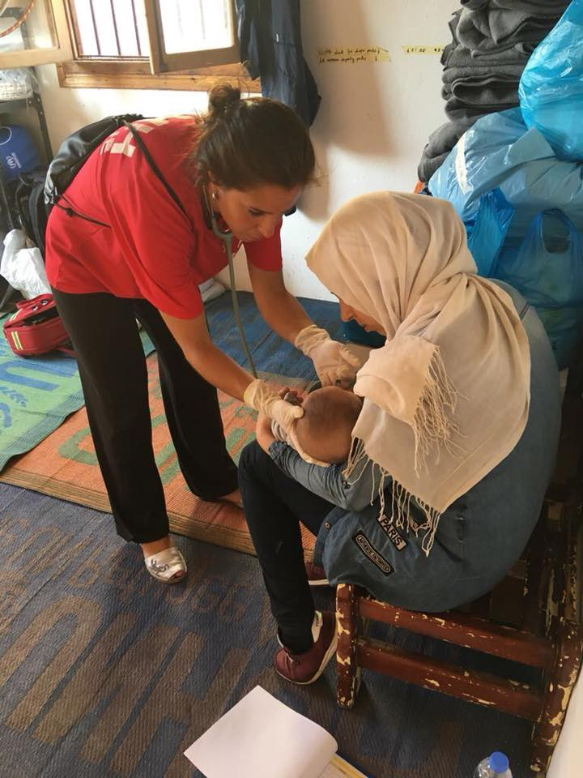
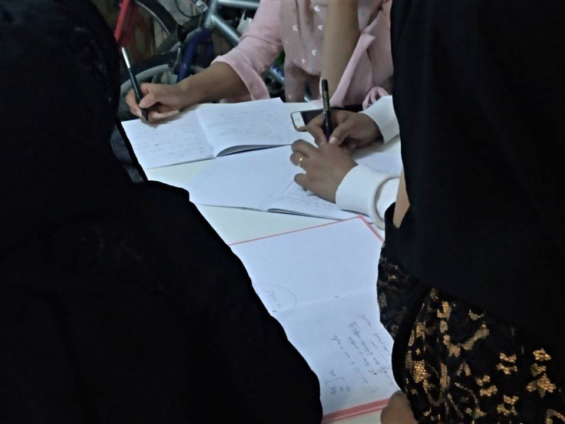
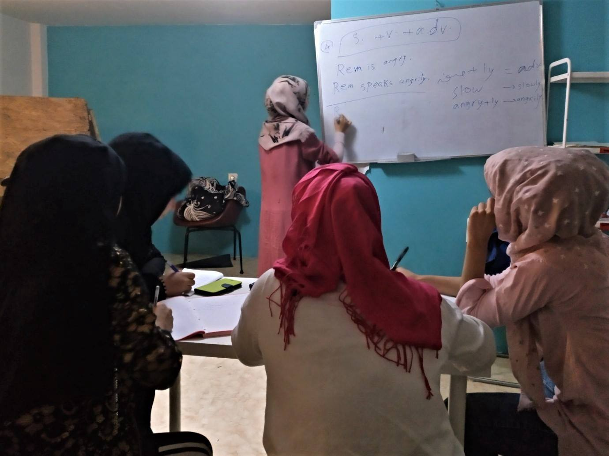
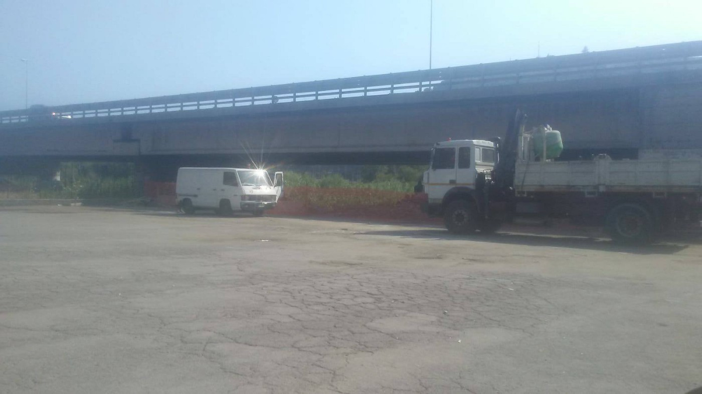
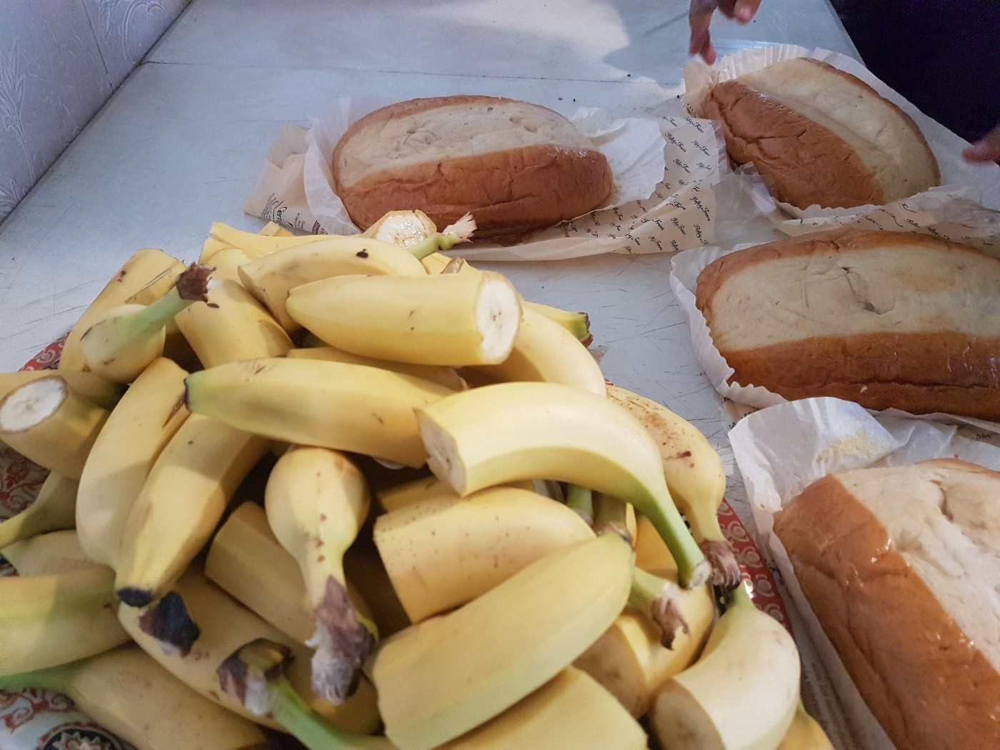
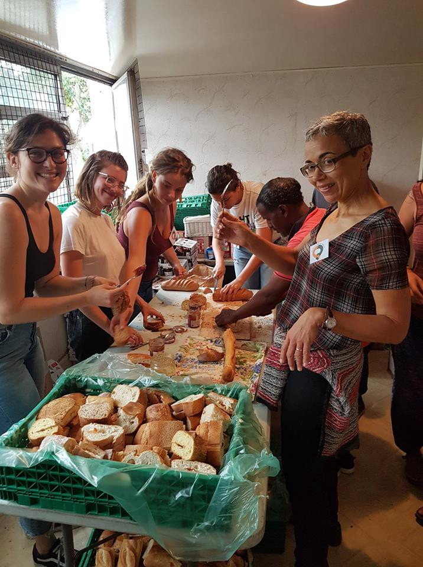
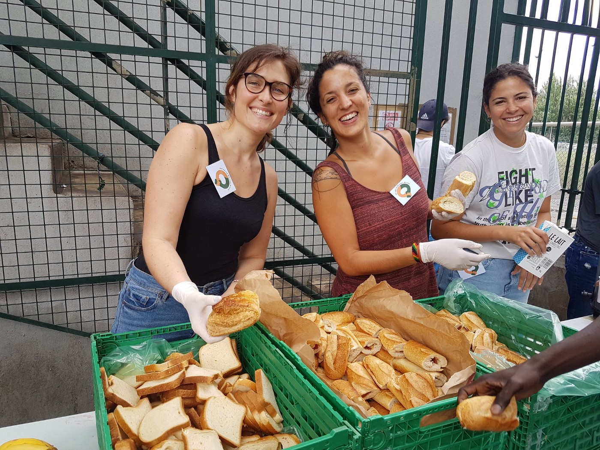

### AYS Daily Digest 20/07/2018: Bodies of Woman and Child Abandoned at Sea by Libyan Coast Guard to be disembarked in Mallorca

69 people arrested in Morocco// The Libyan Government rejects proposal to build Migrant Centres in Libya// Italian Coast Guard uneasy about closure of Ports// Salvamento Maritimo has rescued 450 persons at sea// SOS Mediterranee is preparing for new Mission and Changed Conditions in the Mediterranean//News from Greece// Bosnia// Italy// France and more…

](assets/14e7a933d03b/1*EVWLXNsJ2PNfTsEF-6at5w.jpeg)

Source: [Gabriel Tizon](https://www.facebook.com/gabrieltizonfotografo/?hc_ref=ARQljA1M8Q92xvxwiuFT4ViqZ2ovuKwPD1HWeZMPFliDi_cstDBN-WsoiloCRBSIeyo&fref=nf)
### Feature:

**While UNHCR commends EU states France, Germany, Italy, Malta, Spain and Portugal for finally coming reaching an agreement to share the processing of 450 refugees that have been stranded on the Mediterranean, Proactiva Open Arms prepares to disembark the single survivor and corpses of the deceased women and child that were abandoned at sea by the Libyan Coast Guard earlier this week\.**

The UN High Commissioner for Refugees, Filippo Grandi stated:

> “We hope the arrangements will now be quickly and effectively implemented\. As well as ending an ordeal for these individuals, this sets a positive example of how, by working together, countries can uphold sea rescue and manage borders while simultaneously meeting international asylum obligations\.”

Meanwhile, with ports closed and ever increasing criminalisation and restrictions on SAR vessels from rescuing boats in distress, grave concerns exist for increased reliance on the Libyan Coast Guard for future rescue operations\.

Only a few days ago Proactiva Open Arms accused the Libyan Coastguard for abandoning 3 persons after an interception fo a boat heading to Europe\. A woman and a child were killed in the incident, while a man Josefa, 40 years old from Cameron was saved after being held for 48 hours among the remains of a raft\. It is reported that he will attempt to denounce the Governments of Italy and Libya for the tragedy\.

[The Proactiva Open Arms Rescue Vessel is scheduled to arrive in Mallorca tomorrow](http://www.ansamed.info/ansamed/it/notizie/rubriche/cronaca/2018/07/20/migranti-open-arms-chiede-intervento-procura-di-maiorca_11704adf-1a1f-493a-9280-de27a4d71bef.html) \.

The Founder of Proactiva Open Arms, Oscar Camps, reports:

> “It was not an easy debreafing for mission 47\. After all the hard work and effort, we have to deal with false accusations while transporting a survivor and two corpses\.”

■■■■■■■■■■■■■■ 
> **[Oscar Camps](https://twitter.com/campsoscar) @ Twitter Says:** 

> > No es un debreafing fácil para la misión 47. Después de todo el trabajo y esfuerzo realizado, tenemos que lidiar con acusaciones falsas mientras transportamos a una superviviente y dos cadaveres. https://t.co/XDGsjFgbMV 

> **Tweeted at [2018-07-20 13:59:38](https://twitter.com/campsoscar/status/1020307244083236865).** 

■■■■■■■■■■■■■■ 

Jeff Crisps highlights the silence of the UN who is yet to release any comment on this deplorable incident\.

■■■■■■■■■■■■■■ 
> **[Jeff Crisp](https://twitter.com/JFCrisp) @ Twitter Says:** 

> > As far as I can tell, no part of the UN has commented on this dreadful incident. Why is that?
[theguardian.com/world/2018/jul…](https://www.theguardian.com/world/2018/jul/18/libyan-coastguard-accused-of-abandoning-three-migrants-in-sea) 

> **Tweeted at [2018-07-20 06:16:07](https://twitter.com/jfcrisp/status/1020190596147875840).** 

■■■■■■■■■■■■■■ 

**Since the start of the year 51,782 persons have arrived to Europe by sea\. 1490 are dead/missing\.**

■■■■■■■■■■■■■■ 
> **[IOM - UN Migration 🇺🇳](https://twitter.com/UNmigration) @ Twitter Says:** 

> > 51,782 #migrants & #refugees arrived by sea to Europe in 2018.

1490 dead/missing. Learn more ➡️ [missingmigrants.iom.int](http://missingmigrants.iom.int) https://t.co/G8UB9Dv0gh 

> **Tweeted at [2018-07-20 07:29:08](https://twitter.com/unmigration/status/1020208974380101632).** 

■■■■■■■■■■■■■■ 

### Morocco
#### 69 persons have been arrested in Morocco along with their driver

■■■■■■■■■■■■■■ 
> **[Ali Zoubeidi](https://twitter.com/DrAZoubeidi) @ Twitter Says:** 

> > The #Moroccan royal gendarmery arrested 69 #subsaharian migrants and morrocan driver in #Bninsar while trying to reach #Melilia . 
#migrantsmuggling #irregularmigration https://t.co/0FfMhDc0Yu 

> **Tweeted at [2018-07-20 15:53:30](https://twitter.com/alzoubeidi/status/1020335903343030273).** 

■■■■■■■■■■■■■■ 

### Libya:
#### The Libyan Government strongly opposes the proposal to accomodate rejected asylum seekers in Libya

[According to Libyan Prime Minister Fayes Al\-Sarraj](http://news.trust.org/item/20180720084546-a1scb/) , Libya absolutely opposes the European Unions plan to establish migrant centres in the country\. He has furthermore stated that the decision will not be swayed by financial inducements\. This plan was proposed last month by Italy\.
### Sea:
#### The Italian Coast Guard expresses unease at the Governments closure of ports to those rescued at sea\.

The decision which became enforced in June to [close Italy’s ports to migrants](http://www.hurriyetdailynews.com/italian-coastguards-express-unease-as-government-closes-ports-to-migrants-134784) rescued at sea is causing discomfort within the Italian Coast Guard\. Members of the coastguard have begun to speak out against the new policy, which has forced them to transfer all calls for help and reports of boats in distress to the Libyan Coast Guard\. Before this new policy the Italian coastguard played an important role in rescue missions\.

Giovanni Pettorino, the Commander of the Coast Guard has released two important statements:

> “ There is an unwritten principle that resides in the soul of every sailor: that of heping anyone who risks losing their life at sea\.”

> “We are Italian sailors, we have 2,000 years of civility behind us”

■■■■■■■■■■■■■■ 
> **[Fanny Carrier](https://twitter.com/fannycarrier) @ Twitter Says:** 

> > Malgré la réserve militaire, les garde-côtes italiens expriment leur malaise face à la bride imposée aux secours. "Nous sommes des marins italiens, nous avons 2.000 ans de civilité derrière nous", s'est indigné leur commandant Giovanni Pettorino [u.afp.com/oshk](http://u.afp.com/oshk) #AFP https://t.co/HzHQv4M1Pw 

> **Tweeted at [2018-07-20 17:26:29](https://twitter.com/fannycarrier/status/1020359303528681472).** 

■■■■■■■■■■■■■■ 

#### Salvamento Maritimo has rescued 450 persons from 20 boats today from the waters of El Estrecho and Mar de Alboran\.
#### The commercial Tunisian Boat Sarost5 is still waiting to dismbark 40 rescued persons\.

Italy, France and Malta have refused to accept the boat to disembark\. It is fast running out of supplies\.

■■■■■■■■■■■■■■ 
> **[Fiona Kendall](https://twitter.com/FionaKMedHope) @ Twitter Says:** 

> > For days now, the #Sarost5, a commerical Tunisian boat, has waited to disembark the 40 or so from Egypt, Mali & Bangladesh that it picked up from the #Mediterranean.  Italy, France & Malta have all said "no".  A boat fast running out of supplies is no substitute for a safe port. 

> **Tweeted at [2018-07-20 09:43:41](https://twitter.com/fionakmedhope/status/1020242833490497536).** 

■■■■■■■■■■■■■■ 

#### Turkish Coast Guard Intercept boat on route to Chios

The Aegean Boat Report has reported that 41 people were on board the vessel\. 6 children, 10 women and 25 men\.

#### Three SAR ships remain docked in Malta, prohibited from saving lives at sea

#### 51 Persons rescued from the waters of El Estrecho to be dismbarked at Algeciras:

They are expected to arrive at the port at 18\.40 according to SALVAGEverified\.
#### Moroccan use of the Central Mediterranean route is failing as Spanish authorities intercept boats

■■■■■■■■■■■■■■ 
> **[Matt Herbert](https://twitter.com/DrM2H) @ Twitter Says:** 

> > Between 01 January & 30 June, 2,566 #Moroccan irregular #migrants were intercepted by #Spanish authorities. The western Mediterranean route accounted for 83% of all Moroccans caught, up from 46% last year. Moroccan use of the central Mediterranean route has effectively collapsed. 

> **Tweeted at [2018-07-20 09:16:58](https://twitter.com/mherbe01/status/1020236112139374592).** 

■■■■■■■■■■■■■■ 

#### SOS Mediterranee is preparing for new Mission and Changed Conditions in the Mediterranean

The Aquarius SAR Vessel is set to [leave at the end of July from Marseilles](http://www.ansamed.info/ansamed/it/notizie/stati/francia/2018/07/19/migranti-volontario-aquarius-avremo-drone-per-le-ricerche_9edd9b49-b508-45dc-b389-d52b1b457e49.html) \. More food will be stored on the ship due to longer periods at sea\. Another addition will be the use of a drone to help locate boats in distress\.

The organisation has stated that the “The context in the Mediterranean has completely changed\.”

On June 9 Italy enforced a policy which saw it close its ports to persons rescued at sea\.

Rescue ships are no longer informed about the relief efforts in progress and we do not know why, the result is that the NGOs at sea can make sightings only for ten miles around the ship\.”

■■■■■■■■■■■■■■ 
> **[IOM - UN Migration 🇺🇳](https://twitter.com/UNmigration) @ Twitter Says:** 

> > 51,782 #migrants & #refugees arrived by sea to Europe in 2018.

1490 dead/missing. Learn more ➡️ [missingmigrants.iom.int](http://missingmigrants.iom.int) https://t.co/G8UB9Dv0gh 

> **Tweeted at [2018-07-20 07:29:08](https://twitter.com/unmigration/status/1020208974380101632).** 

■■■■■■■■■■■■■■ 

### General:
#### SITUATION IN NUMBERS

**50,800** 
\# of arrivals in Europe through Italy, Greece, Spain and Bulgaria between January and June 2018
\(UNHCR, 10 July 2018\)

**11,200** 
Estimated \# of children among all arrivals in 2018
\(UNHCR, 10 July 2018\)

**56,200** 
\# of child asylum\-seekers in Europe between January and June 2018
\(Eurostat, 7 July 2018\)

**24,500** 
\# of estimated stranded children in Greece, Bulgaria, and Serbia in 2018
\(UNICEF, 30 June 2018\)

Close to half of all child arrivals \(5,001\) were registered in Greece, where the proportion of children remains significantly higher than on other migration routes \(37 per cent compared to 17 and 16 per cent in Italy and Spain respectively\) \. Most children arriving in Greece come from Syria, Afghanistan and Iraq, and are typically below 12 years old, with infants and small children \(0 to 4 years old\) making the largest age group\. In Italy 2,600 unaccompanied adolescent children arrived by June 2018, adding to over 13,000 unaccompanied and separated children \(UASC\) in the Italian reception system\. Based on Eurostat figures, more than 31,000 UASC claimed asylum in Europe in 2017\.
### EU:
#### European Commission to refer Hungary to the Court of Justice for non\-compliance with EU law over Asylum procedures

On Thursday the EC decided “to refer Hungary to the Court of Justice of the European Union \(CJEU\) for non\-compliance of its asylum and return legislation with EU law\.” Hungary has had the EC:s eyes on them since 2015 when an infringement procedure was started with concerns of the country’s asylum laws, and in December 2017 the EC sent a reasoned opinion as nothing had changed in the desired direction\. Hungary was previously notified\.

The latest developments come after Hungary’s latest decision to make the tough laws tougher, as humanitarian organisations and individuals helping migrants and refugees can be seen as criminals\.
### Greece:
#### Arrivals:

According to Aegean Boat Report: Five boats have so far arrived on the Greek islands, this morning, carrying a total of 152 people\.

Breakdown:

**Two boats Lesvos, 55 people:**

> First boat landed in Eftalou, Lesvos north, 06\.39\. MoChara and Lithuanian Frontex on scene\. One pregnant woman transported to hospital\.
 

> 33 people 
 

> 14 children 
 

> 8 women
 

> 11 men 

> Second boat was a drop off in Tsonia, Lesvos north east, found 08\.00\.
 

> 22 people 
 

> 11 children 
 

> 6 women
 

> 5 men 

**Two boats Chios, 92 people:**

> First boat arrived in Chios port 05\.15\.
 

> Supported on arrival by SMH and CERST\.
 

> 46 people\.
 

> 15 children 
 

> 12 women 
 

> 19 men 

> Second boat landed on Mavra Beach, Chios south, 08\.00\. SMH and CERST supported after landing\.
 

> 46 people\.
 

> 11 children 
 

> 16 women 
 

> 19 men 

An additional 5 people were dropped off with a speed boat to Samos\.

](assets/14e7a933d03b/1*Pld7gsFlUunIpauYcwbHOA.jpeg)

Source: [Salvamento Marítimo Humanitario](https://www.facebook.com/smhumanitario/)
#### Greece to change the way it handles Migration:

[The Greek Government is planning to centralise the management](http://The ministry is also to acquire a new department whose focus will be speeding up the process of transferring migrants from the Aegean islands to the mainland.) of the refugee crisis, both on an administrative and budgetary level by the ministry\.

It has been told that three new reception facilities are to be built on the mainland to allow for relocation of refugees from the overcrowded islands\.

The ministry is also said to create a new department whose focus will be on hastening the process of transfers from the islands to the mainland\.
#### English Classes for women resumed in OCC centre Polykastro

> This week we started again with English classes for women and it seems they are being a success\! Every day from 10 to 11 am in OCC Polykastro\. 

#### Mozaic house in need of a new volunteer coordinator to join their team

Mozaic house is a centre for Refugee women and children in the centre of Athens\.

> The tasks will be:
 

> Supervision during the shifts
 

> Organising the program for the week 
 

> Communication with volunteers through WhatsApp 
 

> Welcoming of new volunteers, making their contracts and explaining them their duties and the framework of the shelter\. 

> Hours and days of work are flexible to be arranged but they must be fixed\. 
 

> Certification will be provided\. 
 

> Long term volunteers \(3 months \+ \) preferred\. 

> **You can contact us through email: stekou@help\-ev\.de** 

#### Khora Legal Support Team Update:

Whilst the Khora Community Centre searches for a new building we are operating from The Jafra Foundation \(Kallidromiou 49, Athina 106 81\) every TUESDAY AND THURSDAY 12PM\-5PM\.

We predominantly assist with:
\- Legal assessments
\- Accompaniments to GAS Facilities
\- Advocacy related to housing, cash cards and access to health care\.

**If you require help and assistance, would like to volunteer with us or find out more about what we do you can send us a message here or email khoralegal@gmail\.com**
#### Mobile Info Team reports of two groups of refugees forcibly returned form Greece to Turkey by Police

> Over the past 10 days, we have been in touch with two groups of refugees from Syria, Iraq and Yemen who have been forcibly returned to Turkey from Greece, by the police\. They were not given the chance to claim asylum\. 

> “I was desperate to escape the misery of war and put the Turkish camps behind me, on the 5th of July 2018 we were a group of fourteen people ready to cross the river Evros to Greece, and after 10 hours of being on the road\. It was nearly dawn but still dark when we arrived at a small Greek border village\. 

> Hungry and covered in mud, we were forced to stay at abandoned toilets to hide from the police for 5 hours before the police found us and we were taken to a different area, where we were held for more than six hours\. The police took our passports, money, phones, and shoes\. At sundown, they transported us to the small island in the river and then the Turkish police came and arrested us\. We were never given our money, passports or phones back,” our contact informed us\. 

The organisation informs the the groups are now back in Turkey\. They have reported the incidents to the UNHCR and the Greek Ombudsman and are attempting to challenge this very sad violation of peoples right to claim asylum\.
### Bosnia:

Bosnian police on Thursday discovered five people from Iraq in the city of Zvornik, near the border with Serbia\. In this small border city this year 307 people were registered\. Since February this year, thousands of people have found their way from Serbia to Bosnia, hoping to continue their travel toward the EU\.
#### Red Cross warns of deteriorating conditions in Bosnia as well as increased use of violence against persons trying to cross into Croatia and Slovenia

With over 8,000 people having arrived in Bosnia and Herzegovina since the beginning of 2018, the country is struggling to cope with the 8 times influx witnessed compared to 2017\. in the past four weeks alone 3,000 people have arrived in the country\.

In addition the organisation reports that dozens of people are being treated each day from injuries sustained while attempting to cross in to Croatia and Slovenia\. Police are increasingly using violence to protect borders and halt migration\. In Bihac, medical teams are treating anywhere up to 70 people per day\.

> IFRC spokesperson in Bihac, Nicole Robicheau, said: _“The conditions close to the border are grossly inadequate and we’re concerned for people’s safety\. Families are sleeping on the ground without any proper shelter, without bedding or blankets — people don’t want to stay here but they are effectively stranded\. Each day, people try to move onwards to Croatia but many return with injuries\.”_ 

> _“We are extremely concerned about reports of violence against people trying to make their way into Croatia,”_ said IFRC’s Regional Director for Europe, Simon Missiri\. _“Governments have the right to set and enforce migration policies, but they also have the obligation to ensure that all people, regardless of immigration status, are treated with dignity and respect\._ 

### Serbia:
#### UNHCR reports that in the last two weeks 3357 people have arrived in Serbia
### Italy:
#### Fence being built in Ventimiglia to prevent people even from sleeping under the bridge

](assets/14e7a933d03b/1*uPewuYWw2i4WUcRJzNtxaw.jpeg)

Source: [Progetto20k](https://www.facebook.com/progetto20k/?hc_ref=ARTf06ZvA8jm1jnYR2PRNkfSzT_Ks-yvQ_5YVkfdW0_n_4TfPk0rKAEc_dzpRpbfkMk&fref=nf&hc_location=group)
### France:
#### [Solidarité migrants Wilson](https://www.facebook.com/Solidarit%C3%A9-migrants-Wilson-598228360377940/?hc_ref=ARRBtTHx4PG9zEMHITVx3InMs9hYuflfEE8WMjz0rRbV6Z6-ZiMvtZQ4wTpGKFceHYM&fref=nf) need more volunteers to help keep up with demand

> Too few people on schedule as we serve 700 people right now\. Need backup for a more serene distribution given the current situation\. 

#### Please read and sign [this petition](http://---  http://petitions.care4calais.org/   ---) by Care4Calais to stop preventable deaths on the Mediterranean

> This is Camara\. He drowned in Europe’s moat, the Mediterranean Sea\. He was 25 years old and he is just one of hundreds of people to have lost their lives after Humanitarian Rescue was effectively outlawed at a recent EU summit\. 

> He was an IT student from Gambia, and had worked for his father\. When work dried up, he moved to Libya to find work, but was soon caught up the the vicious network of brutality that is within Libya today\. 

> Life didn’t work out for Camara\. It was never meant to\. Instead of finding work, the political vacuum that has been created in Libya swallowed him whole\. Camara spent three and a half years in Libya, in a state of perpetual waiting\. 

> He liked football and played in goal\. He liked to sing\. He had normal dreams\. He didn’t want to claim benefits\. He just wanted to work, have a family and live in peace\. Those simple desires are too much for some though\. 

> May he, and all of the thousands of people like him, who have perished making this journey to Europe, rest in peace\. 

> May this deliberate slaughter be brought to an end, and its perpetrators be brought to justice\. Please sign and share now to end this 

■■■■■■■■■■■■■■ 
> **[Ali Zoubeidi](https://twitter.com/DrAZoubeidi) @ Twitter Says:** 

> > The #Moroccan royal gendarmery arrested 69 #subsaharian migrants and morrocan driver in #Bninsar while trying to reach #Melilia . 
#migrantsmuggling #irregularmigration https://t.co/0FfMhDc0Yu 

> **Tweeted at [2018-07-20 15:53:30](https://twitter.com/alzoubeidi/status/1020335903343030273).** 

■■■■■■■■■■■■■■ 

### Germany:
#### A demonstration agains the criminalisation of sea Rescue to be held today n Bonn

The demonstration is organised by Jugend Rettet e\.V\. Nordrhein\-Westfalen

> Come many, be orange, stand with us for safe escape routes and against criminalising the rescue in the Mediterranean\! 

To find out more please follow [this link\.](https://www.facebook.com/events/474387246308117/)

> **We strive to echo correct news from the ground through collaboration and fairness\.** 

> **Every effort has been made to credit organizations and individuals with regard to the supply of information, video, and photo material \(in cases where the source wanted to be accredited\) \. Please notify us regarding corrections\.** 

> **If there’s anything you want to share or comment, contact us through Facebook or write to: areyousyrious@gmail\.com** 

_Converted [Medium Post](https://medium.com/are-you-syrious/ays-daily-digest-20-07-2018-proactiva-open-arms-returns-bodies-of-woman-and-child-abandoned-at-sea-14e7a933d03b) by [ZMediumToMarkdown](https://github.com/ZhgChgLi/ZMediumToMarkdown)._
