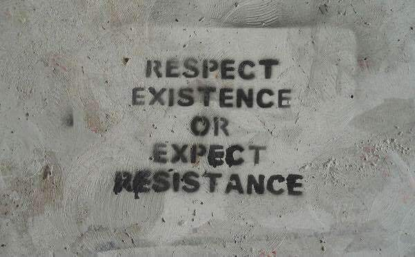
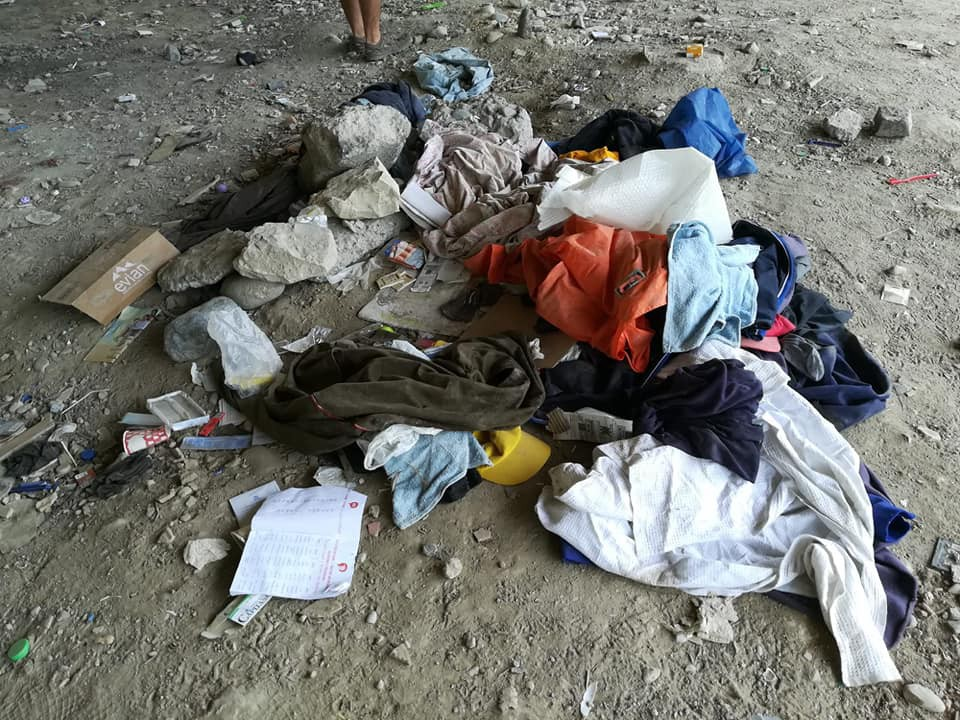

### AYS DAILY DIGEST 21/07/18: Syria is safe now? Russia, the US think maybe…

_Who gets to decide fate of Syrians? The states, of course // Turkish detention policy is inhumane and people continue to be trapped // Debunking of far right myths about economic impact of refugees in Greece // Serbian refugee support under media attack// Report on the broader picture in Ventimiglia // Safe water desperately needed in France // Protests in Germany and UK_

Photo Credit: Jenny Graham
### FEATURE: The Spoils of War…spoiled rotten

According to several media outlets, Russia and the US are considering a proposal for refugee return to Syria\. As with many of the US President’s meetings, however, [the tangible outcomes remain unclear\.](https://www.independent.co.uk/news/world/americas/trump-putin-meeting-syria-refugees-return-mike-pompeo-un-new-york-a8457651.html)

Although Mike Pompeo from the US states that the plan will take place “at the right time” and “on a voluntary basis”, it is difficult to ascertain how voluntary these repatriations would be, considering the recent attempts the Syrian government has made in order to take what is considered by [many to be punitive action against people who left Syria who remain in abstentia](https://www.reuters.com/article/us-mideast-crisis-syria-lebanon/syria-tells-lebanon-it-wants-refugees-to-return-idUSKCN1J01OO) \. The government in April passed a law that is not yet in effect that would allow the Syrian government to confiscate land from refugees who do not file an “appropriate claim” within 30 days\.

Additionally, although the government has stated that due to “clearing areas of terrorists” that many areas are safe for return and is calling on “her sons” to return and build the country, others are not as convinced\. Indeed, with the Syrian government regularly courting the support of far right elements in Germany \(AfD visited Syria in order to discuss refugee return\) it is clear that the motives are not clean as the driven snow\. Emmanual Macron of France moved forward on talks with Vladimir Putin about joint humanitarian efforts in Syria\. With alliances being rapidly reformed, it is clear that “an endpoint” is the goal of all world leaders involved, regardless of what that entails for refugees\.

In the face of advances by the Syrian Arab Army and its allies, 800 members of the White Helmets and their families were evacuated to Jordan where they will be resettled to [Canada, Britain, or Germany](https://www.theguardian.com/world/2018/jul/22/israel-evacuates-800-white-helmets-in-face-of-syria-advance) \.

Although humanitarian aid and the right to refugee return are laudable, in the broader context of how Europe and the US actually handle and view refugees, along with increasing media and public pressure and criticism, it is hard not to interpret the motives behind these proposals as simply “dealing with a problem”, rather than being truly in the spirit of affirming human rights\. These situations tend to oversimplify the complex political and economic realities of “push factors”, reducing them to simply a “state of war”\. Meaning that a “state of comparative peace” is considered “good enough” to send people back\. Many may remember when, in 2015, portions of Homs that were flattened were assessed to be “safe areas”, thus excluding people from those areas from moving out of Greece \- simply because there was nothing left to fight over\. We see echoes now in the consideration of Afghanistan as a “safe country”, in spite of retaliatory attacks, regular bombings, and daily threats to existence: the actual commitment to “safe voluntary return” is yet another hollow and sinister benchmark\. A box to tick with human lives\.
### TURKEY

Turkish forces have intercepted and detained nearly two hundred people who were attempting to reach Greece in the last few days\. This is relevant in light of a recent documentation of the conditions of detention/arrest facilities awaiting some if not all of these people\. People report no food and no water, and ill treatment of people trying to escape to a stable life\. Yet, like in the case of Libya, Turkey remains “partners” with the EU in terms of refugee management\.

### GREECE

According to the Aegean Boat Report, around 82 people arrived on Lesvos\.

In response to the proposal to open a new centre for reception on Samos, a delegation is going to Athens to protest it\. The mayor reports that he had not been informed appropriately about the proposal which would replace the current reception centre, which is vastly overcrowded, originally being designed to house around 700 people and currently holding over 2500 people\. Authorities on the island are hoping to put pressure for more transfers to the mainland\. Read more [here](http://www.ekathimerini.com/230928/article/ekathimerini/news/authorities-on-samos-object-to-plans-for-new-migrant-camp) \.

PRIN posted a helpful takedown of the common right\-wing talking point that the refugee crisis in Greece has been destructive to the Greek economy, negatively impacting tourism\. Although the report notes that islands hosting refugees have seen a decreased capacity and interest in tourism, the comparative investment in order to sustain refugee populations there, as well as the extent to which refugees contribute to the local economy as long\-term residents offsets these claims\.

Although the report is useful in debunking common misinformation, it is crucial that we do not view it as an endorsement to keep people in unsanitary and horrific living conditions against their will\. The report discusses this as well:

“The impoverishment of refugees that this government enforces, sends hundreds of countless female refugees to the streets selling their bodies for a meal, forces minors and even children down the same dangerous and abusive path, leads to countless rapes of refugees and ultimately even leads to deaths due to unavailable or inadequate medical care\.

The enforcement of the most recent decision of the EURO Summit will only result in the creation of a number of additional hellish detention centers, just like the one in Moria\.”

Read the excellent statement [here](http://prin.gr/?p=21619) \.

Lifting Hands International in Serres, Greece is recruiting teachers for their project in September\.

_“ — German teacher_ 
_— English teacher \(TEFL qualification preferred\)_ 
_— Dance teacher \(hip\-hop/street\)_ 
_— kids activities_

_We teach Yezidi refugees of all ages\. If you are available from September onward, we would love to hear from you\. 30 days minimum stay, housing available for 5 euros per night\. Please email greecevolunteer@liftinghandsinternational\.org”_
### SERBIA

Miksaliste released a statement in opposition to the tabloid reports of the refugee community centre being the site of a bloody stabbing\. In reality, the conflict had taken place in a nearby park, and the victims were taken to the centre as it was a place of safety where additional help could be sought\.

Read the full report, available in Serbian and English as well as the related false articles, designed to undermine and demonize refugee support in Serbia [here](https://www.facebook.com/RefugeeAidMiksaliste/posts/2095005637432716) \.
### ITALY

In Italy, Help\-NA posted an exhaustive report on the awful conditions, increased persecution of solidarity, and continued illegal returns to Ventimiglia at the Italian\-French border\.

“It is paradoxically one of the hardest borders in Europe without internal borders\. Many of the migrants who arrive along the route of Libya and Italy try to cross that Franco\-Italian border, most of them are Sudanese and Eritrean and many of them are stranded in the town of Ventimiglia, try to cross along the train tracks at night either by the mount, they arrive this way to the valley\. In this area there are no established camps or reception centres, local authorities refused to install them\. People walk through the streets and mount in full winter, there have been freezes and deaths\. Aid to such persons is punishable by law, although with some exceptions \(recently humanitarian aid in France ceased to be a crime, but the attention offered in areas close to the border remains\. \) The border is strictly controlled by the police, with controls of up to two hours affecting the European population as well\. There are cases of institutional racism, on all trains identify black people, and if they do not have papers they are illegally deported by skipping any international legislation that requires protection of minors, collecting and accepting asylum applications by all people to ask her and to ensure that no one can be deported without lawyers and witnesses\. In addition, French and Italian fascist groups have carried out actions to prevent the arrival of people in transit, including to place a large network to prevent passage\.”

Ventimiglia, photo credit: Help\-Na

The report also details the persecution of local individuals who have sought to help people there, who were subjected to a boycott\. Read the full report, available in Italian, [here\.](https://www.facebook.com/HelpNa/posts/2226149490950367)
### FRANCE

Phone Credit for Refugees is seeing a high need still for phone credit for unaccompanied minors and is serving at least 70 minors unaccompanied in the former Calais Jungle\. With donations sluggish and people calling phone credit a privilege, not a right, the situation is dire\. Please consider donating [here](https://www.facebook.com/groups/Credit4Refugees/) \.

[L’Auberge des Migrants](https://www.facebook.com/AubergeMigrants/?hc_ref=ARRoZaXAbxLuFtdGHUkckoTpbvuyuTvJ4mHTn6edqt4XIkhFUyKrPD4hyJT6vEiBxco&fref=nf) reports that there has been little to no action in securing safe water points for people in Calais\. Ten associations are taking their reports on the dangers of the lack of safe latrines and water access points in Calais to the local government\. Read more, in French, [here](http://www.laubergedesmigrants.fr/fr/10-associations-saisissent-une-nouvelle-fois-le-juge/) \.

There was a small protest against the increased persecution of SAR programs in the Mediterranean, garnering around 11 people who dressed in red to call for a STOP to these actions\. In reference to the shameful treatment of the Aquarius, which was refused port in Italy and shuffled around between ports while being overburdened with 600 souls:

“Since then, it continues with other boats\! The month of June and the beginning of July were particularly deadly: at least 600 deaths in 4 weeks\.
 With this rally, it was a protest against the decision of E\. Macron not to welcome the migrants of death and hell Libyan, in defiance of the values of France, including brotherhood\.

After a speech recalling this inhuman situation, flowers were thrown into the Yonne, to pay tribute to the more than 34,000 deaths in the Mediterranean for 25 years, and at least 1,451 since the beginning of The Year 2018\.

Many participants were dressed in red t\-shirts because “red is the color that invites us to stop\. But there is now another red that asks us even more peremptory to think, engage and act\. It is the clothing and t\-shirts of children who die at sea and the sea then rejects on the shores of the Mediterranean\. Red, it was the color of the garment of little Aylan, three years, whose photo in September 2015 caused the excitement and indignation of the whole world,

> “ Red is also the color of clothes that mothers put to their children when they embark, in the hope that in the event of a shipwreck, this colour will draw attention to relief\.” 

Read more [here](http://Collectif sénonais de soutien aux réfugiés et aux migrants) \.
### GERMANY

On Sunday the 22nd, there is an anti\-racism demonstration to be held in Munich, according to Melting Pot Europa\. 
“We want to resist the irresponsible policy of division of seehofer, söder, Dobrindt & co\. Sending a signal against the massive movement to the right of society, the state of surveillance, the restriction of our freedom and attacks on human rights”, write the organizers attacking the AfD “ that increases hate and social exclusion\.”

Follow along [here](https://www.facebook.com/meltingpoteuropa/posts/1985764651455252) \.
### UK

Refugee Info Bus is promoting a campaign against inhumane detention of people seeking refuge in the UK:

“In the twelve months leading up to March 2018, 58 children were locked up in immigration detention, despite a Government promise in 2010 to end the practice\.

The UK Government has the power to detain people who are here seeking refuge\. This years’ statistics show that from March 2017 to March 2018, 27,429 people were imprisoned in immigration detention centers; among them many people seeking asylum\.

46% were released back into the community rendering their detention pointless\. Some nationalities are nearly always released from detention; over 84% of Iranians were released during this time period, begging the question why they are detained in the first place\.

This has to stop\. Take Action Now — Join the Campaign:

[http://detention\.org\.uk/](http://detention.org.uk/) ”

They also add that of the children who came unaccompanied to the UK, only 40% of them received asylum\.

**We strive to echo correct news from the ground through collaboration and fairness\.**

**Every effort has been made to credit organizations and individuals with regard to the supply of information, video, and photo material \(in cases where the source wanted to be credited\) \. Please notify us regarding corrections\.**

**If there’s anything you want to share or comment, contact us through Facebook or write to: areyousyrious@gmail\.com**

_Converted [Medium Post](https://medium.com/are-you-syrious/ays-daily-digest-21-07-18-syria-is-safe-now-russia-the-us-think-maybe-84acb23d6cc1) by [ZMediumToMarkdown](https://github.com/ZhgChgLi/ZMediumToMarkdown)._
