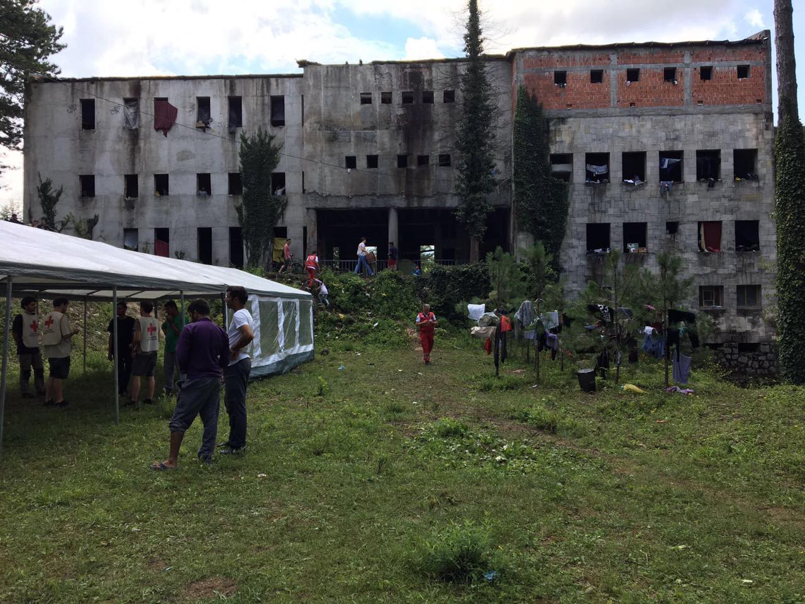
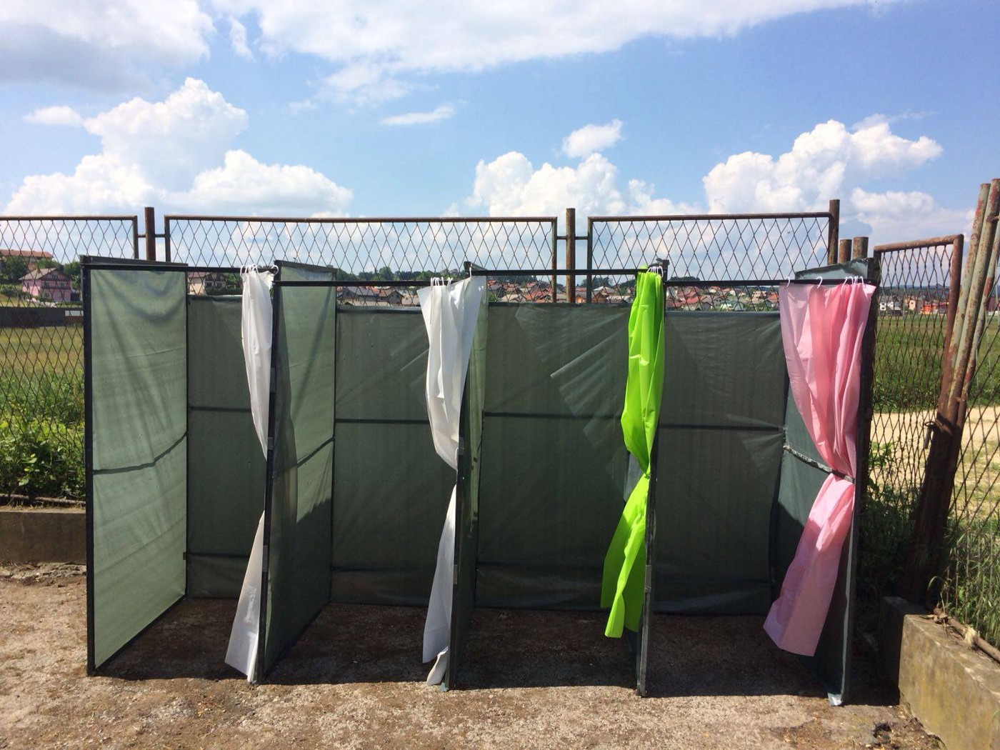
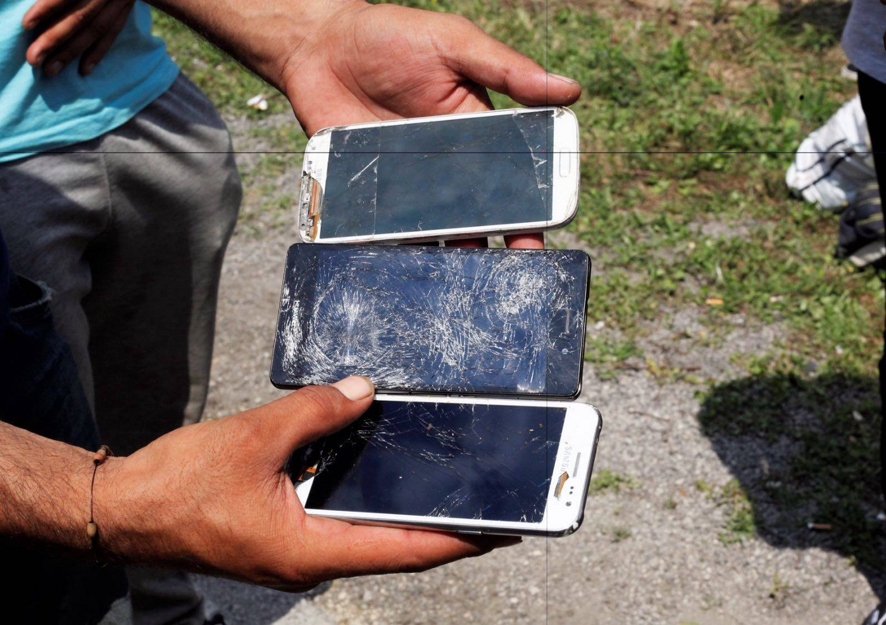
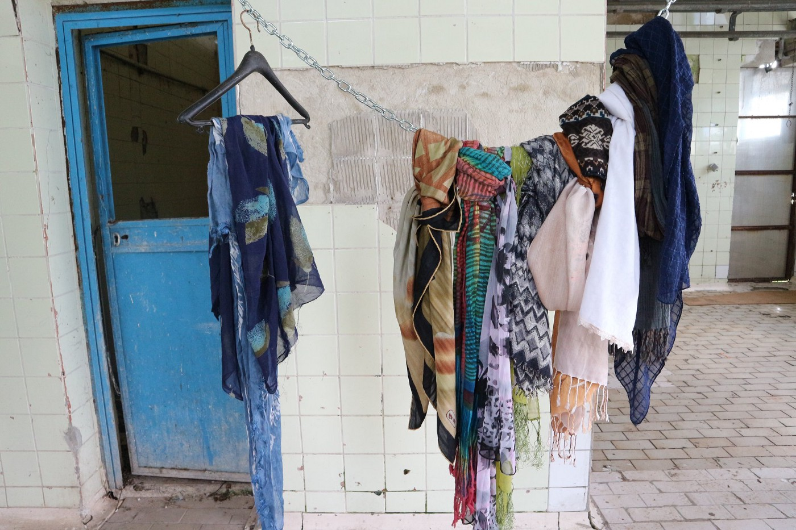
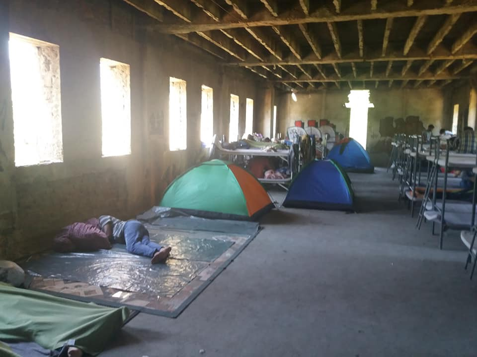
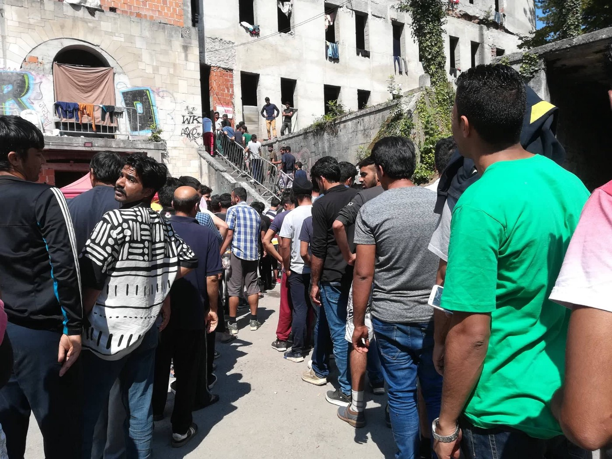
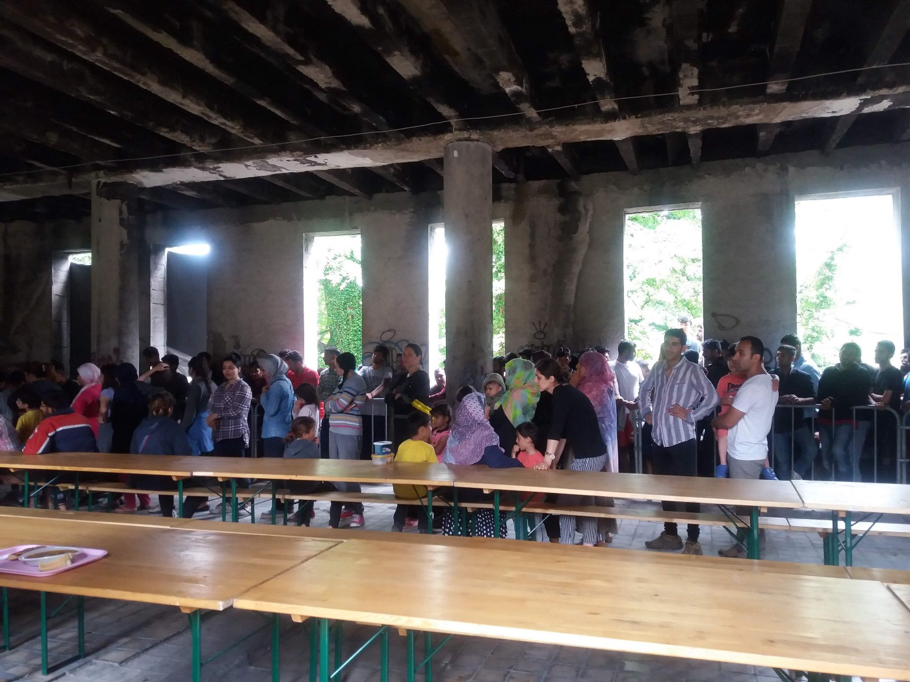

### AYS SPECIAL from Bosnia: “The game” that leads to European Union

_Lorena Fornasir and Gian Andrea Franchi, Italian activists, went to Velika Kladuša and Bihać for the third time to bring help\. For AYS they write about appalling living conditions, people who were pushed back after beaten and robed by the EU police, endless attempts to cross the borders, about children who do not smile…_

Photo by One Bridge to Idomeni, Bihać, Đački dom\.

**_Velika Kladuša, 9 and 10 July 2018_**

The town of over 40,000 inhabitants is more scattered than Bihać and, it seems to us, with newer or more repaired buildings\. Few are the houses left with traces of bullets and grenades from the last war in this country \(1992–1995\) \. The streets and clubs are animated until late evening, full of people who seem to live peacefully with the mass of refugees in constant movement from one place to another\.

We know that various families welcome children or some groups participating in a welcoming atmosphere and private initiatives ranging from offering clothing, food or preparing meals\. We know, however, that the municipal administration prohibits contracts for renting houses or rooms to refugees, thereby restricting possible projects advanced by associations and non\-profit organizations that from time to time appear in a proactive manner\.

Along the road that leads us to the center of Kladuša we meet several limping, bruised, upset, dazed young people, who are returning from an unsuccessful attempt to enter Europe\. What they call “the game” one will win or lose in the “jungle”\. We know that they will try again, they have no choice but to rot in the camp of earth and mud on the edge of every possible life\.

We soon reach the location of the “showers,” a former slaughterhouse that the talented volunteers have turned into a less degrading but always shabby space\. The horrible hooks hanging from the ceiling are a metaphor of the life of these migrants hanging on the edge of an almost impossible bet\.

Showers, Kladuša, Photo by No Name Kitchen\.

We find Samyr sitting on a stone, a frozen posture, his back against the plum\-colored wall, his face a grimace of inconsolable despondency\.

_“I’m from Syria, I was tortured, I lost everything, I walked 10 days to get to Slovenia, the policemen discovered me in the woods, and when I heard their footsteps, I found 4 men without uniforms, but by now it was too late, under the t\-shirt they had the police badge, they handcuffed me and jailed me for 2 days in a container without water and food; because they took my fingerprints I asked for asylum, but they deported me to Croatia where I was treated in a cruel way and where the police broke my phone and robbed me; the Croatian police then took me to the border with Bosnia and they told me: go walking, it’s only 5 km to get to Kladusa\. Instead it was 25 km… “\._

His story is similar to that of the many, countless young men who try the way of the woods\. Not far away, a small group is sitting on the ground between waste and dirt\. They took off their shoes, their feet are full of sores, their arms and legs bear the signs of mistreatment and the cuts of the scrub of the woods through which they had tried to escape\.

Photo by No Name Kitchen

In the late afternoon the team of “SOS Kladuša,” Adis and Petra, who deal with the management of the “camp” the finding of nails and woods to build the skeleton of the tents made of plastic sheets and of many other neverending things\. Adis enjoys good recognition not only by refugees but also by local police as it maintains a sort of order and organization among hundreds of people\.

About five o’clock in the evening, he arrives in a small Volkswagen to distribute shoes, sharing his work with Petra\. While Petra, standing on the trunk of the car picks up the “coupon” and delivers the shoes “booked,” Adis takes care of the cuts in the feet and the wounds of the boys who have lost the “game” and return — after deportation from Italy, or from Slovenia that deports to Croatia that deports to Bosnia — bruised, beaten, mistreated, robbed of everything and with cell phones smashed \.

Yasir testifies: _“I was in the hands of the Croats, they took me in the” jungle\. They took away the little money I had, they beat me and broke my phone because mine was not good\. If I had a good phone they would have stolen it\. Cell phones are smashed to prevent us from using GPS maps in the forest\. Without GPS we get lost and we are at the mercy of all the dangers, even the people who see us call the police\.”_

Both collaborate with the volunteers of “No Name Kitchen”\. The two groups have split up their tasks: the Spanish volunteers collect one by one the requests with the name of the refugee and the number of shoes they need, while Adis with Petra procure them and then distribute one or two days later\.

The volunteers of “No Name Kitchen” have also taken on the task of showers for which, every other day, men and women can wash themselves with cold water in front of the former slaughterhouse, in a space organized and divided with plastic sheets in 4 “cabins”\. They also organize the laundry by taking the garment to be cleaned and delivering a clean one\. They bring all the linen into their home, wash it and dry it to return it to the next shower\. With all the refugees they entertain empathic relationships, fresh, genuine, solar as well as professional\. In the evening, when the sun goes down, they play activities with the children of the camp who, unfortunately and obviously do not go to school and live in deprivation\.

Photo by No Name Kitchen

They tell us that the most worrying health problem, in addition to allergies, fungi and the results of the violence suffered by the Croatian police, is scabies that have become endemic\. Being able to have clean socks to be distributed is a modest but necessary form of prevention, but difficult to find\. For this reason, the following morning we will buy together dozens and dozens of socks in addition to underwear and medicines, while we occupy the evening with Adis and Petra to buy shoes, especially those with the sole that does not slip for those who decided to face the forest\.

We learn that now in Kladuša, unlike our first trip about 20 days ago, a doctor, Samir, from MSF, intervenes in the camp 3 times a week\. For the remaining four days, he manages relations with the Kladusa hospital, making it possible to take care of the most important cases\. Samir, however, complains about the excessive bureaucracy to which he must abide as an MSF operator\.

The visit to the camp is always a shock\. Between here and other locations including a nearby hangar, it seems there are between 600 and 800 people in a number always variable between those who arrive and those who leave\. Above all there are families, many, too many, with small children, even newborn babies, unable to brave rivers and forests with their young children\.

There are many unaccompanied minors\. In their faces the expression is petrified, there are those who move mechanically, those nervous, those who ask for a sleeping bag because he can no longer stay in this hell and wants to try the “game”\. Everybody asks for umbrellas because here it rains a lot and the plastic sheets leak water on all sides\.

A group of eight Kurdish youth cook chapati in improvised pans over fires\. They want to reach Europe but for now they have only accumulated two years in the camps of Serbia and 3 months of detention in Bulgaria\. Next to them, lying on the ground with a blanket covering him, the body of a young man who had tried salvation and instead, they tell us, the Croatian police took him and beat him hard with batons on his back, on his legs, on the arms\. Then, of course, they robbed and deported him 30 km from Velika Kladusa\. Now he lies here, helpless, sleeping, avoiding the awakening that will bring him back to reality\.

When we arrive at the camp, children, especially them, appear first, running disorderly\. Some come to you with that habit of undifferentiated friendship asking you all and nothing, sticking to your hands or legs as if you want to get a grip on a body that hooks them to the life they do not have\. Other children, however, do not want to separate from their mothers, do not look up or deceive themselves wandering in the dust in search of something that is not there\. Their time is full of an emptiness that becomes a body in the sometimes absent, sometimes vacuous gaze\. Today stands out a beautiful girl of 6 maybe 7 years, long black hair gathered with an elastic behind the nape\. She wears a ruby colored dress that contrasts with the squalor and dust of the camp\. In her eyes a nameless sadness, in her face not a smile\. Seeing a child who does not smile is like looking in the mirror at our civilization that spreads death\.

This much\-desired Europe is actually a state\-inflicted trauma inscribed in the body\.

**_Bihać, 11 July 2018_**

In the so\-called Đački dom, large dilapidated building that officially hosts refugees, there is regular intervention by the Red Cross and, now, other organizations such as IOM, Doctors Without Borders and Save the Children\. The electricity has recently been restored by the Municipality, the health services, placed in the courtyard, have been improved compared to our previous trip, but still inadequate, given the increase in the number of occupants who rose from 500 to 900 people\. We remind that it is the skeleton of a building intended for a school or home for youth, with various rooms not accessible because unsafe or with very dangerous large holes on the floor, with doors that give on the void, with parts in which the rotten cement lets the water pass\. Let’s imagine the rainy autumn and, worse, the winter in an area where it snows a lot\.

Photo by Dylan Longman, Inside of Đački dom

In our opinion, this very bad conditions does not have much to do with the indifference of local institutions, but with the general poverty of the canton of Bihać\.

Climbing the internal flight of stairs, on the first floor, you realize the danger of the building\. Without a handrail, the staircase is completely exposed\. There are many children playing\. It seems to us that families with children have increased recently: at least thirty tell us, but there is no precise estimate\. A child plays hide\-and\-seek in the stairs, leans out dangerously, and we realize that emptiness could swallow him in a flash\. Going down, on the ground floor, we are impressed by a child playing with a tank, going ‘bang, bang\!

In one of the rooms on the upper floors, we meet two guys who start talking to us\.

_“We are 18 and 24 years old\. We come from Syria\. We have been in the Balkans for two and a half years, first stuck in a camp in Serbia\. 15 days ago we managed to get to Trieste and we expressed our desire to seek asylum\. The police took our fingerprints, took pictures, held us for a day at the police station\. Then they deported us to Slovenia, who deported us to Croatia\. The Croatian police beat us, stole what little we had, including food, broke our cell phone, took the documents\. They also stirred up the dogs\. Then they deported us to Bosnia and now we are here again, in Bihać\.”_

After telling us their story the two boys invite us to eat with them a kind of soup that they are preparing on an improvised fire inside a curtain of smoke\.

The majority of the ‘guests’ of this perilous structure instead eat collectively at the tables of a large room, the food brought by the Red Cross \(a soup of legumes, it seems, with a piece of bread — the past times we had also seen pieces of meat\) — after having done a very long line that lasts at least two hours in the courtyard \(think about when it rains\! \) \.

Food line in Bihać, Photo by Red Cross Bihać

Everything is guarded by two imposing policemen dressed in black\. Some, however, prefer to cook alone, in other rooms\. “The Red Cross food is not good,” they tell us\. But perhaps they mean that they prefer a food more related to their culture, as we have seen in these rounds of hell: they were in fact cooking the ‘chapati’\.

Around the Đački dom the park is now occupied by lots of tents, igloo\-like\. We come across a Save the Children stand that tries to engage the children with some play activities\. Even here, however, as in Kladuša, children appear to us as being without childhood\. A tall and very thin girl, precociously adult, with a serious and composed expression, asks us to take her with us because she wants to reach her mother and her six months old sister, who are living in Germany\. We try to understand why she is here, but it is not easy\. Her English is broken\.

Too many other children, too, pull us from all sides poking into our bags, preventing us from keeping the right attention\. She leads us to a tent to introduce us the man who says is her father \(hoping that he is her “father”\): a man in his forties who does not spill a word\. Perhaps he will also know English, but why should he trust us? Who are we if not intruders who ask questions and take photos, as we were challenged by another boy with a tooth abscess that has tormented him for days\. “Could we take him to the hospital? Could we help him? Why do everyone come here, take pictures of us and then leave while we get stuck in this hell? Why do not you open the borders?” he asked us\.

Another friend of this boy, lying on a dirty mattress on the ramp of a stairwell, looked at us with the eyes of those who do not expect anything\. Two huge cysts, if they are cysts, had invaded his forehead and his eye\. He stood there, helpless, reluctant to our contact, in the company of his vulnerability\.

Returning to the girl who asked us to take her with us, we leave her a sleeping bag for the cold of the night and, who knows, to try to save her\.

Like her, many other unaccompanied minors, kids who appear to be 16 years old, but maybe they will have 14 or 15, wander between the park and the road that leads to the border\. The feeling is that they are carrying a desperate loneliness\.

Photo by Red Cross Bihać

There is no system for registering unaccompanied minors while it is estimated that at least thirty families with children living in the building called Dom

In addition to the Red Cross in Bihać works MSF, while the IOM manages three family homes\. The Hungarian health association Smilinghelpers, whose talented female nurses — Adrienne Schmidt and Judit Mogyoròs — we met in Victoria Square in Athens, would have also wanted to intervene in Bihać; but for them it was impossible, not having the authorization to carry out medical activities in Bosnia\. Once a week, the Italian non\-profit organization One Bridge to Idomeni come regularly with help and volunteers\.

**_\(By Lorena Fornasir and Gian Andrea Franchi: We thank all the known and unknown people who have created a supportive community with us, allowing us to bring concrete help to refugees in Bosnia\. [Read the first reportage](ays-special-from-bosnia-can-this-be-real-life-8208bb3002bc) from Bosnia by Lorena and Gian\)_**

> **We strive to echo correct news from the ground through collaboration and fairness\.** 

> **Every effort has been made to credit organizations and individuals with regard to the supply of information, video, and photo material \(in cases where the source wanted to be accredited\) \. Please notify us regarding corrections\.** 

> **If there’s anything you want to share or comment, contact us through Facebook or write to: areyousyrious@gmail\.com** 

_Converted [Medium Post](https://medium.com/are-you-syrious/ays-special-from-bosnia-the-game-that-leads-to-european-union-1bc1c6b0471a) by [ZMediumToMarkdown](https://github.com/ZhgChgLi/ZMediumToMarkdown)._
