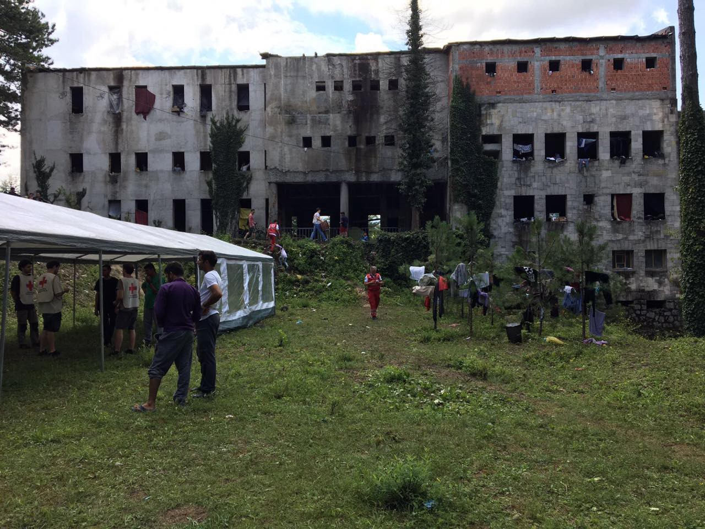
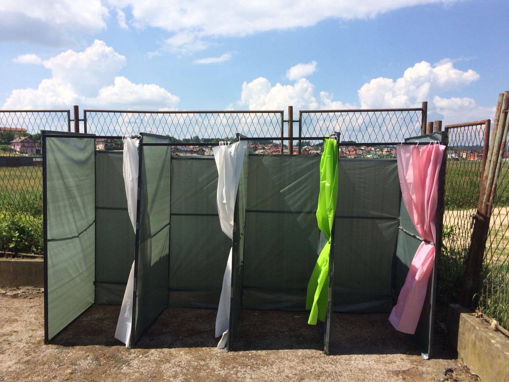
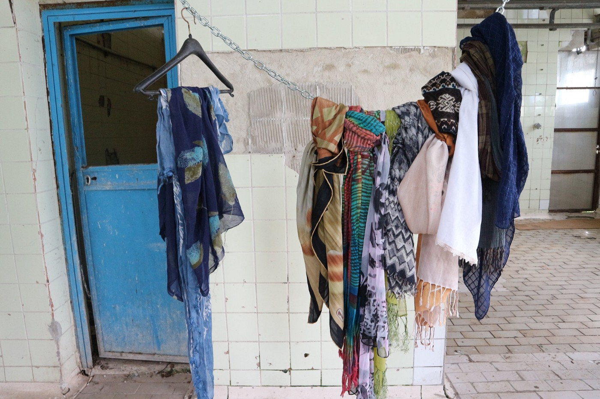
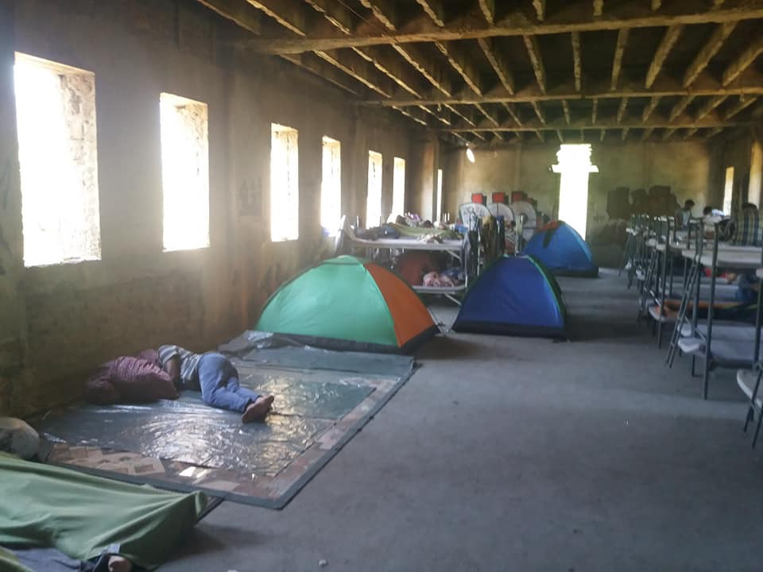
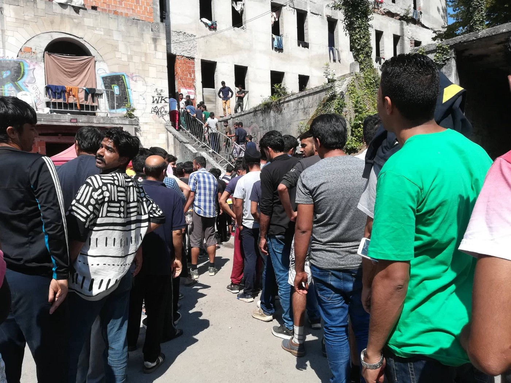
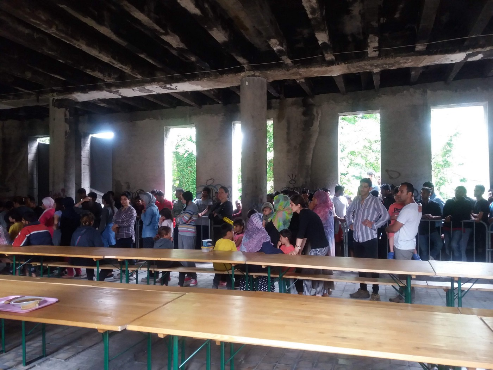

### AYS SPECIAL from Bosnia: “The game” that leads to the European Union

_Lorena Fornasir and Gian Andrea Franchi, Italian activists, went to Velika Kladuša and Bihać for the third time to bring help\. For AYS they write about appalling living conditions, people who were pushed back after being beaten and robbed by the EU police, endless attempts to cross the borders, about children who do not smile…_

Photo by One Bridge to Idomeni, Bihać, Đački dom\.

**_Velika Kladuša, 9 and 10 July 2018_**

This town of over 40,000 inhabitants is more scattered than Bihać and, it seems to us, filled with newer or more repaired buildings\. Few are the houses left with traces of bullets and grenades from the last war in this country \(1992–1995\) \. The streets and clubs are animated until late evening, full of people who seem to live peacefully amidst the mass of refugees in constant movement from one place to another\.

We know that various families welcome children or other groups, participating in a welcoming atmosphere, and there are private initiatives ranging from offering clothing and food to preparing meals\. We also know, however, that the municipal administration prohibits contracts for renting houses or rooms to refugees, thereby restricting possible projects advanced by associations and non\-profit organizations that from time to time appear\.

Along the road that leads us to the center of Kladuša we meet several limping, bruised, upset, dazed young people, who are returning from an unsuccessful attempt to enter Europe\. What they call “the game,” one will win or lose in the “jungle\.” We know that they will try again; otherwise they have no choice but to rot in the camp of earth and mud on the edge of every possible life\.

We soon reach the location of the “showers,” a former slaughterhouse that the talented volunteers have turned into a less degrading but still shabby space\. The horrible hooks hanging from the ceiling are a metaphor for the lives of these migrants hanging on the edge of an almost impossible bet\.

Showers, Kladuša, Photo by No Name Kitchen\.

We find Samyr sitting on a stone, a frozen posture, his back against the plum\-colored wall, his face a grimace of inconsolable despondency\.

_“I’m from Syria, I was tortured, I lost everything\. I walked 10 days to get to Slovenia, the policemen discovered me in the woods, and when I heard their footsteps, I found 4 men without uniforms, but by now it was too late\. Under the t\-shirt they had their police badges\. They handcuffed me and jailed me for 2 days in a container without water and food; because they took my fingerprints I asked for asylum, but they deported me to Croatia, where I was treated in a cruel way and where the police broke my phone and robbed me\. The Croatian police then took me to the border with Bosnia and they told me: go walking, it’s only 5 km to get to Kladuša\. Instead it was 25 km… “\._

His story is similar to that of the countless young men who try the way of the woods\. Not far away, a small group is sitting on the ground between piles of waste and dirt\. They have taken off their shoes, and their feet are full of sores\. Their arms and legs bear the signs of mistreatment and cuts from the scrub of the woods through which they tried to escape\.

Photo by No Name Kitchen

In the late afternoon, the team of “SOS Kladuša” arrives in a small Volkswagen\. Adis and Petra manage the “camp,” finding nails and wood to build the skeleton of the tents made of plastic sheets and many other never\-ending things\. Adis enjoys good recognition, not only by refugees but also by local police, because he is able to maintain a sort of order and organization among hundreds of people\.

Adis and Petra are here to deliver shoes\. While Petra, standing in the trunk of the car, picks up the “coupons” and delivers the shoes that have been “booked,” Adis takes care of the cuts and wounds of the boys who have lost the “game” and return — after deportation from Italy, or from Slovenia that deports to Croatia that deports to Bosnia — bruised, beaten, mistreated, robbed of everything and with cell phones smashed\.

Yasir testifies: _“I was in the hands of the Croats, they took me in the jungle\. They took away the little money I had, they beat me and broke my phone because mine was not good\. If I had a good phone they would have stolen it\. Cell phones are smashed to prevent us from using GPS maps in the forest\. Without GPS we get lost and we are at the mercy of all the dangers, even the people who see us call the police\.”_

Both Adis and Petra collaborate with the volunteers of “No Name Kitchen\.” The two groups have split up their tasks: the Spanish volunteers collect one by one the requests with the name of the refugee and the number of shoes they need, while Adis and Petra procure and then distribute the shoes one or two days later\.

The volunteers of “No Name Kitchen” have also taken on the task of creating and maintaining showers where, every other day, men and women can wash themselves with cold water in front of the former slaughterhouse, in a space organized and divided with plastic sheets in 4 “cabins\.” They also organize the laundry, bringing all the linen into their home, washing it, drying it, and returning it to the next shower\. With all the refugees they maintain empathic relationships: fresh, genuine, sunny as well as professional\. In the evening, when the sun goes down, they do activities with the children of the camp who unfortunately and obviously do not go to school and live in deprivation\.

Photo by No Name Kitchen

They tell us that the most worrying health problem, in addition to allergies, fungi, and the results of the violence committed by the Croatian police, is scabies, which have become endemic\. Being able to have clean socks is a modest but necessary form of prevention, but hard to come by\. For this reason, the following morning we will buy dozens and dozens of socks in addition to underwear and medicine\. We will spend the evening with Adis and Petra buying shoes, especially ones with non\-slip soles for those who decided to face the forest\.

We learn that now in Kladuša, unlike our first trip about 20 days ago, a doctor, Samir, from MSF, comes to the camp 3 times a week\. For the remaining four days, he manages relations with the Kladuša hospital, making it possible to take care of the most important cases\. However, Samir complains about the excessive bureaucracy he must endure as an MSF operator\.

The visit to the camp is always a shock\. Between here and other locations including a nearby hangar, it seems there are between 600 and 800 people, a that fluctuates constantly with those who arrive and those who leave\. Above all there are families, many, too many, with small children, even newborn babies, unable to brave rivers and forests with their young children\.

There are many unaccompanied minors\. In their faces there is a petrified expression\. Some move mechanically, some are nervous; one asks for a sleeping bag because he can no longer stay in this hell and wants to try the “game\.” Everybody asks for umbrellas because here it rains a lot and the plastic sheets leak water on all sides\.

A group of eight Kurdish youth cook chapati in improvised pans over fires\. They want to reach Europe but for now they have only accumulated two years in the camps of Serbia and 3 months of detention in Bulgaria\. Next to them, lying on the ground with a blanket covering him, is the body of a young man who tried to save himself\. Instead, they tell us, the Croatian police captured him and beat him hard with batons on his back, on his legs, on his arms\. Then, of course, they robbed and deported him 30 km from Velika Kladuša\. Now he lies here: helpless, sleeping, avoiding the awakening that will bring him back to reality\.

When we arrive at the camp, the children appear first, running in a disordered manner\. Some come to us with that habit of undifferentiated friendship: asking everything and nothing, attaching themselves to our hands or legs as if they want to get a grip on a body that hooks them to a life they do not have\. Other children, however, do not want to separate from their mothers, look up, or deceive themselves wandering in the dust in search of something that is not there\. Their time is full of an emptiness that becomes tangible in their sometimes absent, sometimes vacuous gaze\. Today a beautiful girl of 6 or 7 years stands out, long black hair gathered with an elastic behind the nape\. She wears a ruby\-colored dress that contrasts with the squalor and dust of the camp\. In her eyes a nameless sadness, on her face no smile\. Seeing a child who does not smile is like looking in the mirror at our civilization that spreads death\.

This much\-desired Europe is actually a state\-inflicted trauma inscribed in the body\.

**_Bihać, 11 July 2018_**

In the so\-called Đački dom, a large, dilapidated building that officially hosts refugees, the Red Cross and, now, organizations such as IOM, Doctors Without Borders and Save the Children, come regularly\. The electricity has recently been restored by the municipality, and the health services, placed in the courtyard, have been improved compared to our previous trip, but they are still inadequate, given the increase in occupants — from 500 to 900 people\. We are reminded that it is the skeleton of a building intended to be a school or youth home, with various rooms inaccessible because they have dangerous large holes on the floor, with doors that look out onto the void, with areas where rotten cement lets water through\. Let’s imagine the rainy autumn and, worse, the winter, in an area where it snows a lot\.

Photo by Dylan Longman, Inside of Đački dom

In our opinion, these very bad conditions do not have much to do with the indifference of local institutions, but with the general poverty of the canton of Bihać\.

Climbing the internal flight of stairs, on the first floor, you realize the danger of the building\. Without a handrail, the staircase is completely exposed\. There are many children playing\. It seems to us that the number of families with children has increased recently: at least thirty, we are told, but there is no precise number\. A child plays hide\-and\-seek in the stairs, leans out dangerously, and we realize that emptiness could swallow him in a flash\. Going down, on the ground floor, we are impressed by a child playing with a tank, going: “Bang, bang\!”

In one of the rooms on the upper floors, we meet two men, who begin talking to us\.

_“We are 18 and 24 years old\. We come from Syria\. We have been in the Balkans for two and a half years, first stuck in a camp in Serbia\. 15 days ago we managed to get to Trieste and we expressed our desire to seek asylum\. The police took our fingerprints, took pictures, held us for a day at the police station\. Then they deported us to Slovenia, who deported us to Croatia\. The Croatian police beat us, stole what little we had, including food, broke our cell phone, took the documents\. They also stirred up the dogs\. Then they deported us to Bosnia and now we are here again, in Bihać\.”_

After telling us their story, the two boys invite us to eat with them a kind of soup that they are preparing on an improvised fire, inside a curtain of smoke\.

The majority of the ‘guests’ of this perilous structure instead eat collectively, at the tables of a large room, food brought by the Red Cross \(a vegetable soup, it seems, with a piece of bread — the past few times we have also seen pieces of meat\) — after having waited in a very long line that lasts at least two hours in the courtyard \(think about when it rains\! \) \.

Food line in Bihać, Photo by Red Cross Bihać

Everything is guarded by two imposing policemen dressed in black\. Some people, however, prefer to cook alone, in other rooms\. “The Red Cross food is not good,” they tell us\. But perhaps they mean that they prefer food more related to their culture: as we have seen in these rounds of hell, they were in fact cooking ‘chapati’\.

Around the Đački dom the park is now occupied by tents, igloo\-like\. We come across a Save the Children stand that tries to engage the children with some play activities\. Here too, as in Kladuša, children appear to us as being without childhood\. A tall and very thin girl, precociously adult, with a serious and composed expression, asks us to take her with us because she wants to reach her mother and her six\-month\-old sister, who are living in Germany\. We try to understand why she is here, but it is not easy\. Her English is broken\.

Too many other children pull us from all sides, poking into our bags, preventing us from keeping focussed\. The girl leads us to a tent to introduce us the man who says is her father \(hoping that he is her “father”\): a man in his forties who does not spill a word\. Perhaps he also knows English, but why should he trust us? Who are we if not intruders who ask questions and take photos — as we are challenged by another boy with a tooth abscess that has tormented him for days? Can we take him to the hospital? Can we help him? “Why do everyone come here, take pictures of us and then leave while we get stuck in this hell? Why do not you open the borders?” he asks us\.

Another friend of this boy, lying on a dirty mattress in a stairwell, looks at us with the eyes of one who do not expect anything\. Two huge cysts, if they are indeed cysts, have invaded his forehead and his eye\. He lies there, helpless, resistant to our contact, in the company of his vulnerability\.

Returning to the girl who asked us to take her with us, we leave her a sleeping bag for the cold of the night and, who knows, to try to save her\.

Like her, many other unaccompanied minors, kids who appear to be 16 years old but are maybe only 14 or 15, wander between the park and the road that leads to the border\. The feeling is that they are carrying a desperate loneliness\.

Photo by Red Cross Bihać

There is no system for registering unaccompanied minors, though it is estimated that at least thirty families with children living in the building called Dom

In addition to the Red Cross, MSF is also present in Bihać, while the IOM manages three family homes\. The Hungarian health association Smilinghelpers, whose talented female nurses — Adrienne Schmidt and Judit Mogyoròs — we met in Victoria Square in Athens, would have also wanted to intervene in Bihać, but for them it was impossible, lacking the authorization to carry out medical activities in Bosnia\. Once a week, the Italian non\-profit organization One Bridge to Idomeni come regularly with help and volunteers\.

**_\(By Lorena Fornasir and Gian Andrea Franchi: We thank all the known and unknown people who have created a supportive community with us, allowing us to bring concrete help to refugees in Bosnia\. [Read the first reportage](ays-special-from-bosnia-can-this-be-real-life-8208bb3002bc) from Bosnia by Lorena and Gian\)_**

> **We strive to echo correct news from the ground through collaboration and fairness\.** 

> **Every effort has been made to credit organizations and individuals with regard to the supply of information, video, and photo material \(in cases where the source wanted to be accredited\) \. Please notify us regarding corrections\.** 

> **If there’s anything you want to share or comment, contact us through Facebook or write to: areyousyrious@gmail\.com** 

_Converted [Medium Post](https://medium.com/are-you-syrious/ays-special-from-bosnia-the-game-that-leads-to-european-union-f6d8bf229d76) by [ZMediumToMarkdown](https://github.com/ZhgChgLi/ZMediumToMarkdown)._
