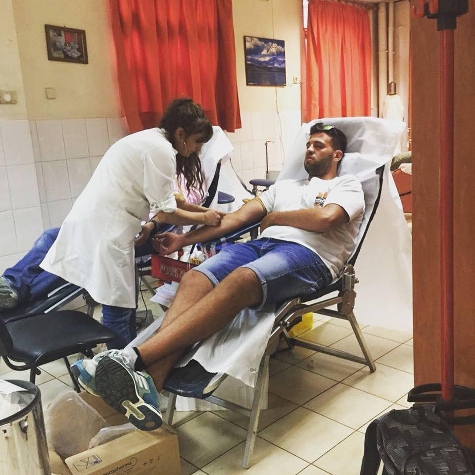
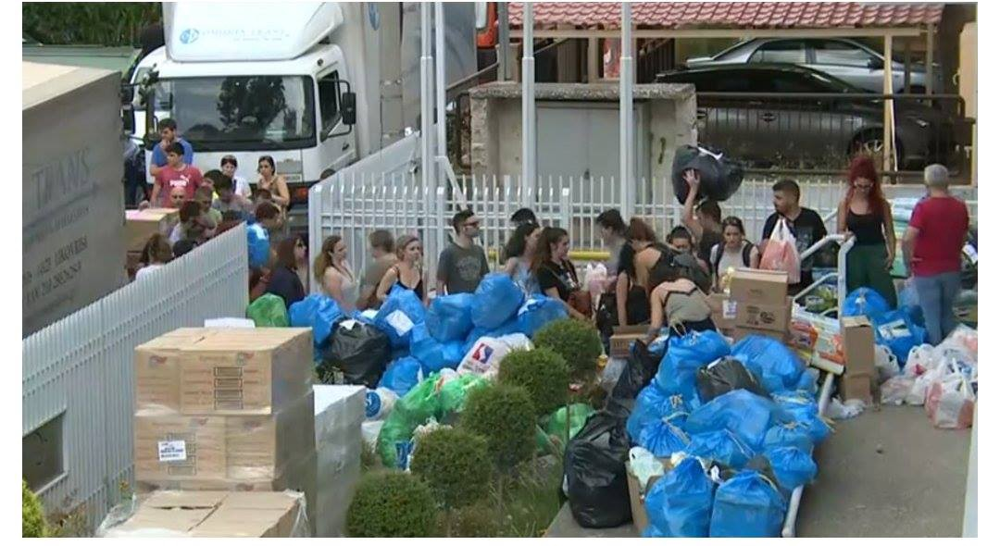
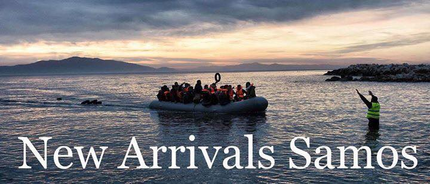
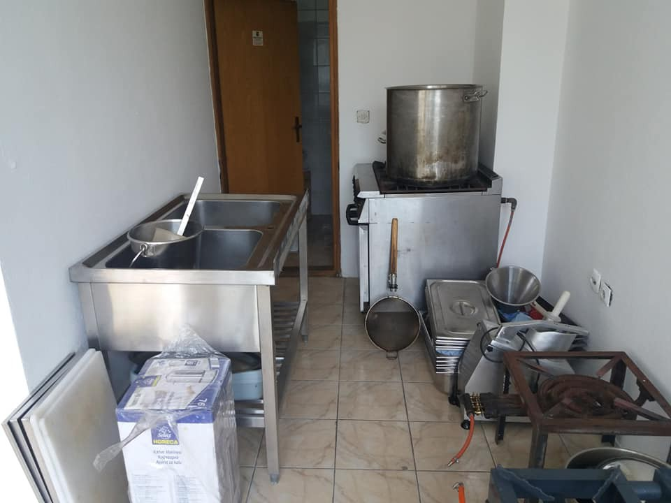
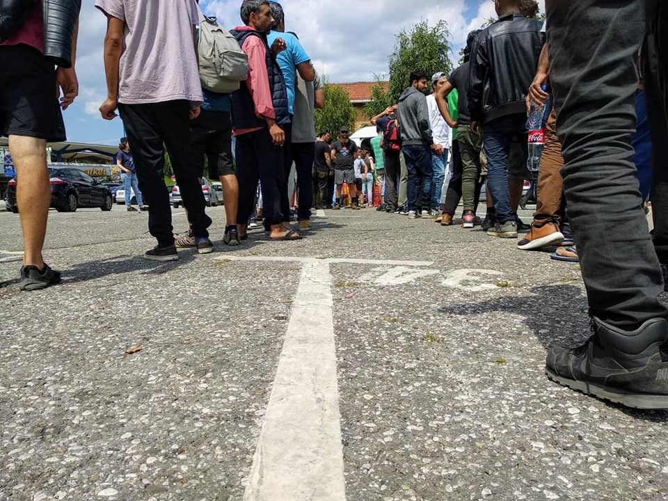
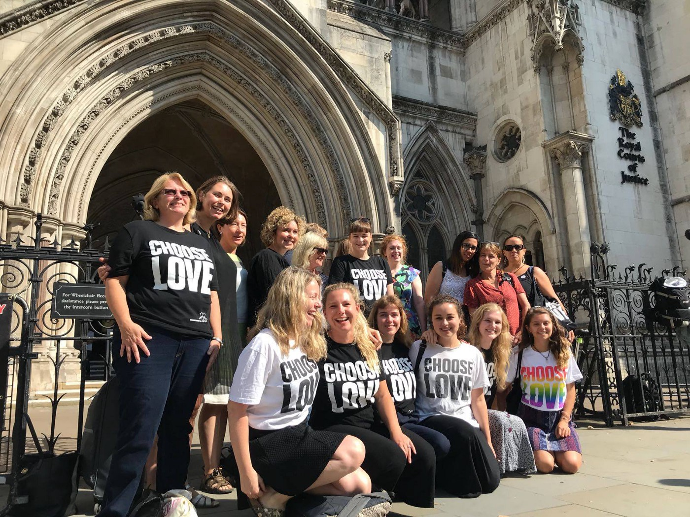

### AYS DAILY DIGEST FOR July 25th, 2018
### AYS DAILY DIGEST 25/7/18: EC moves forward with suggestions on Controlled Centers and external platforms

_Meanwhile, Human Rights Watch said: “Disputes over rescues put lives at risk” // As \#Athensfire continues people organize themselves to help // Attack in Thessaloniki // Sweden will upgrade the UN Child Convention to law, but has to change their migration legislation to include every child // Temporary accommodation for families in Bosnia // Dubs amendment discussed in court // And more news…_

](assets/e9d5fe49f0a8/1*fnFyQvrOu-hWQKi7NGy5zw.jpeg)

Photo: Osvaldo Gutierrez Gomez, via [Art Against](https://www.facebook.com/artagainstproject/photos/a.639651369417634.1073741828.639605726088865/1791107534272006/?type=3&theater&ifg=1)
#### FEATURE

_Disputes over rescues put lives at risk_ , [Human Rights Watch](https://www.hrw.org/news/2018/07/25/eu/italy/libya-disputes-over-rescues-put-lives-risk) said today in a [report](https://www.hrw.org/news/2018/07/25/eu/italy/libya-disputes-over-rescues-put-lives-risk) with the same title\. Instead of continuing fighting over sea rescues and those performing them, the European leaders should focus on joint solutions where people’s best interests are the focus\.

One thing HRW pointed out was the fact that **it is inhuman to return people disembarked at sea to Libya** \.

Regardless of this, the European Commission yesterday said that they will move forward with the plans on _Controlled Centers_ and _Regional Disembarkation Arrangements_ \(also called _platforms_ \) for people trying to enter Europe\. The “centers” will be located in Europe and the “platforms” in North Africa\. In the press release, it says that the purpose of the centers in the EU is _to improve the orderly and effective processing of those disembarked in the European Union\._ The potential centers will be managed by the host Member State with the full support of the European Union and its agencies\.

Another suggestion in the press release was to offer the EU Member States accepting migrants disembarked **6000 euro per person** \.

■■■■■■■■■■■■■■ 
> **[InfoMigrants](https://twitter.com/InfoMigrants) @ Twitter Says:** 

> > The #EU will offer 6000 Euros per #migrant to any member state willing to take them in.

[bit.ly/2LjwCoQ](https://bit.ly/2LjwCoQ) https://t.co/DSNpwkqJAg 

> **Tweeted at [2018-07-25 08:20:50](https://twitter.com/infomigrants/status/1022033925357625349).** 

■■■■■■■■■■■■■■ 

Furthermore, the _Regional Disembarkation Arrangements_ \( _platforms_ \) will, according to [the EC](http://europa.eu/rapid/press-release_IP-18-4629_en.htm) , be arranged in _partnership in an equal footing_ , with interested third countries\. The EU will support and assist, and the work at these disembarkation locations will be carried out with _full respect of international law and human rights_ \. This arrangements, first suggested by the UNHCR and IOM, are being discussed seemingly without any reflection over the fact that no north African nation has agreed on hosting them\. [Tunisia turned it down](https://euobserver.com/migration/142453) , and with Libya excluded from the program, Morocco, Algeria, and Egypt are the potential candidates\.

How this will be done in reality, the EC still has not explained further\. But, the centers will [_be established as far away as possible from points of irregular departure_](http://europa.eu/rapid/press-release_IP-18-4629_en.htm) _\._

Back on [6 July UNHCR](http://www.unhcr.org/news/briefing/2018/7/5b3f270a4/mediterranean-sea-arrivals-decline-death-rates-rise-unhcr-calls-strengthening.html) called for a _collaborative, regional approach_ with _clear and practical guidelines_ after explaining that while the number of asylum seekers and migrants reaching Europe had decreased that the chances of dying while trying to do so had increased\. 1 in 7 people died during the attempt to cross the Mediterranean in June 2018 compared to 1 in 38 in the first half of 2017\.

The NGO vessel [Proactiva Open Arms](https://www.diariodemallorca.es/mallorca/2018/07/22/desembarco-denuncia-open-arms-homicidio/1333054.html) docked in Palma de Mallorca this week, with one rescued woman and two corpses on board — one, that of a woman and the other of a four\-year\-old boy\. They were found off the Libyan coast face down on floating wreckage\. Proactiva have accused the Libyan coastguard of failing to render aid\. As for now, with an increasing death toll following [the disputes at sea](https://www.hrw.org/news/2018/07/25/eu/italy/libya-disputes-over-rescues-put-lives-risk) as HRW said, Proactiva is the only ship, besides EU:s Operation Sophia, patrolling the international water outside of Libya\.

■■■■■■■■■■■■■■ 
> **[Open Arms](https://twitter.com/openarms_fund) @ Twitter Says:** 

> > 🔴#ULTIMAHORA Denunciamos omisión de socorro en aguas internacionales y abandono de una persona con vida y los cadaveres de un niño y una mujer por los supuestos Guardacostas Libios, a los que Italia legitima y pone al frente. Cada muerte es consecuencia directa de esa política. https://t.co/2IsxyDHazn 

> **Tweeted at [2018-07-17 11:36:51](https://twitter.com/openarms_fund/status/1019184149599604737).** 

■■■■■■■■■■■■■■ 

According to an [article by Elizabeth Collett \(](https://www.migrationpolicy.org/news/europe-pushes-outsource-asylum-again) Director of Migration Policy Institute Europe and Senior Advisor to MPI’s Transatlantic Council on Migration\) [and Susan Fratzke](https://www.migrationpolicy.org/news/europe-pushes-outsource-asylum-again) \(Policy Analyst and Program Coordinator at MPI\), writing for The Migration Policy Institute, the policies being suggested are a form of outsourcing and write that _…\[European\] leaders also hope that by reducing inflows to the European Union, they will face less pressure to compromise on sharing responsibility for asylum within the bloc\._

[According to Statewatch](http://www.statewatch.org/news/2018/jul/eu-com-disembarkation-and-controlled-centres-prel.pdf) the suggestions will be discussed further at the following meeting to be held in Geneva on 30 July with IOM and UNHCR, after which contact will be made with interested third countries\.

#### EU

Several NGOs working in the Mediterranean signed [this open letter](https://www.facebook.com/seawatchprojekt/posts/2075777482640322?hc_location=ufi) addressed to Sebastian Kurz, Austrias PM and holder of the EU presidency\.
#### SEA

[SOS Mediterranee France reports](https://twitter.com/SOSMedFrance/status/1022121647963291648) that 40 people are still waiting to disembark in a safe place after being rescued off the Tunisian coast almost two weeks ago\. According to [Watch the Med Alarm Phone on twitter](https://twitter.com/alarm_phone/status/1022132833740054528) the vessel is in the Search and Rescue Zone of Malta which has failed to act\. The incidents of today is a great example of the topic featured above\.

■■■■■■■■■■■■■■ 
> **[Alarm Phone](https://twitter.com/alarm_phone) @ Twitter Says:** 

> > We would like to remind UNHCR’s Mr. @Cochetel that when a state coordinating a rescue in its SAR zone fails to find a safe harbour for the ppl in need, that state should provide for their disembarkation in its own territory. @[soniarolley](https://twitter.com/soniarolley) @[chrjkb](https://twitter.com/chrjkb) @[RadioRadicale](https://twitter.com/RadioRadicale) 

> **Tweeted at [2018-07-25 14:53:52](https://twitter.com/alarm_phone/status/1022132833740054528).** 

■■■■■■■■■■■■■■ 

Meanwhile the [Spanish coastguard reports](https://twitter.com/salvamentogob/status/1022221426076594176) rescuing 25 people on a small boat near Cabo de Gata\. Those rescued have been taken to Almeria\. This came only three hours after [coastguard reports](https://twitter.com/salvamentogob/status/1022184024406740992) stated that 399 people on 29 small boats had been assisted in the same region and taken to Algeciras and Barbate\.
#### GREECE
#### Update on the fires

As [featured in yesterdays digest](ays-daily-digest-24-07-18-wildfires-and-solidarity-in-greece-235e72458d2a) , the fires in Greece has caused a terrible damage and our thoughts are with the people affected in different ways\. In response to the fire, Greek Forum of Refugees released [this map](https://www.google.com/maps/d/viewer?mid=1WxCQUoC9IBeDrg57oZ5Yzf1ygNY5XXE6&ll=37.91375460957635%2C23.575261299999966&z=9) with donation sites\.

People, living as refugees in Athens, are giving blood at Athens hospital to donate for people who have been injured in the fire\.

](assets/e9d5fe49f0a8/1*vauGyhpIx_XAZJgAEeEpuQ.jpeg)

Photo: [FOTOMOVIMIENTO 15M](https://www.facebook.com/Fotomovimiento.org/?hc_ref=ARSLznV7DKgaZTMfGx-cTmi_ZghxchHweUqm6mHeoCNh5BMF8to_T0IT_hA0K67-JEw&fref=nf)

[NoBorders](https://www.facebook.com/nobordersnetwork/?hc_ref=ARR6emPi8FWJp3n6E3IrNLptiJPNBIGJhzR4JpuOY7I4jdQzktjjCih9Uggqs4PTKDI) also updated:

[_Leftist and anarchist groups_](https://www.facebook.com/…/a.66078742398…/1841890149212202/…) _, squats and social centers, practice extended solidarity actions by gathering clothes, medicines and food for the victims of the [\#AthensFires](https://www.facebook.com/hashtag/athensfires) all over [\#Greece](https://www.facebook.com/hashtag/greece) [\#Solidarity](https://www.facebook.com/hashtag/solidarity) has become our weapon\!_

People coming together and bringing donations for the people suffering from the fires\. Photo: No Borders
#### Attack in Thessaloniki

There were a racist attack in the early morningat Navarinou Square, in the center of Thessaloniki\. Four people including the three immigrants, were attacked by a group of 15 people\.

The fascists was wearing helmets during the attack and one of the attackers was holding a knife\. A witness told that the perpetrators were shouting “leave and go back to your country”, and continued by beating anyone who was in front of them\.

A 28\-year\-old Algerian was stabbed on the leg, while a 33\-year\-old Greek on the square suffers multiple head and body beatings\. The incident is currently being investigated by the authorities\. According to the police, this is a clear case of robbery since a group of people attacked the three with a knife threat, injured one and grabbed a cell phone and money\. The injured person was transferred to AHEPA hospital\.

](assets/e9d5fe49f0a8/1*RnCAZ1B4dOgqOOqc9VCddQ.jpeg)

This morning in Thessaloniki, after the facist attack\. Photo: [Χώρος Στέγασης Προσφύγων City Plaza](https://www.facebook.com/cityplazaathens/?hc_ref=ARTuP8NqBo2M7yP7BZjoY313_zXoV1MkUMPALdUoPinef3FqFp0eM5VZFv65HplLX34&fref=nf)
#### Islands
#### Population on the Greek islands

Over 16,000 refugees and migrants reside on the Aegean islands\. In line with the recent arrival trends, the majority of the population on the Aegean islands are from Syria \(30 percent\), Iraq \(24 percent\) and Afghanistan \(16 percent\) \. Of them, 21 percent are women and 31 percent children\. Of the kids, almost seven out of 10 are younger than 12 years old\. Unaccompanied minors counts for 13 percent of the children, and they are mainly from Afghanistan and Syria\. 43 percent of the arrivals are men between 18 and 39 years old\.

This week, 668 people reached the Aegean islands\. The majority arrived to Lesvos and the average daily arrivals on all islands was 95 people\.
#### Samos

One boat arrived this morning, carrying 9 people, of whom 4 children, 2 women and 3 men, according an update from [Aegean Boat Report](https://www.facebook.com/AegeanBoatReport/?hc_ref=ARRbG_wvmvUATBtUAHG7tkq0p1EGRpyPkqbvz4QS0pxsVPzo2wvzvL7wJgUjquYzvNM&fref=nf) \.
#### Chios

One boat picked up outside Chios this morning, with 30 people onboard\. It was 2 children, 7 women and 21 men\.

](assets/e9d5fe49f0a8/1*45ZPbsDUH8wXNeKjlanRPw.jpeg)

Photo and info: [Aegean Boat Report](https://www.facebook.com/AegeanBoatReport/?hc_ref=ARRbG_wvmvUATBtUAHG7tkq0p1EGRpyPkqbvz4QS0pxsVPzo2wvzvL7wJgUjquYzvNM&fref=nf)
#### SERBIA

In Serbia, 3529 people were counted on the 22nd of July\. Of those 400 people were seen outside of the official centers, 150 in Belgrade city center and another 150 in the border areas with Hungary and Croatia\. In Loznica, the border city close to Bosnia and Herzegovina, another 100 people were observed\.

The most common route to Serbia is from Macedonia\. The new arrivals are from Pakistan \(39 percent\), followed by Afghanistan \(29 percent\), Iran \(10 percent\), and Iraq \(5 percent\), and 17 percent from Bangladesh, Libya, India, and other countries together\. Authorities in Hungary resumed admitting asylum seekers from Serbia into their “transit zones”\. Compared to the two preceding weeks when only three people were allowed to enter, they admitted 20 people this period of two weeks\.

Additionally, the UNHCR and its partners collected reports about 266 collective and illegal push\-backs\. Of them, 124 people were returned from Croatia \(up from 113 the previous period\), followed by 88 from BiH \(down from 296\), 28 from Romania \(up from 11\) and 26 from Hungary \(up from 11\) \.

More than 50 percent of the people encountered after being expelled back into Serbia, said that they were denied access to asylum procedures by the neighboring countries authorities\.
#### BOSNIA
#### Update from Velika Kladuša and Bihać area

According to the Ministry of security, over 9000 people on the run entered Bosnia this year\. It is not know how many people left the country\.

On Wednesday, around 100 families were moved from outside areas in both cities to hotel Sedra, Cazin, town in between Bihać and Kladuša\. This old hotel, turned into temporary reception center, will accept about 300 people, only families, and will be open until the end of October\.

Hotel will be put on sale at the end of August, due to the debts made by the management\. Debts are made toward suppliers, but also workers\. So far it is not clear how the IOM, that is responsible for the center, will deal with this situation or why they accepted to pay the space that will be sold soon and that is private property\. [Local media](https://www.fokus.ba/vijesti/bih/migranti-u-sedru-sedra-na-prodaju/1172196/) are reporting that the IOM paid to the current management 35\.000 euro per month\.

No media, [local media are reporting](https://www.youtube.com/watch?v=RgwMOauSqms) , were allowed to enter the premises of the hotel\. From what is known so far, water in this hotel is not for use, and showers and other facilities are set up outside\.
### Sarajevo

In Sarajevo, volunteers and refugees are currently setting up a new and bigger kitchen to meet the needs on the streets due to the growing number of people who are arriving every day\.

The street food\-team in Sarajevo has organized themselves under a new name and group: AidBrigade\. Find them here on facebook for more information about what is going on at the streets of Sarajevo\.

Funds are also needed\. If you can support, follow [this link](http://Paypal.me/aidbrigade) \.

A new, bigger, kitchen is being built, and the growing food line in Sarajevo\. Photo: Dylan Longman
#### Bosanska Gradiška

[28 people were](https://www.facebook.com/infoparkserbia/photos/pcb.1738972942823629/1738969729490617/?type=3&theater) discovered in the town of Bosanska Gradiška in Bosnia after crossing from Serbia\. According to volunteers in Sarajevo, every day new people are arriving, and very often it is more than 100 people daily only in the capital\. At the same time, many people are arriving to other cities and heading toward border area\. Many people are coming from the direction of Serbia, where number of people who are arriving also increases\.
#### UK

[The appeal for the Dubs amendment began today](https://www.facebook.com/111893659171316/posts/663954327298577/) , Help Refugees updated about\. They were there and asks for support, as pressure from the public has been essential so far in pushing the Dubs amendment forward\. After the eviction of the Jungle, it was the support from the people that forced the government to start transferring children to safety\. The decision to increase the number of Dubs\-children to 480 was also a cause of public pressure\. Even though, that is not nearly enough\. The appeal today was a try make a difference for even more children in Europe\. As of today, only 250 out of the 480 places has been filled by the government\. Hopefully, this shameful way of refusing [230 children](https://www.facebook.com/HelpRefugeesUK/photos/a.123267671367248.1073741830.111893659171316/664166373944039/?type=3&theater) stuck in Europe protection, will not become reality\.

At first, the number suggested by Lord Dubs was 3000\. After the government asked local authorities about their capacity and how many children they could grant protection to, the number was reduced to 350, and then again increased to 480\.

[Help Refugees](https://www.facebook.com/HelpRefugeesUK/photos/a.123267671367248.1073741830.111893659171316/664166373944039/?type=3&theater) will be there during the hearing tomorrow as well, and they need people’s support by spreading the message that the Home Office calculations of places are wrong\. In Scotland and Wales for example, the local authorities claimed they only had capacity for six children each\.

](assets/e9d5fe49f0a8/1*_GR_BHJMXr1dGmMzR7CZ8A.jpeg)

Lord Dubs was in the court today as well\. Photo: [Help Refugees](https://www.facebook.com/HelpRefugeesUK/?hc_ref=ARRiCwbIHoX-4EugNRKlFqn2XHW2SUY0-2mzC4kHC0u4uub23P5ov-J65TKyp1cuLd4&fref=nf)
#### SWEDEN

[UN Convention on the Rights of the Child \(CRC\) will become Swedish law 2020](http://The appeal for the Dubs amendment began today, Help Refugees updated about. They were there and asks for support, as pressure from the public has been essential so far in pushing the Dubs amendment forward. After the eviction of the Jungle, it was the support from the people that forced the government to start transferring children to safety. The decision to increase the number of Dubs-children to 480 was also a cause of public pressure. Even though, that is not nearly enough. The appeal today was a try make a difference for even more children in Europe. As of today, only 250 out of the 480 places has been filled by the government. Hopefully, this shameful way of refusing 230 children stuck in Europe protection, will not become reality.   At first, the number suggested by Lord Dubs was 3000. After the government asked local authorities about their capacity and how many children they could grant protection to, the number was reduced to 350, and then again increased to 480.) \. It has to include all children, according to The legal counsel for children in migration \(Rättsrådet för barn och unga i migration\) \. It is a lot of things to change before the implementation, considering protecting the rights not only for Swedish children but also those coming to Sweden in order to seek asylum\.

The legal counsel for children in migration \(they don’t seem to have an English name so I just translated it straight from Swedish\. \. \) claim that it is not possible to secure a proper implementation of the child convention into a law since it is in direct conflict with the current migration laws\. The demand following measures:

> 1\. Strengthen children’s perspective of the alien act\. Children’s role and perspective has to be taken into greater consideration during the asylum process 

> 2\. Let the children’s voices be heard during the asylum process\. Children are not asked about their own reasons for being granted asylum, it is based on the protection needs of the parents 

> 3\. Stop with the criticised age exams\. They are not reliable enough and cannot be motivated\. 

> 4\. Make sure that the rights provided also includes paperless children\. It is an extremely vulnerable group and therefore guidelines on how to meet their rights must be included as they are written in the UN Child Convention\. This must be done both on a national and local level within the municipalities\. 

> 5\. The time\-limited migration law has to end\. It has very negative consequences for children in need of safety and stability\. It also eliminated the right to family reunification and other things that are documented having a negative impact on a child’s mental and physical well\-being\. 

It is the Swedish politicians and the Migration Agency’s obligation to meet these five demands in order to make sure that the child convention includes every child\.

> **We strive to echo correct news from the ground through collaboration and fairness\.** 

> **Every effort has been made to credit organizations and individuals with regard to the supply of information, video, and photo material \(in cases where the source wanted to be accredited\) \. Please notify us regarding corrections\.** 

> **If there’s anything you want to share or comment, contact us through Facebook or write to: areyousyrious@gmail\.com** 

_Converted [Medium Post](https://medium.com/are-you-syrious/ays-daily-digest-for-july-25th-2018-e9d5fe49f0a8) by [ZMediumToMarkdown](https://github.com/ZhgChgLi/ZMediumToMarkdown)._
