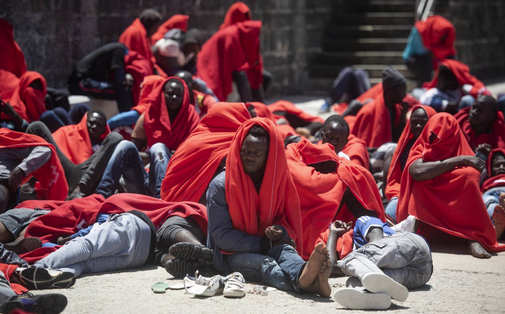

### AYS Daily Digest 26/07/18: Spain with the largest number of new arrivals in 2018, police clashes at North African enclave

_The reason for Libyan Coast Guard’s increase in captures / Videos of pregnant women on board Sarost 5 / Turkish political activist Turgut Kaya recognized as a refugee / Activists in UK want country to accept unaccompanied minors / And more news…_

People resting after being rescued in Tarifa \(Photo by Marcos Morino\)
### FEATURE

[According to IOM](https://elpais.com/politica/2018/07/25/actualidad/1532540111_456403.html?id_externo_rsoc=FB_CC) , Spain has surpassed Italy and Greece as having the largest number of new arrivals in 2018: 22,711 people so far\.

[The Strait of Gibraltar](https://elpais.com/politica/2018/07/25/actualidad/1532540111_456403.html?id_externo_rsoc=FB_CC) has seen much higher numbers of new arrivals since the summer and approximately 1,300 people have come through the route in the past three days alone\. New arrivals have reached more than double the amount of people who had come by this time last year\. The number of deaths in the Mediterranean has also doubled for people trying to reach Spain\. There have been reported collapses in the reception services in the bay of Algeciras and other municipalities in the Andalusian coast\. People are roaming on the streets of these small towns because they have no where they can go\. Some are not identified even after they are detained at the police station\. The government’s infrastructure in the strait is significantly under prepared\.

Due to this high tension setting, there have been clashes between police and refugees in [Spain’s North African enclave of Ceuta](https://www.cbsnews.com/news/migrants-ceuta-border-spain-europe-migration-crisis-shifts-spanish-borders/) , with people jumping over the border fence\. It was reported Thursday morning that 132 people and 22 police officers were in need of medical assistance\. The people jumping the fence used homemade blowtorches for defence, which resulted in many injuries\. [The Spanish](https://elpais.com/elpais/2018/07/26/inenglish/1532595385_902317.html) are calling it “one of the largest and most violent border crossings in recent years\.” Given that since 2015, Spain has not received as much attention as Greece and Italy, how will Spain handle this recent shift in migratory routes?
### **LIBYA**

A Research Fellow at the European University Institute has recently laid out why there has been a marked decrease in departures of people to Italy\. The main finding is that [the Italian government](https://twitter.com/formicasara/status/1022151868485652485) has given economic and political support to the Libyan authorities, which legitimizes smugglers and Libyan militias in order to keep people away\. [The Libyan Coast Guard](https://twitter.com/formicasara/status/1022158300455034880) only intercepted 8% of boats trying to reach Italy in 2016, but this had climbed to 46% in 2017\.

[MSF, in a statement](http://www.medicisenzafrontiere.it/notizie/news/fermare-la-detenzione-arbitraria-di-rifugiati-e-migranti-sbarcati-libia?codiceCausale=1026&codiceCampagna=18.ZZW.SP.1.SOCTW) on Wednesday, called for a stop to the arbitrary detention in Libya of all refugees, asylum seekers, and migrants since the increase of captures by the Libyan Coast Guard\. Karline Kleijer, MSF Emergency Manager, explains further, “Many of them have already suffered terrible levels of violence and exploitation in Libya and during the exhausting journeys from their countries of origin\. There are victims of sexual violence, trafficking, torture, and mistreatment\. Among the vulnerable are children, sometimes without a parent or carer, pregnant or breastfeeding women , elderly, people with mental disabilities or in serious medical conditions… Libya can not be considered an acceptable solution to prevent arrivals in Europe\.”
### **SEA**

It has been [two weeks](https://www.facebook.com/watchthemed.alarmphone/photos/a.1526182797655958.1073741828.1525906057683632/2171095159831382/?type=3&theater) and the government of Malta is still stalling to accept the people aboard the supply vessel Sarost 5\. The Tunisian Red Crescent, upon visiting the vessel, reported that two pregnant women are in desperate need of medical attention, without which they might lose their babies\. Two videos have surfaced of two pregnant women on board begging the authorities to help\. [One of the women](https://www.facebook.com/watchthemed.alarmphone/videos/2171323569808541/) , from Ghana, talks about how no one wants them and [the other](https://www.facebook.com/watchthemed.alarmphone/videos/2171391076468457/) says she cannot take any medicine because there isn’t any proper food she can take it with to help prevent her from getting even more sick\. Malta cannot afford to take any more time, these people need to be accepted on shore now\.

Also, as [Watch the Med](https://www.facebook.com/watchthemed.alarmphone/photos/a.1526182797655958.1073741828.1525906057683632/2171504153123816/?type=3&theater) reports, there seems to be misinformation given from UNHCR on whether or not they were on Sarost 5 attending to people\. Multiple sources on the boat have denied UNHCR’s statement that they were even there to report that the “majority of persons were not interested in seeking asylum\.” UNHCR needs to explain themselves\.

[Salvamento Maritimo](https://twitter.com/salvamentogob/status/1022548522757967872) by 8:30pm on Thursday had rescued 314 persons from 27 boats who were later transferred to Barbate, Tarifa, and Algeciras\. Near the M\. Zambrano maintains, 218 people were rescued in the Alboran Sea\. Lastly, 100 people in two boats were rescued near Mamasto and were transferred to Almeria\.

[300 people](https://twitter.com/HelenaMaleno/status/1022251143693586435) were also rescued by the Moroccan police on Wednesday\. They are being taken by bus to the south of the country\.

[Proactiva Open Arms](https://www.facebook.com/proactivaservice/videos/1988768781153963/) is back in the rescue zone with the message: “We won’t give up\.”

[Aegean Boat Report](https://www.facebook.com/AegeanBoatReport/videos/407247249798385/) \(ABR\) states that a boat was stopped by the Turkish Coast Guard \(TCG\) at sea near Kusadasi, Aydin Province, in Turkey\. There were 24 people aboard: 10 children, five women, and nine men\. They also describe some last four boats trying to reach the Greek islands being stopped by the TCG with 123 people total: 43 children, 32 women, and 48 men\.

[ABR](https://www.facebook.com/AegeanBoatReport/photos/a.285312485325196.1073741828.285298881993223/407398299783280/?type=3&theater) also reports that a boat was picked up outside of the Lesvos airport very early in the morning on Friday\. They didn’t have a number breakdown yet\.
### **GREECE**

[47 people](https://twitter.com/RefugeeRescueUK/status/1022378422184497152) arrived on Lesvos early on Thursday\. The group included 18 children, six of which were unaccompanied minors\. While [the majority](https://twitter.com/LighthouseRR/status/1022365507658412033) of people were from Afghanistan, the rest were from Mali, Guinea, Senegal, Burkina Faso, and Togo\.

The Turkish political activist [Turgut Kaya](https://twitter.com/rspaegean/status/1022097390482989056) has ended his hunger strike\. He is officially a recognized refugee, but remains in detention\. RSA is calling for his immediate release in protection of his human rights\.

](assets/b444782d13ff/1*3xijZsO-RmWaGmdZqaYnHA.jpeg)

Photo by [RSA](https://twitter.com/rspaegean/status/1022097390482989056)

The Greek Forum for refugees has posted a list of 128 job advertisements which refugees might benefit from\. Find it [here\.](https://www.facebook.com/Greekforumofrefugees/posts/2026422777392518)

Movement on the Ground on Lesvos is looking for more volunteers, especially English teachers\. Find out more [here](https://www.facebook.com/movementontheground/posts/1146574678852176) \.
### BOSNIA & HERZEGOVINA

 \)](assets/b444782d13ff/1*ffXAnYxuzrl8x6-vyQA0nQ.jpeg)

A little girl comforts her father after they lose their belongings to the latest downpour of rain\. Lack of protection has devastating consequences\. \(Photo by [Gabriel Tizón](https://twitter.com/GabrielTizonf1) \)
### **AUSTRIA**

A petition was signed by various Austrian NGOs calling on the Presidency to protect asylum rights and accessibility\. They encourage the Austrian President to help integrate a common European asylum system and prevent future fatalities in people trying to seek asylum\. Read the letter in its entirety [here](https://twitter.com/teammareliberum/status/1022361372284383232) \.
### **GERMANY**

Many [people](https://www.facebook.com/paul.scho.5/posts/2085050251569429) today protested at a film university concerning the visit of Markus Söder \(CSU, minister president of Bavaria\), who is in support of criminalizing rescue missions and the current EU policy in the Mediterranean\. They wore life rescue jackets and laid wet on the ground motionless\.

](assets/b444782d13ff/1*LMuvbNSTujMrtM03hjbz6A.jpeg)

Photo by [Paul Scholten](https://www.facebook.com/paul.scho.5?hc_ref=ARSO-XIOWvE8rJ9IFLPXop7KLl_l4xe1M1IcqOXjU2X6WvjziYDPV9Y94WCwnF9X8zw&hc_location=group)
### **SWEDEN**

[The Global Detention Project](https://reliefweb.int/sites/reliefweb.int/files/resources/GDP-Immigration-Detention-in-Sweden-2018-1.pdf) published a country report on Sweden entitled “Increasing Restrictions and Deportations, Growing Civil Society Resistance\.” The major finding included that immigration detainees increased from 3,200 in 2014 to 4,400 in 2017 and that since 2015 the country’s detention capacity increased by 40%\. Sweden continues to detain children and limit their health care services\.

[Märsta detention center](https://reliefweb.int/sites/reliefweb.int/files/resources/GDP-Immigration-Detention-in-Sweden-2018-1.pdf) is Sweden’s largest detention facility\. It increased from 75 persons in 2017 to 126 persons in 2018 and will increase again in the summer of 2018 to 150 people in detention\.
### **UK**

[With the wildfires](https://www.refinery29.uk/2018/07/205350/help-refugees-dubs-amendment-greece) that spread through Greece, near Athens, on Monday, Josie Naughton of Help Refugees states that it’s of great concern that we don’t know how many refugee children might have been harmed\. She and her team were at the Royal Courts of Justice on Wednesday and Thursday to appeal the closure of the Dubs Amendment, which promised to bring unaccompanied refugee minors to the UK\.

The government still hasn’t filled the promised 480 spots and the discussion on Thursday was [adjourned](https://www.facebook.com/HelpRefugeesUK/photos/a.123267671367248.1073741830.111893659171316/665339100493433/?type=3&theater) \. The time to act is now\.

](assets/b444782d13ff/1*APPkfFJtoZDXiNH6RFTMnw.jpeg)

Photo by [Help Refugees](https://www.facebook.com/HelpRefugeesUK/photos/a.123267671367248.1073741830.111893659171316/665339100493433/?type=3&theater)

**We strive to echo correct news from the ground through collaboration and fairness\.**

**Every effort has been made to credit organizations and individuals with regard to the supply of information, video, and photo material \(in cases where the source wanted to be accredited\) \. Please notify us regarding corrections\.**

**If there’s anything you want to share or comment, contact us through Facebook or write to: areyousyrious@gmail\.com**

_Converted [Medium Post](https://medium.com/are-you-syrious/26-7-18-spain-with-the-largest-number-of-new-arrivals-in-2018-police-clashes-at-north-african-b444782d13ff) by [ZMediumToMarkdown](https://github.com/ZhgChgLi/ZMediumToMarkdown)._
