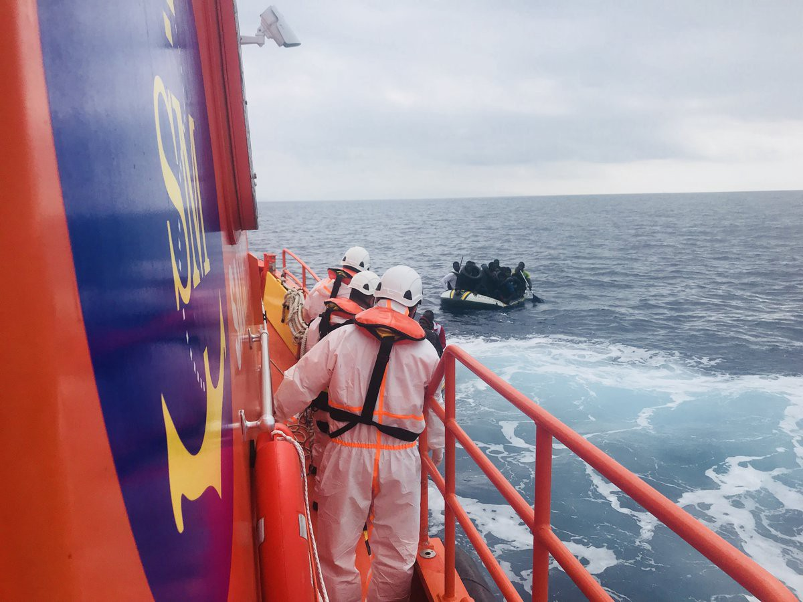
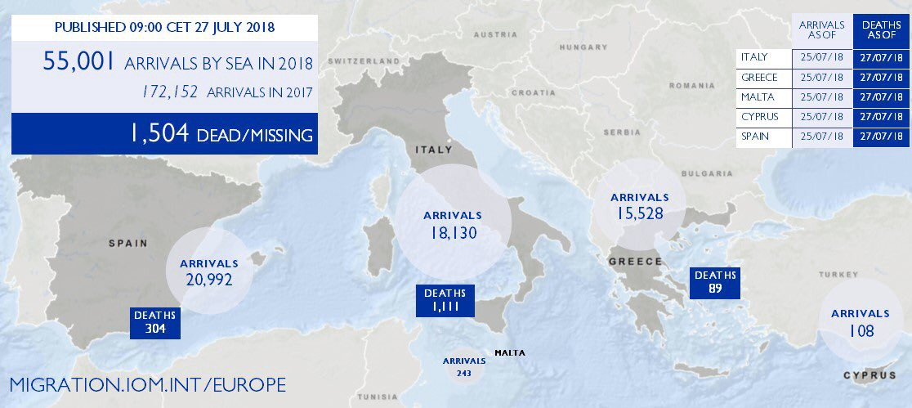
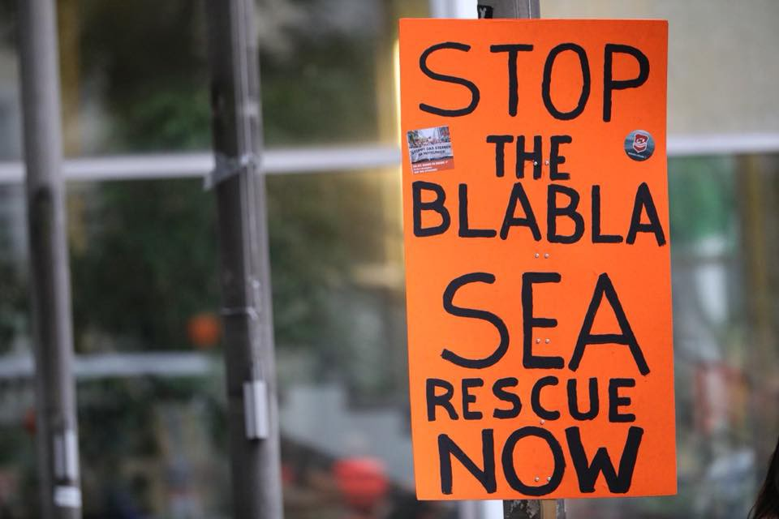
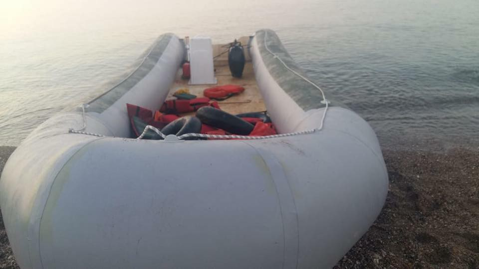

### AYS DAILY DIGEST 27/07/2018: Spain overtakes Italy as main point of entry

_Spain has registered nearly 21,000 refugees so far this year//Route from Libya to Italy claims the lives of one in 19 people//The Sarost 5 is still stranded in the Mediterranean//Human Rights Watch reports on inhuman conditions in reception centres at the land border between Greece and Turkey//_

Photo by Salvamento Maritimo
### Feature

IOM says that so far this year, 55,000 people have arrived by sea, while 1,504 died or went missing during the crossing\. With far fewer people using the route from Libya to Italy, Spain has become the first port of entry\. Spain has registered nearly 21,000 refugees so far this year, almost more than in the whole of last year according to the IOM\.

Meanwhile, arrivals in Italy have dropped by 80% to 18,130\. Since May 1, 7,198 people including 428 children have been returned to Libya, an increase of 6% compared to the same period last year, despite overcrowded detention centres and torture and violence in these centres\.

The route from Libya to Italy has also become more deadly, claiming the lives of one in 19 people, as Europe and Italy are criminalising rescue organisations on the Central Mediterranean route\. IOM spokesman Joel Millman says “despite incredibly low numbers arriving to Italy, the per capita death or the rate of death per 1,000 people may be at its highest point since the emergency began”\.

The death rate could increase even further as now merchant ships are also incentivised to look the other way when encountering shipwrecks\. The Sarost 5, an offshore supply vessel, has been stranded in the Mediterranean Sea for nearly two weeks with 40 people aboard, after four countries rejected it\. Journalist Giorgia Orlandi says nobody from UNHCR has ever visited the boat and says the second captain confirms that after 15 days, there is still no news on disembarkation\. The boat includes two pregnant women, in urgent need of help\. Despite that, no country has been willing to accept them\. Knowing this, what will another merchant ship do in case they receive a distress call?

■■■■■■■■■■■■■■ 
> **[Alarm Phone](https://twitter.com/alarm_phone) @ Twitter Says:** 

> > 14 days stranded at sea, nothing changed. 2 women on #sarost5 need to be disembarked immediately. Listen to another horrifying story from #Libya.  #Malta is obligated morally and legally to provide a #safeport after it failed to find one elsewhere. https://t.co/vh4f339jVP 

> **Tweeted at [2018-07-26 15:46:09](https://twitter.com/alarm_phone/status/1022508379489677312).** 

■■■■■■■■■■■■■■ 

The movement [Seebrücke](https://www.facebook.com/SeebrueckeSchafftsichereHaefen/) is calling for safe routes for refugees and an end to the criminalisation of sea rescue\. It is organisaing dozens of protests across Europe, most of all in Germany\. Check out their Facebook page to find an event hear you\.

Photo by Seebrücke — Schafft sichere Häfen

[Les Echos](https://www.lesechos.fr/monde/europe/0302042198463-lespagne-est-devenue-la-premiere-voie-dentree-en-europe-pour-les-migrants-2195016.php) reports Spanish Foreign Minister Borrell commented that closing the Central Mediterranean route would only lead migration flows to shift somewhere else\. In Spain, the Maritime Safety and Rescue Society Salvamento Maritimo is overburdened but still doing great work, rescuing 774 people from 52 boats in the Strait of Gibraltar as of 20PM on Friday\. Another 46 people were rescued off the island of Alboran, 31 people rescued off Alicante and 37 people off Cartagena\.

Numbers have increased dramatically since May according to the IOM Madrid’s Oussama El Baroudi\. Over the year’s first five months, a total of 8,150 men, women and children were rescued in Spanish waters — and average of 54 per day\. In the 55 days since May 31, a total of 12,842 have arrived — or just over 230 people per day\.

[El Diario](https://www.eldiario.es/desalambre/VIDEO-Medio-migrantes-hacinados-Algeciras_0_796521335.html) says that Salvamento Marítimo and NGOs are now denouncing the chaos in the reception of refugees as arrivals increase\. Police stations are now overcrowded, with people huddled together for the 72 hours during which they are detained and identified\. People have even been disembarked, only to be brought to another boat that has been transformed into an emergency camp\. Not only is the situation precarious for the people on board, but the boat cannot be used for rescue operations in the meantime\.
#### Greece
### Boats arrive on Greek islands

Photo by Salvamento Maritimo Humanitario

[Aegean Boat Report](https://www.facebook.com/AegeanBoatReport/) says five boats with 190 people on board were stopped by the Turkish coastguard on Thursday night\. Aegean Boat Report also says that one boat with 59 people was picked up by the Greek coastguard on Thursday night on Lesvos, while a boat with with seven people arrived on Chios at around 7PM and another one with 21 people landed on Leros on Friday morning\. The Portuguese maritime police meanwhile towed one boat with 47 people to the north of Lesvos on Thursday, according to [Expresso](http://expresso.sapo.pt/internacional/2018-07-26-Policia-Maritima-portuguesa-em-missao-na-Grecia-resgata-47-migrantes#gs.J2HTaa4) \.
### Inhuman conditions in the Evros region

[Human Rights Watch](https://www.hrw.org/news/2018/07/27/greece-inhumane-conditions-land-border) reports on inhuman conditions in government\-run centers at the land border between Greece and Turkey, in particular for pregnant women and new mothers:

> Conditions were especially poor at the Fylakio pre\-removal detention center, where Human Rights Watch researchers witnessed asylum seekers being held in dark, dank cells, with overpowering odors in the corridors\. Female asylum seekers and migrants were being held with unrelated males at both the pre\-removal center and the reception and identification center at Fylakio, where housing failed to meet such basic standards as having toilets and locking doors\. 

The lack of health care is especially worrying, including a lack of adequate prenatal care and a lack of access to mental health care\. Asylum\-seekers also mention police mistreatment, including verbal and physical violence\.
#### Balkans
### More people arrive in Bosnia and Herzegovina

IOM’s Balkans team says an estimated 1,468 new people have been apprehended by authorities in Bosnia and Herzegovina, Montenegro and Albania during July 2018 — more than ten times the 134 registered in all of July 2017\.

The majority were registered in Bosnia and Herzegovina, a total of 9,056\. This comes as refugees increasingly cross from Serbia and Montenegro into the country in order to continue their journey towards EU countries\. Therefore, migrants are mainly located in the North\-Western part of the country in the areas around Bihać and Velika Kladuša\. A total of 2,356 individuals were registered in Montenegro, over ten times the 226 reported between June and July 2017, while 1,323 people were registered in Albania, seven times the 178 registered during the same period in 2017\.

**We strive to echo correct news from the ground through collaboration and fairness\.**

**Every effort has been made to credit organizations and individuals with regard to the supply of information, video, and photo material \(in cases where the source wanted to be accredited\) \. Please notify us regarding corrections\.**

**If there’s anything you want to share or comment, contact us through Facebook or write to: areyousyrious@gmail\.com**

_Converted [Medium Post](https://medium.com/are-you-syrious/ays-daily-digest-27-07-2018-spain-overtakes-italy-as-main-point-of-entry-5252f15d6730) by [ZMediumToMarkdown](https://github.com/ZhgChgLi/ZMediumToMarkdown)._
