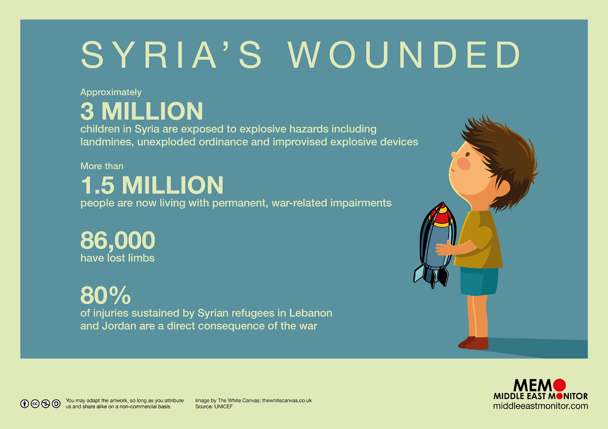
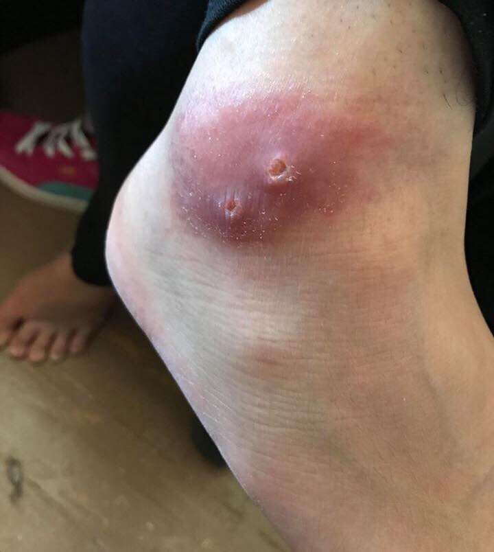
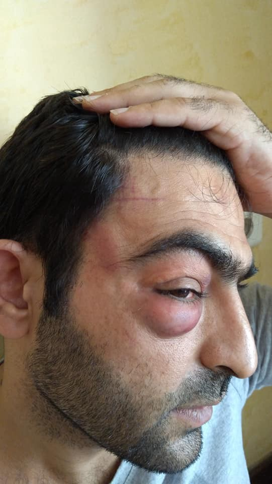
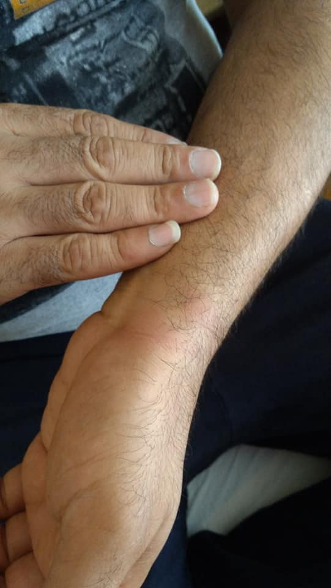
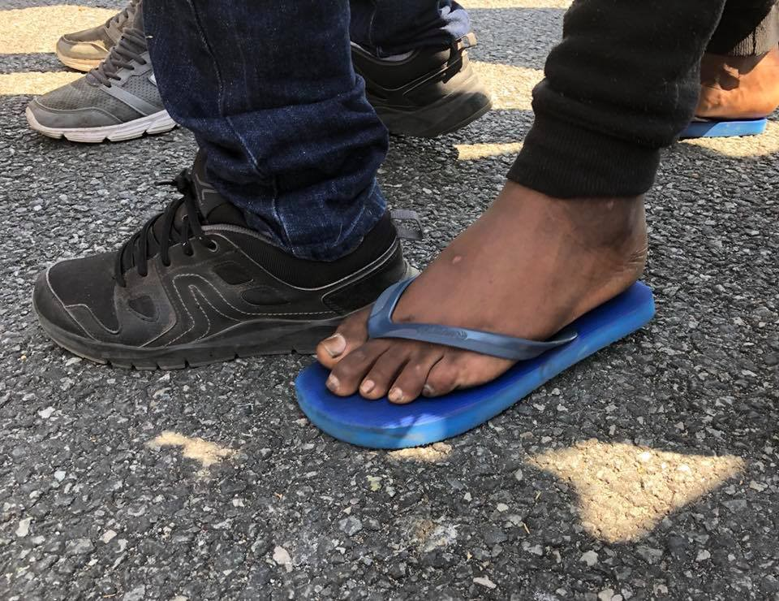
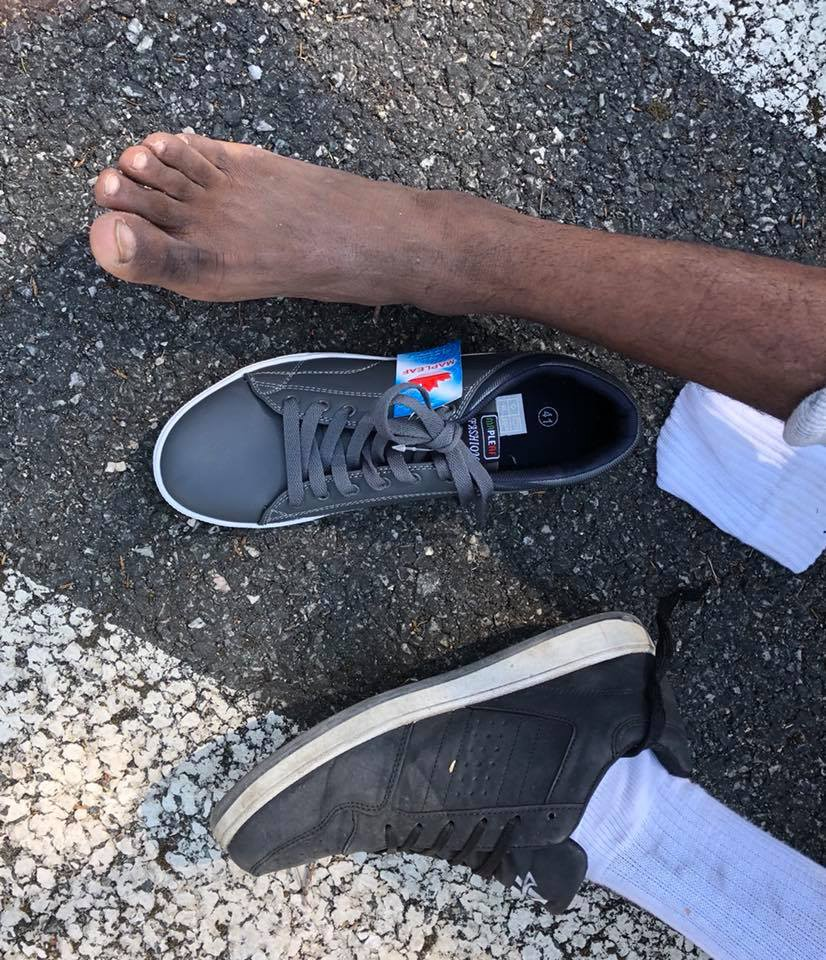

### AYS Daily Digest 28/07/2018: 1504 deaths at Sea in 2018\. More than Half Died In Last 2 months\.

283 Adults and Children Rescued Today by Salvamento Maritimo//Women Bitten By Poisonous Snake in Vial//Female Volunteers Needed in Moria//Information for people flying to Germany through Dublin Family Reunification//A Devastating recount of Police Brutality Against Refugees in Athens//Warehouse in Calais Low on Supplies// Sign the petition to stop deportations to Afghanistan from Sweden

](assets/2f7bb8f3da3e/1*cYCFNGlgaCR0WWELUv1ndA.jpeg)

Source: [Paul Scholten](https://www.facebook.com/paul.scho.5?hc_location=group_dialog)
### FEATURE:
#### Today we stand in solidarity with protests occurring throughout Germany and other parts of Europe: SEA RESCUE IS NOT A CRIME\!

Since The Interior Minister of Italy, Matteo Salvini, in June prohibited the Search and Rescue Vessel The Aquarius from disembarking 629 persons safely on a Port in Italy, deaths at sea have increased at an alarming rate\. 2018 has been another deadly year at European borders\. A conservative estimate of 1504 people have died at sea so far\.

What is most alarming is that until the criminalisation of Sea Rescue stops, the death toll will only continue to rise\. More ships are being impounded, often for months, unable to perform rescues on the most deadly border in the world\. In the last two months we have seen an increase in restrictions and prosecution of NGOs dedicated to Search and Rescue efforts\. The last two months have also accounted for over the half of the deaths at sea this year\.

■■■■■■■■■■■■■■ 
> **[MSF Sea](https://twitter.com/MSF_Sea) @ Twitter Says:** 

> > 2018 remains one of the deadliest on record for the #Mediterranean  with 1,504 men, women and children having died attempting the crossing – more than half of those deaths occured since June 1. [reliefweb.int/report/spain/m…](https://reliefweb.int/report/spain/mediterranean-migrant-arrivals-reach-55001-2018-deaths-reach-1504) 

> **Tweeted at [2018-07-28 16:25:45](https://twitter.com/msf_sea/status/1023243121340100609).** 

■■■■■■■■■■■■■■ 

Today we stand in solidarity with all those who are demonstrating this incredibly inhumane and deadly EU policy\.

](assets/2f7bb8f3da3e/1*T_tM-RoUrCJo5gNa5D1Gaw.jpeg)

Source: [Seebrücke — Schafft sichere Häfen](https://www.facebook.com/SeebrueckeSchafftsichereHaefen/?hc_ref=ARThO-qsU1m4gBi2j8uCuRM6LI_TGdy6jOon5yGesnZRJ_u87hhAFhjR0MomM_2VuLc&fref=nf)

> We won’t stop\! We all are the pier & we are many\! 

> Unbelievable how many new actions and demos are communicated to us daily\! 

> That makes again hopeful\! We will end dying and fight safe escape routes\! 

> Keep going\! Stay active\! Get up\! — [Seebrücke — Schafft sichere Häfen](https://www.facebook.com/SeebrueckeSchafftsichereHaefen/?hc_ref=ARThO-qsU1m4gBi2j8uCuRM6LI_TGdy6jOon5yGesnZRJ_u87hhAFhjR0MomM_2VuLc&fref=nf) 

#### SYRIA

### SEA
#### 283 Adults and Children Rescued Today by Salvamento Maritimo

283 people from 15 boats in Distress were Rescued today by Salvamento Maritimo\.

■■■■■■■■■■■■■■ 
> **[SALVAMENTO MARÍTIMO](https://twitter.com/salvamentogob) @ Twitter Says:** 

> > El Centro de @[salvamentogob](https://twitter.com/salvamentogob) de #Tarifa ha coordinado hoy el rescate de 283 personas de 15 #pateras en El Estrecho. Y el Centro de #Almería el rescate de 51 personas de 2 pateras: una con 16 personas 32 mn SE del faro de Sacratif y la otra con 35 personas 27,5mn SW isla de Alborán https://t.co/CcwxWE24H5 

> **Tweeted at [2018-07-28 15:18:10](https://twitter.com/salvamentogob/status/1023226111206088709).** 

■■■■■■■■■■■■■■ 

#### An Update from Sea\-Eye 2

### GREECE
#### **Arrivals:**

**Chios:**

> A boat landed on Komi beach, Chios south, 05\.35\.
 

> 40 people\.
 

> 14 children 
 

> 12 women 
 

> 14 men 

**Samos:**

> 3 people arrived on Samos this morning but no further details at this stage\. 

**Lesvos:**

> A boat was picked up by Portuguese Frontex, outside Eftalou, Lesvos north, 02\.50\. Transported to Skala Sykamineas, arrived port 04\.20\.
 

> 61 people\.
 

> 28 children 
 

> 16 women 
 

> 17 men 

#### **Lighthouse Relief tended to arrivals on Lesvos:**

■■■■■■■■■■■■■■ 
> **[Lighthouse Relief](https://twitter.com/LighthouseRR) @ Twitter Says:** 

> > At 2:55am we received word from #UNCHR of a dinghy approaching Eftalou. Shortly therafter the dinghy was intercepted and taken to Skala. We received the 61 people, distributing food, water, and supplies

#withrefugees

1/2 

> **Tweeted at [2018-07-28 07:57:51](https://twitter.com/lighthouserr/status/1023115304816324614).** 

■■■■■■■■■■■■■■ 

■■■■■■■■■■■■■■ 
> **[Lighthouse Relief](https://twitter.com/LighthouseRR) @ Twitter Says:** 

> > 54 of the people were from Afghanistan, 6 were from Congo, and 1 from Burkina Faso.
Overall there were 16 women, 28 children, and 17 men. There was no need of medical assitance.

2/2

#wirthrefugees 

> **Tweeted at [2018-07-28 07:57:52](https://twitter.com/lighthouserr/status/1023115307064406016).** 

■■■■■■■■■■■■■■ 

#### **Women Bitten By Poisonous Snake in Vial**

A women was bitten by a poisonous snake that made it inside her tent in Vial\. She required immediate medical treatment\. The snake is called an Ottoman Viper; its venom causes gangrene and can kill\.

#### **Female Volunteers Needed in Moria**

[Gateways2life Center at Camp Moria](https://www.facebook.com/pages/Gateways2life-Center-at-Camp-Moria/474784916327759) are in need of female volunteers for the coming months to help with operation\. If you are interested please [follow this link\.](https://www.facebook.com/pages/Gateways2life-Center-at-Camp-Moria/474784916327759)

#### **Lifting Hands International In Need of Volunteers**

> We are still looking to fill the following roles at our community centre in Serres, Northern Greece: 

> \- German teacher \(by 25 Aug\)
 

> \- English teacher \(immediate and ongoing\)
 

> \- Dance teacher \(by 1 Aug\)
 

> \- Kids activities \(immediate and ongoing\)
 

> \- Piano teacher \(by 1 Aug\) 

For more information please email greecevolunteer@liftinghandsinternational\.org
#### Information for people flying to Germany through Dublin Family Reunification:

[**Mobile Info Team outlines what to expect on the day of transfer:**](https://www.facebook.com/mobileinfoteam/photos/a.1800063030222418.1073741830.1796286800600041/2233767300185320/?type=3&theater)
- Please be at the airport on time
- There will be Multiple Procedures at the airport that will take time to complete
- At the gate, the Greek police will take your White Cards \(geese winner\) and if you have delivered your passport before in the asylum office, **the police must return it to you\.** There are many cases where Greek Authorities forget to return it to you\.
- When you get to Germany, the FBI will be waiting for you at the gate\. You’ll have to go with them to make some important papers and they’ll also give you a document\. **This document provides a deadline for you to inform the German authorities of your request for asylum\. It is usually just a few days\!**
- When you’re done with paperwork, you can leave the airport and your family members can take you home to spend some time together until you go to your final date in the police document\.
- When you go to apply for asylum, you’ll be at a camp, which you have to stay in for asylum\. But current asylum procedure in Germany is much faster than in Greece, so after a few months you will be able to live with the rest of your family\.

**For information about how you will be notified of travel dates and how to access your tickets please [follow this link\.](http://www.facebook.com/mobileinfoteam/posts/2205986456296738:0.)**
#### A Devastating recount of Police Brutality Against Refugees in Athens

[Original Article](http://---  https://athens.indymedia.org/post/1590371/   ---)

> On July 27, 2018 at around 2 am Sherzad Rozhman, a refugee from Iran’s Kurdistan, was sitting with a friend on the stairs of the Archaeological Historical Museum in Athens when two police officers from the bottom of the stairs and two police officers from the top of the stairs were approaching them\. As they stood up, Sherzad recalls, the two riot police officers approached them directly and ordered them to lie down on the ground and empty their pockets\. Although Sherzad knew exactly that he had done nothing wrong, he followed the instructions of the officers\. As they lied down more riot police approached the situation\. After the officers could not find anything on the two refugees, they ordered them to stand up, and consequently the officers, holding the two refugees’ arms, walked them down the stairs\. 
 

> Sherzad recalls that one of the officers escorting his friend started hitting the friend with the baton following which one of the officers escorting him started to hit him with the baton, too\. In protest Sherzad started to ask them what he had done wrong for which he was being beaten\. However, Sherzad says, that all they responded with were profanities and insults such as “A\-hole” and “faggot” which he has come to partially understand over the past year and a half during which he has lived in Greece\. As his pleas had no result, Sherzad started hitting himself as a measure of protest, namely: the act of hitting himself was to demonstrate that if it is just about beating him, he will do it for them\. It was during this desperate protest that another five riot police officers joined the officer who was beating him\. As they had surrounded him one of the officers jumped at him attempting to kick him; as he dodged the kick the officer punched him in the face\. Loosing his balance in the act, the rest of the officers joined in and attempted to handcuff him\. During the ordeal Sherzad fell to the ground upon which the officers started kicking him in the head and face\. 
 

> Sherzad does not recall how long the kicks were raining down on his head and face as he was no longer fully conscious\. Eventually, he recalls, the officers pulled his arms from behind and attempted multiple times to throw him face\-first on the ground, most likely to justify his severe facial injuries as “falling to the ground during an attempted escape” — a practice quite the normal world wide\. After a number of attempts to throw him on his face failed because Sherzad turned to fall sideways, the officers lifted him and dragged him to a cruiser and made him stand against the car\. After some more hitting with the baton, then the officers told Sherzad that they will count to ten \(10\) during which he can get lost\. Upon counting, Sherzad states that he started limping away as his one leg was hurting badly due to the baton hits he had taken\. 
 

> Two days later, Sherzad suffers from severe pain in his jaw, ears, and shoulders, back, chest, hip, and legs due to the treatment of his head and body as a football by the officers\. As Sherzad stated in a video conference call I had with him at around 2:30 pm Toronto time on Saturday July 28, 2018, more than the physical pain that he is enduring, the unjustified and barbaric violence by the police officers is of the highest degree of pain\. “When police officers act worse than criminal and gangsters, one wonders what the future of this country will be\.” When the arm of a state which is supposed to uphold the law and justice acts like gangsters justified by the state to do as they please, then the legitimacy of the state is not only jeopardized, but it goes to show that the state has made racism and violence against the other, the foreigner, a legitimate act, albeit implicit insofar that the state does nothing to bring such misconduct by its agents to justice\. “I have been a law\-abiding member of this society from the day I arrived, I have worked since the beginning of this year and paid my taxes\. I had found a job at a tailor shop, which I was supposed to start the following day at noon\. But this cowardly act and this racist and fascist behaviour of the Greek police has caused me not only physical pain, but it cost me the job I was supposed to start\. They claim that refugees and migrants do not contribute to the society and just take away, but the truth in my case is that they destroyed the prospects of a contributing and tax\-paying refugee for their sheer desire to feel superior\. The police is the reason that I will not be able to contribute to this society in the coming time\. The police is the reason why I will no longer expect protection from this government, but rather, from now on I must think of measures to protect myself against this government and its apparatus\.” These were the last words of a refugee whom I have known since last November, and who has never ceased to be a positive contribution to the Greek society\. 

Source: Shezrad
### FRANCE:
#### Care4Calais warn that Warehouse is running Low on Supplies

> One of the things I’m struggling with, is how little there is in the warehouse\. The needs are still very much there, but there are now empty shelves where there was food, basic items such as deodorant are in critical supply and there are debates about when scarce resources such as sleeping bags should be distributed\. Care4Calais really need our support if they are able to help the young men, women and children who are still out there — Sarah Horton \(Volunteer\) 

To find out more about the work they do please follow this link\.

Source: Care 4 Calais
### SWEDEN
#### [Petition to Stop Deportations to Afghanistan](https://secure.avaaz.org/campaign/en/end_swedish_deportations_11/?fyrqmab&fbogname=Hansjuerg)

**Sign the call to Swedish Minister of Migration, Heléne Fritzon:**

> “As Swedish citizens, we call on you to do everything in your power to stop the deportations of refugees to unsafe countries and make sure that Sweden lives up to its reputation as a safe haven for those in need” 

> If thousands of us call on the Minister of Migration, Heléne Fritzon, **we have a chance to influence the debate that’s happening right now and the upcoming general election** \. 

> **We strive to echo correct news from the ground through collaboration and fairness\.** 

> **Every effort has been made to credit organisations and individuals with regard to the supply of information, video, and photo material \(in cases where the source wanted to be accredited\) \. Please notify us regarding corrections\.** 

> **If there’s anything you want to share or comment, contact us through Facebook or write to: areyousyrious@gmail\.com** 

_Converted [Medium Post](https://medium.com/are-you-syrious/ays-daily-digest-28-07-2018-1504-deaths-at-sea-in-2018-more-than-half-died-in-last-2-months-2f7bb8f3da3e) by [ZMediumToMarkdown](https://github.com/ZhgChgLi/ZMediumToMarkdown)._
