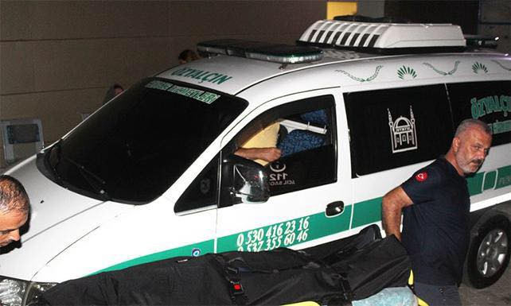
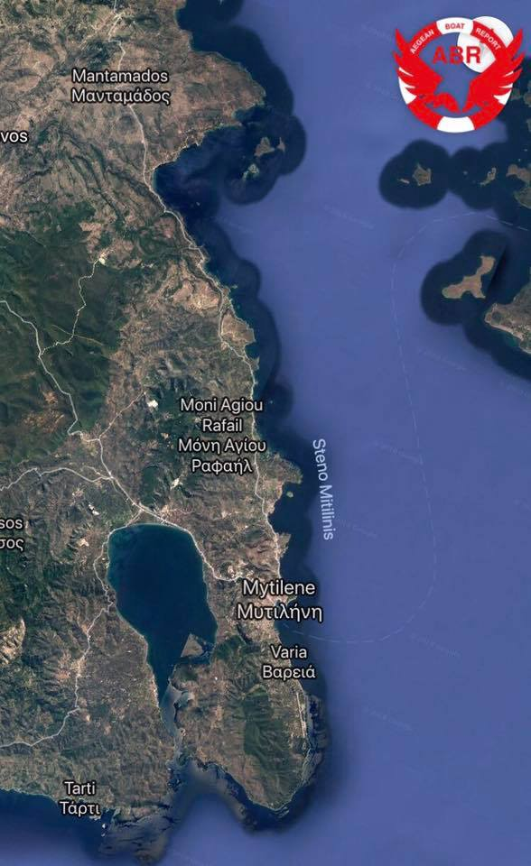

### DAILY DIGEST 29/7/2018
### AYS Daily Digest 29\.07\.18: Will the Sarost 5 Finally Disembark Today?

Russian scheme to return Syrian refugees // 6 drown off coast of Turkey // Italian prosecutor investigates crew of \#Iuventa // New arrivals in Greece // Protest in Hamburg // Help needed in France and UK // and more…

](assets/3a2674827b7/1*hYFUHcXy90xpv5D1Decb7w.jpeg)

Photo Credit: [Alarmphone](https://www.facebook.com/watchthemed.alarmphone/photos/p.2161301234144108/2161301234144108/?type=1&opaqueCursor=Abo6wKcTUN9r82R9IqGzvNeUMttEQ0AiMcSEB_fhhz5c9y22Ppmi62__uLSqzTHYwGHYxBK9o0pVwY2Z5kav353RJ40GXnqeM80-rKSiJhVlSFDAArV844ORRM1_94jkqZT0CuLnwjKIRHQq6ET1KT4iCtDkX186aUhkBx4y1nY47S94W7CxIMwRb-0j4V3FgJnK98J8TcxJBOeHrik9jzihLK4GQTvi_HVhNMaULeXr8B5wFMzfGmxtoYSPXlSAncmi3L-j6EQErMx6UF2zVJLLTMd8s7y65KHdQ-n41meor0VjA2tUC5MBnuEq2XopJCuVAEomg8Vf2E2d8XpPgzxUH-BzfeLola50uinH8f3Wnl8LZ64jWXDiQGarD4Oc00MPj351QlLOfxq4A65toCz7haaoeCBUFZJ5LpHo1K9JD0_pMtVkRRWQnqQDDjNtj7Y&theater)
#### Feature: Stranded on the Sarost 5

The 40 refugees who have been stranded on the Sarost 5 ship for the past two weeks have finally been given permission to disembark in Tunisia\. The case of the Sarost 5 has been yet another shameful case of playing with human lives\. Neither Italy, France, nor Malta would accept the ship\. The Maltese Rescue Coodination Center illegally directed the ship to Tunisia, where it became stranded outside of the port of Zarzis\.

While the agreement to allow the ship to disembark is being widely reported, as of writing the people are [still stranded](https://twitter.com/cochetel/status/1023654901442924545) onboard\. According to Tunisian officials, they are scheduled to disembark on Monday\.

Malta did not allow the ship into its ports despite the refugees onboard asking for international protection\. By directing them to Tunisia, they did not allow these people into a port of safety but instead hoisted them onto a country with a long and documented history of human rights abuses\. “We do not know what will happen to us on Tunisian soil,” [said L\.](https://twitter.com/scandura/status/1023578852134711296) , one of the 40 people aboard\. The situation for LGBTQ\+ people is especially dangerous in Tunisia\.

As multiple sea rescue organizations have pointed out, Malta clearly violated maritime law in this incident\. The Alarmphone group wrote today:

> The ordeal endured by the crew and passengers of the Sarost 5 is the direct result of EU migration policies, which externalize border controls and condone the closure of ports in Italy and Malta to NGO and private rescue vessels\. 

UNHCR officials have been complicit in this episode, once again showing where their true loyalties lie\. At one point this week, a [UNHCR special envoy](https://twitter.com/alarm_phone) asserted that UNHCR staff were onboard the ship, and had established that “the majority of the persons did not want asylum”\. However, it was later discovered that no one from the UNHCR had even been on board\. There had only been a brief visit from the Tunisian Red Cross\.
### Lebanon

Russian and Syrian authorities have [formed a plan](https://www.haaretz.com/middle-east-news/syria/a-thousand-syrian-refugees-return-home-from-lebanon-1.6317820) to allow refugees to return to the country\. Russia has announced a plan to return 890,000 refugees from Lebanon to Syria\. According to officials, these will all be “voluntary returns,” although it remains doubtful if that many people would chose to return to places that are often active war zones\.

3,000 Syrians have supposedly registered for voluntary returns, and according to Lebanese officials, 2,000 have already returned under the plan\. While some Syrians are ready to leave Lebanon because of the lack of opportunity for refugees there, many are understandably mistrustful of Russian involvement in the scheme\.
### Turkey

Six people drowned off the coast of western Turkey early on Sunday morning\. Three of the dead are babies\. The people were on board a ship likely trying to reach the island of Lesvos\.

According to the Turkish Coast Guard, rescue operations were conducted overnight and nine people from the boat were saved\. One person is still missing\.

Turkish state news agencies have wasted no time in smearing two of the dead as people smugglers, and the rest of them as members of the banned Gulen sect\. Apparently in Erdogan’s Turkey, even an infant is capable of being a political enemy\.

One of the victims of today’s wreck is transported in Turkey\. Photo Credit: Aegean Boat Report
### Sea

The Spanish sea rescue organization SMH saved 247 people from 24 boats today\.

■■■■■■■■■■■■■■ 
> **[SALVAMENTO MARÍTIMO](https://twitter.com/salvamentogob) @ Twitter Says:** 

> > Hoy se ha auxiliado a 247 personas de 24 pateras. Salvamar Vega, Guardamar Concepción Arenal y Salvamar Arcturus las han trasladado a Algeciras. Ha coordinado el CCS Tarifa. No se han producido alertas por pateras en Alborán https://t.co/LzbKGuMwxd 

> **Tweeted at [2018-07-29 17:22:13](https://twitter.com/salvamentogob/status/1023619717779648513).** 

■■■■■■■■■■■■■■ 

### Greece
#### Islands

A boat was picked up by the Hellenic Coast Guard outside Lesvos south this morning around 04\.30\. There were 51 people aboard, 15 children, 17 women and 19 men\.

A boat arrived on Samos this morning carrying 45 people — 5 children, 17 women and 23 men\.

Photo Credit: Aegean Boat Report

> Refugees 4 Refugees is looking for a volunteer coordinator\. Find the full description here: [https://greecevol\.info/task\.list\.php?ID=905](https://l.facebook.com/l.php?u=https%3A%2F%2Fgreecevol.info%2Ftask.list.php%3FID%3D905&h=AT0pJkEnLRSYEZaXA_-X0kExXEIE-aEzlbhOe6WKoBJGfRUHoeUHcvEI_IwttRmSGNunclntpBHTvi9g4XhXHvOpZiG8u1BsV-ySgj0IndUdI5VR6LLYSBRNjWCIKeZBVQf75U4IZ8u5fnxalE8PSsYFbA) Apply at refugee4refugees@gmail\.com with your CV and motivation letter\. 

#### Mainland

Lifting Hands International is seeking an education manager ASAP, to lead a language programme for the residents of a refugee camp in Serres, Northern Greece\. Click [here](https://www.facebook.com/groups/infopointfornortherngreecevolunteers/permalink/688016021544694/) for more info\.
### Italy
#### Italian Police Conduct Surveillance on Rescue Workers

The Italian prosecutor in Trapani announced this week formal investigations are being conducted against 22 volunteers from the rescue ships\. Among them are 15 of the crew of the Iuventa, which was seized nearly a year ago on the usual bogus charges of “aiding illegal immigration”\. Some of these charges carry up to 15 years imprisonment\. The crew members of the Iuventa released a [statement today](https://solidarity-at-sea.org/en_criminal_investigation_against_rescuers) protesting their investigation:

> The Iuventa crew rejects the baseless allegations brought against it and condemns the criminalisation of civil rescue organisations\. “ **_If we have to answer in court for having saved these people, Europe has reached political and moral rock bottom\. Should it prove a crime to save lives, then I remain on the right side of the dock\.”_ Kathrin Schmidt, Head of Mission / Iuventa** 

> Since July 2016, the Iuventa has rendered assistance to over 14,000 migrants in distress under the authority of the Rome Maritime Rescue Coordination Center, in strict compliance with international and maritime law\. However, the police dossier provided to the crew at the ship’s seizure, on 2nd August 2017, revealed that the Iuventa had for months been at the center of an extensive surveillance operation\. The operation drew in multiple law enforcement agencies including undercover operatives which authorized police agents to bug the ship’s bridge and crewmembers’ mobile devices\. 

The heavy surveillance of rescue workers shows just how far Italy is willing to go in defense of its border regime\. As Italy violates international and maritime law through agreements with the Libyan “Coast Guard,” it paints refugees and humanitarians as criminals\.
### Malta

Tomorrow another day of court begins for the crew of the Lifeline ship in Malta\. The crew is being accused of aiding illegal migration for refusing to hand over refugees to the criminal Libyan “Coast Guard”\. So far, there has been no evidence of wrongdoing presented in the trial\. As the ship sits impounded in Malta, people continue to drown in the Mediterranean\. Who are the real criminals here?

■■■■■■■■■■■■■■ 
> **[MISSION LIFELINE](https://twitter.com/SEENOTRETTUNG) @ Twitter Says:** 

> > #Valetta – European Capital of Culture 2018. This is where the rescue ships are confiscated, whereupon people drown. #HumanRights #Malta 
Foto: Catherine Ricoul https://t.co/I5VBQKcaoO 

> **Tweeted at [2018-07-29 17:47:20](https://twitter.com/seenotrettung/status/1023626041238192128).** 

■■■■■■■■■■■■■■ 

### Germany

An estimated 2,000 people marched today on Hamburg in support of the Mission Lifeline ship which is currently impounded in Malta\.

■■■■■■■■■■■■■■ 
> **[Nora Börding](https://twitter.com/noraboerding) @ Twitter Says:** 

> > Unter dem Motto 'Turn Berlin orange' heute in 4 verschiedenen Bezirken Berlins Seebrücke-Info- und Aktionsstände für die Seenotrettung und gegen das Sterben im Mittelmeer! @[_Seebruecke_](https://twitter.com/_Seebruecke_) #Seebrücke #seenotrettung #Berlin https://t.co/c4IGbSxOov 

> **Tweeted at [2018-07-29 16:36:24](https://twitter.com/noraboerding/status/1023608190490107904).** 

■■■■■■■■■■■■■■ 

### Netherlands

There will be a demonstration tomorrow in Dam Square, Amsterdam in support of sea rescue organizations\. Click here for more [information](https://www.facebook.com/events/291847764891795/) \.
### France

Volunteer groups in Northern France are struggling to provide water for refugees sleeping rough\. Officials have fallen through on many promises to set up water points, and solidarity groups need [support](https://mydonate.bt.com/donation/v4/chooseAmount.html?charity=147727&currentMonth=6) \.

> [Refugee Community Kitchen](https://www.facebook.com/groups/RefugeeCommunityKitchen/?fref=mentions&hc_location=group) and all the other organisations \( [L’Auberge des Migrants International](https://www.facebook.com/AubergeMigrantsInternational/?fref=mentions&hc_location=group) , [Help Refugees](https://www.facebook.com/HelpRefugeesUK/?fref=mentions&hc_location=group) ​, Utopia 56\) in Calais are now making over EIGHT deliveries of water \(1860L\) a day to hundreds of displaced people living rough in the sweltering summer heat\. 

> While the mayor of Calais was recently pressured into providing water for people to wash themselves in, we are in 30°C plus \(over 100°F\) weather still waiting for water points to materialise\. 

### UK

Volunteers are organzing a tent salvage after the Boomtown festival in Winchester, on 13 August\. The tents will go to refugees in Northern France\. Contact [this group](https://www.facebook.com/groups/1743210372421899/about/) for more information\.

> **We strive to echo correct news from the ground through collaboration and fairness\.** 

> **Every effort has been made to credit organisations and individuals with regard to the supply of information, video, and photo material \(in cases where the source wanted to be accredited\) \. Please notify us regarding corrections\.** 

> **If there’s anything you want to share or comment, contact us through Facebook or write to: areyousyrious@gmail\.com** 

_Converted [Medium Post](https://medium.com/are-you-syrious/daily-digest-29-7-2018-3a2674827b7) by [ZMediumToMarkdown](https://github.com/ZhgChgLi/ZMediumToMarkdown)._
