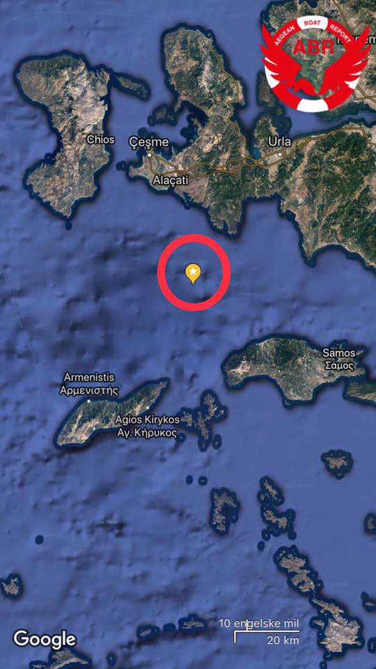
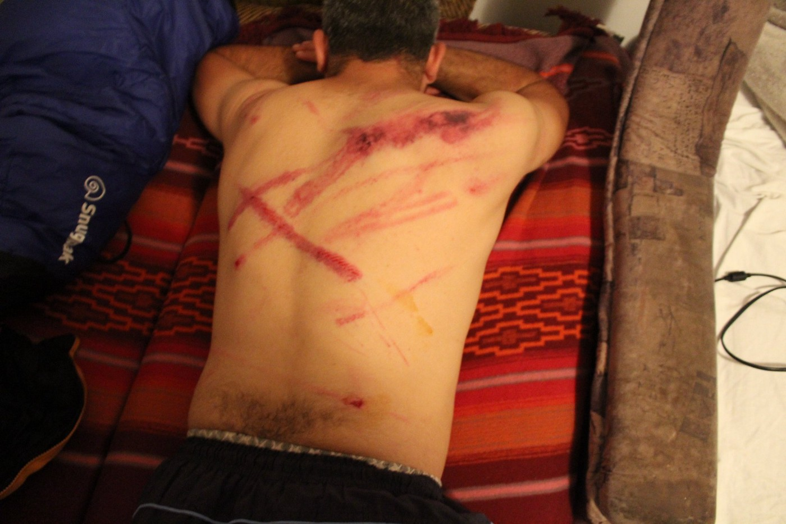
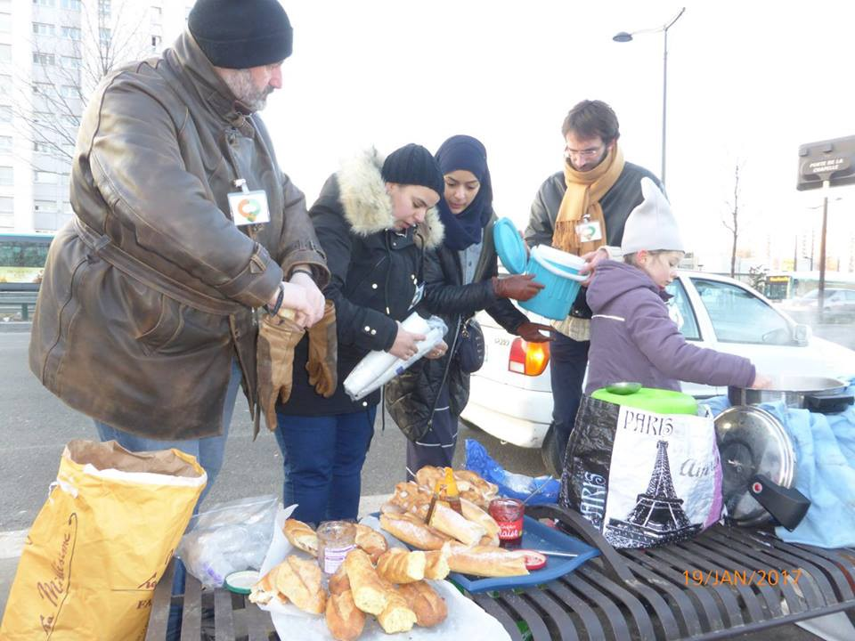
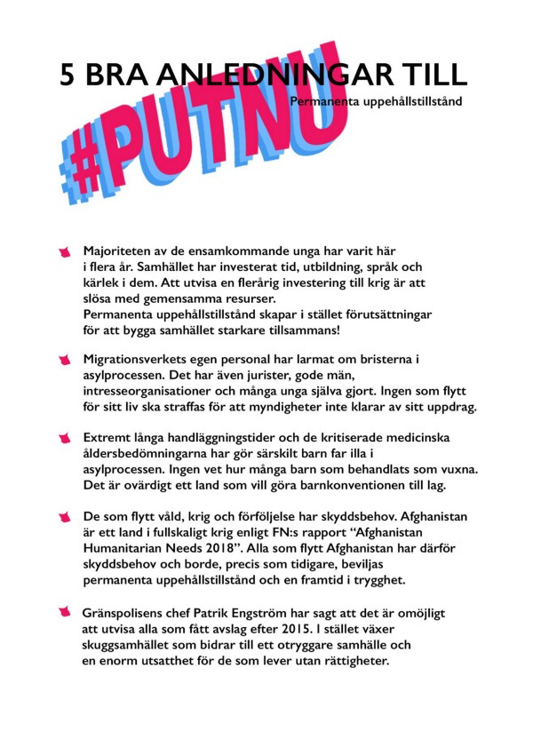

### AYS DAILY DIGEST 01/08/18: Greece to receive more emergency funding to improve standards
#### 57 751 people reached Europe by the Mediterranean sea so far 2018 // Refugees transiting through Tunisia // Two people shot in Serbia // Severe abuse from Croatian police seen in Bosnia // France will shorten times for appeal // Hungerstrike in Moria // New big, peaceful protest against deportations planned in Sweden // Denmark to exclude women from the public by making niqab’s illegal // And more news from the ground\. \. \!

** Photo: Jon Nazca, through Art Against\.](assets/c7fbda54f7c1/1*890WVI5sSbu1fCVZ6l7BEQ.jpeg)

Photo from Tarifa, Spain 27 July 2018\. Spain is the new main entry point, as Italy is harder to reach and routes are constantly changing\. Here, refugees disembark from a dinghy at the same time as tourists are hanging at the beach\. **[It is a strange reality\.](https://www.facebook.com/artagainstproject/photos/a.639651369417634.1073741828.639605726088865/1799472703435489/?type=3&theater&ifg=1)** Photo: Jon Nazca, through Art Against\.
### FEATURE
#### EC to disburse an additional 37\.5 million euros to Greece in emergency funding

While long\-term issues are less newsworthy they still present very real dangers\. Ill health — both physical and mental — caused by overcrowding, substandard living conditions, inadequate access to healthcare, and a dire failure to meet safety standards affect the lives of many on a daily basis\.

Ekathimerini reported on Wednesday that [**37\.5 million euros in emergency assistance is to be disbursed to Greece\.**](http://www.ekathimerini.com/231335/article/ekathimerini/news/european-commission-boosts-migration-aid-to-greece) 31\.3 million will be for provisional services including interpretation, food and healthcare and additional accommodation\. 6\.4 will go to the International Organisation for Migration \(IOM\) to improve reception conditions on the Aegean islands and mainland Greece\.

After peak arrivals in the Evros region of Northern Greece in April of this year, [HRW visited 3 government run centres in May and interviewed 49 asylum seekers and migrants and reported INHUMANE CONDITIONS\.](https://www.hrw.org/news/2018/07/27/greece-inhumane-conditions-land-border) People housed in cells, tents and crowded rooms\. Reports of verbal and physical abuse by police\. Inadequate access to healthcare as well as inadequate support for at\-risk people\. **The situation is reported as unchanged in July\.**

This begs the question as to how the emergency funding has failed to reach where it is really needed\. The additional money from the EU that Ekathimerini mentions, will partly be used to improve the standards in Fylakio pre\-removal detention center, where HRW said the conditions were horrendous\.

The EU has allocated and disbursed emergency funding to Greece several times before\. Besides the emergency funds, **a total of 464 million euro has been disbursed so far since 2014** \. The money is allocated and disbursed by AMIF \(Asylum, Migration and Integration Fund\) and ISF \(International Security Fund\) \.

In emergency funding, **Greece has received a total of 197,4 million in emergency funding** from [AMIF and ISF together since 2014](https://ec.europa.eu/home-affairs/sites/homeaffairs/files/what-we-do/policies/european-agenda-migration/20180615_managing-migration-eu-financial-support-to-greece_en.pdf) \. This last amount adds another 37,5 million\.

Some examples of when emergency funds previously have been given and to which body, is that [The Ministry of Defence received a total of 83\.1 million](https://ec.europa.eu/home-affairs/sites/homeaffairs/files/what-we-do/policies/european-agenda-migration/20171222_eu_budget_financial_support_to_greece_en.pdf) in emergency funds between March 2016 and December 2017 for Asylum and Migration to provide shelter, accommodation, catering, transportation, healthcare and safe living conditions\. **Why then are there reports of inhumane living conditions?**

[The Ministry of Health received 24\.18 million](https://ec.europa.eu/home-affairs/sites/homeaffairs/files/what-we-do/policies/european-agenda-migration/20171222_eu_budget_financial_support_to_greece_en.pdf) in 2016 in order to provide a _´Comprehensive emergency health response to the refugee crisis´\._ **Why then are the mandatory screenings so often denied?**

This [document](https://www.ohchr.org/Documents/Issues/Detention/DraftBasicPrinciples/IOM3.pdf) on the International Standards from the IOM quotes The UN Special Rapporteur on the human rights of migrants, Jorge Bustamante, _“Migration\-related detention centers should not bear similarities to prison\-like conditions\.”_

**Meanwhile, and despite almost countless millions of euros given, the need for emergency funding never ends** \. The problem in the Greek crisis is not really about money though, it is about lack of will\. Which clearly shows while looking at EU:s upcoming plans for more centers and platforms to keep people away\.

> Lack of solidarity and humanity can never be solved with 37,5 million euros\. 

### GENERAL

[57\.571 people have](https://www.iom.int/news/mediterranean-migrant-arrivals-reach-57571-2018-deaths-reach-1514) arrived by sea in Europe so far this year, whereas the number for the same period last year was 112\.375\. As already reported, Spain has overtaken Italy as the main entry point with 22 858 over 18 392 in Italy\. The arrivals to Italy dropped with as much as 80 percent compared to last year\. Instead, [16\.345 people](https://www.iom.int/news/mediterranean-migrant-arrivals-reach-57571-2018-deaths-reach-1514) more have reached Spain compared to last year\.

The change of route surely depends partly on the hard\-line right\-wing government in Italy, which refuses boats from disembarking and also EU’s Operation Sophia who returns people to Libya in close cooperation with the Libyan Coastguard\.

[As we have reported](https://twitter.com/formicasara/status/1022158300455034880) about before, the Libyan coastguard nowadays intercepts 46 percent of the boats, which is a huge increase up from six percent in 2016\.
### SEA

[The investigation of the Sea\-Watch 3](https://www.tagesschau.de/ausland/seawatch-103.html) vessel showed that all documents are correct, and the ship is registered\. Still, the Maltese government will not let the ship leave the port\. It has been suspended there for weeks now, prohibited to leave and conduct SAR\-missions again\.

On the other hand, Aquarius is back in the Mediterranean from today and onwards\. The rescue vessel, managed by SOS Mediterranee and MSF, will continue patrolling the waters despite the harsh political climate at sea\. After strategical and mechanical upgrades in Marseille, they are ready to go again\. The humanitarian crisis is still unfolding at the doorstep of the EU, and the failure to put up sustainable solutions to save lives at sea\. In the meantime, sea rescue is essential, according to Frédéric Penard, Director of Operations of SOS MEDITERRANEE\.

> “Since it first left the port of Marseille in February 2016, the Aquarius rescued 29\.318 men, women and children from drowning, of which 2\.979 in 2018”, it says in the press release\. 

They were also clear on another point, saying that Aquarius will not return anyone rescued in Libya\.

> “As long as Libya cannot qualify as a place of safety, the Aquarius will never disembark any rescued person in Libyan ports\. All these principles have been reasserted after consultation with legal experts, prior to departure\.” 

Later during the Wednesday afternoon, [**MSF\_Sea‏**](https://twitter.com/MSF_Sea) reported [on Twitter](https://twitter.com/msf_sea/status/1024688344633171969?s=21) that the Aquarius is on its way back to the SAR\-zone\. It will take them about 3–4 day to reach the central Mediterranean\.

■■■■■■■■■■■■■■ 
> **[MSF Sea](https://twitter.com/MSF_Sea) @ Twitter Says:** 

> > “Despite the increasingly complex situation on the #Mediterranean our objective remains the same - to save lives at sea; to prevent men, women &amp; children from drowning,  and to bring them to a place of safety where their basic needs are met &amp; their rights protected.” https://t.co/DoTBPDl6gs 

> **Tweeted at [2018-08-01 07:44:56](https://twitter.com/msf_sea/status/1024561604996804608).** 

■■■■■■■■■■■■■■ 

■■■■■■■■■■■■■■ 
> **[MSF Sea](https://twitter.com/MSF_Sea) @ Twitter Says:** 

> > The #Aquarius sets sail today from Marseille after an extended port call. The #MSF &amp; @[SOSMedIntl](https://twitter.com/SOSMedIntl) teams on board are ready to return to the Central #Mediterranean to save lives at sea. https://t.co/pIcQ0QpkjJ 

> **Tweeted at [2018-08-01 07:31:21](https://twitter.com/msf_sea/status/1024558187368853504).** 

■■■■■■■■■■■■■■ 

### TUNISIA

An interesting finding in the statistics from IOM that was released today was that despite the overall drop in arrivals, 3\.002 Tunisians reached Italy so far this year, compared to 580 the same period last year\.

This morning the vessel Sarost 5 arrived in Tunisia to finally disembark the 40 people who had been trapped onboard for more than two weeks\. This has, as covered in several digests during the past weeks, been highly criticised\. No European nation offered the ship a port to dock in\. One issue is that there are no official asylum laws in Tunisia, but regardless of this people were now placed there instead of the EU\. For now, the UNHCR are the ones to determine people’s asylum status, and they are currently working together with the Tunisian authorities in order to come up with a national framework since that is lacking\.

Since 2011, the number of people reaching Tunisia has increased but is now dropping again, and most of the people arriving sees it as a location of transit\. In 2015, 147 out of 900 people returned to Tunisia while trying to reach Europe claimed asylum\. It is not to wild to suggest that the additional 753 people tried, and maybe succeeded, in doing the crossing again\.

Meanwhile, according to information available, refugees in Tunisia are provided with English and French classes and children are enrolled in primary school\.

For those interested in knowing more, follow [this link](https://borgenproject.org/facts-about-refugees-in-tunisia/) \.

A UNHCR report about Tunisia can be found [here](http://reporting.unhcr.org/sites/default/files/UNHCR%20Tunisia%20Factsheet%20-%20January%202018.pdf) \.
### LIBYA

[Navy detained journalists trying to cover migration\.](https://l.facebook.com/l.php?u=https%3A%2F%2Fwww.libyaobserver.ly%2Fnews%2Flibyas-navy-explains-details-afp-reuters-journalists-detention-tripoli&h=AT3ZnwLOyNKaokcHmWrorpXPim10pnWerO1zWtmP6ndHppfQyXwFEB-ea6supvIa0nZp4UJB_ciIUO5ZJKu1XIC0llrcxUOX_wZj55RJnR1SVjRVGnhwPEn2DiHUBB_bnw)

“We were heading to Abu Sitta Naval Base in Tripoli to cover illegal immigration news and we were stopped by an armed group despite having permits to be there\. We then were allowed to enter after showing our IDs, yet after the news coverage had ended, a different\-uniform armed men came and took us to their commander, who said were entered the base illegally and confiscated our devises\. He later ordered his group to detain us in a cell for over 10 hours\.” One of the journalists told reporters\.
### SPAIN

[The EU has stated](https://elpais.com/elpais/2018/08/01/inenglish/1533108364_817753.html) they will give 55 million euros to Tunisia and Morocco to try and ´stem´the flow of migrants from those countries\. Meanwhile many people are without proper shelter after arriving in Algeciras, south of Spain\.

](assets/c7fbda54f7c1/1*Qpv_1HnCqHkpRtzMlF88rg.jpeg)

A women resting after being rescued outside the Spanish coast\. Photo: [Olmo Calvo](http://Olmo Calvo ‏   @OlmoCalvo)
### GREECE
#### Mainland

[We Are Here — Community Centre](https://www.facebook.com/WeAreHereCentre/?hc_ref=ARSCaXM-7vSYioXBnvOQkBDZHREJkfrKy0aRvvxvLaVDAIuYLEw3lH2BVrTfQoeEoTU&fref=nf&hc_location=group) , [published an update about](https://www.facebook.com/WeAreHereCentre/posts/2246682795553313) both their daily activities in Nea Kavala, but also about issues in the camp\. Even though the camp is better than many other camps some of the residents have been in, the reduction of available services affects the living standards\. It has taken a step back, and neither UNHCR nor the Greek Council of Refugees in no longer present in the camp\.

Lack of information, a lot of mosquitos, cramped and windowless tents and much more are becoming bigger issues than before\. But, as We Are Here are writing, the influx of new residents also brings new energy to the camp\.

The neglect for the ongoing crisis when it reaches a point where more and more people have stopped caring is dangerous not only in Nea Kavala but in several locations\. This status quo should not be forgotten\.

](assets/c7fbda54f7c1/1*e8DEFARZf7CtpoZZBnkwpg.jpeg)

Photo: [We Are Here — Community Centre](https://www.facebook.com/WeAreHereCentre/?hc_ref=ARSYzNds4HqFK-rLjxeJYdIxBq7SuzAnidtjabDV25iJ0JIgqAA8J0KYmaRJsuvWg_M&fref=nf)
### Islands

Arrivals of people on the Aegean islands almost doubled since 2017 says the [Aegean Boat Report\.](https://www.facebook.com/AegeanBoatReport/posts/413490615840715?hc_location=ufi)
#### Lesvos

A new organisation, [White Hearts](https://www.facebook.com/WhiteHeartsMoriaCampLesvos/?hc_ref=ARRyv48atwdJ_r2A36CDts97WiqBWIlQkpQM1okUypzmtJjkFxlpSrFUVM5_GVwh5_Y&fref=nf) , will start working alongside others on Lesvos\. The team consists of a mixed group of Kurds and Arabs who want to show that they can work together\. The aim is to make Moria a better place to live for everyone\.

_“In just two short weeks they have met with camp management, the Moria cleaning group, Nikos and Katerina who run the refugee friendly restaurant, [Dirty Girls Of Lesvos Island](https://www.facebook.com/dirtygirlslesvos/) and many committed volunteers on Lesvos\. They are forging new partnerships, building bridges, tearing down walls and showing people the true meaning of love and solidarity in a climate which is turning increasingly divisive, vicious and hateful\.”_

Please show support for their work and these values by liking and sharing [their page\.](https://www.facebook.com/WhiteHeartsMoriaCampLesvos/)

[\#ChooseLove](https://www.facebook.com/hashtag/chooselove?hc_location=ufi) 
[\#RefugeesWelcome](https://www.facebook.com/hashtag/refugeeswelcome?hc_location=ufi) 
[\#WeBelieveInLove](https://www.facebook.com/hashtag/webelieveinlove?hc_location=ufi)

](assets/c7fbda54f7c1/1*KgfZiur4elBJ2BoCXut5Zw.jpeg)

Photo: [Aegean Boat Report](https://www.facebook.com/AegeanBoatReport/?hc_ref=ARSo3jyGYeiXaHeB-aoscWrzg0Y0aQgoTeqwbwvNdOrSvjejGA6V00Qn6tPeV73ILew&fref=nf)

Additionally, [Aegean Boat Report](https://www.facebook.com/AegeanBoatReport/?hc_ref=ARSo3jyGYeiXaHeB-aoscWrzg0Y0aQgoTeqwbwvNdOrSvjejGA6V00Qn6tPeV73ILew&fref=nf) , reported that one boat landed West of Agios Dimitris, Lesvos north, early this morning\. It carried 15 people, of whom 6 children, 4 women and 5 men\.
#### Food strike in Moria

[Ongoing food strike in Moria](https://www.facebook.com/advocatesabroad/posts/653648061662265?hc_location=ufi) due to bad food, something that is repeating itself time after time\.

](assets/c7fbda54f7c1/1*_eaAf6capYUC3s3d_mgDXQ.jpeg)

Photo: Anonymous, through [Advocates Abroad](https://www.facebook.com/advocatesabroad/?hc_ref=ARRs8sd_cVUzm-lh2py1Ch4kFmW0OnJRGCanYY36N7YTxYRKv1GcqCsY08JvDO8vBRk&fref=nf)
#### Samos

[Aegean Boat Report](https://www.facebook.com/AegeanBoatReport/?hc_ref=ARSo3jyGYeiXaHeB-aoscWrzg0Y0aQgoTeqwbwvNdOrSvjejGA6V00Qn6tPeV73ILew&fref=nf) also reported about a boat that was in distress between Chios and Samos\. The Hellenic Coast Guard was notified and later the boat was transferred to Samos\. 47 people were onboard\.
### SERBIA

Two migrants were reported shot dead north west of Belgrade, more information [here\.](http://news.trust.org/item/20180801145450-8ovp4/)
### BOSNIA

Tuesday night, when the [**No Name Kitchen**](https://www.facebook.com/NoNameKitchenBelgrade/?hc_ref=ARTHTgI0KZ4xMMNG0so34E8yUrNRO1NAshGn_eUp9vHQuRXUzeibb_TecjbLNS57Wk4&fref=nf) volunteers in Velika Kladuša had dinner, a man and his friends came back from Croatia severely beaten by the police\. This photos is from ten minutes after he was forced back from the border

The violence reports are only increasing, just as it previously has done in other locations, one of the reasons for this new route\. As stated in this article, the [EU looks the other way](https://jacobinmag.com/2018/07/eu-migrants-refugees-balkan-route-frontex-dublin-schengen) , at the same time as smugglers and borders are becoming increasingly dangerous and difficult to cross for those trying\.

](assets/c7fbda54f7c1/1*PYZ3Q8fLERNfTETK5dyY4w.jpeg)

Photo: [No Name Kitchen](https://www.facebook.com/NoNameKitchenBelgrade/?hc_ref=ARQ8fvDdZoEyKzDX-CKFtgs8-H2gt9L8PtxD6avanbKM10qMRWa6UrlV_ZEX8F3etqU&fref=nf)
### FRANCE

[**Solidarité migrants Wilson**](https://www.facebook.com/Solidarit%C3%A9-migrants-Wilson-598228360377940/?hc_ref=ARTZ5Lcm8NoXmSdGDgogTwxZx8sRsVjXGxhdbv8mOqpZS2zjWLggey1HzOAtQ7z1kPA&fref=nf) said that today was an end of a chapter\. The municipality will resume their food distributions started last year, in cooperation with Aurora Association\. They welcome this mission, as they have done from the beginning, calling on the authorities to take their responsibility\. Regardless of that, a lot of work still needs to be done\. More information [here\.](https://www.facebook.com/permalink.php?story_fbid=952777678256338&id=598228360377940)

](assets/c7fbda54f7c1/1*5GLP6n85IABzj0sFu2oVJA.jpeg)

Photo: [Solidarité migrants Wilson](https://www.facebook.com/Solidarit%C3%A9-migrants-Wilson-598228360377940/?hc_ref=ARTZ5Lcm8NoXmSdGDgogTwxZx8sRsVjXGxhdbv8mOqpZS2zjWLggey1HzOAtQ7z1kPA&fref=nf)
#### Reduced times for appeals

[France reduces time for asylum seeking](https://www.aljazeera.com/news/2018/08/france-cuts-period-refugees-asylum-bid-180801184623901.html) applications and appeals and increases detention time\.
### BELGIUM

[Community support](https://www.facebook.com/groups/communitysupportforrefugeesinbelgium/) for refugees in Belgium\.
### DENMARK

[Today, the 1st of August 2018](https://www.dn.se/nyheter/varlden/burka-och-niqab-brott-eller-en-rattighet/) , it became illegal to wear niqab\. As the law was decided on earlier this year and implemented today\. Women covering their faces can be fined with about 120 euro\. If someone is caught twice, the fine the second time is approximately 1200 euro\.

A researches, who previously has been looking into the development after similar bans in France and other countries, said that the consequenses she has seen is that women avoid going out in public after the bans\. The result is basically baning women from being a part of society, punishing them for their belief, culture and choice\. The argument behind the ban in Denmark is both to work against oppression, but also that it is not a part on Danish culture\.

There should be better ways of doing this, and for a lot of women, wearing a niqab is a free choice\. Just as some women chose wearing a short shirt\.
### SWEDEN

After a lot of turmoil regarding the high\-school law, the Migration Court in Gothenburg asked the EU for help on how to apply it\. This comes after two courts refused to apply the law, which leads the Migration Agency to pause it until they could provide a better framework on how to interpret and use it\. During the same time, two other courts said that it was not a problem with the law and continued implementing it\.
#### The law is stealing focus

Fatemeh Khavari, the spokesperson for the stop\-deportations\-movement [Ung i Sverige](https://www.facebook.com/ungisverige.nu/?hc_ref=ARSwLrBFCyDaEYtZjRg-y77pdpmwW67hHtdu6USoYQAUJJCX0_V94m4-JEMyvmvMmIc&fref=nf) , said that the whole debate about the high school law is a way for the politicians to ignore the main issue: that young people should not be deported back to Afghanistan in the first place\.

Moreover, on Monday it is one year since the start of [Ung i Sverige](https://www.facebook.com/ungisverige.nu/?hc_ref=ARSwLrBFCyDaEYtZjRg-y77pdpmwW67hHtdu6USoYQAUJJCX0_V94m4-JEMyvmvMmIc&fref=nf) , a unique movement in many ways: the peaceful and humble protests, the self\-organization and the determination\. It started with a huge sit\-in and continued for 58 days\. Now, on the 6th of August, a new strike with the same demand will start\. Stop all deportations to Afghanistan, and permanent residence permits for everyone who has been in the country for one year\.

[Five reasons](https://www.facebook.com/ungisverige.nu/photos/gm.663682983965345/2177579812487689/?type=3&theater) for this is stated in the photo below:

> 1\. The majority of the unaccompanied minors have been in Sweden for years\. Time has been invested and a deportation is to waste a lot of knowledge that could be used here and instead feed a war\. 

> 2\. The Migration Agency have admitted that the asylum process sometimes are unlawful and unjust\. 

> 3\. The long waiting times and the age exams puts children’s mental health at risk\. 

> 4\. People fleeing violence, war and conflict is in need of protection\. Afghanistan is a country in war, according to UN’s report “Afghanistan Humanitarian Needs 2018”\. 

> 5\. The chief of the border police, Patrik Engström, said himself that it is impossible to deport everyone that is rejected\. Instead, a shadow society is growing\. 

> **We strive to echo correct news from the ground through collaboration and fairness\.** 

> **Every effort has been made to credit organisations and individuals with regard to the supply of information, video, and photo material \(in cases where the source wanted to be accredited\) \. Please notify us regarding corrections\.** 

> **If there’s anything you want to share or comment, contact us through Facebook or write to: areyousyrious@gmail\.com** 

_Converted [Medium Post](https://medium.com/are-you-syrious/ays-daily-digest-01-08-18-greece-to-receive-more-emergency-funding-to-improve-standards-c7fbda54f7c1) by [ZMediumToMarkdown](https://github.com/ZhgChgLi/ZMediumToMarkdown)._
