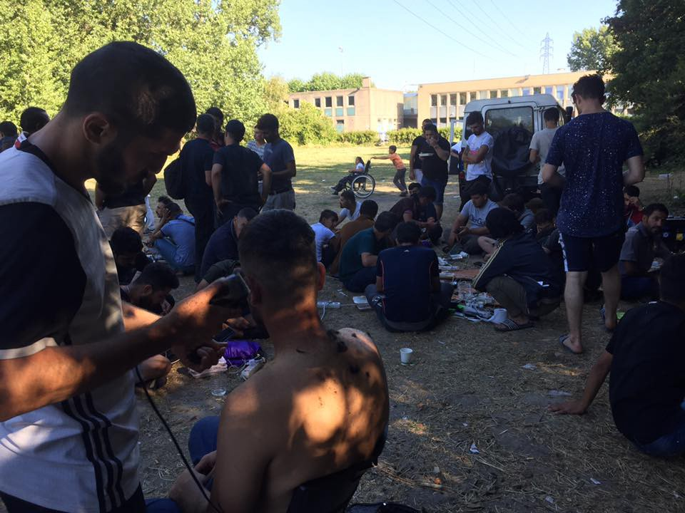
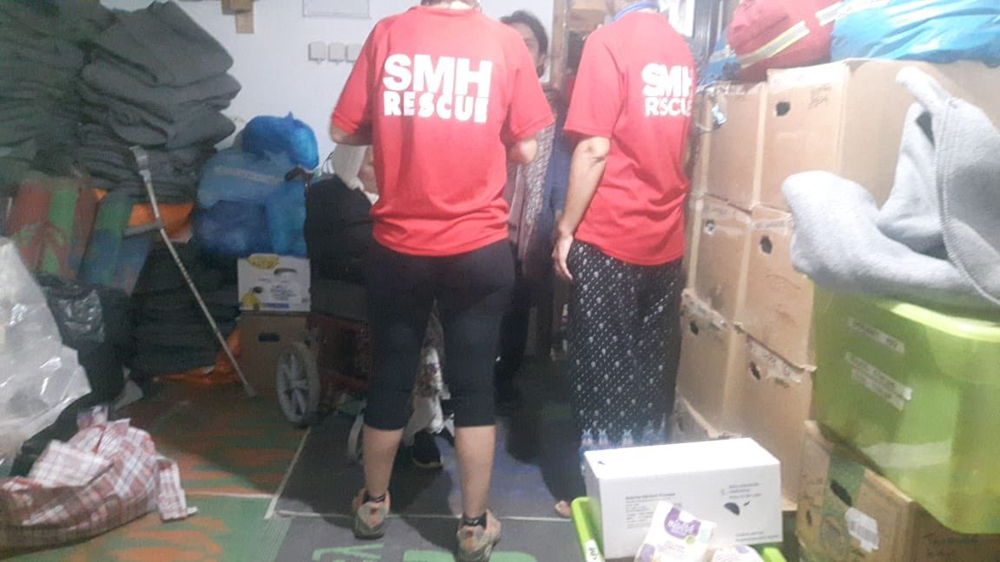

### AYS DAILY DIGEST 03/08/2018: Safe Harbours for All

_More than 1,500 refugees have already lost their lives this year crossing the Mediterranean // Proactiva Open Arms is still stuck off the coast of Libya//Police to control buses going from Sarajevo to Bihac or Velika Kladusa//_

](assets/a5c18bcff3db/0*qeanY4HHDad3PSjn)

Photo by [Seebrücke — Schafft sichere Häfen](https://www.facebook.com/SeebrueckeSchafftsichereHaefen/)
#### Feature

Today, the [Seebrücke](https://www.facebook.com/SeebrueckeSchafftsichereHaefen/) movement is organising “Day Orange” in more than 40 German cities, a day in favour of a more human refugee policy and against the criminalisation of sea rescue\.

This comes as more than 1,500 refugees have already lost their lives this year while attempting to cross the Mediterranean\. More than 850 lives were lost in June and July alone, marking the Mediterranean crossing as the deadliest sea route in the world\. While the number of people arriving has decreased, the death rate has increased: 1 in every 31 people who attempted the crossing in June and July died or are missing, compared to 1 in 49 during the course of 2017\.

Italy and the EU are still actively discouraging rescue operations, leading to an increase in the death rate\. Proactiva Open Arms is still stuck off the coast of Libya, with 87 people on board\. Italy has rejected its demand to disembark them in the country and Proactiva is now waiting for a response from the Spanish government\. Proactiva Open Arms founder Oscar Camps says the boat will remain in the search and rescue zone until the arrival of the Aquarius, according to journalist Nicolás Castellano\.

[SOS Méditerranée](https://sosmediterranee.com/declaration/) meanwhile says the Aquarius is returning to sea “because people continue to die attempting to escape the Libyan hell”\. The organisation insists that it is primarily bound by its duty to assist and will refuse to return people back to Libya, as the country “cannot be considered a safe place”\.

MSF Project Coordinator People Aloys Vimard, for example, tells the [Independent](https://www.independent.co.uk/news/world/africa/libya-refugee-crisis-europe-coastguard-migrants-a8474006.html) that people in Libya continue to be “exposed to a high level of violence and torture” and that detention conditions are “inhumane & terrible”\.

IOM spokesperson Flavio Di Giacom adds that while “IOM in Libya seeks to alleviate the suffering of migrants, it cannot guarantee acceptable reception conditions in the centres, which are managed by the local authorities\. Also in many areas of the country, migrants are victims of serious violence and abuse”\.

The Tunisian government meanwhile is working on the deportations of the 40 people who disembarked from the Sarost 5 boat, according to Alarm Phone\. The boat had been stranded at sea for two weeks after it had been refused authorization to land by the Maltese, French and Italian authorities\.

NGOs and organisations including Amnesty International, INTERSOS, MSF and Médecins du Monde have sent a [letter](https://www.asgi.it/allontamento-espulsione/libia-chiusura-porti-lettera-associazioni/) to the Italian president, the government and the general commander of the Port Authorities, denouncing serious violations of international, European and national laws, as port authorities hindered or delayed the arrival of rescued people during rescue operations coordinated by Italy\.
#### Spain
### 83 people rescued as European Commission promises more funds for Spain and Morocco

Salvamento Humanitario’s boat Salvamar Spic has rescued 83 people in total from two different boats\. [_Times_](https://www.thetimes.co.uk/edition/world/how-spain-became-the-new-centre-of-europe-s-migrant-crisis-wfdsq9s65) says the number of refugees entering Spain this year has exceeded the numbers in Italy or Greece\. It notes that after Madrid pleaded for extra European cash to help it cope, Francisco Ruiz, the mayor of Tarifa, is quoted admitting he fears a social backlash against refugees if public services become too stretched\. [_Le Monde_](https://abonnes.lemonde.fr/europe/article/2018/08/04/l-espagne-devient-la-premiere-porte-d-acces-des-migrants-en-europe_5339334_3214.html) also says Spain’s reception infrastructures are overwhelmed — the European Commission has promised €55 million to Morocco and Tunisia for the management of its borders and an additional €3m to Spain\.
#### France
### Volunteers needed in Calais

Photo by Mobile Refugee Support

Help Refugees says long\-term volunteers are urgently needed at their Calais warehouse, including for positions as distribution coordinator and donations coordinator\. More information can be found [here](https://helprefugees.org/news/calais-vacancies-apply-now-june-2018/) \.

[Mobile Refugee Support](https://www.facebook.com/MobileRefugeeSupport/) says numbers in Dunkirk have continued to increase steadily over this last week, with new families and groups arriving every day\. It says the population is now in excess of 500\. The camp is now equipped with 6 porta\-loos permanently situated and two shower blocks that are towed into the camp for a few hours, Monday to Friday\.
### Heatwave and police pressure makes life miserable in Paris

In Paris, the situation continues to be dire, as the heatwave, police pressure and the lack of access to vital needs such as food, water and healthcare makes life extremely difficult for refugees\. In response, the organisation [Solidarité migrants Wilson](https://www.facebook.com/Solidarit%C3%A9-migrants-Wilson-598228360377940/) has stopped its breakfast distributions and has asked the city to act by providing access to water and shelter\. While the group has stopped its distributions, it continues to draw attention to the situation in Paris\. It notes that the situation remains tense at Porte de la Chapelle while police continues to prevent refugees from gathering in small groups, even if it is only to find some shade\. Families with children continue to sleep in the streets as well\.
#### Greece
### Arrivals

Photo by SMH

Salvamento Maritimo Humanitario says one boat with 69 people landed on the rocks of Psara island, 80 kilometers off Chios, making the rescue by coastguards very difficult\. One boat with 41 people arrived in northern Lesvos according to Lighthouse Relief\.
#### Bosnia
### Police to control buses going from Sarajevo to Bihac or Velika Kladusa

From today on, local police in Bosnia will stop every bus going from Sarajevo to Bihac or Velika Kladusa and inspect it, looking for migrants\. It is not clear how that will be done and who they will look for, or what will happen to the people they find and decide to prevent from travelling on\.

Asylum seekers in Bosnia — anyone who entered the country and expressed their intention to seek asylum — have a right to freedom of movement, but this measure will prevent it\. For months, the local police has been preventing people from obtaining legal status, and that obstruction is now used to criminalize people on the move, since the police and politicians in Bosnia are saying that these people are in the country without any legal status\.

At the moment only one organization, the local NGO Vasa prava, is offering free legal aid to asylum seekers\. The reason for this measure, which will limit freedom of movement, as explained by the government in this part of Bosnia, is that there are more than 5,000 people at the moment in this region\. Most of them are sleeping outdoors, in parks, squats, makeshift camps and shelters, since the government and international organizations have not provided accommodation\. Despite a lack of evidence, the government continues to see asylum seekers as a threat to security\.
#### UK
### List of dead refugees destroyed

[Frieze](https://frieze.com/article/list-thousands-dead-refugees-destroyed-liverpool) reports The List, a project which details the thousands who have lost their lives while trying to seek refuge in Europe from 1993 to the present day, has been removed from where it was publically installed as part of the Liverpool Biennial\. The project, naming 34,361 dead asylum seekers, refugees and migrants, was presented as a series of posters pasted up on hoardings along the city’s Great George Street\. It is not clear who destroyed it\.

**We strive to echo correct news from the ground through collaboration and fairness\.**

**Every effort has been made to credit organizations and individuals with regard to the supply of information, video, and photo material \(in cases where the source wanted to be accredited\) \. Please notify us regarding corrections\.**

**If there’s anything you want to share or comment, contact us through Facebook or write to: areyousyrious@gmail\.com**

_Converted [Medium Post](https://medium.com/are-you-syrious/ays-daily-digest-04-08-2018-safe-harbours-for-all-a5c18bcff3db) by [ZMediumToMarkdown](https://github.com/ZhgChgLi/ZMediumToMarkdown)._
