**ILLEGAL PUSH\-BACKS AND BORDER VIOLENCE REPORTS, VELIKA KLADUŠA \(BOSNIA AND HERCEGOVINA\), JULY 2018**

_The following document presents testimonies of push\-back according to the catchment place: from Croatia, inner land and the border area between Bosnia and Croatia; and from Slovenia\._

**Report and photos by [NO NAME KITCHEN](https://www.facebook.com/NoNameKitchenBelgrade/)**

**1\.** 
**VICTIM\(S\)** 
NUMBER OF VICTIMS: 2 \(interview with one group member\) \.

NAMES: Fasir \(interviewed\)
COUNTRY OF ORIGIN: Morocco and Algeria
AGE: Fasir is 23 years old and his friend 25 years old SEX: males
MINORS IN THE GROUP: no
**INCIDENT**

COUNTRY AND LOCATION WHERE THE INCIDENT HAPPENED: Croatian inner land, forest near Karlovac \(viz\. approximate GPS location **Map** 1, below\) \. The men were all taken by a car to Glinice \(viz\. approximate GPS location **Map 2** , below\), from where deported to Bosnia\.

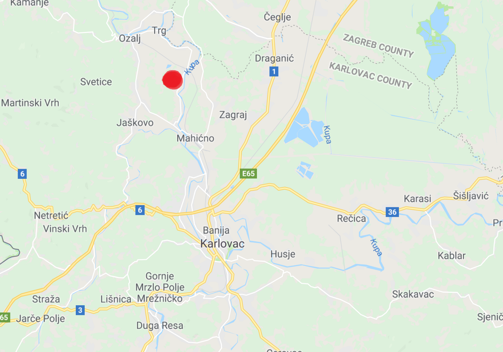

**Map 1**

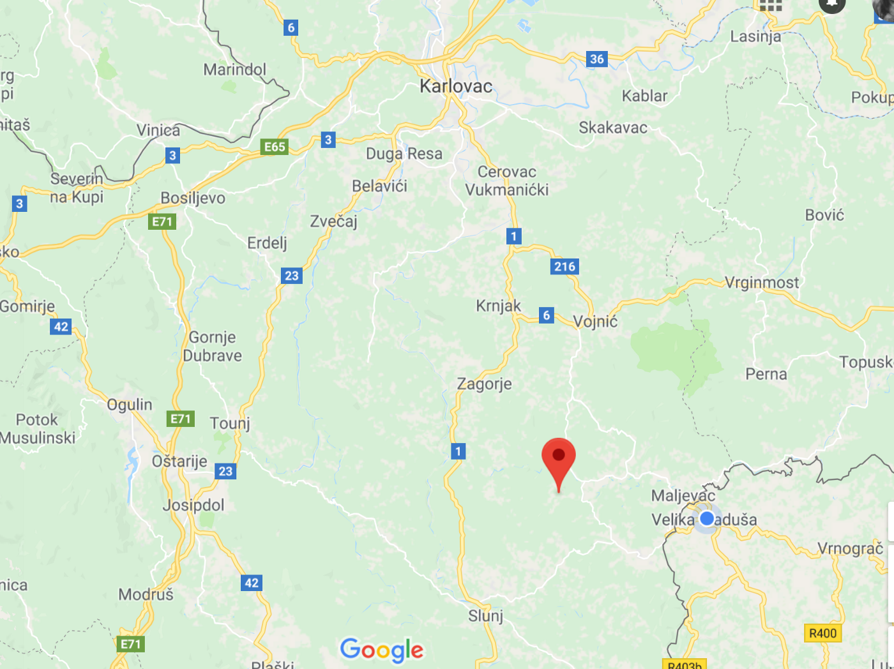

**Map 2**

DATE AND TIME OF THE INDICENT: 05/07/2018

TYPE OF INCIDENT: push back x denied access to asylum procedures x deportation x verbally threatened x robbed x physical violence

DESCRIPTION OF INDICENT: Fasir told me that him and his friend walked from Velika Kladusa towards Slovenia\. They were in a forest close to Karlovac where they were detected by five policemen\. When the police caught them, they did not ask the men any questions and started pushing them and after beating them with batons\. Fasir was hit by a baton to his face, shoulders and chest, and his friend received several hits by a baton to his back\. The police did not take the men to a police station and did not take their finger prints, just drove them to the Bosnian border\. While the men were being driven to the border for deportation, Fasir expressed his wish to apply for asylum in Croatia, but thepolice rejected him: “No asylum for you in Croatia”\. When the police drove the men to the border, they stole fromthem 100 euros, their two mobile phones, and their passports\. After that, they took the men out of the car and started shooting with guns to the air and shouting at the men to go back to Bosnia\. Both men walked back to Velika Kladusa and came back exhausted, with infected blisters on their feet from a long walk \(viz\. photo attachment\) \. This was the second time Fasir was pushed back from Croatia to Bosnia, in the both cases, the Croatian police was using a violence during the push\-backs and Fasir told me that he felt this was an act of racism\. Fasir was crying and explained that because his phone got stolen, he could no more to stay in touch with his family\.

INJURIES AND MEDICAL TREATMENT: Fasir had scratches on his left hand from the police pushing him, bruised clavicular, and wounded chin from several hits by police batons \(viz\. photos of injuries below\) \. Fasir’s friend was beingbeaten to his back and had several bruises on his back\. None of them have sought a medical help, however, after the interview Fasir agreed to be seen by the MSF the following day\.

EXPRESSED INTENTION TO SEEK ASYLUM IN THE COUNTRY: Yes\.

DOCUMENTS SIGNED: No\.

**INFORMATION ABOUT THE PERPETRATORS**

PERPETRATORS: Group of five Croatian police officers wearing uniforms, had 1 cars, no dogs\. All of them used physical violence against the men\.

**PHOTOS OF FASIR’S INJURIES**

**Scratches on Fasir’s left hand from the police pushing him\.**

**09/07/2018 Velika Kladuša \(Bosnia\)**

**Unrecorded interview by No Name Kitchen**

**Wound on Fasir’s chin from the hit by a police baton\.**

**2\.** 
**VICTIM\(S\)** 
NUMBER OF VICTIMS: 10 \(interview with one group member\) \.

NAMES: Majid \(interviewed\)

COUNTRY OF ORIGIN: All from Algeria

AGE: Majid is 24 years old and his friends between 20 and 25 years old

SEX: Males\.

MINORS IN THE GROUP: No\.

**INCIDENT**

COUNTRY AND LOCATION WHERE THE INCIDENT HAPPENED: Croatian inner land, a forest near Karlovac \(viz\. approximate GPS location map below\) \.

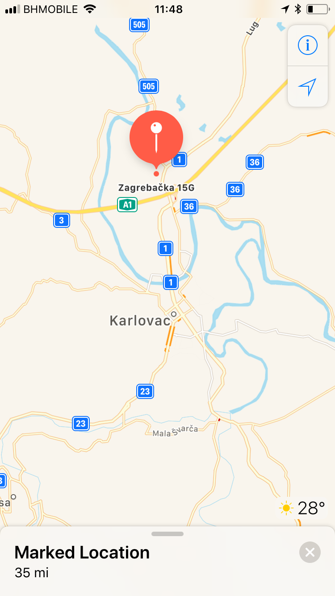

DATE AND TIME OF THE INDICENT: 07/07/2018, 4 am\.

TYPE OF INCIDENT: push back x denied access to asylum procedures x deportation x verbally threatened x robbed x physical violence

DESCRIPTION OF INDICENT: According to Majid, the group of ten started walking from Velika Kladusa and wanted to cross Croatia to Slovenia\. On the way, Majid fell into a river and injured his fingers\. Around Karlovac, in a forest, the men were caught by a group of 5 men, wearing civil clothes \(no uniforms\), equipped with a torches and pistols\. These men drove the whole group to a police station in Karlovac, where they were hand over to the local police officers\. In a police station, the men had to write down their names, nationality, and the names of their parents\. The police officers were verbally attacking the men, telling them that they did not like Arabic and Muslim people\. The whole group was held in the police station for the whole day without a water and food\. Majid expressed his wish to apply for asylum in Croatia, but the officers were ignoring him\. Around 10 pm, a different group of police men \(6 of them\), wearing police uniforms and masks over their faces, took the men into a police van and transported them to the Bosnian border\. By the border, the police took the men out of the car, stole their 6 telephones and 700 euros, and crashed 4 of their phones \(viz\. photo below\) \. After that, they started beating them using batons to their back, legs, arms, and hips, and were shouting at the men: “ _Go, go, go\!”\._ This was Majid’s several unsuccessful attempts to reach asylum in Europe:

_“Every time when I go \[crossing the border\], \[Croatian\] police catch me, fight me, and steal my telephone and my money and speak with me bad\. … I am very tired”_ \(Majid\) \.

INJURIES AND MEDICAL TREATMENT: Majid had several open and infected blisters on his toes from a long walk in inappropriate shoes, cuts on his fingers from a fall into a river, and bruised hip from a police attack by a baton\. Majid went to the hospital in Velika Kladusa to treat his injured fingers from a fall into a river, but he was refused to be checked by a doctor as he lacked an identification document \(passport or ID\) \. He bought a bandage and treated himself\. After the interview, I have referred Majid to the First Aid medics from the No Name Kitchen who treated his injured fingers and bruised hip\.

EXPRESSED INTENTION TO SEEK ASYLUM IN THE COUNTRY: Yes\. DOCUMENTS SIGNED: No\.
**INFORMATION ABOUT THE PERPETRATORS**

PERPETRATORS: The men were caught by a group of 5 police officers in civil clothes and civil car, equipped by a torch and pistols, they used no violence\. They were later deported by a group o 6 police officers, who were wearing masks and were driving a police van, physically attacking the men by batons\.

**PHOTOS OF MAJID’S DAMAGED PHONE**

**10/07/2018 Velika Kladusa \(Bosnia\)**

**Recorded interview by No Name Kitchen**

**3\.** 
**VICTIM\(S\)** 
NUMBER OF VICTIMS: 5 \(interview with one group member\) \.
NAMES: Nasim \(interviewed\)
COUNTRY OF ORIGIN: Afghanistan, Kurdistan
AGE: Between 23 and 26 years old
SEX: Males
MINORS IN THE GROUP: No
**INCIDENT** 
COUNTRY AND LOCATION WHERE THE INCIDENT HAPPENED: Slovenian inner land, Stara Lipa
DATE AND TIME OF THE INDICENT: 03/07/2018
TYPE OF INCIDENT: push back x denied access to asylum procedures x deportation x verbally threatened

DESCRIPTION OF INDICENT: Nasim told me that the whole group started walking from Velika Kladusa early in the morning, crossing Croatia to Slovenia\. They were crossing the roads, mountains, and forests and through such a terrain, some of them got scratches over their hands and legs\. At one point, they had to cross a river although some of them could not swim:

_“We were really scared about the water because the water was so much fast and deep\. Even we could lose our lives because of the water in a river\. We were together the hand by hand and said that if anything wouldhappen, it would happen to all”_ \(Nasim\) \.

After five days of walking, they reached Stara Lipa in Slovenia\. It was around 12 pm and they stopped to sleep for two hours\. The police woke them up and took them to a police station in Stara Lipa, where they were questioned by the about their age, nationality, and the police took their photographs of them\. The men were made sign a document that none of them understood because it was written in the Slovenian language and they were not provided a translator\. Nasim reported to me that the overall behaviour of the Slovenian police was rood:

_“They were acting to me like I was a savage, total savage\. Like I was not a humane\. They were just acting to me like soldiers: “Sit\! Not good\! Bad\!”_ \(Nasim\) \.

After that, the men were transported by a car to another police station one hour away from the one in Stara Lipa, where they had to change their clothes into a grey prison uniforms and spent there one night\. The next day morning, Nasim asked a police officer to apply for asylum in Croatia, but he got a negative response: _“No chance to take asylum here, in Slovenia are 600 migrants and here is no space for more\.”_ Then, the men were transported by a car to the Croatian police who treated them with respect, and who later took them by a car to the Bosnian border, where they were left to walk back\.

INJURIES AND MEDICAL TREATMENT: Scratches on hands and legs from a walk in a forest\. EXPRESSED INTENTION TO SEEK ASYLUM IN THE COUNTRY: Yes\.
DOCUMENTS SIGNED: Yes\. The men were not provided a copy of this document\.

**09/07/2018 Velika Kladusa \(Bosnia\)**

**Recorded interview by No Name Kitchen**

**4\.**

**VICTIM\(S\)**

NUMBER OF VICTIMS: 18 \(interview with one group member\) \.

NAMES: Ali \(interviewed\) \.

COUNTRY OF ORIGIN: Pakistan

AGE: between 16 and 30 years old\.

SEX: Males

MINORS IN THE GROUP: 2 minors in the group: one 16 years old and the other 17 years old\.

**INCIDENT**

COUNTRY AND LOCATION WHERE THE INCIDENT HAPPENED: Croatian inner land, a forest located 6 hours by walk from Velika Kladusa \(Bosnia\) towards the direction to Zagreb\.

DATE AND TIME OF THE INDICENT: 10/07/2018

TYPE OF INCIDENT: push back x denied access to asylum procedures x deportation x verbally threatened x robbed x physical violence

DESCRIPTION OF INDICENT: Ali reported to me that him and other 17 men left Velika Kladusa \(Bosnia\) in the night and walked to Croatia, from where they wanted to continue to Slovenia, and from there to Italy\. They walked for 6 hours and in the inner Croatian land were detected by the group of 6 police men who had a police car and one dog\. According to Ali, once the police men detected the whole group, they run towards them and started beating them with metal batons\. The police did not ask the men any questions and kept beating them for several minutes, including the two minors\. Few men from tried to speak to the police officers, asking them to access the asylum procedure in Croatia, but the police refused to speak to them and only kept repeating: “Stop speaking\!”\. The police officers stole from the men around 2000 euros and their phones \(16 mobile phones\) \. After that, the men were all squeezed into a police car and driven to the Bosnian border, where the police started shouting at them to run and go back to Bosnia\.

INJURIES AND MEDICAL TREATMENT: Bruised back from an attack by the police batons\.
EXPRESSED INTENTION TO SEEK ASYLUM IN THE COUNTRY: Yes\.
DOCUMENTS SIGNED: No\. The men were not taken to the police station or provided any legal procedure\. **INFORMATION ABOUT THE PERPETRATORS** 
PERPETRATORS: 6 police men equipped by batons and pistols, one police car, and a dog\.

**11/07/2018 Velika Kladusa \(Bosnia\)**

**Unrecorded interview by No Name Kitchen**

**5\.**

**VICTIM\(S\)**

NUMBER OF VICTIMS: 10 \(interview with one group member\) \.

NAMES: Mhamad \(interviewed\)

COUNTRY OF ORIGIN: Afghanistan

AGE: between 7 and 30 years old

SEX: males and females \(one family\)

MINORS IN THE GROUP: two minors involved, 7\-years\-old girl and 10\-years\-old boy\.

**INCIDENT**

COUNTRY AND LOCATION WHERE THE INCIDENT HAPPENED: Inner Croatian land, on the Road 3\.

DATE AND TIME OF THE INDICENT: 08/07/2018, 12 am — 1 am\.

TYPE OF INCIDENT: push back x denied access to asylum procedures x deportation x verbally threatened x robbed x physical violence

DESCRIPTION OF INDICENT: Mhamad, other 5 men, and one family with two small children walked from Starlik \(Bosnia\) to Croatia, from where they wanted to continue to Slovenia and Italy\. Mhamad told me that in the Croatian land, on the Road 3 after 16 hours of walk, the group was passing a civil car\. The door of the car opened, and seven police officers jumped out of the car, shouting at the whole group to stop and lie down\. All of them had to lie on the ground with their faces down, including the children, and stayed like this for an hour, not allowed to speak\. While the group was on the ground, the police officers were checking their bags and clothes, searching for telephones and money\. The police officers stole from everyone around 100 and 200 euros \(in the total around 1000 euros\), and their phones\. Mhamad asked one police officer to return his phone, but the officer refused and put the phone into his pocket\. The police crashed the phones of those, who initially rejected to give the phone to them:

_“We asked him to give it back to me\. But if we did not want to give him our phone, he broke it\. Maybe we give a good business to Croatian police because this telephone was for 200 euros”_ \(Mhamad\) \.

According to Mhamad, three men tried to speak to the police, asking them for asylum in Croatia\. But the men were told not to speak and were physically attacked into their arms, back and legs by the police using batons\. After an hour, a chief of the police arrived, and all people were put into a van with no windows, light, and fan\. People could not breath properly inside of the van and Mhamad asked the police officers to open the window of the car to get more oxygen\. But the officers refused, kicked Mhamad into his legs, and shouted at him to stop speaking\. After two hours of waiting in the van, the whole group was transported to the Bosnian border\. When they arrived the Croatian border with Bosnia, the police told everyone to get off the car, and started shooting by a gun into the air and shouting at the people: “Go, go back to Bosnia\! No asylum for you\. Go back to Bosnia\!”\. The children were scared and were crying\. All of them were running till they could not hear the gun shooting anymore, and after that, walked to Velika Kladusa to the camp\. This was the eight time when Mhamad was violently pushed back from Croatia to Bosnia and denied an access to the asylum procedure:

_“Other time, we come to the Croatian border and the police pushed us all to a deep river\. We were holding each other as I could not swim”_ \(Mhamad\) \.

INJURIES AND MEDICAL TREATMENT: Three men \(including two minors\) were injured from an attack by the police batons \(viz\. photos of injuries below\) \. One minor had bruised back, other fractured elbow, and the third men injured the left foot\. The men were treated in the hospital in Velika Kladusa, where a doctor confirmed fractured bones in his elbow of one man\. The injuries were also checked by a No Name Kitchen first aid medic\. According to her, the injured elbow of the minor has been infected because the iron baton that has been used by the police during the push\-back could share infections within the victims once it touches an open wound\.

EXPRESSED INTENTION TO SEEK ASYLUM IN THE COUNTRY: Yes, ignored\. DOCUMENTS SIGNED: No\.
**INFORMATION ABOUT THE PERPETRATORS**

PERPETRATORS: Seven police officers with a dog and civil car\. The officers were wearing army berets\. Two were large and tall\. Only two of them could speak English, other only Croatian\. All of them were equipped by batons and pistols that they used during the incident\.

**PHOTOS OF THE MEN’S INJURIES**

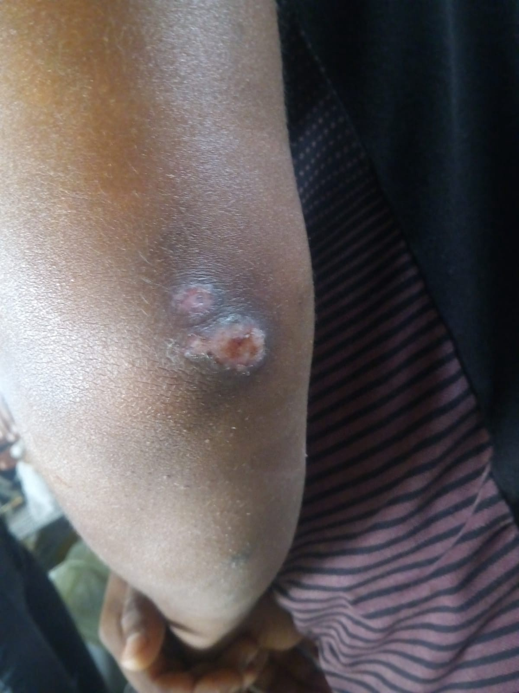

**Fractured and infected elbow from the attack by a police baton\.**

**12/07/2018 Velika Kladusa \(Bosnia\)**

**Recorded interview by No Name Kitchen**

**Wound on a foot from the attack by a police baton\.**

**6\.**

**VICTIM\(S\)**

NUMBER OF VICTIMS: 4 families and 10 single men, in total 30 persons \(interview with one group member\) \.

NAMES: Nadima \(interviewed\)

COUNTRY OF ORIGIN: Afghanistan

AGE: the youngest 1 year old and the oldest 38 years old

SEX: both males and females

MINORS IN THE GROUP: 5 children — 1\-year\-old, 3\-years\-old, 5\-years\-old, 6\-years\-old, and 7\-years\-old\.

**INCIDENT**

COUNTRY AND LOCATION WHERE THE INCIDENT HAPPENED: Croatian inner land, 13 minutes driving by a car from Velika Kladusa, a forest, the specific location unknown\.

DATE AND TIME OF THE INDICENT: 10/07/2018

TYPE OF INCIDENT: push back x denied access to asylum procedures x deportation x robbed

DESCRIPTION OF INDICENT: According to Nadima, four families and 10 single men hired together a smuggler who would transport them by a car from Bosnia to Italy\. The families decided to use the smuggler services as they did not believe in any legal option of border crossing to Europe due to the tight and restrictive controls by the EU external borders\. Nadima told me that some families paid to a smuggler 1000 euro and others 2000 euros in cash \(per the whole family\) for his services\. She further explained that all the families and the men were transported by cars with a smuggler to a forest in the inner Croatian land, located 13 minutes of driving from Velika Kladusa, where they were dropped off to wait for another transport\. The families and the men were waiting in the forest without a shelter and sleeping bags for five days with no further information from a smuggler\. They had only cans of fish food and limited water that they run out after the third day\. Nadima’s mother had heart problems and did not have any more medicine with her so they could no more stay in the forest\. Other families with small children, the youngest was one year old, did not have any more energy to stay in the forest after the fifth day, and decided to get to Croatia by walk\. The families, in total 20 people including small children, started walking further to Croatia, but were detected by the Croatian police after few minutes\. The police officers captured the whole group and started stealing their mobile phones:

_“They took our mobile phones\. And we say, the first time you were breaking our phone and now we don’t haveany other phone\. The men \[police\] checked our bag and they stole our phones\. … We respect the police whenthe catch us because it is their job\. But they don’t respect us\. That is our phones and money and for a refugee,his money is everything because here, we cannot work\. This is not a good \[police\] action”_ \(Nadima\) \.

After that, the police officers transported all 20 people in one car to the Bosnian border, where they just said to them:“That is Bosnia\! Go back\! That way\!”\. When the families asked for the asylum in Croatian, the police rejected to take them to a police station or provide them an access to the asylum procedures\. This was Namida’s third attempt of border crossing with the intention to apply for asylum in Europe\. Nadima reported to me that the previous time, her and her younger siblings were caught by the police in Zagreb, where they also asked for asylum\. That time, the police officers started laughing at Nadima and her siblings and told them: “Ok, we give you asylum”\. Then, Nadima was made to sign a document to fill her name and nationality, but when she filled the paper, her and her siblings were deported by a car to the Bosnian border\.

INJURIES AND MEDICAL TREATMENT: No\.
EXPRESSED INTENTION TO SEEK ASYLUM IN THE COUNTRY: Yes\.

DOCUMENTS SIGNED: No\.

**INFORMATION ABOUT THE PERPETRATORS**

PERPETRATORS: Two police men, one police car\.

**13/07/2018 Velika Kladusa \(Bosnia\) Recorded interview by No Name Kitchen**

**7\.** 
**VICTIM\(S\)** 
NUMBER OF VICTIMS: 4 \(interview with one group member\) \. NAMES: Fethi \(interviewed\)
COUNTRY OF ORIGIN: Tunisia, Iraq, Morocco, Libya\.
AGE: between 20 and 30 years old
SEX: Males\.
MINORS IN THE GROUP: No\.
**INCIDENT**

COUNTRY AND LOCATION WHERE THE INCIDENT HAPPENED: The men were caught in Slovenia and deported to Croatia and from there to Bosnia\. The violent incident happened in Croatia, 3 km away from the official border check point in Velika Kladusa \(Bosnia\) \(viz\. Figure , below\) \.

DATE AND TIME OF THE INDICENT: 11/07/2018

TYPE OF INCIDENT: push back x denied access to asylum procedures x deportation x verbally threatened x robbed x physical violence

DESCRIPTION OF INDICENT: Fethi reported to me that he left Velika Kladusa with his three friends and were walking for six days until they reached Slovenia\. None of them had a battery in their phone anymore and decided to ask the local people to charge their phones in their house\. A local woman suggested to the men to call the Slovenian police who could help them to claim asylum in Slovenia, and the men agreed\. Slovenian police brought the men into a police station and questioned them about how they reached Slovenia, their nationality, and took their finger prints to identify them as none of them had a passport\. The men asked the police if they could apply for asylum in Slovenia, but the police said to them that the asylum procedure was closed for them, without explaining any reasons\. After that, the men were detained in a police station for one night\. Around 3 pm the next day, a police officer came and told the men that they were going to be transported to a Slovenian refugee camp\. However, the men were taken to a prison instead of a camp, where they stayed for the following two days\. While Fethi was detained in a prison, the police accused him to be a smuggler based on the information from his friends, which Fethi denied\. Two days later, Fethi together with other 7 men, whom he did not know, were being deported by a car back to Bosnia\. When they arrived close to the Bosnian border, a police man who was transporting them struggled to find the way to Bosnia, so he asked for the directions in a local police office \(unknown place\), where they offered him to deport the men instead of him\. Once the men reached the Bosnian border, two police officers took their phones and crashed them, and searched through their pockets for money\. The police officers stole from the men in total 600 euros, and after started physically attacking all of them:

_“They \[police officers\] took four people out of the car and beat them with metal batons\. When they stopped beating them, they took other four from a car for the second round, and I was in that group\. One guy was trying to escape while being beaten, but he slipped down and very badly injured his back that he could not walk anymore\. I went out of the car and they were holding my hood and beating me with a baton into my back, leg,and my face\. They \[police\] did not want to let me go and continue beating me\.”_

Fethi and other men managed to escape and were running into the Bosnian inner land, trying to carry the man who got injured his back\. The Croatian police was chasing them and searching for them in the Bosnian land, but they gave up when they could not see the men any more\. Then, Fethi called the Bosnian police who came, were very kind to the men, transported them back to Velika Kladusa, and took them to the hospital for a medical treatment\.

INJURIES AND MEDICAL TREATMENT: Fethi had scratches on his leg, back and his face from an attack by a baton\. One twenty\-five\-years old man had turned bone in his lower back and could not walk properly\. All the men were treated in the hospital in Velika Kladusa, however, did not have any official medical reports\.

EXPRESSED INTENTION TO SEEK ASYLUM IN THE COUNTRY: Yes, denied access to the asylum procedure without specifying a reason\.

DOCUMENTS SIGNED: No\.

**INFORMATION ABOUT THE PERPETRATORS**

PERPETRATORS: Croatian police officer who was using physical attacks while deporting the men could be around 56 years old, tall, medium size, wearing a police uniform, and could speak English\.

**PHOTOGRAPHY OF THE MEN’S INJURIES**

**15/07/2018 Velika Kladusa \(Bosnia\)**

**Recorded interview by No Name Kitchen**

**8\.**

**VICTIM\(S\)**

NUMBER OF VICTIMS: 1

NAMES: Benedict \(interviewed\)

COUNTRY OF ORIGIN: Nigeria

AGE: Benedict is 40 years old\.

SEX: Male

MINORS IN THE GROUP: No\.

**INCIDENT**

COUNTRY AND LOCATION WHERE THE INCIDENT HAPPENED: Slovenia, near the town Venika, from where Benedict was deported to a Croatian police station \(unknown\), and finally to Bosnia, close to Velika Kladusa\.

DATE AND TIME OF THE INDICENT: 08/07/2018

TYPE OF INCIDENT: push back x denied access to asylum procedures x deportation x verbally threatened

DESCRIPTION OF INDICENT: According to Benedict, him and other 9 men walked from Velika Kladusa through Croatia, and from there crossed a river to Slovenia\. When they reached the Slovenian inner land, they decided to split and each continue walking separately\. Benedict walked to a near town, from where he wanted to take a bus further\. But a local girl, around 16 years old, saw him and called the police\. Three police men arrived in a car with a dog and brought him into a local police station\. Since the police caught Benedict, he was trying to explain them his situation, telling them that in his city back in Nigeria is too much killing and bad life situation\. He severally expressed his intention to claim asylum in Slovenia, but the police refused to open an asylum procedure with him and called him to be “over dramatic”\. When they reached a police station, Benedict asked for a legal aid, but the police refused to call a lawyer and shouted at him to stop speaking\. Police acted towards Benedict aggressively and a police lady told him that if he continued asking for asylum, she would have crashed something on his head\. Then, he was made to sign a paper document that he did not understand because it was written in the Slovenian language and he was not provided a translator\. Benedict was then put into a detention cell with other 9 men, where was a lack of oxygen so he had problems to breath there\. After one day, he was deported to Croatia, and from there to Bosnia\.

INJURIES AND MEDICAL TREATMENT: No\.

EXPRESSED INTENTION TO SEEK ASYLUM IN THE COUNTRY: Yes, denied access to the asylum procedure without specifying a reason\.

DOCUMENTS SIGNED: Yes, no copy obtained\.

**INFORMATION ABOUT THE PERPETRATORS**

PERPETRATORS: Slovenian and Croatian police officers\.

**16/07/2018 Velika Kladusa \(Bosnia\)**

**Recorded interview by No Name Kitchen**

**9\.**

**VICTIM\(S\)**

NUMBER OF VICTIMS: 10 \(interview with one group member\) \.

NAMES: Ferdous \(interviewed\)

COUNTRY OF ORIGIN: Pakistan

AGE: 16–24 years old

SEX: Male

MINORS IN THE GROUP: Yes \(3\)

**INCIDENT**

COUNTRY AND LOCATION WHERE THE INCIDENT HAPPENED: Caught in Slovenian inner land, rubbed by the Croatian police by the Croatian\-Bosnian border, around 25 km away from Velika Kladusa

DATE AND TIME OF THE INDICENT: 04/07/2018, 4 am detention, next day in the morning deportation

TYPE OF INCIDENT: push back x denied access to asylum procedures x deportation x verbally threatened x robbed x damage of phones

DESCRIPTION OF INDICENT: Ferdous reported to me that the whole group walked from Velika Kladusa, crossed the Croatian land, and reached a Slovenian village during their eight day of walking, where they got caught by the police\. All the boys were taken to a police station, where they have asked the police to apply for asylum in Slovenia\. But the police refused to them the access to the asylum procedures, saying that Slovenia was full of migrants and they could not apply for asylum there:

_“I asked Croatian police, you \[let\] stay so many people, why you don’t let stay me here? \[I was\] 10 days walkinghere\. You let stay somebody, but not me, what is this? Always police catch me and send back\. This is not fair\.They don’t let me to stay”_ \(Ferdous\) \.

In the police station, the officers were questioning the boys about their age, nationality, and asking them how they reached Slovenia\. One of the boys told the police that he was 16 years old, but he could see that a police officer wrote down that he was 18 years old, which was the false information, leading to his deportation back to Bosnia with no special protection\. Ferdous felt pain in his stomach throughout the whole time of their detention because he did not eat and drink properly for 8 days and asked the police to provide him a medical help\. But the police ignored his request, closed him into a cell without any food and water for 24 hours\. After one day, they were deported from Slovenia to Croatia in a police van\. The boys reported to me that a driver of the van was driving very fast and aggressively for about three hours and everyone was falling from one side to another:

_“It was very small van and no air\. He was driving very dangerously, and people were vomiting\. I asked, please, stop the car, stop the van\. But nobody listened”_ \(Ferdous\) \.

The boys were then deported directly from Croatia to the Bosnian border, where the boys were told of to get off the car and walk back to Velika Kladusa\. According to Ferdous, the Croatian police officers stole from the boys money \(170 euros\) and broke their phones by the border\. Ferdous was then politely asking the police to give them back their money, but the police only said: “Go back\!”\. While the boys were walking to Velika Kladusa, they were stopped by the Bosnian police who helped them to transport back to Velika Kladusa and reach the medical help in the local hospital\. This was the fifth time that Ferdous has tried to reach asylum in Europe:

_“If you go to Croatia and you get caught, they directly deport you\. They don’t give you water, no food\. If you die, no problem police\. … But I need to go go go again\. No problem, I try again”_ \(Ferdous\) \.

INJURIES AND MEDICAL TREATMENT: No\.

EXPRESSED INTENTION TO SEEK ASYLUM IN THE COUNTRY: Yes, denied access to the asylum procedure without specifying a reason\.

DOCUMENTS SIGNED: No\.

**INFORMATION ABOUT THE PERPETRATORS**

PERPETRATORS: Slovenian and Croatian police officers\.

**PHOTOGRAPHY OF DAMAGED PHONES**

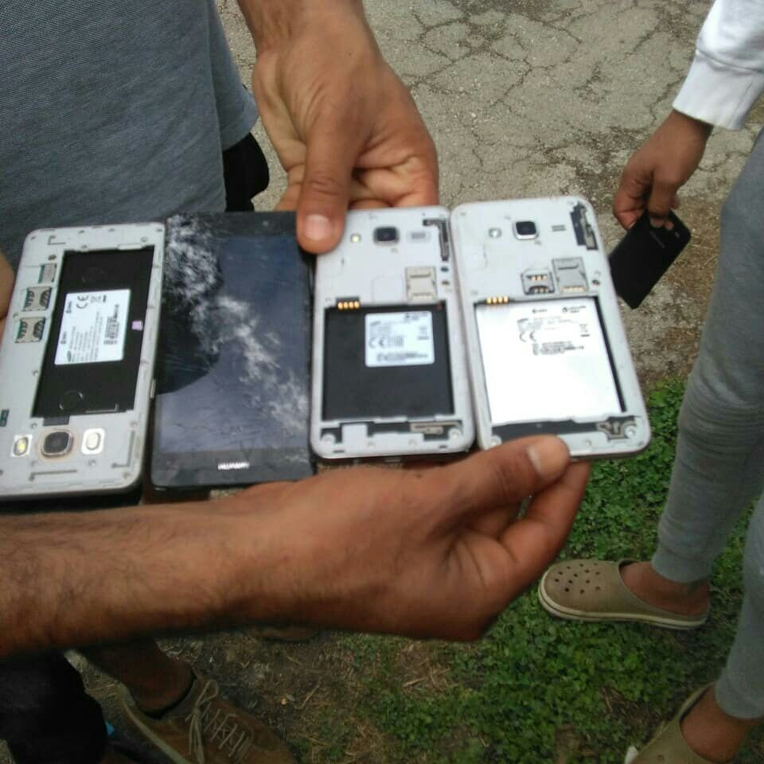

**14/07/2018 Velika Kladusa \(Bosnia\)**

**Recorded interview by No Name Kitchen**

**10\.** 
**VICTIM\(S\)** 
NUMBER OF VICTIMS: 7 \(interview with one group member with the help of a translator from Pashtu to English\) NAMES: Samir \(interviewed\)
COUNTRY OF ORIGIN: Afghanistan\.
AGE: 16–42 years old\.
SEX: Males\.
MINORS IN THE GROUP: One 16\-years\-old boy\.
**INCIDENT**

COUNTRY AND LOCATION WHERE THE INCIDENT HAPPENED: The men were detected in the Slovenian inner land, after the crossing of the river Sava, on a road\. Violent action by the Croatian police happened by the Croatian\- Bosnian border, close to the official border\-check point in Velika Kladusa \(the specific location is unknown as themen’s phones where they had GPS were stolen and they were transported in a van with dark windows\) \.

DATE AND TIME OF THE INDICENT: 17/07/2018

TYPE OF INCIDENT: push back x denied access to asylum procedures x deportation x verbally threatened x robbed x physical attack

DESCRIPTION OF INDICENT: The group of 7 men, including one minor, walked from Velika Kladusa through Croatia until they reached the river Sava on the Croatian\-Slovenian border, which they crossed\. After few minutes of walking in the inner Slovenian land, they were detected by two Slovenian police officers\. When the police caught the men, they called other 20 police men who arrived with a big van and transported the men to a near police station\. In thepolice station, the police officers took the men’s finger prints for their identification and after detained them for one day in the station\. Samir and Osman kept asking the police for asylum in Slovenia, and the police responded only: “Ok”\.But after one day of detention in the police station, all the men were deported to Croatia, without any access to asylum procedure and explanation of their denial in Slovenia\. In Croatia, they were handed over to the team of Croatian police officers, who transported them to the Bosnian border, close to the official check\-point, for their deportation\. Samir further reported that when they reached the Bosnian border point, the police searched through the men’s pocketsand stole all of their money and phones\. Samir again tried to ask the Croatian police for asylum, but instead of verbal response, he was physically attacked by metal batons:

_“Croatian police beat me here \[pointing under his left eye\], you see\. And here, also \[pointing at his bandaged hand and arms\] \. I asked for asylum, you know\. I just asked for asylum, but they did not accept it, they just attacked me and after said: “Shut your mouth and go back\.” And directly go back to Bosnia\. And after, I was feeling more pressure, and asked for some water the police, because the blood was coming under my eye\. But they told me no water, they refused my request”_ \(Samir\) \.

When other men saw how the police attacked Samir, they were scared and did not talk throughout the whole deportation process\. Samir told me that this was his third attempt to try to cross the border from Bosnia to Europe and exercise his right to claim asylum in Europe, and explained me his frustration from his denial:

_“I have worked for military in Afghanistan, Kandahar, very dangerous place, for 6 years\. Taliban was sending me letters, saying they kill me if I continue to cooperate with my American friends\. Many people died from my village\. I can’t go back\. I have all documents in my hands and can give them in other country in any immigration department\. But the way is closed now, and we don’t know where we go”_ \(Samir\) \.

INJURIES AND MEDICAL TREATMENT: Samir had scratches under his left eye and fractured bone in his right toe caused by the attack by metal batons\. Samir was treated by the MSF team in the makeshift camp in Velika Kladusa\.

EXPRESSED INTENTION TO SEEK ASYLUM IN THE COUNTRY: Yes, denied and physically attacked\. DOCUMENTS SIGNED: No\.
**INFORMATION ABOUT THE PERPETRATORS** 
PERPETRATORS: 20 police men, one big van\.

**PHOTOS OF SAMIR’S INJURIES**

**Scratches on Samir’s face from the attack by a police baton\.**

**19/07/2018 Velika Kladusa \(Bosnia\)**

**Recorded interview by No Name Kitchen**

**Samir’s injured arm from the attack by a police baton\.**

**11\.**

**VICTIM\(S\)**

NUMBER OF VICTIMS: Family of 5 \(interview with one group member — mother with the help of a translator from Farsi to English\) \.

NAMES: Fatima \(interviewed\)
COUNTRY OF ORIGIN: Iran
AGE: 15–40 years old\.
SEX: both males and females
MINORS IN THE GROUP: 1 \(15\-years\-old Iranian girl\) **INCIDENT**

COUNTRY AND LOCATION WHERE THE INCIDENT HAPPENED: Croatian border zone\. Two places of deportation — son was deported with other single men from the location close to Bihac \(viz\. **Map location 1** , below\) and the rest of the family in a mountain place around 25 km from Velika Kladusa \(viz\. **Map location 2** , below\) \.

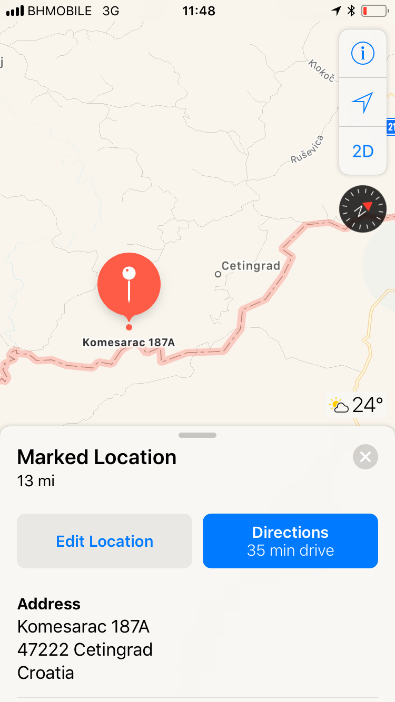

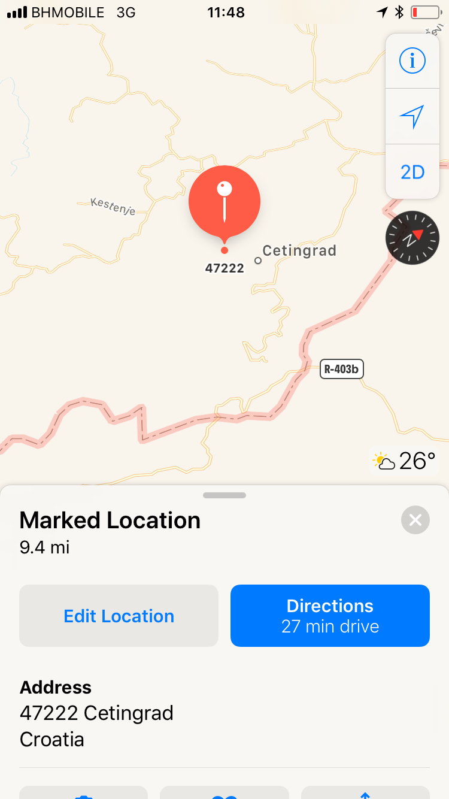

**Map location 1 Map location 2**

DATE AND TIME OF THE INDICENT: 21/07/2018, 10 am

TYPE OF INCIDENT: push back x denied access to asylum procedures x deportation x verbally threatened x robbed x damage of phones x physical violence x sexual harassment

DESCRIPTION OF INDICENT: Fatima’s family and other men from their camp left early morning Velika Kladusa and walked through the Bosnian border to Croatia\. The family hoped to reach the European land and apply for asylum, explaining to the EU authorities that they cannot live in Iran due to the oppressive and violent Government\. When the whole group walked through Croatia, around 25 km from the Bosnian border, they were detected by 5 police Croatianpolice men\. The family tried to speak to the police and ask for asylum, but the only respond they got back was: “Shut up\!”\. The police started searching through the pockets of all people for their phones and money that they stole and destroyed their old phones\. After that, the police stripped all men naked and frisked their bodies\. When they were done with the men, the police told all women to get naked and touched their all body parts, including the breast and genitals:

_“They checked all our body, everything, took our clothes\. Outside, all men could see us, our underwear\. Theyjust told the men to put their faces to the other side\. All women were checked even under their underwear\.They also checked my hair\. They checked everything”_ \(Fatima\) \.

One woman tried to resist to the body frisk and pushed a police officer away from her, but the police officer started beating her that the woman fell on the floor\. Following the body check, the police transported all people in a big van to another place, which they could not identify because the van had dark windows\. The car was driving so fast, thatFatima’s older daughter started vomiting\. Fatima asked the police to stop and give them water because her daughter was not feeling well, but they got no response\. After 30 minutes, they reached a mountain place and were told to get off the car\. Then, the police stood into a circle and told all single men \(5\) to come to stand in the middle of that circle, and started attacking them with metal batons:

_“The refugees were in the middle of the circle\. The police like a circle, and they were beating them with batons\.5 police men on 5 single\. Every police man was beating one single men and kept beating them\. One man was crying and other was vomiting, they wanted to go back to Bosnia, but the police kept beating them\. After when they finished, we walked a bit to the Bosnian land and the police again kept beating them, again 5 policemen were beating 5 men\.”_ \(Fatima\) \.

When the police stopped beating the men, they took the men into a car and deported them to close to Bihac, includingFatima’s son\. The families were transported to the deportation to a different place\. The van was driving again very fast and people were falling from one side of the van to the other\. After one hour, the driver stopped in a mountain place for their deportation:

_“When we opened the car, they \[police\] said to us to come out\. We saw just tall mountains, very steep,surrounded by trees and thorny plants \[showing scratches around her legs and feet\] \. The police said to us to come here, and my bigger daughter was vomiting in the car, she was sick, and my husband was holding her and coming with her out of the car\. I was walking out of the car in front of my husband\. I could hear that the police started beating him with batons, but I did not see it as I was with my back towards him, walking in front\. My small daughter was walking as the last one and she saw her father being beaten\. When my daughter sawher father being beaten, she said to the police: “Please, stop beating my father and beat me instead of him\.”And the police started beating my daughter \[pointing at her daughter’s swollen eye and crying\] \. In this mountain way, the police said to me: “Go straight go back\!”\. But I told him, “Where back? Where? I don’t knowwhere\.” as there was just a steep hill full of threes and thorny plants\. The police took a gun and put it into my head and shouted: “Go, go, go\!”\. and I was so scared, I thought he was going to kill me \[crying\]”_ \(Fatima\) \.

The whole family walked for one hour in a forest, trying to find the way back to Velika Kladusa\. When they reach aroad, they tried to wave on the passing cars to stop them, but none stopped\. After a while, Fatima’s daughterjumped into the road in front of the car to make the driver to stop and helped them\. The driver took them the whole way to Velika Kladusa and offered them food and water, which Fatima refused\. After, 20 km, the family reached Velika Kladusa\.

INJURIES AND MEDICAL TREATMENT: The first aid medics from the No Name Kitchen team, who treated the whole family, observed these manifestations: second grade contusions on the left eye of the fifteen years old girl caused by a physic aggression without object\. On the left side, the medics found an injury cause by first grade contusions because of a non sharp object, causing a hematoma all along the left side\. Furthermore, 21 years old man had stretches and wounds on his back cause by the attack of a metal baton \(viz\. photos of injuries below\) \.

EXPRESSED INTENTION TO SEEK ASYLUM IN THE COUNTRY: Yes, ignored by the police officers\.

DOCUMENTS SIGNED: None\.

**INFORMATION ABOUT THE PERPETRATORS**

PERPETRATORS: Group of the 5 police men\. All of theme were tall men with the police uniforms, the one who was the most brutal had blue eyes and blond hair\.

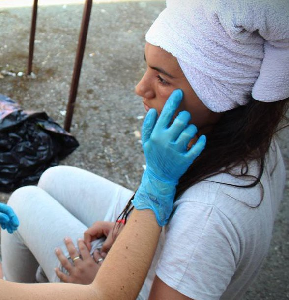

**PHOTOS OF INJURIES OF THE FAMILY**

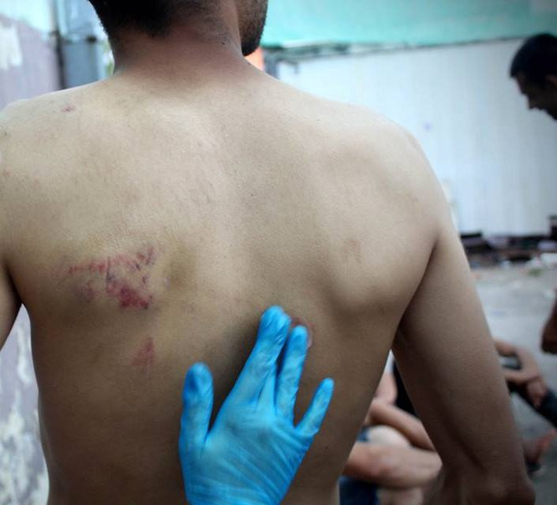

**23/07/2018 Velika Kladusa \(Bosnia\)**

**Recorded interview by No Name Kitchen**

**12\.**

**VICTIM\(S\)**

NUMBER OF VICTIMS: 8 \(interview with one group member\) \.

NAMES: Fares \(interviewed\) \.

COUNTRY OF ORIGIN: Libya, Algeria, Palestine\.

AGE: 25 years old\.

SEX: Males\.

MINORS IN THE GROUP: No\.

**INCIDENT**

COUNTRY AND LOCATION WHERE THE INCIDENT HAPPENED: Slovenia, in a forest close to the village called Malicka \(viz\. Map below\) \.

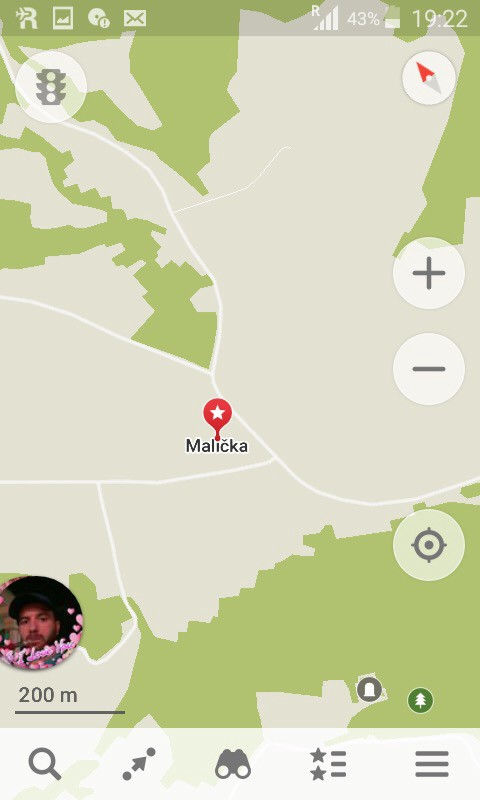

**Map location**

DATE AND TIME OF THE INDICENT: 16/07/2018, 2 pm

TYPE OF INCIDENT: push back x denied access to asylum procedures x deportation x verbally threatened x physically attacked

DESCRIPTION OF INDICENT: Fares and other men walked for 6 days from Bosnia \(Velika Kladusa\) to Slovenia\. When they reached a forest nearby the village called Malicka, located in the inners Slovenian land, the men were caught by the police:

_“They \[Slovenian police\] caught us, we went to the small car, 8 people like prisoners, no food, no water, nolight inside of the car\. They treat me like an animal, no food, no water, nothing\. It looked like box inside of thevan\. We talked with him, he said: “Don’t say anything”\. I asked for asylum, but he said: “No asylum in Slovenia, asylum is closed”_ \(Fares\) \.

Slovenian police took the men’s finger prints, identified their nationality and age\. After that, the police frisked themen’s pocket and body, but did not steal any money from Fares because he hid them under his fingers and after into his mouth\. When Fares showed the police his identification documents from Bosnia, a police officer ripped them off\. After that, the men were closed into a container of the van, where they had problem to breath as there was a lack of oxygen\. Fares asked the police to open the door and provide them food and water, but the police responded by verbal threats and physical attacks:

_“Me and my friend, we had a problem to breath\. There was no oxygen in the container\. I say them \[police\] please, I don’t have oxygen, but they close the door, and started beating on the door of the container with batons, and after pushing us, and my friend fell down\. He pushed my friend two times\. He \[police officer\] say:“Why are you coming to the border? Why are you coming to Slovenia?”, and pushed my friend on the floor andafter beating him with batons to his shoulders\. My friend was asking them to stop”_ \(Fares\) \.

After the police stopped attacking Fares’ friend, they started questioning Fares, and verbally and physically attacking him:

_“They pushed me and said to me, “Speak to me\!”, and took a dog close to me and he was barking to my face\.I said “I am like you, why you act like this? Just that you have a paper and I don’t have a paper?”\. He asked mewhere I was from and I said I was from Libya\. But they said, “No, you are not from Libya\!”\. They did not trust me that I was from Libya, I don’t know why\. They kept calling me “PIcko Matra” \[mother fucker\] \. They talked with me like with a terrorist”_ \(Fares\) \.

After 50 minutes of detention in the van, Slovenian police transported the men to Croatia, where the men were handed over to the Croatian police officers\. Croatian police transported the men directly to the Bosnian border, where the men were told to walk back to Velika Kladusa\.

INJURIES AND MEDICAL TREATMENT: No\.
EXPRESSED INTENTION TO SEEK ASYLUM IN THE COUNTRY: Yes, denied\. DOCUMENTS SIGNED: No\.
**INFORMATION ABOUT THE PERPETRATORS** 
PERPETRATORS: Slovenian police officers\.
**24/07/2018 Velika Kladusa \(Bosnia\)**

**Recorded interview by No Name Kitchen**

**13\.**

**VICTIM\(S\)**

NUMBER OF VICTIMS: 23 \(the interview was conducted with the whole family, but the 18\-years\-old son ‘Jacob’ andtwo\-months\-pregnant woman could speak the best English, so they translating the testimonies of the other family members from Kurdish to English\.

NAMES: Jacob and Esra \(two group members and translators\) \. COUNTRY OF ORIGIN: Syria \(Kurdish\)
AGE: 4 months old — 38 years old\.
SEX: Males and females

MINORS IN THE GROUP: 5 children involved — the youngest one was 4 months old, the next 1 year old, 2, 4 and 5 years old\. In the group were also two pregnant women — one 2 months pregnant and the other 9 months pregnant\.

**INCIDENT**

COUNTRY AND LOCATION WHERE THE INCIDENT HAPPENED: Families were caught by the police in the Croatian inner land, a forest close to the village called Begovo Brdo \(viz\. snapshot of Jacob’s GPS below\) \. Deportation happened on the Croatian\-Bosnian border, close to Velika Kladusa\.

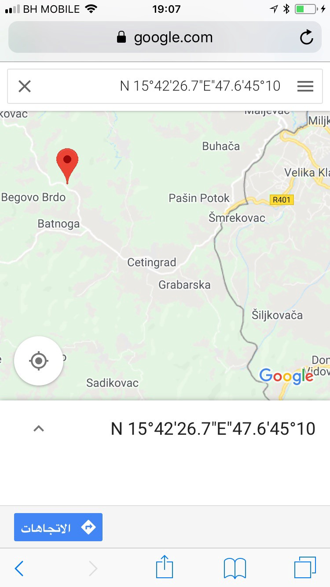

DATE AND TIME OF THE INDICENT: 23/07/2018, 10 pm\.

TYPE OF INCIDENT: push back x denied access to asylum procedures x deportation x verbally threatened x robbed x physical attack

DESCRIPTION OF INDICENT: According to Jacob, the families left the makeshift camp in Velika Kladusa and walked to Croatia with the intention to exercise their right to claim asylum once they reach the EU inner land \(Croatia\) \. Whenthey were walking through the village called ‘Begovo Brdo‘, a local person noticed them and called a police\. Six officers arrived immediately in three police cars and caught the whole group\. Jacob saw how one police officer paid 50 euros to the local person as thanks for calling them and helping them to detect the Kurdish family\. Jacob after asked the police whether they could apply for asylum in Croatia, but he got a negative response and was attacked by the officers:

_“I was telling them \[police officers\] that we are from Syria and asked for asylum\. But they said only: “Shut up\! Don’t talk\!”, and spitted on us\. I tried to speak to him again five minutes later, saying that we have women and children\. But they started attacking us with batons\. They attacked this man \[pointing at the father of two small children\] to his both arms, and after started attacking everybody\. Ok, he attacked the man, but why he attacked the women and children? Are they crazy? He also attacked the pregnant women into her back”_ \(Jacob\) \.

The police did not allow the families to access the asylum procedures and did not take them to a police station\. Instead, they drove them by a car to the Bosnian border for their deportation \(20 minutes driving\) \. When the car reached the border, the police opened a door and said to the whole group to get off and go back to Bosnia\. Jacob startedquestioning the police, “Why are you acting like this? We are from Syria, you know that we have problem there”\. But the police only responded, “Go\! Shut up\!” and pushed into a one\-year\-old child and started beating the whole group again by a baton\. Then, the police officers stole from the whole group 500 euros, their new mobile phones, and destroyed their old phones, smashing them on the ground\. After, the police told the families to walk back to Bosnia, shouting at them to walk faster\. The 9\-months pregnant woman did not feel well and told it to the police officer, asking for help, but the police man spitted on her and shouted at everybody to keep walking fast\. The whole group got back to the makeshift camp in Velika Kladusa late night\.

INJURIES AND MEDICAL TREATMENT: The whole family were checked and treated by the first aid medics from the No Name Kitchen team\. According to the medics, four adults \(two women and two men\) and one\-year\-old baby had bruises around their body from the attack by the police using batons \(viz\. photos of injuries below\) \. One man had fractured bone in his left toe \(viz\. photos of injuries below\), also from the attack by a baton\.

EXPRESSED INTENTION TO SEEK ASYLUM IN THE COUNTRY: Yes\. The police denied the access to the asylum procedure and reacted by the physical attack\.

DOCUMENTS SIGNED: No\.

**INFORMATION ABOUT THE PERPETRATORS**

PERPETRATORS: 6 police officers in 3 cars, three wearing army uniforms and three police uniforms\. All the men were tall, 5 of them looking strong and one overweight\.

**PHOTOS OF THE FAMILY INJURIES**

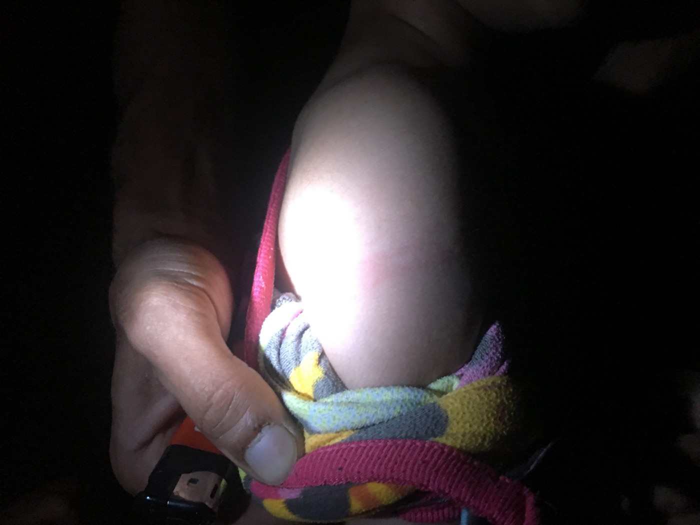

**Bruise on the left arm of a one\-year\-old child from the push by a police officer\.**

**28/07/2018 Velika Kladusa \(Bosnia\)**

**Recorded interview by No Name Kitchen**

**14\.**

**VICTIM\(S\)**

NUMBER OF VICTIMS: 5 \(interview only with one group member\) \.

NAMES: Abdul \(interviewed\) \.

COUNTRY OF ORIGIN: Iraq and Syria\.

AGE: 19 years old — 46 years old\.

SEX: Males\.

MINORS IN THE GROUP: No\.

**INCIDENT**

COUNTRY AND LOCATION WHERE THE INCIDENT HAPPENED: Croatian inner land, a town \(men did not remember the name of the town and lost the exact GPS location as their phones were broken by the police\) \.

DATE AND TIME OF THE INDICENT: 28/07/2018, 7 am

TYPE OF INCIDENT: push back x denied access to asylum procedures x deportation x robbed x physical attack

DESCRIPTION OF INDICENT: Abdul told me that him and other 4 men left Velika Kladusa and wanted to cross to the EU inner land to apply for asylum\. Abdul and his friends reached a small town in the Croatian inner land and wanted to continue by a bus to Zagreb, but they were detected by 5 police men\. Abdul asked the police whether him and other men could apply for asylum in Croatia, but the officers ignored his request\. Then, the police transported all the men by a police car directly to the Bosnian border for their deportation, without taking them to a police station or enabling them to access the asylum procedures\. When the men reached the Bosnian border, the police told all of them to get naked, including taking off their underwear, and one officer frisked their bodies, searching for their mobile phones and money\. According to Abdul, the police broke their old phones and kept the new once and stole from them in total 5000 euros\. After that, the officers shouted at the men to go back to Bosnia and started physically attacking them:

_“First, they took my money and broke my telephone and after, they were fighting me and kicking me into my legs and shouting to go\. I asked him, why you do this? Respect\. Why you do this? This is wrong\. We are not guilty\. We just want to go away\. I just want to go to my family\. I don’t want to stay in your city\. But he kept shouting to go back to Bosnia … This was the first time when we tried to cross the border from Bosnia\. And we lost everything\. Now, how we go? Everything is gone\. We have nothing\.”_ \(Abdul\) \.

INJURIES AND MEDICAL TREATMENT: Abdul had bruised arm caused by the attack by a police baton\. He did not seek any medical aid and refused to do so even after the interview\.

EXPRESSED INTENTION TO SEEK ASYLUM IN THE COUNTRY: Yes, the police ignored their request\. DOCUMENTS SIGNED: No\.
**INFORMATION ABOUT THE PERPETRATORS**

PERPETRATORS: Five Croatian police officers with two police cars\. None of the officers could speak English accept few words\. All of them were at the age between 40 and 50 years old\. Two of them were acting violently and attacking the men, one of them was big and overweight, another one was tall with blond hair and blue eyes\.

**PHOTOS OF THE MEN’S BROKEN PHONES AND ABDUL’S INJURED ARM**

**29/07/2018 Velika Kladusa \(Bosnia\)**

**Recorded interview by No Name Kitchen**

**15\.** 
**VICTIM\(S\)** 
NUMBER OF VICTIMS: 1
NAMES: Azzam \(interviewed\) with the help of a translator from Farsi to English\. COUNTRY OF ORIGIN: Afghanistan\.
AGE: 47 years old\.
SEX: Male\.
MINORS IN THE GROUP: No\.
**INCIDENT**

COUNTRY AND LOCATION WHERE THE INCIDENT HAPPENED: Croatian inner land, around 2 kilometres far from the Slovenian border \(specific location unknown\) \. The violent attack by the police took part by the Croatian\-Bosnian border, nearby Bihac\.

DATE AND TIME OF THE INDICENT: 26/07/2018

TYPE OF INCIDENT: push back x denied access to asylum procedures x deportation x verbally threatened x robbed x physical attack

DESCRIPTION OF INDICENT: Azzam walked from Velika Kladusa to Croatia, and from there to Slovenia\. When he was in the Slovenian inner land, maybe half an hour after he crossed the Croatian\-Slovenian border, the police caught him and deported him back to Croatia, where he was handed over to the police officers\. The Croatian police was transporting Azzam for his deportation back to Bosnia\. But the car suddenly stopped after two minutes of driving, still close to the Slovenian border, and the police told Azzam to get off the car\. Then, the officers started physically attacking Azzam\. One officer told Azzam to lean on his knees and put his head on the ground\. Then, another policeofficer sat on Azzam’s head and was pushing his head with his whole weight to the ground for about 8 minutes:

_“When the police was beating me, I was very scared, I thought that the DAESH \[ISIS\] was trying to kill me here in Europe\. I came to Europe to be safe and to get help and I found this”_ \(Azzam\) \.

Following this violent incident, the police told Azzam to get back to the car and transported him to the Bosnian border, close to Bihac, for his deportation back to Bosnia\. Once he arrived close the Bosnian border, the police stole Azzam’sshoes and told him to walk back to Bosnia\. Azzam was firstly walking barefoot, but after, he found a pair of sandals on the way while he was walking to the city of Bihac as according to him, this are is the common place of deportation, so it is full of possessions of those being deported there\.

INJURIES AND MEDICAL TREATMENT: Abdul had two big poles on his forehead caused by the physical attack of a police man who was sitting on his head \(viz\. photos of injures below\) \. He refused to search a medical aid after the incident\.

EXPRESSED INTENTION TO SEEK ASYLUM IN THE COUNTRY: Unknown\. DOCUMENTS SIGNED: No\.
**INFORMATION ABOUT THE PERPETRATORS** 
PERPETRATORS: Two Croatian police officers who had 1 car, no dogs\.

**PHOTOS OF AZZAM’S INJURED FOREHEAD**

**27/07/2018 Velika Kladusa \(Bosnia\)**

**Recorded interview by No Name Kitchen**

**16\.**

**VICTIM\(S\)**

NUMBER OF VICTIMS: 16 \(interview only with one group member\) \.

NAMES: Sangeen \(interviewed\)

COUNTRY OF ORIGIN: Sangeen is from Afghanistan\. Other men from the group are from Afghanistan, Pakistan and Algeria\.

AGE: Sangeen is 18 years old\.
SEX: Both males and females \(one family in the group and others single men\) \. MINORS IN THE GROUP: 1 \(15 years old girl\) \.

NOTE: Sangeen was trying to attempt to cross the border to Croatia together with Fatima’s family \(viz\. the case 11\),but the interviews and testimonies were conducted separately to capture two different perspectives of the border violence, the one of the single men and the one of the women and families\.

**INCIDENT**

DATE AND TIME OF THE INDICENT: 21/07/2018, 11:00am\.

TYPE OF INCIDENT: push back x denied access to asylum procedures x deportation x verbally threatened x robbed x physical attack x sexual harassment

COUNTRY AND LOCATION WHERE THE INCIDENT HAPPENED: Croatian interior\. The group were caught 9 km into the territory along motorway 1 \(nearest town: Slunj\) \. Violence occurred at rural border area, south west of Velika Kladusa \(viz\. approximate GPS location map below\) \.

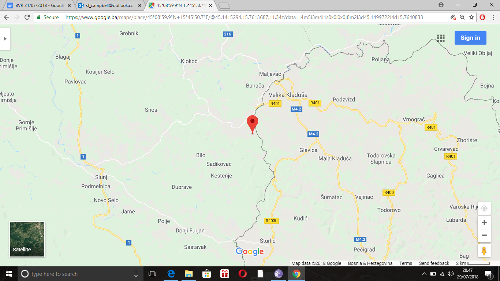

DESCRIPTION OF INDICENT: Sangeen described how the group walked through the night in the Croatian jungle, but at 11am the next morning the police found them\. The group were about 9 km from the border\. The police saw them walking in the trees and they shouted from the road, “Come here, come here\!”\. There were two police officers and they put them in the van\. The groups first words were to ask to claim asylum, which they repeated several times\. Thepolice told them to “shut up”\. The police drove Sangeen and the others back and pushed them out onto a field with some woods at the border with Bosnia\. It was on the south west side of Velika Kladusa, but they did not know where they had taken them\. Firstly, only two police officers made the arrest, but there were 8 more officers waiting at the border\. When Sangeen got out of the car they were waiting with sticks in a line\. He told how the police made sure to steal everything: phones, money, power banks, even cigarettes\. One policeman even took the his can of red bull, they took everything\.

At the border Sangeen described how the 10 police beat the group with sticks, he told me: “They beat me till I couldn’t breath”\. When he fell they kicked Sangeen on the ground and hit him more\. They raised their batons high and “beat us right to the bone”\. After, the group tried to run, but a police officer tripped Sangeen and continued to hit him on the floor\. Sometimes there were four of them all hitting one person at the same time\. They beat Sangeen to the head, smashing his cheek\. They spoke nonsense all the time and the group could smell alcohol on the police officers breath\. The officers that weren’t drunk wouldn’t prevent the beating anyway\. One of them came to a woman and started to frisk her\. The police officer groped her breasts and touched her body\. The woman pushed them back and then the police beat her too the floor\. She was just a young woman, and the strikes brought out long red marks on her stomach\. Eventually the sixteen people escaped and ran towards Bosnia\. Sangeen told us how the police chased them with sticks, beating the people on the back\. They ran after him even after the border\. They were too drunk to even realise what was Croatia and what was Bosnia\.

_“Even if I live to 60 years old I won’t forget the face of one policeman\. He was a tall bald, red\-faced man”\._

Sangeen described how the “game” before this one, this officer had scared him to death\. The perpetrator beat him to the ground and shouted at Sangeen to lie down\. Then he took his gun and fired a shot into the ground, right next to his ear\. “I couldn’t hear anything after that”, Sangeen told us:

_“How far can they go before they blind me? What would happen?”_

The group walked back to Velika Kladusa after that\. They were so shocked that the pain only came some hours later\. Then they knew where the police had hit their bodies\. The women came back and spent all day in the tent\. They were injured and shocked\. Later Sangeen went to the camp to check if they were ok, but they said they felt very bad\.

_“We would take pictures or videos if we could”, Sangeen tells us\. “But the police always break or steal our phones\. We only have the scars to show\.”_

INJURIES AND MEDICAL TREATMENT:

EXPRESSED INTENTION TO SEEK ASYLUM IN THE COUNTRY: Yes, denied\. DOCUMENTS SIGNED: No\.
**INFORMATION ABOUT THE PERPETRATORS**

Many members of the group received painful injuries as a result of the

violence, and had been that morning to the MSF clinic\. Sangeen’s bruising was severe and he was in constant pain\.

The women from the group received first aid from No Name Kitchen\.

PERPETRATORS: Group of 10 Croatian police officers wearing uniforms, no dogs\. All of them used physical violence

against the men and some also against the women\. Sangeen identified an especially violent officer who beat him

during this incident, but also aimed a gun near his head and fired a live round into the ground during a previous

encounter\. The perpetrator was a tall man, bald, with a red face\. He smelled of alcohol on both occasions\.

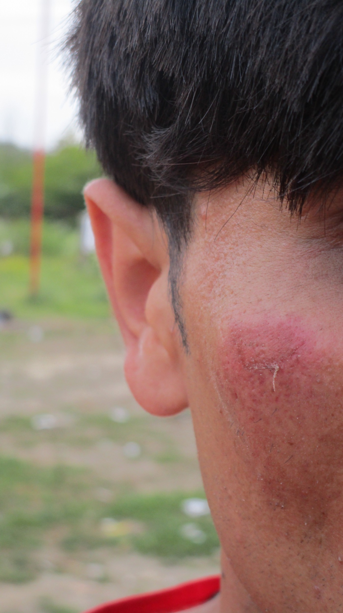

**PHOTOS OF SANGEEN’S INJURIES**

This image on the left shows the laceration and severe bruising suffered as the result of a truncheon/baton striking the right cheekbone of the victim\. The photo was taken only 9 hours after the incident and already the bruising had developed extensively, causing severe pain to the victim and impairing his sight\. The wound had hemorrhaged after impact and was very sore to the touch\.

This image above shows the impact of a baton on the victim’s right collar bone/naval area\. This “follow through” action is consistent with the cheek injury, confirming the type of blow inflicted\. The two wounds corroborate the victims testimony that the officer delivered the blows with great forces from a vertical plain, striking the victim repeatedly with an upward/downward motion\. To draw blood and bruise the skin in such a way suggests that the force applied was great, and could only be consistent with an arm action whereby the offending officer used the full length of their limb, holding the implement above their head, and bringing the weapon down using the shoulder as a pivot\. These wounds could not be delivered with the use of a simple forearm action pivoting from the elbow\.

The photo above shows an injury sustained to the elbow, also inflicted by the police\. The mark is consistent with the use of the victims arms to protect his head from the strike of a baton\. This confirms the testimony of the victim, evidencing the fact that police wantonly began to physically beat the victim \(completely unsolicited\) and that the only recourse was to protect his head from the harsh blows by holding up his arms\. As a result, he sustained bruising and cuts to his forearm, and was unable to avoid injury, despite \(as his testimony confirms\) asking for them to stop because he couldn’t breath\.

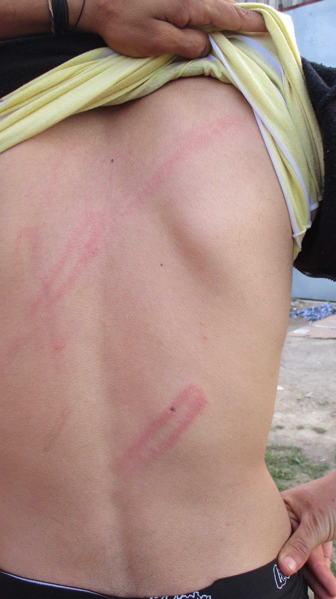

The image on the left shows bruising and friction marks applied to the skin of a companion to the victim\. The marks cover the length of the back and were inflicted by multiple strikes with a baton\. The vertical lines are consistent with the same “overhead” arm action described in the above evidence\. The location of the wounds on the victims back \(stretching from ribcage to torso\) also confirm the testimony provided that the police officers beat the group from behind as they tried to flee the scene\.

**21/07/2018 Velika Kladusa \(Bosnia\)**

**Recorded interview by Balkan Info Van**

**\(All names have been changed with the respect to anonymity of those who have been interviewed\. \)**

_Converted [Medium Post](https://medium.com/are-you-syrious/illegal-push-backs-and-border-violence-reports-velika-kladu%C5%A1a-bosnia-and-hercegovina-july-2018-da04fe8784de) by [ZMediumToMarkdown](https://github.com/ZhgChgLi/ZMediumToMarkdown)._
