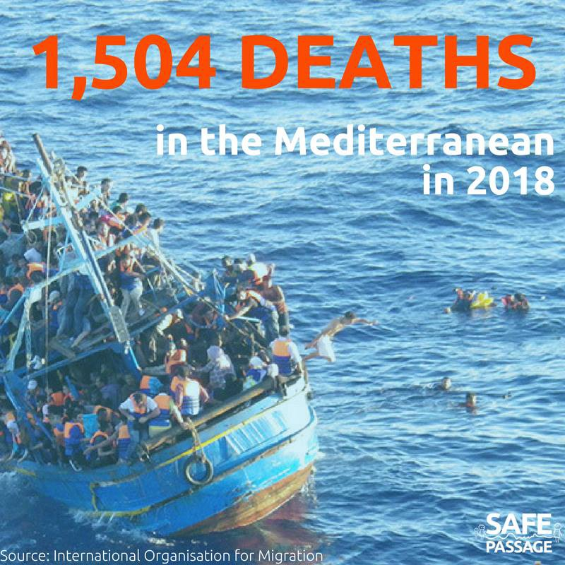
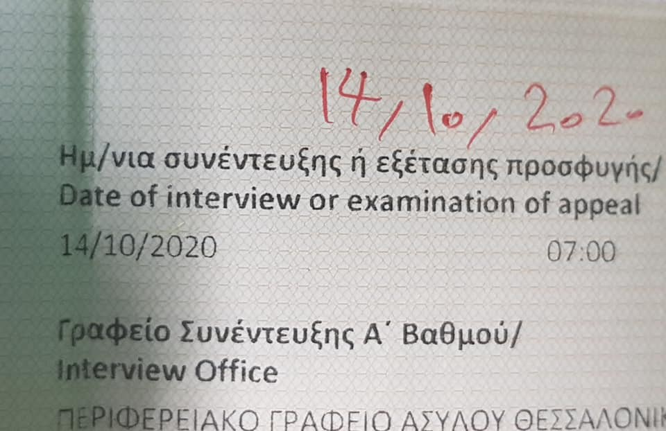
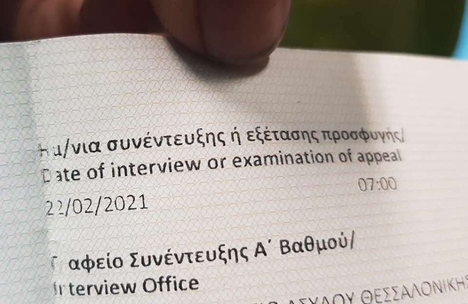

### AYS DAILY DIGEST 4/8/2018: The EU member states are deporting children to Afghanistan

_One third of the 10,453 killed and wounded in 2017 in Afghanistan were minors // During the first half of this year, 1,692 citizens were killed in Afghanistan // This year 1,500 human beings have lost their lives in attempt to cross the Mediterranean // Removing walls and fences is what we as citizens have to do — example from Ventimiglia // UNHCR Greece called police on people who came to ask about cash cards // New rules on asylum in France_

](assets/547752172cb9/1*PHcrIRWUHgLUZYnGrzmvoQ.jpeg)

Photo by [Faces Before Numbers](https://www.facebook.com/FacesBeforeNumbers/?hc_ref=ARTbI236tnDkUGPb7UUqSNVPcxmxFnp_8vKKrO0PPyjsD9xkwaJY7iXKXFDP9K2_Kyc&fref=nf&hc_location=group)
#### Feature: The EU is sending children to death

It is shocking even to report that some governments are deciding to deport children\. Even more when the child is deported to one of the most dangerous countries in the world — Afghanistan\.

However, this was recently the case in The Netherlands, where a vulnerable Afghan family with a minor have been deported to Afghanistan\. A number of child and human rights organisations have reacted with shock to the deportation and all have stressed the danger in which the family will be placed\. They are calling upon the Dutch House of Representatives and Secretary of State Habers to outline what the recent commitment to better protect Afghan families with minors means in practise given this case\.

According to the Global Peace Index 2018, Afghanistan is the most dangerous country in the world after Syria\. The UN Security Council has listed Afghanistan as a ´country at war´\. People who are deported from mostly EU member countries, are arriving in overcrowded Afghan camps where children are starving due to the inhuman conditions and freezing winters\.

One third of the 10,453 killed and wounded in 2017 were minors\. During the first half of 2018, 1,692 citizens were killed\. According to the UN, the total number of people killed in the past ten years has never been as high\.

The coalition of twelve human and child rights organisations have been fighting against deportations to Afghanistan for months\. The coalition is made up of VluchtelingenWerk Nederland, Amnesty International, Cordaid, Defence for Children, Don’t send Afghans back, INLIA, PAX, Kerk in Actie, Oxfam Novib, Save the Children, Stichting LOS and Unicef Nederland\.
#### Sea

Over the last seven months, more than 1,500 human beings have lost their lives in attempt to cross the Mediterranean\.

The number of those who died could be much higher if there were no NGOs and volunteers saving them from the sea\. However, the authorities are doing everything to prevent them from this mission\.

For the last couple of days, as well as on Saturday, the Spanish NGO Proactiva Open Arms was still looking for a safe port to disembark with the 87 people rescued Wednesday night close to Libya\.

On Saturday, over 400 people were saved from drowing\.
#### Italy

In the night between 3rd and 4th August, one part of the fence built a couple of weeks ago by the municipality of Ventimiglia in order to deny access to anyone in the area under the bridge, was removed by the local activists\.

](assets/547752172cb9/1*MAsuLt3QFVm13WqiwdDK6w.jpeg)

Photo by [Progetto20k](https://www.facebook.com/progetto20k/?hc_ref=ARTSaBtS6FU53YvfKulOZgzLK3fiAKoWuDWoI2MGjf2YRpiDrMhGQUuO7E4e_bu-uNU&fref=nf&hc_location=group)
#### Greece

[According to the Aegean Boat Report,](https://www.facebook.com/AegeanBoatReport/?hc_ref=ARTkLtTiQcHQSl_P6DFtYpHyHSg6c6wqxg_4kERiz3Sob0uCYilgUZycB3S9X6mHZg8&fref=nf) on Saturday morning, 22 people were dropped off on the shores of northern Lesvos, all from Afghanistan\. During the night, at around 3am, a dinghy landed near Molyvos with 41 people on board\. In both cases, volunteers were there to help and greet people\.

In July alone 1294 people arrived on Lesvos\.

According to the latest available data, 1,673 persons returned by end of July under the EU\-Turkey deal , inclduing 304 Syrians whose claims were found inadmissible on appeal\.

It is incredible that after years of dealing with asylum seekers, the UN agencies \(as well as asylum offices in Greece and other countries\), need such an extensive amount of time in order to decide on people’s asylum requests\. These are just two of the examples: 14/10/2020 and 22/02/2021\. Over two years that each applicant is having to wait just for their interviews\.

By Erika Rudash

The procedure of getting a cash cards is also very slow\. Some people have been waiting over six months\. The cards are supposed to be issued after max two to three months after aplication\. For some people, cash cards are the only available income\. A volunteer [Mariam J](https://twitter.com/mariamjxde/status/1025785759792594945) \. reports on her twitter about people who are forced into prostitution of crime due to the lack of any kind of income\. Group of peole who are waiting endlessly, in response to this problem, a few days ago went to the UNHCR in Athens asking about the cash cards\. The UNHCR is the supervising body of all cash\-card related issues\. However, most of the UNHCR staff is on holliday, and those who were present ignored people’s demands\. Even more, they called police on people who entered the building\. A number of people were taken to the police station and spent much of the night there\. However, they came back in the morning and continued protesting\.

**Latest by [The Mobile Info Team](https://www.facebook.com/.../a.18000.../2241644919397558/...)**

The Dublin unit has issued a new list of ready\-to\-travel issues\. If you are waiting to be transferred for Dublin family reunification and you would like to check if your case number is on the list, please search via [the following link](http://www.mobileinfoteam.org/list-dublin-transfer) \. Please note, if you have been approved for family reunification, the Greek Dublin Unit will need to contact you by telephone to provide the details of your transfer\.

CALLS FOR HELP

[The Hope Project](https://www.facebook.com/HopeProjectKempsons/?hc_ref=ARSn6Oz8MmKHyx7bnYYIm_j0XKtmzUbrQhgjVukCtLA7BMXcnWJO0wGkNjAtOU6YVuA&fref=nf) needs toiletries and hygiene products\. If you can help, please see their FB page for detials or [donate](https://mydonate.bt.com/fundraisers/thehopeproject) \. 
 
[A Drop in the Ocean](http://www.drapenihavet.no/volunteer/) needs Coordinators for all their locations in Greece\! If you have the opportunity, the skills and are interested in helping — send your letter of motivation and CV to birgit@drapenihavet\.no — TODAY\.
#### Bosnia

Hate speech incited by the part of the local media as well as politicians in Bosnia is showing first results\. People are starting to mobilise and to look for migrants and refugees on their own, in order to expel them from Bihac area\.

One of them is even an active local politician\. On this [FB profile](https://www.facebook.com/sej.ramic) , this persion is using hate speech while calling others to go out and stop and search busses coming from Sarajevo in attempt to look for migrants as refugees\. He is also calling for protests on August 13th in Bihac to demand that the local government stop people on the move from coming to this city and the area\.

Since February this year, the government registered more than 10,000 people who arrived in Bosnia\. Most of them, over 5,000, are in the area of Bihac and Velika Kladusa\. They are forced to live in inhumane conditions, in makeshift shelters or just out in the open\.
#### France

[Solidarité migrants Wilson](https://www.facebook.com/Solidarit%C3%A9-migrants-Wilson-598228360377940/?hc_ref=ARR7yUK8j6zBk3t0KrCR870rrn-NRrRzSTxnmR8iY16fuwANCi_fru-GpIBVLPgmDzU&fref=nf) reports about the [raids over the last couple of days](https://www.facebook.com/598228360377940/videos/956789347855171/) at the Chapel\. The area was left empty of people after the raids\. It is still not clear where the people were moved to\. If you have any information about where these refugees were taken, contact Solidarite migrnats Wilson\.

[Faces Before Numbers](https://www.facebook.com/FacesBeforeNumbers/?hc_ref=ARTbI236tnDkUGPb7UUqSNVPcxmxFnp_8vKKrO0PPyjsD9xkwaJY7iXKXFDP9K2_Kyc&fref=nf&hc_location=group) report about the new asylum and immigration bill that was adopted last week\. As they write, the new bill is “hugely and dangerously jeopardising the right to claim asylum and the rights of the people claiming asylum”\. The group gives three examples:

> People will have a shorter period of time to claim asylum once on the French soil — when the difficulty of getting an appointment to claim asylum — either through the telephonic plateforme or the daily centre means that people can spend days or weeks trying to start their legal procedure\. 

> When the maximum time for detention was 45 days, people can now be detained for up to 90 days — when minors and families are still locked up in detention centres\. 

> When interviews were conducted on a face to face basis, this new law provides that interviews will be more and more conducted in a videoconference basis — dehumanising a bit further the asylum procedure\. 

This is the shower facilities for some refugees in Paris\. There is a man down there trying to stay clean in the horrendous heat\. The municipal showers that refugees could use have been closed and some people are left only with this option\.

 ‎](assets/547752172cb9/1*9PCRQdc3UmNfWEObrB8Usw.jpeg)

Photo by [Sarah Fenby\-dixon](https://www.facebook.com/sarah.fenbydixon.1?hc_ref=ARTc24HTq9b_AiPqppT-ZLxvige5JVCG1jHLla3Lr-89AqJevWfkEq53RQjxsY5GhAI&fref=nf) ‎

[Care4Calais](https://www.facebook.com/care4calais/?hc_ref=ARScnV4DCoGpdIkj9Xw5hl2befa957ZU9Xb7hTmxAM9SQVQUAiFwG5wc7P0EOly5WpQ) is asking for donations\. They found some super cheap deals on essential items that the refugees need\. The list is available on their FB page\.
#### The Netherlands

At the end of June, the Dutch government announced the closing of a number of prisons, including Kamp Zeist refugee prison at Soesterberg, due to overcrowding\. The closure is due to be completed by April next year\. However, this does not apply to the family prison, the ´Gesloten gezinsvoorziening´ \(GGV\) \[‘Closed Family Provision’\] which remains open\.

In recent years, there has been an increase in the number of detained refugees\. On January 1st 2017, 330 people were in immigration detention, on 1 January this year it was 390 people\.

When Kamp Zeist is closed, the detention centers at Rotterdam Airport \(320 cells\) and Schiphol \(Judicial Complex, 450 cells\) will remain in use\.

[LGBTI Refugee Support group](https://www.facebook.com/LGBTAsylumSupport/posts/1039208956254323) published that on Saturday a homeless refugee from Uganda was kicked out of a shelter run by the church\. Apprently, it happened after the nuns that run the shelter found out Justine is a lesbian\. When a volunteer [Mireille Sampimon](https://www.facebook.com/profile.php?id=100004785767950&hc_ref=ARTadnIR4tuLwtx64gJwd9UOKxMlERiEG-dPcrk5w2Ui_1xV4GAuWoPVv_hQMXHmlvQ&fref=nf&hc_location=group) came to pick Justine up, the nuns told her that she was a danger for the children\.
#### UK

LGBT activists have occupied a British Airways\-owned landmark in Brighton to protest the company’s compliance with migrant deportation during the city’s Pride parade [, No Border Network](https://www.facebook.com/freefighters/?hc_ref=ARRgsQnnAopzzAuaZ7r2d7WuzTpyF8ESnUwTDOnYRG973MT0VEDTWic_lFgodCKmVh4&fref=nf&hc_location=group) reports\. A group of people locked themselves in the i360 observation tower on Saturday afternoon, to protest the “jarring hypocrisy” of BA sponsoring Brighton Pride while deporting asylum seekers\.

Sam Bjorn, an LGSM spokesperson, told [PinkNews](https://www.pinknews.co.uk/2018/07/05/lgbt-activists-pressure-pride-sponsor-british-airways-to-end-brutal-migrant-deportations/) : “By providing space for deportations on their flights, British Airways are having a devastating impact on communities across the UK\. British Airways are taking people, against their will, to countries where they risk persecution, or have very little connection to\. Not only is the airline unflinchingly putting people’s lives in danger, it is also making their staff unwillingly complicit in the brutality of the UK’s hostile environment policy,” Bjorn added\.

**We strive to echo correct news from the ground through collaboration and fairness\.**

**Every effort has been made to credit organizations and individuals with regard to the supply of information, video, and photo material \(in cases where the source wanted to be accredited\) \. Please notify us regarding corrections\.**

**If there’s anything you want to share or comment, contact us through Facebook or write to: areyousyrious@gmail\.com**

_Converted [Medium Post](https://medium.com/are-you-syrious/ays-daily-digest-4-8-2018-the-eu-member-states-are-deporting-children-to-afghanistan-547752172cb9) by [ZMediumToMarkdown](https://github.com/ZhgChgLi/ZMediumToMarkdown)._
