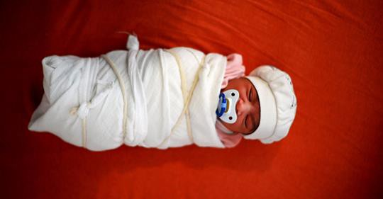
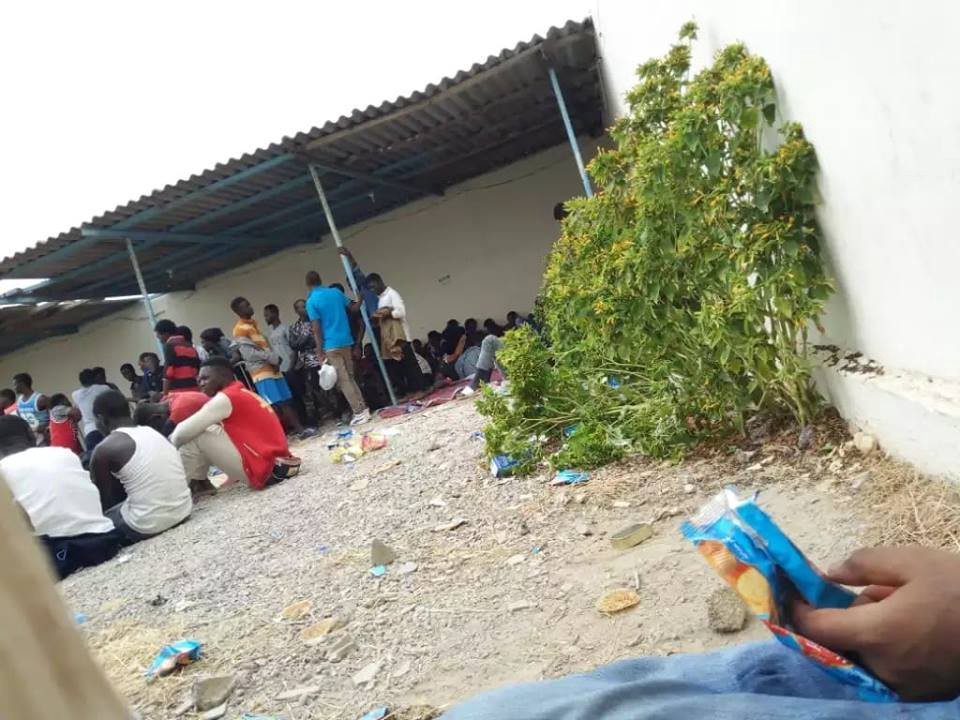

### AYS Daily Digest 08/08/2018: Damning report on huge increase in deaths at sea and detention in Libya
#### Mass arrests in Morocco / Malta continues to block sea rescues / Libya : Fears and risks of trafficking in 7th most dangerous country in world / Germany creates first refugee deportation agreement with Spain

Photo: Gabriel Tizon on Twitter — “A few days ago we had to help a Syrian woman when she was giving birth in a store in Bosnia\. This is Anisse, a beautiful girl who for her parents symbolizes “to continue fighting for a dignified life”
#### [Amnesty International calls on European leaders to take responsibility in light of surging death toll\.](https://www.amnesty.org/en/press-releases/2018/08/responsibility-for-surging-death-toll-in-central-med/)

While the number of people attempting to cross the Mediterranean Sea in a bid to reach a port of safety in Europe has dropped, the number of deaths at sea has increased\.

Arbitrary detention in Libya has also skyrocketed\.

> “European governments are colluding with Libyan authorities to contain refugees and migrants in Libya, despite the horrific abuses they face at the hands of the Libyan Coast Guard and in detention centres in Libya\. Plans to expand this externalization policy across the region are deeply concerning,” said Matteo de Bellis, researcher on asylum and migration at Amnesty International\. 

As European policy is trending towards prevention of migration attempts across the Mediterranean, a report from the European Council on Refugees and Exile \(ECRE\) asks the question: [ASYLUM AT THE EUROPEAN COUNCIL 2018: OUTSOURCING OR REFORM?](https://www.ecre.org/wp-content/uploads/2018/08/Policy-Papers-04.pdf) \.
#### The fortress model of Europe is at odds with human rights\.

In response to common myths and misconceptions [SeaWatch summarises Amnesty report in a thread](https://www.facebook.com/seawatchprojekt/photos/a.1579563625595046.1073741828.1578640155687393/2090883641129706/?type=3&theater&hc_location=ufi) :

> 1\. The EU has a responsibility for human rights violations in Libya due to its support of the so\-called Libyan Coast Guard\. \(p\. 6\) 

> 2\. It is proven that NGOs are no pull factor\. \(p\. 14\) 

> 3\. Tunisia is not a port of safety under international law\. \(p\. 12\) 

> 4\. SAR NGOs are human rights defenders who must be protected against defamation and criminalisation by European states\. \(p\. 16\) 

> 5\. SAR NGOS activities are in full compliance with International Law\. \(p\. 16\) 

> 6\. There is a great risk of [\#AssoVentotto](https://www.facebook.com/hashtag/assoventotto?source=feed_text) becoming a precedent\. A risk that merchant ships will bow to European pressure and therefore follow the instructions of the so\-called Libyan Coast Guard even if this is in breach of international law\. \(p\. 16\) 

### LIBYA

As deportation to Libya continues, the Global Peace Index ranks Libya as the 7th most dangerous country in the world\.

■■■■■■■■■■■■■■ 
> **[MSF Sea](https://twitter.com/MSF_Sea) @ Twitter Says:** 

> > New report from the Global Peace Index ranks #Libya as the 7th most dangerous country in the world. Yet another reason why #migrants and #refugees should not be returned to Libya.  [libyanexpress.com/libya-ranked-7…](https://www.libyanexpress.com/libya-ranked-7th-most-dangerous-country-in-the-world/) 

> **Tweeted at [2018-08-08 14:28:31](https://twitter.com/msf_sea/status/1027199882694746112).** 

■■■■■■■■■■■■■■ 

**_Libya: Uprising of migrants in camps as they fear being sold to traffickers_**

[Paolo Lambruschi writing for Avvenire:](https://www.avvenire.it/attualita/pagine/la-rivolta-dei-migranti-nel-lager-in-libia) Sudden disappearances, UN and diplomats struggle to gain access to the detention camps, severe overcrowding, and a registration deficit\.

> “Tarek Al Matar’s tensions exploded mainly due to the terror of being sold to traffickers, who manage the departures on the boats, but only after having tortured the prisoners to extort ransoms from their families, or sell them as slaves\.” writes Lambruschi\. 

20 people have disappeared in ´recent days´\.

Libyan police have responded to the uprising with terrible force and have wounded three asylum seekers, two of whom had to be hospitalized\.

> “We are desperate, many talk about suicide\. We do not see a way out\. We cannot go back to Eritrea, and Europe does not want us \.” Solomon, quoted in Lambruschi’s article\. 

Many of those detained are refugees and asylum seekers who should, according to law, be in safe countries to seek asylum or free to move\. A third are under the age of 18\.
### MOROCCO

Watch the Med [reports mass arrests in Nador](https://www.facebook.com/watchthemed.alarmphone/?hc_ref=ARSczR_oJQSXW0d1oq4odVgE0htYVAyzNONccjT1X35LjIdHvt-15SAK9v2Rn7jDqB8&fref=nf&hc_location=group) \. 500 arrested and 15 vans planned to move migrants the to south of the country\.

Watch the Med reports that 500 Sub\-Saharan migrants have been detained at a police station in Nador\.
### SEA

> [_SEAEYE_](https://www.facebook.com/seaeyeorg/photos/a.732203640218869.1073741833.728126633959903/1528079807297911/?type=3&theater) _calls for focus on the lives of those who cross the Mediterranean saying that “Especially at the moment, the media focus is strong on the blocked ships\. And it is far away from the experience of the individual\. But this is about people\. People in need\. Let’s help, please\. And help us to help\. With Sea\-Eye II\.”_ 

### MALTA

Malta continues to block NGO vessels from leaving to mount sea rescues\.

Humanitarian NGO vessels Lifeline, Sea\-Eye and Sea\-Watch [demonstrate](https://www.maltatoday.com.mt/news/national/88720/watch_humanitarian_ngos_swim_out_at_sea_with_right_to_life_banner#.W2vMrkxuLmI) in the sea which Sea Watch describes as a ´mass grave´\. Protesting against the blockade the banner read: ´EVERYONE HAS THE RIGHT TO LIFE´, referring to article 2\.1 of the Charter of Fundamental Rights of the European Union\.
### GREECE

LESVOS: Campaign to save PIKPA camp continues\.

■■■■■■■■■■■■■■ 
> **[Lesvos Solidarity](https://twitter.com/Lesvosolidarity) @ Twitter Says:** 

> > PRESS RELEASE in ENG/GR - update #savepikpa campaign: Region must reconsider decision to close Pikpa: ENG: [bit.ly/2M9gMwH](https://bit.ly/2M9gMwH) GR: [bit.ly/2nmHS5C](https://bit.ly/2nmHS5C) https://t.co/oiO4OiGOX9 

> **Tweeted at [2018-08-08 06:25:24](https://twitter.com/lesvosolidarity/status/1027078302077526016).** 

■■■■■■■■■■■■■■ 

ATHENS : Translation services schedule available [**here**](https://www.facebook.com/Greekforumofrefugees/posts/2048161578551971) **\.**
### ITALY

■■■■■■■■■■■■■■ 
> **[Aboubakar Soumahoro](https://twitter.com/aboubakar_soum) @ Twitter Says:** 

> > Una marea di persone sfruttate in marcia per la dignità e i diritti. #BerrettiRossi #Primaglisfruttati #braccianti https://t.co/w4CASwVCqz 

> **Tweeted at [2018-08-08 07:58:39](https://twitter.com/aboubakar_soum/status/1027101771699810304).** 

■■■■■■■■■■■■■■ 

Protests against migrant and refugee labour in Foggia: “Aboubakar Soumahoro, a union official of the USB, summons hundreds of African labourers\. “Today we do not need runways, we need answers”\.

[Dignity](https://www.dinamopress.it/news/la-marcia-dei-berretti-rossi-lo-sfruttamento-nei-campi/) and rights are denied in a system which exploits workers\.
### SPAIN

CEAR are [looking for staff](https://www.cear.es/job-category/ofertas-abiertas/) at new centres in Spain\.

By 8 pm CET last night, [SALVAMENTO MARITIMO reported](https://twitter.com/salvamentogob/status/1027253570226274304) having rescued 516 people yesterday\.

Proactiva reports deliveries of food and medicine:

■■■■■■■■■■■■■■ 
> **[Open Arms](https://twitter.com/openarms_fund) @ Twitter Says:** 

> > Esta mañana @[salvamentogob](https://twitter.com/salvamentogob) #Cartagena nos ha acercado víveres para los náufragos y medicinas necesarias a bordo. Muchas gracias. 
#SalvarVidasNoEsDelito 
Vía @[medinafoto](https://twitter.com/medinafoto) @[reuterspictures](https://twitter.com/reuterspictures) https://t.co/nm2rJG63rJ 

> **Tweeted at [2018-08-08 12:27:05](https://twitter.com/openarms_fund/status/1027169325050937346).** 

■■■■■■■■■■■■■■ 

### FRANCE

MSF mobile clinic will be held on Thursday between 10 am and 4 pm at the Porte de la Chapelle and d’Aubervilliers gates in Paris\.

[Solidarity Migrants Wilson looking for volunteers\.](https://www.facebook.com/598228360377940/photos/a.599438026923640.1073741828.598228360377940/960933960774043/?type=3&theater&hc_location=ufi)
### GERMANY

[Germany to deport refugees to Spain\.](https://www.dw.com/en/germany-and-spain-reach-agreement-on-migrant-return/a-44997574)

Germany made its first bilateral agreement to deport refugees to another European country\. If refugees are apprehended at the German border and Spain was the first port of entry on record with their data recorded in the European Dactyloscopy \(Eurodac\) fingerprint database, they will be deported to Spain within 48 hours\.

The interior ministry predicts that this could apply to approximately five people a day\. This will enter into effect on 11 August 2018\.

This is the first such agreement but the German government has stated that they intend to create more\.

> [Seebruecke:](https://twitter.com/_Seebruecke_/status/1027299981357719554) 
 

> From 25 August to 02 September we will show solidarity with people who are fleeing and rescuers throughout Europe\. Mark this week orange on the calendar\!
 

> We are all [\#seebruecke](https://www.facebook.com/hashtag/seebruecke?hc_location=ufi) \-Europe\-wide\! 

■■■■■■■■■■■■■■ 
> **[Seebrücke](https://twitter.com/_Seebruecke_) @ Twitter Says:** 

> > Es geht weiter!
Vom 25.08. - 02.09. werden wir europaweit Solidarität mit Flüchtenden und Seenotrettenden zeigen. Markiert euch diese Woche orange im Kalender!
Wir alle sind die #seebruecke - europaweit! 
#bridgesnotwalls 
Foto: Dominik Butzmann https://t.co/ixEtwNDrPL 

> **Tweeted at [2018-08-08 21:06:16](https://twitter.com/_seebruecke_/status/1027299981357719554).** 

■■■■■■■■■■■■■■ 

### DENMARK

[**_Businessman to pay fines for women after niqab\-ban_**](https://www.aftonbladet.se/nyheter/a/qnBVG0/miljonaren-aker-till-danmark--betalar-allas-burkaboterMiljonären)

The first women were fined this weekend after the niqab\-ban went into effect in Denmark\. French\-Algerian businessman Rachid Nekkaz has said he will pay, not only this time — but for all women fined for wearing a burka or niqab in Denmark\. “I will pay everybody’s fines every month”, he told the Danish paper Berlingske\. The first fine is 1000 DK \(€130\), the second is 10000 DK \(€13,000\) \. Nekkaz has already paid approximately €245,000 in other European countries where there is similar legislation\. He says this it is not because he is pro\-niqab, it is a matter of freedom of choice and the civil rights of these women\.

The new law has provoked physical attacks, with a [woman reporting](https://www.facebook.com/kvinderidialog/videos/217154362310049/?hc_location=ufi) that her niqab was ripped off in public\.
### UK

DEMOS: LGBT protests against deportations

■■■■■■■■■■■■■■ 
> **[City Plaza Squat](https://twitter.com/sol2refugees) @ Twitter Says:** 

> > #UK: #GayLesbiansSupportMigrants 
#LGBTQU+ communities against #deportations of #migrants and #refugees 

Διαμαρτυρία της LGBT κοινότητας στην Αγγλία για τις απελάσεις προσφύγων https://t.co/1nVVRtiIZC 

> **Tweeted at [2018-08-07 11:07:19](https://twitter.com/sol2refugees/status/1026786861488988160).** 

■■■■■■■■■■■■■■ 

SAFEPASSAGE:

■■■■■■■■■■■■■■ 
> **[Safe Passage 🧡](https://twitter.com/safepassageuk) @ Twitter Says:** 

> > This year we're asking our Gov. to build on the legacy of the Kindertransport by agreeing to take in 10k child refugees from today's crisis. We're sure the refugees of today can contribute just as much to our society as the 'Kinder' have done for the past 80 years. https://t.co/vyOtUr3MqX 

> **Tweeted at [2018-08-08 17:34:16](https://twitter.com/safepassageuk/status/1027246630368698369).** 

■■■■■■■■■■■■■■ 

Kindertransport refers to the 10,000 Jewish children who were given protection in the UK before the outbreak of the Second World War\.
### AYS

The **AYS Info team** is looking for volunteers — **info gatherers and editors** \. All information is available via the AYS FB inbox and the AYS e\-mail address: areyousyrious@gmail\.com\. Please note that this is volunteer work and focused on the protection of refugee rights as its main goal\.

> **We strive to echo correct news from the ground through collaboration and fairness\.** 

> **Every effort has been made to credit organizations and individuals with regard to the supply of information, video, and photo material \(in cases where the source wanted to be accredited\) \. Please notify us regarding corrections\.** 

> **If there’s anything you want to share or comment, contact us through Facebook or write to: areyousyrious@gmail\.com** 

_Converted [Medium Post](https://areyousyrious.medium.com/ays-daily-digest-08-08-2018-damning-report-on-huge-increase-in-deaths-at-sea-and-detention-in-5d8493b26e59) by [ZMediumToMarkdown](https://github.com/ZhgChgLi/ZMediumToMarkdown)._
