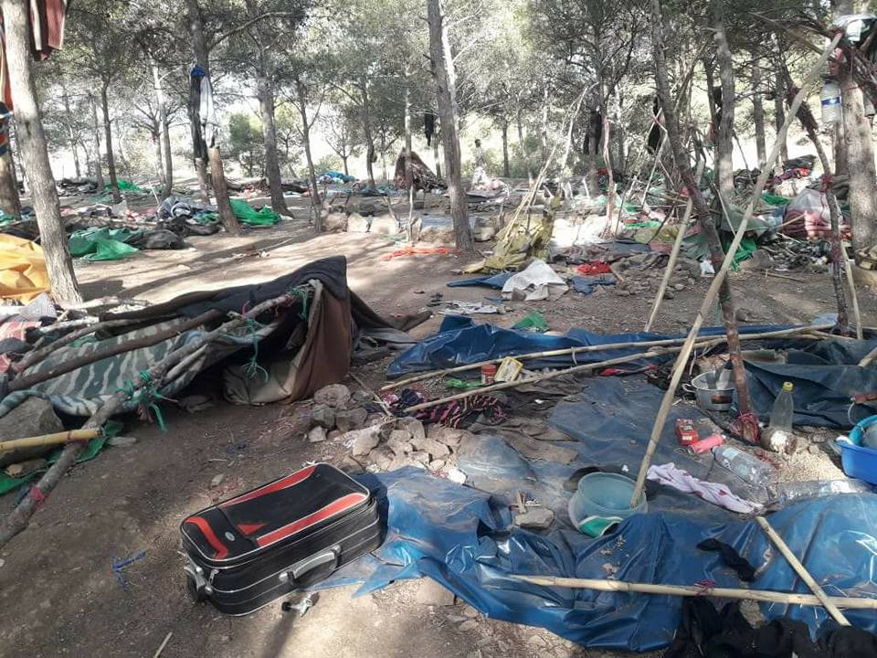

### AYS Daily Digest 10/8/18: More distress at sea, SAR teams need support
#### Prolonged hand of the African and EU policies threatens lives in Morocco / New arrivals and old problems at the overcrowded facilities in Greece / Protesting slavery practices in the south of Italy / France — dire conditions in the north of the “City of Lights”, help needed / What about the Germany\-Spain deal? / Protests in support of SAR missions and against forceful deportations in Germany and The Netherlands / more news

 \)](assets/c466c1c153a6/1*mN_CNCz2zzXdDYbfHhJXgQ.jpeg)

Support to SAR teams across the Mediterranean, Amsterdam \(Photo by: [Wij Zijn Hier](https://www.facebook.com/WijZijnHier/) \)
#### FEATURE

“Last night the Aquarius overheard a radio conversation between the Libyan coastguard & offshore supply vessels about a possible wooden boat in distress\. After alerting the Libyan Joint Rescue Coordination Centre \(JRCC\) via email of our ability to help, we conducted a search\.
 Despite searching all night we had no sighting\. The JRCC did not respond to our radio calls & only answered the phone in broken English after several attempts\. We continued our normal patrol in int’l waters off the coast of Libya\.”

■■■■■■■■■■■■■■ 
> **[MSF Sea](https://twitter.com/MSF_Sea) @ Twitter Says:** 

> > BREAKING: #Aquarius completes a second rescue of the day - a medium wooden boat, overcrowded with 116 men, women &amp; kids, including 67 unaccompanied minors mostly from #Somalia &amp; #Eritrea. Rescue was in int'l waters, 24 nautical miles from the coast of #Libya, north of Abu Kammash https://t.co/aoBdy3FqRr 

> **Tweeted at [2018-08-10 16:31:29](https://twitter.com/msf_sea/status/1027955607159095297).** 

■■■■■■■■■■■■■■ 

■■■■■■■■■■■■■■ 
> **[SALVAMENTO MARÍTIMO](https://twitter.com/salvamentogob) @ Twitter Says:** 

> > Pateras hoy 20h, Estrecho: Concepción Arenal, 2 pateras con 42 y 36  personas, a Barbate y María Zambrano patera con 13 y kayak 2, a Algeciras. Alborán: Calíope con 52 personas, SAR Mastelero con 57, ambos van a Motril. Spica va al rescate de patera en Cabo Gata (10-15 personas) 

> **Tweeted at [2018-08-10 18:10:54](https://twitter.com/salvamentogob/status/1027980623108087809).** 

■■■■■■■■■■■■■■ 

> The EU is failing at its main objective\. Despite a drop in the number of ‘migrants’ arriving in recent months, there has been a spike in the number of deaths\. 

> Current policies appear to be making life more dangerous for those trying to reach the safety of Europe 

](assets/c466c1c153a6/1*FySQhSMLz3e0hPpHRBCP4Q.png)

[Safe Passage](https://www.facebook.com/SafePassageInt/)
#### MOROCCO
### Repression and violence against people continues

The hundreds of migrants arrested yesterday in Tangier and returned by bus were expelled to an area approx\. 5 km away from the city of Tiznit, [Association Marocaine des Droits Humains — Section Nador](https://www.facebook.com/AmdhNador/?hc_ref=ARRqS1xfJsyi6kgOCEatrjc-NmeLOL079dqwhgKqVnNXqjEwfzmjqyy-XtJ21vq4XE0&fref=nf&hc_location=group) reports\.

_It’s 17:30h\. Two buses on which more than 60 Sub\-Saharan migrants leave Nador, Morocco\._ 
_Arrests and refoulement continue\._ — [_Association Marocaine des Droits Humains — Section Nador_](https://www.facebook.com/AmdhNador/?hc_ref=ARRqS1xfJsyi6kgOCEatrjc-NmeLOL079dqwhgKqVnNXqjEwfzmjqyy-XtJ21vq4XE0&fref=nf&hc_location=group)

Along the way, in the bus, according to local volunteers, the people were handcuffed by the authorities, thus preventing basic movement of those who were literally being moved away from the area\.

](assets/c466c1c153a6/1*QK_LqiM5jDzaaZh-gvKsyw.jpeg)

Photo: [Association Marocaine des Droits Humains — Section Nador](https://www.facebook.com/AmdhNador/?hc_location=group_dialog)

> “The buses stopped at 3 a\.m\. in a campaign area\. We knew later that we were 5 kilometres from Tiznit\. Throughout the journey that lasted a day in a very hot climate, the police gave us one bottle of water\. We’re trying to hitchhike or have the money sent to those who can, to be able to return to our homes“\. 

Some intervention and forced expulsions were registered in Nador, against those staying in the provisional camps in the forest\. “This morning, the auxiliary forces attacked us\. They destroyed it, and destroyed it\. The few migrants who were still there have saved themselves, leaving in all directions\. Others have been stopped\.”

](assets/c466c1c153a6/1*2mNCRkQxzk_Hrght_a14Ww.jpeg)

Photo: [Association Marocaine des Droits Humains — Section Nador](https://www.facebook.com/AmdhNador/?hc_ref=ARRqS1xfJsyi6kgOCEatrjc-NmeLOL079dqwhgKqVnNXqjEwfzmjqyy-XtJ21vq4XE0&fref=nf&hc_location=group)
#### GREECE

[Aegean Boat Report](https://www.facebook.com/AegeanBoatReport/?hc_ref=ARSn-vlxXLvnAxvm1OG_mW9X2oaphLuAYP85k99q8A7kMboITi-4fwo4ys7qvlkafrA&fref=nf) team reports that a boat was intercepted outside Chappel, Lesvos north, at 07\.14 this morning by Lithuanian Frontex\. A Frontex helicopter and MoChara from Refugee Rescue were also on the scene\.
Frontex guided the boat to shore, and MoChara sent swimmers to shore to assist\.
The boat landed on Liminjiki beach at 07\.38\. Lighthous Relief assisted after landing\.
There were 13 people on board: 6 children, 3 women and 4 men\.

> This week Our House has been supporting and showing solidarity with the protesters outside the UNHCR office\. There are many people here without cash cards, including families with young children and a pregnant woman\. They need support\. Our House is not big enough an operation to provide food each day\. Can you help? Are you able to support them? Do you have media contacts to bring awareness to their situation\. If you can help these people please pm either myself or Abtin Parsa — [Arash Hampay](https://www.facebook.com/arashampay?hc_ref=ARSYHEYzsucDMGLV3iOHdjgJ8QdG4H7jmR6vlS9y6h39drKheaHkSIeMEwt2QyMYcoQ) 

### Family reunification program

### Protest in Thebes

Once again, the road to the Hotspot of Thebes is closed by the refugees living there\. people are protesting the deteriorating living conditions in the facility\.

Stones, wood and other objects blocked the road once again because of miserable living conditions and because the state of the place is no longer acceptable, local media [write](https://l.facebook.com/l.php?u=http%3A%2F%2Fwww.radiothiva.gr%2Fnea%2F%CE%B8%CE%AE%CE%B2%CE%B1%2Fitem%2F8520-%CE%AD%CE%BA%CE%BB%CE%B5%CE%B9%CF%83%CE%B1%CE%BD-%CE%BE%CE%B1%CE%BD%CE%AC-%CF%84%CE%BF%CE%BD-%CE%B4%CF%81%CF%8C%CE%BC%CE%BF-%CE%BF%CE%B9-%CF%80%CF%81%CF%8C%CF%83%CF%86%CF%85%CE%B3%CE%B5%CF%82-%CF%84%CE%BF%CF%85-hotspot-%CE%B8%CE%AE%CE%B2%CE%B1%CF%82&h=AT1UsIVXIrOmc75ZqF9iLnh8NYf0p0_V66VwCdi5zimDPKNfgZs6mXLlY2Jj649UQodRyf_LWQVoWm3PqtvvbVA7ez33nyCUdjpBOfAWRCICfG5c95jqvpDy_SCX8wYO5Q) \.
### Athens

**Because of the holidays of 15 August, the warehouse of Pampiraiki at Elliniko will be closed from 10–20/8/2018\. Back again on 21/8/2018**
#### Collection of emergency aid for survivors of wildfires and those in solidarity

After our visit on 23rd July to areas affected by fire in eastern Attica, we call for a collection of EMERGENCY NEEDS for the people who are trying to re\-establish their lives there and those who are there in solidarity every day, skipping protocols, charities and assignments\.

We will go back there on Sunday and deliver necessities to the solidarity doctors and distribution teams\.

EMERGENCY NEEDS are:
\- Carbon filter masks
\- Alcohol \(rubbing/medical\- for pharmacy kits\)
\- Simple or disposable/single use gloves\.
\(Attention, in August many pharmacies are closed on Saturday\) \.

The action will take place this Saturday, August 11, at Tsamadou sidewalk \(outside Steki/garden\) in Exarchia, Athens, by NoBorders, other collectives and friends in solidarity, between 12:00 and 20:00\.

> The first strong wave of support makes us stronger to continue\.
 

> We will be with you today and every day\. Solidarity is our weapon\. 

Irida Women’s Centre is urgently seeking support for September 2018:
Reception, Communications and Administration support:

> We are looking for one volunteer \(woman\) for the month of September and early October, to replace a staff member who will be away \(with potential for future extension\) \. 

#### BOSNIA AND HERZEGOVINA

The European Commission has adopted a special measure for the amount of € 6 million to support Bosnia and Herzegovina in managing the migration flows\.

The EU funds will improve the capacity of Bosnia and Herzegovina for identification, registration and referral of third\-country nationals crossing the border, provide accommodation and basic services for refugees, asylum seekers and migrants and strengthen the capacity for border control and surveillance, hence also contributing to the prevention of and fight against the trafficking of human beings\.

These funds complement the € 1\.5 million already made available to Bosnia and Herzegovina in June to address the immediate humanitarian needs of refugees and migrants\. In addition to humanitarian assistance, since 2007 the European Commission has been providing assistance to Bosnia and Herzegovina in the area of migration and border management in an amount of € 24\.6 million\. Since January 2016 Bosnia and Herzegovina also benefits from the regional programme ‘Support to Protection\-Sensitive Migration Management’ worth € 8 million\.
#### ITALY

A common protest by the exploited workers in the south of Italy is a part of the story unfolding to the rest of the country and Europe, telling the story of abuse, exploitation and slavery practices\. People have joined forces in the fight against such a system\.

> The project Fuori Mercatoof, solidarity between natives and migrants, shows every day that another way of producing is already possible, and allows us to fight racism and exploitation at their roots\. 

 \)](assets/c466c1c153a6/1*9JZPeSQ0t01noL3eMOLMHg.jpeg)

Foggia, Italy \(Photo: [Ri\-Make](https://www.facebook.com/Ri.make1/?hc_ref=ART7tQrQLKTEkiDrMvF7Mk_0dKs6M1RTUDXxqufF39AI4WJYs7SKgFtTMaprFcw7EcU&hc_location=group) \)
#### THE NETHERLANDS
### Demonstrations held in Amsterdam

People are gathering across Europe to point to senseless policies of the EU member states who support forceful deportations to dangerous countries where people have fled from threats, war, poverty and despair\.

One such protest was held in Amsterdam\.

](assets/c466c1c153a6/1*xeulmpq_VOu1ao8tCU3NWA.jpeg)

Photo by: [Wij Zijn Hier](https://www.facebook.com/WijZijnHier/)

#### FRANCE

[Solidarité migrants Wilson](https://www.facebook.com/Solidarit%C3%A9-migrants-Wilson-598228360377940/) invites everyone who can to join their efforts in helping those in need, especially during the summer weeks:

For those who are available this August, there are plenty of ways to give a hand \-
\* lunches for many isolated minors \(contact the facebook group Midis Du Mie and / or Agathe Nadimi via fb\)
\* breakfast at the Jardin Éole \(distribution to the interior of the park, not far from the entrance which is opposite 28 Rue D ‘ Aubervilliers, identified by people sitting in the park, at tables\), you can contact them via the facebook pages P’tits Dej à Flandres and Quartiers solidaires
\* in the evening at the Porte de la Chapelle and Porte d’Aubervilliers \(you can contact Houda Ba via fb\)
\* and of course administrative aid, distribution kits of hygiene, backpacks, water, etc\. \. in front of the Collectif Wilson at 56 Bld Ney Paris 18e
\* you can also help Utopia 56 \(families, minors\) by contacting them via their site
\* Saint Bernard’s Vestiaire: they need volunteers to sort and distribute clothes\. Contact them by sms: 06 03 02 83 72

### New evictions in the Calais area

[Dunkirk / Dunkerque Refugee Women’s Centre](https://www.facebook.com/refugeewomenscentre/?hc_ref=ARSWyghNYxGQk-DE1q7vTC7khaLNS8TxMyTWyfmas_N6CsGec7Fz33do5GBpJDXe81s&fref=nf) reports:

> After the most recent eviction on Monday, when French authorities confiscated hundreds of tents, and with the additional pressure of heavy rain and storms, conditions have been challenging and undignified for the 500 displaced people settled in Grande\-Synthe\. 

> The evictions have become increasingly more savage, with reports of personal items being taken and people being left without shelter higher than ever\. Despite the constant upheaval and degradation, our friends in the camp are admirably resilient in the face of hostility\. Yet the desperation for shelter is undeniable, with large groups of people sharing tents, using just plastic tarpaulin for shelter or left to sleep outside and endure the elements\. 

> Yesterday, we found shelter from the persistent rain in the forest, and wove string around the trees for blind\-fold games and other sensory play activities\. Even at the most difficult times, the children never fail to bring positive energy and smiles to everyone’s faces\. 

](assets/c466c1c153a6/1*mXxqoswb_GzieVHsPBOFmA.jpeg)

Photos: [Dunkirk / Dunkerque Refugee Women’s Centre](https://www.facebook.com/refugeewomenscentre/)
#### GERMANY
### Whom does the deal with Spain apply to?

According to [Handelsblatt](https://app.handelsblatt.com/politik/international/migration-regierungszahlen-schueren-starke-zweifel-am-fluechtlingsabkommen-mit-spanien/22901516.html?ticket=ST-1240344-qLhvPaLHI5s3PUbnkIdg-ap6) , the deal with Spain to deport people who are registered there already, within 48 hours, is quite useless\. It will come into force on Saturday\. Data from the interior show, that during the last two months, no deportation would have happened on this basis\. It is because the deal only applies to people who cross into Germany from Austria, which is a detour when coming from Spain\. 
In overall, there were only Eurodac matches with Spain for 8 people, who were stopped at the border with Germany\. But none of them at the border with Austria\.
German authorities have broken down data to see in which country there are matches and found 150 cases since then\. Of these, 1/5 are from Italy and 1/5 from Austria\. Still, the German government says it sees the agreement as a strong sign against secondary migration\.
### Gatherings across Germany

Against the policies of ignoring deaths at sea and the crisis regarding the SAR actions, there is a number of planned actions around Germany:

](assets/c466c1c153a6/1*i6bul3rBXBlJOOviG5q5MA.jpeg)

by [Seebrücke — Schafft sichere Häfen](https://www.facebook.com/SeebrueckeSchafftsichereHaefen/?hc_location=group_dialog)
#### GENERAL

■■■■■■■■■■■■■■ 
> **[Durable Solutions Platform](https://twitter.com/DSP_MiddleEast) @ Twitter Says:** 

> > More than 80% of #SyrianRefugees remain in neighboring countries: #Turkey, #Lebanon and #Jordan. They face #poverty, years of no work or school, lack of documents, risk of arrest and, above all, an increasing public clamoring for #Syrians to be sent back
[newsdeeply.com/refugees/artic…](https://www.newsdeeply.com/refugees/articles/2018/08/06/migrants-malta-does-not-want-are-powering-its-economy) https://t.co/LKVHZYgJjK 

> **Tweeted at [2018-08-09 15:09:13](https://twitter.com/dsp_syria/status/1027572512903901184).** 

■■■■■■■■■■■■■■ 

**We strive to echo correct news from the ground through collaboration and fairness\.**

**Every effort has been made to credit organizations and individuals with regard to the supply of information, video, and photo material \(in cases where the source wanted to be accredited\) \. Please notify us regarding corrections\.**

**If there’s anything you want to share or comment, contact us through Facebook or write to: areyousyrious@gmail\.com**

_Converted [Medium Post](https://medium.com/are-you-syrious/ays-daily-digest-10-8-18-more-distress-in-the-sea-sar-teams-need-support-c466c1c153a6) by [ZMediumToMarkdown](https://github.com/ZhgChgLi/ZMediumToMarkdown)._
