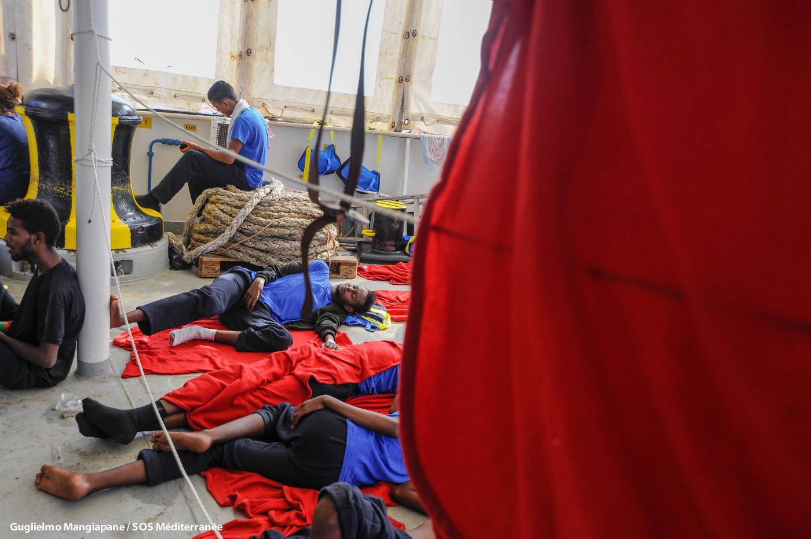
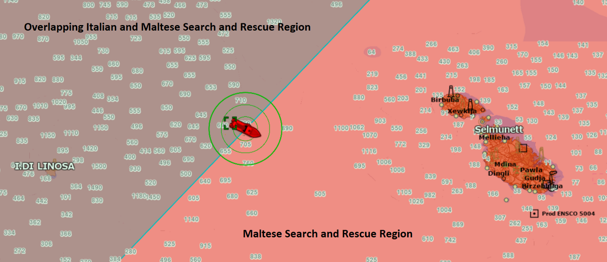
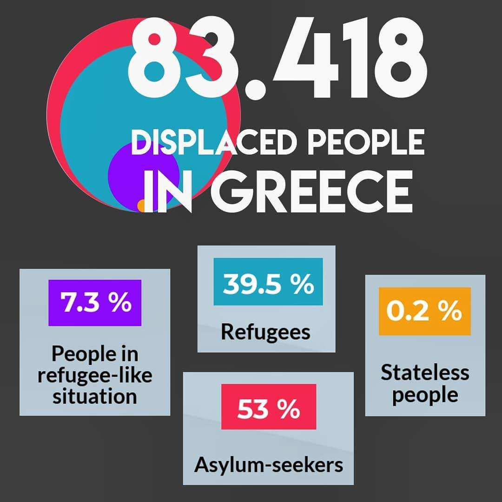
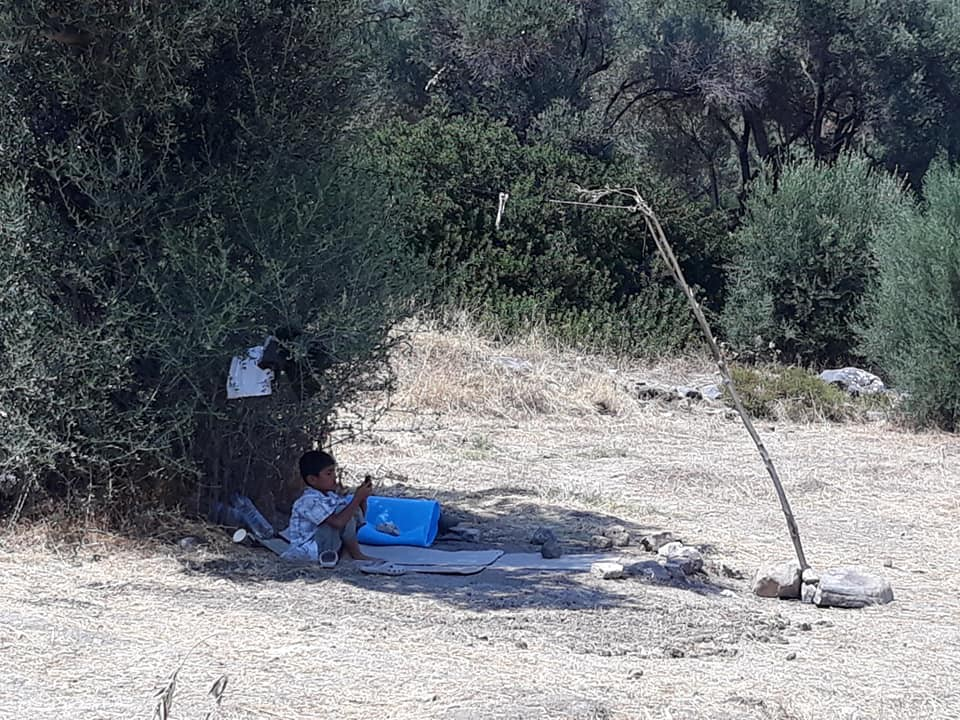
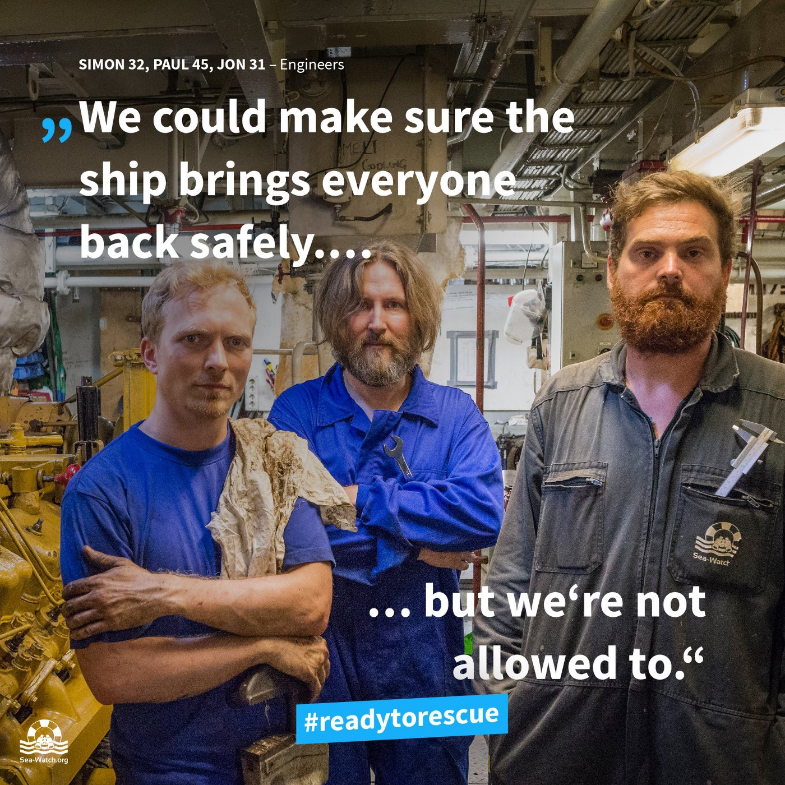
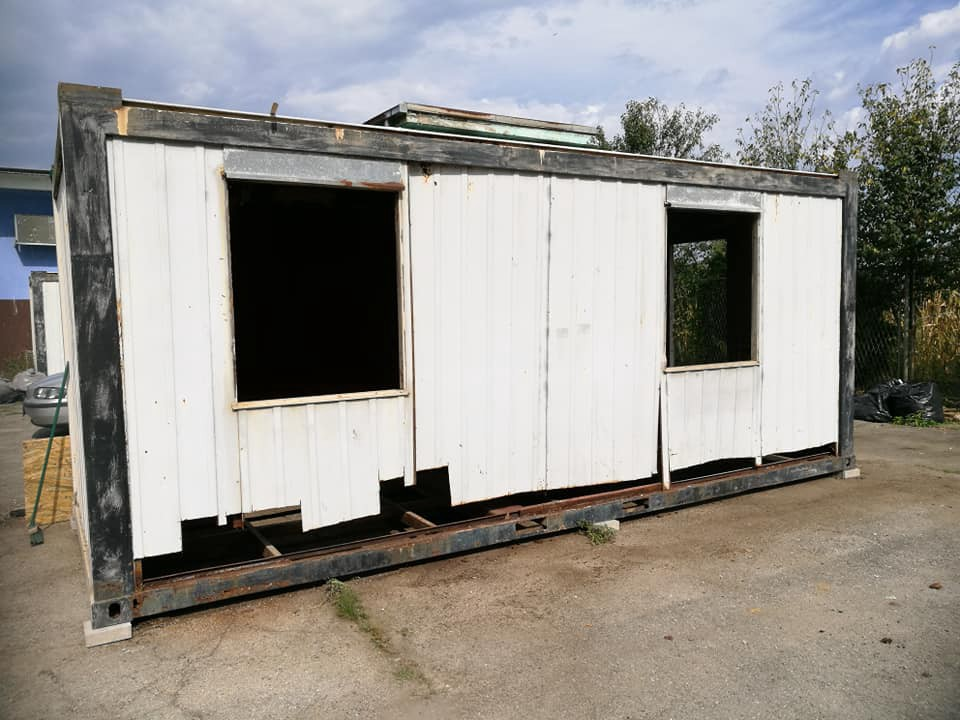
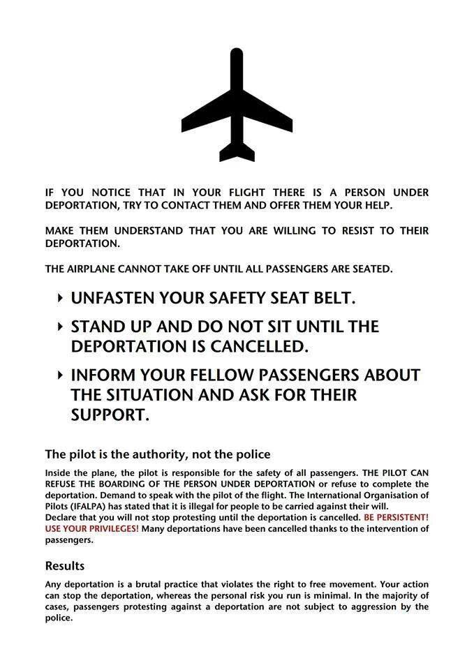

### AYS DAILY DIGEST 13/08/2018: Shell Games as 141 souls are kept on the Aquarius \.

_Guessing games and people’s lives in the Mediterranean // No decrease in asylum seekers in Greece, conditions remain deplorable // New ruling in Greece forbades term “Illegal/Smuggled migrant” // New volunteer and donation calls in Serbia and Bosnia // People trapped for hours on the Drina river // How to stop a deportation — more upcoming in Sweden\._

Photo Credit: SOS Mediterranee
### FEATURE: 141 lives stranded on Aquarius, again\.

SOS Mediteranee and MSF’s search and rescue ship Aquarius is again searching for safe harbour after rescuing 141 people\. [SOS Mediteranee has](https://web.facebook.com/asso.utopia56/posts/2028131617218620?hc_location=ufi) sent a call for the port in Nice, France to accept them, as they are the closest port available at this time\. Both of the rescues were coordinated with JRCC Libya, with the Aquarius following orders to first distribute life jackets and only later to take the people aboard, who had been waiting in the hot sun for hours\. The Aquarius did not enter territorial waters until given proper authorization\.

Photo Credit: Aquarius Log

[Both Maltese and Italian officials](https://twitter.com/SOSMedIntl/status/1028926561704140801) have refused the Aquarius port to disembark, leaving them again, in limbo\. The underlying excuse this time comes from the fact that the boat is flying under the colours of Gibraltar, and other governments are stating that this means that it is Gibraltar’s responsibility\. IN return, the governmental body in Gibraltar is promising to strip the Aquarius of its flag, removing it from the registry, returning it to it’s “original flag”, [which is that of Germany](https://twitter.com/matthewbennett/status/1029126479026839555) \. The Aquarius claims these are simply political machinations\.

■■■■■■■■■■■■■■ 
> **[MSF Sea](https://twitter.com/MSF_Sea) @ Twitter Says:** 

> > For past 2 years #Aquarius satisfied all regulatory requests arising from competencies of Gibraltar Flag State, all technical controls regarding security and safety of ship. No deficiencies ever reported. Terminating registration is a political manoeuvre! [sosmediterranee.com/press/sos-medi…](https://sosmediterranee.com/press/sos-mediterranee-denounces-political-manoeuvre-of-government-of-gibraltar-aimed-at-impeding-its-search-and-rescue-operations/) https://t.co/VGP4Jv7yLs 

> **Tweeted at [2018-08-13 21:21:04](https://twitter.com/msf_sea/status/1029115643906465792).** 

■■■■■■■■■■■■■■ 

Understandably, it is easy to see that these are just more shell games played by officials in order to push off responsibility as, ultimately, in Search and Rescue operations, the closest port of safety is the desired one\.

Survivors onboard also told crew members that several commercial ships refused to intervene, citing the ongoing complications of being refused a port of entry from Italian, Maltese or other countries\. Again, another example of the soft power of visible repression towards search and rescue operations — to intimidate those onlookers into not taking any risk\. Watch below for more information\.

■■■■■■■■■■■■■■ 
> **[euronews](https://twitter.com/euronews) @ Twitter Says:** 

> > #GME | 141 people on board the migrant rescue ship Aquarius have told rescuers of being stranded at sea as several ships passed them by without offering help. Our correspondent @[AnneliseBorges](https://twitter.com/AnneliseBorges) tells us about the situation on board.

[euronews.com/live](http://euronews.com/live) https://t.co/3sbc1NKCXW 

> **Tweeted at [2018-08-13 05:08:05](https://twitter.com/euronews/status/1028870787682459648).** 

■■■■■■■■■■■■■■ 

The city of Barcelona offered port to the Aquarius; however, Madrid did not grant its authority to make that decision, leaving the people stuck, many of whom are in sick and in need of medical attention\.

Other cities in Italy have offered port, but the minister of the interior Salvini remains steadfast\. Additionally, in Lampedeusa, 109 people from 11 boats landed\. In a somewhat odd turn of events, these boats were met by Aquarius who offered to rescue them, an offer that they turned down, despite being at sea for days and low on supplies\. Read more, in Italian, [here](https://www.repubblica.it/cronaca/2018/08/13/news/aquarius_e_il_soccorso_rifiutato-204002144/) \.
### GREECE

[Aegean Boat Report](http://Aegean Boat Report) notes that 12 people were dropped from a Speedboat to Lesvos yesterday\.

Additionally the director for asylum services in Greece has noted there has been no significant drop in arrivals, and according to Greek police 1,814 people were apprehended for entering in Greece through Evros, \(or residing in the region irregularly, although this will be minimum\) during July\. How much more will it take for politicians to realize that push factors vastly outweigh pull factors?

Open Cultural Centre in Greece posted a helpful infographic from UNHCR’s numbers in Greece to break down the status of most people in Greece currently\.

Source: OCC

Islands: Lesvos

> Mahyar Alami posted a plea and a call to action considering the detestable conditions in Moria: 

> [\#Moria](https://web.facebook.com/hashtag/moria?hc_location=ufi) Just a word but this word have a heavy story behind…
 

> where parents have to keep their new born in the basket\! \! \!
 

> where the women have to stay in the small summer tent and avoid to go to bath alone just because to protect them self from [\#sexual](https://web.facebook.com/hashtag/sexual?hc_location=ufi) [\#violence](https://web.facebook.com/hashtag/violence?hc_location=ufi) 
 

> here as parents you shouldn’t allow your children to go out because there is no protection…
 

> I’m so sorry dear mother for these condition I know you didn’t choose to became an immigrant…you had to make these journey and there were no choose\!
 

> \#moria [\#refugee](https://web.facebook.com/hashtag/refugee?hc_location=ufi) [\#camp](https://web.facebook.com/hashtag/camp?hc_location=ufi) or [\#idintification](https://web.facebook.com/hashtag/idintification?hc_location=ufi) [\#center](https://web.facebook.com/hashtag/center?hc_location=ufi) no matter how we call it…
 

> here is the place were teenagers apart hope for their futures are having suicide thoughts…\! 

Moria\. Credit: Mahyar Alami

Mobile Info Team posted a helpful guide to LGBTQ refugees who need to assess their steps for requesting asylum based on persecution of their gender and/or sexuality\. Individuals who are members of the LGBTQ community are encouraged to mention this in their interview if it plays a role in the persecution they face back home\.

“If you are gay, lesbian or transgender and you were fleeing your country of origin because you were persecuted for this, then it might be a good idea to discuss this in your asylum interview, as it may impact whether you will get asylum or not\. You have the right to get refugee status on the grounds of your gender identity, gender expression \(e\. g\. the way you dress\) or sexual preference \(e\. g\. same sex relationships\) if your life, liberty, physical safety or other basic human rights are threatened\.”

For more information go [here](https://web.facebook.com/mobileinfoteam/posts/2251806328381417:0?hc_location=ufi) \. They also have a collected source of information on LGBTQ \+ asylum questions and answers [here](http://www.mobileinfoteam.org/lgbt-refugees) \.

> ERCI is in need of female volunteers for their clothes washing program\! Contact [them](https://web.facebook.com/ercintl/posts/885686424964443:0?hc_location=ufi) for more details\! 

In a small step towards forward, the Supreme Civil and Criminal Court of Greece has passed a ruling striking out the legitimacy of the use of the term “illegal/smuggled migrant,” stating that the use of the term, in addition to being inaccurate:

_“may also be detrimental to the personality of the person and, of course, is not found in the Greek legislation, which refers to “illegal entry into the country”\._

_It is our duty to educate us through the proper use of legal terms in the formulation of our documents, the Greek society, in order to avoid xenophobia and racist violence\. Therefore, please remove from the official documents the use of the term “illegal/smuggled immigrant” and use the terms “irregularly arriving persons”, “refugees”, “immigrants”, “economic migrants”, “asylum seekers”\._

The court has send out the letter \(the above of which was an excerpt from the letter\) to various relevant agencies and entities\. Read more about it [here](https://web.facebook.com/nobordersnetwork/photos/a.660787423989153.1073741828.657905327610696/1873941872673696/?type=3) \.
### MALTA

Sea\-watch remains detained in Malta for more than a month now\. With the death toll rising daily, it remains difficult to not see each day passing in a count of human lives\.

Photo credit sea\-watch\.org

Meanwhile, “on Monday, Malta’s armed forces said that it rescued 114 migrants from a rubber dinghy taking on water 53 nautical miles south of the Mediterranean island\. The migrants will be brought to Malta in the afternoon, sources said,” [source](http://news.trust.org/item/20180813111052-1i5s6/) \.

> According to IOM, the top causes of worldwide refugee deaths, other than drowning, are: hypothermia, gunshot, car accident \(first cause this year in Europe\), suffocation, dehydration, hunger\. 

### SPAIN

Over 300 people were rescued from 11 boats over the course of the previous day in Spanish waters\. As expected, although resources are scarce in Spain, many people do not end up staying there, but this only exacerbates the justification to not lend institutional support\. [Source](https://twitter.com/salvamentogob/status/1029079190547644417) \.
### SERBIA

A group of around 15 people, as according to the last update, were trapped on a river island in the middle of the Drina river after high waters impeded their attempt to cross from Serbia into Bosnia\. The people had tried to cross but were prevented by Bosnian police, but they were unable to fully cross back as the waters became too high and risky\. [After they were rescued, they were returned to Serbia](https://www.klix.ba/vijesti/bih/migranti-koji-su-pokusali-preci-drinu-vraceni-u-srbiju/180814018) \.

Refugee Aid Miksaliste is in need of volunteers\!

### BOSNIA

Cars of Hope are doing many projects and are in need of donations\! In addition to providing power banks and other day to day necessities, two trailers are being renovated to provide emergency shelter\. Please [contact them](https://web.facebook.com/openeuborders/posts/2042876766041380?hc_location=ufi) here for more information on how to support their efforts in Velika Kladusa\.

Photo Credit: Cars of Hope\. Potential Shelter, need your help\!
### CROATIA

Frontex will most likely deploy border guards to Croatia\. Although this has been discussed for several months now, it appears that the mechanism is in place and will move forward\. Additionally, there is talk that Bosnia could also receive some Frontex members\. For more information, go to [refugee\.info](https://blog.refugee.info/croatia-increases-border-security-as-bosnia-plans-to-curb-migration-fa/) \.
### SWEDEN

With the announcement that an unspecified number of people will be deported to Sweden today, we wish to remind travellers who suspect there are deportees on their flight of their options\. This helpful flyer is circulating\.

Photo Credit: Abdul Ghafour

**We strive to echo correct news from the ground through collaboration and fairness\.**

**Every effort has been made to credit organizations and individuals with regard to the supply of information, video, and photo material \(in cases where the source wanted to be accredited\) \. Please notify us regarding corrections\.**

**If there’s anything you want to share or comment, contact us through Facebook or write to: areyousyrious@gmail\.com**

_Converted [Medium Post](https://medium.com/are-you-syrious/ays-daily-digest-13-08-2018-shell-games-as-141-souls-are-kept-on-the-aquarius-d2ab1edbd03d) by [ZMediumToMarkdown](https://github.com/ZhgChgLi/ZMediumToMarkdown)._
