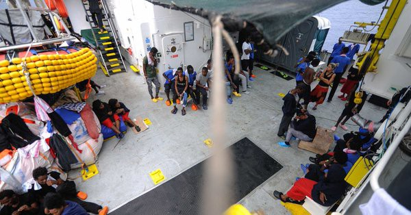

### AYS Daily Digest 15/08/2018: _Criticism and relief after Aquarius finally granted port of safety_

_Further reports of arrests and violent police raids in camps in Nador, Morocco / More reports of death and danger in Afghanistan as deportations continue / 524 people disembarked in Spain while 192 arrived on Lesvos, Greece / Sit\-in in Sweden to protest against deportations to Afghanistan / Increased police checks on freight trains on Basel\-Karlsruhe route / Another ambiguous asylum application rejection as procedures around establishing sexual orientation continue to astound — this time in Austria / And more news…_

People on board the Aquarius\. \(Photo credit: MSF Sea\)
### FEATURE: Praise and despair after Aquarius docks in Malta

In the [UNHCR’s August 15th press release](http://www.unhcr.org/news/press/2018/8/5b73d04f4/unhcr-welcomes-aquarius-resolution-stresses-need-predictable-approach-disembarkation.html) , when the Aquarius was finally granted permission to disembark 141 asylum seekers and migrants in Malta after more than five days at sea, High Commissioner for Refugees Filippo Grandi harshly criticized the delay in disembarkation:

> “But the situation should never have come to this in the first place\. It is wrong, dangerous and immoral to keep rescue ships wandering the Mediterranean while governments compete on who can take the least responsibility\.” 

We cannot agree more with Mr\. Grandi, but we have to remind him of UNHCR responsibility, too\.

The [UNHCR press release](http://www.unhcr.org/news/press/2018/8/5b73d04f4/unhcr-welcomes-aquarius-resolution-stresses-need-predictable-approach-disembarkation.html) appealed to shipmasters not to stop efforts towards rescues at sea, presumably in a bid to prevent the delays in providing a port of safety becoming a deterrent to those who wish to save lives at sea\.

■■■■■■■■■■■■■■ 
> **[SOS MEDITERRANEE](https://twitter.com/SOSMedIntl) @ Twitter Says:** 

> > UPDATE The #Aquarius has received formal permission to enter Maltese territorial waters and is now proceeding towards the port of La Valette. The 141 vulnerable people rescued at sea on Friday during two Search &amp; Rescue events, both coordinated by the Libyan JRCC, ... 1/3 https://t.co/YbPqmXVCxp 

> **Tweeted at [2018-08-15 07:35:21](https://twitter.com/sosmedintl/status/1029632621226147842).** 

■■■■■■■■■■■■■■ 

[SOS MEDITERRANEE](https://twitter.com/SOSMedIntl/status/1029633046289567744) welcomed the collaboration between France, Germany, Luxembourg, Portugal, and Spain after the Aquarius was granted a port of safety in Malta\.

Their tweet, below, was generous given the huge delays in finding a port of safety for the Aquarius, which in turn prevented the vessel from saving more lives and the people on board from disembarking\.

■■■■■■■■■■■■■■ 
> **[SOS MEDITERRANEE](https://twitter.com/SOSMedIntl) @ Twitter Says:** 

> > ... will finally disembark in a place of safety after more than 5 days at sea. @[SOSMedIntl](https://twitter.com/SOSMedIntl) &amp; @[MSF_Sea](https://twitter.com/MSF_Sea) are relieved and grateful to #Malta for offering a safe port for the disembarkation of these 141 survivors of Search and Rescue events in the Central Mediterranean. 2/3 https://t.co/clBe64WqiE 

> **Tweeted at [2018-08-15 07:36:18](https://twitter.com/sosmedintl/status/1029632862633558016).** 

■■■■■■■■■■■■■■ 

[MSF Sea](https://twitter.com/MSF_Sea/status/1029675004827521024) stressed the need for a sustainable solution to the humanitarian crisis while [MISSION LIFELINE](https://twitter.com/SEENOTRETTUNG/status/1029602425794174979) was very clear that the greatest cost of the delays in providing a port of safety were paid by both the rescued people on board and the shipwrecked left at sea as NGO vessels are prevented from continuing their rescue efforts\.
### MOROCCO

**Further reports of arrests and violent police raids in Nador**

The Moroccan Association for Human Rights, [Association Marocaine des Droits Humains — Section Nador](https://www.facebook.com/AmdhNador/?hc_ref=ARRyTl_rFBZ_DIuaxHiX752ewqV2TphrSwyqczh9k86atU1KbN5VQzEelX-g3R8HFJ4&fref=nf&hc_location=group) , reported arrests and posted photos of camps which they state were destroyed during police raids on Wednesday morning\.

](assets/291288327c8a/0*1QRAfeFXJfhWlNRA)

Photo credit: [Association Marocaine des Droits Humains — Section Nador](https://www.facebook.com/AmdhNador/?hc_ref=ARRyTl_rFBZ_DIuaxHiX752ewqV2TphrSwyqczh9k86atU1KbN5VQzEelX-g3R8HFJ4&fref=nf&hc_location=group)
### AFGHANISTAN

**Deportations continue as does death and violence in the country**

Deportations to Afghanistan continue despite status as the second most dangerous country in the world\. On August 15th, [AhluBayt News Agency reported](http://en.abna24.com/news/central-asia-subcontinent/suicide-bomber-kill-25-at-education-centre-in-west-kabul_905544.html) a suicide bomber killed at least 48 and injured more than 35 when they targeted a Shiite education centre in west Kabul, the Health Ministry told Afghan media\.
### **SEA**

**SALVAMENTO MARITIMO daily update at 6:10 pm on August 15th**

> 524 people rescued from 12 small boats 

> The Buque Luz de Mar carrying 240 rescued people sailing from the Strait of Gibraltar towards Algeciras, due to disembark at 6:45 pm\. 

> The Buque SAR Mastelero carrying 284 rescued people sailing on the Alboran Sea towards Motril, due to disembark at 8:30 pm\. 

■■■■■■■■■■■■■■ 
> **[SALVAMENTO MARÍTIMO](https://twitter.com/salvamentogob) @ Twitter Says:** 

> > Balance total miércoles hasta 18:10h: 524 #personas rescatadas de 12 #pateras
Buque Luz de Mar navega con 240 rescatados/7 #pateras #Estrecho. Llega 18:45h #Algeciras
Buque SAR Mastelero llega con 284 rescatados/5 pateras #Alboran sobre 20:30h #Motril https://t.co/i5eEykCxkD 

> **Tweeted at [2018-08-15 16:10:09](https://twitter.com/salvamentogob/status/1029762177207554048).** 

■■■■■■■■■■■■■■ 

**31 people rescued in Maltese waters**

[Watch The Med](https://www.facebook.com/watchthemed.alarmphone/photos/a.1526182797655958.1073741828.1525906057683632/2194361084171456/?type=3&hc_location=ufi) reported the delay in coast guard rescue\. The boat in distress spent a day and a half at sea contacting coast guards:

> Despite the urgency of the situation, coast guards of EU member states rejected responsibility\. [\(Watch The Med\)](https://www.facebook.com/watchthemed.alarmphone/photos/a.1526182797655958.1073741828.1525906057683632/2194361084171456/?type=3&hc_location=ufi) 

### SPAIN

**Migrant minors debate in Spain: Regions lobby for ‘fairer distribution’**

[EL PAIS reports that:](https://elpais.com/elpais/2018/08/06/inenglish/1533540123_093481.html)

> While Andalusia is caring for 2,597 migrant minors \(36% of the total\) and Catalonia is doing the same for another 1,012, there are regions of Spain that have barely felt the effects of this sharp rise in unaccompanied minors, such as La Rioja, Extremadura, and Castilla y León\. 

Again the debate seems to revolve around collaboration between different governing bodies and policy\. The article states concerns over integration, determining the age of the migrants, and the lack of proper accommodation for migrant minors in the regions with the highest percentages of minor migrants\.

See the latest [UNHCR report](https://data2.unhcr.org/en/documents/download/65156) on sea and land arrivals statistics in Spain\.
### GREECE

**Lesvos**

192 arrivals to Lesvos

 ‎](assets/291288327c8a/1*xQxOrDBdGdSSTcQI2mIywg.jpeg)

By [Erik Gerhardsson](https://www.facebook.com/erik.gerhardsson.7?fref=gs&dti=1652972374920129&hc_location=group_dialog) ‎

The first boat landed south of the airport, Lesvos south, at around 12:45 am, [Aegean Boat Report](https://www.facebook.com/AegeanBoatReport/posts/427397987783311) informs\. The second boat was picked up by HCG outside the airport, Lesvos south, around 6:00 am\. The third boat landed pn the outskirts of Skala Sykamineas, Lesvos north, at 7:30 am\. The fourth boat landed in Skala Neon Kidonion, Lesvos south east, around 11:30 am\.

 \)](assets/291288327c8a/1*h0HZA2xNpcwMKaCqPZ66DQ.jpeg)

“Beautiful sunrise on Lesvos this morning\. If you look closely in the picture you’ll see both Greek coast guard and the rubber boat with refugees\. Everyone was transported safely ashore\.” \(Photo by: [Monica Skilbrei](https://www.facebook.com/monica.skilbrei) \)
### AUSTRIA

**Asylum application rejected on basis that applicant does not “walk, dress, or act like a gay man”**

[The Guardian newspaper reported](https://www.theguardian.com/world/2018/aug/15/austria-accuses-afghan-asylum-seeker-of-pretending-to-be-gay) that an asylum application was rejected on ambiguous grounds in Austria as an official declared that the applicant did not “walk, dress, or act like a gay man\.”

Homosexuality continues to be illegal in Afghanistan while asylum applications based on sexual orientation can be denied based on the conclusions of the interviewers\.
### FRANCE

**Request for donations for medical support for refugees in Paris**

Volunteer [Sarah Fenby\-Dixon](https://www.facebook.com/sarah.fenbydixon.1?hc_ref=ARSTRGvqTJKCGt5SEpFsRTsBkGL6pQMC8g8mzIi3kH4kVKA9HnxOS7RqkPGobXdBS2w&fref=nf) wrote a quick Paris update:

“There are still hundreds on the street but they are continually chased and scattered by the police\. During the day people seem to gather in small groups away from public gaze or hide or walk the streets\.

There are lots of children / families\. We counted about 10 children ranging from maybe two to 11 years old in one small area\. They were heartbreakingly grateful for a colouring book and a few crayons\.

Also an old couple, maybe in their 80s, the gentleman looking so much like my grandad, were sitting silently, looking sad and lost\. What must it have taken for them to leave their home? And what must they now think about how they are ‘welcomed’ in Europe?”

Please click below and support this initiative to provide first aid and medical care for refugees in Paris:

Elena Lydon continues on her Facebook page:

> Please help us to provide help and support to the many refugees living on the streets in Paris as they wait to get asylum… 

> Much needed medical supplies will be bought from your kind donations\. \. \. no amount is too small\. 

> We will be treating scabies, lice, respiratory tract infections, trench foot\. Infected wounds, face and body laceration, tear gas and pepper spray, along with mental health support \. 

> Also we are seeing a high amount of wounds and broken bones from police brutality\. 

### GERMANY

**Increased police checks on freight trains on the Basel\-Karlsruhe route**

The federal police announced plans to increase checks on freight trains in German state of [Baden Württemberg\.](https://amp.welt.de/politik/article181185024/Baden-Wuerttemberg-Bundespolizei-holt-immer-mehr-Fluechtlinge-von-Gueterzuegen.html)

**254 people have been detained** in this way in the first half of 2018, far more than ever before\. Most of the arrivals are coming from northern Italy via Switzerland\.

**The focus will be the Basel — Karlsruhe route** , one of the most frequented routes in Europe for freight trains\. The route is also known as the Rhine Valley Railway or Upper Rhine Railway and runs from Basel, Switzerland\.

Helicopters and special equipment will be used for the checks\.

Meanwhile, the number of people arriving in Austria and Bavaria on freight trains has fallen, this is largely due to the fact that Italian authorities have increased checks at the Verona train station\.
### SWEDEN

**Solidarity with people being deported from Sweden to Afghanistan**

There is a [sit\-in](https://www.facebook.com/events/662299774103666/permalink/678023472531296/) ongoing after deportations on August 14th\. Originally due to last a week, since nothing has changed the protest will go on for at least a while longer\. More than 70 students gathered for the sit\-in\.

> **We strive to echo correct news from the ground through collaboration and fairness\.** 

> **Every effort has been made to credit organizations and individuals with regard to the supply of information, video, and photo material \(in cases where the source wanted to be accredited\) \. Please notify us regarding corrections\.** 

> **If there’s anything you want to share or comment, contact us through Facebook or write to: areyousyrious@gmail\.com** 

_Converted [Medium Post](https://medium.com/are-you-syrious/ays-daily-digest-15-08-2018-criticism-and-relief-after-aquarius-finally-granted-port-of-safety-291288327c8a) by [ZMediumToMarkdown](https://github.com/ZhgChgLi/ZMediumToMarkdown)._
