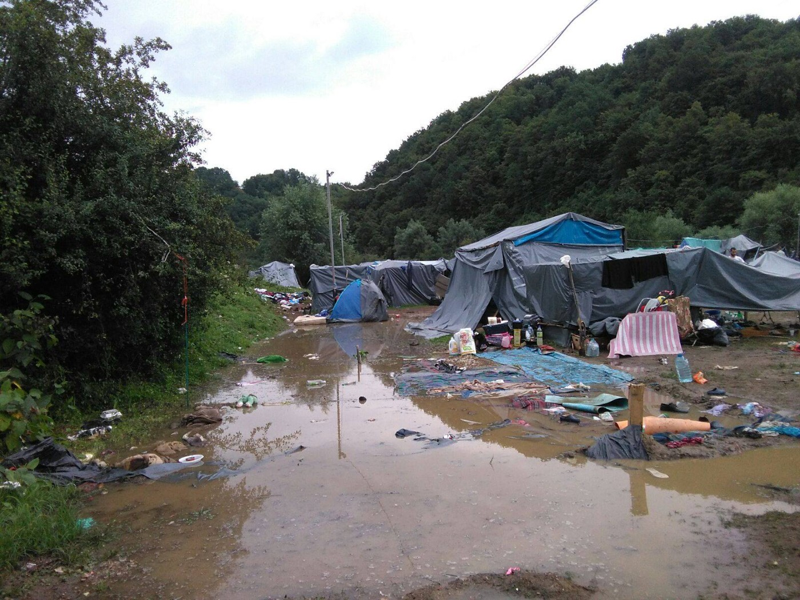
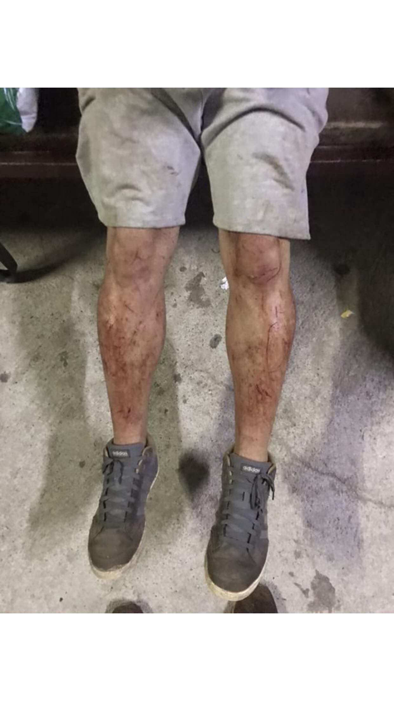
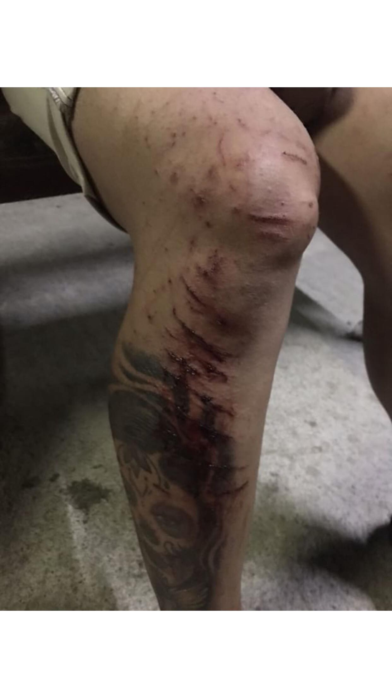
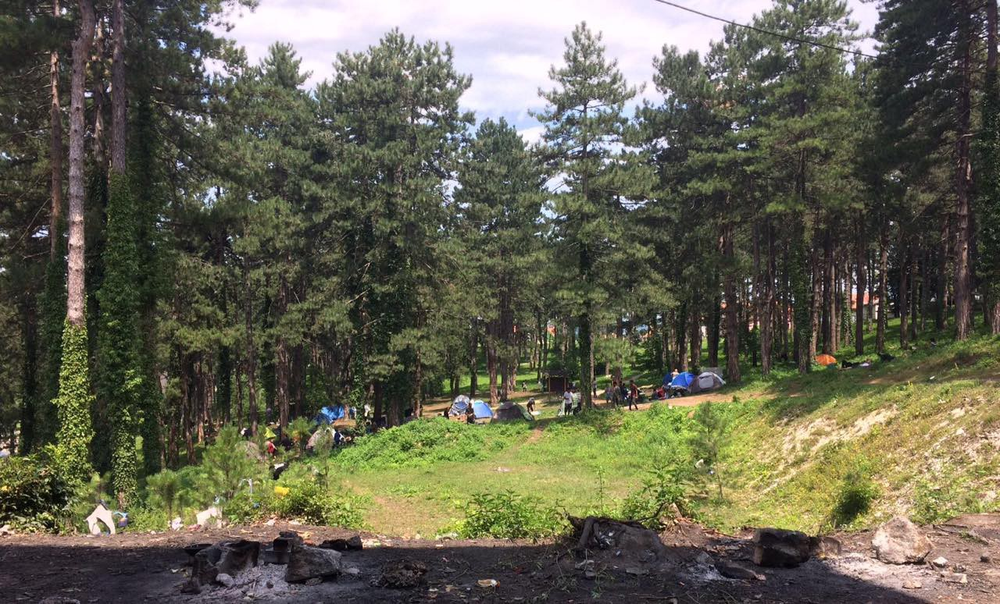
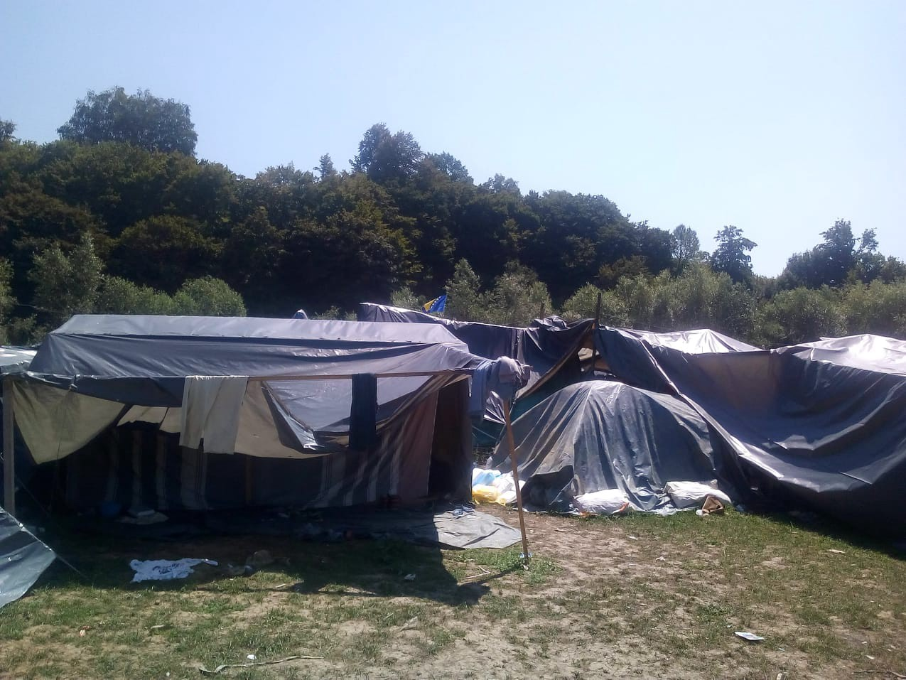
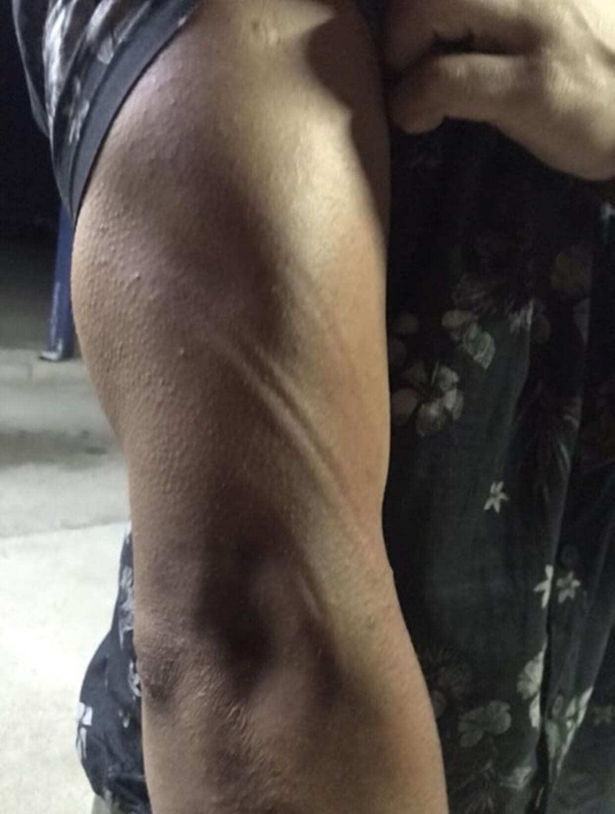

### **AYS SPECIAL** from Bihać and Velika Kladuša **: Games of batons**

_AYS team went again to two cities in Bosnia closed to the border with Croatia only to find even more precarious living conditions, as well as numerous proofs of border violence committed by the police forces from the EU\._

Makeshift camp in Velika Kladusa\. By No Name Kitchen\.

**Like everyone, we start from the bus station**

If you come to Bihać and decide to take a coffee at the bar near the bus station, you will have opportunity to meet dozens of people, from Iraq, Algeria, Afghanistan, Syria, Pakistan or Lybia, and many other war and poverty torn countries\. And if you say that you are from Croatia, as AYS volunteer did, in a minute a minimum 20 people will start showing you their wounds and broken phones\.

They will tell you that the Croatian police has stolen all their money and destroyed all papers, including, for example the medical documentation that they carried from Greece proving the rape attempts committed by unknown persons on the Balkan Route\. They will tell you that they have been treated like animals by the Croatian police\. And the only question that they will have is ‘Why? Why does Croatian police do this?’ And you will have no answer and no choice but to look at the wounds by batons and fists on their back, legs and arms\. And it will take only 30 minutes since the moment you walk in the caffe\.

Photo by residents of the Đački dom camp in BIhać\.

The recent numbers say that in Bihać there are around 5000 people, yet this number is being used with nonchalance, since the number is ever changing — people are often traveling between the small, poverty\-struck town of Velika Kladuša via the town of Cazin to Bihać and vice versa, trying to find a way to ‘try the game’, the expression that has become so frequent among the refugees, and to try it five, or even dozen times that they were pushed\-back and/or beaten by the Croatian police\.

The numbers are very unreliable in Bosnia and Herzegovina — when, in March 2018, AYS has tried to get statistics from [UN Refugee Agency](https://medium.com/u/75f2bdd89854) in Bosnia and Herzegovina, asking them about their reports on this country \(as it became obvious that the route is changing its’ course from Serbia\), the ones that are available for every country of the Mediterranean and Balkan routes, they did not provide any for months\. They start later, only to disappear sometimes during the summer\.

Now, the Government is saying that there has been more than 10000 of registered people in Bosnia and Herzegovina, however in this moment it is simply impossible to establish how many people are in the country, given the lack of strategy for handling the crisis, as if though its government\(s\) do not recall that most of the citizens have an experience of living as a refugee or an internally displaced person and the international organizations do not account for about thirty years of presence there\.

**Borići camp**

So many people are arriving to Unsko\-Sanski kanton/county, yet the formal camp has been set up only recently in the ex\-student dormitory Borići and the management has been given to the Red Cross, the Danish Refugee Council and IOM, with the presence of the UNHCR\.

Outside of the Đački dom, Borići camp\. Place run by the Red Cross BIhać, Danish Red Cross and IOM\. Photo One Bridge to Idomeni\.

As volunteers report, the very structure, which has not been in use for 30 years, is insufficient and completely inadequate for accommodation of the people — it is wet, dirty and dangerous\. Also, not all its’ inhabitants are accommodated in the building — many of the people are sleeping in the tents outside\.

Đački dom camp\. By One Bridge to Idomeni\.

Let’s add that despite the severity of the situation and the fact that the building has not been in use for so many years, the international organizations managing the camp did not engage a professional cleaning service, but the cleaning has been done by the volunteers that have been initially invited for other purposes\.

**‘\#humanitarian, \#proud’**

Just an hour drive from Bihać, town of Velika Kladuša is currently hosting an unknown number of refugees, for which independent volunteer groups on the field carefully assess that it could be close to a couple of thousands\. The main three \(visible sides\) include an ex\-hotel Sedra \(formal camp, mostly for families\), a place called Helicopter squat, and the informal camp in the middle of the field, surrounded by the bushes and woods\.

Photo AYS\.

The informal camp in Velika Kladuša counts about 400 people, who live in tents or, more often, in the improvised tents made of big, black nylon bags set up on the ground that turns into mud during the heavy rains\. No Name Kitchen volunteers told us that once a tourist bus visited the site and the tourists were taking photos of the people as an attraction\.

The atmosphere in the camp during the evening when we visited was surprisingly calm\. The volunteers were helping the people to clean the camp, and the inside of most of the tents is incredibly tidy\. However, the volunteers say that this same camp can be very different after the people come back beaten up from yet another push\-back or during the terrible afternoon heats\.

The only electricity is provided by the generator provided again by the independent groups\. No Name Kitchen provides summer showers, clean clothes, English lessons, first aid and help with cleaning\. SOS Ljuta Krajina provides food with the help of the local restaurants, humanitarian aid and the shelters\. Balkan Info Van provides information on the services and paralegal assistance\. One member of IOM staff is present and wears a sanitary mask and gloves\.

People in the camp come from different countries — Syria, Iran, Afghanistan, Pakistan\. As we were invited to simply hang out in front of one of the tents with a group of young people from Syria, we found out that they come from Deir Ezzor, Aleppo, Raqqa, Homs where the regime and the radical groups put in danger their lives\.

H\., a student of journalism from Aleppo told us his story:

“My mother is killed\. My father is killed\. My brother and my sister are killed\. I needed to come here, for me there was no choice\.”

Some of them want to continue their journey to Germany, Italy, Belgium, yet some want to claim asylum in Croatia\. Like M\., a young veterinarian from Raqqa, who told us that he is tired and he just wants to come to Croatia\. “But the things here are like in Syria, they are beating us here, too”\. He himself was beaten up five times in attempts to cross the border by the Croatian police\.

**Croatian drop\-off at Bosnian territory and chain push\-backs**

Almost every fourth person we saw in the camp has some kind of a sign of push\-back by the Croatian police on his or her body\. Yes, this includes women too\.

Photo AYS

Bruises, bandages, wounds on a back are a sign that the people were stopped by the Croatian police in their attempt to cross the border\. For many months now refugees testify about stealing phones, violence, beatings, or even open fire and sexual harassment by the Croatian police, and the volunteer groups and CSOs report about it\.

However, Croatian Ministry of Interior drops the accusations without counter\-arguments, and only by accusing the volunteer organizations of smuggling and lying\. Almost every person in the camp in Velika Kladuša experienced the violence, and some of the people experienced the chain of push\-backs from Slovenia and Croatia to Bosnia or even from Trieste, Italy\.

After being stopped by the police in Croatia, the people are usually picked up by the police and driven in vans without windows in burning heat to the Bosnian territory and dropped there\. One cannot be sure how legal is for Croatian police to go to Bosnian territory and simply to leave the beaten people\.

We asked the Bosnian police officers do they encounter such practice by the Croatian police: “Every day someone comes back wounded and beaten by the Croatian police\. They do it constantly, and constantly they drop them off here\. But what can we do about it? The effort to stop it must come from the top\.”

**Again, at the Bihać bus station**

As we take the bus from Kladuša to Bihać, at Kladuša bus station we meet No Name Kitchen first aid team talking to a group of twenty men\. ‘They are all beaten up\. Please talk to them on the bus\. It’s crazy\. They also need to see the doctor\.”

We take the account of twelve Pakistani men who tried to reach the Croatian soil in the early morning of August 12th\. Three minors were also in the group\. They were stopped by the Croatian police that stolen their money and broke their phones, put in the van and beaten two by two as they were exiting the van\. The signs of police batons are visible on many of their bodies\. We are taking them to Borići kamp as they wish to see the doctor and get a proof of what they have been through\. They can recognize the police officers, they also said that they smelled of alcohol\. But it is Sunday and there are no doctors in the camp\.

The next day the hospital staff supported by DRC decides to take only one of the wounded ones, as the others were not seen as ‘emergency cases’\. The person who they bring to the doctor has broken ribs, and the others had only the baton wounds\. Therefore, they will have no evidence of what happened to them\. We left them, knowing that they will for sure try again\.

> **Tips in case you are going to Velika Kladuša informal sites \(as a volunteer, journalist, anyone\)** 

> Go to the camp only if you previously contacted the local volunteering groups \( [No Name Kitchen](https://www.facebook.com/NoNameKitchenBelgrade/) , [SOS Team Kladusa](https://www.facebook.com/SOSTeamKladusa/) , Balkan info Van\) \. They are familiar with the situation on the ground as they provide committed, long\-term support to the people\. This advice goes to the individuals and organizations that want to gather reports, as well\. 

> Do not take photos without permission and please take into account that the most of the people are bothered by the constant cameras \(cell phones included\) \. This is not a ZOO or a research site\. This is a home of 400 people at the moment and you are coming to their home\. 

> Make your visit directly useful — bring some needed humanitarian aid and deliver it to the mentioned local groups or come as a long\-term volunteer\. 

> NNK is looking for long term volunteers with specific skills — carpenters, mechanics, medical staff\. 

> Humanitarian items needed — men underwear \(sizes S & M — very important\), women underwear of all sizes, snickers \(numbers 42–43 especially\), tents, sleeping bags\. 

**We strive to echo correct news from the ground through collaboration and fairness\.**

**Every effort has been made to credit organizations and individuals with regard to the supply of information, video, and photo material \(in cases where the source wanted to be accredited\) \. Please notify us regarding corrections\.**

**If there’s anything you want to share or comment, contact us through Facebook or write to: areyousyrious@gmail\.com**

_Converted [Medium Post](https://medium.com/are-you-syrious/ays-special-from-biha%C4%87-and-velika-kladu%C5%A1a-games-of-batons-c64c5e99e02b) by [ZMediumToMarkdown](https://github.com/ZhgChgLi/ZMediumToMarkdown)._
