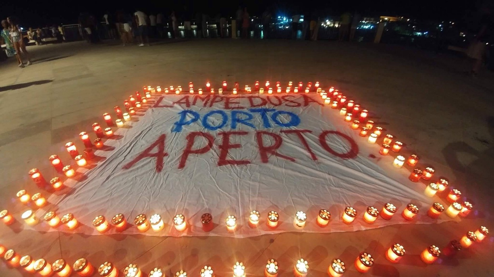
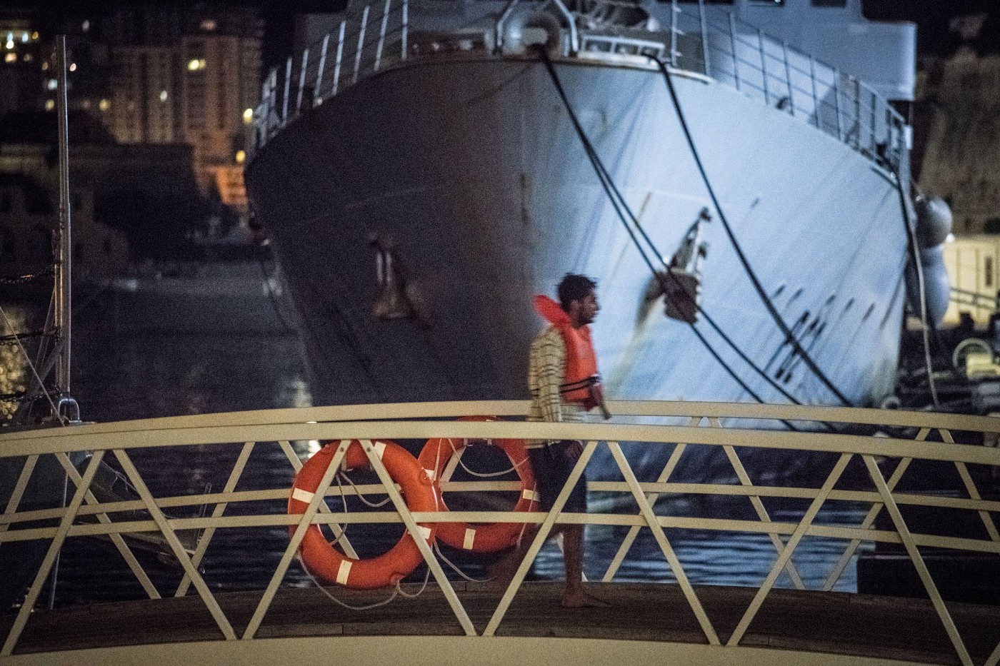
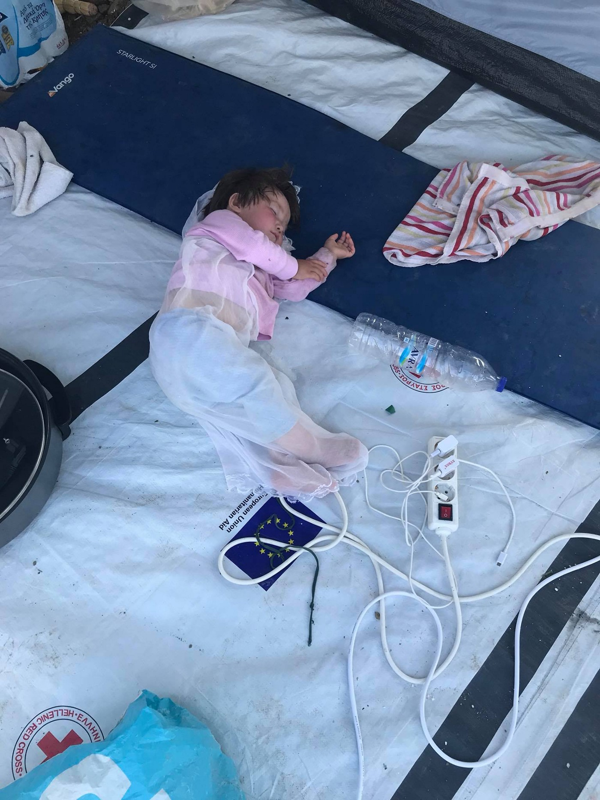
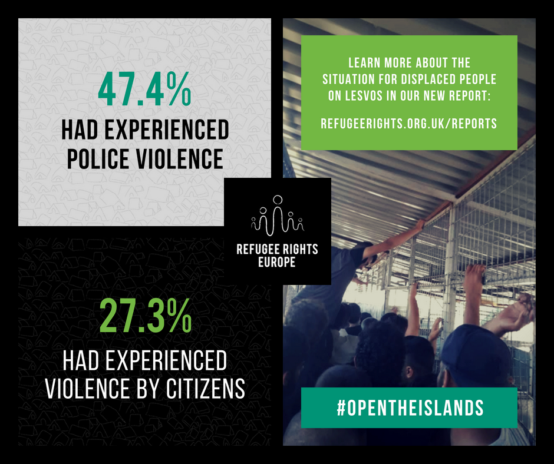
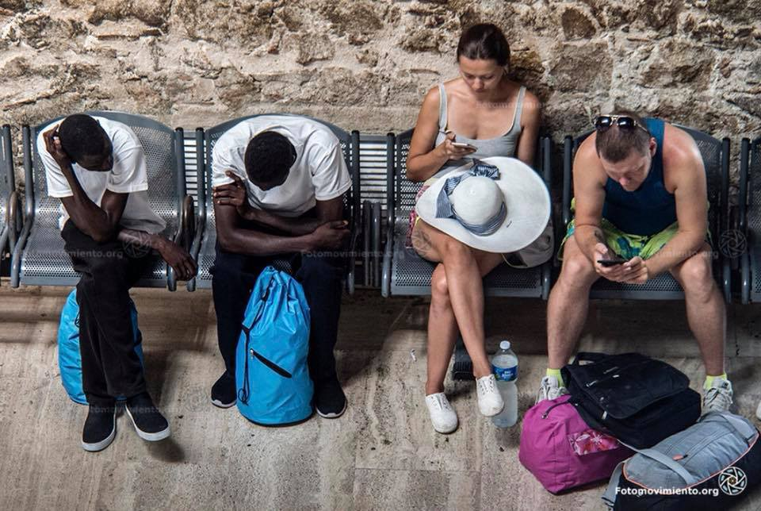

### AYS Daily Digest 20\.08\.18: Italian Government Blocks its own Coastguard from Disembarking Refugees
#### Rescues at sea//New arrivals in Greece//School Opens on Samos//Overcrowding at all time worst on Lesvos//Border patrols increase in Montenegro//Cost of the Austrian border//Refugees blocked from landing in Italy//and more…

“Interior Minister salvini refuses to allow the Italian coastguard ship Diciotti to enter a safe port and threatens to return 177 people aboard to Libya\. If European values mean anything, the EU must put a stop to this madness\!” Photo Credit: Sea\-Watch
### Italy

The Italian Coast Guard ship Diciotti arrived in the port of Catania today\. The boat is carrying 177 refugees, who have been trapped at sea for four days now\. Despite landing, Italian interior minister Matteo Salvini refused to allow the people aboard to disembark, demanding that they be distributed among EU member states\. EU officials in Bruseels claim to be currently in negotiations with Italy\. As politicians negotiate, people who have endured terrible conditions in Libya wait on the crowded deck of Diciotti\.

The racism of the Italian government is resulting in hundreds of deaths\. Soon, it may become thousands\. As rescue ships are becoming tangled up in negotiations simply to land, or impounded by EU governments, the crossing has become extremely dangerous\. So far this year, over 1,500 people have drowned in the Mediterranean while trying to reach a place of safety\.
### Sea

With four civil rescue ships still impounded, the Sea\-Watch NGO released a statement today reminding everyone of the crucial work these rescue ships are doing each day\. Despite continued harassment of aid workers, a total of 5,262 people were saved from the Mediterranean sea in the first three weeks of August alone\. As Sea\-Watch wrote,

> It’s despair and not a fictional pull\-factor that is causing people to take this dangerous journey… Distress at sea persists, and the decreasing number of rescuers is putting lives at risk\! 

“A person rescued Saturday walks offshore in Malta\.” Photo Credit: Sea\-Watch
### Greece
#### Islands

11 people arrived on the island of Samos this morning\. There is no breakdown yet available\.

One boat arrived on Lesvos this morning, carrying 58 people\. \(31 children, 13 women, and 14 men\. Source: Aegean Boat Report\. \)

A boat was intercepted by Lithuanian Frontex outside Agios Dimitris, Lesvos north, 07\.50\.
MoChara from Refugee Rescue also on scene, assisted the boat to shore where land teams awaited\.
58 people\.
31 children 
13 women 
14 men
#### School Opens on Samos

While the refugee camp on Samos has only become more overcrowded in the past months, with very few people being moved off the island, there are some positive stories to tell\. An education center has opened on the island, focusing on teens and children\. The center, run by the [Still I Rise](https://www.facebook.com/pg/stilliriseNGO/posts/?ref=page_internal) NGO, only opened up this month but it is already enrolling hundreds of children\.

Despite EU law that every child has the right to an education, Greece provides education to almost no refugee children\. The number of refugee children who are allowed to attend Greek school on the Aegean islands can usually be counted on one hand at any given time\. The UNHCR has failed to advocate for refugee children in this regard\. While many volunteer groups and community centers across Greece are working to provide education for refugee children, these programs typically fall short of being full time schools\.

](assets/c8eaccc14539/1*PYnC9_p7lzqUflI9sJ69MQ.jpeg)

Students putting up decorations in the new school\. Photo Credit: [Still I Rise](https://www.facebook.com/pg/stilliriseNGO/posts/?ref=page_internal)

Yet in the face of institutional failure, certain people stand up\. The Still I Rise education center, called “Mazi,” is working to provide a full\-time, regular schooling program for refugee children and adolescents\. The program not only covers normal school subjects, but adresses social and psychological issues, and aims to empower refugee youth\. You can support the project here\.

A child sleeps in a tent in the Moria camp, Lesvos\. Photo Credit: Omar Alshakal

It has been reported that last week, the memorial to those who lost their lives at sea was vandalized on Lesvos\. This is the second time the memorial has been attacked\.
#### The Moria detention camp is more crowded than ever

Today the Hope Project on Lesvos posted a video showing conditions inside the Moria camp on Lesvos, where over 10,000 people are now detained\. You can watch it [here](https://www.facebook.com/HopeProjectKempsons/videos/280420849452027/) \. Sometime this week, Refugee Rights Europe will be releasing a report on conditions in the Moria camp\. Among the findings they have already published are the fact that 47\.4% of residents in the camp have been victims of police violence\. Out of the people reporting police violence, 84\.9% described being exposed to tear gas at least once\.

Graphic Credit: Refugee Rights Europe
#### Mainland

The We Are Here Community Center in Northern Greece is looking for volunteers to help with their ongoing projects\. They need volunteers to teach ESL, work in their library, and teach computer classes among other roles\. You can click [here](http://weareherecentre.org/apply/) to apply\.
### Bulgaria

A report on the detention of asylum seekers in Bulgaria was recently released, written by the Red Line Project in cooperation with the Hungarian Helsinki Committee\. You can access the full report [here](https://www.facebook.com/voiceinbulgaria/posts/1888668757862302?__xts__[0]=68.ARBI3WgTdKUImwh41G83ttSBDdG_RhrpXdbFWMcvB1wuW9cyWHbAVsxDUlR-q9pFC4Rx0o8YWQrrfoYIrO53BeKi-Wy2NRB9oZd9LYS_ihQsmV3Ymnu7-mIUGU4bPU0eKXzTqOzwhbKY&__tn__=K-R) \.
### Montenegro

Montenegro has been increasing border patrols and cooperating with Albanian border police, according a to a recent report from refugee\.info\. Border police are particularly focusing on the Bozaj area\. Click [here](https://www.facebook.com/refugee.info/photos/a.1063678090359004/1895549847171820/?type=3&theater) for the full story, also available in Arabic\.
### Bosnia

 \.](assets/c8eaccc14539/1*jJjEpfCWzuZJF3jbpVh3Kw.jpeg)

“Young refugees walk close to the Bosnian\-Croatian border, where hundreds of people remain trapped\.” Photo Credit: [Gabriel Tizon](https://www.facebook.com/gabrieltizonfotografo/?hc_location=group_dialog) \.
### Austria
#### Austrian Citizens Pay Steep Price for Border Police

The Austrian effort to militarize the 160km border between the country and Slovenia has cost Austrian taxpayers over 40 millions euros a year to maintain\. Despite a slight decrease in the number of people crossing the border, the far\-right Austrian government has made this border a prominent issue\. In the first half of 2017, border police apprehended 10 people\. If you divide this by Austria’s budget for the border, it equals two million Euros spent per apprehended person\.
### France

](assets/c8eaccc14539/1*pYzbbCbAZHK5_90ctTaiMg.jpeg)

An encampment in Calais\. Photo Credit: [Refugee Rights Europe](https://www.facebook.com/RefugeeRightsEurope/?hc_location=group_dialog)
#### Refugee Rights Europe reports from Calais

The Refugee Rights organization, which has produced a number of detailed reports on the situation for refugees in France, returned from a brief trip to Calais his weekend\. They interviewed refugees in the region, and documented instances of border violence, and the failure of the municipality to provide health services to refugees there\. As RRE wrote,

> We deeply lament the situation and call on French and British governments to seek a sustainable and humane solution, to meet basic humanitarian requirements, and to adopt a non\-violent approach as the default position\. 

A cycle of displacement and return has been going on in Calais since the destruction of the “jungle” camp\. Police often destroy the tents and belongings of refugees in the area, and people are then sent on buses to far away locations, where they often don’t know anyone and have no access to services\. This results in a people slowly returning to Calais, beginning yet another cycle of eviction\.

An independent volunteer who visited the area gave [her own assesmen](https://www.facebook.com/humanaidgreece/posts/583036128758442) t this weekend\- “The Dunkirk camp is hell on earth\. 800 people, including 100 small children live there in awful conditions\. A tarpaulin and some blankets stretched between the trees, a tent for the lucky ones, no or very limited access to water and toilets\. When I was last in Dunkirk there were 1 water point and 3 latrines for the whole camp, and they have been taken away since\.”

During Macron’s presidential campaign, and his first months in office, the French PM promised to get all refugees off the streets and into safe accomodation by the year 2018\. Instead, it seems French authorities are more focused on keeping refugees out of sight\.
### Spain
#### Rescued refugees left on street upon arrival

“”Arrival in Barcelona of migrants to be relocated after their arrival in boats to Spanish shores\. Many were left on the street\.” Photo Credit: Fotomovimiento

**We strive to echo correct news from the ground through collaboration and fairness\.**

**Every effort has been made to credit organizations and individuals with regard to the supply of information, video, and photo material \(in cases where the source wanted to be accredited\) \. Please notify us regarding corrections\.**

**If there’s anything you want to share or comment, contact us through Facebook or write to: areyousyrious@gmail\.com**

_Converted [Medium Post](https://medium.com/are-you-syrious/ays-daily-digest-20-08-18-french-authorities-abandon-refugees-in-calais-c8eaccc14539) by [ZMediumToMarkdown](https://github.com/ZhgChgLi/ZMediumToMarkdown)._
