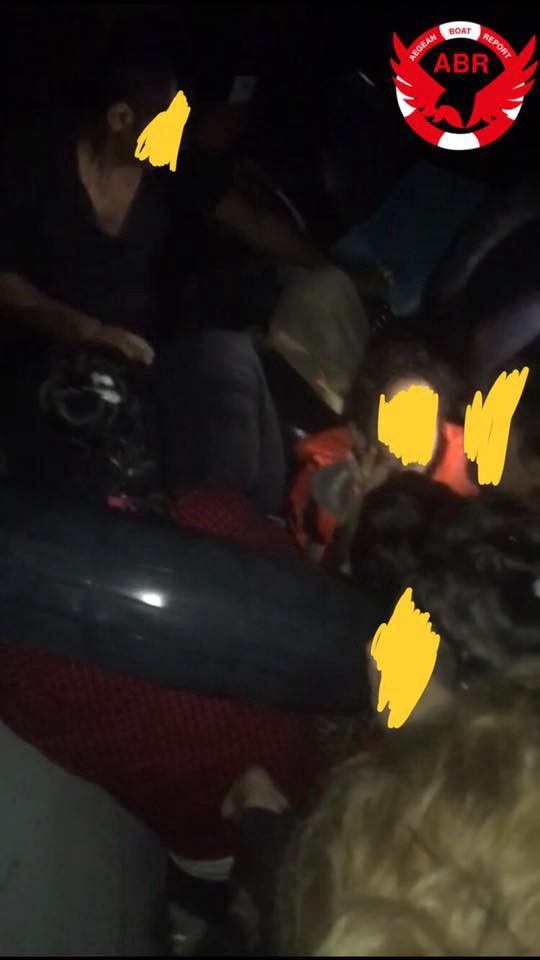
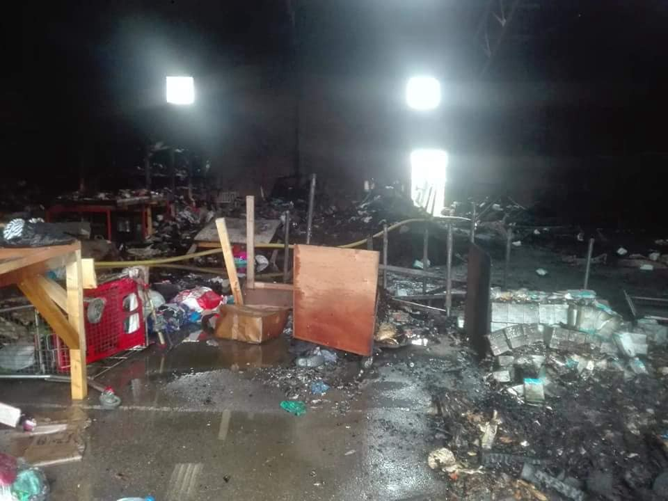
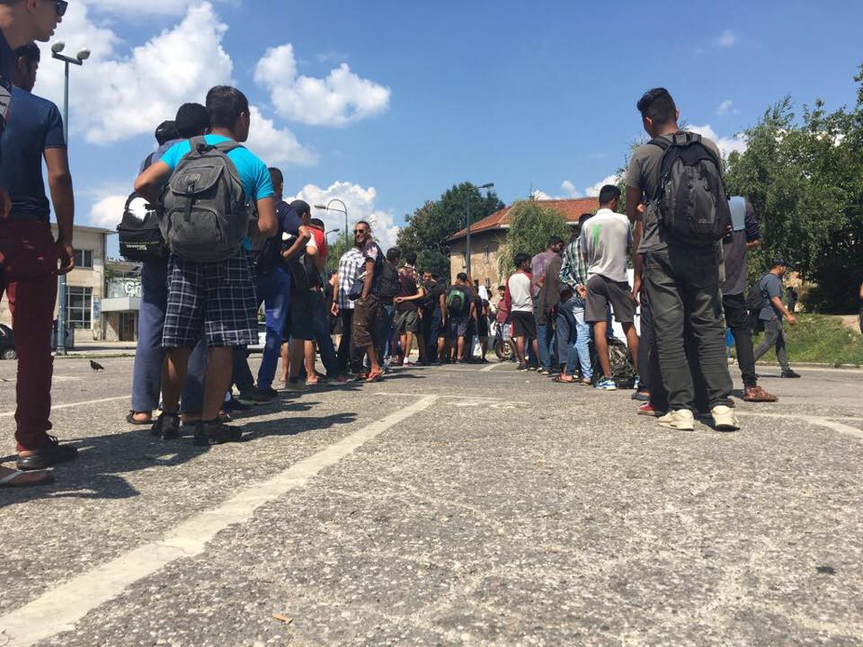
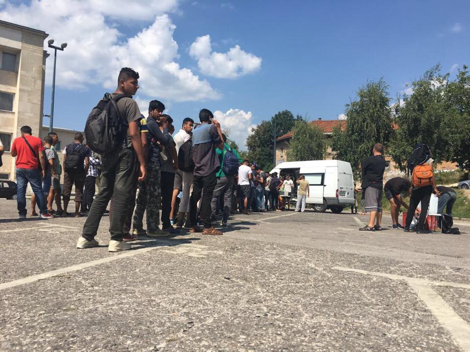

### AYS Daily Digest 29/08/18: Tunisia badly prepared for a potentially increasing influx of refugees transiting through the country
#### Illegal push\-backs increases in Greece / Iraq is in the media shade but the humanitarian needs are still big / Families arriving in Thessaloniki / German police accused of having ties to right\-wing protesters in Chemnitz / The debate is getting harsher in Sweden / Warehouse storing things for 800 people burnt down in Dunkirk, France / The situation in Sarajevo continuously bad / And more news from the field…

 , via [Art Against](https://www.facebook.com/profile.php?id=639605726088865&ref=br_rs)](assets/7cdba2c8a117/1*prGfQHF-RiUv0uSHZhoomg.jpeg)

Illustration: [Dino — cartoonist / illustrator](https://www.facebook.com/dinoillustrations/?hc_ref=ARQt3QB1i9VWwJiiKAZqmhog_tdRkQLqpAqlC6caiNzW2y3Exd1Urb91cWGd40f3lJw&fref=nf&__xts__%5B0%5D=68.ARBeyOKiuaZrmGoOyQMlHjnUOaB33bqSlDYXtJimYa7RIBCLtlGhjQlQD_U19hevSNefxAiHtR-M0DlAGzLRsemeUL4YTEZxlV_d95faJlzk_rca76Sm3R7LubYv-lm9o92cuzc&__tn__=kC-R) , via [Art Against](https://www.facebook.com/profile.php?id=639605726088865&ref=br_rs)
### FEATURE: More people flee Tunisia now than in 2011

If Tunisia would become a country of transit, much is needed to be done before it could be safe for migrants regarding access to asylum procedures and protection of everybody’s human rights\. **Despite its location, Tunisia is not yet** a country of transit\. Regardless of that, **Tunisian nationals are the single biggest nationality to reach Italy via the sea** \. [18\.9 percent](https://data2.unhcr.org/en/situations/mediterranean/location/5205) of arrivals, a total of 3321 people, were Tunisian nationals\.

Matt Herbert and Max Gallien, the researchers behind [a new report](https://issafrica.org/iss-today/tunisia-isnt-a-migrant-transit-country-yet?utm_source=BenchmarkEmail&utm_campaign=ISS_Today&utm_medium=email) from London School of Economics, points out **three main reasons** for Tunisia not being a part of the route as a transit location\. **First, the number of foreigners residing in the country are low** , far below the estimated 100 000 in Algeria and 50 000 in Morocco\. Due to this, smuggling networks have a limited market even though the departures from the Tunisian coast has risen\. **The second reason is related to the first** : it is hard for foreigners to enter Tunisia irregularly\. **The last reasons are trends indicating** that Tunisian officials might cooperate with human smugglers since more illegal migrants are detected in Italy than Tunisia\.

But regardless of that, the number of people leaving Tunisian shores for Italy has **not been this high since 2011 when 30 000 Tunisians left the country** due to the turmoil following the Jasmine Revolution\. Herbert and Gallien point out that the fact that Tunisia isn’t a part of the route for now, **but it is not impossible that it can become,** given the geography and context\.

The increased number of people arriving from Tunisia to Italy though is not a cause of the horrible conditions in Libya\. If it would be the case, people of several nationalities would depart from here\. Herbert and Gallien have been following the development in Tunisia for a longer period of time and **by the end of 2017, they concluded that the reason behind the increase in departures from Tunisia is not really the containment policy in Libya** \. [It is rather the economic situation](https://www.newsdeeply.com/refugees/community/2017/11/29/whats-behind-the-dramatic-rise-in-migrant-boats-from-tunisia) \. Tunisian officials have been cracking down on as well gasoline smuggling as other gods and activities, labeling it as a “war against corruption”\. [This has caused an inflation](https://www.newsdeeply.com/refugees/community/2017/11/29/whats-behind-the-dramatic-rise-in-migrant-boats-from-tunisia) and the dinar’s value is shrinking\.

**But despite all of this** , which barely are signs of Tunisia being a safe port and country for people fleeing, the Spanish vessel Sarost 5 disembarked around 40 people here in July since Italy and Malta refused to receive them\. What has happened to the people from Sarost 5 is not clear to us, **but no asylum system is functioning** in Tunisia as of today\.

**When both Italy and Malta refused to take the people in,** it [was followed by severe criticism\.](https://alarmphone.org/en/2018/07/29/press-release-on-the-sarost-5-disembarkation-announcement/) If Tunisia would become a part of the route, as the researchers point out that it might be at some point, work needs to be done to secure that people aren’t left outside of the system\. How this will be done, in a state suffering from economic depression causing its own citizens to escape, is an issue that needs to be further addressed\.

If it is ignored, and if the containment policy of the EU continues in Tunisia just as in Libya, **the human suffering only will increase in another blank spot\.**
### IRAQ

[The majority of people](http://www.reach-initiative.org/iraq-majority-choose-to-remain-displaced-even-though-returns-reach-record-high) living outside of camps for displaced people have no intention to return home, this new report from Reach Initiative stated\. Based on research from Dahuk, Erbil, Ninewa, Salah al\-Din and Sulaymaniyah\. At the time of the study, only a few families interviewed expressed an intention to return back to their location of origin the upcoming three months\. People said that an increased level of safety in their locations of oringin, as well as land mines, sporadic clashes and poor infrastructure is needed before returning\.

After a spike in return during the first half of 2018, the pace has slowed down\. The first six months of 2018 was the first time since 2014 that the number of returnees outnumbered the total of people still being displaced\. Almost two million Iraqis live outside of the camps for displaced\. As we earlier have covered in [the digest](ays-daily-digest-02-08-18-700-people-died-in-the-med-just-in-the-past-6-weeks-71115406db99) , the aid and funding are slowing down in Iraq despite the continuously big need\. The people are still there, regardless of media’s coverage or lack of the same thing\.
### LIBYA

Refugees and migrants pushed back from Libya due to EU politics with the aim of stopping the flows across the sea, told the British journalist Sally Hayden about terrible conditions as well as bombardment welcoming them when returned to Libyan shores\. They point out that the only thing that could keep them safe is to be brought to a neighbouring country, and not be returned to \(in breach with the principle of non\-refoulement\) or kept in Libya\.

Read the thread in the comments for more details on the conditions\.

■■■■■■■■■■■■■■ 
> **[Sally Hayden](https://twitter.com/sallyhayd) @ Twitter Says:** 

> > Summary at the end of Day 4: Since Sunday I've been talking to migrants pushed back to Libya by EU policy. Heavy fighting broke out, they were abandoned w/o food or water, a bomb went off nearby, they were shot at, eventually moved, fighting got closer again. Their thoughts now: https://t.co/BGPODPNeQQ 

> **Tweeted at [2018-08-29 21:10:40](https://twitter.com/sallyhayd/status/1034911233751896064).** 

■■■■■■■■■■■■■■ 

### SEA

[**SALVAMENTO MARÍTIMO** ‏](https://twitter.com/salvamentogob) rescued 384 people from 13 boats\. They were transferred to Almeria\.

■■■■■■■■■■■■■■ 
> **[SALVAMENTO MARÍTIMO](https://twitter.com/salvamentogob) @ Twitter Says:** 

> > Balance de hoy. ESTRECHO: Total 384 personas de 13 pateras. 312 a bordo de buque Luz de Mar que acaba de llegar #Algeciras. 69 en Salvamar Denébola, arribarán también a ese puerto a las 21.30. ALBORÁN: 33 personas de una patera. Guardamar Polimnia los va a trasladar a #Almería. https://t.co/PwnXoxeLir 

> **Tweeted at [2018-08-29 18:21:24](https://twitter.com/salvamentogob/status/1034868634886262784).** 

■■■■■■■■■■■■■■ 

■■■■■■■■■■■■■■ 
> **[Sea-Watch](https://twitter.com/seawatchcrew) @ Twitter Says:** 

> > A message from the ships to all our friends on the continent. Keep up the pressure, take to the streets, organize actions in your city, and let us end the barbarism in the #Mediterranean Sea! Check out the next @[_Seebruecke_](https://twitter.com/_Seebruecke_) demonstrations: [facebook.com/pg/SeebrueckeS…](https://www.facebook.com/pg/SeebrueckeSchafftsichereHaefen/events/) #Seebruecke https://t.co/YXsj0d9PJ2 

> **Tweeted at [2018-08-29 14:01:56](https://twitter.com/seawatchcrew/status/1034803341518426112).** 

■■■■■■■■■■■■■■ 

### GREECE
#### Mainland

More and more people are entering Greece through the land border with Turkey\. At the same time, the reports about illegal push\-backs and violence are becoming more and more common\. InfoMigrants received a video from the Kurdish journalist Hiwa Dartas and his wife Danaz, who came to Greece from Northern Iraq\. Dartas and his wife say they are victims from one of those incidents and were detained in a small cell together with more than 50 other people\. In accordance with this information, [Watch The Med — Alarmphone](https://www.facebook.com/watchthemed.alarmphone/?hc_ref=ARRXsU5mxsfgPbIwn8_bLJxj0pfQZ1SQBDg2xrI9oPIJDPvuoe2RNzcz09vExAwJNHQ&fref=nf&__xts__%5B0%5D=68.ARAm5Gy-dC0L9vKsqetok6qPIr1DGw8eQp38MRPmqzW_QB9x8V3m6jLierE3emNCjlaVpSb06SVAMDHCPuHiNxGWh5Uc8l23Kl3xeJRyCSv050-IPUR2NGGJ3X6cAza_QCTM1HA&__tn__=kC-R) , reported about a group of people coming this way\. They were not pushed back though, and arrived via the Evros river, where they said they saw a dead body\. [More information here\.](https://www.facebook.com/watchthemed.alarmphone/photos/a.1526182797655958/2208573609416870/?type=3&theater)

](assets/7cdba2c8a117/1*jwSdzVp3ZS2mgIy6xIguUA.jpeg)

Photo: [Watch The Med — Alarmphone](https://www.facebook.com/watchthemed.alarmphone/?hc_ref=ARRXsU5mxsfgPbIwn8_bLJxj0pfQZ1SQBDg2xrI9oPIJDPvuoe2RNzcz09vExAwJNHQ&fref=nf&__xts__%5B0%5D=68.ARAm5Gy-dC0L9vKsqetok6qPIr1DGw8eQp38MRPmqzW_QB9x8V3m6jLierE3emNCjlaVpSb06SVAMDHCPuHiNxGWh5Uc8l23Kl3xeJRyCSv050-IPUR2NGGJ3X6cAza_QCTM1HA&__tn__=kC-R)

The push\-backs are not a new thing, [previously this year a report about expulsions in the Evros region](https://www.gcr.gr/media/k2/attachments/ReportZ08032018.pdf) was released\. It found that as well as minors, elderly and pregnant women had been rejected and expelled back to Turkey by Greek officials\. This is in breach with EU laws, such as Article 4 of the Protocol 4 \(Art 4\.4\) to the European Convention on Human Rights\.

InfoMigrants contacted the Greek Ministry for Migration Policy but had not gotten any answers before the article was published\. According to Kleio Nikolopoulou, a lawyer with the Greek Council for Refugees, the authorities don’t acknowledge that the collective and unlawful push\-backs are happening\.

For more information, read the full article [here\.](http://www.infomigrants.net/en/post/11579/greek-authorities-accused-of-illegal-pushbacks-and-violence-against-migrants)

If you or someone you know have been pushed back, get in touch with Mobile Info Team\.

■■■■■■■■■■■■■■ 
> **[Mobile Info Team](https://twitter.com/mobileinfoteam) @ Twitter Says:** 

> > Have you been pushed back from Greece to Turkey? Tell us your story on this WhatsApp number: 0030 694 431 2793 [facebook.com/mobileinfoteam…](https://www.facebook.com/mobileinfoteam/photos/a.1800063030222418/2259698647592185/) #RefugeesGR https://t.co/zL8nDAWlD5 

> **Tweeted at [2018-08-29 21:11:45](https://twitter.com/mobileinfoteam/status/1034911506067083275).** 

■■■■■■■■■■■■■■ 

#### Thessaloniki

Almost 150 residents are living in Koutchero camp in Northern Greece now, [**InterVolve**](https://www.facebook.com/InterVolve/?hc_ref=ARQLJOKtVNIlapVTqCA5QROxI_80Ye3-69TZdlq6xAMuOGYaDFzO1Gkht5CMXoYiCDM&fref=nf&__xts__%5B0%5D=68.ARABjldNPMo6Sdj2i9r6_p4fEGlOjPhxpPdzwn1QTjVg-6nUVKqmz4_y98aI-3RN7rzoDnHFUxG4dzQj9fSKnBfHJSQI4ECp9i0qi-dhek6ER9aAc3EOKsBu3j342jJMcGGek8E&__tn__=kC-R) reports\. The past week more than 300 people arrived, many of them families including small children\.

](assets/7cdba2c8a117/1*Fqf4g06C9WWOszR2CVIbLw.jpeg)

Photo: [InterVolve](https://www.facebook.com/InterVolve/photos/a.256091268062602/695543554117369/?type=3&theater&__xts__[0]=68.ARCBYsNtc2YCWzprblMRBKQz5cn6JXSInD70WPjh8fi-aRrmfWhyVHnHQ5InyalnlHritED_skMFxvNtYq-UGS-xoTTas9lLmgvciTD4IJGT-9RO5j622c3WPXsBe_JjHWojD-ExQ0w6NcxbFOFzFcmN4WhzL4i7_sEZrhJdDZh-c6oHTG2C9Q&__tn__=-UK-R)
#### Athens

[In Athens](https://www.facebook.com/ourhousegr/posts/2131930543725447?hc_location=ufi) , Arash Hampay and the Our house\-project continues\. The are present at Omonia square every evening between 8 pm until 10 pm to hand out food, blankets and other items to as well homeless Greek people and refugees sleeping in the streets\.

[They are in need of donations to continue their mission\.](https://www.paypal.me/Helphumaninneed)

**A drop in the Ocean** are looking for volunteers for their work in Athens and on Lesvos\. [More info here\.](https://www.drapenihavet.no/volunteer/)
### Islands
#### Lesvos

As the arrivals continue the overcrowding on the island increases\. This causes health\-care systems to break down\. [BBC wrote that even children](https://www.bbc.com/news/world-europe-45271194) are attempting suicide nowadays\. [DocMobile updated,](https://www.facebook.com/docmobile.org/posts/2157344761004863?hc_location=ufi) saying that they have to turn down patients on a daily basis\.

> “As a result, we are forced daily to sent over 75% of our chronic ill and severe psychiatric patients back untreated after a two hour walk from Moria Camp\. We stretch and we stretch ourselves, but the group of patients waiting for us is way bigger than our capacity and growing with boats arriving daily\.” 

#### Arrivals

[Two boats arrived](https://www.facebook.com/AegeanBoatReport/posts/438893406633769?hc_location=ufi) in the morning, one to Koswith 26 people onboard and another one to Lesvos carrying 41 people\.

Another boat was stopped by the Turkish Coast Guard \(TCC\), no number yet\. Also, a group of 15, 10 adults and 5 children, were stranded as they waited for assistance from the TCC\.

Additionally a boat carrying 100 people was found\.

](assets/7cdba2c8a117/1*pnu5T40yrVEoF1DUQXXpkQ.jpeg)

Photo: [Aegean Boat Report](https://www.facebook.com/AegeanBoatReport/?hc_ref=ARRkTmY4FHwJVKw6zrGQtqvg_tL72MEy-txokrwQfKcNMddV6eXzQVFjoPI8_O5Zwes&fref=nf&__xts__%5B0%5D=68.ARAUYlJXXY6xNdyqRN82CnsU5qhiGY7bhMReb0RBKCEnaspHFSJiOeLdSp0OR_N2bMEVbsRnUEj-IMQo_CAR9RLOtIN8ksNs6SwbK0bAJ3lkpqlTq7pnu5S1p14fn8JAFnQakLw&__tn__=kC-R)
### EU & ITALY
#### Orban and Salvini met in Milan

[Yesterday](https://www.thelocal.it/20180829/italy-matteo-salvini-viktor-orban-hungary-anti-migration-manifesto) Italy’s interior minister met his Hungarian right\-wing colleague Orban in Milan\. The meeting has been covered in several media’s all over Europe\. From a humanitarian perspective, a closer cooperation between Hungary and Italy is not at all a step in the right direction\. [_La Stampa_](http://www.lastampa.it/2018/08/28/italia/orban-a-milano-per-incontrare-salvini-migliaia-in-piazza-san-babila-per-europa-senza-muri-CCKpgS9A1IULHs03M73CDO/pagina.html) quoted Salvini saying that “we are close to a historic turning point for the future of Europe”\. This includes an exclusion of socialists and a new European alliance, a right\-wing one\.

The two politicians singled out the French president Emanuel Macron as a mutual enemy and a pro\-migrant force, at the same time as they discussed a more hard\-line migration policy\. The meeting can be seen as a step forward deepening their political relationship\. Orban has, according to [_FAZ_](http://www.faz.net/aktuell/politik/ausland/orban-preist-salvini-er-ist-mein-held-und-mein-weggefaehrte-15760467.html) , previously compared Italy’s stopping of boats with his own country’s border fence, calling Salvini “my hero and companion”\. What this manifesto and cooperation will mean is not yet clear, but it cannot mean more humane politics but rather the opposite\.
#### Counter\-protests\!

[After the meeting](https://www.facebook.com/globalproject.info/posts/1980075792031048?__xts__[0]=68.ARCodi7x5rp2r7u1ScE0fCyXY3uSL1EFn5DC_oqH_ktrUwfIzJrBA1s6cbl5hPmx5SS5sA2HSIAObi_Zz9gDtJvX3n01UwHUrppCxriy_ujSMqrzZ8Vo22OlLOMYRJDqwc9PmOzDBWXhEBZrREQYJJMg_-WLJWDY5HR64YrOLm8Q7dH0mCHyAA&__tn__=K-R) , humanitarians today protested, the [Globalproject\.info](https://www.facebook.com/globalproject.info/?__xts__%5B0%5D=68.ARCodi7x5rp2r7u1ScE0fCyXY3uSL1EFn5DC_oqH_ktrUwfIzJrBA1s6cbl5hPmx5SS5sA2HSIAObi_Zz9gDtJvX3n01UwHUrppCxriy_ujSMqrzZ8Vo22OlLOMYRJDqwc9PmOzDBWXhEBZrREQYJJMg_-WLJWDY5HR64YrOLm8Q7dH0mCHyAA&__xts__%5B1%5D=68.ARC_gBE2XBA_75yQLNNJIKc5Nh7_YMSczZ9jNWJU2geM1xh0VrF2aOjO-cI6Q-rYgURgP4fb9wYUS0vjc-fLHJyM8dLCo1XQ3L4MbN3TuW24gW1EcUzYfT3rkWjgJFibMpDsrWM&hc_ref=ARSxiPuleQeST3rX7md0bfy_SfCP2MCu35XZq21LwAomNkHzfXuJN1QUmw7vLbc_Zy4&__tn__=kC-R) said\. They wanna see no strengthened relation between Orban, the right\-wing Visegrad countries, and Italy\.
#### Italy to ban EU’s Operation Sophia

[_Die Welt,_](https://www.welt.de/politik/ausland/article181340784/Operation-Sophia-Keine-Einigung-zwischen-Italien-und-EU-zu-Mittelmeerrettung.html) [_Ansa_](https://www.ansa.it/english/news/2018/08/28/no-eu-deal-on-sophia-dossier-to-defence-ministers_2aa60c94-c868-4f98-a217-262f7ac3c162.html) and [_Reuters_](https://www.reuters.com/article/us-europe-migrants-italy-eu/italys-anti-migrant-stance-puts-eu-mediterranean-mission-at-risk-idUSKCN1LD15I?feedType=RSS&feedName=worldNews) all reported on yesterday’s meeting between EU\-diplomats with the purpose to discuss Italy’s threat to bar Operation Sophia, EU’s military and life\-saving operation in the Mediterranean\. Italy has said that they, as in Salvini said, will not let any people rescued at sea disembark in Italy unless the EU comes up with a burden\-sharing solution\.

Meanwhile, [_La Repubblica_](https://www.repubblica.it/politica/2018/08/28/news/summit_salvini-orban_conte-babis-205090239/?ref=RHPPLF-BH-I0-C8-P1-S1.8-T1) reports that the Italian PM Guiseppe Conte said that a shared system within the EU ”is necessary”, even though he respects the Czech Republic’s decision not to take part in the EU\-relocation scheme, which was decided on \(even though it failed and ended by the end of last summer\) to take off the burden from Italy and Greece, the first countries of entry for most migrants coming to the EU\. As of today, no functioning system exists to share the burden and the Dublin regulation is still in use, which is the background to Salvini and Italy’s try to stop people from entering Italy\. The past month's individual countries have agreed on receiving a handful or more migrants each\. [As we wrote in yesterday’s digest](ays-daily-digest-28-08-18-30-volunteers-in-greece-accused-of-conspiring-in-human-trafficking-5c0f19998b03) , Albania offered their help despite not being an EU\-country\.

Previously in July, Salvini gave the EU a five\-week time\-frame to solve the issue\. Of course, a shared and reformed system of distributing migrants cannot be done in five weeks\. Operation Sophia’s mandate will end by the end of this year\. What will happen after that is not clear\. If it finishes, the EU will have no life\-saving nor military operation at sea, which is less likely\. Especially since it also is a military operation, which better fits into the EU’s current mind\-set\. The Irish FM

In opposition to the Czech Republic who doesn’t offer any help in the ongoing crisis, [_Die Presse_](https://diepresse.com/home/ausland/eu/5487240/Irlands-Aussenminister_Wer-sich-weigert-Fluechtlinge-zu-nehmen) quotes Irish Foreign Minister Simon Coveney called for more solidarity with Mediterranean states and arguing that more financial power is needed to end the migration crisis\. It is, though, not only money that is lacking across Europe\.
### SPAIN

[_El Pais_](https://elpais.com/politica/2018/08/28/actualidad/1535483739_163969.html) noted how the migration policy of Spain’s government has changed quickly over the past months\. Moving from accepting all migrants from the rescue vessel Aquarius to now enforcing the expulsion of those that arrived by crossing the border of Ceuta and Manilla\.
### FRANCE

[The Women’s Centre’s warehouse](https://www.facebook.com/groups/1086525351391860/permalink/2028255150552204/?__xts__[0]=68.ARAZF8rYShrQ6oVnvqCUDLUSLV6tWmfoUZBk2RTlQ3qk1cyDgp0rP0pKGZAHgDxxeOT6S4nJlpDDP0eviod3X_AZYlrEpWzEEVDEjRnymVl-VjlEp-KI3Pq3MxpaJOhbic6D2yjj49byM8aL_WBXfKjJAXTqZXIwJRWvxDFpuirlK-Fe5aSulw&__tn__=K-R) in Dunkirk has burnt down\. There have been two evictions in three days in the nearby camp\. The volunteers are devastated due to the incidents and following work\-load\. Fortunately, no human beings were hurt\.

 , Bras not Bombs](assets/7cdba2c8a117/1*TevVkCCo94lCNysrQq83Qw.jpeg)

Photos: [Caroline Kerr](https://www.facebook.com/caroline.kerr.167?fref=gs&tn-str=*F&dti=1086525351391860&hc_location=group_dialog) , Bras not Bombs

Several organizations has shown their support for the burnt down warehouse\. [Human Aid in Greece](https://www.facebook.com/humanaidgreece/?hc_ref=ARS4yqql0GsFVVk5NtqcwO5qf_lFaVo6ql5My4S_aHSre-c7iv5aOu3VMtZ0I5C-U3E&fref=nf) updated, saying that the place with items for 800 refugees in the area burned down\. [The warehouse](https://www.facebook.com/271868569875201/posts/589902058071849/) was used by several of the NGOs active in the region, and now — before the fall and later also winter — the storage space and everything that currently were there are completely destroyed\. Just take a look at the images here, and the devastation is more than obvious\. [Calais Refugee Aid](https://www.facebook.com/CalaisRefugeeAid/?hc_ref=ARRbZWQqkE-bc2CK_zTPgPNgGSUhLhcQIwpAThSiTlPisU-8JVZGLh5iuvYgOae3N60&fref=nf&__xts__%5B0%5D=68.ARBXmYAWjBynexBgeIrJ7Ku2AtovJGn9wTZcxVdsVempaMISS88lAQbbADs7UkDwYjEaxHjkbt_jakNMBn1bGrZ4cFdmKEwJCuCSNhkDFFH5P9NwG1vvUOUZvmi9BXe-joH7BaA&__tn__=kC-R) updated, read the full statement [here](https://m.facebook.com/story.php?story_fbid=1855210271211163&id=903905433008323) \.

](assets/7cdba2c8a117/1*SZ20VDj09FI-a5gZTQIHcA.png)

Photo: [Calais Refugee Aid](https://www.facebook.com/CalaisRefugeeAid/?hc_ref=ARRbZWQqkE-bc2CK_zTPgPNgGSUhLhcQIwpAThSiTlPisU-8JVZGLh5iuvYgOae3N60&fref=nf&__xts__%5B0%5D=68.ARBXmYAWjBynexBgeIrJ7Ku2AtovJGn9wTZcxVdsVempaMISS88lAQbbADs7UkDwYjEaxHjkbt_jakNMBn1bGrZ4cFdmKEwJCuCSNhkDFFH5P9NwG1vvUOUZvmi9BXe-joH7BaA&__tn__=kC-R)
#### Another clearance in Calais

CRS today evicted more people, [it was reported\.](https://www.facebook.com/CalaisRefugeeAid/posts/1854743017924555?hc_location=ufi) It was the second clearance in three days, as mentioned above\. Follow the [link](https://www.facebook.com/CalaisRefugeeAid/posts/1854743017924555?hc_location=ufi) for a video\. [And here](https://www.facebook.com/CalaisRefugeeAid/posts/1854768231255367?hc_location=ufi) is a second one\.
### BOSNIA

Volunteers, including AYS volunteers and [AidBrigade](https://www.facebook.com/AidBrigade-1782598635182451/?hc_ref=ARRFqIbD5sTqHaiiVGVWzIZNLebJz_VDJsH5YKAZ3t41ydnbT0OAbTZblTGY4h2ug3Y&__xts__%5B0%5D=68.ARC68jgUwcgBr6Vfwf2WZwDRtHxfHJlrtrpEmMiWxPAVIevyORif2kXjZ53bjOmdKDteINgKDePaHSbkmVBiX4DYgUP1ei30h8wrjZ_uTdE4aIHpTFTGC29p1zxq5iWuiq4mJbs&__tn__=kC-R) , are still working on the groud in Sarajevo\. At Wednesdays dinner distribution, the local food chevapi was handed out to more than 150 people\. The volunteers met a couple of families, and one big one with children, but as they were heading to Bihac no accommodation was provided\.

Food line at Sarajevos train station today\. Photo: AYS

](assets/7cdba2c8a117/1*SPstLtp-oUvzKbfUf9YeSw.jpeg)

Photo: [AidBrigade](https://www.facebook.com/AidBrigade-1782598635182451/?hc_ref=ARRFqIbD5sTqHaiiVGVWzIZNLebJz_VDJsH5YKAZ3t41ydnbT0OAbTZblTGY4h2ug3Y&__xts__%5B0%5D=68.ARC68jgUwcgBr6Vfwf2WZwDRtHxfHJlrtrpEmMiWxPAVIevyORif2kXjZ53bjOmdKDteINgKDePaHSbkmVBiX4DYgUP1ei30h8wrjZ_uTdE4aIHpTFTGC29p1zxq5iWuiq4mJbs&__tn__=kC-R)

[AidBrigade](https://www.facebook.com/AidBrigade-1782598635182451/?hc_ref=ARRFqIbD5sTqHaiiVGVWzIZNLebJz_VDJsH5YKAZ3t41ydnbT0OAbTZblTGY4h2ug3Y&__xts__%5B0%5D=68.ARC68jgUwcgBr6Vfwf2WZwDRtHxfHJlrtrpEmMiWxPAVIevyORif2kXjZ53bjOmdKDteINgKDePaHSbkmVBiX4DYgUP1ei30h8wrjZ_uTdE4aIHpTFTGC29p1zxq5iWuiq4mJbs&__tn__=kC-R) needs donations and contributions to keep on providing nutritious meals\. Their shopping list, with ingredients lasting for about a week, is available [here\.](https://www.facebook.com/1782598635182451/posts/1849682698474044/)
### SWITZERLAND

In Switzerland, statements about sea\-rescue is being made\. [Follow this link for more information](https://www.facebook.com/MoveForLifeNow/videos/244688809450625/?fref=gs&dti=1652972374920129&hc_location=group&__xts__[0]=68.ARDOlz75gEEIKdvAIlBiaWIg-h2Mzw0TMqEOeMWn0Yh-UgjsuVz-hIb-DxZTegAkPYBDgRSK1NGvLMRmVc-E6I_WWJkrBYsQ73ACUQL69ddp2Qwg_1YxBBwa7lp38UaaCOO1vMc&__tn__=K-R&fb_dtsg_ag=AdzelT7raud2wwFGwgqpTS0CLajgpD-uhosojJeNo_A1Tg%3AAdy4PhiNzuU5Nwl7lu3WETiWL7Uj_i7Df1BD465WodoBAg) \.
### GERMANY

Following the incidents this Sunday in Chemnitz, [the suspicions of links between German police and the right\-wing Pro Chemnitz protesters has intensified](https://www.theguardian.com/world/2018/aug/29/arrest-warrant-leak-fuels-suspicions-of-far-right-links-with-german-police) \. It is the leak of an arrest warrant of a young man of Iraqi origin, with all personal information on the young man, that has caused the suspicions to increase further\. He is accused of stabbing Daniel H, who’s surname is not publicly known due to safety reasons\.

Since the protest local police have been under fire for not being prepared for the ultra\-right demonstrations, which lead to the stabbing and later also arrest warrant\.

A police woman in Chemnitz confirmed the information, The Guardian reports: _“The document is real,” she said\. “We have already instigated a judicial inquiry … regarding the violation of official secrets\.”_
### UK

Folowing the fire in Dunkirk, there will be a collection of items in Brighton tomorrow\. [Follow this link](https://www.facebook.com/groups/CalaisMigrantSolidarityActionFromUK/permalink/2143538129054256/?__xts__%5B0%5D=68.ARCssYCbpsg6kRCLbu8ZXdxq8FFNN8jLeHONJOWV7tTH0DR_GXLEXsOzilM2w1uTbBQ4tke5uXPGqOSpBk6ui8DqdUZXvNzQ788EgQcxT4D_4fg9frKdO7hjo6TPsqaO830AAKQ&__tn__=-R) if you want more information or can contribute with time or some of the much needed items\.
### SWEDEN

Christian Carlsson, Federal Chairman of KDU \(The Christian Democrats Youth party\) in Sweden, [today wrote a debate article](https://www.dn.se/debatt/invandrare-maste-anpassa-sig-till-den-svenska-kulturen/) in one of the main newspapers, Dagens Nyheter\. He attacked the multicultural society and its roots, bringing up the former PM Olof Palme who was shot dead in 1986 as a cause behind it\. Since then, multiculturalism and how to finance it has been a too big issue, Carlsson writes\.

According to Carlsson, 240 000 women currently could be living under honor repression in Sweden alone\. To allow multiculturalism is a way of maintaining or even increasing it\. He is listing five “solutions” on the situation, which includes stricter rules for demands on economic stability for those bringing their family to the country, demands on learning what he calls western values and the Swedish language, [as well as “cultural adjustments”\.](https://www.dn.se/debatt/invandrare-maste-anpassa-sig-till-den-svenska-kulturen/)

This is yet another example on how the debate has moved towards a more harsh tone in one of western Europe’s richest and most privileged countries\.

**We strive to echo correct news from the ground through collaboration and fairness\.**

**Every effort has been made to credit organizations and individuals with regard to the supply of information, video, and photo material \(in cases where the source wanted to be accredited\) \. Please notify us regarding corrections\.**

**If there’s anything you want to share or comment, contact us through Facebook or write to: areyousyrious@gmail\.com**

_Converted [Medium Post](https://medium.com/are-you-syrious/ays-daily-digest-29-08-18-tunisia-badly-prepared-for-a-potentially-increasing-influx-of-refugees-7cdba2c8a117) by [ZMediumToMarkdown](https://github.com/ZhgChgLi/ZMediumToMarkdown)._
