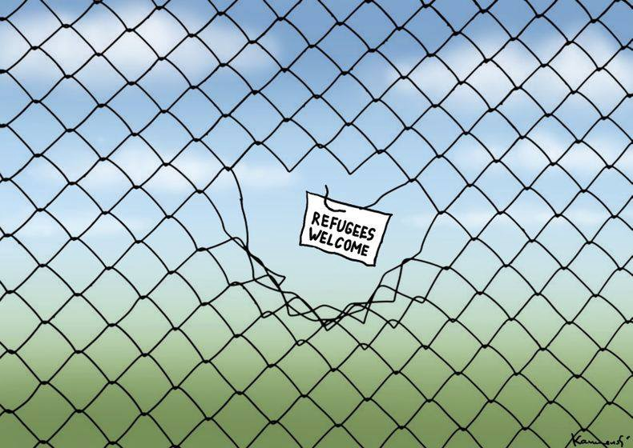
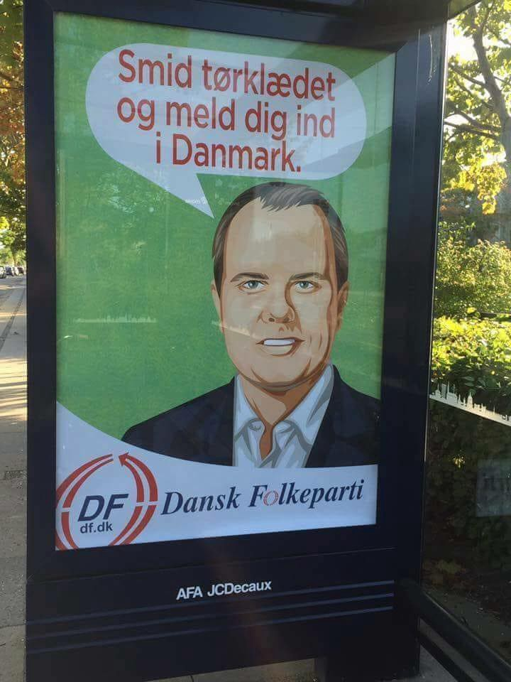

### AYS DAILY DIGEST 4/9/2018: Libya is not a safe country to disembark anyone rescued at sea, the UN claims

_Another ceasefire in Libya // Fighting intensifies in Idlib // 30,000 people have disappeared in the Sahara since 2014 // Unknown perpetrators destroyed a memorial in Lesvos dedicated to the refugees who have lost their lives in the Aegean Sea // No solutions for people stranded in Bosnia // Finlands halts deportation to Afghanistan, but also decisions on asylum applications_

By Marian Kamensky\. Art Against
#### Feature

**A ceasefire has been reached between armed factions fighting over Tripoli** , the Libyan capital, after more than a week of violence\. MSF team warns that many detention centers in Tripoli are on the front line of the fighting and that the latest escalation of violence has left people trapped for days in appalling conditions without food\.

Hundreds of people from different African countries who were being held in detention centers escaped in the middle of a shootout\. As many as 1,900 people are detained in these centres in Tripoli\.

According to the available reports, dozens of people have been killed in the fighting, while the chaos is persisting all over the country\. The same country that the EU sees as a partner in its attempt to stop the flow of migration\.

So far, no details from the ceasefire agreement are known, nor is how the agreement will be put in place understood\.

Libya is a country where at the moment there is no police or army, no functioning state\. Civilian lives depend on the mercy of the armed groups currently ruling over the country\.

The recent fighting began when armed groups outside Tripoli opposed a cartel of four “super militias” controlling access to state funds and foreign currency, a [ccording to the UN](http://www.refworld.org/docid/5b8d02314.html) \.

The [UN made a plea to the world](http://www.refworld.org/docid/5b8d02314.html) not to return anyone to the catastrophic situation in Libya, stressing that Libya cannot be considered a safe place to disembark anyone rescued at sea\.
#### Syria

**Fightings in the Idlib area have intensified over the last couple of days** , while the media are reporting that many civilians have been wounded or killed\. The UN is warning about a humanitarian catastrophe if air strikes intensify further, while calling on on Russia and Turkey to act urgently to avert “a bloodbath”\.

According to some reports, air strikes are happening in the villages of Inab, al\-Janudiya, Tal Aawar, Sririf, Jadraya and al\-Bariya\.

Idlib is considered to be the rebels’ last remaining stronghold\.

According to the UN, some 2\.9 million people live in this area, including many civilians who have already been displaced at least once from elsewhere in Syria\. The UN estimates that as many as 800,000 people could be displaced in the latest fighting\.
#### Sahara

**More people die in the Sahara than in the Mediterranean** \. According to IOM, Algeria has abandoned more than 13,000 migrants without water or food in the Sahara in the past 14 months\. IOM estimates that more than 30,000 people have lost their lives in the Malian or Libyan Sahara since 2014\.

](assets/dcd0eb3058dd/1*yK82VwK7zZdw3akeC20apQ.jpeg)

In the desert, people aren’t even numbers\. Photo by [Causacomuns](http://www.causascomuns.org)
#### Greece

**According to independent sources, at least 100 people arrived on Tuesday to Lesvos** , including more than 50 children\. The youngest child was 1 month old\.

At the same time, [police found](http://www.ekathimerini.com/.../greek-police-rescue-60...) 60 people from Iraq, including 27 children, walking on a highway near Thessaloniki after being left by their smuggler\. They entered the country via land border from Turkey\.

Local media from Lesvos are reporting that unknown perpetrators have completely destroyed a memorial dedicated to refugees who have lost their lives in the Aegean Sea\. Parts of the memorial were found floating in the sea\.

The memorial, dedicated to the victims of a shipwreck, was built at the edge of Thermi harbour around six years ago\. Last November, unknown perpetrators also vandalized the monument\.

The volunteer team of A Drop in the Ocean in Elefsina camp urgently needs a caravan to hold more activities, since the project is expanding\. If anyone knows of any organizations that could spare a caravan, [contact the team](https://www.facebook.com/groups/AthensVolunteersInformation/permalink/1491677490964543/) \.

The 7th Annual Image Conference will be held in Athens this year \(October 6–7th\) \. A portion of the conference will be focused on the context of teaching languages to displaced persons\. [Organizers are calling](https://www.facebook.com/groups/AthensVolunteersInformation/permalink/1491523954313230/) on the teaching community to be present at the conference and to share experiences\.

The extension of Katsikas Camp is nearing completion\. [Refugee Support in Europe](https://www.facebook.com/RefugeeSupportEurope/posts/2112562489063218?__xts__%5B0%5D=68.ARBB-6kabVz0wJYf7tFHnjvK5Dk2XLv0esnMBqvtpFCxWZCHQAGIOj4w-AK72doMqEJ6pn0FW1WLW3AUvu1jQeqIZBbtHIFevCQ5AGW-SeBqKQZvDVOwyZRJV6cni0NaO7La65HFt4rg4P0TiaT1fWU22PrUJC_HtAksDmpI6wiLs2_sw1zBHQ&__tn__=-R) volunteers are making some changes in our Free Shop to ensure we continue to deliver \#aidwithdignity to the estimated 1,000 residents that will live in the enlarged camp\.
#### Bosnia

**Authorities in Bosnia cannot agree on the future location of the camps** , leaving thousands of people living outside in inhumane conditions\. Since February this year, more than 10,000 people entered the country, most of whom have no access to proper accommodation\. There are many reasons for this, including the country’s dysfunctional politics, but also the fact that the EU is not willing to support the establishment of camps near the border\.

So far, the government, in cooperation with big NGOs, has established two camps, both mainly for families\. One improvised shelter, run by the local Red Cross, has been established in Bihac, but conditions are humiliating for all the people who are forced to stay there\. In Velika Kladusa, another border city, most of the asylum seekers are forced to live in a makeshift camp, while in Sarajevo hundreds are sleeping on the streets, depending on help provided by local people and volunteers\.

Djacki dom in Bihac\. Photo by One Bridge to Idomeni

At the time of publication, IOM has promised to erect a roof and put plastic where the windows should be at the building Djacki dom, where several hundreds of people are staying\. Even if this is done, it is still not a proper place for people to live\.

Families are being transferred to a recently opened accommodation in the old hotel Sedra, near Bihac\. At the moment around 180 families are there, and the plan is to have 400 people in the hotel\. IOM is in charge and no media have entered inside, but from what AYS has found out, there is no drinking water in this hotel, which was closed for a long period of time\.

Help is needed in Sarajevo, Bihac and Kladusa\. If you can help, please get in touch with [Red Cross in Bihac](https://www.facebook.com/CrveniKrizBihac/?fb_dtsg_ag=AdxS5HgBL7DAYWpNlYSnJ0Tv9OsQhfxZa9gDy1_m2K8t5A%3AAdygrvaZ9gQ_4d2kQuPLxyVJSHP8U7iRdju04fAYIIovDQ) , or volunteers in Kladusa and Sarajevo — [SOS team Kladusa](https://www.facebook.com/SOSTeamKladusa/?fb_dtsg_ag=AdxS5HgBL7DAYWpNlYSnJ0Tv9OsQhfxZa9gDy1_m2K8t5A%3AAdygrvaZ9gQ_4d2kQuPLxyVJSHP8U7iRdju04fAYIIovDQ) , [Souls of Sarajevo](https://www.facebook.com/soulsofsarajevo/?fb_dtsg_ag=AdxS5HgBL7DAYWpNlYSnJ0Tv9OsQhfxZa9gDy1_m2K8t5A%3AAdygrvaZ9gQ_4d2kQuPLxyVJSHP8U7iRdju04fAYIIovDQ) and [NNK](https://www.facebook.com/NoNameKitchenBelgrade/?fb_dtsg_ag=AdxS5HgBL7DAYWpNlYSnJ0Tv9OsQhfxZa9gDy1_m2K8t5A%3AAdygrvaZ9gQ_4d2kQuPLxyVJSHP8U7iRdju04fAYIIovDQ) \.
#### Hungary

**The government issued a decision to prolong for six months the state of crisis “due to mass migration,”** Hungarian Helsinki Committee reports\. This decision allows the automatic arbitrary detention of asylum seekers in transit zones and automatic push\-backs to Serbia from the entire territory of Hungary\. More on the state of emergency in this updated HHC [document from March](https://www.helsinki.hu/wp-content/uploads/HHC-Info-Update-rule39.pdf) this year\.
#### France

**Calais update: response to the warehouse fire**

In just 3 days, the Refugee Women’s Centre has reached its emergency fundraising goal\. But there’s still much to do\.

#### Denmark

**“Throw away your scarf and become a member of Denmark\.”** This is the message to Danish Muslims from the Danish People’s Party \(DF\), left on bus\-stands around the country\.

Dansk Folkeparti is currently the third largest party in the country\. They support the right\-wing liberal/ conservative government\. Together, they passed the infamous law that forbids wearing a niqab or burka in public, as well as any mask which covers the mouth/nose or eyes, which went into effect August 1st\. Now DF is publicly claiming the war against the headscarf\.

At the same time, a new law, which would require applicants to sign the Danish constitution and shake hands with the mayor before receiving citizenship, has been proposed and is waiting to go through parliament\. If anyone refuses to shake the hand, they will be denied Danish citizenship\.

On the positive side, the grassroots movements, which celebrate diversity, are getting more active members to confront the harsh rhetorics DF is using\.
#### Finland

**After the publishing of UNCHR’s report on August 30, 2018, Finland has halted all deportations to Afghanistan** while it re\-evaluates its asylum policy\. At the same time, no decision on asylum applications for people from Afghanistan will be made during this time\.

Amnesty International recently demanded that Finland end all deportations to Afghanistan, saying that the security situation there has deteriorated considerably\.

During the 12\-month period leading up to the end of May this year, officials had ruled on a total of 4,229 Afghan asylum applications\. Nearly 3,000 applications were approved during that time, while close to 1,000 were rejected\.

**We strive to echo correct news from the ground through collaboration and fairness\.**

**Every effort has been made to credit organizations and individuals with regard to the supply of information, video, and photo material \(in cases where the source wanted to be accredited\) \. Please notify us regarding corrections\.**

**If there’s anything you want to share or comment, contact us through Facebook or write to: areyousyrious@gmail\.com**

_Converted [Medium Post](https://medium.com/are-you-syrious/ays-daily-digest-4-9-2018-libya-is-not-a-safe-country-to-disembark-anyone-rescued-at-sea-the-un-dcd0eb3058dd) by [ZMediumToMarkdown](https://github.com/ZhgChgLi/ZMediumToMarkdown)._
