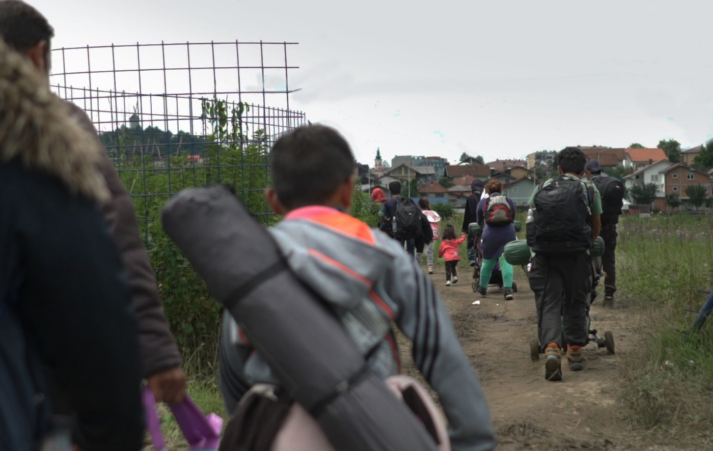
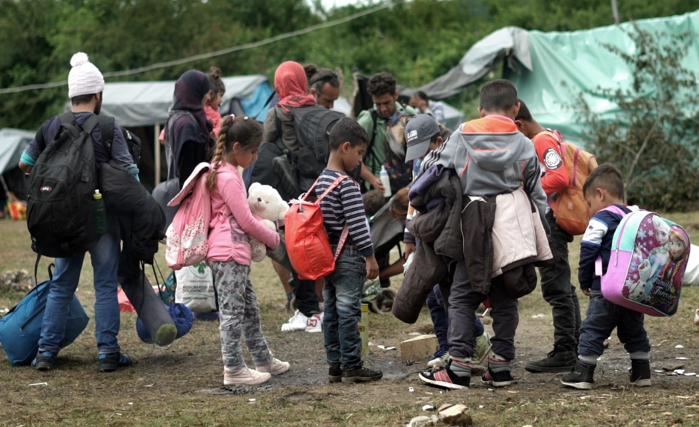
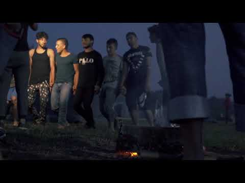
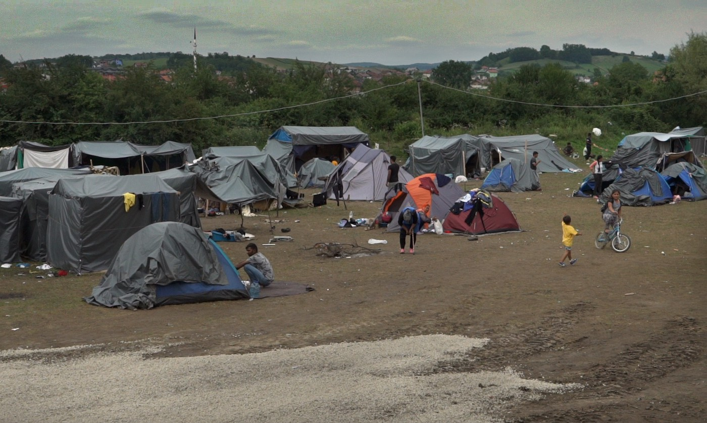
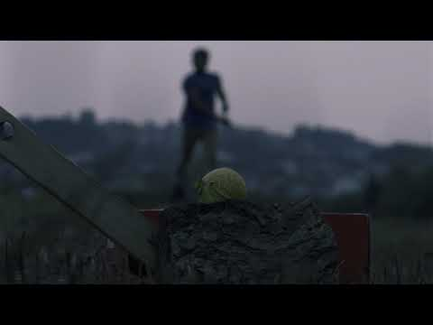

### AYS SPECIAL from Bosnia: The game

_“The game” — is how people on the move call every attempt to cross the borders, as the chances to make it work are so slim\. While you are reading this, hundreds of people stranded in the Balkans are getting ready for the game, dreaming about life in European Union\._

Leaving for the game from Kladuša\.

After “the game”, when and if people reach the EU, they are repeatedly and often violently pushed back by Croatian and, increasingly, Slovenian border guards\. Many are coming back with wounds, even broken bones, smashed phones, robbed and intimidated\. Police brutality affects them on an everyday basis; even dog bites and electric shocks have been reported\. Destroying phones with photos and GPS traces also aims to erase evidence of meeting with uniforms, as pushbacks break international law\.

The rules of the “game” are common knowledge in Velika Kladuša\. In Bosnia\-Herzegovina, asylum seekers burdened with inadequate survival equipment can walk comfortably in the light of day, but once they cross the Croatian border, movement becomes limited and dangerous\. Walking is possible only in deep darkness, far away from roads, paths, urban areas and lights\.

Usually they cross the border in the evening\. They walk during the whole night through the “jungle” — the Croatian mountain forest\. They move as fast as possible\.

While rushing forward without visibility, it’s hard to protect themselves from insects, abrasions, sprains, cold and rain\.

There are also remains of the war in the 1990s — landmines are still found\. Amir, a young English teacher from Iran, describes in detail the many dangers that lurk in the dark\. He flew to Serbia a month ago on a tourist visa and he has already made several unsuccessful attempts\.

_“There are dogs in every village and when they bark we are scared\. So we run as fast as we can, like Usain Bolt\. In the jungle we are faster than he is\. We go on until the sun rises\. Then we take a break\. We sleep until one — two o’clock, then we prepare food, we eat, rest and wait for the night when it starts from the beginning until we reach our destination or get caught\.”_

There are different destinations: sometimes people walk all the way to Italy, Slovenia or Zagreb, and sometimes they pay for a car that is arranged to pick them up in an appointed place in Croatia\. Amir once made it with a group of people to the place where the car was supposed to come, 34 km from the border\. Although there was a family with two children in the group, they were supporting each other, carrying an eight\-year\-old girl most of the time\. It took them two nights to reach that point\. They waited, but the car didn’t show up\. After three days they ran out of food and water, so they had to surrender\. The police brought them back to the border\. It took 20 minutes\.

Make\-shift camp in Velika Kladuša

There are mostly single men, as passage in hiding is dangerous and exhausting, but there are also many families with children, elderly people, some pregnant women and newborn babies\. Yusuf is the leader of his extended family: besides his wife and two sons, there are two other couples, his grandmother, sister and kids, two of them in baby carriages — eighteen people all together\. They are Kurds from Syria\. Yusuf has a brother who lives in the UK and whom he visited last year\. He spent a few months there and has decided to bring the whole family\. They have been walking for months\. The photo collection in Yusuf’s phone shows photographs of the family in front of all kinds of wild landscapes, some as strange as a snow\-covered forest in Bulgaria\.

The situation of people temporarily residing in Bosnia–Herzegovina is dire\. Although the local authorities often try to help, due to the lack of resources and structure they can’t support even basic needs\. Big humanitarian NGOs have neglected their responsibilities so far and the most efficient assistance comes from groups of independent volunteers and local residents\.

**_\(Text, video and photo by Anna Domanska, Velika Kladuša, July 2018\)_**

**We strive to echo correct news from the ground through collaboration and fairness\.**

**Every effort has been made to credit organizations and individuals with regard to the supply of information, video, and photo material \(in cases where the source wanted to be accredited\) \. Please notify us regarding corrections\.**

**If there’s anything you want to share or comment, contact us through Facebook or write to: areyousyrious@gmail\.com**

_Converted [Medium Post](https://medium.com/are-you-syrious/ays-special-from-bosnia-the-game-5a56eb2e9a6e) by [ZMediumToMarkdown](https://github.com/ZhgChgLi/ZMediumToMarkdown)._
