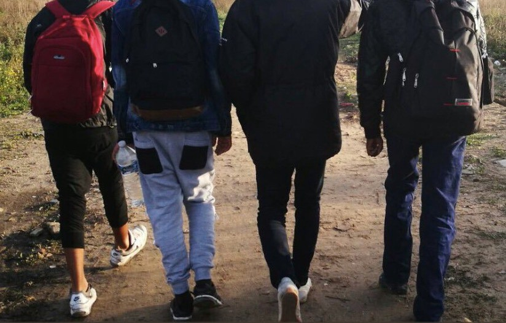
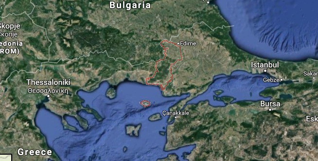
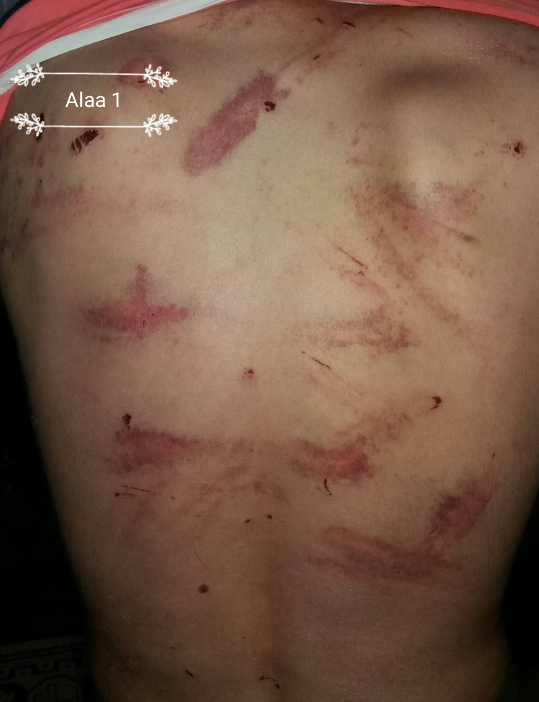

### AYS NEWSLETTER: Violent Robberies and Deportations of Refugees in Greece’s Evros Region

_“When my 20 year old son arrived in Greece, instead of being able to claim asylum, he was arrested by police, he had with him our family’s savings, 7,000 euros, and his Syrian passport — all were stolen from him\. He so badly beaten — he was hospitalised for a week\.”_

These are the words by a distraught Syrian father of a young son, who has refugee status in Germany\. [Refugee Info Bus](https://www.facebook.com/RefugeeInfoBus/?ref=br_rs) has spoken with him on the phone and he told us also that he was unable to do family reunion with his child\. His son is now alone, in an Istanbul hospital, without money, his phone, or any documents\.

Over the past six weeks, RIB have been in contact with eight groups who, at separate times over a six weeks period have experienced extreme violence at the hands of officials working inside Greece’s Evros region — these have included various military and civilian personnel including, police, the army but also international military representatives, from Germany and elsewhere in Europe, as part of the EU’s Frontex operation\.

Among these, people been have arrested by police and army trying to catch a train from a local station, or even walking in the region, as far as 150 km away from the Turkish border\. Every group had their phones, documents and money stolen and were badly beaten\.

RIB spoke with a group of Palestinian men, one of whom had their legs broken, another beaten, stripped, and forced to walk back across the river naked\.

They also described how one woman was sexually assaulted in front of her husband, by officials patrolling the region\. They have become so traumatised by their experience, that they have decided to stay in Turkey\. They wanted light to be shed on these events, so that they do not happen to anyone else\.

RIB have referred these details onto the Greek Council for Refugees, as well as UNHCR and writing reports to the Greek Ombudsman, in the hope that somehow someone will be held to account\. For now though, it seems that this violent deterrent on Europe’s land border, is making members of police and army, very wealthy — at the expense of the lifetime savings, and safety, of people fleeing war\.

It is necessary also to look at the horrific events inside Greece within the broader context of what is really happening to refugees who are being returned to Turkey\. Erdogan has stated [how Turkey can no longer take in any more Syrian refugees](https://uk.reuters.com/article/uk-mideast-crisis-syria-erdogan-refugees/turkey-can-no-longer-take-in-more-refugees-says-turkeys-erdogan-idUKKCN1LN1OE) , and has pledged to facilitate their return\.

The realities of these statements are being played out on Turkeys coastlines\. We are in contact with, and trying to assist where we can, three groups of people, forcibly deported from Turkey, to the Idlib region of Syria, having been caught by Turkish police trying to travel to the Greek Islands — among them are Syrians, Yemanis and Iraqis, including elderly men with serious health conditions\. Like the millions of other civilians hemmed inside Idlib, they are stuck, forced back, pushed back into danger and European taxpayers money is instrumental in allowing this to happen\.

_\( **By Sarah Story and Obaida Kotainy of Refugee Info Bus\)**_

**We strive to echo correct news from the ground through collaboration and fairness\.**

**Every effort has been made to credit organizations and individuals with regard to the supply of information, video, and photo material \(in cases where the source wanted to be accredited\) \. Please notify us regarding corrections\.**

**If there’s anything you want to share or comment, contact us through Facebook or write to: areyousyrious@gmail\.com**

_Converted [Medium Post](https://medium.com/are-you-syrious/ays-newsletter-violent-robberies-and-deportations-of-refugees-in-greeces-evros-region-e492823a2934) by [ZMediumToMarkdown](https://github.com/ZhgChgLi/ZMediumToMarkdown)._
