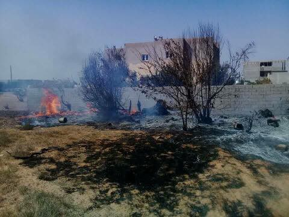
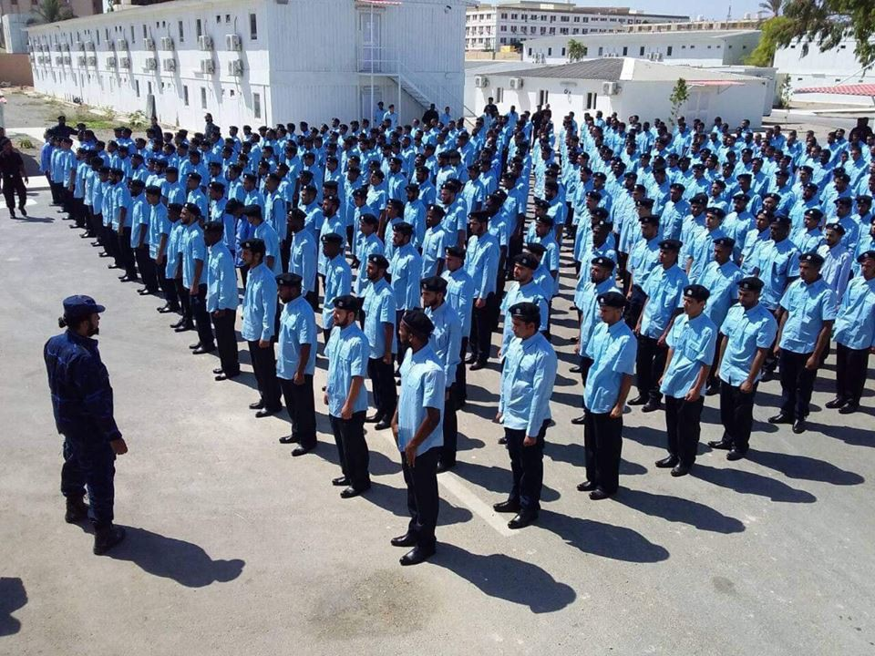

### AYS Daily Digest 20/09/18: Politicized sentencing of Ahmed H\. in Hungary: “He did not commit a crime”

_Deportations from Morocco / Violence in Tripoli / Apology from EASO to Advocates Abroad / Many transfers from islands to mainland Greece / Calls to end prison islands / Updates from Paris / And much more…_

](assets/e5386fd929f1/1*G7iSy91yMBOGq85RyW5oVA.jpeg)

\#noborders Photo by [Syrilution Creative Arts](https://www.facebook.com/artagainstproject/photos/a.639651369417634/1872959052753520/?type=3&theater)
### FEATURE

[On Thursday](https://www.amnesty.org/en/latest/news/2018/09/failure-to-quash-terror-charges-against-syrian-man-a-devastating-blow-for-justice-in-hungary/) , Ahmed H\. was convicted of “complicity in act of terror” by the Hungarian Court of Appeal\. He is found guilty of acting during clashes with the police on the Serbian\-Hungarian border during September 2015\. Human rights organizations and others are furious since the decision seems to be politically motivated against refugees and given that he has already spent three years behind bars\.

> “By blatantly misusing terrorism\-related provisions and riding roughshod over the law, this verdict exemplifies the erosion of the rule of law and human rights protections in Hungary\.” 

> \- Eda Seyhan, Amnesty International 

[He was sentenced to five years](https://twitter.com/demeteraaron/status/1042730569396838400) , facing a maximum of two more years in prison, and a minimum of four months' more of detention\. Still, he doesn’t speak Hungarian, his wife and daughter are having to live without him, and he has been convicted of a crime he didn’t commit\.

The horrors in Hungary for refugees continue\.
### MOROCCO

[They have started](https://twitter.com/Tere_Palomo/status/1042846955255341057) to deport people in Morocco back to their countries of origin\.

[Association Marocaine des Droits Humains\- Section Nador](https://www.facebook.com/AmdhNador/posts/2188629074682689) followed the operations of the Moroccan authorities, the embassies of African countries, and IOM and noted the deportation of at least 50 some people who were illegally arrested over the past three days\.

](assets/e5386fd929f1/1*5rsX3XjU6PRC9ABwXN8nKA.jpeg)

Photo by [Association Marocaine des Droits Humains\- Section Nador](https://www.facebook.com/AmdhNador/photos/a.1693125780899690/2188680924677504/?type=3&theater)
### LIBYA

[Heavy fighting](https://twitter.com/Lyobserver/status/1042811622622941184) continued Thursday morning in the south of Tripoli\. Rockets fell on many civilian areas\.

[A ceasefire meeting](https://www.libyaobserver.ly/news/unsmil-holds-meeting-ceasefire-committee-diplomats-violence-rocks-tripoli%C2%A0) was held by the UNSMIL and between the Head of Ceasefire Monitoring Committee Hussein Abdullah and the Libyan diplomatic community, but the ceasefire was obviously broken\.

](assets/e5386fd929f1/1*r2eDrJRz_sQPvAFHN-cryg.jpeg)

Photos by the [Libya Observer](https://twitter.com/Lyobserver/status/1042811622622941184)

As for the conflict affecting displaced persons and refugees:

> [\(IOM\)](https://www.libyaobserver.ly/inbrief/iom-19225-people-displaced-start-conflict-tripoli) revealed that the number of displaced since the outset of Tripoli’s clashes on August 26 is estimated at 3,845 families\. 

Troops were also lined up at detention centers, ready for any clashes that might break out due to the outside fighting\. Libya continues to be an active violent zone and cannot be considered a safe country for refugees\.

](assets/e5386fd929f1/1*3kls5gT0269DlqDys6M0ag.jpeg)

Soldiers at a detention center for migrants\. Photos by [the Libya Observer](https://twitter.com/Lyobserver/status/1042352481051848705)

A new study has found that the liquidity crisis in Libya is affecting refugees in that they have to work more, but are earning less\. The economic crisis started in 2014 after returned internal conflict arose since the Arab Spring and the topple of Ghaddafi and to led to where the Libyan dinar has significantly lost value\. Most refugees are getting paid in cash, which means they are at a very high risk of robbery and kidnapping\. Locals feeling the hardship on of the crisis are essentially preying on refugee workers\. A long term economic solution must be put in place to ensure the vitality of the country\. Find out more about the study [here](http://www.reach-initiative.org/libya-liquidity-crisis-forces-refugees-and-migrants-to-work-more-yet-they-earn-less) \.
### SEA

[The Aquarius](https://twitter.com/msf_sea/status/1042696721086771200?s=21) rescued a small distressed boat in international waters on Thursday morning with 11 people\. They were told to bring them back to Libya but refused\. The Libyans are now refusing to take them since receiving no for an answer\. The Aquarius is waiting for Italy or Malta to provide them a port of [safety\.](https://onboard-aquarius.org/)

](assets/e5386fd929f1/1*R4i6uWbhi9GGkjfx7HGKpw.jpeg)

Photo by [SOS Mediterranee](https://twitter.com/SOSMedIntl/status/1042754858108039168)

[Salvamento Maritimo](https://twitter.com/salvamentogob/status/1042854086784241664) said they were able to rescue 10 boats in the strait, Alboran, Cartagena and Baleares with a total of 337 people on Thursday\.
### GREECE
#### Islands

[Amnesty International Greece](https://www.amnesty.gr/news/press/article/21553/se-mayri-trypa-ton-anthropinon-dikaiomaton-metatrepontai-ta-nisia-toy) writes in a press release on Wednesday:

> “The Greek authorities must immediately take refugees to the mainland and end the inhumane containment policy that has trapped nearly 20,500 people in unacceptable and overcrowded conditions on the Aegean Islands\. The conditions in the refugee camps have reached an uninhibited\.” 

While certain efforts have been made recently to move more people to the mainland, the fact that the system is to begin with inhumane can no longer be ignored\.

A detailed update report of Lesvos came from Heimatstern [e\.V](https://www.facebook.com/heimatstern/posts/2251974728372975?__xts__[0]=68.ARD-dauEkl2iEz6UiOkJrt8Gf83tWnTo6fv1wsVhFzEyj8ulD5kt1Ldcw9s_Tfk6SMCdOdiuvdxt80ppoMfWU68p5-FLCOGvoSvwOOydebQCsph3QOlX7FvXN2zyIeSlozuKzCirdTCpF7FAPDNm2RWBWsHprooIpjI37rX5rgplFz5L-MsN&__tn__=H-R) \. One of the most disheartening aspects came from the medical perspective:

> “People who get physically healthy to camp Moria get sick here\. There are not enough doctors, not even for a diagnosis to refer sick to a clinic\. To clinics that are on the island all beyond their capacity, in chronic\-Greece\. The Keelpno \(Ministry of health\) has 2 doctors in Moria\. One was in our visit to vacation, the other for family problems not present\. 96 percent all refugee women on Lesbos have become at least rape, in their home or on the run, according to a voluntary victim\. Many of the unaccompanied women are pregnant\. Or get pregnant in Moria\. Doctors without borders have documented cases of 10\-Year\-old children who wanted to kill themselves in Moria\.” 

](assets/e5386fd929f1/1*s0nnh-eBBS0OS1MTkwsRHg.jpeg)

Moria Photo by [Arantza Diez](https://twitter.com/arantzadiez/status/1042762831811276800)

[300 people](https://www.facebook.com/samosvolunteers/photos/a.567427800102051/1083511911826968/?type=3&theater) were finally able to leave the horrors of the camp on Samos for the mainland this week\. Samos Volunteers stated that some had been living on the island for 2 1/2 years\. While they are certainly happy for the ones leaving, they warn:

> “However, almost 3,000 other men, women and children are still stuck in a camp where the living conditions leave little space for hope and happiness\. Winter is coming, and the waiting continues\.” 

A general practitioner volunteer is desperately needed on Samos\! If you know of anyone please go [here](https://www.facebook.com/HumanityDOESmatter/posts/1948950325128050?__xts__[0]=68.ARA9KE-l26lL15FAcshrtloLa11vgN9WsaG_8PO0IP2FtGJJH91JNoUvI4YA8DUh2AFwMqYj7mpg5p9GhU0WF7FHd2JyXXJ1tCFMOlRp4_GuzbAXQdMhBZmB091OKNzXDQ5eoGrJNYPJCFsXjz_42HdR_zpzWWwrHkga2P6JzRFWlt-3S9vg1g&__tn__=-R) for more details\.

[NGO Attika](https://www.facebook.com/AttikaHumanSupport/posts/700649303624061?hc_location=ufi) on Lesvos needs your help to start preparing for winter\! Please follow the link here to find their needs list\.

](assets/e5386fd929f1/1*ERhuFv68ylwmMw-iJXXkRg.jpeg)

Moria Photo by [Neraidoni](https://twitter.com/neraidoni/status/1042670683933892614)

A new project is about to start that provides training in the Greek fishing trade and refugees should be able to apply\! At the end of the internship there is “the possibility of gaining paid work on a fishing boat depending on the captain’s judgement\.” The course is being provided in Greek and Arabic and free training can be provided to 20–30 participants\.” Please contact [lefteris\.arapakis@gmail\.com](mailto:lefteris.arapakis@gmail.com) for more information\.

ReFOCUS is a non\-profit on a mission to change outcomes for refugees\. “Through photography, video production, sound recording and graphic design our programming assures that refugees spending long months and even years waiting for asylum will enter the labor force of their host countries with modern, marketable skills\.” They need your help in continuing their programs\. Find out more [here](https://www.facebook.com/1976km/?hc_ref=ARQrZhS5PdpFA7xjwTBfK4dq7Ytz7x7GM-PtV_Gzcn-eAa7kY4v8Ld0tsVyEXBZrABI&fref=nf) \.
#### Mainland

The Greek Helsinki Monitor released an open letter to Prime Minister Tsipras on systematic police violence and illegal deportation of asylum seekers in Evros \(Greece\), read it [here](https://greekhelsinki.wordpress.com/2018/09/20/2-45/) \.
### ITALY

[EASO](https://twitter.com/EASO/status/1042730087676751872) \(European Asylum Support Office\) states that their cultural mediators in Reggio Calabria have found more than 500 potential asylum seekers for family reunification\. That’s exciting news if the process can come into fruition\.
### AUSTRIA

[Sea Watch member,](https://www.facebook.com/watchthemed.alarmphone/posts/2222762054664692?hc_location=ufi) Tamino, was arrested yesterday before being able to give a speech at the NoS20 in Salzburg\. He still gave the speech on Europe’s responsibility in the Mediterranean, but in the back of a police van\. [Here](https://www.facebook.com/seawatchprojekt/videos/299096580821482/?fref=gs&dti=1652972374920129&hc_location=group) is a link to the video \(it’s in German\) \.
### FRANCE

[**In an update from Paris**](https://www.facebook.com/care4calais/posts/2104131759619770?__xts__[0]=68.ARA1Qr6e7WfmlapJ2cLzT7Y7IevFNWslI942S8EhzpXQeV7XdgOZPz623Kkf7MfFPHH3XtV1vKuUPa2qO4qGf-wHZyOXTum-VWUkorwa0pBurMvZv2brBucqSqIt0oA0uTwucvoi7BDlkmw3WlU2wvgZHP7ZV4emleEfFe69dg8vPaZSZoBZwQ&__tn__=-R) , volunteers are saying that there are a few hundred people living on the streets because police keep moving them to ensure that they don’t form a camp\.

Single men and families are in equal numbers living on the streets, with many accompanied minors as well\. Some on the streets are victims of Dublin returns while others are new arrivals\. There are five centers processing new arrivals: three for single men and two for families\. Volunteers are continuing to do everything in their power, but without a government solution homelessness will continue\.
### BELGIUM

La Voix Des Sans Papiers Bruxelles has developed a list of demands before the next elections for municipalities to help undocumented people in Belgium\. The demands cover the areas of healthcare, food, housing, school for our children, work, access to training, and security/\(protecting against\) racism\.

> “We call on the administrators…to show political courage on these issues\.” 

To find out more, read [here](https://www.facebook.com/voixsp1/posts/1896687433747810?__xts__[0]=68.ARAoLTXDIaXK7LEBt29rmGrahMHpXjK4ZcIcDRNAgIxg_QF6ordfnRErgUEyZT-DZ5Cqr1Fr_iKAbCUSFp5s_9LQMYjzqD4-oo6JiJGxeDO0DjAufMyEdQwzPdA67c0UHWpHc0a8DiMfodGeswujcUpPonQR4BJrPDGqNRiI47l-C9v0dNCbGw&__tn__=-R) \.
### NETHERLANDS

The Refugee Art Show Eidhoven by Love Without Borders will be held on Sunday September 23\. They will be showing works from refugees and children in war torn countries\. Come out and help support these artists\! The team is also looking for volunteers for the event, so check it out [here](https://www.facebook.com/events/540855889661952/permalink/575088236238717/) if you’re interested\.
### SWEDEN

Fatemeh Khavari, the front figure for the movement demanding permanent residency and a stop of all deportations to Afghanistan, wrote an update today stating that if someone wants to get in touch with her regarding young homeless Afghans, or those who soon will be in need of accommodation, they should write to her on Facebook\.

She is currently compiling information about volunteers, accommodation, and help in different regions, and she intends to live stream it in Dari when it’s done\. If anyone wants to help or has someone in need of urgent help — write to her, do not call\.

Find out more [here](https://www.facebook.com/victoria.nilsson.71216/posts/527940444314733) \.

**We strive to echo correct news from the ground through collaboration and fairness\.**

**Every effort has been made to credit organizations and individuals with regard to the supply of information, video, and photo material \(in cases where the source wanted to be accredited\) \. Please notify us regarding corrections\.**

**If there’s anything you want to share or comment, contact us through Facebook or write to: areyousyrious@gmail\.com**

_Converted [Medium Post](https://medium.com/are-you-syrious/ays-daily-digest-20-09-18-politicized-sentencing-of-syrian-man-in-hungary-he-did-not-commit-a-e5386fd929f1) by [ZMediumToMarkdown](https://github.com/ZhgChgLi/ZMediumToMarkdown)._
