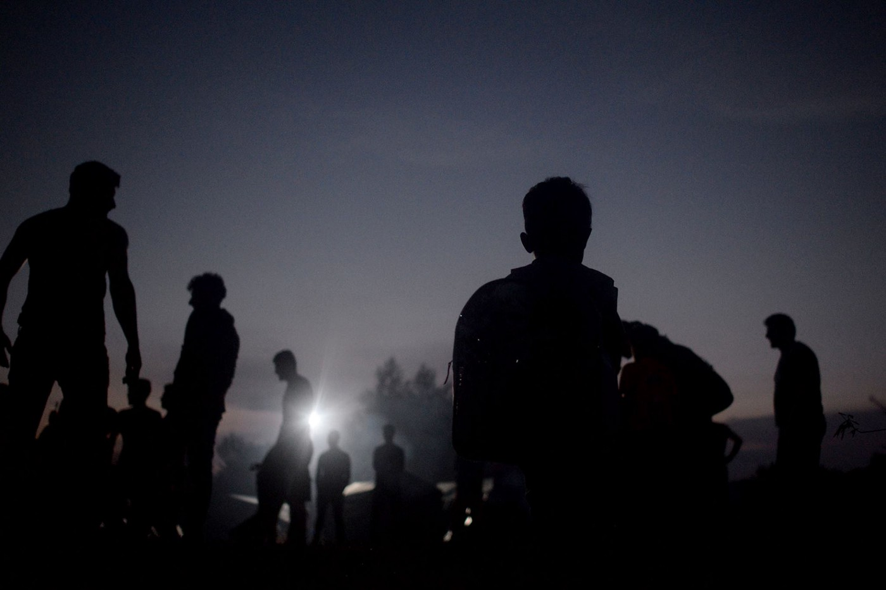
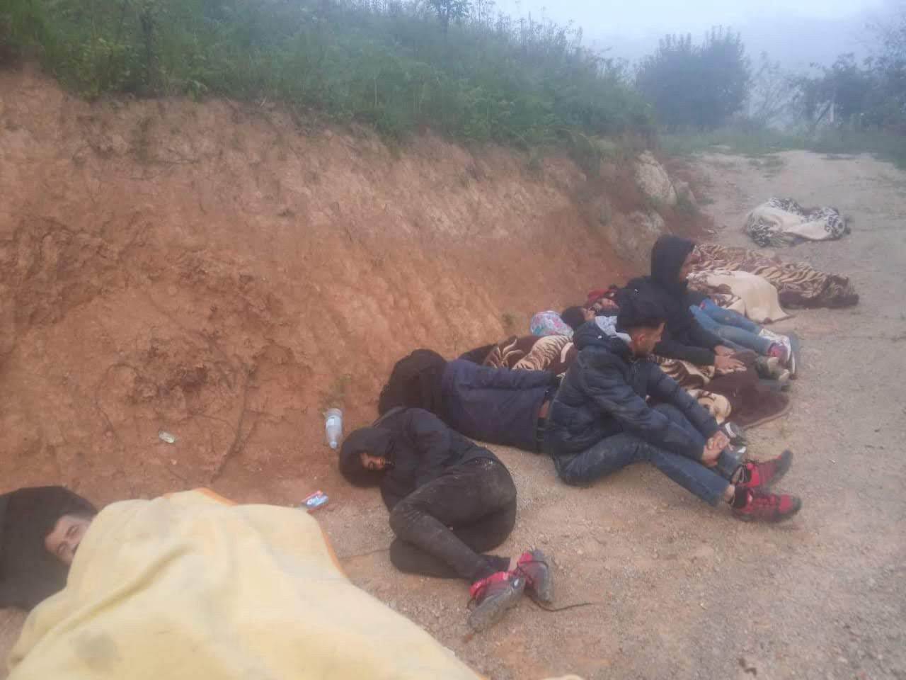

### AYS DAILY DIGEST 21/09/2018: International Day of Peace in 2018, Human Rights in Pieces\.

_The “right to peace” versus the reality // The evacuation of Chios begins with 100 people // over 100 arrive in Greece // New Squat in Athens // Everyday Activism: Citizens of Tuzla supporting people in Bosnia // Right\-wingers take to the streets in Germany // Urgent needs in France_

Photo Credit: Gabriel Tizon
### FEATURE: On International Day of Peace, Human Rights are in Pieces

The International Day of Peace saw it’s 70th year of “celebration\.” The year marks the 70th year of the adoption of the universal declaration on human rights in 1948; in keeping with this, this year, the theme was the “right to peace\.” However, the reality behind these lovely platitudes is nothing more than horrifying\. In 2018, we see the European Union happily collaborating with those whose agendas prioritize cruelty in the name of “security\.” In Italy, activists took to the streets to condemn the Italian government which stands by silently as refugees from Darfur remain in desperate living conditions for over two months now, without institutional support\.

> “Abandoned in the name of defence of “right to private property” in open conflict with the right of these people to have a life worthy of this name and in violation of the international treaties that Italy has signed, in this case yes, exposing to international disgrace our country that doesn’t even respect the agreements it signed\.” 

](assets/b15003398ed4/1*0l-h3cLsGz1ia7LkePsq7w.jpeg)

Photo Credit: [Federazione del Sociale USB](https://www.facebook.com/FederazionedelSociale/?tn-str=k%2AF&hc_location=group_dialog)

In Libya, the EU’s partner in “migration management”, ongoing fighting continues to scatter refugees and migrants, impeding their attempts to register and gain necessary support\. Many of these individuals were placed in detention after being intercepted at sea as sanctioned by officials around the world\.

■■■■■■■■■■■■■■ 
> **[Sally Hayden](https://twitter.com/sallyhayd) @ Twitter Says:** 

> > Nearly four weeks after starting this thread I'm in touch with 12+ migrants &amp; refugees who were in Tripoli detention before Aug 26 fighting began, &amp; are now spread out over Libya. Many I can't share details of bc of safety. "By Mighty God power we staying alive"- one just sent me 

> **Tweeted at [2018-09-21 10:29:56](https://twitter.com/sallyhayd/status/1043084909391372293).** 

■■■■■■■■■■■■■■ 

Hayden also details that at least 450 people in detention went without food and water for four and a half days\. UNHCR and other bodies have finally stated that Libya should not be considered a safe return point for refugees, especially in light of the recent outbreak of violence, yet… silence\.

An infographic shows just how drastically policies within Italy can affect the life and death of people at sea

■■■■■■■■■■■■■■ 
> **[Matteo Villa](https://twitter.com/emmevilla) @ Twitter Says:** 

> > Rotta libica, morti in mare: il grafico.

E, con la scomparsa dei mezzi di ricerca e soccorso vicini alle coste libiche, per l’ultimo periodo è sempre più possibile si tratti di una sottostima. https://t.co/PdGqfpqHGo 

> **Tweeted at [2018-09-21 06:11:10](https://twitter.com/emmevilla/status/1043019787071180800).** 

■■■■■■■■■■■■■■ 

Proactiva Open Arms also notes that the numbers under Salvini’s policy are likely low due to the prohibition of SAR operations at the Libyan sea boundary\. Additionally, EU observer notes that individuals who were members of the Libyan coast guard and who were refused life\-saving training are back at work, with some of them most likely complicit in people smuggling themselves or serving as members of militias\. This catastrophic situation is one that is being happily funded and supported by the “defenders of human rights” who wish to externalize their borders, and, in so doing, push their consciences even further\.

How long will we pay lip service to the platitudes of peace and stand idly by, sanctioning the abuse of people within the system, and the persecution of people who, fearing for their lives and dignity, avoid the system\. Again we are reminded of the cries of people, NGOs, human rights organizations, and other groups about the horrific conditions in Moria, on Chios, and [on the mainland](ays-special-from-athens-we-were-forced-to-go-illegally-a002cf09990f) faced by refugees in Greece\.

If the entire argument around these International Days and declarations is to raise awareness…where in the end is the action? “Knowing is the first step\.” We think that by now, most people, at least most agencies and governing bodies involved in sustaining or changing these systems, know\.

They know, but they simply do not care\. Or worse yet, they actually give their tacit approval\. Although universal declarations can be a useful first step, if further steps aren’t taken, in some ways does this not indicate that human rights have taken a step \(or dozen\) backward? After all, there is no more excuse of “we didn’t know\.” Instead, we now know, and are, through our inaction, choosing “yes\.” We hope that the public will reach a tipping point soon in the face of this grotesque hypocrisy\.

Peace does not mean pacified, and a peace that comes at the cost of human lives and dignity is no peace at all\.
### MOROCCO

AMDH Nador has been monitoring ongoing returns of individuals from Morocco to Cote d’ Ivoire\. They report that not only are the police of Cote d’Ivoire complicit with the returns, that prior to deportation, the phones of all those taken were seized and “emptied of all contents\.” The phones were later returned\. Additionally, the deportation of women and children continue, with at least 45 being sent back yesterday\. Follow [AMDH Nador](https://www.facebook.com/pg/AmdhNador/about/?ref=page_internal) for more details\.
### SEA

Salvamento Maritimo rescued nearly 200 people yesterday in the waters around Spain\. The Aquarius rescued 11 people and will keep them onboard until they have clear guidelines on how to disembark the people to safety\. The catch\-22 of the SAR situation in the Med is summed up neatly below:

■■■■■■■■■■■■■■ 
> **[Matteo Villa](https://twitter.com/emmevilla) @ Twitter Says:** 

> > Last night, Italy answered #Aquarius 2's request for a place of safety for disembarkation.

Again, the paradox:

(a) JRCC #Libya coordinates, but #migrants should not be disembarked there;
(b) other countries refuse disembarkation on the grounds of not having coordinated rescue. https://t.co/cRZ1RGfWa9 

> **Tweeted at [2018-09-21 08:34:35](https://twitter.com/emmevilla/status/1043055880261038081).** 

■■■■■■■■■■■■■■ 

### GREECE

According to **Aegean Boat Report** , these are the Arrivals for yesterday:

> 47 People to Samos
 

> 35 people off Kos \(unclear their destination\)
 

> 30 to Lesvos
 

> 10 to Chios 

> That means 102 people all told\. 

The first 100 from Moria camp have left for the mainland\. After the ongoing outcry about the horrific living conditions and conflict in Moria, the decision to relocate 3000 people to the mainland is finally being realized\. The new camp will be located near Thessaloniki, in Volvi, and has a capacity for 1400 people\. The goal is to move 2000 people by the end of September, and the remaining 1000 over the following weeks\. Read more [here](http://www.keeptalkinggreece.com/2018/09/21/moria-camp-lesvos-asylum-seekers-relocation/) \. Note that Moria \(with a capacity for 3000\) currently holds around 9000 people\.

■■■■■■■■■■■■■■ 
> **[MSF Sea](https://twitter.com/MSF_Sea) @ Twitter Says:** 

> > This is #Moria, where ~9000 people, 3500 children, live in a space for 3100, with inadequate medical care, lack of protection and terrible living conditions. It's urgent to evacuate now the most vulnerable to a safe space in #Greece or other #EU states #evacuateMoria https://t.co/FIsPbW2N25 

> **Tweeted at [2018-09-21 15:46:26](https://twitter.com/msf_sea/status/1043164558976864257).** 

■■■■■■■■■■■■■■ 

> A new Squat for Families has opened in Exarchia\! Spirou Trikoupi 15 Exarchia 

Lifting Hands International needs a new Warehouse Coordinator in Serres\. Please read their post below for more details\!

> As warehouse lead, you would: 

> > manage our warehouse where all food, clothing and hygiene aid is stored
 

>  > be responsible for ensuring our resident census remains up to date 
 

>  > work closely with some long\-term residents who help with aid distribution, translation and census updates when new families arrive/old families leave
 

>  > lead our seasonal clothing distributions
 

>  > manage other volunteers when they come to help out at the warehouse, ensuring everyone knows what they’re doing and that tasks are completed in a logical, efficient manner\. 
 

>  > be responsible for ensuring all weekly food and hygiene aid is ordered, sorted and delivered to the refugee camp
 

>  > drive to and from nearest city Thessaloniki to pick up supplies from bigger NGOs
 

>  > Documenting all incoming donations
 

>  > lead our garden project: we have a small piece of land on our site that we aim to transform into a garden for our Yazidi residents\. Right now that entails lots of weeding and turning the soil so we can plant some vegetables before the weather turns in Autumn\. Although an advantage, specialist gardening skills are not necessary — but enthusiasm definitely is\! 

> This position requires an international drivers license, a 60\-day minimum time commitment and offers free accommodation in our team apartments\. We are looking for someone from October on\. For more information on the project please email our volunteer coordinator Roos: greecevolunteer@liftinghandsinternational\.org 

> You can also find out more about LHI by visiting our website \( [www\.liftinghandsinternational\.org](http://www.liftinghandsinternational.org/) \) 

### BOSNIA

People continue arriving to Bosnia from the direction of Serbia and Montenegro\. Some of them are coming from Greece after crossing the land border; some were in Bulgaria or Serbia for a long time, and now want to try one again to reach Europe\. All over Bosnia, citizens are coming out to help \- in small villages, as well as towns and cities\. One of the cities where more and more people are stopping, before continuing to Sarajevo or Bihac, is Tuzla\. People in the city organize through the Facebook page “ [Izbjeglice dobrodošle u Tuzlu](https://www.facebook.com/groups/459851131106164/?__xts__[0]=68.ARBB5UuT5J8Z3qvlsngoe3k22fwJlPJv3mxxASQ93LEh2rWqJRdelwv9RonvVOwxkRDKWsZKZLEesIqfHsoVkbkMEQOwB1uH_jb3kU51TZOhg46fgv9a4_g2jQ4JlrCslaLh5WETF5xZNv2Kw1cz20HPEdvAJXPwcOgc7o3DmbU0wOlGOOeFRA&__tn__=HH-R) ” \(“Refugees welcome to Tuzla”\): they try to provide basic support for those who stop in the town\.

People sleeeping rough in Bosnia

Like in Brussels, there are posts from Bosinian locals every day, providing information about people on the move in Mostar and other Bosnian cities, and inviting others to come and help\. If you can, please donate to [Pomozi\.ba](http://pomozi.ba) , a local charity that supports people on the move in Bosnia: Bank name: Intesa Sanpaolo Banka BiH; SWIFT CODE: UPBKBA22; IBAN: BA39 1541802008533048, Udruženje “Pomozi”, Dr\. Fetaha Bećirbegovića br\. 8, 71000 Sarajevo; Purpose: For refugees in Bosnia\. Paypal: paypal1@POMOZI\.BA
### HUNGARY

■■■■■■■■■■■■■■ 
> **[freetheroszke11](https://twitter.com/freetheroszke11) @ Twitter Says:** 

> > According to #AhmedH's lawyer the release after 4 months from now on could become true. We won't believe that until he's really released... 
Freedom for Ahmed!! Every day more in prison is one too many. 
#CrossingBorders is not a crime! #Roeszke11 

> **Tweeted at [2018-09-21 12:19:18](https://twitter.com/freetheroszke11/status/1043112431122350081).** 

■■■■■■■■■■■■■■ 

### FRANCE

As people are still reeling from the ongoing, systematic displacement of people from unofficial camps across France, aid groups are struggling to keep up\. Here are some appeals for how you can help\.

[Solidarithe](https://www.facebook.com/solidarithe/photos/a.1758358921148889/2109108202740624/?type=3) in Paris needs a new hot water boiler\!

> Help us spread the positivi\(tea\) ❤️☕😛🌏✊ 

> We have had some time out to reassess and reset ourselves and we are now ready to tackle the winter months\! 

> The storage closing means we are now doing mobile distributions,it is hard to tell exactly how many refugees are on the streets but we estimate roughly 700\. We are currently printing useful information for refugees and making tea and coffee where we can\. We did sadly lose some of our equipment after our HQ closed and we urgently need a hot water boiler to make tea and coffee for people arriving and sleeping on the streets in Paris\. 

> Tea and coffee might not seem like much but it can really help someone feel a bit more human in precarious times, and it is a big part of what we do and the service we provide\. 
 

>  Anyone who has an urn floating around — catering companies, etc\. \. WE NEED this, we would be hugely appreciative if you could share this post or if you know anyone that can help\! \! 

FAST, Calais \(A medical group\) is in need of volunteers\!

You don’t need to stay for very long \- even a few days helps\. Please send an email to volunteer@f\-a\-s\-t\.eu or check out the website: [www\.f\-a\-s\-t\.eu](http://www.f-a-s-t.eu/)
### GERMANY

According to Enough is Enough, there were at least two fascist demonstrations in Germany, under the watchful eye of the police\. In Dortmund, around 300 people in two marches took to the streets with little to no police presence, as police were more focused on the Hambacher Forst protests\.

In Chemnitz, where around 2,500 people were marching, a journalist was attacked, and members of Die Linke were chased down\. Although police did monitor and review the damage done to an office, their message was mostly focused on what “provoked” the individuals to violence\.

For a full play by play, go [here](https://twitter.com/enough14/status/1043212905838256128?s=19) \.
### UK

[Refugee Info Bus حافلة المعلومات للاجئين مسیر راهنمای پناهندگان](https://www.facebook.com/RefugeeInfoBus/?hc_ref=ARRQD2vtL-IOhhgiiePGi6EN6cJDXfJ9VoMxNz4uLJONMsizh5oueKJeYXu6BWLMwzM&fref=nf&hc_location=group) wishes to remind people about what resources are available to them regarding asylum in Britain\. Thank you\!

_“Here are some useful information about asylum application in Britain\._

_👇👇🌸🌷⛔🇬🇧️🇬🇧️🇬🇧️🇬🇧️_

[_https://www\.refugeeinfobus\.com/uk\-asylum\-information_](https://www.refugeeinfobus.com/uk-asylum-information)

_For further support and assistance in different cities in Britain, take a look at these different groups:_

[_https://www\.facebook\.com/groups/RefugeeBuddyNetwork/_](https://www.facebook.com/groups/RefugeeBuddyNetwork/?hc_location=group)

[_https://www\.facebook\.com/groups/RightToRemainToolkit/_](https://www.facebook.com/groups/RightToRemainToolkit/?hc_location=group)

[_https://www\.facebook\.com/groups/1631933210412964/_](https://www.facebook.com/groups/1631933210412964/?hc_location=group) _”_

**We strive to echo correct news from the ground through collaboration and fairness\.**

**Every effort has been made to credit organizations and individuals with regard to the supply of information, video, and photo material \(in cases where the source wanted to be accredited\) \. Please notify us regarding corrections\.**

**If there’s anything you want to share or comment, contact us through Facebook or write to: areyousyrious@gmail\.com**

:

_Converted [Medium Post](https://medium.com/are-you-syrious/ays-daily-digest-21-09-2018-international-day-of-peace-in-2018-human-rights-in-pieces-b15003398ed4) by [ZMediumToMarkdown](https://github.com/ZhgChgLi/ZMediumToMarkdown)._
