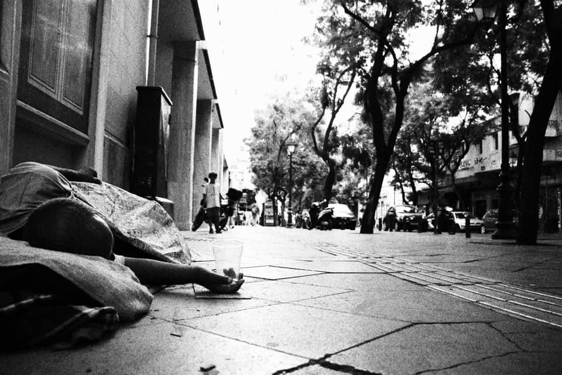

### AYS Daily Digest 24/09/2018: The so\-called ‘Salvini Decree’ under debate, as sources say it could be unconstitutional

_Deportations from Morocco / 20,881 people have arrived in Italy so far in 2018 / Protest against prison\-like detention in Denmark / Humanitarian corridor to Belgium / Press conference hosted by MSF and SOS Mediterranee: it is rather criminal to bring people to the LCC than the opposite / Weather is changing in France, Greece, elsewhere — the autumn cold is coming, the needs list increases / And more news…_

](assets/9543946a2671/1*9suI0v69-ACAdtkk_PTrlQ.jpeg)

If Salvini gets it his way, detention will increase in Italy\. Photo: [Associazione Antigone](https://www.facebook.com/antigoneonlus/?hc_ref=ARRMchqtYNLD3JZysMWT1pzSzs-z4CeoJfB1ld3i4o1OR8BiOx-iwj3STZrn8GqWpJg&fref=nf)
### FEATURE

[Associazione Antigone](https://www.facebook.com/antigoneonlus/?hc_ref=ARRMchqtYNLD3JZysMWT1pzSzs-z4CeoJfB1ld3i4o1OR8BiOx-iwj3STZrn8GqWpJg&fref=nf) strongly condemned the so\-called Salvini Decree which, if approved by the parliament, will lower the number of people granted asylum, allow prolonged detention up to 180 days, and introduce measures that will tighten migration with security\. Salvini has 60 days to get the decree approved by the parliament\. A source in President Sergio Mattarella’s office told the local media that parts of the decree “might be unconstitutional,” which could open the way for Mattarella to block it\.

[Associazione Antigone](https://www.facebook.com/antigoneonlus/?hc_ref=ARRMchqtYNLD3JZysMWT1pzSzs-z4CeoJfB1ld3i4o1OR8BiOx-iwj3STZrn8GqWpJg&fref=nf) calls the decree “a further blow to the rule of law in the name of an emergency, which is not there\.” This new legislation is promoted by Interior Minister Matteo Salvini, who leads the far\-right League party\. His view is that is the way “towards making Italy safer\.”

Italian media are [reporting](http://www.ansa.it/english/news/2018/09/24/cabinet-approves-migrants-security-decree_c2ecb987-a4ce-4a3b-8897-4215c6ae0b9c.html) that Salvini explains that his decree will allow stopping asylum applications “in the case in which there is social dangerousness or a conviction at a first\-instance trial\.” The decree also seems to predict the possibility of the revocation of citizenship for people convicted of terrorism felonies\. Furthermore, the decree suggests bigger asylum centers, and that only minors and recognized refugees will be distributed across the country\.

[DW reports](https://www.dw.com/en/outcry-as-italys-salvini-submits-draft-anti-migrant-decree/a-45619434) that Salvini at a press conference on Monday said that this policy would save billions of euros\. At the same time, severe criticism is heard from bishops and also from the populist, but less right\-wing, Five Star Movement\. [Refugees Welcome Italy](https://refugees-welcome.it/decreto-immigrazione-misure-preoccupanti-segnano-un-passo-indietro/) ’s Fabiana Musicco said that on the contrary from what Salvini says, it could hinder integration and increase frustration and violence\. It could also drive refugees underground\.

Considering that Salvini is considered as a “nice guy,” and quickly has gained huge power due to his popularity, the decree is appalling\. But given the fact that it might be unconstitutional, already has raised concerns, and that humanitarians are uniting against this — it might not become reality\.

In response to the “Salvini decree” latest suggestions, [Melting Pot Europa](https://www.facebook.com/meltingpoteuropa/?hc_ref=ARSUTpfx206Nv20OVFEw08UTV8LtcTXh2AgFf4xr5NtyTQl0GKOHWDJ12nFGE-Wvj-w&fref=nf&__xts__%5B0%5D=68.ARBRPDImXqHxQ7ccQICQ6HhsTYO_4jpvINzSCgSXC2JQLDlBpJ5Lhcwwv9mrbkF88emleLAZOmu8tO8PPeokoGZs3GrillLvQ3J-mB3oFOj3MDVL0zlvCSiuHg3yRLHrpTk8ILWldizO09WrFf1Nkap5KbBdqddVtAUWX35orGTdUS82xdDZLQ&__tn__=kC-R) wrote an article about the decree and what it could mean for Italy and migrants in the country\. Their approach is similar to [Associazione Antigone](https://www.facebook.com/antigoneonlus/?hc_ref=ARRMchqtYNLD3JZysMWT1pzSzs-z4CeoJfB1ld3i4o1OR8BiOx-iwj3STZrn8GqWpJg&fref=nf) and [Refugees Welcome Italy\.](https://refugees-welcome.it/decreto-immigrazione-misure-preoccupanti-segnano-un-passo-indietro/) [Melting Pot Europa](https://www.facebook.com/meltingpoteuropa/?hc_ref=ARSUTpfx206Nv20OVFEw08UTV8LtcTXh2AgFf4xr5NtyTQl0GKOHWDJ12nFGE-Wvj-w&fref=nf&__xts__%5B0%5D=68.ARBRPDImXqHxQ7ccQICQ6HhsTYO_4jpvINzSCgSXC2JQLDlBpJ5Lhcwwv9mrbkF88emleLAZOmu8tO8PPeokoGZs3GrillLvQ3J-mB3oFOj3MDVL0zlvCSiuHg3yRLHrpTk8ILWldizO09WrFf1Nkap5KbBdqddVtAUWX35orGTdUS82xdDZLQ&__tn__=kC-R) points out the populistic tone, which permeates not only the decree, but also the government’s overall policies:

> “We can not allow ourselves to continue to indicate in the migrant the guilty figure of the ruin of this country\. We can not allow persevering in policies of criminalization, rejection, and exclusion \(…\)” 

### SEA

After the Aquarius lost its Panama flag, MSF and SOS Mediteranee held a press conference\. They defend their mission, saying that the only criminal thing to do would be \(as suggested and done by the EU\) to hand over migrants to the Libyan Coast Guard\.

■■■■■■■■■■■■■■ 
> **[MSF Sea](https://twitter.com/MSF_Sea) @ Twitter Says:** 

> > “Critics says we are pirates and outlaws, yet we respect all the requirements of international maritime law and of our flag state. We would be in violation of the law if we handed over rescued people to Libyan coastguard.” @[SOSMedIntl](https://twitter.com/SOSMedIntl) &amp; @[MSF](https://twitter.com/MSF) LIVE Press Conference https://t.co/H8wTLkk4zP 

> **Tweeted at [2018-09-24 14:03:40](https://twitter.com/msf_sea/status/1044225860189007872).** 

■■■■■■■■■■■■■■ 

Yet, the Aquarius remains at sea\. After rescuing approximately 50 people in the morning, the crew headed towards Marseilles, France\. They do not know if they will be allowed to disembark the people rescued, but as Italy’s ports are closed, France’s port becomes the closest one\. [At the press](https://twitter.com/SOSMedIntl/status/1044234967021236226)  conference, [**SOS MEDITERRANEE‏**](https://twitter.com/SOSMedIntl) begged France to open their ports, as it is the only option\. This is how the wreck looked like, according to reports on Twitter:

■■■■■■■■■■■■■■ 
> **[Sergio Scandura](https://twitter.com/scandura) @ Twitter Says:** 

> > #migranti UPDATE (11:21) 🔴 IL RELITTO questa mattina si presenta così agli occhi della #Aquarius, arrivata dopo dieci ore di navigazione nella parte est di Tripoli, altezza Garabulli/ Khoms. https://t.co/VQ9VQY7943 

> **Tweeted at [2018-09-24 09:22:52](https://twitter.com/scandura/status/1044155194819432449).** 

■■■■■■■■■■■■■■ 

Demographics among the rescued, according to SOS Mediteranee, are as follows:

](assets/9543946a2671/1*ozVulDCvwJDNNlSo7E93TQ.jpeg)

Photo: [SOS Mediteranee](https://onboard-aquarius.org/uploads/2018/09/0923_Rescue-recap.jpg)

In the Alboran Sea, [**SALVAMENTO MARÍTIMO** ‏](https://twitter.com/salvamentogob) rescued three boats carrying 150 people\. More information in Spanish follows below\.

■■■■■■■■■■■■■■ 
> **[SALVAMENTO MARÍTIMO](https://twitter.com/salvamentogob) @ Twitter Says:** 

> > Pateras hoy 20h: Mar de Alborán, Guardamar Polimnia ha rescatado 3 pateras con 151 personas (54+61+36) y se dirige a Motril. Salvamar Spica 2 pateras con 77 personas (55+22) y se dirigirá a Almería. Han participado en búsqueda Sasemar 102, Salvamar Hamal, avión @[Frontex](https://twitter.com/Frontex) 

> **Tweeted at [2018-09-24 17:58:16](https://twitter.com/salvamentogob/status/1044284899547639809).** 

■■■■■■■■■■■■■■ 

### MOROCCO

As borders move south, deportations do the same\. [In a post today,](https://www.facebook.com/AmdhNador/posts/2190865074459089?hc_location=ufi) [Association Marocaine des Droits Humains — Section Nador](https://www.facebook.com/AmdhNador/?hc_ref=ARRaGbwssamA9Lsr8RmsGVWlHsdqtyF4-p9394CH4Bvb7ZAN2q86D9sZBnaaQklG12M&fref=nf&__xts__%5B0%5D=68.ARByPiytudPJemJWtbwAnBujctIsiG7JtV25hG3ni7xeXP1epRoIxg8SXe1fOQY0-6HMlyrh5rShATLMZR-J70MFgL2BhxdmOguEogTJ_IHIgobp46LL6UQA7MpgQtIyscN3uny7oLBebyE9sEHRRdFbiejkWl91m7xswz06XBMLM57KPaVFoA&__tn__=kC-R) wrote that six Guinean nationals were held at the Casablanca airport, awaiting their deportation\. Senegalese, Malians, and people hailing from several other countries have already been deported following the arrest at the Tangier police station\.
### ITALY

So far this year, 20,881 people arrived in Italy\. Only in September, 880 new arrivals have been registered, according to the [UNHCR](https://data2.unhcr.org/en/documents/details/65976) \.

Volunteers and locals are still showing that Italy is not only Salvini\. In Florence, Social centar Gaetano Barberi is organizing Italian language courses for migrants\.

45 Tunisian refugees find themselves trapped in a limbo of bureaucracy\. [According to the Italian paper Ansa](http://www.ansa.it/.../migranti-tunisia-non-autorizza...) , Tunisia have not confirmed the repatriation of these individuals\. They therefore remain in Italy, but without the possibility to gain legal status\. After hours at the Milo to the Falcone Borsellino airport, it was still not possible to deport them to Tunis\. 40 of the people were reported back to the Trapani center, and the rest were told that they have to leave the country within 7 days\.
### GREECE

The weather is changing all over Europe\. In Greece, national meteorological service EMY has issued two warnings on Monday\.

Not only is temperature expected to decrease as much as 12 degrees\. People are also advised to expect gusty winds of up to 10 Beaufort\.
#### Islands

On Lesvos, the evacuation following inhumane living conditions reportedly continues\. As we wrote in the weekend digest, there is a schedule for the upcoming week, with hundreds of people being transported to the mainland every day\.

■■■■■■■■■■■■■■ 
> **[Community Peacemaker Teams](https://twitter.com/cpt_intl) @ Twitter Says:** 

> > MT @G_christides #Refugees are being evacuated from #Moria. Some 400 will leave today the overcrowded camp in Lesvos. I see many shedding tears of happiness for getting out, but also sadness for the friends they leave behind 
#RefugeesGR https://t.co/UylkD7L20W 

> **Tweeted at [2018-09-24 22:06:25](https://twitter.com/cpt_intl/status/1044347350263697413).** 

■■■■■■■■■■■■■■ 

[Aegean Boat Report](https://www.facebook.com/AegeanBoatReport/?hc_ref=ARRMeSnhxhRAP8X4vx_XXs4MpytpMHl5AYIXeCVJ1zxi2f1JokJTaCp8omYMNtL22O4&fref=nf) continues recording new arrivals to islands\.

On Monday, 47 people arrived to Samos, 42 to Lesvos, 15 people to Strongyli Island, after which people have been picked up and transported to Kastelorizo\.One boat landed on Chios with seven people\.

Additionally, 21 people arrived on an isolated piece of coast north of Palios, including ten children and one pregnant women\.

 \.](assets/9543946a2671/1*Xg7JszuB1nuJUBpadUl8GA.jpeg)

Weekly statistics from [Aegean Boat Report](https://www.facebook.com/AegeanBoatReport/?hc_ref=ARQyU-ag_t7gQf8xr7GrYaYs_kVdRLOtDb44hzPfa69Ber2j-wPtrp5ZeHv0_Rj04A0&fref=nf&__xts__%5B0%5D=68.ARARBYBPQ6aiNsNedtF9smYtfnVswe-GaD8ouG__nGqqhpLAEfY62uSfI7mvhPFiqEdAs8pGbs6dZ_-SdlFTDPlCpbj26Bg5M1x0D1GvRLq7LDZ1Ac_fT3adScWSPq_lERtHF2XBRZ6WzvZMWcEg_5AIW9v9y8Z2y8ijVBpGgiVF_glh1tqZ&__tn__=kC-R) \.

Morning in Moria by [Omar Alshakal](https://www.facebook.com/omar.alshakal?hc_ref=ARQhuLw_hQvWefiSgSoDyd8qWyaVZhrNzi78JTt3ziUr2UMbrvFSg5TyGuXmsS9vTXw&fref=nf) :

#### Athens

Volunteers and grass root groups need help to assist all people in need\. Iranian activist in Athens, [Arash Hampay](https://www.facebook.com/arashampay?fref=gs&hc_ref=ARTM-y8cKQO4Ub52ifgRVcYsLSTQlvKd0DQglODHDYVj0m4W-vLcW3ZPzbsEI5VHYFI&dti=446386565554391&hc_location=group) , and groups of his friends from Our House are still helping those on the streets\. They need help to buy sleeping bags\.

By Our House

[Holes in the Borders](https://www.facebook.com/RefugiadosenAtenas/?hc_ref=ARQpa_dj8027WHRWlJkDTLZdZc4DkpbxwVnvuNxXOp6x041m7AAD_PEf1SWZ3BNpxMw&fref=nf) needs an English teacher for the alternative housing in Athens, a project funded by [Asociación Amigos de Ritsona](https://www.facebook.com/amigosderitsona/?fref=tag) , [I Am Immigrant](https://www.facebook.com/IAmImmigrantworld/?fref=tag) , [Ayuda Refugiados 19 Octubre](https://www.facebook.com/ayudarefugiados19octubre/?fref=tag) , and our members\.

The volunteer must commit for a minimum of two months, for at least three hours a day from Monday to Friday\.

For more information about volunteering, we leave you all the details in English on the following [link](https://v4r.info/task.list.php?ID=951) \.

### FRANCE

A Médecins du Monde Hauts\-de\-France alert says that 1,300 people now survive in the sub\-woods in Grande Synthe\. Last week, it was 700 people\.

Those living rough on the streets have no access to water, toilets, and no shelter — only the mud\. Emergency actions, as the health\-care related one suggested below, is necessary\. Considering it is only September, the needs will only increase\.

_“Doctors of the world alert this evening the regional health agency that can hardly close their eyes longer on the situation of the exiles on the coast, and calls on the [\#centrehospitalierdedunkerque](https://www.facebook.com/hashtag/centrehospitalierdedunkerque?source=feed_text) to urgently open additional consultations to the constant access to health care of the Hospital\. A mobile device for access to care is necessary, or in the absence of shuttles to facilitate transport to the hospital of patients who have/need it\.”_
#### Paris

Locker room for migrants, Paris, also needs help\. They need volunteers on Wednesdays from 15pm to 18 pm to receive donations and to sort clothes\. They also need help Saturdays and Sundays from 9am to 14pm to dress people and also receive donations\.

To get in touch and volunteer, get on the list by SMS at 06 03 02 83 72\.

They also need help with hygiene products, diapers for children and milk, as well as women’s underwear and men’s clothes\.

[Solidarité migrants Wilson](https://www.facebook.com/Solidarit%C3%A9-migrants-Wilson-598228360377940/?hc_ref=ARSmT_vQUAPVWkwVx3evYNT2sVh1FTfvOAgbMuC5ZpWlx383tv1CDJmceWFMusXN1K0&fref=nf) also noted the fall is coming\. There will be a collection soon, and they need gloves, hats, socks, and other items\. Read more [here\.](https://www.facebook.com/598228360377940/posts/994938774040228/)
### BELGIUM

As a part of the humanitarian corridor, a group of 101 Syrians arrived from Turkey, traveling on a humanitarian visa\. In coming days they will file for asylum\. They will not pass through the regular asylum reception system, but will be hosted in Belgian families\. The plan is to accept 49 more people\. We will try and find more information on this as soon as possible\.
### UK

On Monday, October 1st, the Stansted 15 will be brought to court on trial for their protest against the immigration system, which successfully delayed the departure of a deportation charter flight\.
#### DENMARK

[Close Kærshovedgård Deportation Camp](https://www.facebook.com/CLOSEKGH/?hc_ref=ARS6p1LeD2NqokkZRPiIJjaxbhcwq5vhkNbKVLlZJvPKTHBdxIjphzDG4pGA9bbDxVg&fref=nf&hc_location=group) has held a protest, drawing attention to the people held imprisoned in Ellebæk\. They demand their immediate release, and closing down of the prison\.

The group also say that the Danish state “aims to make life intolerable for the refugees, who cannot be forced out of the country against their will\. The state calls it “motivational measures,” but it is just a nicer word for psychological terror\.” [According to the Global Detention Project](https://www.globaldetentionproject.org/countries/europe/denmark) , Denmark has the past three years implemented some 70 amendments aiming at further restricting their migration policy\. At the same time, as more people are rejected due to a lower recognition rate on asylum claims, more people are being detained following their negative answers\. [There are several sources](http://refugees.dk/en/facts/the-asylum-procedure-in-denmark/asylum-centers/) saying that Denmark is running prisons for refugees\. Today’s protestors are not alone in claiming this about this specific facility\.

More detailed information about the Danish detention policy can [be found here\.](https://www.globaldetentionproject.org/countries/europe/denmark)

](assets/9543946a2671/1*-VwYF8FSm2Mq1bimx_Aj6g.jpeg)

Message from the protestors \(translated from Danish\): “We demand all imprisoned refugees release\! We demand the closure of the Ellebæk Prison\! We are protesting against the government’s brutal tactics\!” Photo: [Close Kærshovedgård Deportation Camp](https://www.facebook.com/CLOSEKGH/?hc_ref=ARS3xKKo6M5CXxuUPTbwmCKFRitAHRkW1kbN055OfPL2SkjsTdfN2pOQLA6TQoTqPtE&fref=nf&__xts__%5B0%5D=68.ARDaFNDESqLP5osrvPZ90ZEchXfdEXPiCslg8F3-6lNxtlw0dJPcqDg5emon-IffsJ859Sc2MT7q9KMdCC2DuDpPikv8d_XwbXOFetPdMPTkGe8S5Z_jM1zPC_zRJH2eAWV81R1MWeFGIUU5iiYZIn_5zQC1cY-msYtuEQ2gzyqmOMc8d540IQ&__tn__=kC-R)

**We strive to echo correct news from the ground through collaboration and fairness\.**

**Every effort has been made to credit organizations and individuals with regard to the supply of information, video, and photo material \(in cases where the source wanted to be accredited\) \. Please notify us regarding corrections\.**

**If there’s anything you want to share or comment, contact us through Facebook or write to: areyousyrious@gmail\.com**

_Converted [Medium Post](https://medium.com/are-you-syrious/ays-daily-digest-24-9-2018-the-so-called-salvini-decree-under-debate-as-sources-say-it-could-be-9543946a2671) by [ZMediumToMarkdown](https://github.com/ZhgChgLi/ZMediumToMarkdown)._
