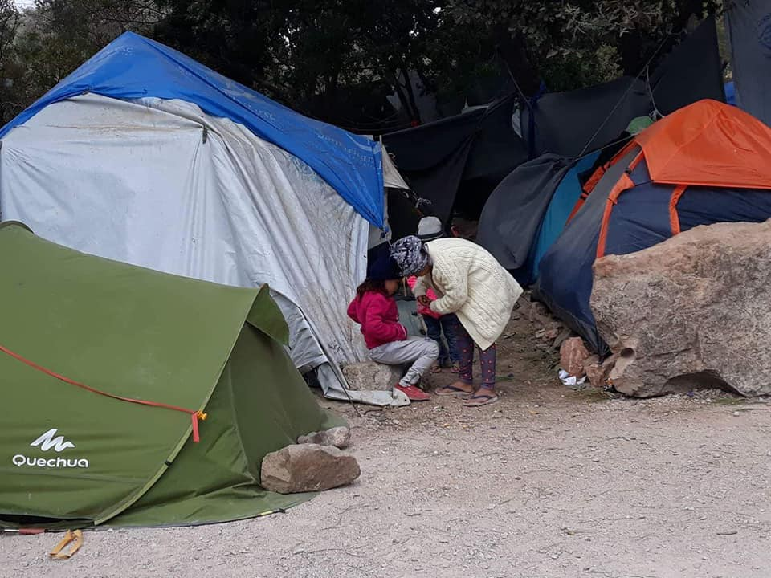
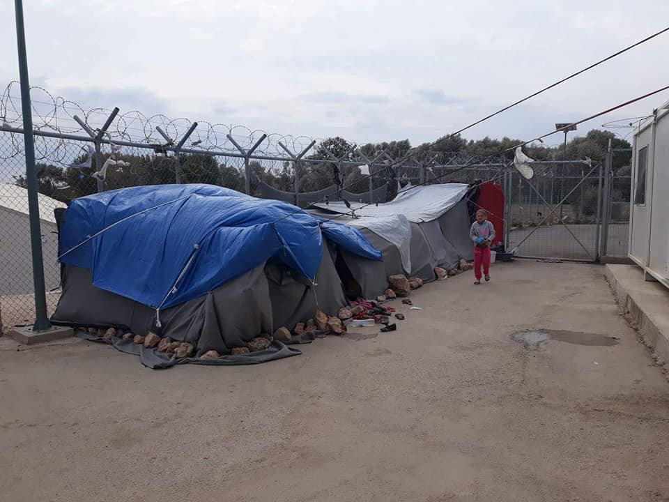
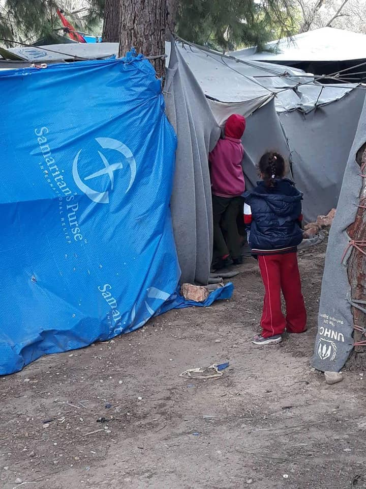
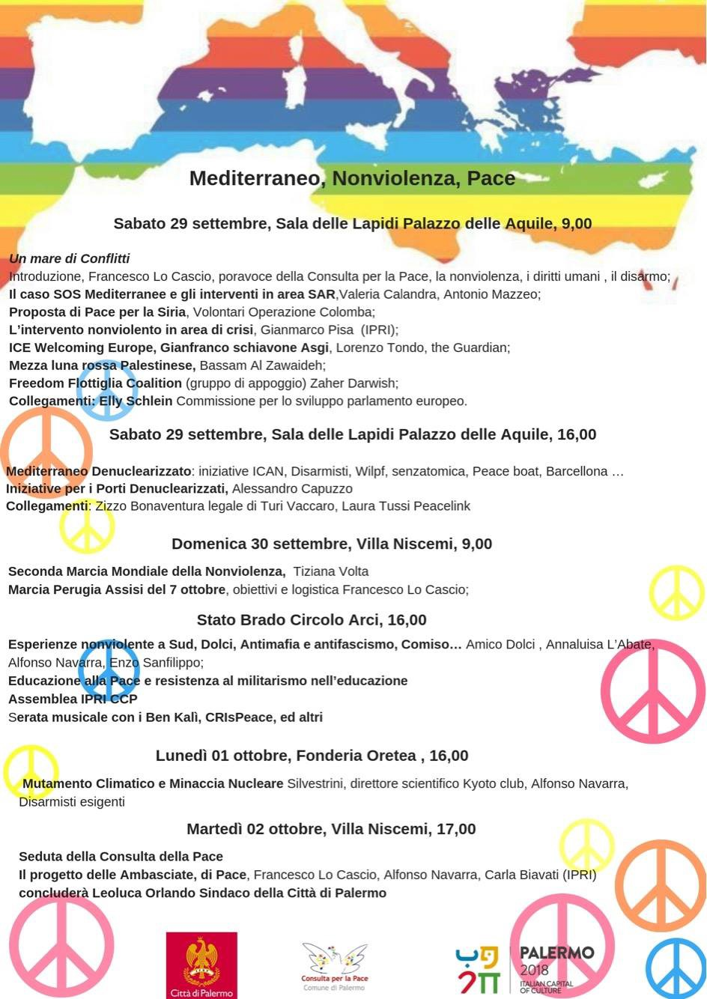
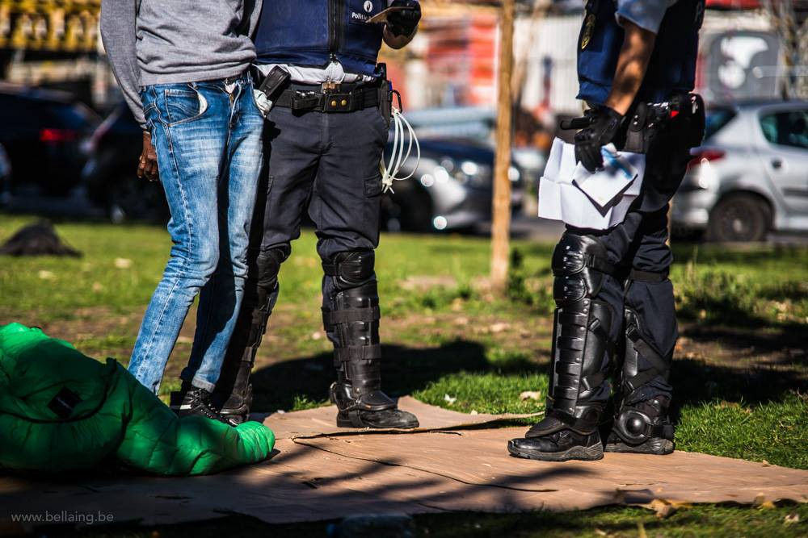
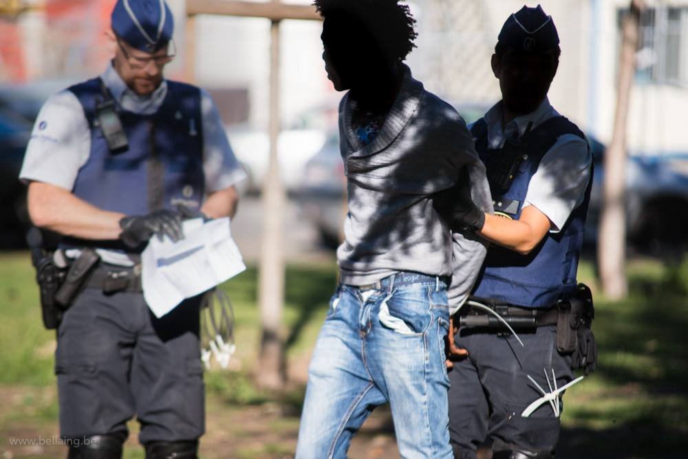

### AYS DAILY DIGEST 28/9/2018: Syrians are the biggest groups among new arrivals in Europe

_Despite the fact that most of the people who are arriving now in the EU are coming from a war\-torn country, nothing is being done to improve conditions for people on the move // Help Bosnians to help people on the move // Help is needed in Greece, too_

](assets/303946541780/1*-M29tMQHfJk2c6WZFVDXag.jpeg)

By [1976km](https://www.facebook.com/1976km/?__tn__=%2CdkCH-R-R&eid=ARCMXW9knreEmtiEzz_MqF_EJ_RoKoSj-u3pn6TTDa65ZReRarM5HsmmcfYhQkkuMz3Oa-LOoExXqDgW&hc_ref=ARQ_OrnswgyuZ59QNnTzg43RUI7QEe6FzX0dtAgf5WsuF8BwihSQCC2FN0481fTqwRc&fref=nf)

> They say “Bad things happen when good people do nothing\.” Well, the media have been reporting heavily on Moria refugee camp lately\. There have been many articles about the living conditions, the possibility of misuse of EU funds by the authorities and even a big BBC piece from inside the camp\. Still nothing has changed\. Not even a small improvement except for a vague plan to transfer 2,000 people to the mainland\. So here we go again\. Here are a few facts about Moria, to inform and remind everyone about a place by many simply called “hell on earth\.” The camp was built for 2,000 people\. According to different organizations, there are currently between 8,000 and 10,000 people inside the camp and the olive grove next to it\. As many as 17 people sleep in one tent\. According to the Doctors without Borders, there are 72 people per one functioning toilet and 84 people per one functioning shower\. In order to get food, refugees line up for 3, 4 hours\. There is no formal education for kids\. At this moment refugees have to wait for their asylum decision for as long as two years\. The latest report by International Rescue Committee stated that 30% of the residents have tried to commit suicide and about 60% have considered it\. 
 

>  “Bad things happen when good people do nothing\!” 1976km 

#### Feature

**Since the beginning of this year, over 84,000 people have arrived in Europe via very dangerous Mediterranean routes** , according to the [UNHCR data](https://data2.unhcr.org/en/documents/details/66044) \. The primary nationalities amongst the arrivals in 2018 so far are Syrians, Iraqis and Guineans\.

All of them have gone through hell to reach countries of the European Union, hoping that they will be safe and that their basic human rights will be respected\. Unfortunately, this is far from true\. They are left on the streets, in degrading conditions, in closed camps or places where basic life conditions are not met\. Help offered to them by volunteers and locals is often criminalized and prevented by the police\.

More people are arriving in Cyprus\. This year, the number of people who arrived there was 166, all of them from Syria, including one boat that came directly\. It took them three weeks\.

Greece has received nearly 30,300 people who came via sea\. The numbers could be much higher if the Turkish Coast Guards did not intercept boats\. This year, they did that in over 1,520 cases\. The people arrive on overcrowded islands, where there are extremely poor living conditions\. The people AYS met in the Balkans who had spent a prolonged period of time on Samos, Levos, Chios or other islands are deeply traumatized and have in many cases suffered different types of violence\.

The number of people arriving via the land border is also significant — over 10,800 registrations\. Most of them were from Syria, followed by Iraq, Afghanistan, Congo and Palestine\.

Italy has registered over 20,000 new arrivals so far, including 3,090 unaccompanied and separated children, most of them departing from Libya, even though a significant number have come from Tunisia\.

In Spain, 33,900 people have arrived this year, by both land and sea\. With more arrivals, the government in this country is struggling to accommodate all the people and provide them with basics\. Alarming reports from Spain speak about unaccompanied children, some as young as 10, who have been forced to sleep at [police stations](https://theprovince.com/news/world/refugee-children-sleeping-in-spanish-police-stations-spark-calls-for-urgent-intervention-by-officials/wcm/16e719de-cdd1-46c7-9938-33ad4e190443) as arrivals overwhelm reception centres across different Spanish cities\. The Spanish Government has now announced that they will give [40 million euros](https://elpais.com/politica/2018/09/05/actualidad/1536137462_706238.html) to the Spanish regions on the condition that they host these minors, giving them 15 days to report on their availability\. The Government of the region of Madrid will double the places for migrant minors by creating [120 more](http://tnh.gob.hn/el-gobierno-duplicara-las-plazas-para-atender-a-menores-y-planea-crear-un-gran-centro-de-acogida/) , with the first 20 places being opened next week\.

Most of the people arriving to this country are Guineans, Malians, Moroccans, Ivoirians and Gambians\.

As we have reported many times this year, a new route is taking people to the EU through Bosnia and Herzegovina\. Many of those who arrived in Greece continued their journey immediately over the Balkans, Bosnia and further on, if not pushed back by the Croatian or Slovenian, or even the Italian, police\. Officially, some 1 [2,400 people arrived](https://data2.unhcr.org/en/documents/download/66028) in Bosnia this year\. By far the biggest group are people from Pakistan, followed by Syrians, Iranians and Afghans\.

People are arriving from the direction of Serbia and Montenegro\. In Bosnia, they find almost non\-existent help from the government, and very limited help by the international NGOs present in the country\. Locals are still trying to assist all those who are coming, but with another winter approaching, it is becoming more and more difficult\.

Bosnia is one of the poorest countries in Europe, with huge migration of the local populations\. Only this year, according to the existing figures, over 30,000 people have left the country\. Many have left with their entire families, leaving their homes abandoned\. If you can, help the local charity pomozi\.ba which is assisting locals, but also refugees who are arriving\.

The situation is most difficult in the Bihac area, where about 4,000 people are living, mostly on the streets, and in Sarajevo where limited assistance is provided\. Near Sarajevo, there is only one reception centre with a maximum capacity of about 160 people\. But the centre is remote, with no internet or phone connection, and many people choose not to go there but rather to stay in the city, living in abandoned buildings\.

They have no access to the health system or any other assistance, except for what is provided by the international volunteers and locals, who are still showing their solidarity\.

In Sarajevo, over 15,000 local people are dependent on public soup kitchens\. With over 1,000 people on the move in the city, the situation is becoming extremely difficult\. If you support local initiatives, you will be helping both categories\.

Another problem is that the government is preventing people from accessing asylum\.

After Bosnia, most of the people continue toward Croatia, where the police continues with violent pushbacks\. Recently, one Italian TV crew managed to follow groups of people walking through the forests in Bosnia toward the border\.

Along land routes, at least 78 refugees or migrants are known to have died so far this year, more than in the whole of 2017 \(75\), at or near European borders\.
#### Morocco

[Association Marocaine des Droits Humains — Section Nador](https://www.facebook.com/AmdhNador/?__tn__=%2CdkCH-R-R&eid=ARCcr-esCl1A7EayJ3BCBe9gWwSorDBjSBYdsjB5V6K7wKd-KSwuzGSyj3loVWnocIWqtlMo9aBVORze&hc_ref=ARTSxJOSt2UP2OmQOQEXmfNb3bBL9GDbhwm_Fem2ToGP6dozwJfC8MJaMz91zS41xEQ&fref=nf&hc_location=group) reports about **continued arrests and police violence** \. According to their reports, on Thursday a 21\-year\-old Palestinian girl was prevented by the police from accessing the asylum office in Melilla\. She was arrested on Friday afternoon, without informing her mother who had remained without information from her daughter all night\.
#### Sea

The Aquarius is still circling outside Maltese waters, as the ship has not received permission to dock, and as the weather does not permit them to move\.

Po [rtugal](https://www.theguardian.com/world/portugal) has offered to take in 10 people from the Aquarius rescue ship as a “response of solidarity to the flow of migrants seeking to reach [Europe](https://www.theguardian.com/world/europe-news) across the Mediterranean”\. France agreed to take 18 people, and Spain and Germany 15 each\. Malta, the EU country closest to the ship, will transfer people from the boat and send them to the four other states\.

The Aquarius is the last private rescue ship operating in the area used for crossings from Libya to [Europe](https://www.theguardian.com/world/europe-news) \. Last month, it spent 19 days docked in Marseille after Gibraltar revoked its flag, but set sail again last week after acquiring Panamanian recognition\.

The ship has been operating in the Central Mediterranean for 31 months, saving 29,523 lives in more than 230 rescue operations\.

This week, [Panamanian authorities revoked the vessel’s registration](https://www.theguardian.com/world/2018/sep/24/italy-blamed-after-aquarius-migrant-rescue-ships-flag-revoked) in a move described by [Médecins Sans Frontières](https://www.theguardian.com/world/medecins-sans-frontieres) and SOS Méditerranée, [as “a major blow” to its humanitarian mission\.](https://sosmediterranee.com/press/italian-government-pressures-panama-to-stop-aquarius-rescues-on-worlds-deadliest-maritime-route/)

Without a maritime flag and registration, the Aquarius cannot sail and save lives in the Mediterranean\. This would condemn thousands to a watery grave\.
#### Greece

Last week, the Greek government started letting people leave from the islands and go to the camps on mainland, but the situation in the hot spots has not improved much\. And winter is coming\.

Chios, camp Vial\.

[Refugee Biriyani & Bananas](https://www.facebook.com/RefugeeBiriyaniAndBananas/?__tn__=%2CdkCH-R-R&eid=ARDD1gNLk1yXWSEHZxtVAgVW-6lIWAJ4hFnLNCXOk6VUcsmFAP5kGNLOlsdSO86rYFbz6njMWQL_cfoK&hc_ref=ARTI6wcNTD_WcpHaxH6cPHCcVoR6haKip6R7w-Ci4MgvIOyZNw0IzQRumPDKFxmD8bA&fref=nf) team continues operating on the island, but they need help for their mission\.

“If you can donate ONLY £10 we can buy a pair of winter shoes and a coat for a refugee in need in Vial Camp, Chios\. These will be sent in a container and distributed by us so you can follow the delivery online also\.”

Donate on paypal Ruhiloren@gmail\.com, PM for bank transfer or [donate on](https://mydonate.bt.com/fundraisers/humanitariancrisisgreece) \.

RefuComm posted an [update to Procedures on the Islands](https://www.facebook.com/refucomm/posts/712863675732104?__xts__%5B0%5D=68.ARCqCv5gGl0g9Uby5MLNCJEhvyQhusUFLrGJBWuo25wQRZTa8RaWQBbxFbwRKbswT-B4Fi6mdrYStw7lGxtvGilFdsBKSS2wAA3kmWdSfnrKYUTbtEJoS-LK-4u6ax0bh8mnFtTeYi4IxbCATjIPv-yA6wJ741jZmnD6_K_RiW4JXp5zqnG0&__tn__=-R) :

“Hundreds of asylum seekers have recently been moved from Lesvos to the mainland and more transfers are planned\. A few days ago we asked the authorities to clarify whether people would need to go back to the islands to continue with their asylum applications and, if so, how would they be transported there and who would organise and pay\.”

FREELANCE CAMPUS — a free training programme to teach the basics of freelancing as a career\.

At Freelance Campus people Learn how to get a job online as a freelancer\. They will show you places where you can find work like [upwork\.com](https://l.facebook.com/l.php?u=https%3A%2F%2Fupwork.com%2F&h=AT1iv79zel7vG7RW6NW4cHYDBFqBQN1ZLngg2ZO5uKHMCFGeNnaQSvUC1b_omcf6DJQFBXMQjqxFCSvrQaBxQJ_WqRuS9lE3plrWXEe9vpKwsgMpGhfHwi5jegdX6BZZf9_AbnSopOT6yGxoeqkFiOzKHw) or [freelancer\.com](https://l.facebook.com/l.php?u=http%3A%2F%2Ffreelancer.com%2F&h=AT3Ng8vDPDj6IMmzlLYWjKUwcR414aLh3dmKw2c9vGuEkMa4Xe8eg8M2LcOfjNvyCtLgTTG73pW-ObMA85Yo9GlWMdMHGyN8z5KYBTXqk-puqG_92zEzlpW6nbxp2ErNuJlvZoYS1FrLhE17nsHfEnE7wg) or [peopleperhour\.com](https://l.facebook.com/l.php?u=http%3A%2F%2Fpeopleperhour.com%2F&h=AT0fyB1JvXOxeawt1nf9s33HTX5oVOxOcCVcQRS7ry-z1w_yzQ9oKBpSiX79snsrJAej0oOyGYojDyR254X904gcQnFU5v0KkEWYWsp8634ItMW7PfYp1yWkhOONHZAd5-lYvLJkAIzoI7rWhFMBWqCovw) and more such online platforms\.

If you want to learn more, please [visit](http://www.campusbus.org) or write to them through their [facebook page](https://www.facebook.com/campusbus) \.

[Non\-Formal Education](https://www.facebook.com/groups/204202716585823/permalink/750320545307368/) program starts again\.
#### Italy

The [UN special rapporteur](https://www.ohchr.org/EN/NewsEvents/Pages/DisplayNews.aspx?NewsID=23656&LangID=E) on contemporary forms of slavery, Urmila Bhoola, will visit Italy from 3 to 12 October\.

During her country visit, she will focus on labour exploitation of migrants in agriculture and on the strategies, policies and laws which the Government of Italy is implementing to prevent and address exploitation in that sector\.

SAVE THE DATE

[SOS MEDITERRANEE Italia](https://www.facebook.com/sosmeditalia/?__tn__=%2CdkCH-R-R&eid=ARBkG8QS8vuzX58xAH5CLHMqAvAf4O2-ysIvtR5U6GAxhZzUTQZIWfMXGIo0SaqY8s5wbHBAcuxDBAcn&hc_ref=ARSiz4Rfc1-dOg_YqGwp3zGoGF6OltCp40D175PMdJHJ6h2vPNnhuPg3dxEhoIuXStM&fref=nf&hc_location=group) is inviting all to join the protests on September 29, Saturday, in Palermo\.

#### Belgium

The police in Brussels continue to harass people in Maximilian park\. This week, at least two persons were arrested\. All of them were released soon after, but this causes tensions and obviously pressure on all the people who are forced to stay in the park \(over 600\), but also volunteers who are helping\.

**Refugees welcome at UGent**

Refugees are welcome at Ghent University to study, to obtain a doctorate \(PhD\) or to carry out research\.

[This page](https://www.ugent.be/en/ghentuniv/principles/diversity-and-gender/refugeeswelcomeatugent/refugeeswelcomeatugent.htm) contains information for refugees in English\. Please note, some information on linked pages is only available in Dutch\.
#### General

Winter is very much on its way and last winter was dreadful for those who fled conflict and persecution for refuge here in Europe\.

[Donate4Refugees](https://www.facebook.com/Donate4Refugees.org.uk/?__tn__=%2CdkCH-R-R&eid=ARA_FrURRTm_wgW1yfAJoBBUCqKtefFo8cJ0WIniBhF5qJzMb6Qgs0ORddlTf3eM4lvNn558ClLG1fBB&hc_ref=ARTIO_Di8qbZDmm91lUrQOrHRz2mpxrp99RXlm6wCQKRKbIkIrkES94rk6zk4TUVRL0) is asking for donations\.

““The days may be sunny and bright still but nights and early mornings are really cold all across Europe\. Winter is very much on its way and last winter was dreadful for those who fled conflict and persecution for refuge here in Europe\. Help us to keep them as warm as we can this winter\. Donate so we can provide refugees with blankets and sleeping bags before winter sets in\.”
#### Ireland

Due to the lack of places for asylum seekers in Ireland, people are being put in a dangerous situation, according to the IRC\. The Department of Justice has confirmed that at least 20 people were told they could not be provided with accommodation in the past two weeks\.

The occupancy rate of Direct Provision centres reached close to 100% in the summer of 2018, due to a steady reduction in accommodation places compared to previous years, compounded by lengthy asylum procedures involving an average wait of 19 months for an interview with the International Protection Office \(IPO\) \.

The [Irish Refugee Council calls for Government to urgently address the issue of people seeking asylum being made homeless](https://www.irishrefugeecouncil.ie/news/irish-refugee-council-calls-for-government-to-urgently-address-issue-of-people-seeking-asylum-being-made-homeless/6697) , 20 September 2018

**We strive to echo correct news from the ground through collaboration and fairness\.**

**Every effort has been made to credit organizations and individuals with regard to the supply of information, video, and photo material \(in cases where the source wanted to be accredited\) \. Please notify us regarding corrections\.**

**If there’s anything you want to share or comment, contact us through Facebook or write to: areyousyrious@gmail\.com**

_Converted [Medium Post](https://medium.com/are-you-syrious/ays-daily-digest-28-9-2018-syrians-are-the-biggest-groups-among-new-arrivals-in-europe-303946541780) by [ZMediumToMarkdown](https://github.com/ZhgChgLi/ZMediumToMarkdown)._
