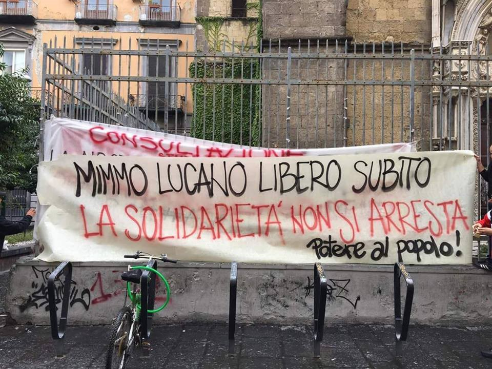

### AYS NEWSLETTER 02/10/2018: Hands off Mimmo Lucano\! AYS expresses solidarity with the mayor of Riace

_Attacks on solidarity happening again in Italy//More deaths in the Mediterranean//Statistics on arrivals to Greek islands//Testimonies of horrible living conditions in Moria//Commemoration day for the 368 people who lost their lives off Lampedusa 5 years ago//More evictions in Rome//New accord on immigration law in Germany//More news from Morocco, France…_

Credit: Riace patrimonio dell’umanità
#### FEATURE

Riace \(Calabria, Italy\) has been considered a fully functional model of reception and integration for the past 14 years, long before migration started to be considered a threat to the E\.U\. Domenico \(Mimmo\) Lucano has been the mayor of this small town since 2004 and has had to find a solution for 2 pressing issues occurring in his area: the increasing number of arrivals on Italian shores and the worrying depopulation of his town in the past years\. In the arrival of migrants, he saw an opportunity to revive his municipality\.

_“Today, some 2,800 people from 20 different countries live in Riace and the village is recognized worldwide as a model for the integration of migrants and asylum seekers\. Lucano’s policies have also proven effective in terms of urban renewal and socio\-economic development”\._

The “ **utopia of normality,** ” as he calls it, started from a very normal and simple concept: integrating those who arrived, using abandoned buildings and providing job opportunities and language classes \(with the support of regional government funding\) \.

“ _This approach has proven to be beneficial for both the hosting community and the newcomers\. It has also come at a significantly lower economic cost to Italian taxpayers than housing migrants in collective shelters\. \[…\] Furthermore, the “Riace way” means that migrants are integrated into a social fabric that needs them, and in which they can realize their potential and positively contribute to their new community”_ \.

The approach and method has been fully supported by the local community and quite a lot of people decide to stay even after their asylum process is concluded\.

Read more on the model and personal testimonies [here](https://www.osce.org/magazine/334986) \.

However, this morning [Mimmo Lucano was arrested by the authorities](https://www.internazionale.it/bloc-notes/annalisa-camilli/2018/10/02/domenico-lucano-arresto) \(Guardia di Finanza, Italian finance police\) with the accusation of aiding illegal immigration \( \! \) and for having entrusted the waste collection to two local cooperatives with no tender procedure\. The investigations started over one year ago by the Procura of Locri, accusing Lucano of fraud, official misconduct, and abuse of power\. A clear attack against a model of humanity is being carried out by a fascist government whose real intention is to eliminate all those who show solidarity to migrants and people in need\.

Lucano has also been accused of organising a marriage between an Italian citizen and a Nigerian woman who had been denied asylum for 3 times, but of course, no more detail is available on whether the marriage actually took place\. This is why the Gip \(giudice per le indagini preliminari\), Domenico di Croce, has already [rejected some of the accusations](https://www.articolo21.org/2018/10/riace-ecco-perche-linchiesta-e-destinata-a-sgretolarsi/) against the mayor, as they were not supported by clear evidence and reliable testimony, making the whole accusation system weak at the very basis\.

Demonstrations all across the country took place during the day to show solidarity with the mayor; more are planned for the upcoming Saturday\.

This Saturday at 3 PM, [it’s going to be fundamental to be in Riace](https://www.facebook.com/events/304205526976842/) to show solidarity with a man who dedicated his life to building an honest model of integration based on human solidarity and brotherhood and who has been suffering the attacks of a fascist government, accusing him of being too human\.

Hands off Mimmo Lucano\!

**\#Riacenonsiarresta**
#### MOROCCO

In memory of Hayat, the 22 year old student, who was [shot dead](ays-daily-digest-26-09-2018-unaccompanied-18-year-old-boy-forced-to-sleep-rough-in-bosnia-and-c5be03ff21c3) by the Moroccan Navy last week while trying to cross to Spain\. [Her classmates are paying a tribute to her](https://www.facebook.com/AmdhNador/posts/2194153434130253) \.

Association Marocaine des Droits Humains posted this [video](https://www.facebook.com/AmdhNador/videos/238916236785836/?hc_location=ufi) accusing the authorities of pushing back unaccompanied minors in Nador\. Around 150 minors were arrested this morning\.

No legal grounds for the arrests and a general fear of being pushed back made some of them jump out the bus, putting their lives in real danger\.
#### SEA

A Sea\-Watch [press release](https://www.dropbox.com/s/bi5qpjm7ia70o40/deadman.jpeg?dl=0&utm_source=Press+English&utm_campaign=45f9f74ae0-EMAIL_CAMPAIGN_2018_10_02_08_18&utm_medium=email&utm_term=0_56ddae8e9a-45f9f74ae0-105383331) states that “ _A dead body, found yesterday by the civil surveillance aircraft Colibri, likely indicates a new shipwreck in the central mediterranean sea_ ”, precisely north of the Libyan town Zuwarah\.

_“Today´s sad discovery is especially worrying, as it shows the death toll on the mediterranean sea might be in fact much higher than official numbers suggest,”_ said Böhm \(Colibri operation director\) \.

While the situation in the Central Mediterranean is catastrophic, the Western Mediterranean context is definitely no better\. In a new — and wholly preventable — tragedy, [34 people died](https://www.facebook.com/watchthemed.alarmphone/posts/2229748433966054?hc_location=ufi) \(32 adults and 2 children\) after waiting for more than 36 hours before receiving assistance in Moroccan waters\.

503 people were rescued today in various operations by Salvamento Marítimo\.

■■■■■■■■■■■■■■ 
> **[SALVAMENTO MARÍTIMO](https://twitter.com/salvamentogob) @ Twitter Says:** 

> > Hoy se ha rescatado un total de 503 personas a bordo de pateras.
Mar de Alborán: S/Hamal rescató a 20 personas, Sar Mastelero, 323 personas de 6. Guardamar Polimnia: 52 personas. S/Spica: 28 personas
Estrecho: Luz de Mar, 59 personas de 2 pateras. 
Canarias: S/Nunki: 21. https://t.co/mrnGzliVBC 

> **Tweeted at [2018-10-02 18:45:24](https://twitter.com/salvamentogob/status/1047195863980937216).** 

■■■■■■■■■■■■■■ 

#### GREECE

_Arrivals_

A summary of last week’s arrivals to the Greek islands:

14 people landed today in Lesvos:

_Lesvos_

_Mainland_

[300 new arrivals in Katsikas](https://www.facebook.com/RefugeeSupportEurope/posts/2128272440825556?hc_location=ufi) during the weekend, and 200 more are expected from the islands at the end of the current one\.
#### BOSNIA

[Help and donations are urgently needed in Sarajevo](https://www.facebook.com/collectiveaidngo/photos/a.1868936423353370/2174532009460475/?type=3&__xts__[0]=68.ARC6US3SJxG8WbVn-FNgGlkYk2Y5tjl0uKgVliBAbd8AYLTeEyVZb5CFsfFxDL24cINypRlPghqwdemWRTr638vGZPrrv4eCVzd1NDEc54cDQqYhSqensZTmGhwjAZLZ3NeH2tcZwUKko8cyJWqdWxRCXB9cwmb3RjOIpgNHP2pHHNPOMexNAQ&__tn__=-R) , where temperatures are decreasing rapidly, to keep providing hot meals to the hundreds of people without adequate shelter and support\.
#### CROATIA

In solidarity with refugees who are constantly pushed back and violated at Croatian borders\.

#### ITALY

On the 3rd of October 2013, 368 people lost their lives in a shipwreck off the coats of Lampedusa\. The survivors numbered just 155\. Various initiatives across the island are happening [to commemorate the victims](https://www.facebook.com/askavusa/posts/2157344831191203?hc_location=ufi) of the tragedy and reflect on the fact that the Mediterranean has become, nowadays even more, an open air grave site, where solidarity has been condemned\.

In this context of criminalisation of solidarity and vicious attacks against migrants and people in solidarity, [migrant workers with regular permits are still exploited in Italian fields during the harvest season](https://www.facebook.com/comitatoantirazzista.saluzzese/photos/a.348145172035656/984949061688594/?type=3&theater) \.

In Saluzzo \(Cuneo, Piemonte\), around 700 people are working in seasonal employment, working extra hours and waiting for a delayed pay check which, usually, is way lower than the amount agreed\. What is sure is that from 1st November, the 400 people hosted at the Foro Boario structure will have to move \(maybe to Rosarno? maybe to Foggia?\) as the structure will close its doors\. With an approaching winter and no real housing solution offered to these workers, we wonder for how long local and national administrations will pretend that things are fine the way they are right now\.

Happening now\!

The migrants in Via di Scorticabove in Rome \(evicted on 5th July\) are being cleared from their shelters, more news to follow\. Around 80 people have been living in tents and precarious conditions for 3 months, and the municipality is only offering them scattered temporary shelters through the city, not understanding that reciprocal solidarity is what has kept these people going for so long\.

#### AUSTRIA

Demo on the 8th October in front of the Ministry of the Interior offices in Wien to [protest against deportations](https://www.facebook.com/events/328210981059006/) to Afghanistan\.
#### GERMANY

A new accord on immigration law has been reached by the coalition government, as [reported by DW](https://m.dw.com/en/new-german-immigration-laws-agreed-at-government-meeting/a-45722498) \. The new draft law will make it more difficult for unqualified, under\-educated migrants to to stay in Germany\.

_The deal “adheres to the principle of separating asylum and labor migration,” and ensures that those who have a legal right to claim asylum under German law will still be able to do so\._

Therefore, non\-EU migrants without a higher degree of education, or a job offer, will be highly penalised by the decree\. Migrants will be categorised based on level of education, age, language skills, job offers, and “financial security”\.

_One issue not included in the deal is a special dispensation sought by the SPD \(Social Democrat\) for refugees whose asylum applications have been rejected but are already well integrated in German society\._

Interior Minister Seehofer has nevertheless agreed that the government should pay attention not to deport any of the “wrong people”, but left the possibility open to close off certain job categories to migrants, depending on the circumstances\.

Another deportation to Afghanistan is planned for Thursday 4\.10, despite the fact that some of the asylum seekers’ cases are still open\. More information also in Arabic, Dari and Pashto are available at [this link](https://www.facebook.com/DontSendAfghansBack/posts/321847148624210?hc_location=ufi) \.
#### FRANCE

[Updates from the Grande\-Synthe area](https://www.facebook.com/AubergeMigrants/photos/a.10152514841565339/10156364187080339/?type=3&theater) , where between 700 and 1\.000 people \(among them many children\) are living in the woods, even after the evacuation of 400–500 people last Friday\. Not to mention that the attacks from authorities are continuous and that these people rely completely on volunteers and small NGOs to survive, with an approaching winter to face\.

Demo in solidarity with Aquarius on 6th of October\. The civil mobilisation will happen throughout the country to express support to those who saves lives at sea and to demand the respect of their duty\.

Please [see the link](http://www.sosmediterranee.fr/evenements/rassemblement-citoyen-pour-laquarius) to find out which city where the rally will take place is closest to you\.

**We strive to echo correct news from the ground through collaboration and fairness\.**

**Every effort has been made to credit organizations and individuals with regard to the supply of information, video, and photo material \(in cases where the source wanted to be accredited\) \. Please notify us regarding corrections\.**

**If there’s anything you want to share or comment, contact us through Facebook or write to: areyousyrious@gmail\.com**

_Converted [Medium Post](https://medium.com/are-you-syrious/ays-newsletter-02-10-2018-hands-off-mimmo-lucano-ays-expresses-solidarity-with-the-mayor-of-riace-359b22b89400) by [ZMediumToMarkdown](https://github.com/ZhgChgLi/ZMediumToMarkdown)._
