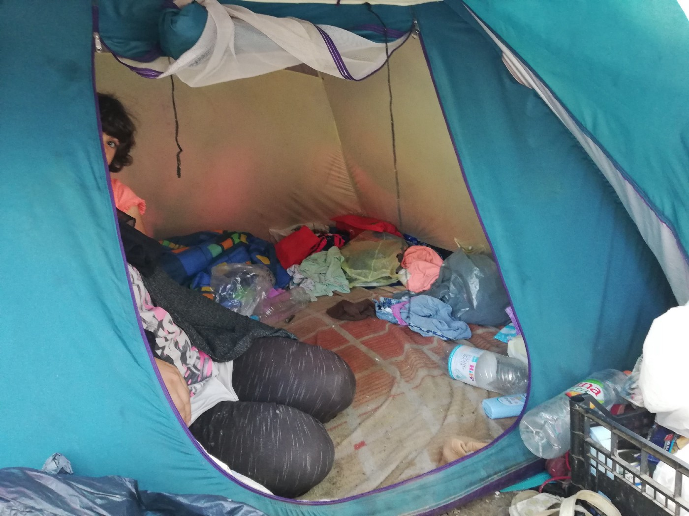

### AYS SPECIAL: Violence at the EU border: “It is a crime\!”

_Why violence at the EU borders is reminiscent of Srebrenica, and the role that patriarchy plays in today’s Europe\._

A woman with 6 girls, her daughters, lives in this small tent in one of the make\-shift camps in Bosnia\. They have tried to cross into Europe 4 times with no success\. Photo by AYS\.

_“…The children were crying so much\. After the police told me and to the other women, maybe five or six times, to take off our scarfs, but I did not want to\. My son was scared and told me: “Mum, please, remove your scarf because otherwise maybe they hit you… They treat us the same as we are animals\. But for us women, we are more sexually harassed\.”_ \(Marva, Afghanistan\)

“ _… In this mountain way, the police said to me: “Go straight go back\!”But I told him; “Where back? Where? I don’t know where?” as there was just a steep hill full of trees and thorny plants\. The police took a gun and put it into my head and shouted: “Go, go, go\!”, and I was so scared, I thought he was going to kill me\._ ” \(Fatima, Iran\) \.

These are just two out of many [stories](ays-special-from-bosnia-violent-push-backs-of-women-from-croatia-and-slovenia-aa4c8b5c9e6d) volunteers from [No Name Kitchen](https://www.facebook.com/NoNameKitchenBelgrade/?fb_dtsg_ag=Adz-S_vKCImVziFgjtphAQYR4fu0VRGxAwm9MSfIWKlwow:Adx3q8Z2b7Qm9L6drfMJpaeKBe2yBimH0PzMvjZwClSFfQ) in Velika Kladuša, Bosnia and Herzegovina, have recorded since they came to this border city\. In this case, both victims were woman who reached the EU member states — Croatia and Slovenia — when the police discovered them and pushed them back without allowing them to ask for asylum\.

The stories were recorded by a young Czech volunteer\. The Guardian [published a story](https://www.theguardian.com/world/2018/aug/15/refugees-crossing-from-bosnia-beaten-and-robbed-by-croatian-police) based on her reports, and [Idnes\.cz](https://www.idnes.cz) , a Czech portal, translated and published it under the title “ [Migrants are being beaten and robbed by the Croatian police, even the Czech volunteer claims this](https://zpravy.idnes.cz/chorvatsko-bosna-migrace-policie-nasili-migranti-ceska-pg6-/zahranicni.aspx?c=A180815_132636_zahranicni_luka) ”\. This article provoked reactions that Karolína Augustová, a volunteer from NNK, could never have expected\.

“I read the article and under it, I saw over one thousand one hundred comments\. I read only some saying: “This stupid girl also deserves few slaps into her face”; “You bitch, you should die\!”; “This bitch is helping illegal migration”; “Can’t believe that I have to pay the fuckers like her studying from my own taxes”\.”

She adds that these type of messages kept coming for days on her social media accounts\. “I can’t believe that thousands of people found time in their day to hate me and did not feel any barriers to fully show it although they knew so little about me,” Karolína says\.

She was advised to lock her twitter account, and to write to the Guardian to remove her name from the article, as well as to idnes\.cz, and to only report about the border violence through the name of the NNK\. Which she, after thinking about it, rejected, being fully aware that the women and people whose stories she is recording in order to try to help them are hated by people who they have never talked to, who don’t know their personal stories — “whether they are loving mothers, sisters, or friends, who know nothing about their opinions about countries and borders, who don’t know anything about how much pain they have experienced in their homelands and throughout their journey to Europe\.”

Avdija Ibrahimović, who survived [genocide in Srebrenica](https://en.wikipedia.org/wiki/Srebrenica_massacre) as a child, read the stories Karolína wrote down in disbelief\. “I am reading their stories and trying to imagine the pain these women feel while travelling with their children\. I am reading and I cannot believe that today when everybody is talking about human rights and freedom, woman and children have to go through this type of torture and mistreatment,” she wrote in an email to AYS\.

Avdija comes from a city where people were starved to death for months — where, after the army led by the war criminal Ratko Mladić entered the city in July 1995, over 8\.000 people, mostly men, were brutally killed\. The women were expelled and in some cases sexually abused\. She, who survived all this as a little girl, can easily see that her experience could be compared to what is happening in Europe today with people on the move\.

As in the case of crimes committed in Bosnia, in this case the worst is the denial and ignorance coming from the broader public, but also from those who can make decisions and bring change\.

In Europe today, it is hard to hear the voices of those who still believe in equality, freedom and human rights\. Their voices, like Karolína’s and many volunteers who are working with people on the move, are often silenced\. Especially if they are women\.

It can be said that Europe of today is more patriarchal than in the past, but also more militarized and violent\. While attacking women on the move, the EU is sending a message to everybody who is trying to reach its member states\.

Elissa Helms, Associate Professor at the Department of Gender Studies at CEU, Budapest, notes that back in the ‘90s, sexualized violence against \(ethnicized\) women was condemned by liberal Europeans as a violation of human rights and international law\. But today, this type of violence is often ignored\.

“Or, at best, such violence is blamed on \(non\-European\) smugglers and fellow migrants, men assumed to be violent and patriarchal with no respect for women because of their \(presumed\) Muslim and non\-European origins,” Helms concludes, adding that a range of \(gendered\) vulnerabilities are simply being swept under the rug\.

She also reminds us that the outrage over sexual violence in Europe has long been racialized, pointing to the example from the aftermath of the New Year’s Eve attacks in Germany at the beginning of 2016 when the media discourse created the atmosphere in which the European women are seen as in need of protection from sexual attacks by brown, Muslim migrants\.

“Now when migrant women are the victims, EU officials turn their heads,” Helms notes\.

For Karolína Augustová this attitude from the EU is what makes her continue reporting on border violence\. “No one should ever be pushed to be stripped of his or her opinion and stories based on hate or persecution from others, which people on the move are teaching me\.”

Violence, including sexual, acts as a message to all non\-EU citizens, of how powerful the Union is\. So powerful that the EU police can go unpunished for the extensive use of violence that their leaders, but also the broader public, would have otherwise condemned\. When women are subject to any kind of abuse in non\-EU, or Western societies, it is condemned globally and campaigns are started in order to stop it\. But when it’s committed by the EU forces, some kind of justification always exists, and it goes without sanctions\.

As people from Srebrenica know best\. “I am free to call it a crime\. Their experience is very similar to what we went through back in the 90s,” concludes Avdija Ibrahimović\.

\(By Nidzara Ahmetasevic\. AYS\)

> **We strive to echo correct news from the ground through collaboration and fairness\.** 

> **Every effort has been made to credit organizations and individuals with regard to the supply of information, video, and photo material \(in cases where the source wanted to be accredited\) \. Please notify us regarding corrections\.** 

> **If there’s anything you want to share or comment, contact us through Facebook or write to: areyousyrious@gmail\.com** 

_Converted [Medium Post](https://medium.com/are-you-syrious/ays-special-violence-at-the-eu-border-it-is-a-crime-3228533e511c) by [ZMediumToMarkdown](https://github.com/ZhgChgLi/ZMediumToMarkdown)._
