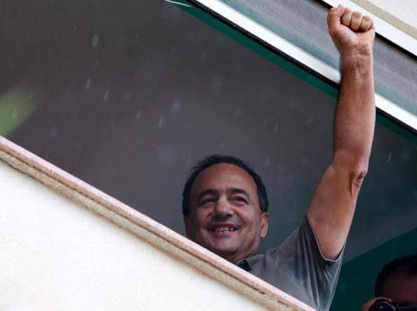
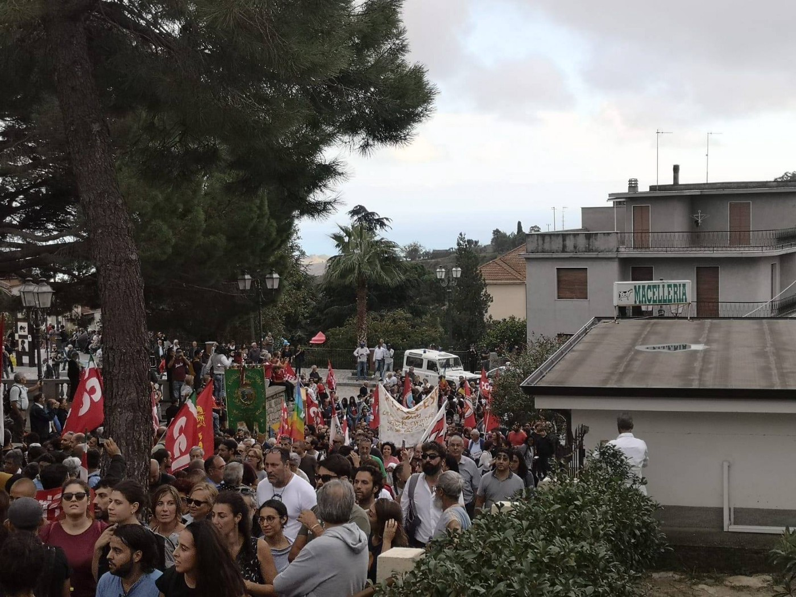
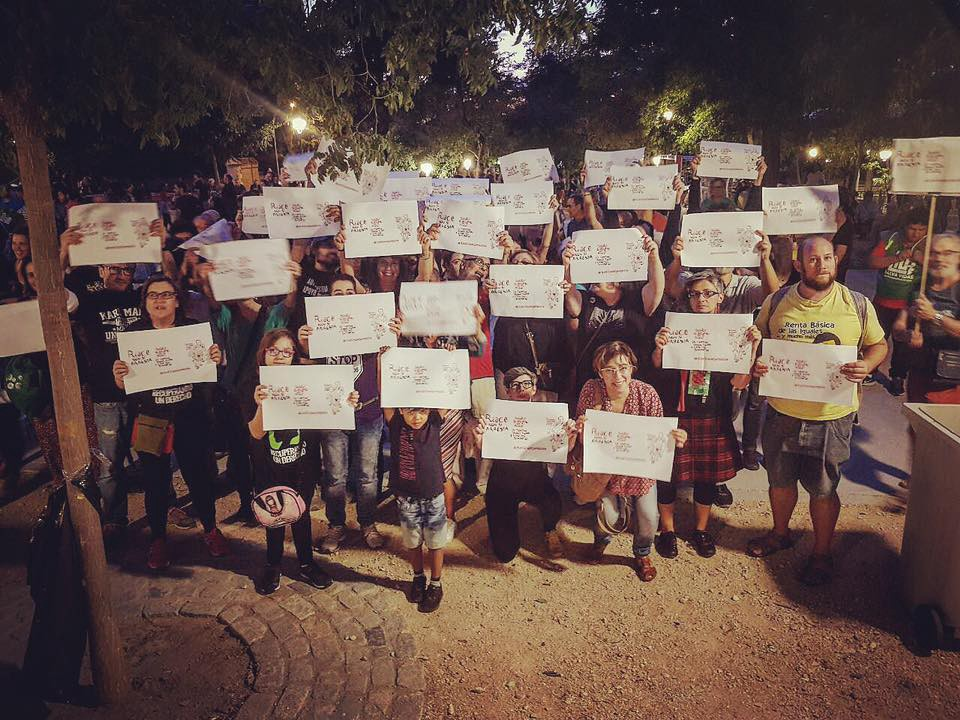
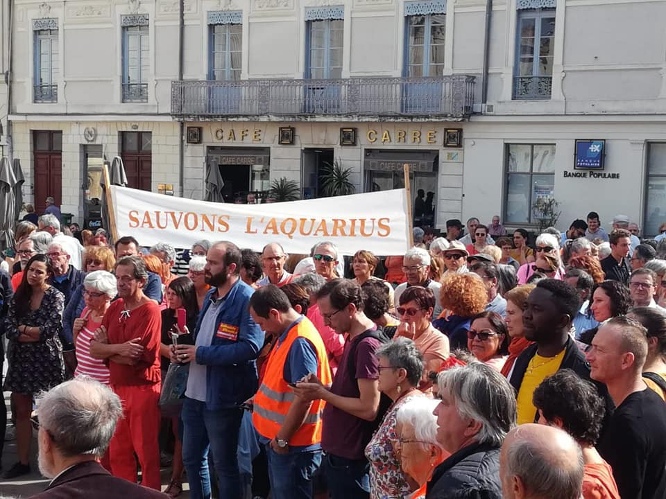
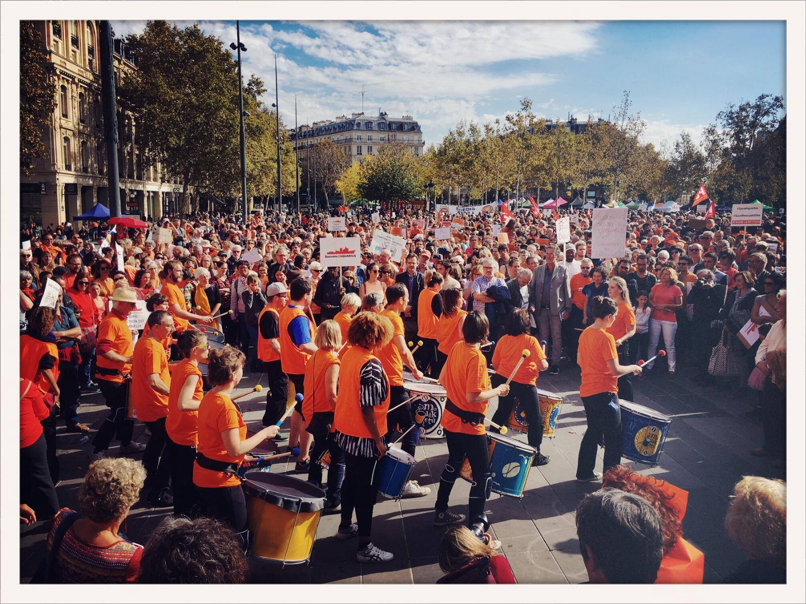
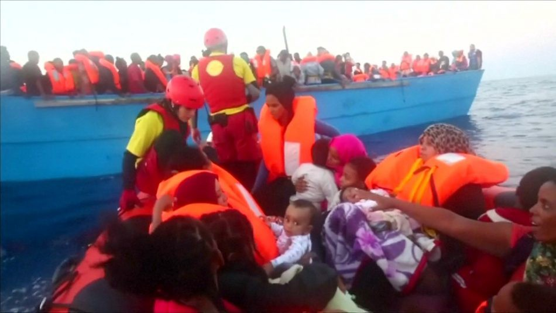
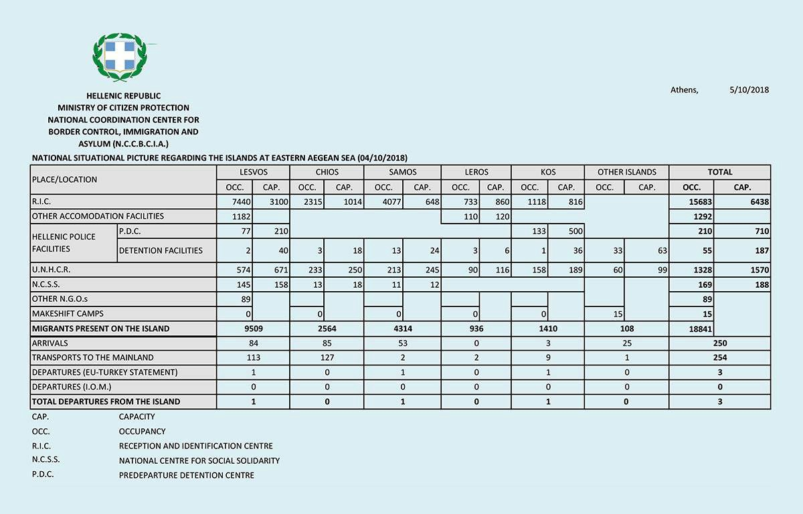
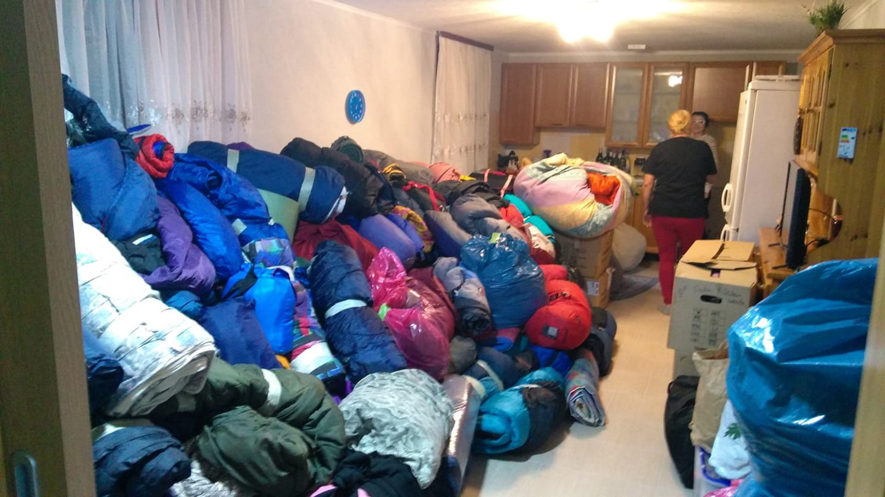
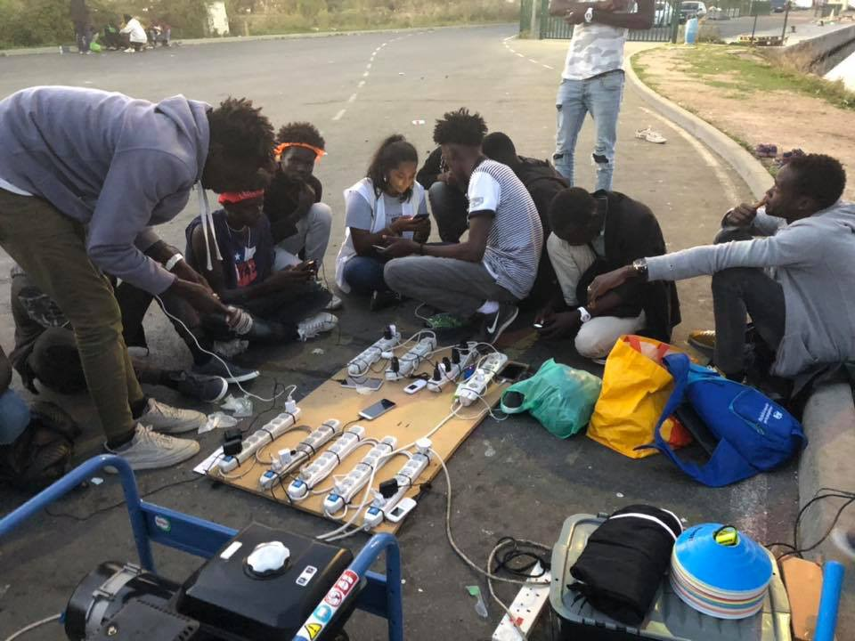
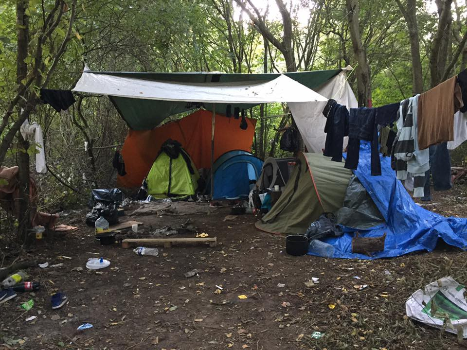

### AYS WEEKEND DIGEST 6/7\.10\.2018: Are we strong enough to say No Pasarán together?
#### _Hundreds of thousands people on the streets of European cities showing solidarity // Over 1000 people rescued in the sea this weekend // New arrivals to Greek islands // Thessaloniki center turned into make shift camp // First camp to be open near Sarajevo soon — maybe // Hundreds of people in forests in France…_

Domenico Lucano speaking to the “river of solidarity”\.
#### Feature

_“The story is us\. With our choices, our beliefs, our mistakes, our ideals, our hopes of justice that no one can ever suppress\. There will come a day when there will be more respect for human rights, more peace, more equality, more freedom than barbarism\.”_ This is a part of the message Domenico Lucano, mayor of Riace, Italy, delivered on Sunday in the front of the more than 10,000 people, or as he called it “ _the river of solidarity_ ”\.

Photo by Melting Pot Europe\.

He spoke to people who gathered to show solidarity not only for him, but for everybody in the city of Riace, known for its solidarity and integration of people on the move\.

Riace is a small village at the top of the hill in Calabria\. The Mayor Lucano opened its city to all those in need, creating a city of dreams where locals and those who came have started building a life full of hope\. However, recently, he was arrested and accused of aiding and abetting undocumented migration\.

Like many other small towns across Italy, Riace has been subject to depopulation over the years\. Many young people left their homes to go abroad\. Lucano came up with the idea of inviting people who are in need of a home to the city, while contacting the Italians who left to open their old homes\. And it worked\. At its peak, the town of 1,500 hosted 500 people from 20 countries\.

Solidarity with “refugee mayor” from Spain\. By Caravana Abriendo Fronteras

The mayor was put under house arrest on October 2 as a result of a year long investigation into the management of funds for refugees in the town, which saw the mayor investigated for racketeering, embezzlement and fraud, alongside 31 others\. A preliminary examination judge did not find enough evidence to support these charges\.

People went out on the streets of many cities of France also to show their solidarity, but this time with the crew of the rescue ship Aquarius\.

Several thousand people gathered this weekend in sixty cities across France, and also in Brussels, Berlin, Madrid and Palermo\. They protested dressed in orange, the color of the Aquarius boat\. The mobilization was the strongest in Marseille, the headquarters of the association SOS Méditerranée, with between 3,500 \(police estimate\) and 10,000 \(organisers estimate\) people gathered on the Old Port\.

By Pilots Volunteers

The Aquarius is blocked at the dock in Marseille, due to a lack of registration\. Following the withdrawal by Gibraltar last August, the Panamanan maritime authorities announced that they would also withdraw their flag for “non\-compliance” with “international legal procedures” for the rescue of migrants at sea\.

Since February 2016, 29,500 migrants have been saved thanks to the Aquarius and its crew\. But “the situation is more critical than ever,” [said SOS Mediterranean](https://www.20minutes.fr/.../2349827-20181006-vague...) President Francis Vallat in Paris: “While the flows have never been so low for years, the number of deaths is increasing inexorably\. We have gone from one death on 42 migrants \(at sea\) last year to one out of 18 migrants’ deaths this summer\. “All because the state ships are inadequate and there are no more NGO ships\. \(…\) If we let the migrants sink, we let our soul and our values flow,” he said\.

It is the face of one other Europe that is suppressed, criminalized and ignored by the leaders\. But, much more is needed\. There is not time to wait and procrastinate\. It is time to act\!
### NO PASARAN\!
#### Morocco

The arrests and refoulement of sub\-Saharan migrants continue in Nador\. Since early Saturday morning, almost 100 people have been arrested in Tangier without legal grounds and returned to the south of Morocco\.

When auxiliary forces attack the shelters of sub\-Saharan migrants in Nador, the result is shown in this [video testimony](https://www.facebook.com/AmdhNador/videos/328926684532927/?__xts__%5B0%5D=68.ARAvfis8Ig4-Y9nlwLMTL_ZVX2ZTbh7GMXhOUKAjpD0rcylloLwaxCYAM5SM3EOinuUOf6Een9F1APF44cLISrDfIqWz4OOw-hwDZHWhM1keFK8Q9x1nw4swGV7_dBnzhoFHAGkwpuuoOoJ12AaKKKzYWGClla1TqEBi0K5vphEe04eSjPCUfQ&__tn__=-R) \.
#### Sea

Incredible news from the Mediterranean — rescue ships have saved 1,181 human beings from 30 boats over the weekend\.
#### Malta

A small inflatable boat carried 120 people on the Mediterranean, only to be saved by a rescue by the armed forces and brought to Malta on Sunday\.

By Malta Times

It is the first time since April this year that a big group of people have arrived to Malta\.

All the people, according to the first media reports, will stay on the island\.
#### Greece

[Aegean Boat Report](https://web.facebook.com/AegeanBoatReport/?__tn__=%2CdkCH-R-R&eid=ARAbYc6CKxEdi20CjwMUXvIDG6Uy-6HEElWb059YezAfZpYF8rek9oKiCWXPhQQIrVV5JzCQeufLNTLt&hc_ref=ARRnmbSl8fkVBvsatvInQz7djXC9GbW77fkWm-PjFWoxvotNUF7Nuw691zRe8RU5HBM&fref=nf) records almost 300 new arrivals on the islands this weekend\. On Saturday, four boats arrived with 184 people, two on Samos and two on Lesvos\.

On Sunday, all the registered arrivals were on Samos, a total of 95 people\.

Current situation on the islands by Hellenic Ministry of Interior\.

The Greek government continues with transfers from the islands to the mainland, with a lot of confusion\. Some people are taken to camps, some to hotels and private accommodation\. From September 21 to October 5, 1,567 people from Moria had been moved into apartments in Volvi in central Macedonia, with 100 more expected in the next few days\. Another 792 spots were created by renting nine hotels in Grevena, western Macedonia, of which 400 have already been filled\. Another 5,000 will be provided soon\.

At the same time, once again, Thessaloniki is overwhelmed with people who are arriving from the islands, but also from the direction of Evros\. Many, as in 2015 and 2016, are forced to sleep outside\.

According to some reports, Aristotelous square, the central area in this city, has turned into a makeshift camp with several hundred people staying there\. Many of them are from the islands, and were sent to the camps\. But, these are the same old camps, sometimes a little improved, but more often not, and they do not want to continue living a miserable life, full of fear and humiliation\. Even sleeping out in the open is better\.

Some of the informal shelters are destroyed by the police\. In Ganitsa, west of Thessaloniki, [the police evacuated](https://www.facebook.com/ahmad.hamed1234/posts/731458833882599?__xts__%5B0%5D=68.ARCokocyVsXCdp_AqwUJIG6l97d4u6-VReUWucZ5otieUFP1Q9U4Qm_KShrkBGCi-hmOfS74uoj_cZJrXHG6sacZj4K6Fg6gB67MMZEwN4W7wZwoaQOIqT8v0B_7FVybQcVM2UXI0y6ZyahyiBMvEOZQmxGhjEVdCRBAmEzBTP3sT17KPCCq&__tn__=-R) the building used as an camp\. 109 refugees were arrested\.

The government has started placing people in apartments\. About 5 million Euros will be dedicated to these purposes, something that could have, and should have, been done earlier\.

While people are being transferred from the islands, the number of refugees coming over the land border is increasing too\. According to data released on Friday by the UNHCR, by the end of September 23,419 people had arrived\.

Life on the islands, for those who will stay or who are just arriving, is still not easy\. In Moria, people are paying 50 Euros for a spot in one of the containers, just to not to be outside in the cold and rain\. Conditions for those who will remain are not improved at all, so far\.

On Chios, [1,500 people signed a petition](https://astraparis.gr/exodiko-me-1500-ypografes-kata-tis-ekpaideysis-ton-prosfygopoylon/) against the education of refugees\. They are people from this small island, manly right\-wing extremists, but also parents and guardians of students from various schools in Chios\.

The document is signed by the attorney\-at\-law of the parent’s lawyer Grammatiki Alymonos and is communicated — among other things — to the Minister of Education, to the deputies of Chios, education director, parent and guardian association, and so on\.

This new action creates a major issue for the Panchian Committee aspirations and the further developments it can make in terms of the smooth start\-up and operation of refugee classes and education\.

The Greek government continues to send people back to Turkey in accordance with the EU\-Turkey deal\. Most of the people who are returned are from Pakistan, but also include those from Syria and Afghanistan,\.

This weekend, Amnesty International \(AI\) announced its “10 overarching demands” for women and children living in Greece’s refugee camps to overcome human rights violations\.

In their [latest report](https://www.amnesty.org/en/latest/campaigns/2018/10/refugee-women-in-greece/) titled “I Want to Decide About My Future: Uprooted women in Greece speak out,” AI reveals the dire conditions and dangers that women and girls face as well as the perilous journeys they encounter when they reach the Greek islands or the mainland\.

According to the report, more than 60 percent of those who arrived in Greece in 2018 are women and children\. Trapped in overcrowded and squalid EU\-sponsored camps on the Greek islands, women and girls are exposed to several dangers, including harassment and sexual violence, the report added\.

“The fact that European governments have been avoiding to provide safe and legal means to refugees fleeing the war also increases the risk of women and girls’ being subject to horrific infringements,” Amnesty International Secretary\-General Kumi Naidoo said\.

Treatment of women refugees, but also those who are trying to fight for them in Europe, is becoming problematic\. We wrote more on that in our [latest special on border violence](ays-special-violence-at-the-eu-border-it-is-a-crime-3228533e511c) \.

HELP IS NEEDED\!

[Health\-Point Foundation](https://www.facebook.com/healthpointfoundation/photos/a.222810764761510/687063671669548/?type=3&theater) need your help\. They need dentists to fill an urgent gap in November on Lesvos\.

[Happy Caravan](https://www.facebook.com/groups/1666846223566047/permalink/2107456316171700/) is looking for English teachers and speakers to volunteer at their refugee school in central Greece\.

You can fill their volunteer form at [https://happy\-caravan\.org/volunteers/](https://happy-caravan.org/volunteers/) or contact them directly at [info@happy\-caravan\.org](mailto:info@happy-caravan.org)
#### Italy

_Total arrivals 1 Jan — 30 Sep 2018: 20,885_

_Total arrivals 1 Sep — 30 Sep 2018: 884_

_Average daily arrivals in September 2018 so far: 29_

_Dead and missing in 2018 — Central Mediterranean \(as of 30 Sep\) 1,245_

_Dead and missing in 2018 — Mediterranean Sea \(as of 30 Sep\) 1,720 \(UNHCR\)_

And Salvini continues with his fascist politics\. Now he wants to close the country’s airports in order to block possible repatriation of people on charter flights from Germany\.

With this threat he is responding to reports that the German Chancellor is preparing to send the first group of 40 people back to Italy on two flights scheduled to land in Rome this week\. Italian media added that up to 40,000 people could be repatriated from Germany to Italy\. The Italian government has denied there is any agreement to step up these returns\. Also the German Interior Minister denied this possibility\. But it is not enough for Salvini\.

“If anyone in Berlin or Brussels is thinking of dumping dozens of immigrants in Italy through unauthorized charter flights they should know there is not and will not be any airport available\. We will close the airports like we closed the ports,” he said\.

Nevertheless, under the Dublin Treaty, people are required to seek asylum in the first European country where they disembark\.
#### Serbia

1,130 people arrived into Serbia over the last week\. This is a slight increase in comparison to the previous week when the government registered 961 new arrivals\. Most of the people, 53%, claimed to have entered from Macedonia, while some came from Bulgaria, and a certain number have arrived by air\.

Most of the people who arrived are from Afghanistan \(26%\), Pakistan \(24%\), or Iran \(23%\), followed by Iraq \(6%\), Bangladesh \(3%\), and Syria \(2%\) \.

At the moment, there is about 3,905 people present in Serbia, and most of them are in the camps, while several hundreds are sleeping rough at the border areas\.

UNHCR and partners continue gathering reports of illegal push\-backs from the neighboring countries: 506 from Croatia, 188 from BiH, 74 from Romania and 18 from Hungary\. More than 58 percent claim they were denied access to asylum procedures by authorities\.
#### Bosnia

IOM announced — more more time — that the camp near Sarajevo should be open soon\. This time they claim it will happen over the next 10 days\. The capacity should be around 400 places, and people will live in containers\.

In the meantime, hundreds of people are forced to live on the streets of Sarajevo, depending exclusively on help provided by volunteers and locals\. One million Euros is dedicated to construct this camp\. It is hard to say that it is the best solution on how to spend this money\. Having in mind how people are open in Bosnia, showing solidarity, this money could have been maybe better spent following the model of Italian mayor Lucano \(as reported above\) than building another ugly camp where people will not be happy\. But, big international organizations are dependent on the camps, using them as a cover to collect more donations in order not to provide better life conditions for people, but rather funds to cover their administrative costs\.

But, people of Bosnia — so far — do not give up on people who are still arriving to the country\. In Tuzla, a town close to the Serbian border, groups of people are organizing among themselves — bringing help and offering shelter to all those passing through the country\. The same is in Sapna, Zbornik, Bijeljina, Bihac and Kladusa\. They do not have funding, but they know what solidarity is\. And they have friends all over Europe\. Some of them recently collected donations in several European countries, transported them to Croatia from where they were taken by local volunteers to Velika Kladusa where they will be distributed to all those who in need\. The clothes and shoes are stored in a house of one local lady\.

Improvised storage in a living room by local family in Kladusa\.

Before the winter, many people will try to continue towards the EU from Bosnia\. Unfortunately the police in Croatia, and also Slovenia and since recently even Italy, are pushing them back\. This week we published [another report](ays-special-eu-border-violence-update-from-bosnian-croatian-border-fro-september-3f2a6227d383) on border violence prepared by No Name Kitchen and SOS Team Kladusa\.

_“The volunteer groups present work together to record and monitor the border violence perpetrated by the European Union\. Up until now the archive of cases represents only a portion of the victims who feel able to share their trauma, but even so, they present a harrowing reality that \(for so long\) has been shielded from the public eye by the whitewashing agenda of the EU\._

_Creating a counterpoint to this multilateral system of deportation is the primary aim of our monitoring presence\. Together with other grassroots organisations, lobbying groups and media platforms we have developed a standardised framework for recording and relaying the crimes being perpetrated against refugees by EU border officials\.”_
#### Croatia

This week, the Council of Europe issued a strong criticism against the Croatian Government for the facilitation of illegal pushbacks to [Bosnia and Herzegovina as well as to Serbia](http://hr.n1info.com/a337244/English/NEWS/CoE-calls-on-Croatia-to-end-police-violence-against-migrants.html) \.

_“I am worried by reports that I have received from expert refugee and migrant organisations that provide consistent and substantiated information about a large number of collective expulsions from Croatia to Serbia and to Bosnia and Herzegovina of irregular migrants, including potential asylum seekers\. Particularly worrisome are allegations of systematic violence used by Croatian law enforcement officials against those persons, including pregnant women and children\. According to UNHCR, Croatia has allegedly collectively expelled 2,500 migrants since the beginning of 2018\. Among them, 1,500 reported having been denied access to asylum procedures, while 700 of those persons reported violence and theft by law enforcement officers during summary expulsions,”_ Council of Europe Commissioner for Human Rights, Dunja Mijatovic, said in a letter sent to Prime Minister Andrej Plenkovic\.

Nevertheless, once again, the Croatian police have [denied everything](ays-daily-digest-05-10-2018-croatian-police-deny-any-wrongdoing-or-illegal-pushbacks-c887ec2c3a2f) \.
#### France

“Refugees lose their phones in two main ways; either they are purposefully destroyed by the police in their pointless efforts to move the already\-displaced people onwards, or they are stolen by other members of their camp\. Without their phones, they are unable to travel anywhere as they have no maps, they can’t assure their friends and families that they are still safe and well, and often they are unable to do anything at night due to their lack of torch\.”

By Care4Calais\.

“With this in mind, we are in desperate need of used \(and critically UNLOCKED\) smartphones, and for funds to buy them\. You can post phones to either our UK or French postal addresses on our websites or donate now to help\.” [Care4Calais](https://www.facebook.com/care4calais/posts/2125933224106290?__xts__%5B0%5D=68.ARC4uIMLWAEoqMLgrD7pf_kXZl_DY5rYCRpA7G-W3dVMG9dw57zXX0SWHjgpNyWImhSXzcjHkCogTya_SD1tMI_xj8TbWypWnQyGHAhDdB3H0cGiQ5fiHqaYbjB-AQvWwVFq37w9VdV5QBrSpXkadvAv8PbQgg-dThxP6usCjryLXyBOl-3yeA&__tn__=-R) \.

Numbers in Dunkirk have continued to rise steadily, Mobile Refugee Support reports\.

“Despite the worsening weather and conditions, many families remain living outside\. Children as young as 1 year spend their nights huddled up in tents with nothing more than a thin fabric protecting them from the cold, autumnal nights\.”

Care4Calais

[“Please share this](https://www.facebook.com/MobileRefugeeSupport/posts/852742428264703?__xts__%5B0%5D=68.ARDyzeG5QSbSQBQ6SI0m6K_BKI9hnqdgR6qogngN9V4-Nln3H-is1AndneAd_hxWpiuAZCc3oowALW7-Ziu93XVo-6QaxcmD88dT3H1_w6Ks1bOBeAhZ7hK44AUOlgEJ9GQdqQB_J6ZULr2sKXq5pqEezNBeFfamjx_gETyOKkeHdaic3_i-&__tn__=-R) and help to keep raising awareness of the situation here, and the inhumane conditions these people are being forced to endure\.”
#### UK

The [European Council on Refugees and Exiles \(ECRE\)](https://web.facebook.com/TheECRE/?__tn__=%2CdkCH-R-R&eid=ARAzvLlG1ItlardaNAiD0CGfHFi3DaZfhtjNrwF_sT07_sp3kcDNgQ81n7MknGrL4dS1KX1659dmrqSe&hc_ref=ART99xmic8vCY1_no6QGPzGTd1jZYVTc-QVD2KhD7eS3RKOnOD8eAjz-qToYOyBO2yQ&fref=nf&hc_location=group) issued a statement in support of 15 activists who locked themselves together around an immigration removal charter flight that was preparing to deport undocumented migrants from Stansted airport to Nigeria, Ghana and Sierra Leone\. The action, in March 2017, caused the flight to remain grounded and the runway to be shut for one hour and 20 minutes\.

They are now facing maximum sentences of life imprisonment for charges of committing a ‘terrorist offence’, under a law which has never before been used against non\-violent activism\.

In response to the deaths of a number of young asylum seekers, who previously lived in Calais, members of London’s Eritrean community have set up [a support group](https://www.facebook.com/groups/CalaisMigrantSolidarityActionFromUK/permalink/2208481835893218/) for young people from their country\. I’m working alongside them and we’re at a very early stage but in desperate need of support — financial and advisory\.
#### Denmark

[Denmark said](https://www.thelocal.dk/20181004/denmark-refuses-to-take-in-un-quota-refugees-in-2018) it would not take in any refugees under the UN’s quota system in 2018, focusing instead on integrating those recently arrived in the country\.

_“We’re still in a situation where we’re struggling to integrate the many refugees who have come to Denmark in recent years,”_ Immigration Minister Inger Støjberg said in a statement\.

For the first 10 months of 2018, some 2,600 applications have been received\.

A new immigration law adopted at the end of 2017 stipulates that the number of refugees received is to be decided by the immigration ministry\.

> **We strive to echo correct news from the ground through collaboration and fairness\.** 

> **Every effort has been made to credit organizations and individuals with regard to the supply of information, video, and photo material \(in cases where the source wanted to be accredited\) \. Please notify us regarding corrections\.** 

> **If there’s anything you want to share or comment, contact us through Facebook or write to: areyousyrious@gmail\.com** 

_Converted [Medium Post](https://medium.com/are-you-syrious/ays-weekend-digest-6-7-10-2018-are-we-strong-enough-to-say-no-pasar%C3%A1n-together-70be61b8788c) by [ZMediumToMarkdown](https://github.com/ZhgChgLi/ZMediumToMarkdown)._
