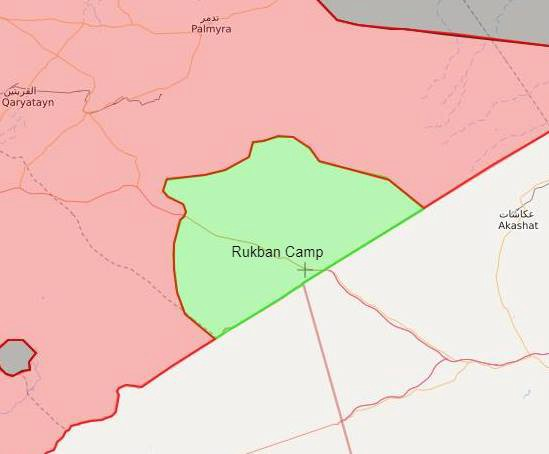
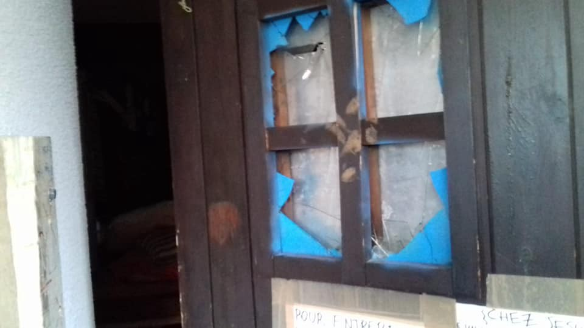
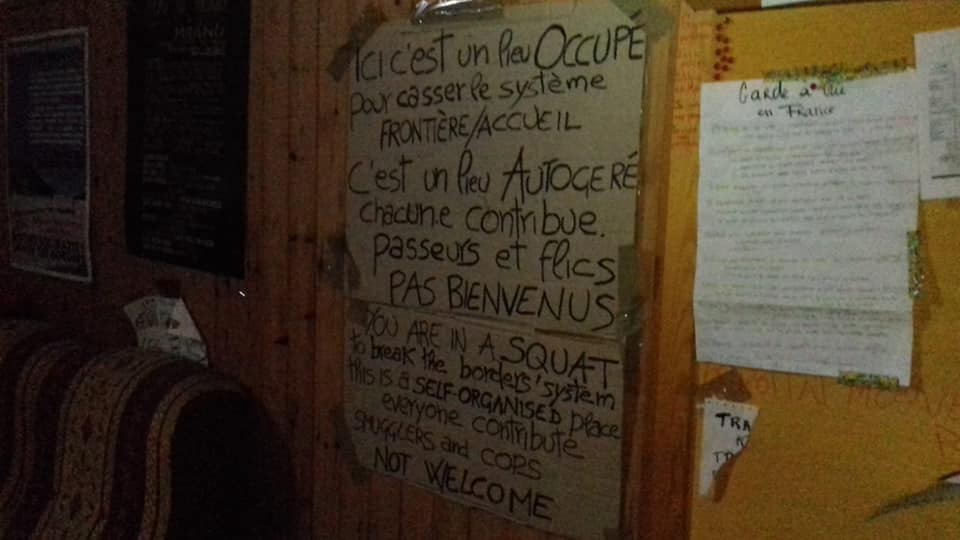
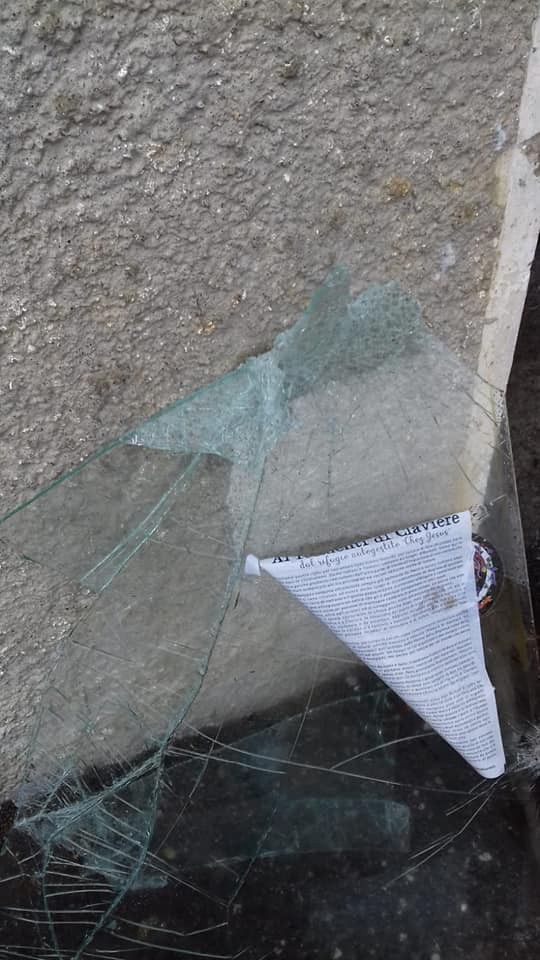

### AYS Daily Digest 10/10/2018: 3 Women Found Brutally Murdered Near River Evros, Greece
#### 9 Dead and 25 Missing after Boat Capsizes off Turkish Coast // Syrian Humanitarian Crisis to Continue Well Beyond 2019// 14 Children Dead as Humanitarian Assistance is Cut in Rukban Camp, Jordan // Serbia Re\-Introduces Mandatory Visas for Iranian Citizens// Chez Jesus Refugee Shelter Evicted and Destroyed by Italian Police// MSF forced to Suspend Mental Health Services on Nauru

](assets/8b25340d6d64/1*FtvxDvZhbgRiwUaYjTLpsg.jpeg)

Photo by [Gabriel Tizon](https://www.facebook.com/gabrieltizonfotografo/photos/)
#### FEATURE:
#### Three women attempting to reach Europe found dead with their necks slashed close to the border of Turkey and Greece

[Greek Authorities have reported](https://www.washingtonpost.com/world/europe/the-latest-3-women-found-dead-near-greece-turkey-border/2018/10/10/4de935fa-cc91-11e8-ad0a-0e01efba3cc1_story.html?noredirect=on&utm_term=.f4e9e756985b) the bodies of the women were discovered near the village Pragi on Wednesday by a farmer from the village\. The women were found 50 metres from the River Evros which extends along the land border between Turkey and Greece\.

The three victims’ nationalities remain undetermined, but they appear to be from North African, Middle Eastern or Asian origins\. Their identities remain unknown\. One of the victims is believed to be under 15 years of age, while the other is between 17 and 21\. The third victim is thought to be between 30–35 years old\. The coroner, Pavlos Pavlidis, reports that the women were killed approximately four days before the bodies were discovered and he has zero doubt the deaths were caused by a criminal act\. DNA tests will be conducted to determine if the women are related\.

_‘They were found with their hands bound, each body about two or three meters away from the other\. Their throats were cut right across\.’_

The River Evros is a commonly used entry point for refugees attempting to enter Greece\. Over 10,000 refugees are reported to have arrived in Greece in the first half of 2018 by crossing the Evros\.

Previously, [we reported](ays-special-violent-robberies-and-deportations-of-refugees-in-greeces-evros-region-2056ba6195b0) about the violence at this border\.
#### SYRIA
#### The humanitarian crisis in Syria will not ease in 2019

The United Nations humanitarian coordinator in Syria, Al\-Za’tari reported on Thursday, will continue into the next several years\.

It is reported that approximately 12–13 million Syrians, half of whom are internally displaced are reliant on and in need of humanitarian assistance\. The country is nearing its eighth year of civil war\.

■■■■■■■■■■■■■■ 
> **[ETANA](https://twitter.com/ETANA_Syria) @ Twitter Says:** 

> > Latest developments in south #Syria as 3,000 civilians leave Busra due to lack of services &amp; dire humanitarian conditions further deteriorate in #Rukban as regime cuts aid to camp https://t.co/Ead3frriAw 

> **Tweeted at [2018-10-10 07:53:36](https://twitter.com/etana_syria/status/1049930937046319104).** 

■■■■■■■■■■■■■■ 

#### JORDAN
#### Conditions in Rukban Camp are catastrophic, 14 children dead\.

It is reported that 14 children have died in Rukban camp in Jordan at the border with Syria\. The UN are being criticized for not supplying the camp with food\. NGO access has been banned in the region and the camp is surrounded by Iranian, Russian, Syrian and US armed forces\.

#### TURKEY
#### **Nine deceased and 25 missing from a boat that capsized off the shore of Turkey**

[At 11:45 pm on Tuesday](http://---  http://www.hurriyet.com.tr/gundem/izmirde-tekne-faciasi-4-olu-40982254   ---) a woman who swam back to Turkish shores after spending 28 hours in the sea after the boat she was traveling on capsized, alerted Turkish authorities to the catastrophe\. The boat was carrying approximately 35 refugees including at least five children\. It had departed from Turkey at 10:00 pm on Monday and had capsized outside Karaburun, Izmir in Western Turkey\.

The Turkish Coast guard has dispatched numerous vessels and a helicopter for the search mission\. Nine bodies have been located so far as the search continues for the remaining 25 passengers\.

#### GREECE
#### **Arrivals**

Four boats arrived in the morning according to Aegean Boat Report\. Three boats arrived at the Greek Islands of Samos carrying 23, 47, and 46 people\. One boat arrived on Farmakonisi carrying 49 people\. No breakdown so far\.
#### **Greek Coast Guard captain praised for saving thousands of lives dies from heart attack**

This morning Kiriakos Papadopoulos, the captain of _4\.1 Mile_ s passed away from a heart attack at age 44\. The local hero assisted in saving over 5,000 lives of people attempting to cross the Aegean Sea to Greece\.

To watch a documentary of his work please [follow this link\.](https://vimeo.com/185717440)
#### **Volunteers needed**

**A Drop in the Ocean** are in need of volunteers to join their team in Elefsina\. For more information please email rivillig@drapenihavet\.no or visit their [website\.](http://www.drapenihavet.no)

**Together for Better Days** are in need of a female Farsi ranslator to join their team\. For more information please [follow this link\.](https://www.facebook.com/job_opening/283973542222400/?source=attached_post_other)

**Lifting Hands International** are looking for a warehouse lead to join their team in Serres in Northern Greece\. The job will entail management of a warehouse that facilitates the distribution of food, clothing and hygiene items\. For more information please email their volunteer coordinator, Roos at greecevolunteer@liftinghandsinternational\.org or [follow this link](https://www.facebook.com/groups/infopointfornortherngreecevolunteers/permalink/741123176233978/) for more information\.
#### **The Norwegian Refugee Council warns this winter will once again threaten lives at Greek Refugee Camps\.**

The organisation has determined that camp facilities are insufficient and ill\-equipped to handle the cold weather which is exacerbated in regions by overcrowding in the camps\.

> “Unless Europe urgently steps up its support to tens of thousands of refugees in Greece, harsh winter conditions may claim lives of vulnerable families living in squalid conditions\.” 

#### SERBIA
#### **Serbia re\-introduces visas for Iranian citizens**

The Serbian government abolished the visa\-free agreement with Iran, established due to suspicions of the misuse of the free\-travel agreement by people seeking asylum\.

Since the introduction of the visa\-free agreement in August 2017, which was put in place in an attempt to increase tourism to the country, it has been reported that the percentage of Iranian asylum seekers has increased from three to 12 percent\.
#### ITALY

**Chez Jesus Refugee Shelter evicted and devastated by Italian Police**

> They’re clearing the shelter\! And they’re destroying everything\! [Chez Jesus — Rifugio Autogestito](https://www.facebook.com/Chez-Jesus-Rifugio-Autogestito-362786637540072/?__tn__=kC-R&eid=ARCIv9YdFyEAg9otYkcYewcIP7zwmiy_rDvAaOxCMhMyDFQebAw6GbgUApPPazITdmPsGcOay1yxsjHX&hc_ref=ARTqmPQCnWLK9Q9ziKWId-4rYo76s-gDtN5arPczCdtWUL8qWRTrqBpmKbdLkHKNXew&fref=nf&__xts__%5B0%5D=68.ARB71pJK9xMUBO-92ZP37u4O-b20I3UimPQ5i_i4VsEEkNiz9A3gRA3OMorVTKfrDyjvT5ykky36-EAGl2_sDO4hEAlFuM-Qfdnxucqle77Hk0tluZ3x7lkjnbbEEa9HxdlYSBe6e76CYJpCfkvKlShV0gRh3JTu2xHmKyer9LdPypnyICLR) 

**Still images of the evacuation of the shelter, devastated by the cops**

#### FRANCE
#### A valuable tool for those wanting to assist refugees on the ground in Paris

The October edition of a guide for those seeking asylum in Paris is available in three languages; English, French, and Arabic\. It incorporates a list of services and advice and is updated each month\. To access the guide please [follow this link\.](https://guideasile.wordpress.com/)
#### BELGIUM

**RWAN: An initiative with the goal of connecting refugee women to jobs**

The initiative is led by Lama Jaghjougha, a Syrian refugee who is living in Belgium\. It attempts to bridge the gap between companies and all types of organisations and women who are looking for work\.
#### AUSTRALIA
#### **MSF forced to suspend services on Nauru**

MSF has been forced to end their mental health care services at the Australian\-made detention centres for refugees on Nauru\. MSF describes the mental health situation for asylum seekers and refugees as beyond desperate\. Most people detained on the Island by the Australian Government have been there for over four years in conditions so deplorable that the centres are commonly referred to as ‘torture and prison camps\.’

■■■■■■■■■■■■■■ 
> **[MSF Australia and New Zealand](https://twitter.com/MSFAustralia) @ Twitter Says:** 

> > #NAURU: MSF Psychiatrist Beth O’Connor shares her story
We strongly condemn the sudden decision of the Government of Nauru to end MSF activities &amp; express high concern for the conditions of the patients that we have been forced to leave behind.
[msf.org.au/article/statem…](https://www.msf.org.au/article/statements-opinion/msf-calls-immediate-evacuation-all-asylum-seekers-and-refugees-nauru) https://t.co/6UdzrY9ihC 

> **Tweeted at [2018-10-11 02:30:00](https://twitter.com/msfaustralia/status/1050211886808133633).** 

■■■■■■■■■■■■■■ 

**We strive to echo correct news from the ground through collaboration and fairness\.Every effort has been made to credit organizations and individuals with regard to the supply of information, video, and photo material \(in cases where the source wanted to be accredited\) \. Please notify us regarding corrections\.**

**If there’s anything you want to share or comment, contact us through Facebook or write to: areyousyrious@gmail\.com**

_Converted [Medium Post](https://medium.com/are-you-syrious/ays-daily-digest-10-10-2018-3-women-found-brutally-murdered-near-river-evros-greece-8b25340d6d64) by [ZMediumToMarkdown](https://github.com/ZhgChgLi/ZMediumToMarkdown)._
