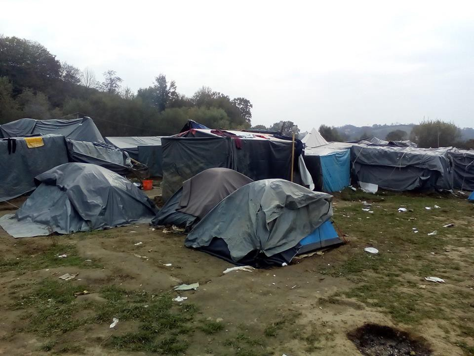
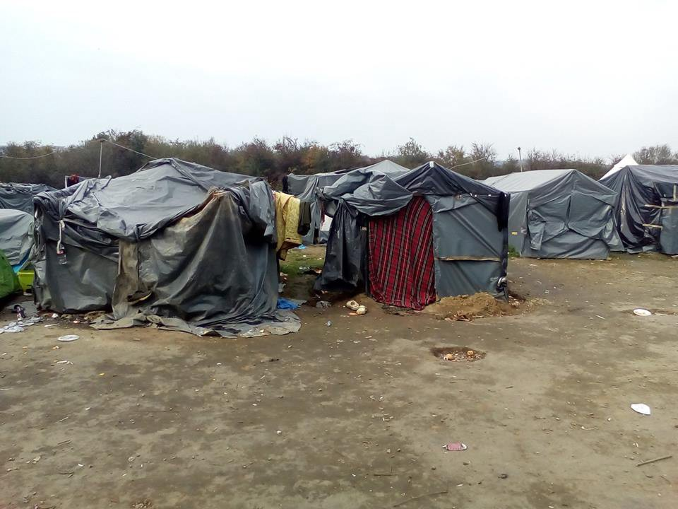
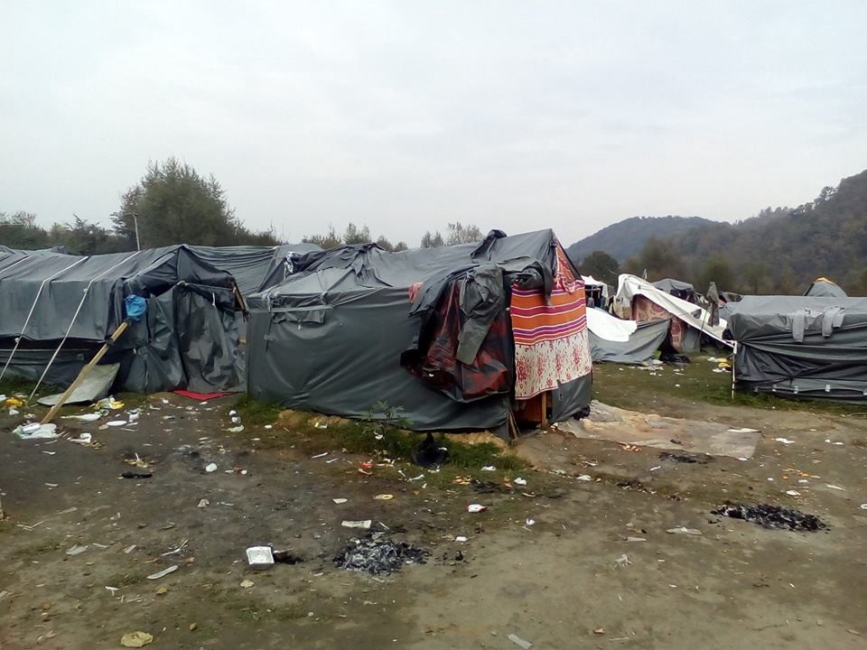
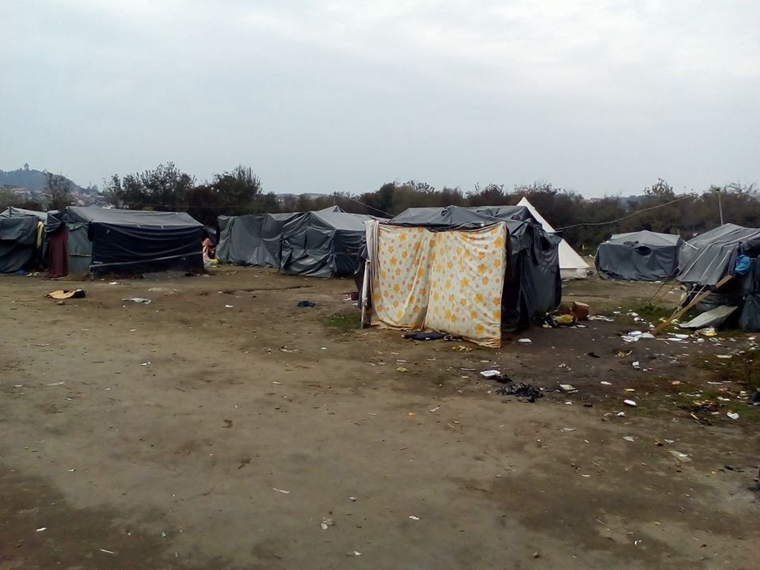
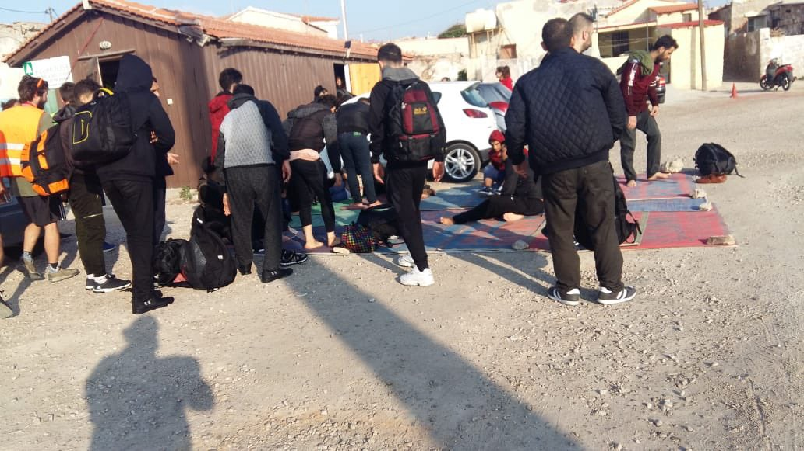
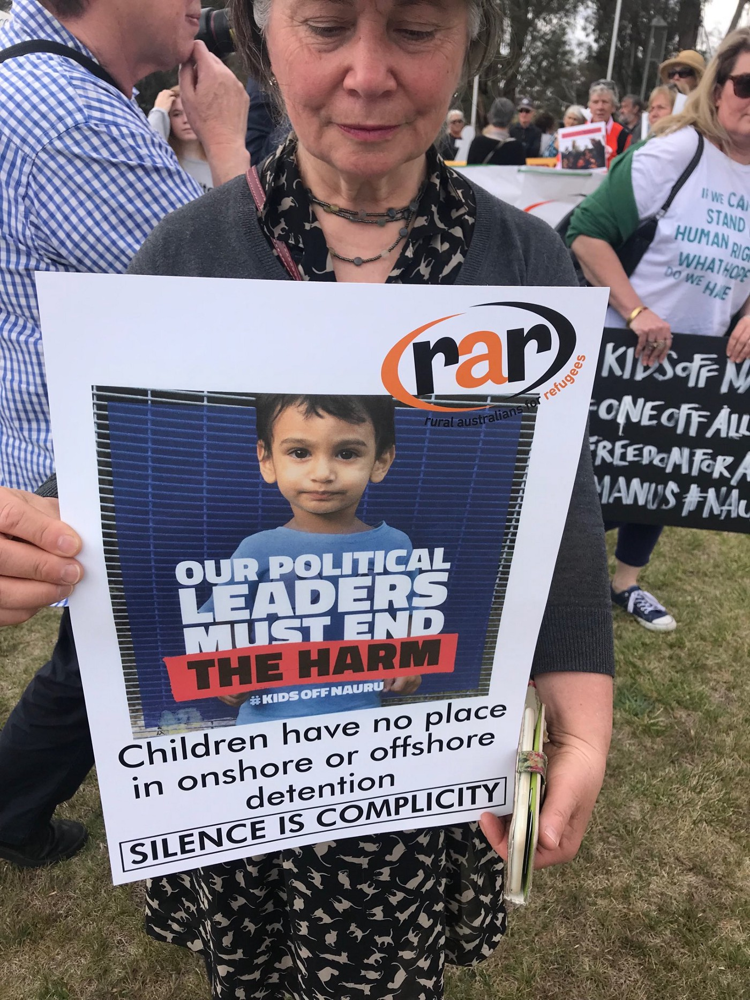

### AYS Newsletter 16/10/2018 — Winter is coming on the Bosnian\-Croatian border

Rescues in the Western and Central Mediterranean /// Syrian government demolishes refugees homes /// \#Lifttheban campaign for the right to work in the UK /// Challenges to “anti\-Soros” law in Hungary /// Child faces deportation in Sweden /// Protests in Australia to close Nauru deportation centre

\#noborders \(by Marco De Angelis, ArtAgainst\)
#### Feature: Winter is coming, updates from Velika Kladusa, Bosnia and Herzegovina by the No Name Kitchen

Velika Kladusa \(Photo by No Name Kitchen\)

From [No Name Kitchen update](https://www.facebook.com/NoNameKitchenBelgrade/posts/606785089719779) :

> This is Velika Kladuša, where 1\.161 people \(according to police\) are still living in a makeshift camp \(families included\), and the temperature at night this last week has dropped to almost 0 degrees\. 

Velika Kladusa \(Photo by No Name Kitchen\)

> _Us and [SOS Team Kladuša](https://www.facebook.com/SOSTeamKladusa/?__tn__=%2CdKH-R-R&eid=ARDX5bKwc80kU8k-3FGngwJXLqaXjY4tgQjcTWceuBVD2pPClsaT28jTGrrG08JxFfqc5ZTpRPDiiXkq&fref=mentions&hc_location=group) are the only ones distributing tents, blankets, sleeping bags and clothing in general before the inability of other bigger NGOs and official institutions to react to this situation\._ 

> This is not an exception, please consider that next time you make a donation and always choose a grassroots organization first\. 

Velika Kladusa \(Photo by No Name Kitchen\)

SYRIA
#### Government demolishes houses and denies property rights of refugees

While international powers and the Syrian government are publishing statements on the safety of the country to convince those who left the country to return home, the same government is denying property rights and access to residential areas in different areas of the country, HRW [report](https://www.hrw.org/news/2018/10/16/syria-residents-blocked-returning) s\.

In some cases, the government has already started to demolish entire residential complexes, especially in areas recently retaken from opposition groups\.

AFGHANISTAN
#### Report on child returnees from Save the Children

Save the Children has released a [report](https://campaigns.savethechildren.net/country/afghanistan) about the situation for children returned to Afghanistan from EU, highlighting the lack of protection they receive and the extreme danger they are placed in\. The report concluded that “Children returning to Afghanistan face difficulties in accessing reliable shelter, education, jobs and medical support, and risk recruitment to armed groups and physical harm due to conflict\. Child returnees face psychosocial and in some cases legal challenges, which render reintegration improbable and pose fundamental challenges to their wellbeing\. Currently, returns to Afghanistan cannot be considered durable\.”

They have started a campaign to end this practice and there is an active petition [here](https://aktion.savethechildren.de/?_ga=2.213298324.160257180.1539718094-1551635214.1539718094) \.

TURKEY
#### 22 people die in a truck accident near Izmir

22 people were killed on Sunday when a vehicle carrying refugees plunged off a road into a waterway in the area of Izmir\. According to media [sources](http://www.milliyet.com.tr/umuda-yolculuk-ta-9-5-ayda-123-kisi--yerelhaber-3094104/) , from the beginning of the year, 123 refugees have died trying to reach Greece\. Of those deaths, 82 have been by drowning and 41 by traffic accidents on land\. 229 persons were injured in these accidents\. In comparison, 51 people died by drowning in 2017\.

SEA
#### Updates from the Western Mediterranean

[Salvamento Maritimo](https://twitter.com/salvamentogob/status/1052273019610177537?s=21) report that the Marina Mimosa vessel picked up 12 men from a boat at sea, some with hypothermia, and took them to Cartagena, where they arrived at 3pm\.
#### Missing Migrants project update

■■■■■■■■■■■■■■ 
> **[IOM - UN Migration 🇺🇳](https://twitter.com/UNmigration) @ Twitter Says:** 

> > 88,736 #migrants &amp; #refugees arrived by sea to Europe in 2018.

1,839 dead/missing. Learn more ➡️[missingmigrants.iom.int](http://missingmigrants.iom.int) https://t.co/brpnSVe2T0 

> **Tweeted at [2018-10-16 08:08:47](https://twitter.com/unmigration/status/1052109082855960576).** 

■■■■■■■■■■■■■■ 

So far this year 1,839 people are confirmed to have died or gone missing during the sea crossing to Europe\. The actual figures may be much higher as some boats will never be reported\.
#### Sea Rescue groups continue to campaign for their right to save lives

■■■■■■■■■■■■■■ 
> **[Sea-Watch](https://twitter.com/seawatchcrew) @ Twitter Says:** 

> > "I am sure that anyone, when looking into the dilated pupils of a drowning person, would do as we do, would do this natural act of rescue. The issues of land are not discussed at sea. At sea you rescue."
@[giorgialinardi](https://twitter.com/giorgialinardi) in Palermo, on the return of #Mediterranea's #MareJonio 

> **Tweeted at [2018-10-16 09:31:58](https://twitter.com/seawatchcrew/status/1052130018720145408).** 

■■■■■■■■■■■■■■ 

Mediterranea Saving Humans report in this [video](https://www.facebook.com/erasmopalazz/videos/279897605831504/?hc_location=ufi) that they will continue to challenge European governments to apply the laws of the sea, international law and human rights, which these states are trying to erase\.

Meanwhile, [Maydayterraneo — Proyecto AitaMari](https://www.facebook.com/MAYDAYTERRANEO/posts/339697729912655?hc_location=ufi) asks for support so that they can continue their work at sea as they are about to set sail once again\.

GREECE
#### Arrivals

\(33 people arrived in Chios, photo by @smhumanitario\)

[Aegean Boat Report](https://www.facebook.com/AegeanBoatReport/posts/460226344500475?hc_location=ufi) report that three boats have arrived on the Greek islands today, carrying a total of 125 people\.

The first boat was picked up outside the airport by HCG, Lesvos south at 08\.30\. 57 people\. No breakdown available\.

The second boat arrived in Chios port at 08\.30 carrying 33 people, 5 children, 9 women and 19 men from Syria, Kuwait, Palestine, and Iraq\.

A further boat landed outside the Chios airport at 22\.00, carrying 35 people: 1 woman and 34 men\.

Land Arrivals: About 200 people were [reported](https://twitter.com/costaskantouris/status/1052198797978345472?s=21) to have waded across the Evros river today into Greece from Turkey\.
#### Latest statistics from the Greek Government

As you can see, all hotspots apart from the one on Leros are still dangerously over capacity\. The Immigration Minister, Dimitris Vitsas, [recently declared](https://www.lesvosnews.net/articles/news-categories/politiki/vitsas-de-tha-dimioyrgithoyn-nea-kentra-ypodohis-prosfygon-sta) that the only hotspot planned for closure, with the building of a replacement centre, is Samos\. Decongestion on the islands will instead rely on the accelerated asylum process, which should only take 90 days
#### Lesvos

■■■■■■■■■■■■■■ 
> **[NoBorders](https://twitter.com/Refugees_Gr) @ Twitter Says:** 

> > #refugeesgr 

> **Tweeted at [2018-10-16 17:50:33](https://twitter.com/refugees_gr/status/1052255488522375168).** 

■■■■■■■■■■■■■■ 

The German Economic Cooperation and Development Minister Gerd Müller clearly has quite low standards\. During his [recent visit to Moria](https://www.amna.gr/en/article/300911/German-Economic-Cooperation-and-Development-Minister-Mller-visits-Lesvos-) , he is reported to have been impressed by its organisation and operation\.

An [updated list](https://www.facebook.com/groups/201778590625231/permalink/317275725742183/?hc_location=ufi) has been created with all organisations present on Lesvos, including those which help with medical aid and housing\.
#### Chios
#### Update on the situation in Vial Camp and a request for support

> Whilst \#MoriaCamp receives the majority of the media’s attention, the plight of asylum\-seekers in \#VialCamp on \#Chios remains dire\. 

> Footage recently and anonymously shared with me reveals the reality of life in the camp\. The recent rains are but a taste of the upcoming winter\. Temperatures have already dropped considerably\. The camp holds more than 1000 above its capacity, meaning hundreds live in the open under canvas tents\. 

> This is the third year that effective \#winterisation of camps in Greece has failed to take place\. 

> Support the few safe spaces that provide relief for communities suffering these atrocious conditions: [www\.actionforeducation\.co\.uk/donate](http://www.actionforeducation.co.uk/donate) 

> \#Ντροπή \#Shame\. \#refugeesgr 

#### Mainland
#### The protest against conditions in Malakasa continues\.

■■■■■■■■■■■■■■ 
> **[Lia Gogou](https://twitter.com/LiaGogou) @ Twitter Says:** 

> > Let's keep fingers crossed that refugees in Malakasa camp with be transferred promptly to adequate accomodation #refugeesgr  [efsyn.gr/arthro/kala-ne…](http://www.efsyn.gr/arthro/kala-nea-gia-toys-prosfyges-tis-malakasas) 

> **Tweeted at [2018-10-16 16:41:06](https://twitter.com/liagogou/status/1052238014523396099).** 

■■■■■■■■■■■■■■ 

#### Athens — Volunteers needed

_Greek and foreign volunteers are most welcome at our Elliniko Warehouse to help in receiving, classifying and distributing humanitarian aid to refugees, immigrants, homeless people, etc\. of every nationality\._

_Please contact: Negia Milian: \+306944358460 \(Whatsapp\); [negiam\.gr@gmail\.com](mailto:negiam.gr@gmail.com)_

_\- Katerina Rouniou: \+306970523803; [rouniouk@gmail\.com](mailto:rouniouk@gmail.com)_

_\- Sotiris Alexopoulos\.: \+306906408586; s [otosalexopoulos@gmail\.com](mailto:sotosalexopoulos@gmail.com)_

ITALY

■■■■■■■■■■■■■■ 
> **[vincent cochetel](https://twitter.com/cochetel) @ Twitter Says:** 

> > Italy, interesting data on sea arrivals to #Italy. The number of people intercepted by the Libyan CG (14.500) is higher than the number of sea arrivals from Libya https://t.co/UUysb3FsWa 

> **Tweeted at [2018-10-16 12:35:26](https://twitter.com/cochetel/status/1052176187051651072).** 

■■■■■■■■■■■■■■ 

**Cargo ship rescues 18 people between Malta and Lampedusa**

Following yesterday’s report, the cargo ship Just Fitz rescued the 18 people in a dinghy on the night between Monday and Tuesday\. The most recent info stated that the ship was 34 miles south of Lampedusa\. Minister Salvini already commented that the responsibility for the rescue falls on Malta\. Is this the beginning of an other passing\-the\-buck game over people’s lives?

■■■■■■■■■■■■■■ 
> **[Sergio Scandura](https://twitter.com/scandura) @ Twitter Says:** 

> > #migranti UPDATE (12:29) 🔴 JUST FITZ SOTTO LAMPEDUSA. Segnalato stanotte dal RCC Malta, come 'rescue operation" nell'alert area del navtex per le 18 persone (vedi post👆precedenti), il cargo battente bandiera Isola Marshall è fermo a 34 miglia ca. sotto Lampedusa. https://t.co/XklqT6UGJe 

> **Tweeted at [2018-10-16 10:32:48](https://twitter.com/scandura/status/1052145325320937472).** 

■■■■■■■■■■■■■■ 

**Updates from Riace**

The house arrest of Mimmo Lucano, mayor of Riace, has been lifted, but the court decided to enact a prohibition against him residing in the town, de facto removing him from his mayoral role\.

The director of the SPRAR reception system [confirmed](http://www.redattoresociale.it/Notiziario/Articolo/601326/Riace-la-chiusura-dello-Sprar-Le-irregolarita-andavano-sanate-prima) that the Riace “experiment” has been shut down and refugees in Riace will be moved “on a voluntary basis”: if they want to keep benefiting from the reception system they will be taken to other cities; otherwise they will be able to remain in Riace but without allowance or support\.

HUNGARY
#### New campaign against criminalization of aid work

■■■■■■■■■■■■■■ 
> **[Amnesty Hungary](https://twitter.com/AmnestyHungary) @ Twitter Says:** 

> > Amnesty launches a constitutional complaint to challenge to shameful law on migration that targets civil society in #Hungary 

The law, which came into effect earlier this year, is a threat to the freedoms of expression, association and peaceful assembly.

[amnesty.eu/en/news/press-…](http://www.amnesty.eu/en/news/press-releases/all/hungary-amnesty-launches-legal-challenge-to-shameful-law-on-migration-that-targets-civil-societ-1146/) https://t.co/QzLonpgPU0 

> **Tweeted at [2018-10-15 11:29:53](https://twitter.com/amnestyhungary/status/1051797306381615104).** 

■■■■■■■■■■■■■■ 

FRANCE
#### Northern France

[L’Auberge des Migrants](https://www.facebook.com/AubergeMigrants/posts/10156396929835339?hc_location=ufi) reports that numbers in Calais are continuing to rise\. Currently, about 500 people are present in the area\.

In Grande\-Synthe, there are more than a thousand people and while the city hall and the sub\-Prefecture have just signed a protocol providing “shelter” for the exiles during winter, there are likely only 200 places in a building, as well as a few apartments for families\.
#### [CARE4CALAIS](https://www.facebook.com/care4calais/photos/a.1046164975416459/2137184976314448/?type=3&theater) ask for support

#### Eviction in Clermont Ferrand

Around 100 people who had been living in a makeshift camp in the “May the 1st” square in Clermont\-Ferrand \(southern France\) have been evicted and moved to a state run gymnasium for shelter\. They are in need of support\.

More info in French [here](https://twitter.com/ClermtFaitMonde/status/1051923696586252290) \.
#### Locker Room for Migrants, Paris, Call for Donations and Volunteers

> Emergencies for this week: Hygiene Products\! We are at ZERO on: Toothbrushes, toothpaste, shampoo, shower gel, razors, shaving cream, body cream, Dexeryl Cream, deodorant, nail clippers, eau de toilette\. 

> For Women: Sanitary towels, underwear\. 

> For Children: Diapers and milk\. 

> For Men: Shoes \(sneakers\) from 40 to 45, pants \(jeans\) size 38 to 42, sweatpants, shirts size s, boxers, belts, seasonal jackets, sleeping bags and back packs\. 

> We need volunteers on Wednesdays between 15 pm and 18 pm to sort and receive donations\. Saturdays and Sundays from 9 am to 14 pm for the distribution of clothes and also to receive donations\. 

> Note on the list by SMS at 06 03 02 83 72 

> Please, may your donations be in good condition\! \! \! Thanks to associations, collectives and people for their donations and support\. Thank you all for your solidarity\! 

Original in French [here](https://www.facebook.com/groups/P2PParis/permalink/1901564286597103/?hc_location=ufi) \.

SWEDEN
#### 6\-year\-old child faces deportation\.

The Swedish migration centre has decided to deport a 6\-year\-old back to Ukraine, local media sources [report](https://www.expressen.se/nyheter/mamman-dog-nu-ska-sexarige-denis-utvisas/) \.

Denis faces deportation several months after his mother’s death, in the spring\. She had applied for asylum and residency, but since a child’s asylum status is based on their parents, the case has now been closed\.

Denis’ grandparents, who have been living in Sweden for six years, said that they want to adopt him\. But despite this the Migration Agency decided to send him back to Ukraine, “in regard with what’s best for the child\.”

UK
#### \#Lifttheban campaign for the right to work of asylum seekers

In the coming days, Parliament will decide over the new counterterrorism bill, that “excessively restricts freedom of expression, freedom of movement, and privacy” \(read more [here](https://www.hrw.org/news/2018/10/15/uk-amend-flawed-counterterrorism-bill) \) \. Meanwhile, asylum seekers in the country are still banned from working and forced to live on an allowance of 5\.39£ per day\. On Tuesday, 88 organisations launched a campaign to \#lifttheban and allow asylum seekers to work\.

You can read the full report [here](https://y9w4d3a4.stackpathcdn.com/wp-content/uploads/2018/10/LiftTheBanReport-Singles.pdf) or [sign the petition](https://act.helprefugees.org/help-refugees/lift-the-ban/lift-the-ban/en/) directed to the Home Secretary\.

AUSTRALIA
#### \#KidsOffNauru

\(demonstration in Canberra, photo by @JSalmonupstream\)

As AYS reported last week,the campaign to close Nauru detention centre is ongoing\.

■■■■■■■■■■■■■■ 
> **[MSF Australia and New Zealand](https://twitter.com/MSFAustralia) @ Twitter Says:** 

> > Refugees &amp; asylum seekers are still trapped on #Nauru
We need to keep the pressure on, advocate on behalf of our patients &amp; tell the government to #evacuatenow!
Email the MPs that can end their detention 👉[change.org/MSFnauru](http://www.change.org/MSFnauru) https://t.co/hiaWbrDrId 

> **Tweeted at [2018-10-16 21:42:30](https://twitter.com/msfaustralia/status/1052313863826243584).** 

■■■■■■■■■■■■■■ 

Media sources report \( [1](https://www.smh.com.au/politics/federal/australia-s-chief-medical-officer-on-nauru-deported-amid-health-policy-crisis-20181017-p50a3r.html) , [2](https://www.abc.net.au/news/2018-10-17/australias-top-doctor-on-nauru-to-be-deported-today/10385970) \) that the chief medical officer contracted by the Australian government to work in the facilities was arrested on Tuesday and will be soon deported to Australia\. While the reasons of the arrest are not clear, several organisations point towards disagreements over health policies and the limitation to practice imposed by the Australian government as motives behind the arrest\. Moreover, the government of Nauru forbids doctors from photographing their patients “in order to prevent leaks to the media and refugee advocates”\.

GENERAL
#### Unite for Freedom fundraising campaign

[Refugee Youth Service](https://www.facebook.com/refugeeyouthservice/) started a fundraising campaign to support unaccompanied minors in Greece and France\.

Help them [here](https://www.charidy.com/rys?viewmode=2) \.

**We strive to echo correct news from the ground through collaboration and fairness\.**

**Every effort has been made to credit organizations and individuals with regard to the supply of information, video, and photo material \(in cases where the source wanted to be accredited\) \. Please notify us regarding corrections\.**

**If there’s anything you want to share or comment, contact us through Facebook or write to: areyousyrious@gmail\.com**

_Converted [Medium Post](https://medium.com/are-you-syrious/ays-newsletter-16-10-2018-winter-is-coming-on-the-bosnian-croatian-border-b575e01acd0c) by [ZMediumToMarkdown](https://github.com/ZhgChgLi/ZMediumToMarkdown)._
