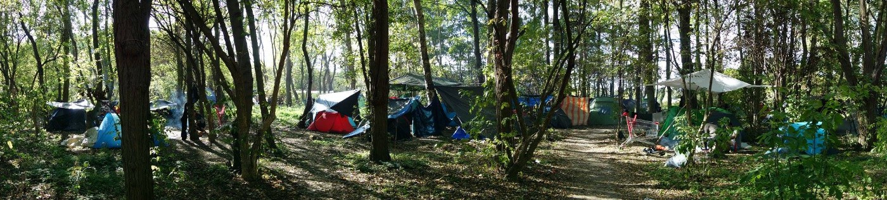

### AYS DAILY DIGEST 17/10/18: The Human Cost of Mismanaged Funds in Greece

_E\.U\. Council will meet, discuss refugee policy on Thursday // Malta and Italy play hot\-potato with rescue boats // Rumors of an eviction in Dunkirk // Albania and EU agree on border externalization deal // Help needed in the Balkans // One child’s deportation halted in Sweden — but others continue//London demo in support of jailed solidarity workers this Saturday_

](assets/c22c181f3822/1*PfNfCa_OZlX5nPwVen4RPw.jpeg)

Breakfast in Moria\. [Credit: Salam Aden](https://www.facebook.com/Fotomovimiento.org/posts/2013703528697218?hc_location=ufi)
#### Feature

As investigations into Greek misuse of EU funds meant to benefit refugees continue, the European Commission has released a timely report that gives a breakdown of EU financial support to Greece, detailing which EU fund disbursed which amount of money, and which Greek ministry received it\. Simply put, the EU has allocated over one billion euros to Greece since the refugee “crisis” began\.

Of course, not all of this money has been disbursed — though the amount paid thus far is around 506 million euros, still a staggering sum, especially given the disparity between this supposed output and the dismal reality of Greek refugee camps\. Some of it is due to be paid out over the next two years — though whether it will, with international scrutiny now on the Greek government’s mismanagement of colossal amounts of EU cash, remains to be seen\.

The human impact of this misuse is painfully evident in the testimony of Omar,\* a survivor of torture in his home country\. He crossed the Mediterranean and ended up on Leros, “one of Greece’s little Guantanamo Bays”\. There, he slept in a container with seven strangers: “Fights\. Arguments\. Violence\. Broken windows\. Shouting\. Self\-harm\. Addictions\. No privacy\. No sleep\. No safety\.”

**“This experience f\* \* \*ed my mind,” said Omar\. “It made me think about my experiences back home\. The two experiences became one\.”**

After months, Omar was sent to Athens, where he was interviewed by a member of MSF’s torture team\. Left out on the street by the Greek government, told to wait for housing by the UNHCR, he had ended up in a squat, the only place that would take him in\. “Accommodation is also not the squat’s responsibility,” Omar noted, “It is the government’s responsibility\.” And yet, faced with the seeming indifference of the government and big international organizations, squats in Athens shelter as many people as they can, struggling to provide basic sustenance\. [148 euro](https://www.paypal.me/Pampiraiki?fbclid=IwAR30dFd3D220niXedcOfs2fdN6tW5wQLOHzPAgvAivmUOcPhaG9VDSNygCg) s can buy food for 100 residents for a week\. What could they do with 506 million?

\*Omar’s name has been changed for protection\. Read his story on the [MSF website](https://www.msf.org/no-roof-no-recovery) , and the European Commission’s report in full [here](https://ec.europa.eu/home-affairs/sites/homeaffairs/files/what-we-do/policies/european-agenda-migration/20181010_managing-migration-eu-financial-support-to-greece_en.pdf?fbclid=IwAR1bdfKmlv7exwjZQNvVyuIYaS_2gXgzge335cKXafn_O3wURegd-rS6lX8) :

### EU

European leaders will discuss collective migration policy at their summit on Thursday\. On the agenda:

■■■■■■■■■■■■■■ 
> **[Odysseus Network](https://twitter.com/OdysseusNetwork) @ Twitter Says:** 

> > #Migration and internal security will be the topics for the October 2018 European Council meeting. #EU leaders will follow up on the discussions held at their informal meeting in Salzburg  and return more specifically to the #CEAS reform

[buff.ly/2EncDTj](https://buff.ly/2EncDTj) https://t.co/MxzrRY0mlh 

> **Tweeted at [2018-10-17 05:42:02](https://twitter.com/odysseusnetwork/status/1052434541086945280).** 

■■■■■■■■■■■■■■ 

In anticipation of the meeting, the UNHCR and IOM have [banded together](http://www.unhcr.org/news/press/2018/10/5bc6da414/unhcr-iom-appeal-european-leaders-tackle-mediterranean-deaths.html) to call on the EU to address the disturbing number of deaths at sea so far this year\. Below, a useful Twitter thread outlines European complicity in these deaths:

■■■■■■■■■■■■■■ 
> **[Philippe Dam](https://twitter.com/philippe_dam) @ Twitter Says:** 

> > EU / Migration: EU leaders are set to discuss migration policies at @EU_Council Summit on Oct. 18. Will #EUCO remain indifferent to raising death toll in the Central Med and the humanitarian situation on Greek Islands? Our thread below. https://t.co/hu6UXZQWu3 

> **Tweeted at [2018-10-17 12:23:57](https://twitter.com/philippe_dam/status/1052535687130619904).** 

■■■■■■■■■■■■■■ 

Sally Hayden, a journalist focusing on migration issues, notes that while it’s important to call out the EU’s negligence with regards to rescues in the Mediterranean, it’s hardly the only place where refugees are dying because of bad policies\. “The focus shouldn’t be just on deaths in the Med, bc that justifies the EU policy of paying the Libyans to intercept/’rescue’ refugees trying to escape,” she wrote on Twitter\.

■■■■■■■■■■■■■■ 
> **[Sally Hayden](https://twitter.com/sallyhayd) @ Twitter Says:** 

> > UNHCR &amp; IOM have released a statement "appealing to European leaders to tackle Mediterranean deaths", but don't mention the deaths in detention centres happening after the EU-backed coastguard forces refugees back to Libya &amp; into them. [twitter.com/Refugees/statu…](https://twitter.com/Refugees/status/1052593096419102726) 

> **Tweeted at [2018-10-17 19:03:23](https://twitter.com/sallyhayd/status/1052636209086951424).** 

■■■■■■■■■■■■■■ 

### Sea

287 people rescued off of five boats in the Alboran Sea today, according to Salvamento Marítimo\.
### Malta

A rescue boat with 44 asylum seekers aboard has finally disembarked in Malta, after being turned away from Lampedusa earlier in the day when the Italian government refused to let the boat dock\.

■■■■■■■■■■■■■■ 
> **[Matteo Villa](https://twitter.com/emmevilla) @ Twitter Says:** 

> > 🚢⛔️ 19.00 UTC+2 UPDATE. Migrants to be disembarked in #Malta.
It appears this was just another arm-wrestling between Italy and Malta, not something (much) more serious than that.

Surely, situation in Central Med continues to be unpredictable.

[gov.mt/en/Government/…](https://gov.mt/en/Government/Press%20Releases/Pages/2018/October/17/pr182250.aspx) 

> **Tweeted at [2018-10-17 17:01:15](https://twitter.com/emmevilla/status/1052605469754347520).** 

■■■■■■■■■■■■■■ 

### Greece

 \.](assets/c22c181f3822/1*TTpitQn_EXblGucIcYCvZg.jpeg)

“My smile is stronger than borders\.” Credit: [Through Refugee Eyes](https://www.facebook.com/throughrefugeeeyes/posts/872445593145212) \.

At last word from Aegean Boat Reports, seven boats have landed on the Greek islands on Wednesday, carrying 291 passengers\. Five of the boats landed on Lesvos, which remains drastically over capacity even as transfers to the mainland continue\.

According to ReliefWeb, 654 people arrived on the Aegean islands this past week, a significant decrease from both last week’s arrivals and last year’s arrivals for the same period of time\. Over 17,500 refugees remain trapped on the Aegean island hotspots, subject to the “geographical restriction” that prevents them from moving to mainland Greece while they wait for their asylum claims to be adjudicated\.

**An important notice on procedures for reporting unaccompanied minors in Greece:**

Volunteers from the Athens Volunteers Information and Coordination Group underscore that it’s incredibly important to be aware of the laws in Greece when dealing with unaccompanied minor children\. Though it’s tempting to want to take in and shelter children who might be living on the street or in an unsafe situation, it is illegal to house — or even know the whereabouts of — minors under the age of 15 without properly reporting that to the Greek authorities\. For more guidelines on dealing with minors in Greece, see the full Facebook [post](https://www.facebook.com/groups/AthensVolunteersInformation/permalink/1524559607676331/?hc_location=ufi) \.

The FEOX solidarity team’s warehouse, on Chios, is in need of clothing and other donations\. Items can be sent to their new address at SAVVA SEKIARI 25 VARVASI CHIOS T\.K 82100 GREECE:

> Sweaters S,M,L \(male\) 

> Long sleeves S\-M\-L\(male\)
 

> Trousers S,M,L,Xl \(male\) 

> Jackets S\-M\-L\-XL \(male\) 

> Underwear S\-M\-L\-XL \(male\) 

> Sweaters S,M,L \(female\) 

> Long sleeves S\-M\-L \(female\) 

> Trousers S,M,L \(female\)
 

> Underwear S\-M\-L\-XL \(female\)
 

> Jackets S\-M\-L\-XL \(female\) 

> socks \(male\-female\) 

> Jackets for kids 

> Pampers \(Nos 1, 2,3,4,5\) 

> Wet wipes 

> Powder milk for baby \(up to 3 years old\) 

> baby trolleys
 

> wheelchair
 

> 3 season scene
 

> waterproof awnings
 

> blankets 

> Shampoo
 

> Shower gel
 

> Deodorant
 

> Gillette for shaving
 

> women’s hygiene articles 

> Pasta, legumes, rice, canned tomato sauce\. 

### Albania

More border externalization — this time in Albania, a country that has been lobbying to join the EU since the early 2000s\. An unprecedented law signed between Europe and the Balkan nation will allow Frontex to enter Albanian territory, control its borders with Greece and Italy, and “coordinate voluntary and enforced return” of asylum seekers between EU and Albanian territory\. Macedonia and Serbia both like the deal and want to replicate it in their own countries, according to [reports](https://www.facebook.com/refugee.info/posts/1970588909667913) \.

[According](https://eeas.europa.eu/delegations/albania_en/6953/Albania%20and%20the%20EU) to the European External Action Service’s website, Albania is currently “working closely with the EU to complete reforms that will strengthen its political and economic ties with the EU\.” in anticipation of accession to the EU sometime in the next few years\.
### Bosnia

While the Balkan countries’ leaders mull over dangerous border externalization deals with the EU, their citizens are working hard every day to assure that asylum seekers stay warm this winter\.

A message from [Sos Team Kladusa— Bosnia](https://www.facebook.com/donate/536567570126136/2102987093251986/) :

> Winter is knocking on the door and we are still expecting people on the streets, trapped in completely inhumane and dangerous situations\. Regarding that we are in a hurry to prepare and be ready for the winter these days what fore we urgently need YOUR SUPPORT –
 

> Please support us, every euro counts\! Thanks and love from the border ♥ 

From [Open Borders](https://www.facebook.com/openeuborders/posts/2086750514987338?hc_location=ufi) :

> [Cars Of Hope Wuppertal](https://www.facebook.com/carsofhopewtal/?__tn__=K-R&eid=ARCBMKZsnGooOqRnqOZvxCEMihCnAumtCtX9NfJYuyfcXZmuobAjK7-_5Jhs-0_UovHdrh6MW6GVOf0C&fref=mentions&__xts__%5B0%5D=68.ARD2XF3duxBmX75LKoaJf7FNZsSxLO969t-upR8I2Wd3qj6dwX6IAkfk6TDajYYtOTTGFmNspNQE9ai5PTC7Plxgh6mPAGsCxNJ1_6hCeNSYo0lM9eiuEOvFqLaYiVG_Rvgs4Nq07Z_JrBMNsbOW13wxMvmgv5UcqGTQftwtz9CFM2LTMZg5cJ8G0cGPrjJn80J35_sFRGY) and [Enough is Enough](https://www.facebook.com/enough14/?__tn__=K-R&eid=ARB-MXEamBQ0emnIwplIST044jQWMW25_3ppkWeNF8ZkM4BvXEF0DkvZFqL3oLSnbSge1ytCsISIF39P&fref=mentions&__xts__%5B0%5D=68.ARD2XF3duxBmX75LKoaJf7FNZsSxLO969t-upR8I2Wd3qj6dwX6IAkfk6TDajYYtOTTGFmNspNQE9ai5PTC7Plxgh6mPAGsCxNJ1_6hCeNSYo0lM9eiuEOvFqLaYiVG_Rvgs4Nq07Z_JrBMNsbOW13wxMvmgv5UcqGTQftwtz9CFM2LTMZg5cJ8G0cGPrjJn80J35_sFRGY) are back in [\#VelikaKladuša](https://www.facebook.com/hashtag/velikakladu%C5%A1a?source=feed_text&__xts__%5B0%5D=68.ARD2XF3duxBmX75LKoaJf7FNZsSxLO969t-upR8I2Wd3qj6dwX6IAkfk6TDajYYtOTTGFmNspNQE9ai5PTC7Plxgh6mPAGsCxNJ1_6hCeNSYo0lM9eiuEOvFqLaYiVG_Rvgs4Nq07Z_JrBMNsbOW13wxMvmgv5UcqGTQftwtz9CFM2LTMZg5cJ8G0cGPrjJn80J35_sFRGY&__tn__=%2ANK-R) [\#Bosnia](https://www.facebook.com/hashtag/bosnia?source=feed_text&__xts__%5B0%5D=68.ARD2XF3duxBmX75LKoaJf7FNZsSxLO969t-upR8I2Wd3qj6dwX6IAkfk6TDajYYtOTTGFmNspNQE9ai5PTC7Plxgh6mPAGsCxNJ1_6hCeNSYo0lM9eiuEOvFqLaYiVG_Rvgs4Nq07Z_JrBMNsbOW13wxMvmgv5UcqGTQftwtz9CFM2LTMZg5cJ8G0cGPrjJn80J35_sFRGY&__tn__=%2ANK-R) to support refugees\. They are renovating a container that will be used as a medical point\. 

### Serbia

The organization Acción Norte has loaded a truck full of winter supplies — tents, sleeping bags, blankets, and warm\-weather clothes — to deliver to the Serbian city of Šid, in anticipation of a frigid winter ahead\. They need to raise 1,200 euros in order to get the truck to Šid — please, donate [here](https://www.facebook.com/permalink.php?story_fbid=1976759915956025&id=1566099837022037) if you are able\.
### Italy

](assets/c22c181f3822/1*8qdzoWJVig-iWaBeewkrZQ.jpeg)

“From Brennero to Claviere, against the border\!” [Credit: Chez Jesus](https://www.facebook.com/362786637540072/photos/a.362811254204277/480070722478329/?type=3&theater)

Amadou Jawo, a 22\-year\-old asylum seeker from the Gambia, committed suicide in Castellaneta Marina after his residence permit renewal was [denied](https://www.borderline24.com/2018/10/17/castellaneta-marina-asilo-politico-negato-22enne-gambiano-si-suicida/?fbclid=IwAR3A3B2oGSsPGIpsHQOe-f4OeLaAuwXKekBipdnujtNHQWwp_uGZaoZ2H6E) \.
### France

A panorama image of the Dunkirk makeshift camp\. Credit: Roots\.

Ahead of rumored evictions, [Roots](https://www.facebook.com/charitableroots/posts/2745957238962201?hc_location=ufi) did a complete walk\-through and survey of the camp in Dunkirk, counting 686 tents in total, holding around 1,500 people\.

](assets/c22c181f3822/1*uwscV3BrP3FWZIBh-CNY6g.jpeg)

Men queue for lunch in Dunkirk\. Credit: [Mobile Refugee Support\.](https://www.facebook.com/MobileRefugeeSupport/photos/pcb.857230371149242/857225827816363/?type=3&theater)

“One third of the children we meet during our missions in France live on the street,” according to Médicins du Monde\.

There will be a protest in solidarity with asylum seekers at Place de la République on the evening of October 27\. The event will feature artists, food, distribution, haircuts, and a photo exhibition\. Find out more below \(English [here](https://www.facebook.com/permalink.php?story_fbid=2176432869350007&id=100009499466124&hc_location=ufi) \):

### Germany

](assets/c22c181f3822/1*YMi8TvkLXA9YNLd_W0c_TQ.jpeg)

Flashmob in support of refugees in Jena\. [Credit: @SimeonTrux](https://twitter.com/SimeonTrux/status/1052301464415158272?fbclid=IwAR2QZUENPUkjXLF_GaT0EctpNPaFKkwyvxiC_Y7oPh6NroRvdIWQk5z6H3o)
### Sweden

After learning Swedish, enrolling in school, and making a new life for himself in Dalarna, a 12\-year\-old child named Obaid will be [deported](https://www.dalademokraten.se/logga-in/12-arige-obaid-skickas-till-afghanistan-utan-foraldrar-alla-ar-helt-forkrossade) back to Afghanistan — without his parents\.

Obaid faces a future in Afghanistan that is almost certain to include violence, uncertainty, and more trauma\. Following interviews with children, parents and other legal guardians in Afghanistan during the spring of 2018, Save the Children has publicly criticized Sweden’s return procedures\. In a press release, Ola Mattsson, Save the Children’s chief, said that Sweden and other EU member\-states are abandoning their responsibility to protect these children by deporting them\.

According to the organization, the returned \(deported\) children have been given either very limited or no support upon their return to Afghanistan\. About three\-fourths of the 53 children interviewed said they had felt unsafe during parts of the return process and more than half of the children told the researchers that they were exposed to either violence or some kind of force\. 45 of the interviewed children had been enrolled in school in Europe, but only 16 were now attending school in Afghanistan\. 10 children said that they had been approached by people trying to recruit them to commit some sort of violent act\. Several of the children said that they will try to leave the country again\.

The deportation of unaccompanied six\-year\-old Denis, whose mother died earlier this year while pursuing asylum in Sweden, has been temporarily halted, according to Swedish news outlet [Expressen](https://www.expressen.se/nyheter/migrationsverket-stoppar-utvisning-av-denis-6/) \. We reported on Denis’ case [yesterday](ays-daily-digest-16-10-2018-winter-is-coming-on-the-bosnian-croatian-border-f1488556b715) \.
### UK

This Saturday, October 20, there will be a demonstration in London in support of three solidarity workers who have been arrested, imprisoned, and charged with human trafficking by the Greek state\.

The organizers say: “We are trying to highlight the case currently against Seán, Sarah and Nassos and are asking for an end to the wrongful detention\. They are innocent until proven otherwise\. We simply want to highlight that they are upstanding members of their respective communities\.”

**We strive to echo correct news from the ground through collaboration and fairness\.**

**Every effort has been made to credit organizations and individuals with regard to the supply of information, video, and photo material \(in cases where the source wanted to be accredited\) \. Please notify us regarding corrections\.**

**If there’s anything you want to share or comment, contact us through Facebook or write to: areyousyrious@gmail\.com**

_Converted [Medium Post](https://medium.com/are-you-syrious/ays-daily-digest-17-10-18-the-human-cost-of-mismanaged-funds-in-greece-c22c181f3822) by [ZMediumToMarkdown](https://github.com/ZhgChgLi/ZMediumToMarkdown)._
