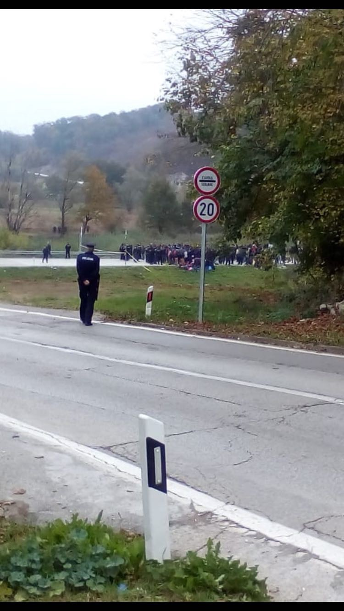
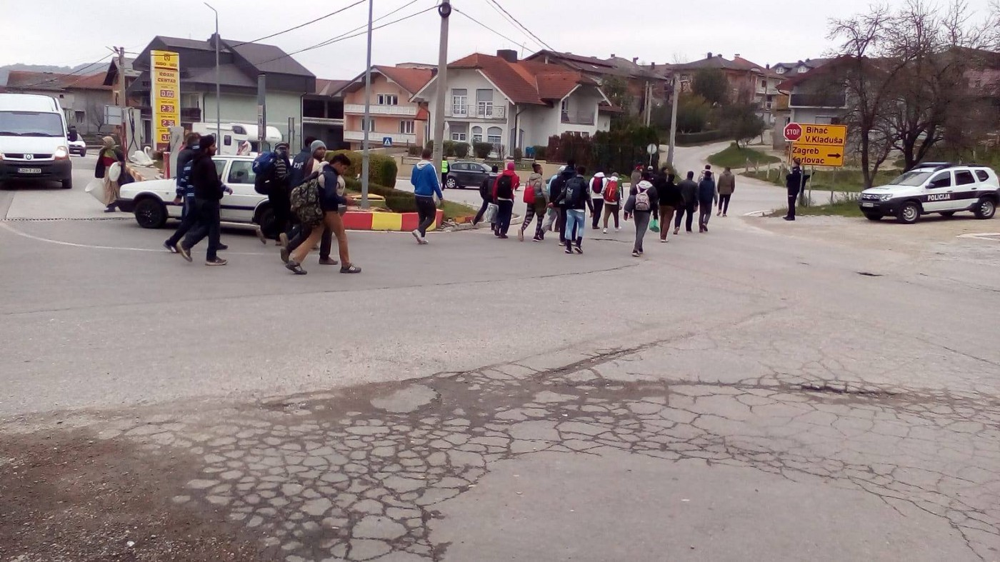
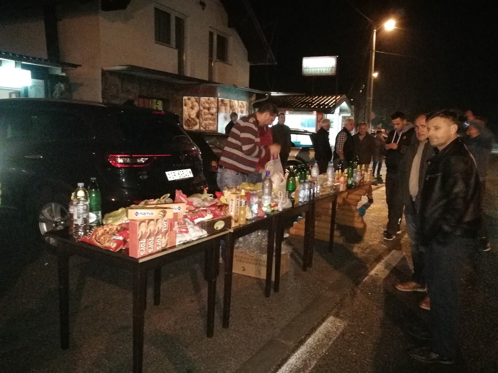
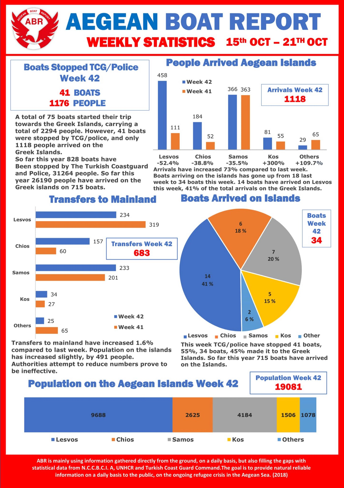

### AYS Daily Digest 22/10/18: Desperate steps towards the Croatian border
#### Protests and marches in Bosnia and Herzegovina / Two children lost their lives as a boat sank in Turkey / Additional assistance announced for Cyprus / 60 people returned from Spanish Melilla to Morocco / According to the EC, the Swedish legislation and controls are against EU\-law / more news

](assets/d077061cd453/1*_jxv4rN7VF_q4KqWqaYyTw.jpeg)

By Marco De Angelis, via [Art Against](https://www.facebook.com/artagainstproject/?tn-str=k%2AF)
#### FEATURE

About three years ago, the Croatian border was a place where thousands were passing through to Slovenia during the surge towards Western Europe, and groups of people from different places in the country did everything they could to help support people on their way\. Images of improvised shelters under the sky and children squeezed next to their parents by a fire circled the internet for a long time in an effort to report about what was going on and to evoke \(even induce\) empathy in people and responsibility in officials\.

> Same dates, different year and the other side of the same country’s border, the situation is worsening\. 

The same sight of locals providing simple meals, drinks and some clothes for those who, in the midst of citizen’s protests in Bihać, decided to make their troubles more visible to those around them and those pulling the strings\. In another desperate attempt to draw attention to their issue, a group of about **90 men, women and children left the reception centre in Cazin and started walking towards the Croatian border** \. According to the Bosnian [press report](https://www.cazin.net/vijesti/bh-policija-kordonom-sprijecila-migrante-da-udu-u-hrvatsku?amp&fbclid=IwAR1Hl_t5X2l125hgA2o8myt4MNPqgEwrLEym_JqgtGWR0oH0Szui-fJnpgs) , along the way, some dozens of other people joined the group\.

The families walking through rain towards the border area, more than 25km towards the border village of Izačić, received support and warm meals and beverages from the locals, who kept repeating they had experienced the same thing a while ago, during the war in the 90s in Bosnia\.

Another group that was walking towards the border from Velika Kladuša was also returned\.

](assets/d077061cd453/1*_pGqHZ0GjNZamW230pkI6A.jpeg)

Photos: Kladusa, on the way toward the border\. [No Name Kitchen](https://www.facebook.com/NoNameKitchenBelgrade/?tn-str=k%2AF&hc_location=group_dialog)

At the same time, the citizens in Bihać are protesting, saying the protests are not intended against the migrants, but that they are demanding that the responsibility and reception of migrants and refugees should be fairly distributed across the country\. In this city alone, there are more than 3,000 refugees, who are staying in improvised shelters\.

The people in the area speak of a lot of fights and some smuggling hot spots that have in the meantime sprung up across the town of Bihać, which is only to be expected if people are left with no care and in inhuman conditions\. With limited access to food or basics, the atmosphere is becoming very tense and difficult for everybody\.

With frustration building up, everyone’s [critiques are directed towards the officials and the responsible parties in the situation](https://www.klix.ba/vijesti/bih/biscani-i-veceras-na-trgu-protesti-nisu-usmjereni-protiv-migranata-vec-nadleznih-institucija/181022141?fbclid=IwAR2dammFOZnwlYbFikRck2EJGm2Wr_KQXxBiiZoUTU4Bt3HJ3AgKxA78nF8) \. Even the big humanitarian organizations present in the area, in the first place the IOM and UNHCR, as well as DRC, but also MSF, don’t seem to be vocal enough or to push the governments to take concrete steps in improving the constantly worsening situation\. So far they have mainly been playing the blame game\. It is always somebody else’s fault\.

At the same time, a number of international volunteers are in Bosnia at the moment, mostly helping through food and clothes donations on the ground\. For the most part, they are acting independently from the local population, who are actively engaged not only in helping people, but also in protesting and demanding better living conditions and respect for their basic rights, as was stated several times during the Monday happenings\. However, local people feel excluded from decision making processes, which is especially harmful in situations that require understanding of the often complex local context\.

In the meantime, there are too many people who are in Bosnia without proper accommodation provided, without any documents whatsoever \(though some have spent months and months in the country\) and with no legitimate way to move forward — living in Bosnia or searching for a decent life elsewhere\. The local government is avoiding issuing them with the proper documents, while the international organizations and many international volunteers are not willing to engage in this problem and to talk about it, or to talk about the border violence\.

On the other side of the border, in Croatia, army vehicles could be seen driving towards the border area throughout the late afternoon\.

](assets/d077061cd453/1*A4IW8jap9ZAm_zuqLa-gCg.jpeg)

People of Izačić on Monday evening, out in the street to do what they can — Photos: [Jasmin Halilagic](https://www.facebook.com/jasminhalilagic.jh?__tn__=%2Cd%2AF%2AF-R&eid=ARBJXhz3Uh_u8CeAQ1zXhati_WAGirHoIgckb7eSOs5cC9PGEUm0PBkLDRVBVTPHlQn8-W7Nk_Enww7L&tn-str=%2AF)

![“The people will always help\. \.the ordinary person\. \.we’re not responsible for this situation\. \.I too have helped personally, carrying shoes and food, but that is not enough\. \. Those who have received, and have on their disposal, millions and millions, they are not doing anything… They did not make sure to find proper accommodation and provide decent clothing… all that money lying somewhere and children are sleeping in the street… wet and hungry…” — a comment by one of the locals, mrs Suada \(Photo: [Jasmin Halilagic](https://www.facebook.com/jasminhalilagic.jh?__tn__=%2Cd%2AF%2AF-R&eid=ARBJXhz3Uh_u8CeAQ1zXhati_WAGirHoIgckb7eSOs5cC9PGEUm0PBkLDRVBVTPHlQn8-W7Nk_Enww7L&tn-str=%2AF) \)](assets/d077061cd453/1*pD6MPAn5UN_j9LiyHI1n0Q.jpeg)

“The people will always help\. \.the ordinary person\. \.we’re not responsible for this situation\. \.I too have helped personally, carrying shoes and food, but that is not enough\. \. Those who have received, and have on their disposal, millions and millions, they are not doing anything… They did not make sure to find proper accommodation and provide decent clothing… all that money lying somewhere and children are sleeping in the street… wet and hungry…” — a comment by one of the locals, mrs Suada \(Photo: [Jasmin Halilagic](https://www.facebook.com/jasminhalilagic.jh?__tn__=%2Cd%2AF%2AF-R&eid=ARBJXhz3Uh_u8CeAQ1zXhati_WAGirHoIgckb7eSOs5cC9PGEUm0PBkLDRVBVTPHlQn8-W7Nk_Enww7L&tn-str=%2AF) \)
#### GREECE
### Arrivals

### A boat heading to Greece sank off the Turkish coast

Speaking about [the boat carrying refugees that sank outside Bodrum](http://www.keeptalkinggreece.com/2018/10/22/refugee-boat-bodrum-turkey-children/?fbclid=IwAR0Y_XiI6s0S7QezG3WU_L9HZ-di7Byiehbu_gdVZaxVJRMdWtMUUY9Wy20) , west **Turkey** , while heading towards Kos, they said: “It was a small fiberglass boat, packed with 34 people\. The boat was made to carry 6–8 people\. It sank 50 meters away from land, within swimming distance for anyone who knows how to swim\. \. Two children lost their lives\.”

■■■■■■■■■■■■■■ 
> **[Lia Gogou](https://twitter.com/LiaGogou) @ Twitter Says:** 

> > @[AmnestyGreece](https://twitter.com/AmnestyGreece) calls Greek authorities to investigate humiliating abuse of refugee woman by police #Moria camp. Authorities ordered an disciplinary investIgation and one officer was suspended from his duties #policeabuseGr #Moria #refugeesGR 

> **Tweeted at [2018-10-22 13:51:34](https://twitter.com/liagogou/status/1054369674832629761).** 

■■■■■■■■■■■■■■ 

](assets/d077061cd453/1*uubKfkGWUbiBIA7L_kLT7w.jpeg)

photo: [Refugee Biriyani & Bananas](https://www.facebook.com/RefugeeBiriyaniAndBananas/?tn-str=k%2AF)
### Employment in Greece

A seminar under the title All I need to know to work in Greece — [My labor rights](https://www.facebook.com/events/460671751005871/) will take place next Thursday, on November 1, from 11h until 13\.30h at the offices of Generation 2\.0 RED \(n\.14 Eleftherias square\) \.

The topics that are going to be discussed are the following:
• What are the types of employment?
• What is Social Insurance \(IKA\)?
• To what I am entitled when I get fired?
• Why is the employment contract essential?

The event will be held in English with interpretation in Arabic, Farsi and Greek\.
To reserve a place, an email should be sent to k\.kapnisi@g2red\.org with full name and the required language for interpretation\.
### Volunteering

[Perspectives Art](https://www.facebook.com/perspectivesart/?__tn__=%2CdkCH-R-R&eid=ARD7yJUdIWB289E5B-1HJ1NfFq9DDfBYu1WSznMEr2fqS6xUTDYReGZDYDJO7c2qyFpFJUsVnzk1z1rC&hc_ref=ARTxnMV56K1JJK0fQR3WJs8BYzYxC4RMMsLeVAa7Cr4x8eMBF-6_onjxccP8llWrc7w&fref=nf) is looking for volunteers\. Please visit their page to find out more\.
#### CYPRUS

According to the [press](https://cyprus-mail.com/2018/10/21/eu-technical-team-to-visit-cyprus-for-additional-assistance-on-migration/?fbclid=IwAR0yLxkKCT1ULbovQTVyWMAOJDIPueQZi_83yri4XdEhxUD62o3yhco_AoE) , following the discussions held in Nicosia between Commissioner Dimitris Avramopoulos and the Cyprus ministerial committee last month, as well as Nicosia’s actions toward the EU institutions over the increased influx of migration to the island, a technical team of the DG General on Migration will visit Cyprus to meet Cypriot officials to examine ways for additional assistance through the Emergency Funds of the Asylum Funds\.
#### ITALY
### Network of solidarity municipalities

The sum of the inhabitants of the Municipalities participating in [the Network](https://www.facebook.com/Recosol/?__tn__=kC-R&eid=ARANA5wcaNQy5D3mClGWvf7XsMfaX3zzz9Irot_Oqf9jX1_wKWeO5d5JUM7EzaRfB_a-v9QdipWd4jOq&hc_ref=ARSbNUGVhhScs-bF2HMMLFO26jXiKsHT7c0vEsF1aJ-VlwCBU9bjQRxUACfZGTfdI2Y&fref=tag&__xts__%5B0%5D=68.ARBUuyThMfH7bd64ioonYxtBw3-GoKAz5wCNvJlKpsyvBEuc01KvB8AHhhWT19eA7fWURacFsQXnsODv6uGXTaOlZrkU6CJ6KTycHq28i0sFMVx1V9K3QjNR2QusZKjiadfvE5Gc_Lh4H_hziuPWQeEQWQhnpZvU9EY0BvzyqJjyuI8hi9jHiioVCJi24OP6rBsBTvnrrqLJ-ETnQJIfJ81Qbo72) is 264, and the communities represent five million inhabitants, [L’ ALTRA VOCE](https://www.facebook.com/L-ALTRA-VOCE-1245970425495921/?__tn__=kC-R&eid=ARCE3jux8y6kWeVMr1TOY99Tupzw5N56-RQ3E-_AsWlelHQYSJSJtqiGKdwC97-2b7CAlzRgaqzO57WR&hc_ref=ARSbNUGVhhScs-bF2HMMLFO26jXiKsHT7c0vEsF1aJ-VlwCBU9bjQRxUACfZGTfdI2Y&__xts__%5B0%5D=68.ARBUuyThMfH7bd64ioonYxtBw3-GoKAz5wCNvJlKpsyvBEuc01KvB8AHhhWT19eA7fWURacFsQXnsODv6uGXTaOlZrkU6CJ6KTycHq28i0sFMVx1V9K3QjNR2QusZKjiadfvE5Gc_Lh4H_hziuPWQeEQWQhnpZvU9EY0BvzyqJjyuI8hi9jHiioVCJi24OP6rBsBTvnrrqLJ-ETnQJIfJ81Qbo72) reports\.

 icofaro solely because priest Don Biancalani was hosting their usual ‘pizza with refugees’ night — Solidarity with migrants and refugees is once again targeted and treated as a crime: ask EU leaders to stop this worrying trend, sign the [petition](https://www.weareawelcomingeurope.eu/en/sign_the_petition/) \(Photo: [We are a welcoming Europe](https://www.facebook.com/WelcomingEurope/?__tn__=%2CdkCH-R-R&eid=ARAmZwJDghAa-Y8r--Hu14asxleyNpkWm8ENij--T-lhkH2N-kFGDT_9jKgmDl5TQXWklyXPuvgOe5Yi&hc_ref=ARQI4bhd4DPDxVAxLO4ARCWEdAQPzxbRf3RimoRXabCH9WNwVmgdS6vXx8BGx-RNQ9Y&fref=nf) \)](assets/d077061cd453/1*E3MzPToK3DN01aBu7cCGPA.jpeg)

Last Saturday, almost 50 police officers raided a church in [V](https://www.facebook.com/hashtag/vicofaro?source=feed_text) icofaro solely because priest Don Biancalani was hosting their usual ‘pizza with refugees’ night — Solidarity with migrants and refugees is once again targeted and treated as a crime: ask EU leaders to stop this worrying trend, sign the [petition](https://www.weareawelcomingeurope.eu/en/sign_the_petition/) \(Photo: [We are a welcoming Europe](https://www.facebook.com/WelcomingEurope/?__tn__=%2CdkCH-R-R&eid=ARAmZwJDghAa-Y8r--Hu14asxleyNpkWm8ENij--T-lhkH2N-kFGDT_9jKgmDl5TQXWklyXPuvgOe5Yi&hc_ref=ARQI4bhd4DPDxVAxLO4ARCWEdAQPzxbRf3RimoRXabCH9WNwVmgdS6vXx8BGx-RNQ9Y&fref=nf) \)
### News from Ventimiglia

“For two months, we have been distributing breakfast three times a week near the border in Menton, where migrants are forced into roofless shipping containers after being caught trying to pass the border\.

> Everyone from minors and pregnant woman to sick, handicapped, or elderly people are kept in the same container indiscriminately\. 

They are not supplied with food or water\. Every night up to 50 people are kept in these conditions, many for 24 hours straight\. 
After being released, everyone is forced to return to Ventimiglia, a 10 km walk through mountainous roads\. We are distributing water, tea, fruit, bread, jam, cookies and sometimes fish by the roadside, a small gesture to help them continue their journeys\.”

> We have reported cases of police brutality, as well as illegal refusals of the asylum process\. 

“But most importantly, we must raise awareness about this horrific treatment of other human beings\.” — [Kesha Niya](https://www.facebook.com/KeshaNiyaProject/?__tn__=%2CdkCH-R-R&eid=ARAPMa-GQhYnfUjyPoo-nzOxGpfCQpb1hUjkqAeavbl_IBB5uqkGlhu8Jd_Tc2e4MivO3wrpwXRVY2da&hc_ref=ARSFo_y2JZONpiJk-bHaAVAmjCDfHGc-3bqeLzz3roPjpiGvVpnSi_XBvUIghx9MMWE&fref=nf&hc_location=group)
#### SPAIN

Of the 208 migrants who crossed to Melilla on Sunday, nearly 60 were returned on Monday morning to Morocco by the Spanish authorities, the [Association Marocaine des Droits Humains — Section Nador](https://www.facebook.com/AmdhNador/?__tn__=%2CdkCH-R-R&eid=ARAFm87zb-01ZrndxUB2-yEtRBL6NGqGQqotJ5VQvr2oFC5ozucg0i7nrPRedzkK4lGRKOti5-eVIoZu&hc_ref=ARQX6KlAQ2YVnsrzchaFQ6mogAYtif7VomilEfD48sSts5QywBmAxSoTEBBNDU0UDDU&fref=nf) reports\.
The Moroccan police agreed to receive them and they were returned directly to the police station pending their return to Morocco\. The Association also states that with the new government in Spain, refoulement has become a common practice\.

Of the people who stayed,140 have asked for asylum, 3 were minors and 10 people were injured, hospitalized or needed rest for medical reasons, the [SOS Refugiados](https://www.facebook.com/sosrefugiados/?__tn__=%2CdkCH-R-R&eid=ARBhHqx6Ll8jlzKz2O_QNC2jUd7GgcXN0lKuhHXgmrwE9Bh9S14quR1VQPY3TVZmqRzwWoNmyIDPAh9I&hc_ref=ARTJvu7FYPOyq4mOsPIszJeP3GaN95EUUlYBN-2idRvqP0uF8GTZXFfuW9CVB5FWzK0&fref=nf&hc_location=group) team reports\.

In total, 1,050 people arrived by sea from Morrocco during the past week\.

■■■■■■■■■■■■■■ 
> **[Sergio Rodrigo](https://twitter.com/SRodrigoruiz) @ Twitter Says:** 

> > #FronteraSUR Llegan 235 personas rescatadas en el #Mediterráneo tras interceptar @[salvamentogob](https://twitter.com/salvamentogob) 6 balsas con las que cruzaban desde #Marruecos hacía #España. Están siendo atendidos por @[CREAndalucia](https://twitter.com/CREAndalucia) y serán trasladados al CATE de San Roque https://t.co/xFaitWE7M5 

> **Tweeted at [2018-10-22 22:20:56](https://twitter.com/srodrigoruiz/status/1054497860484513792).** 

■■■■■■■■■■■■■■ 

#### FRANCE
### [Help Refugees](https://www.facebook.com/HelpRefugeesUK/?__tn__=%2CdkCH-R-R&eid=ARA0TJGh0_6m7WdwiIRRrmNRQKVptLCPumwzywWEIXpbQXIFzc_sokwGM2h7A8Bj962WWzIh6z2dfEfw&hc_ref=ARRZ5MipsvUcb6_xVcegaswghz9o8Lqv1aPEnWrG_0b8ipvMMwIozmp_8Z00gvq9RCA) is collecting firewood

> Winter is coming and we need your help to raise £2,700 and cut, chop and distribute firewood to keep people warm until the end of the year\. 

> When a person has nothing, a fire can bring hope\. A fire can dry clothes, cook food and bring people together\. In the coldest, darkest hours of the night, a fire helps us feel human\. This is why we collect, chop and distribute wood during the winter months in Northern France\. 

[L’Auberge des Migrants](https://www.facebook.com/AubergeMigrants/?__tn__=%2CdkCH-R-R&eid=ARCVl9Y6Tm_OPCkum2lhVwVP2bvgj2gMA2Sysc5jIl_H5AUcuYSv6jrkJa1vg-znfDf5tJDkTP8mBgUh&hc_ref=ARQQyBdc-q861YolIHRLuW7r1RKInDdggzTJg7rs4chkWW4ho4Zl2PrgtQAzi31t4EA&fref=nf&hc_location=group) [reports](https://www.facebook.com/AubergeMigrants/photos/a.10152514841565339/10156409710785339/?type=3&__xts__%5B0%5D=68.ARBpEYgwJHMxF6_B5a6mFjQcTKdFWmUYTeFCmcem4Y85C_GndIfoOxLx3I4_IhgpKzJq2Em7_I5-iaXWDYbP4nS0aqJLMYYSiWRa25ID8TWJLTZGJZ0Y57Loy9XnQh30Kvli9YYJDdJ5nUpP2i5xbArqbHnPEBMJ4GxVOFWyX0V9W8APFhmTvJ4nt19pjq8TkZIXnlZN1MsasJv76zY808qusD66nQ&__tn__=-R) on the steps taken by France and Spain to implement the same mode of operation they have at the French\-Italian border to the French\-Spanish border\.
#### SWEDEN
### Sweden in breach of the Schengen framework

Sweden’s border controls are getting harsh criticism in a [new report from the EC](https://sverigesradio.se/sida/artikel.aspx?programid=83&artikel=7070744&fbclid=IwAR3xpsdWwPUTwd2-2e2aTky58jXX5Iv89ZAcp-IeBaiOal9kZtNDQnT_aLQ) , which hasn’t been made public yet\. According to the EC, the Swedish legislation and controls go against EU law in several aspects\. The responsible authorities, among them the border police and the Migration Agency, lacks a common framework\. This leads to an uncertain situation\. The report states that:

> Urgent action should be taken by the authorities to address the delays and gaps identified at both strategic and operational levels\. 

Patrik Engström, the chief of the border police, said that they have prioritized things other than external border controls since the year 2000\. He said that looking in the mirror, it is easy to reconsider and be wise after the event\. After a big reorganization in 2015, the issue disappeared from the agenda\.

According the EC, the Swedish border controls are currently in breach of the Schengen framework in several ways, since they are supposed to be of the same standard in the whole region\. At present, Swedish border control guards sometimes lack relevant training, for example\. The list is long: 95 wrongdoings are listed in the report\. Technology, phones and other things are also below Schengen standards\. According to Engström, the border police will work on developing their methods, but he estimates that they need at least five years to fix the shortcomings pointed out in the report\.

**We strive to echo correct news from the ground through collaboration and fairness\.**

**Every effort has been made to credit organizations and individuals with regard to the supply of information, video, and photo material \(in cases where the source wanted to be accredited\) \. Please notify us regarding corrections\.**

**If there’s anything you want to share or comment, contact us through Facebook or write to: areyousyrious@gmail\.com**

_Converted [Medium Post](https://medium.com/are-you-syrious/ays-daily-digest-22-10-18-desperate-steps-towards-the-croatian-border-d077061cd453) by [ZMediumToMarkdown](https://github.com/ZhgChgLi/ZMediumToMarkdown)._
